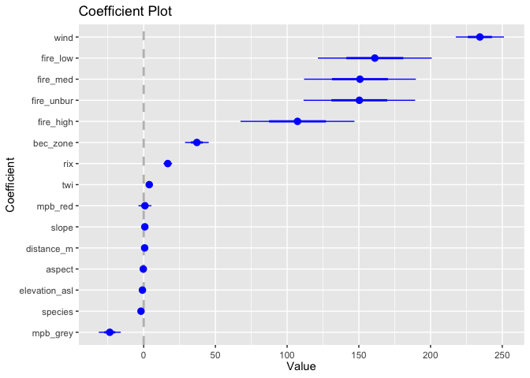
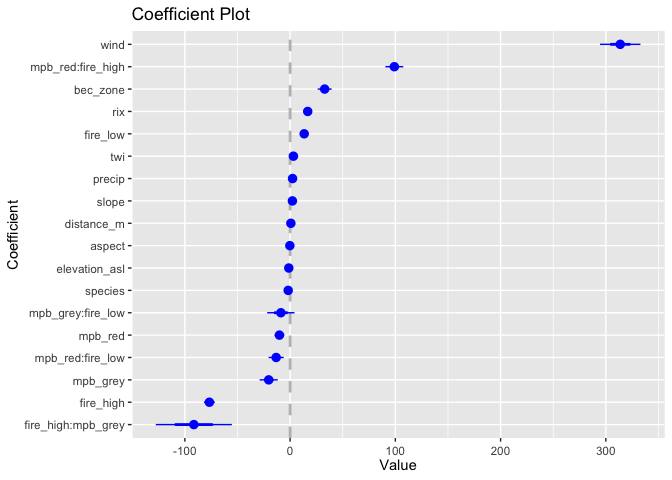
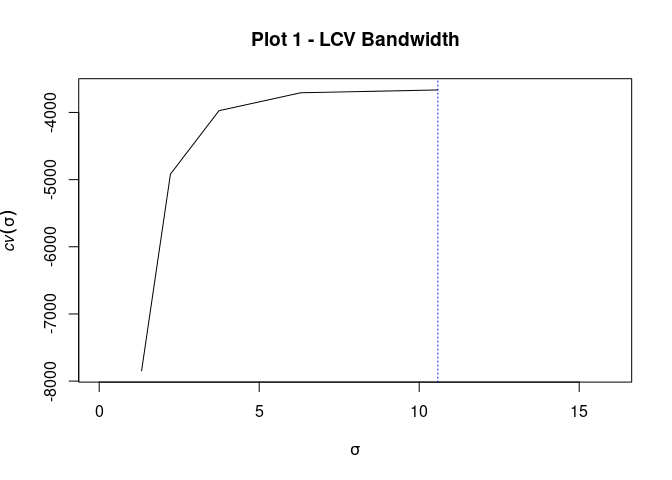
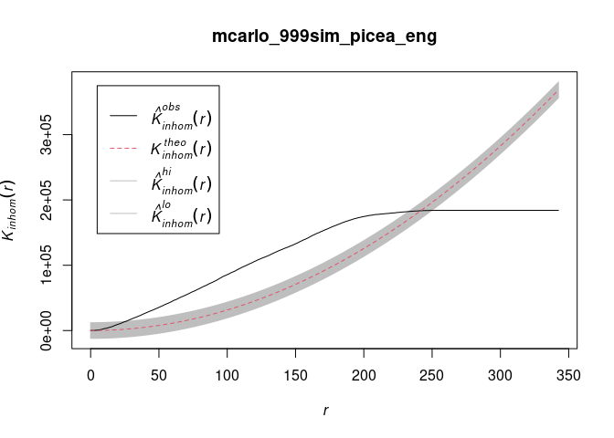
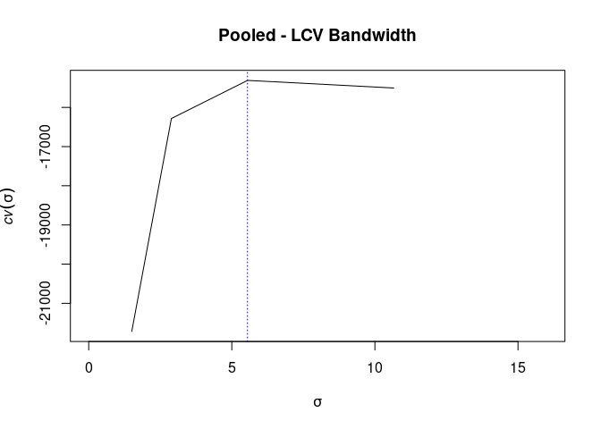

Spatial Point Pattern Processes of Conifer Seedlings
================
SMurphy
2021-01-30

- [0.1 Stage I: Covariate Selection](#01-stage-i-covariate-selection)
  - [0.1.1 Import Data](#011-import-data)
  - [0.1.2 Model Fitting](#012-model-fitting)
  - [0.1.3 Model Training](#013-model-training)
  - [0.1.4 Model Tuning](#014-model-tuning)
- [0.2 Stage II: Spatial Point Process
  Modelling](#02-stage-ii-spatial-point-process-modelling)
  - [0.2.1 Import Data](#021-import-data)
  - [0.2.2 Tidy Data](#022-tidy-data)
  - [0.2.3 Seedling Maps](#023-seedling-maps)
  - [0.2.4 Seedling Descriptives](#024-seedling-descriptives)
  - [0.2.5 Seedling Densities](#025-seedling-densities)
  - [0.2.6 Seedling Bandwidths](#026-seedling-bandwidths)
  - [0.2.7 Seedling Clustering](#027-seedling-clustering)
  - [0.2.8 Seedling Point Processes](#028-seedling-point-processes)

## 0.1 Stage I: Covariate Selection

### 0.1.1 Import Data

Seed set to `123` for replication. Import the
`1.1.darkwoods_seedlings.xls` dataset. This includes seedlings and
covariate values previously processed, classified and sampled from stem
locations of seedlings using ArcGIS environment.

``` r
set.seed(123)
darkwoods_seedlings_data <- readxl::read_excel("1.1.darkwoods_seedlings.xls")
darkwoods_seedlings_data
```

    # A tibble: 3,912 × 61
       data_point       x        y geodetic_datum plot123 plot1 plot2 plot3 bec_zone
            <dbl>   <dbl>    <dbl> <chr>            <dbl> <dbl> <dbl> <dbl>    <dbl>
     1          1 524355. 5446972. wgs84utm11n          3     0     0     1        2
     2          2 524350. 5446986. wgs84utm11n          3     0     0     1        2
     3          3 524350. 5446981. wgs84utm11n          3     0     0     1        2
     4          4 524350. 5446954. wgs84utm11n          3     0     0     1        2
     5          5 524202. 5447057. wgs84utm11n          3     0     0     1        2
     6          6 524185. 5447071. wgs84utm11n          3     0     0     1        2
     7          7 524215. 5447056. wgs84utm11n          3     0     0     1        2
     8          8 524197. 5447070. wgs84utm11n          3     0     0     1        2
     9          9 524197. 5447065. wgs84utm11n          3     0     0     1        2
    10         10 524225. 5447060. wgs84utm11n          3     0     0     1        2
    # ℹ 3,902 more rows
    # ℹ 52 more variables: bec_ichdw1 <dbl>, bec_ichmw4 <dbl>, bec_essfmw4 <dbl>,
    #   density <dbl>, intensity <dbl>, elevation_asl <dbl>, slope <dbl>,
    #   rix <dbl>, aspect <dbl>, precip <dbl>, twi <dbl>, wind <dbl>,
    #   species <dbl>, larix_spp <dbl>, pseudo_m <dbl>, picea_eng <dbl>,
    #   pinus_con <dbl>, pinus_pond <dbl>, pinus_albi <dbl>, thuja_plic <dbl>,
    #   tsuga_hete <dbl>, height_cm <dbl>, distance_m <dbl>, mpb_2005 <dbl>, …

``` r
# knitr::kable(head(darkwoods_seedlings_data))
```

For local deployment, package dependencies from this iteration are
loaded using the `requirements_I` variable.

``` r
requirements_I = install.packages(c("readxl", "sf", "kernlab",
    "ggplot2", "dplyr", "RColorBrewer", "psych", "useful", "caret",
    "tibble", "klaR", "ModelMetrics", "DescTools", "MLmetrics",
    "coefplot", "glmnet", "jsonlite", "plotly", "RSQLite", "tidyverse",
    "useful", "xgboost"), dependencies = TRUE)
# note warning messages are turned off for this chunk:
# 'warnings=FALSE'

requirements_I
```

### 0.1.2 Model Fitting

Derive OLS models to explore covariate effects against intercept only
models

``` r
seed_formula = intensity ~ distance_m + elevation_asl + slope +
    aspect + rix + twi + wind + mpb_grey + mpb_red + fire_high +
    fire_med + fire_low - 1

seed_formula2 = intensity ~ distance_m + elevation_asl + slope +
    aspect + rix + twi + wind + mpb_class + fire_high + fire_med +
    fire_low + fire_unbur - 1

seed_formula3 = intensity ~ distance_m + elevation_asl + slope +
    aspect + rix + twi + wind + mpb_grey + mpb_red + fire_high +
    fire_med + fire_low + fire_unbur + bec_zone - 1

seed_formula4 = intensity ~ distance_m + elevation_asl + slope +
    aspect + rix + twi + wind + mpb_grey + mpb_red + fire_high +
    fire_med + fire_low + fire_unbur + bec_zone + species - 1

seed_formula5 = intensity ~ distance_m + elevation_asl + slope +
    aspect + rix + twi + wind + mpb_grey + mpb_red + fire_high +
    fire_med + fire_low + fire_unbur + bec_zone + species + precip -
    1

# Fitted with disturbance interaction effects by mpb-class
# and fire-classes combined
seed_formula6.1 = intensity ~ distance_m + elevation_asl + slope +
    aspect + rix + twi + wind + bec_zone + species + precip +
    mpb_class * fire_class - 1

# Fitted with disturbance interaction effects by mpb-class
# and fire-classes combined
seed_formula6.2 = intensity ~ distance_m + elevation_asl + slope +
    aspect + rix + twi + wind + bec_zone + species + precip +
    mpb_red * fire_high + mpb_grey * fire_high + mpb_red * fire_low +
    mpb_grey * fire_low - 1

allseeds_lm = lm(seed_formula, data = darkwoods_seedlings_data)
allseeds_lm2 = lm(seed_formula2, data = darkwoods_seedlings_data)
allseeds_lm3 = lm(seed_formula3, data = darkwoods_seedlings_data)
allseeds_lm4 = lm(seed_formula4, data = darkwoods_seedlings_data)
allseeds_lm5 = lm(seed_formula5, data = darkwoods_seedlings_data)
allseeds_lm6.1 = lm(seed_formula6.1, data = darkwoods_seedlings_data)
allseeds_lm6.2 = lm(seed_formula6.2, data = darkwoods_seedlings_data)

coefplot::coefplot(allseeds_lm, sort = "magnitude")
coefplot::coefplot(allseeds_lm2, sort = "magnitude")
coefplot::coefplot(allseeds_lm3, sort = "magnitude")
coefplot::coefplot(allseeds_lm4, sort = "magnitude")
coefplot::coefplot(allseeds_lm5, sort = "magnitude")
coefplot::coefplot(allseeds_lm6.1, sort = "magnitude")
coefplot::coefplot(allseeds_lm6.2, sort = "magnitude")  #this seems the most interesting model
```



### 0.1.3 Model Training

Split into training and test data subset for each model with covariates
and repsonse variables mounted.

``` r
allseedsX_train <- useful::build.x(allseeds_lm, data = darkwoods_seedlings_data,
    contrasts = FALSE, sparse = TRUE)
allseedsY_train <- useful::build.y(allseeds_lm, data = darkwoods_seedlings_data)

allseedsX_train2 <- useful::build.x(allseeds_lm2, data = darkwoods_seedlings_data,
    contrasts = FALSE, sparse = TRUE)
allseedsY_train2 <- useful::build.y(allseeds_lm2, data = darkwoods_seedlings_data)

allseedsX_train3 <- useful::build.x(allseeds_lm3, data = darkwoods_seedlings_data,
    contrasts = FALSE, sparse = TRUE)
allseedsY_train3 <- useful::build.y(allseeds_lm3, data = darkwoods_seedlings_data)

allseedsX_train4 <- useful::build.x(allseeds_lm4, data = darkwoods_seedlings_data,
    contrasts = FALSE, sparse = TRUE)
allseedsY_train4 <- useful::build.y(allseeds_lm4, data = darkwoods_seedlings_data)

allseedsX_train5 <- useful::build.x(allseeds_lm5, data = darkwoods_seedlings_data,
    contrasts = FALSE, sparse = TRUE)
allseedsY_train5 <- useful::build.y(allseeds_lm5, data = darkwoods_seedlings_data)

allseedsX_train6.1 <- useful::build.x(allseeds_lm6.1, data = darkwoods_seedlings_data,
    contrasts = FALSE, sparse = TRUE)
allseedsY_train6.1 <- useful::build.y(allseeds_lm6.1, data = darkwoods_seedlings_data)

allseedsX_train6.2 <- useful::build.x(allseeds_lm6.2, data = darkwoods_seedlings_data,
    contrasts = FALSE, sparse = TRUE)
allseedsY_train6.2 <- useful::build.y(allseeds_lm6.2, data = darkwoods_seedlings_data)
```

### 0.1.4 Model Tuning

From the `glmnet` package, covariates are fitted to a generalised linear
model over an elastic-net (latticed plane) in order to explore their
effects under varying lambdas. The `alpha=1` function is used to fit a
lasso-model with a lambda that suppresses outliers, and the `alpha=0`
function fits a ridge-based lambda to empower correlation. Adding the
`nfolds` function, we apply a 10K-fold cross validation and then compare
coeffients visually using the `coefpath` function from the `coefplot`
package. Zoom in on graphs to determine the remaining predictors as the
model approaches a mean of zero. Most interesting model seems to 6.1.

``` r
allseeds_glmnet_lasso_cv_10fold <- glmnet::cv.glmnet(x = allseedsX_train,
    y = allseedsY_train, family = "gaussian", alpha = 1, nfolds = 10)
allseeds_glmnet_ridge_cv_10fold <- glmnet::cv.glmnet(x = allseedsX_train,
    y = allseedsY_train, family = "gaussian", alpha = 0, nfolds = 10)
allseeds_glmnet_lasso2_cv_10fold <- glmnet::cv.glmnet(x = allseedsX_train2,
    y = allseedsY_train2, family = "gaussian", alpha = 1, nfolds = 10)
allseeds_glmnet_ridge2_cv_10fold <- glmnet::cv.glmnet(x = allseedsX_train2,
    y = allseedsY_train2, family = "gaussian", alpha = 0, nfolds = 10)
allseeds_glmnet_lasso3_cv_10fold <- glmnet::cv.glmnet(x = allseedsX_train3,
    y = allseedsY_train3, family = "gaussian", alpha = 1, nfolds = 10)
allseeds_glmnet_ridge3_cv_10fold <- glmnet::cv.glmnet(x = allseedsX_train3,
    y = allseedsY_train3, family = "gaussian", alpha = 0, nfolds = 10)
allseeds_glmnet_lasso4_cv_10fold <- glmnet::cv.glmnet(x = allseedsX_train4,
    y = allseedsY_train4, family = "gaussian", alpha = 1, nfolds = 10)
allseeds_glmnet_ridge4_cv_10fold <- glmnet::cv.glmnet(x = allseedsX_train4,
    y = allseedsY_train4, family = "gaussian", alpha = 0, nfolds = 10)
allseeds_glmnet_lasso5_cv_10fold <- glmnet::cv.glmnet(x = allseedsX_train5,
    y = allseedsY_train5, family = "gaussian", alpha = 1, nfolds = 10)
allseeds_glmnet_ridge5_cv_10fold <- glmnet::cv.glmnet(x = allseedsX_train5,
    y = allseedsY_train5, family = "gaussian", alpha = 0, nfolds = 10)
allseeds_glmnet_lasso6.1_cv_10fold <- glmnet::cv.glmnet(x = allseedsX_train6.1,
    y = allseedsY_train6.1, family = "gaussian", alpha = 1, nfolds = 10)
allseeds_glmnet_ridge6.1_cv_10fold <- glmnet::cv.glmnet(x = allseedsX_train6.1,
    y = allseedsY_train6.1, family = "gaussian", alpha = 0, nfolds = 10)
allseeds_glmnet_lasso6.2_cv_10fold <- glmnet::cv.glmnet(x = allseedsX_train6.2,
    y = allseedsY_train6.2, family = "gaussian", alpha = 1, nfolds = 10)
allseeds_glmnet_ridge6.2_cv_10fold <- glmnet::cv.glmnet(x = allseedsX_train6.2,
    y = allseedsY_train6.2, family = "gaussian", alpha = 0, nfolds = 10)

plot(allseeds_glmnet_lasso6.2_cv_10fold)
```

<!-- -->

``` r
coefplot::coefpath(allseeds_glmnet_lasso6.2_cv_10fold)
```

<!-- -->

``` r
plot(allseeds_glmnet_ridge6.2_cv_10fold)
```

<!-- -->

``` r
coefplot::coefpath(allseeds_glmnet_ridge6.2_cv_10fold)
```

<!-- -->

## 0.2 Stage II: Spatial Point Process Modelling

### 0.2.1 Import Data

In this section, we use three separate datasets. One is already loaded,
the main seedlings dataset above. Two more are imported as excel and
raster files and renamed below. Separate datasets of specific formats
are required by the `spatstat` package depending on spatial modelling
operations, including conversion of covariates into `.img` image files
in the code chunk after this.

1.  `darkwoods_seedlings_data` - already loaded excel file from above,
2.  `darkwoods_seedlings_tree_distance` - excel file showing
    seed-distance,
3.  Rasters x 11 showing terrain, climate, and disturbance covariates.

Package requirements for stage-II listed below.

``` r
requirements_II = install.packages(c("spdep", "gstat", "rgdal",
    "maptools", "raster", "spatstat", "GISTools", "rgeos", "sp",
    "rpanel", "ncf", "spatial", "spatstat.data", "spatstat.local",
    "dplyr", "RColorBrewer", "jsonlite", "plotly", "RSQLite",
    "tidyverse", "useful", "xgboost"), dependencies = TRUE)
requirements_II  # settings on 'warnings=FALSE'
```

``` r
darkwoods_seedlings_tree_distance = read_excel("1.2.darkwoods_seedlings_distance.xls")
darkwoods_seedlings_tree_distance
```

    # A tibble: 3,866 × 3
             x        y distance_m
         <dbl>    <dbl>      <dbl>
     1 524355. 5446972.       16.6
     2 524350. 5446986.       14.2
     3 524350. 5446981.       15.5
     4 524350. 5446954.       38.3
     5 524202. 5447057.       29.2
     6 524185. 5447071.       31.7
     7 524215. 5447056.       26.8
     8 524197. 5447070.       29.0
     9 524197. 5447065.       29.7
    10 524225. 5447060.       24.3
    # ℹ 3,856 more rows

``` r
# knitr::kable(head(darkwoods_seedlings_tree_distance))

elevation_utm = readAll(raster("~/Desktop/git_repos/darkwoods_seedlings/SpatialData/elevation_utm.tif"))
aspect_utm = readAll(raster("~/Desktop/git_repos/darkwoods_seedlings/SpatialData/aspect_utm.tif"))
slope_utm = readAll(raster("~/Desktop/git_repos/darkwoods_seedlings/SpatialData/slope_utm.tif"))
rix_utm = readAll(raster("~/Desktop/git_repos/darkwoods_seedlings/SpatialData/rix_utm.tif"))
twi_utm = readAll(raster("~/Desktop/git_repos/darkwoods_seedlings/SpatialData/twi_utm.tif"))
wind_utm = readAll(raster("~/Desktop/git_repos/darkwoods_seedlings/SpatialData/wind_utm.tif"))
mpb_grey_utm = readAll(raster("~/Desktop/git_repos/darkwoods_seedlings/SpatialData/mpb_grey_na.tif"))
mpb_red_utm = readAll(raster("~/Desktop/git_repos/darkwoods_seedlings/SpatialData/mpb_red_na.tif"))
fire_high_utm = readAll(raster("~/Desktop/git_repos/darkwoods_seedlings/SpatialData/fire_high_na.tif"))
fire_med_utm = readAll(raster("~/Desktop/git_repos/darkwoods_seedlings/SpatialData/fire_med_na.tif"))
fire_low_utm = readAll(raster("~/Desktop/git_repos/darkwoods_seedlings/SpatialData/fire_low_na.tif"))
```

### 0.2.2 Tidy Data

Convert datasets of seedlings and seed-distance from `sf` simple feature
objects, to `sp` spatial objects, to `ppp` point pattern process
objects. This is the required conversion flow for `ppp` objects. Then
convert covariate rasters and seed-distance from `ppp` objects to `.img`
image objects. Make sure to complete all transformations and data
cleaning at the ‘sf’ stage.

The `crsProject` variable sets projections to `EPSG:32611`. Question, is
it better practice to reproject everything to the LiDAR’s *original*
coordinate system than to reproject everything to Landsat’s *official*
projection? Although our higher-resolution LiDAR is superior in terms of
georeferencing accuracy, most important predictors are Landsat-derived.
Additionally, field equipment was calibrated to `EPSG:3005`.

``` r
# Project crs projection
crsProject = st_crs("EPSG:32611")
# Convert to sf
seedlings_allplots_sf = st_as_sf(darkwoods_seedlings_data, coords = c("x",
    "y"), crs = crsProject)

distance_tree = st_as_sf(darkwoods_seedlings_tree_distance, coords = c("x",
    "y"), crs = crsProject)

# Factorise and relabel
seedlings_allplots_sf$plot1 = factor(seedlings_allplots_sf$plot1)
seedlings_allplots_sf$plot2 = factor(seedlings_allplots_sf$plot2)
seedlings_allplots_sf$plot3 = factor(seedlings_allplots_sf$plot3)
seedlings_allplots_sf$plot123 = factor(seedlings_allplots_sf$plot123)
seedlings_allplots_sf$bec_zone = factor(seedlings_allplots_sf$bec_zone)
seedlings_allplots_sf$species <- factor(seedlings_allplots_sf$species,
    levels = c(0, 1, 2, 3, 4, 5, 7), labels = c("Larix occidentalis",
        "Pseudostuga menzeisii", "Picea endelmannii", "Pinus contorta",
        "Pinus ponderosa", "Pinus monticola", "Tsuga heterophylla"))

# Convert sf to sp to ppp pbjects
seedlings_allplots_sp = as(seedlings_allplots_sf, "Spatial")
seedlings_allplots_ppp = as(seedlings_allplots_sp, "ppp")

distance_tree_sp = as(distance_tree, "Spatial")
distance_tree_ppp = as(distance_tree_sp, "ppp")
distance_tree_im = as.im.ppp(distance_tree_ppp)

elevation_im = as.im(elevation_utm)
aspect_im = as.im.RasterLayer(aspect_utm)
slope_im = as.im.RasterLayer(slope_utm)
rix_im = as.im.RasterLayer(rix_utm)
twi_im = as.im.RasterLayer(twi_utm)
wind_im = as.im.RasterLayer(wind_utm)
mpb_grey_im = as.im.RasterLayer(mpb_grey_utm)
mpb_red_im = as.im.RasterLayer(mpb_red_utm)
fire_high_im = as.im.RasterLayer(fire_high_utm)
fire_med_im = as.im.RasterLayer(fire_med_utm)
fire_low_im = as.im.RasterLayer(fire_low_utm)
```

Subset seedlings by plot and by species at the `sp` and `ppp` stages to
enable plotting and model fitting. For global analysis, plot subsamples
are pooled using ratio-estimation function: `superimpose`

``` r
seedlings_plot1_sp = subset(seedlings_allplots_sp, plot1 == 1)
seedlings_plot2_sp = subset(seedlings_allplots_sp, plot2 == 1)
seedlings_plot3_sp = subset(seedlings_allplots_sp, plot3 == 1)
seedlings_plot1_ppp = subset(seedlings_allplots_ppp, plot1 ==
    1)
seedlings_plot2_ppp = subset(seedlings_allplots_ppp, plot2 ==
    1)
seedlings_plot3_ppp = subset(seedlings_allplots_ppp, plot3 ==
    1)

larix_spp_allplots_sp = subset(seedlings_allplots_sp, larix_spp ==
    1)
pseudo_m_allplots_sp = subset(seedlings_allplots_sp, pseudo_m ==
    1)
picea_eng_allplots_sp = subset(seedlings_allplots_sp, picea_eng ==
    1)
pinus_con_allplots_sp = subset(seedlings_allplots_sp, pinus_con ==
    1)
pinus_pond_allplots_sp = subset(seedlings_allplots_sp, pinus_pond ==
    1)
pinus_monti_allplots_sp = subset(seedlings_allplots_sp, pinus_albi ==
    1)
tsuga_hete_allplots_sp = subset(seedlings_allplots_sp, tsuga_hete ==
    1)
larix_spp_allplots_ppp = subset(seedlings_allplots_ppp, larix_spp ==
    1)
pseudo_m_allplots_ppp = subset(seedlings_allplots_ppp, pseudo_m ==
    1)
picea_eng_allplots_ppp = subset(seedlings_allplots_ppp, picea_eng ==
    1)
pinus_con_allplots_ppp = subset(seedlings_allplots_ppp, pinus_con ==
    1)
pinus_pond_allplots_ppp = subset(seedlings_allplots_ppp, pinus_pond ==
    1)
pinus_monti_allplots_ppp = subset(seedlings_allplots_ppp, pinus_albi ==
    1)
tsuga_hete_allplots_ppp = subset(seedlings_allplots_ppp, tsuga_hete ==
    1)

# Plot 1 by species
larix_spp_plot1_sp = subset(seedlings_plot1_sp, larix_spp ==
    1)
pseudo_m_plot1_sp = subset(seedlings_plot1_sp, pseudo_m == 1)
picea_eng_plot1_sp = subset(seedlings_plot1_sp, picea_eng ==
    1)
pinus_con_plot1_sp = subset(seedlings_plot1_sp, pinus_con ==
    1)
pinus_pond_plot1_sp = subset(seedlings_plot1_sp, pinus_pond ==
    1)
pinus_monti_plot1_sp = subset(seedlings_plot1_sp, pinus_albi ==
    1)
tsuga_hete_plot1_sp = subset(seedlings_plot1_sp, tsuga_hete ==
    1)
larix_spp_plot1_ppp = subset(seedlings_plot1_ppp, larix_spp ==
    1)
pseudo_m_plot1_ppp = subset(seedlings_plot1_ppp, pseudo_m ==
    1)
picea_eng_plot1_ppp = subset(seedlings_plot1_ppp, picea_eng ==
    1)
pinus_con_plot1_ppp = subset(seedlings_plot1_ppp, pinus_con ==
    1)
pinus_pond_plot1_ppp = subset(seedlings_plot1_ppp, pinus_pond ==
    1)
pinus_monti_plot1_ppp = subset(seedlings_plot1_ppp, pinus_albi ==
    1)
tsuga_hete_plot1_ppp = subset(seedlings_plot1_ppp, tsuga_hete ==
    1)

# Plot 2 by species
larix_spp_plot2_sp = subset(seedlings_plot2_sp, larix_spp ==
    1)
pseudo_m_plot2_sp = subset(seedlings_plot2_sp, pseudo_m == 1)
picea_eng_plot2_sp = subset(seedlings_plot2_sp, picea_eng ==
    1)
pinus_con_plot2_sp = subset(seedlings_plot2_sp, pinus_con ==
    1)
pinus_pond_plot2_sp = subset(seedlings_plot2_sp, pinus_pond ==
    1)
pinus_monti_plot2_sp = subset(seedlings_plot2_sp, pinus_albi ==
    1)
tsuga_hete_plot2_sp = subset(seedlings_plot2_sp, tsuga_hete ==
    1)
larix_spp_plot2_ppp = subset(seedlings_plot2_ppp, larix_spp ==
    1)
pseudo_m_plot2_ppp = subset(seedlings_plot2_ppp, pseudo_m ==
    1)
picea_eng_plot2_ppp = subset(seedlings_plot2_ppp, picea_eng ==
    1)
pinus_con_plot2_ppp = subset(seedlings_plot2_ppp, pinus_con ==
    1)
pinus_pond_plot2_ppp = subset(seedlings_plot2_ppp, pinus_pond ==
    1)
pinus_monti_plot2_ppp = subset(seedlings_plot2_ppp, pinus_albi ==
    1)
tsuga_hete_plot2_ppp = subset(seedlings_plot2_ppp, tsuga_hete ==
    1)

# Plot 3 by species
larix_spp_plot3_sp = subset(seedlings_plot3_sp, larix_spp ==
    1)
pseudo_m_plot3_sp = subset(seedlings_plot3_sp, pseudo_m == 1)
picea_eng_plot3_sp = subset(seedlings_plot3_sp, picea_eng ==
    1)
pinus_con_plot3_sp = subset(seedlings_plot3_sp, pinus_con ==
    1)
pinus_pond_plot3_sp = subset(seedlings_plot3_sp, pinus_pond ==
    1)
pinus_monti_plot3_sp = subset(seedlings_plot3_sp, pinus_albi ==
    1)
tsuga_hete_plot3_sp = subset(seedlings_plot3_sp, tsuga_hete ==
    1)
larix_spp_plot3_ppp = subset(seedlings_plot3_ppp, larix_spp ==
    1)
pseudo_m_plot3_ppp = subset(seedlings_plot3_ppp, pseudo_m ==
    1)
picea_eng_plot3_ppp = subset(seedlings_plot3_ppp, picea_eng ==
    1)
pinus_con_plot3_ppp = subset(seedlings_plot3_ppp, pinus_con ==
    1)
pinus_pond_plot3_ppp = subset(seedlings_plot3_ppp, pinus_pond ==
    1)
pinus_monti_plot3_ppp = subset(seedlings_plot3_ppp, pinus_albi ==
    1)
tsuga_hete_plot3_ppp = subset(seedlings_plot3_ppp, tsuga_hete ==
    1)

# All plots by species pooled by ratio-estimation
seedlings_pooled = superimpose(seedlings_plot1_ppp, seedlings_plot2_ppp,
    seedlings_plot3_ppp)
pinus_con_pooled = superimpose(pinus_con_plot1_ppp, pinus_con_plot2_ppp,
    pinus_con_plot3_ppp)
larix_spp_pooled = superimpose(larix_spp_plot1_ppp, larix_spp_plot2_ppp,
    larix_spp_plot3_ppp)
picea_eng_pooled = superimpose(picea_eng_plot1_ppp, picea_eng_plot2_ppp,
    picea_eng_plot3_ppp)
pseudo_m_pooled = superimpose(pseudo_m_plot1_ppp, pseudo_m_plot2_ppp,
    pseudo_m_plot3_ppp)
pinus_pond_pooled = superimpose(pinus_pond_plot1_ppp, pinus_pond_plot2_ppp,
    pinus_pond_plot3_ppp)
pinus_monti_pooled = superimpose(pinus_monti_plot1_ppp, pinus_monti_plot2_ppp,
    pinus_monti_plot1_ppp)
tsuga_hete_pooled = superimpose(tsuga_hete_plot1_ppp, tsuga_hete_plot2_ppp,
    tsuga_hete_plot3_ppp)
```

Import and tidy shapefiles of seedling plot boundaries to derive and
assign observational windows to point pattern objects. Depending on
`spatstat` operation, `ppp` objects must be marked or unmarked using the
`marks` function, see bottom of chunk below.

``` r
mask_plot1 = readOGR(dsn = "~/Desktop/git_repos/darkwoods_seedlings/plots123.shps/",
    layer = "plot1X", verbose = FALSE)
mask_plot2 = readOGR(dsn = "~/Desktop/git_repos/darkwoods_seedlings/plots123.shps/",
    layer = "plot2X", verbose = FALSE)
mask_plot3 = readOGR(dsn = "~/Desktop/git_repos/darkwoods_seedlings/plots123.shps/",
    layer = "plot3X", verbose = FALSE)
mask_allplots = readOGR(dsn = "~/Desktop/git_repos/darkwoods_seedlings/plots123.shps/",
    layer = "plots123", verbose = FALSE)

# check OR assign coordinate reference systems
# crs(mask_plot1) crs(mask_plot2) crs(mask_plot3)
# crs(mask_allplots)

# crs(mask_plot1) <- '+proj=utm +zone=11 +datum=WGS84
# +units=m +no_defs' crs(mask_plot2) <- '+proj=utm +zone=11
# +datum=WGS84 +units=m +no_defs' crs(mask_plot3) <-
# '+proj=utm +zone=11 +datum=WGS84 +units=m +no_defs'
# crs(mask_allplots) <- '+proj=utm +zone=11 +datum=WGS84
# +units=m +no_defs'

# derive observational windows
win_plot1 = as.owin(mask_plot1, unitname = "meters")
win_plot2 = as.owin(mask_plot2, unitname = "meters")
win_plot3 = as.owin(mask_plot3, unitname = "meters")
win_allplots = as.owin(mask_allplots, unitname = "meters")

# assign observational windows
Window(seedlings_plot1_ppp) = win_plot1
Window(seedlings_plot2_ppp) = win_plot2
Window(seedlings_plot3_ppp) = win_plot3
Window(seedlings_allplots_ppp) = win_allplots

Window(larix_spp_allplots_ppp) = win_allplots
Window(pseudo_m_allplots_ppp) = win_allplots
Window(picea_eng_allplots_ppp) = win_allplots
Window(pinus_con_allplots_ppp) = win_allplots
Window(pinus_pond_allplots_ppp) = win_allplots
Window(pinus_monti_allplots_ppp) = win_allplots
Window(tsuga_hete_allplots_ppp) = win_allplots

Window(larix_spp_plot1_ppp) = win_plot1
Window(pseudo_m_plot1_ppp) = win_plot1
Window(picea_eng_plot1_ppp) = win_plot1
Window(pinus_con_plot1_ppp) = win_plot1
Window(pinus_pond_plot1_ppp) = win_plot1
Window(pinus_monti_plot1_ppp) = win_plot1
Window(tsuga_hete_plot1_ppp) = win_plot1

Window(larix_spp_plot2_ppp) = win_plot2
Window(pseudo_m_plot2_ppp) = win_plot2
Window(picea_eng_plot2_ppp) = win_plot2
Window(pinus_con_plot2_ppp) = win_plot2
Window(pinus_pond_plot2_ppp) = win_plot2
Window(pinus_monti_plot2_ppp) = win_plot2
Window(tsuga_hete_plot2_ppp) = win_plot2

Window(larix_spp_plot3_ppp) = win_plot3
Window(pseudo_m_plot3_ppp) = win_plot3
Window(picea_eng_plot3_ppp) = win_plot3
Window(pinus_con_plot3_ppp) = win_plot3
Window(pinus_pond_plot3_ppp) = win_plot3
Window(pinus_monti_plot3_ppp) = win_plot3
Window(tsuga_hete_plot3_ppp) = win_plot3

# assign unit of division is set to meters
unitname(larix_spp_allplots_ppp) = c("meter", "meter")
unitname(pseudo_m_allplots_ppp) = c("meter", "meter")
unitname(picea_eng_allplots_ppp) = c("meter", "meter")
unitname(pinus_con_allplots_ppp) = c("meter", "meter")
unitname(pinus_pond_allplots_ppp) = c("meter", "meter")
unitname(pinus_monti_allplots_ppp) = c("meter", "meter")
unitname(tsuga_hete_allplots_ppp) = c("meter", "meter")

unitname(larix_spp_plot1_ppp) = c("meter", "meter")
unitname(pseudo_m_plot1_ppp) = c("meter", "meter")
unitname(picea_eng_plot1_ppp) = c("meter", "meter")
unitname(pinus_con_plot1_ppp) = c("meter", "meter")
unitname(pinus_pond_plot1_ppp) = c("meter", "meter")
unitname(pinus_monti_plot1_ppp) = c("meter", "meter")
unitname(tsuga_hete_plot1_ppp) = c("meter", "meter")

unitname(larix_spp_plot2_ppp) = c("meter", "meter")
unitname(pseudo_m_plot2_ppp) = c("meter", "meter")
unitname(picea_eng_plot2_ppp) = c("meter", "meter")
unitname(pinus_con_plot2_ppp) = c("meter", "meter")
unitname(pinus_pond_plot2_ppp) = c("meter", "meter")
unitname(pinus_monti_plot2_ppp) = c("meter", "meter")
unitname(tsuga_hete_plot2_ppp) = c("meter", "meter")

unitname(larix_spp_plot3_ppp) = c("meter", "meter")
unitname(pseudo_m_plot3_ppp) = c("meter", "meter")
unitname(picea_eng_plot3_ppp) = c("meter", "meter")
unitname(pinus_con_plot3_ppp) = c("meter", "meter")
unitname(pinus_pond_plot3_ppp) = c("meter", "meter")
unitname(pinus_monti_plot3_ppp) = c("meter", "meter")
unitname(tsuga_hete_plot3_ppp) = c("meter", "meter")

marks(seedlings_plot1_ppp) <- seedlings_plot1_ppp$species
marks(seedlings_plot2_ppp) <- seedlings_plot2_ppp$species
marks(seedlings_plot3_ppp) <- seedlings_plot3_ppp$species
marks(seedlings_allplots_ppp) <- seedlings_allplots_ppp$species
```

### 0.2.3 Seedling Maps

``` r
plot(seedlings_plot1_ppp, type = "n", main = "Plot 1 seedlings")
points(pinus_con_plot1_ppp, pch = 20, cex = 0.8, col = "yellow")
points(larix_spp_plot1_ppp, pch = 20, cex = 0.8, col = "green3")
points(pseudo_m_plot1_ppp, pch = 20, cex = 0.8, col = "brown")
points(picea_eng_plot1_ppp, pch = 20, cex = 0.8, col = "purple")
points(pinus_pond_plot1_ppp, pch = 20, cex = 0.8, col = "red")
points(pinus_monti_plot1_ppp, pch = 20, cex = 0.8, col = "black")
points(tsuga_hete_plot1_ppp, pch = 20, cex = 0.8, col = "blue")
species_palette = c("yellow", "green3", "brown", "purple", "red",
    "black", "cyan", "blue")
legend("topright", legend = levels(seedlings_allplots_sp$species),
    fill = species_palette)
```

<!-- -->

``` r
plot(seedlings_plot2_ppp, type = "n", main = "Plot 2 seedlings")
points(pinus_con_plot2_ppp, pch = 20, cex = 0.8, col = "yellow")
points(larix_spp_plot2_ppp, pch = 20, cex = 0.8, col = "green3")
points(pseudo_m_plot2_ppp, pch = 20, cex = 0.8, col = "brown")
points(picea_eng_plot2_ppp, pch = 20, cex = 0.8, col = "purple")
points(pinus_pond_plot2_ppp, pch = 20, cex = 0.8, col = "red")
points(pinus_monti_plot2_ppp, pch = 20, cex = 0.8, col = "black")
points(tsuga_hete_plot2_ppp, pch = 20, cex = 0.8, col = "blue")
```

<!-- -->

``` r
plot(seedlings_plot3_ppp, type = "n", main = "Plot 3 seedlings")
points(pinus_con_plot3_ppp, pch = 20, cex = 0.8, col = "yellow")
points(larix_spp_plot3_ppp, pch = 20, cex = 0.8, col = "green3")
points(pseudo_m_plot3_ppp, pch = 20, cex = 0.8, col = "brown")
points(picea_eng_plot3_ppp, pch = 20, cex = 0.8, col = "purple")
points(pinus_pond_plot3_ppp, pch = 20, cex = 0.8, col = "red")
points(pinus_monti_plot3_ppp, pch = 20, cex = 0.8, col = "black")
points(tsuga_hete_plot3_ppp, pch = 20, cex = 0.8, col = "blue")
```

<!-- -->

### 0.2.4 Seedling Descriptives

The following commands derive descriptive statistics used to populate
tables 2.1 and 2.2 in manuscript draft, also presented below for
reference. If any columns are missing, this is a markdown rendering
problem.

|           |               |              |                |              |               |             |
|:----------|:--------------|:-------------|:---------------|:-------------|:--------------|:------------|
|           | **Elevation** | **Slope**    | **RIX**        | **Aspect**   | **TWI**       | **Wind**    |
| Pooled    | 1516 (224.2)  | 13.81(7.96)  | 0.51 (0.06)    | 91.5 (58.2)  | 5.03 (1.27)   | 4.88 (0.79) |
| Plot 1    | 1769 (14.1)   | 7.82 (4.99)  | 0.55 (0.07)    | 144.0(79.2)  | 5.19 (0.61)   | 5.75 (0.12) |
| Plot 2    | 1672 (12.7)   | 7.56 (1.47)  | 0.48 (0.05)    | 99.2 (29.9)  | 4.78 (1.28)   | 5.32 (0.09) |
| Plot 3    | 1251 (37.8)   | 22.5 (2.72)  | 0.50 (0.03)    | 51.7 (10.5)  | 5.13 (1.53)   | 3.97 (0.13) |
| Pinus c.  | 1516 (224.5)  | 13.70 (8.97) | 0.51 (0.060)   | 91.4 (57.6)  | 5.04 (1.28)   | 4.88 (0.79) |
| Larix o.  | 1511 (226.7)  | 13.55 (8.21) | 0.508 (0.060)  | 93.9 (64.3)  | 4.942 (1.288) | 4.86 (0.80) |
| Picea e.  | 1509 (225.1)  | 13.83 (8.20) | 0.507 (0.062)  | 91.0 (56.8)  | 5.076 (1.278) | 4.87 (0.78) |
| Pseudo m. | 1510 (222.3)  | 14.20 (7.70) | 0.505 (0.057)  | 86.3 (48.4)  | 4.890 (1.370) | 4.85 (0.77) |
| Pinus p.  | 1406 (208.2)  | 16.93 (7.46) | 0.491 (0.043)  | 68.6 (26.7)  | 4.996 (1.343) | 4.47 (0.68) |
| Pinus m.  | 1709 (291.1)  | 10.15 (5.48) | 0.539 (0.060)  | 156.6(100.8) | 5.121 (0.773) | 5.59 (0.34) |
| Tsuga h.  | 1475 (218.0)  | 13.89 (7.79) | 0.504 (0.046)  | 77.4 (28.0)  | 5.001 (0.991) | 4.89 (0.77) |

|           |              |              |             |               |              |              |               |            |            |             |
|-----------|:-------------|:-------------|:------------|:--------------|:-------------|:-------------|:--------------|:-----------|:-----------|:------------|
|           | **MPB-free** | **MPB-grey** | **MPB-red** | **Fire-free** | **Fire-low** | **Fire-med** | **Fire-high** | **ICHdw1** | **ICHmw4** | **ESSFmw4** |
| Pooled    | 0.72         | 0.04         | 0.25        | 0.06          | 0.38         | 0.44         | 0.13          | 0.06       | 0.35       | 0.59        |
| Plot 1    | 0.55         | 0.12         | 0.33        | 0.00          | 0.40         | 0.44         | 0.16          | 0.00       | 0.00       | 1.00        |
| Plot 2    | 0.49         | 0.02         | 0.49        | 0.15          | 0.19         | 0.56         | 0.10          | 0.00       | 0.00       | 1.00        |
| Plot 3    | 1.00         | 0.00         | 0.00        | 0.02          | 0.51         | 0.34         | 0.13          | 0.15       | 0.85       | 0.00        |
| Pinus c.  | 0.72         | 0.04         | 0.24        | 0.06          | 0.37         | 0.43         | 0.13          | 0.06       | 0.35       | 0.59        |
| Larix o.  | 0.69         | 0.05         | 0.26        | 0.05          | 0.36         | 0.43         | 0.15          | 0.07       | 0.35       | 0.58        |
| Picea e.  | 0.66         | 0.04         | 0.30        | 0.04          | 0.40         | 0.45         | 0.11          | 0.04       | 0.38       | 0.58        |
| Pseudo m. | 0.74         | 0.03         | 0.23        | 0.02          | 0.42         | 0.46         | 0.09          | 0.08       | 0.34       | 0.58        |
| Pinus p.  | 0.79         | 0.02         | 0.19        | 0.04          | 0.42         | 0.47         | 0.07          | 0.13       | 0.49       | 0.38        |
| Pinus a.  | 0.63         | 0.04         | 0.33        | 0.02          | 0.42         | 0.37         | 0.19          | 0.00       | 0.04       | 0.96        |
| Tsuga h.  | 0.82         | 0.00         | 0.18        | 0.06          | 0.41         | 0.47         | 0.06          | 0.00       | 0.41       | 0.59        |

``` r
group_by(darkwoods_seedlings_data, species) %>%
    summarise(count = n(), mean = mean(elevation_asl, na.rm = TRUE),
        sd = sd(elevation_asl, na.rm = TRUE))
```

    # A tibble: 8 × 4
      species count  mean    sd
        <dbl> <int> <dbl> <dbl>
    1       0   319 1512. 227. 
    2       1   209 1510. 222. 
    3       2   290 1514. 221. 
    4       3  2877 1517. 225. 
    5       4    85 1407. 208. 
    6       5    52 1709.  91.1
    7       6    46 1551. 219. 
    8       7    34 1520. 218. 

``` r
group_by(darkwoods_seedlings_data, plot123) %>%
    summarise(count = n(), mean = mean(elevation_asl, na.rm = TRUE),
        sd = sd(elevation_asl, na.rm = TRUE))
```

    # A tibble: 3 × 4
      plot123 count  mean    sd
        <dbl> <int> <dbl> <dbl>
    1       1  1037 1736.  14.1
    2       2  1268 1672.  12.7
    3       3  1607 1251.  37.8

``` r
group_by(darkwoods_seedlings_data, species) %>%
    summarise(count = n(), mean = mean(slope, na.rm = TRUE),
        sd = sd(slope, na.rm = TRUE))
```

    # A tibble: 8 × 4
      species count  mean    sd
        <dbl> <int> <dbl> <dbl>
    1       0   319  13.5  8.21
    2       1   209  14.2  7.70
    3       2   290  13.8  8.20
    4       3  2877  13.7  7.97
    5       4    85  16.9  7.46
    6       5    52  10.1  5.48
    7       6    46  14.2  7.19
    8       7    34  14.0  7.79

``` r
group_by(darkwoods_seedlings_data, plot123) %>%
    summarise(count = n(), mean = mean(slope, na.rm = TRUE),
        sd = sd(slope, na.rm = TRUE))
```

    # A tibble: 3 × 4
      plot123 count  mean    sd
        <dbl> <int> <dbl> <dbl>
    1       1  1037  7.82  4.99
    2       2  1268  7.56  1.47
    3       3  1607 22.5   2.72

``` r
group_by(darkwoods_seedlings_data, species) %>%
    summarise(count = n(), mean = mean(rix, na.rm = TRUE), sd = sd(rix,
        na.rm = TRUE))
```

    # A tibble: 8 × 4
      species count  mean    sd
        <dbl> <int> <dbl> <dbl>
    1       0   319  5.08 0.599
    2       1   209  5.05 0.565
    3       2   290  5.09 0.623
    4       3  2877  5.10 0.576
    5       4    85  4.91 0.434
    6       5    52  5.39 0.598
    7       6    46  5.10 0.593
    8       7    34  5.19 0.465

``` r
group_by(darkwoods_seedlings_data, plot123) %>%
    summarise(count = n(), mean = mean(rix, na.rm = TRUE), sd = sd(rix,
        na.rm = TRUE))
```

    # A tibble: 3 × 4
      plot123 count  mean    sd
        <dbl> <int> <dbl> <dbl>
    1       1  1037  5.52 0.742
    2       2  1268  4.82 0.513
    3       3  1607  5.03 0.277

``` r
group_by(darkwoods_seedlings_data, species) %>%
    summarise(count = n(), mean = mean(aspect, na.rm = TRUE),
        sd = sd(aspect, na.rm = TRUE))
```

    # A tibble: 8 × 4
      species count  mean    sd
        <dbl> <int> <dbl> <dbl>
    1       0   319  93.9  64.3
    2       1   209  86.3  48.4
    3       2   290  90.9  56.8
    4       3  2877  91.4  57.6
    5       4    85  68.6  26.7
    6       5    52 157.  101. 
    7       6    46  84.9  43.0
    8       7    34  79.4  28.0

``` r
group_by(darkwoods_seedlings_data, plot123) %>%
    summarise(count = n(), mean = mean(aspect, na.rm = TRUE),
        sd = sd(aspect, na.rm = TRUE))
```

    # A tibble: 3 × 4
      plot123 count  mean    sd
        <dbl> <int> <dbl> <dbl>
    1       1  1037 144.   79.2
    2       2  1268  99.2  29.9
    3       3  1607  51.7  10.5

``` r
group_by(darkwoods_seedlings_data, species) %>%
    summarise(count = n(), mean = mean(twi, na.rm = TRUE), sd = sd(twi,
        na.rm = TRUE))
```

    # A tibble: 8 × 4
      species count  mean    sd
        <dbl> <int> <dbl> <dbl>
    1       0   319  4.94 1.29 
    2       1   209  4.89 1.37 
    3       2   290  5.10 1.28 
    4       3  2877  5.04 1.28 
    5       4    85  5.00 1.34 
    6       5    52  5.12 0.773
    7       6    46  4.91 0.875
    8       7    34  5.18 0.991

``` r
group_by(darkwoods_seedlings_data, plot123) %>%
    summarise(count = n(), mean = mean(twi, na.rm = TRUE), sd = sd(twi,
        na.rm = TRUE))
```

    # A tibble: 3 × 4
      plot123 count  mean    sd
        <dbl> <int> <dbl> <dbl>
    1       1  1037  5.19 0.616
    2       2  1268  4.78 1.28 
    3       3  1607  5.13 1.53 

``` r
psych::describe(seedlings_allplots_sp$distance_m)
```

    # A tibble: 1 × 13
       vars     n  mean    sd median trimmed   mad   min   max range  skew kurtosis
      <dbl> <dbl> <dbl> <dbl>  <dbl>   <dbl> <dbl> <dbl> <dbl> <dbl> <dbl>    <dbl>
    1     1  3912  35.4  29.8   27.7    30.2  22.9  1.57  169.  168.  1.92     4.44
    # ℹ 1 more variable: se <dbl>

``` r
psych::describe(seedlings_plot1_sp$distance_m)
```

    # A tibble: 1 × 13
       vars     n  mean    sd median trimmed   mad   min   max range  skew kurtosis
      <dbl> <dbl> <dbl> <dbl>  <dbl>   <dbl> <dbl> <dbl> <dbl> <dbl> <dbl>    <dbl>
    1     1  1037  20.7  17.6   14.7    17.0  8.61  4.05  88.3  84.3  1.90     2.84
    # ℹ 1 more variable: se <dbl>

``` r
psych::describe(seedlings_plot2_sp$distance_m)
```

    # A tibble: 1 × 13
       vars     n  mean    sd median trimmed   mad   min   max range   skew kurtosis
      <dbl> <dbl> <dbl> <dbl>  <dbl>   <dbl> <dbl> <dbl> <dbl> <dbl>  <dbl>    <dbl>
    1     1  1268  29.0  13.7   29.7    28.8  16.9  3.60  61.5  57.9 0.0452    -1.03
    # ℹ 1 more variable: se <dbl>

``` r
psych::describe(seedlings_plot3_sp$distance_m)
```

    # A tibble: 1 × 13
       vars     n  mean    sd median trimmed   mad   min   max range  skew kurtosis
      <dbl> <dbl> <dbl> <dbl>  <dbl>   <dbl> <dbl> <dbl> <dbl> <dbl> <dbl>    <dbl>
    1     1  1607  50.0  37.8   41.5    44.5  30.2  1.57  169.  168.  1.21     1.04
    # ℹ 1 more variable: se <dbl>

``` r
psych::describe(pinus_con_allplots_sp$distance_m)
```

    # A tibble: 1 × 13
       vars     n  mean    sd median trimmed   mad   min   max range  skew kurtosis
      <dbl> <dbl> <dbl> <dbl>  <dbl>   <dbl> <dbl> <dbl> <dbl> <dbl> <dbl>    <dbl>
    1     1  2877  35.3  29.6   27.7    30.1  22.9  1.57  169.  168.  1.93     4.51
    # ℹ 1 more variable: se <dbl>

``` r
psych::describe(larix_spp_allplots_sp$distance_m)
```

    # A tibble: 1 × 13
       vars     n  mean    sd median trimmed   mad   min   max range  skew kurtosis
      <dbl> <dbl> <dbl> <dbl>  <dbl>   <dbl> <dbl> <dbl> <dbl> <dbl> <dbl>    <dbl>
    1     1   319  33.3  28.0   25.6    28.7  22.3  3.60  169.  166.  1.95     5.26
    # ℹ 1 more variable: se <dbl>

``` r
psych::describe(picea_eng_allplots_sp$distance_m)
```

    # A tibble: 1 × 13
       vars     n  mean    sd median trimmed   mad   min   max range  skew kurtosis
      <dbl> <dbl> <dbl> <dbl>  <dbl>   <dbl> <dbl> <dbl> <dbl> <dbl> <dbl>    <dbl>
    1     1   290  35.9  30.7   28.0    30.3  22.7  4.27  165.  160.  2.00     4.66
    # ℹ 1 more variable: se <dbl>

``` r
psych::describe(pseudo_m_allplots_sp$distance_m)
```

    # A tibble: 1 × 13
       vars     n  mean    sd median trimmed   mad   min   max range  skew kurtosis
      <dbl> <dbl> <dbl> <dbl>  <dbl>   <dbl> <dbl> <dbl> <dbl> <dbl> <dbl>    <dbl>
    1     1   209  36.2  29.7   27.7    31.2  20.5  4.72  164.  159.  1.88     4.15
    # ℹ 1 more variable: se <dbl>

``` r
psych::describe(pinus_pond_allplots_sp$distance_m)
```

    # A tibble: 1 × 13
       vars     n  mean    sd median trimmed   mad   min   max range  skew kurtosis
      <dbl> <dbl> <dbl> <dbl>  <dbl>   <dbl> <dbl> <dbl> <dbl> <dbl> <dbl>    <dbl>
    1     1    85  44.8  40.9   33.8    37.7  27.4  2.02  160.  158.  1.47     1.26
    # ℹ 1 more variable: se <dbl>

``` r
psych::describe(pinus_monti_allplots_sp$distance_m)
```

    # A tibble: 1 × 13
       vars     n  mean    sd median trimmed   mad   min   max range  skew kurtosis
      <dbl> <dbl> <dbl> <dbl>  <dbl>   <dbl> <dbl> <dbl> <dbl> <dbl> <dbl>    <dbl>
    1     1    52  26.8  20.5   19.5    24.4  12.8  4.27  76.9  72.7  1.01   -0.495
    # ℹ 1 more variable: se <dbl>

``` r
psych::describe(tsuga_hete_allplots_sp$distance_m)
```

    # A tibble: 1 × 13
       vars     n  mean    sd median trimmed   mad   min   max range  skew kurtosis
      <dbl> <dbl> <dbl> <dbl>  <dbl>   <dbl> <dbl> <dbl> <dbl> <dbl> <dbl>    <dbl>
    1     1    34  42.3  35.5   31.0    37.4  20.1  5.62  131.  125.  1.25    0.266
    # ℹ 1 more variable: se <dbl>

``` r
kruskal.test(distance_m ~ plot123, data = seedlings_allplots_sf)
```

        Kruskal-Wallis rank sum test

    data:  distance_m by plot123
    Kruskal-Wallis chi-squared = 683.68, df = 2, p-value < 2.2e-16

``` r
# Plot disturbances
plot1_fire_beetle_table = table(seedlings_plot1_sp$mpb_class,
    seedlings_plot1_sp$fire_class)
prop.table(plot1_fire_beetle_table, 1)
```

                 2          3          4
      0 0.51754386 0.33684211 0.14561404
      1 0.21138211 0.74796748 0.04065041
      2 0.27034884 0.50000000 0.22965116

``` r
prop.table(plot1_fire_beetle_table, 2)
```

                 2          3          4
      0 0.71256039 0.42105263 0.49700599
      1 0.06280193 0.20175439 0.02994012
      2 0.22463768 0.37719298 0.47305389

``` r
table(seedlings_plot1_sp$fire_class)/length((seedlings_plot1_sp$fire_class))
```

            2         3         4 
    0.3992285 0.4397300 0.1610415 

``` r
table(seedlings_plot1_sp$mpb_class)/length((seedlings_plot1_sp$mpb_class))
```

            0         1         2 
    0.5496625 0.1186114 0.3317261 

``` r
table(seedlings_plot1_sp$bec_zone)/length((seedlings_plot1_sp$bec_zone))
```

    1 2 3 
    0 0 1 

``` r
psych::describe(seedlings_plot1_sp$wind)
```

    # A tibble: 1 × 13
       vars     n  mean    sd median trimmed   mad   min   max range   skew kurtosis
      <dbl> <dbl> <dbl> <dbl>  <dbl>   <dbl> <dbl> <dbl> <dbl> <dbl>  <dbl>    <dbl>
    1     1  1037  5.75 0.123   5.80    5.76 0.113  5.45  5.96 0.511 -0.800   -0.256
    # ℹ 1 more variable: se <dbl>

``` r
plot2_fire_beetle_table = table(seedlings_plot2_sp$mpb_class,
    seedlings_plot2_sp$fire_class)
prop.table(plot2_fire_beetle_table, 1)
```

                  1           2           3           4
      0 0.286634461 0.164251208 0.499194847 0.049919485
      1 0.000000000 0.769230769 0.230769231 0.000000000
      2 0.009661836 0.199677939 0.626409018 0.164251208

``` r
table(seedlings_plot2_sp$fire_class)/length((seedlings_plot2_sp$fire_class))
```

            1         2         3         4 
    0.1451104 0.1940063 0.5559937 0.1048896 

``` r
table(seedlings_plot2_sp$mpb_class)/length((seedlings_plot2_sp$mpb_class))
```

             0          1          2 
    0.48974763 0.02050473 0.48974763 

``` r
table(seedlings_plot2_sp$bec_zone)/length((seedlings_plot2_sp$bec_zone))
```

    1 2 3 
    0 0 1 

``` r
psych::describe(seedlings_plot2_sp$wind)
```

    # A tibble: 1 × 13
       vars     n  mean     sd median trimmed    mad   min   max range   skew
      <dbl> <dbl> <dbl>  <dbl>  <dbl>   <dbl>  <dbl> <dbl> <dbl> <dbl>  <dbl>
    1     1  1268  5.32 0.0923   5.34    5.33 0.0932  5.14  5.46 0.316 -0.515
    # ℹ 2 more variables: kurtosis <dbl>, se <dbl>

``` r
plot3_fire_beetle_table = table(seedlings_plot3_sp$mpb_class,
    seedlings_plot3_sp$fire_class)
prop.table(plot3_fire_beetle_table, 1)
```

                 1          2          3          4
      0 0.02053516 0.50902302 0.33789670 0.13254512

``` r
table(seedlings_plot3_sp$fire_class)/length((seedlings_plot3_sp$fire_class))
```

             1          2          3          4 
    0.02053516 0.50902302 0.33789670 0.13254512 

``` r
table(seedlings_plot3_sp$mpb_class)/length((seedlings_plot3_sp$mpb_class))
```

    0 
    1 

``` r
table(seedlings_plot3_sp$bec_zone)/length((seedlings_plot3_sp$bec_zone))
```

            1         2         3 
    0.1468575 0.8531425 0.0000000 

``` r
psych::describe(seedlings_plot3_sp$wind)
```

    # A tibble: 1 × 13
       vars     n  mean    sd median trimmed   mad   min   max range   skew kurtosis
      <dbl> <dbl> <dbl> <dbl>  <dbl>   <dbl> <dbl> <dbl> <dbl> <dbl>  <dbl>    <dbl>
    1     1  1607  3.97 0.126   3.99    3.99 0.137  3.60  4.11 0.511 -0.866   -0.177
    # ℹ 1 more variable: se <dbl>

``` r
# Disturbances across plots
table(darkwoods_seedlings_data$fire_class)/length((darkwoods_seedlings_data$fire_class))
```

             1          2          3          4 
    0.05547035 0.37781186 0.43558282 0.13113497 

``` r
table(darkwoods_seedlings_data$mpb_class)/length((darkwoods_seedlings_data$mpb_class))
```

             0          1          2 
    0.71523517 0.03808793 0.24667689 

``` r
table(darkwoods_seedlings_data$bec_zone)/length((darkwoods_seedlings_data$bec_zone))
```

            1         2         3 
    0.0603272 0.3504601 0.5892127 

``` r
table(darkwoods_seedlings_data$mpb_class)/length((darkwoods_seedlings_data$mpb_class))
```

             0          1          2 
    0.71523517 0.03808793 0.24667689 

``` r
# Disturbances between plots; ANOVA
kruskal.test(seedlings_allplots_sp$fire_class ~ seedlings_allplots_sp$plot123)
```

        Kruskal-Wallis rank sum test

    data:  seedlings_allplots_sp$fire_class by seedlings_allplots_sp$plot123
    Kruskal-Wallis chi-squared = 41.131, df = 2, p-value = 1.171e-09

``` r
kruskal.test(seedlings_allplots_sp$fire_high ~ seedlings_allplots_sp$plot123)
```

        Kruskal-Wallis rank sum test

    data:  seedlings_allplots_sp$fire_high by seedlings_allplots_sp$plot123
    Kruskal-Wallis chi-squared = 15.83, df = 2, p-value = 0.0003652

``` r
kruskal.test(seedlings_allplots_sp$fire_med ~ seedlings_allplots_sp$plot123)
```

        Kruskal-Wallis rank sum test

    data:  seedlings_allplots_sp$fire_med by seedlings_allplots_sp$plot123
    Kruskal-Wallis chi-squared = 137.19, df = 2, p-value < 2.2e-16

``` r
kruskal.test(seedlings_allplots_sp$fire_low ~ seedlings_allplots_sp$plot123)
```

        Kruskal-Wallis rank sum test

    data:  seedlings_allplots_sp$fire_low by seedlings_allplots_sp$plot123
    Kruskal-Wallis chi-squared = 301.88, df = 2, p-value < 2.2e-16

``` r
# kruskal.test(seedlings_allplots_sp$fire_unburn ~
# seedlings_allplots_sp$plot123)
kruskal.test(seedlings_allplots_sp$mpb_grey ~ seedlings_allplots_sp$plot123)
```

        Kruskal-Wallis rank sum test

    data:  seedlings_allplots_sp$mpb_grey by seedlings_allplots_sp$plot123
    Kruskal-Wallis chi-squared = 202, df = 2, p-value < 2.2e-16

``` r
kruskal.test(seedlings_allplots_sp$mpb_red ~ seedlings_allplots_sp$plot123)
```

        Kruskal-Wallis rank sum test

    data:  seedlings_allplots_sp$mpb_red by seedlings_allplots_sp$plot123
    Kruskal-Wallis chi-squared = 969.49, df = 2, p-value < 2.2e-16

``` r
# Disturbance by species disturbance by pinus contorta
table(pinus_con_allplots_sp$mpb_class)/length((pinus_con_allplots_sp$mpb_class))
```

             0          1          2 
    0.71845673 0.03788669 0.24365659 

``` r
table(pinus_con_allplots_sp$fire_class)/length((pinus_con_allplots_sp$fire_class))
```

             1          2          3          4 
    0.06117483 0.37122002 0.43343761 0.13416754 

``` r
table(pinus_con_allplots_sp$bec_zone)/length((pinus_con_allplots_sp$bec_zone))
```

             1          2          3 
    0.06047967 0.34897463 0.59054571 

``` r
psych::describe(pinus_con_allplots_sp$wind)
```

    # A tibble: 1 × 13
       vars     n  mean    sd median trimmed   mad   min   max range   skew kurtosis
      <dbl> <dbl> <dbl> <dbl>  <dbl>   <dbl> <dbl> <dbl> <dbl> <dbl>  <dbl>    <dbl>
    1     1  2877  4.88 0.787   5.27    4.90 0.803  3.60  5.96  2.36 -0.237    -1.68
    # ℹ 1 more variable: se <dbl>

``` r
# disturbance by Larix spp
table(larix_spp_allplots_sp$mpb_class)/length((larix_spp_allplots_sp$mpb_class))
```

             0          1          2 
    0.68652038 0.05329154 0.26018809 

``` r
table(larix_spp_allplots_sp$fire_class)/length((larix_spp_allplots_sp$fire_class))
```

             1          2          3          4 
    0.05329154 0.36363636 0.42946708 0.15360502 

``` r
table(larix_spp_allplots_sp$bec_zone)/length((larix_spp_allplots_sp$bec_zone))
```

             1          2          3 
    0.07210031 0.35109718 0.57680251 

``` r
psych::describe(larix_spp_allplots_sp$wind)
```

    # A tibble: 1 × 13
       vars     n  mean    sd median trimmed   mad   min   max range   skew kurtosis
      <dbl> <dbl> <dbl> <dbl>  <dbl>   <dbl> <dbl> <dbl> <dbl> <dbl>  <dbl>    <dbl>
    1     1   319  4.86 0.798   5.25    4.87 0.873  3.64  5.96  2.32 -0.184    -1.72
    # ℹ 1 more variable: se <dbl>

``` r
# disturbance by Picea engelmanii
table(picea_eng_allplots_sp$mpb_class)/length((picea_eng_allplots_sp$mpb_class))
```

             0          1          2 
    0.66206897 0.03793103 0.30000000 

``` r
table(picea_eng_allplots_sp$fire_class)/length((picea_eng_allplots_sp$fire_class))
```

             1          2          3          4 
    0.04482759 0.39655172 0.44827586 0.11034483 

``` r
table(picea_eng_allplots_sp$bec_zone)/length((picea_eng_allplots_sp$bec_zone))
```

             1          2          3 
    0.04137931 0.37586207 0.58275862 

``` r
psych::describe(picea_eng_allplots_sp$wind)
```

    # A tibble: 1 × 13
       vars     n  mean    sd median trimmed   mad   min   max range   skew kurtosis
      <dbl> <dbl> <dbl> <dbl>  <dbl>   <dbl> <dbl> <dbl> <dbl> <dbl>  <dbl>    <dbl>
    1     1   290  4.87 0.779   5.22    4.87 0.885  3.65  5.91  2.26 -0.180    -1.70
    # ℹ 1 more variable: se <dbl>

``` r
# disturbance by Pseudotsuga menziesii
table(pseudo_m_allplots_sp$mpb_class)/length((pseudo_m_allplots_sp$mpb_class))
```

             0          1          2 
    0.73684211 0.02870813 0.23444976 

``` r
table(pseudo_m_allplots_sp$fire_class)/length((pseudo_m_allplots_sp$fire_class))
```

             1          2          3          4 
    0.02392344 0.42105263 0.46411483 0.09090909 

``` r
table(pseudo_m_allplots_sp$bec_zone)/length((pseudo_m_allplots_sp$bec_zone))
```

             1          2          3 
    0.07655502 0.34449761 0.57894737 

``` r
psych::describe(pseudo_m_allplots_sp$wind)
```

    # A tibble: 1 × 13
       vars     n  mean    sd median trimmed   mad   min   max range   skew kurtosis
      <dbl> <dbl> <dbl> <dbl>  <dbl>   <dbl> <dbl> <dbl> <dbl> <dbl>  <dbl>    <dbl>
    1     1   209  4.85 0.774   5.21    4.86 0.883  3.68  5.89  2.21 -0.184    -1.71
    # ℹ 1 more variable: se <dbl>

``` r
# disturbance by Pinus ponderosa
table(pinus_pond_allplots_sp$mpb_class)/length((pinus_pond_allplots_sp$mpb_class))
```

             0          1          2 
    0.78823529 0.02352941 0.18823529 

``` r
table(pinus_pond_allplots_sp$fire_class)/length((pinus_pond_allplots_sp$fire_class))
```

             1          2          3          4 
    0.03529412 0.42352941 0.47058824 0.07058824 

``` r
table(pinus_pond_allplots_sp$bec_zone)/length((pinus_pond_allplots_sp$bec_zone))
```

            1         2         3 
    0.1294118 0.4941176 0.3764706 

``` r
psych::describe(pinus_pond_allplots_sp$wind)
```

    # A tibble: 1 × 13
       vars     n  mean    sd median trimmed   mad   min   max range  skew kurtosis
      <dbl> <dbl> <dbl> <dbl>  <dbl>   <dbl> <dbl> <dbl> <dbl> <dbl> <dbl>    <dbl>
    1     1    85  4.47 0.680   4.08    4.43 0.454  3.64  5.89  2.25 0.513    -1.43
    # ℹ 1 more variable: se <dbl>

``` r
# disturbance by Pinus monticola
table(pinus_monti_allplots_sp$mpb_class)/length((pinus_monti_allplots_sp$mpb_class))
```

             0          1          2 
    0.63461538 0.03846154 0.32692308 

``` r
table(pinus_monti_allplots_sp$fire_class)/length((pinus_monti_allplots_sp$fire_class))
```

             1          2          3          4 
    0.01923077 0.42307692 0.36538462 0.19230769 

``` r
table(pinus_monti_allplots_sp$bec_zone)/length((pinus_monti_allplots_sp$bec_zone))
```

             1          2          3 
    0.00000000 0.03846154 0.96153846 

``` r
psych::describe(pinus_monti_allplots_sp$wind)
```

    # A tibble: 1 × 13
       vars     n  mean    sd median trimmed   mad   min   max range  skew kurtosis
      <dbl> <dbl> <dbl> <dbl>  <dbl>   <dbl> <dbl> <dbl> <dbl> <dbl> <dbl>    <dbl>
    1     1    52  5.59 0.337   5.66    5.65 0.148  4.05  5.89  1.84 -3.41     12.7
    # ℹ 1 more variable: se <dbl>

``` r
# disturbance by tsuga heterphylla
table(tsuga_hete_allplots_sp$mpb_class)/length((pinus_monti_allplots_sp$mpb_class))
```

            0         2 
    0.5384615 0.1153846 

``` r
table(tsuga_hete_allplots_sp$fire_class)/length((pinus_monti_allplots_sp$fire_class))
```

             1          2          3          4 
    0.03846154 0.26923077 0.30769231 0.03846154 

``` r
table(tsuga_hete_allplots_sp$bec_zone)/length((pinus_monti_allplots_sp$bec_zone))
```

            1         2         3 
    0.0000000 0.2692308 0.3846154 

``` r
psych::describe(tsuga_hete_allplots_sp$wind)
```

    # A tibble: 1 × 13
       vars     n  mean    sd median trimmed   mad   min   max range   skew kurtosis
      <dbl> <dbl> <dbl> <dbl>  <dbl>   <dbl> <dbl> <dbl> <dbl> <dbl>  <dbl>    <dbl>
    1     1    34  4.89 0.767   5.24    4.90 0.857  3.84  5.89  2.05 -0.186    -1.79
    # ℹ 1 more variable: se <dbl>

### 0.2.5 Seedling Densities

Patterns in seeding density are first tested nearest-neighbour models
using the `nndist`. This is applied across plots and by species.

``` r
# compute nearest neighbour mean distance
ann_seedlings_allplots <- nndist.ppp(seedlings_allplots_ppp,
    k = 1)
ann_seedlings_plot1 <- mean(nndist(seedlings_plot1_ppp, k = 1))
ann_seedlings_plot2 <- mean(nndist(seedlings_plot2_ppp, k = 1))
ann_seedlings_plot3 <- mean(nndist(seedlings_plot3_ppp, k = 1))

psych::describe(ann_seedlings_allplots)
```

    # A tibble: 1 × 13
       vars     n  mean    sd median trimmed   mad   min   max range  skew kurtosis
      <dbl> <dbl> <dbl> <dbl>  <dbl>   <dbl> <dbl> <dbl> <dbl> <dbl> <dbl>    <dbl>
    1     1  3912  2.24  2.63   1.83    1.86  2.16     0  42.5  42.5  4.75     49.6
    # ℹ 1 more variable: se <dbl>

``` r
psych::describe(ann_seedlings_plot1)
```

    # A tibble: 1 × 13
       vars     n  mean    sd median trimmed   mad   min   max range  skew kurtosis
      <dbl> <dbl> <dbl> <dbl>  <dbl>   <dbl> <dbl> <dbl> <dbl> <dbl> <dbl>    <dbl>
    1     1     1  1.82    NA   1.82    1.82     0  1.82  1.82     0    NA       NA
    # ℹ 1 more variable: se <dbl>

``` r
psych::describe(ann_seedlings_plot2)
```

    # A tibble: 1 × 13
       vars     n  mean    sd median trimmed   mad   min   max range  skew kurtosis
      <dbl> <dbl> <dbl> <dbl>  <dbl>   <dbl> <dbl> <dbl> <dbl> <dbl> <dbl>    <dbl>
    1     1     1  2.85    NA   2.85    2.85     0  2.85  2.85     0    NA       NA
    # ℹ 1 more variable: se <dbl>

``` r
psych::describe(ann_seedlings_plot3)
```

    # A tibble: 1 × 13
       vars     n  mean    sd median trimmed   mad   min   max range  skew kurtosis
      <dbl> <dbl> <dbl> <dbl>  <dbl>   <dbl> <dbl> <dbl> <dbl> <dbl> <dbl>    <dbl>
    1     1     1  2.03    NA   2.03    2.03     0  2.03  2.03     0    NA       NA
    # ℹ 1 more variable: se <dbl>

``` r
kruskal.test(ann_seedlings_allplots ~ plot123, data = seedlings_allplots_sf)
```

        Kruskal-Wallis rank sum test

    data:  ann_seedlings_allplots by plot123
    Kruskal-Wallis chi-squared = 440.03, df = 2, p-value < 2.2e-16

``` r
ann_pinus_con_allplots <- mean(nndist(pinus_con_allplots_ppp,
    k = 1))
ann_larix_spp_allplots <- mean(nndist(larix_spp_allplots_ppp,
    k = 1))
ann_picea_eng_allplots <- mean(nndist(picea_eng_allplots_ppp,
    k = 1))
ann_pseudo_m_allplots <- mean(nndist(pseudo_m_allplots_ppp, k = 1))
ann_pinus_pond_allplots <- mean(nndist(pinus_pond_allplots_ppp,
    k = 1))
ann_pinus_monti_allplots <- mean(nndist(pinus_monti_allplots_ppp,
    k = 1))
ann_tsuga_hete_allplots <- mean(nndist(tsuga_hete_allplots_ppp,
    k = 1))

psych::describe(ann_pinus_con_allplots)
```

    # A tibble: 1 × 13
       vars     n  mean    sd median trimmed   mad   min   max range  skew kurtosis
      <dbl> <dbl> <dbl> <dbl>  <dbl>   <dbl> <dbl> <dbl> <dbl> <dbl> <dbl>    <dbl>
    1     1     1  2.61    NA   2.61    2.61     0  2.61  2.61     0    NA       NA
    # ℹ 1 more variable: se <dbl>

``` r
psych::describe(ann_larix_spp_allplots)
```

    # A tibble: 1 × 13
       vars     n  mean    sd median trimmed   mad   min   max range  skew kurtosis
      <dbl> <dbl> <dbl> <dbl>  <dbl>   <dbl> <dbl> <dbl> <dbl> <dbl> <dbl>    <dbl>
    1     1     1  8.26    NA   8.26    8.26     0  8.26  8.26     0    NA       NA
    # ℹ 1 more variable: se <dbl>

``` r
psych::describe(ann_picea_eng_allplots)
```

    # A tibble: 1 × 13
       vars     n  mean    sd median trimmed   mad   min   max range  skew kurtosis
      <dbl> <dbl> <dbl> <dbl>  <dbl>   <dbl> <dbl> <dbl> <dbl> <dbl> <dbl>    <dbl>
    1     1     1  8.54    NA   8.54    8.54     0  8.54  8.54     0    NA       NA
    # ℹ 1 more variable: se <dbl>

``` r
psych::describe(ann_pseudo_m_allplots)
```

    # A tibble: 1 × 13
       vars     n  mean    sd median trimmed   mad   min   max range  skew kurtosis
      <dbl> <dbl> <dbl> <dbl>  <dbl>   <dbl> <dbl> <dbl> <dbl> <dbl> <dbl>    <dbl>
    1     1     1  10.2    NA   10.2    10.2     0  10.2  10.2     0    NA       NA
    # ℹ 1 more variable: se <dbl>

``` r
psych::describe(ann_pinus_pond_allplots)
```

    # A tibble: 1 × 13
       vars     n  mean    sd median trimmed   mad   min   max range  skew kurtosis
      <dbl> <dbl> <dbl> <dbl>  <dbl>   <dbl> <dbl> <dbl> <dbl> <dbl> <dbl>    <dbl>
    1     1     1  14.5    NA   14.5    14.5     0  14.5  14.5     0    NA       NA
    # ℹ 1 more variable: se <dbl>

``` r
psych::describe(ann_pinus_monti_allplots)
```

    # A tibble: 1 × 13
       vars     n  mean    sd median trimmed   mad   min   max range  skew kurtosis
      <dbl> <dbl> <dbl> <dbl>  <dbl>   <dbl> <dbl> <dbl> <dbl> <dbl> <dbl>    <dbl>
    1     1     1  21.0    NA   21.0    21.0     0  21.0  21.0     0    NA       NA
    # ℹ 1 more variable: se <dbl>

``` r
psych::describe(ann_tsuga_hete_allplots)
```

    # A tibble: 1 × 13
       vars     n  mean    sd median trimmed   mad   min   max range  skew kurtosis
      <dbl> <dbl> <dbl> <dbl>  <dbl>   <dbl> <dbl> <dbl> <dbl> <dbl> <dbl>    <dbl>
    1     1     1  21.7    NA   21.7    21.7     0  21.7  21.7     0    NA       NA
    # ℹ 1 more variable: se <dbl>

``` r
# nearest neighbour by species and plots
ann_larix_spp_plot1 <- mean(nndist(seedlings_plot1_ppp, k = 1))
ann_pseudo_m_plot1 <- mean(nndist(seedlings_plot1_ppp, k = 1))
ann_picea_eng_plot1 <- mean(nndist(seedlings_plot1_ppp, k = 1))
ann_pinus_con_plot1 <- mean(nndist(seedlings_plot1_ppp, k = 1))
ann_pinus_pond_plot1 <- mean(nndist(seedlings_plot1_ppp, k = 1))
ann_pinus_monti_plot1 <- mean(nndist(seedlings_plot1_ppp, k = 1))
ann_tsuga_hete_plot1 <- mean(nndist(seedlings_plot1_ppp, k = 1))

ann_larix_spp_plot2 <- mean(nndist(seedlings_plot2_ppp, k = 1))
ann_pseudo_m_plot2 <- mean(nndist(seedlings_plot2_ppp, k = 1))
ann_picea_eng_plot2 <- mean(nndist(seedlings_plot2_ppp, k = 1))
ann_pinus_con_plot2 <- mean(nndist(seedlings_plot2_ppp, k = 1))
ann_pinus_pond_plot2 <- mean(nndist(seedlings_plot2_ppp, k = 1))
ann_pinus_monti_plot2 <- mean(nndist(seedlings_plot2_ppp, k = 1))
ann_tsuga_hete_plot2 <- mean(nndist(seedlings_plot2_ppp, k = 1))

ann_larix_spp_plot3 <- mean(nndist(seedlings_plot3_ppp, k = 1))
ann_pseudo_m_plot3 <- mean(nndist(seedlings_plot3_ppp, k = 1))
ann_picea_eng_plot3 <- mean(nndist(seedlings_plot3_ppp, k = 1))
ann_pinus_con_plot3 <- mean(nndist(seedlings_plot3_ppp, k = 1))
ann_pinus_pond_plot3 <- mean(nndist(seedlings_plot3_ppp, k = 1))
ann_pinus_monti_plot3 <- mean(nndist(seedlings_plot3_ppp, k = 1))
ann_tsuga_hete_plot3 <- mean(nndist(seedlings_plot3_ppp, k = 1))
```

### 0.2.6 Seedling Bandwidths

Bandwidth optimization is carried out with likelihood cross-validation
test `bw.ppl`: 11 metres. Additional optimizer also available:
`bw.diggle`.

``` r
bw_likelihood_plot1 = bw.ppl(seedlings_plot1_ppp)
bw_likelihood_plot2 = bw.ppl(seedlings_plot2_ppp)
bw_likelihood_plot3 = bw.ppl(seedlings_plot3_ppp)
bw_likelihood_allplots = bw.ppl(seedlings_pooled)

plot(bw_likelihood_plot1, main = "Plot 1 - LCV Bandwidth", xlim = c(0,
    16))
plot(bw_likelihood_plot2, main = "Plot 2 - LCV Bandwidth", xlim = c(0,
    16))
plot(bw_likelihood_plot3, main = "Plot 3 - LCV Bandwidth", xlim = c(0,
    16))

# compute optimal bandwith - Diggle and Berman mean sq
# error cross validation method bw_diggle_plot1 =
# bw.diggle(seedlings_plot1_ppp) bw_diggle_plot2 =
# bw.diggle(seedlings_plot2_ppp) bw_diggle_plot3 =
# bw.diggle(seedlings_plot3_ppp) bw_diggle_allplots =
# bw.diggle(seedlings_allplots_ppp) plot(bw_diggle_plot1,
# main='Plot 1 - Diggle & Bearman CV-Bandwidth test')
# plot(bw_diggle_plot1, main='Plot 1 - Diggle & Bearman
# CV-Bandwidth test', xlim=c(0,1))
```



Seedling density patterns were then mapped using the `epanechnikov`
kernel density estimator and heat maps. The `epanechnikov` was chosen
over `Gaussian` and `Nadaraya-Watson` kernels in response to
non-constant instensity as it handles negative outliers more
conservatively and still provides MSE rather than MISE metrics.

``` r
# plot 1 - all species pooled - bandwidth=10
marks(seedlings_plot1_ppp) = NULL
density_plot1 = density(seedlings_plot1_ppp, sigma = 10, kernel = "epanechnikov",
    diggle = TRUE)

plot(density_plot1, main = "Plot 1", las = 1)
contour(density_plot1, add = TRUE)
persp(density_plot1, main = "Plot 1")

# kernel density of plot 2 all seedlings
marks(seedlings_plot2_ppp) = NULL
density_plot2 = density(seedlings_plot2_ppp, sigma = 10, kernel = "epanechnikov",
    diggle = TRUE)

plot(density_plot2, main = "Plot 2", las = 1)
contour(density_plot2, add = TRUE)
persp(density_plot2, main = "Plot 2")

# kernel density of plot 3 all seedlings
marks(seedlings_plot3_ppp) = NULL
density_plot3 = density(seedlings_plot3_ppp, sigma = 10, kernel = "epanechnikov",
    diggle = TRUE)

plot(density_plot3, main = "Plot 3", las = 1)
contour(density_plot3, add = TRUE)
persp(density_plot3, main = "Plot 3")
# style command for perspective plots persp(D, theta=70,
# phi=25, shade=0.4)
```



### 0.2.7 Seedling Clustering

We tested for patterns of dispersion and clustering using monte-carlo
simulation of complete spatial randomness model (CSR), repeated 999
times and fitted with non-linear `Kinhom` kernel. Non-linear methods
were employed after quadrat test, commented out below, showed
non-constant intensity. This is done by species and by plots.

We have not tested CSR of individual species within indivdual plots.
There are likely advantages for MPB-hosts in plot 3 where there was no
MPB-attacks found. For further tests of clustering, we commented out
functions below to apply the Clark Evan’s test of aggregation (1954)
fitted with Donnelly’s edge effects constraint (1978) that is suitable
for rectangular field plots with long boundaries similar to ours.

- `Clark, P.J. and Evans, F.C. (1954) Distance to nearest neighbour as a measure of spatial relationships in populations Ecology 35, 445–453.`
- `Donnelly, K. (1978) Simulations to determine the variance and edge-effect of total nearest neighbour distance. In I. Hodder (ed.) Simulation studies in archaeology, Cambridge/New York: Cambridge University Press, pp 91–95.`

``` r
# Quadrat test of intensity distribution
# Quadrat_seedlings_allplots <-
# quadrat.test(seedlings_allplots_ppp)
# Quadrat_seedlings_allplots Quadrat_seedlings_plot1 <-
# quadrat.test(seedlings_plot1_ppp) Quadrat_seedlings_plot1
# Quadrat_seedlings_plot2 <-
# quadrat.test(seedlings_plot2_ppp) Quadrat_seedlings_plot2
# Quadrat_seedlings_plot3 <-
# quadrat.test(seedlings_plot3_ppp) Quadrat_seedlings_plot3

mcarlo_kinhom999sim_plot1 = envelope(seedlings_plot1_ppp, Kinhom,
    nsim = 999, correction = "best", global = TRUE)
```

    Generating 999 simulations of CSR  ...
    1, 2, 3, ......10.........20.........30.........40.........50.........60..
    .......70.........80.........90.........100.........110.........120.........130
    .........140.........150.........160.........170.........180.........190........
    .200.........210.........220.........230.........240.........250.........260......
    ...270.........280.........290.........300.........310.........320.........330....
    .....340.........350.........360.........370.........380.........390.........400..
    .......410.........420.........430.........440.........450.........460.........470
    .........480.........490.........500.........510.........520.........530........
    .540.........550.........560.........570.........580.........590.........600......
    ...610.........620.........630.........640.........650.........660.........670....
    .....680.........690.........700.........710.........720.........730.........740..
    .......750.........760.........770.........780.........790.........800.........810
    .........820.........830.........840.........850.........860.........870........
    .880.........890.........900.........910.........920.........930.........940......
    ...950.........960.........970.........980.........990........
    999.

    Done.

``` r
plot(mcarlo_kinhom999sim_plot1)
```

<!-- -->

``` r
mcarlo_kest999sim_plot2 = envelope(seedlings_plot2_ppp, Kinhom,
    nsim = 999, correction = "best", global = TRUE)
```

    Generating 999 simulations of CSR  ...
    1, 2, 3, ......10.........20.........30.........40.........50.........60..
    .......70.........80.........90.........100.........110.........120.........130
    .........140.........150.........160.........170.........180.........190........
    .200.........210.........220.........230.........240.........250.........260......
    ...270.........280.........290.........300.........310.........320.........330....
    .....340.........350.........360.........370.........380.........390.........400..
    .......410.........420.........430.........440.........450.........460.........470
    .........480.........490.........500.........510.........520.........530........
    .540.........550.........560.........570.........580.........590.........600......
    ...610.........620.........630.........640.........650.........660.........670....
    .....680.........690.........700.........710.........720.........730.........740..
    .......750.........760.........770.........780.........790.........800.........810
    .........820.........830.........840.........850.........860.........870........
    .880.........890.........900.........910.........920.........930.........940......
    ...950.........960.........970.........980.........990........
    999.

    Done.

``` r
plot(mcarlo_kest999sim_plot2)
```

<!-- -->

``` r
mcarlo_kinhom999sim_plot3 = envelope(seedlings_plot3_ppp, Kinhom,
    nsim = 999, correction = "best", global = TRUE)
```

    Generating 999 simulations of CSR  ...
    1, 2, 3, ......10 [3:30 remaining] .........20 [3:25 remaining] ...
    ......30 [3:36 remaining] .........40 [3:31 remaining] .........50 [3:35 remaining] ..
    .......60 [3:36 remaining] .........70 [3:30 remaining] .........80 [3:25 remaining] .
    ........90 [3:22 remaining] .........100 [3:22 remaining] .........110
     [3:19 remaining] .........120 [3:17 remaining] .........130 [3:14 remaining] .........
    140 [3:13 remaining] .........150 [3:11 remaining] .........160 [3:08 remaining] ........
    .170 [3:07 remaining] .........180 [3:03 remaining] .........190 [3:02 remaining] .......
    ..200 [2:59 remaining] .........210 [2:56 remaining] .........220 [2:55 remaining] ......
    ...230 [2:52 remaining] .........240 [2:49 remaining] .........250 [2:46 remaining] .....
    ....260 [2:45 remaining] .........270 [2:42 remaining] .........280 [2:39 remaining] ....
    .....290 [2:37 remaining] .........300 [2:34 remaining] .........310 [2:33 remaining] ...
    ......320 [2:30 remaining] .........330 [2:28 remaining] .........340 [2:25 remaining] ..
    .......350 [2:24 remaining] .........360 [2:21 remaining] .........370 [2:19 remaining] .
    ........380 [2:17 remaining] .........390 [2:14 remaining] .........400
     [2:13 remaining] .........410 [2:10 remaining] .........420 [2:08 remaining] .........
    430 [2:06 remaining] .........440 [2:04 remaining] .........450 [2:02 remaining] ........
    .460 [2:00 remaining] .........470 [1:57 remaining] .........480 [1:56 remaining] .......
    ..490 [1:53 remaining] .........500 [1:51 remaining] .........510 [1:49 remaining] ......
    ...520 [1:47 remaining] .........530 [1:44 remaining] .........540 [1:42 remaining] .....
    ....550 [1:41 remaining] .........560 [1:39 remaining] .........570 [1:36 remaining] ....
    .....580 [1:34 remaining] .........590 [1:32 remaining] .........600 [1:30 remaining] ...
    ......610 [1:28 remaining] .........620 [1:26 remaining] .........630 [1:24 remaining] ..
    .......640 [1:22 remaining] .........650 [1:20 remaining] .........660 [1:18 remaining] .
    ........670 [1:16 remaining] .........680 [1:13 remaining] .........690
     [1:11 remaining] .........700 [1:09 remaining] .........710 [1:07 remaining] .........
    720 [1:04 remaining] .........730 [1:02 remaining] .........740 [1:00 remaining] ........
    .750 [58 sec remaining] .........760 [55 sec remaining] .........770 [53 sec remaining] .......
    ..780 [51 sec remaining] .........790 [49 sec remaining] .........800 [46 sec remaining] ......
    ...810 [44 sec remaining] .........820 [42 sec remaining] .........830 [39 sec remaining] .....
    ....840 [37 sec remaining] .........850 [35 sec remaining] .........860 [32 sec remaining] ....
    .....870 [30 sec remaining] .........880 [28 sec remaining] .........890 [25 sec remaining] ...
    ......900 [23 sec remaining] .........910 [21 sec remaining] .........920 [18 sec remaining] ..
    .......930 [16 sec remaining] .........940 [14 sec remaining] .........950 [11 sec remaining] .
    ........960 [9 sec remaining] .........970 [7 sec remaining] .........980
     [4 sec remaining] .........990 [2 sec remaining] ........
    999.

    Done.

``` r
plot(mcarlo_kinhom999sim_plot3)
```

<!-- -->

``` r
mcarlo_999sim_pinus_con = envelope(pinus_con_pooled, Kinhom,
    nsim = 999, correction = "best", global = TRUE)
```

    Generating 999 simulations of CSR  ...
    1, 2, 3, ......10.........20.........30.........40.........50.........60..
    .......70.........80.........90.........100.........110.........120.........130
    .........140.........150.........160.........170.........180.........190........
    .200.........210.........220.........230.........240.........250.........260......
    ...270.........280.........290.........300.........310.........320.........330....
    .....340.........350.........360.........370.........380.........390.........400..
    .......410.........420.........430.........440.........450.........460.........470
    .........480.........490.........500.........510.........520.........530........
    .540.........550.........560.........570.........580.........590.........600......
    ...610.........620.........630.........640.........650.........660.........670....
    .....680.........690.........700.........710.........720.........730.........740..
    .......750.........760.........770.........780.........790.........800.........810
    .........820.........830.........840.........850.........860.........870........
    .880.........890.........900.........910.........920.........930.........940......
    ...950.........960.........970.........980.........990........
    999.

    Done.

``` r
plot(mcarlo_999sim_pinus_con)
```

<!-- -->

``` r
mcarlo_999sim_larix_spp = envelope(larix_spp_pooled, Kinhom,
    nsim = 999, correction = "best", global = TRUE)
```

    Generating 999 simulations of CSR  ...
    1, 2, 3, ......10.........20.........30.........40.........50.........60..
    .......70.........80.........90.........100.........110.........120.........130
    .........140.........150.........160.........170.........180.........190........
    .200.........210.........220.........230.........240.........250.........260......
    ...270.........280.........290.........300.........310.........320.........330....
    .....340.........350.........360.........370.........380.........390.........400..
    .......410.........420.........430.........440.........450.........460.........470
    .........480.........490.........500.........510.........520.........530........
    .540.........550.........560.........570.........580.........590.........600......
    ...610.........620.........630.........640.........650.........660.........670....
    .....680.........690.........700.........710.........720.........730.........740..
    .......750.........760.........770.........780.........790.........800.........810
    .........820.........830.........840.........850.........860.........870........
    .880.........890.........900.........910.........920.........930.........940......
    ...950.........960.........970.........980.........990........
    999.

    Done.

``` r
plot(mcarlo_999sim_larix_spp)
```

<!-- -->

``` r
mcarlo_999sim_picea_eng = envelope(picea_eng_pooled, Kinhom,
    nsim = 999, correction = "best", global = TRUE)
```

    Generating 999 simulations of CSR  ...
    1, 2, 3, ......10.........20.........30.........40.........50.........60..
    .......70.........80.........90.........100.........110.........120.........130
    .........140.........150.........160.........170.........180.........190........
    .200.........210.........220.........230.........240.........250.........260......
    ...270.........280.........290.........300.........310.........320.........330....
    .....340.........350.........360.........370.........380.........390.........400..
    .......410.........420.........430.........440.........450.........460.........470
    .........480.........490.........500.........510.........520.........530........
    .540.........550.........560.........570.........580.........590.........600......
    ...610.........620.........630.........640.........650.........660.........670....
    .....680.........690.........700.........710.........720.........730.........740..
    .......750.........760.........770.........780.........790.........800.........810
    .........820.........830.........840.........850.........860.........870........
    .880.........890.........900.........910.........920.........930.........940......
    ...950.........960.........970.........980.........990........
    999.

    Done.

``` r
plot(mcarlo_999sim_picea_eng)
```

<!-- -->

``` r
mcarlo_999sim_pseudo_m = envelope(pseudo_m_pooled, Kinhom, nsim = 999,
    correction = "best", global = TRUE)
```

    Generating 999 simulations of CSR  ...
    1, 2, 3, ......10.........20.........30.........40.........50.........60..
    .......70.........80.........90.........100.........110.........120.........130
    .........140.........150.........160.........170.........180.........190........
    .200.........210.........220.........230.........240.........250.........260......
    ...270.........280.........290.........300.........310.........320.........330....
    .....340.........350.........360.........370.........380.........390.........400..
    .......410.........420.........430.........440.........450.........460.........470
    .........480.........490.........500.........510.........520.........530........
    .540.........550.........560.........570.........580.........590.........600......
    ...610.........620.........630.........640.........650.........660.........670....
    .....680.........690.........700.........710.........720.........730.........740..
    .......750.........760.........770.........780.........790.........800.........810
    .........820.........830.........840.........850.........860.........870........
    .880.........890.........900.........910.........920.........930.........940......
    ...950.........960.........970.........980.........990........
    999.

    Done.

``` r
plot(mcarlo_999sim_pseudo_m)
```

<!-- -->

``` r
mcarlo_999sim_pinus_pond = envelope(pinus_pond_pooled, Kinhom,
    nsim = 999, correction = "best", global = TRUE)
```

    Generating 999 simulations of CSR  ...
    1, 2, 3, ......10.........20.........30.........40.........50.........60..
    .......70.........80.........90.........100.........110.........120.........130
    .........140.........150.........160.........170.........180.........190........
    .200.........210.........220.........230.........240.........250.........260......
    ...270.........280.........290.........300.........310.........320.........330....
    .....340.........350.........360.........370.........380.........390.........400..
    .......410.........420.........430.........440.........450.........460.........470
    .........480.........490.........500.........510.........520.........530........
    .540.........550.........560.........570.........580.........590.........600......
    ...610.........620.........630.........640.........650.........660.........670....
    .....680.........690.........700.........710.........720.........730.........740..
    .......750.........760.........770.........780.........790.........800.........810
    .........820.........830.........840.........850.........860.........870........
    .880.........890.........900.........910.........920.........930.........940......
    ...950.........960.........970.........980.........990........
    999.

    Done.

``` r
plot(mcarlo_999sim_pinus_pond)
```

<!-- -->

``` r
mcarlo_999sim_pinus_monti = envelope(pinus_monti_pooled, Kinhom,
    nsim = 999, correction = "best", global = TRUE)
```

    Generating 999 simulations of CSR  ...
    1, 2, 3, ......10.........20.........30.........40.........50.........60..
    .......70.........80.........90.........100.........110.........120.........130
    .........140.........150.........160.........170.........180.........190........
    .200.........210.........220.........230.........240.........250.........260......
    ...270.........280.........290.........300.........310.........320.........330....
    .....340.........350.........360.........370.........380.........390.........400..
    .......410.........420.........430.........440.........450.........460.........470
    .........480.........490.........500.........510.........520.........530........
    .540.........550.........560.........570.........580.........590.........600......
    ...610.........620.........630.........640.........650.........660.........670....
    .....680.........690.........700.........710.........720.........730.........740..
    .......750.........760.........770.........780.........790.........800.........810
    .........820.........830.........840.........850.........860.........870........
    .880.........890.........900.........910.........920.........930.........940......
    ...950.........960.........970.........980.........990........
    999.

    Done.

``` r
plot(mcarlo_999sim_pinus_monti)
```

<!-- -->

``` r
mcarlo_999sim_tsuga_hete = envelope(tsuga_hete_pooled, Kinhom,
    nsim = 999, correction = "best", global = TRUE)
```

    Generating 999 simulations of CSR  ...
    1, 2, 3, ......10.........20.........30.........40.........50.........60..
    .......70.........80.........90.........100.........110.........120.........130
    .........140.........150.........160.........170.........180.........190........
    .200.........210.........220.........230.........240.........250.........260......
    ...270.........280.........290.........300.........310.........320.........330....
    .....340.........350.........360.........370.........380.........390.........400..
    .......410.........420.........430.........440.........450.........460.........470
    .........480.........490.........500.........510.........520.........530........
    .540.........550.........560.........570.........580.........590.........600......
    ...610.........620.........630.........640.........650.........660.........670....
    .....680.........690.........700.........710.........720.........730.........740..
    .......750.........760.........770.........780.........790.........800.........810
    .........820.........830.........840.........850.........860.........870........
    .880.........890.........900.........910.........920.........930.........940......
    ...950.........960.........970.........980.........990........
    999.

    Done.

``` r
plot(mcarlo_999sim_tsuga_hete)
```

<!-- -->

``` r
# clarkevans.test(seedlings_allplots_ppp, nsim = 999)
# clarkevans.test(seedlings_plot1_ppp, nsim = 999)
# clarkevans.test(seedlings_plot2_ppp, nsim = 999)
# clarkevans.test(seedlings_plot3_ppp, nsim = 999)
# clarkevans.test(pinus_con_pooled, nsim = 999)
# clarkevans.test(larix_spp_pooled, nsim = 999)
# clarkevans.test(picea_eng_pooled, nsim = 999)
# clarkevans.test(pseudo_m_pooled, nsim = 999)
# clarkevans.test(pinus_pond_pooled, nsim = 999)
# clarkevans.test(pinus_monti_pooled, nsim = 999)
# clarkevans.test(tsuga_hete_pooled, nsim = 999)
```

### 0.2.8 Seedling Point Processes

Covariates are screened for final inputs in the
point-pattern-Cox-process model using Likelihood-Ratio-Test. This is
quick and easy test to measure odds of prediction against intercept-only
model. Similar to glmnet in section 1, covariates are dropped if their
odds (or coefficients) are not impressive compared to zero-model. Anova
analysis provides metric of statistical signficance.

Using the remaining best subset, a Cox-thomas model is fitted using
`kppm` regression, with a previously optimized bandwidth as spatial
threshold, and `isotropic` correction.

``` r
ppm_allplots = ppm(seedlings_allplots_ppp ~ 1, correction = "isotropic")  #intercept only model
ppm_allplots_distance_tree = ppm(seedlings_allplots_ppp ~ distance_tree_im,
    correction = "isotropic")
ppm_allplots_elevation = ppm(seedlings_allplots_ppp ~ elevation_im,
    correction = "isotropic")
ppm_allplots_aspect = ppm(seedlings_allplots_ppp ~ aspect_im,
    correction = "isotropic")
ppm_allplots_slope = ppm(seedlings_allplots_ppp ~ slope_im, correction = "isotropic")
ppm_allplots_rix = ppm(seedlings_allplots_ppp ~ rix_im, correction = "isotropic")
ppm_allplots_twi = ppm(seedlings_allplots_ppp ~ twi_im, correction = "isotropic")
ppm_allplots_wind = ppm(seedlings_allplots_ppp ~ wind_im, correction = "isotropic")
ppm_allplots_mpb_grey = ppm(seedlings_allplots_ppp ~ mpb_grey_im,
    correction = "isotropic")
ppm_allplots_mpb_red = ppm(seedlings_allplots_ppp ~ mpb_red_im,
    correction = "isotropic")
ppm_allplots_fire_high = ppm(seedlings_allplots_ppp ~ fire_high_im,
    correction = "isotropic")
ppm_allplots_fire_med = ppm(seedlings_allplots_ppp ~ fire_med_im,
    correction = "isotropic")
ppm_allplots_fire_low = ppm(seedlings_allplots_ppp ~ fire_low_im,
    correction = "isotropic")

summary(ppm_allplots)
```

    Point process model
    Fitted to data: seedlings_allplots_ppp
    Fitting method: maximum likelihood
    Model was fitted analytically
    Call:
    ppm.formula(Q = seedlings_allplots_ppp ~ 1, correction = "isotropic")
    Edge correction: "isotropic"
    --------------------------------------------------------------------------------
    Quadrature scheme (Berman-Turner) = data + dummy + weights

    Data pattern:
    Planar point pattern:  3912 points
    Average intensity 0.0321 points per square unit
    Window: polygonal boundary
    3 separate polygons (no holes)
               vertices    area relative.area
    polygon 1         4 40434.6         0.332
    polygon 2         4 40768.3         0.335
    polygon 3         4 40647.6         0.334
    enclosing rectangle: [522991.8, 524364.2] x [5445751, 5447288] units
                         (1372 x 1537 units)
    Window area = 121850 square units
    Fraction of frame area: 0.0578

    Dummy quadrature points:
         130 x 130 grid of dummy points, plus 4 corner points
         dummy spacing: 10.55689 x 11.82157 units

    Original dummy parameters: =
    Planar point pattern:  970 points
    Average intensity 0.00796 points per square unit
    Window: polygonal boundary
    3 separate polygons (no holes)
               vertices    area relative.area
    polygon 1         4 40434.6         0.332
    polygon 2         4 40768.3         0.335
    polygon 3         4 40647.6         0.334
    enclosing rectangle: [522991.8, 524364.2] x [5445751, 5447288] units
                         (1372 x 1537 units)
    Window area = 121850 square units
    Fraction of frame area: 0.0578
    Quadrature weights:
         (counting weights based on 130 x 130 array of rectangular tiles)
    All weights:
        range: [3.04, 125]  total: 121000
    Weights on data points:
        range: [3.04, 62.4] total: 64900
    Weights on dummy points:
        range: [3.04, 125]  total: 55700
    --------------------------------------------------------------------------------
    FITTED :

    Stationary Poisson process

    ---- Intensity: ----


    Uniform intensity:
    [1] 0.03210492

                 Estimate       S.E.   CI95.lo  CI95.hi Ztest      Zval
    log(lambda) -3.438746 0.01598824 -3.470082 -3.40741   *** -215.0797

    ----------- gory details -----

    Fitted regular parameters (theta):
    log(lambda) 
      -3.438746 

    Fitted exp(theta):
    log(lambda) 
     0.03210492 

``` r
summary(ppm_allplots_distance_tree)
```

    Point process model
    Fitted to data: seedlings_allplots_ppp
    Fitting method: maximum likelihood (Berman-Turner approximation)
    Model was fitted using glm()
    Algorithm converged
    Call:
    ppm.formula(Q = seedlings_allplots_ppp ~ distance_tree_im, correction = "isotropic")
    Edge correction: "isotropic"
    --------------------------------------------------------------------------------
    Quadrature scheme (Berman-Turner) = data + dummy + weights

    Data pattern:
    Planar point pattern:  3912 points
    Average intensity 0.0321 points per square unit
    Window: polygonal boundary
    3 separate polygons (no holes)
               vertices    area relative.area
    polygon 1         4 40434.6         0.332
    polygon 2         4 40768.3         0.335
    polygon 3         4 40647.6         0.334
    enclosing rectangle: [522991.8, 524364.2] x [5445751, 5447288] units
                         (1372 x 1537 units)
    Window area = 121850 square units
    Fraction of frame area: 0.0578

    Dummy quadrature points:
         130 x 130 grid of dummy points, plus 4 corner points
         dummy spacing: 10.55689 x 11.82157 units

    Original dummy parameters: =
    Planar point pattern:  970 points
    Average intensity 0.00796 points per square unit
    Window: polygonal boundary
    3 separate polygons (no holes)
               vertices    area relative.area
    polygon 1         4 40434.6         0.332
    polygon 2         4 40768.3         0.335
    polygon 3         4 40647.6         0.334
    enclosing rectangle: [522991.8, 524364.2] x [5445751, 5447288] units
                         (1372 x 1537 units)
    Window area = 121850 square units
    Fraction of frame area: 0.0578
    Quadrature weights:
         (counting weights based on 130 x 130 array of rectangular tiles)
    All weights:
        range: [3.04, 125]  total: 121000
    Weights on data points:
        range: [3.04, 62.4] total: 64900
    Weights on dummy points:
        range: [3.04, 125]  total: 55700
    --------------------------------------------------------------------------------
    FITTED :

    Nonstationary Poisson process

    ---- Intensity: ----

    Log intensity: ~distance_tree_im
    Model depends on external covariate 'distance_tree_im'
    Covariates provided:
        distance_tree_im: im

    Fitted trend coefficients:
         (Intercept) distance_tree_im 
         -4.13193409       0.09701256 

                        Estimate        S.E.     CI95.lo     CI95.hi Ztest
    (Intercept)      -4.13193409 0.022915611 -4.17684786 -4.08702031   ***
    distance_tree_im  0.09701256 0.001408641  0.09425167  0.09977344   ***
                           Zval
    (Intercept)      -180.31088
    distance_tree_im   68.86961

    ----------- gory details -----

    Fitted regular parameters (theta):
         (Intercept) distance_tree_im 
         -4.13193409       0.09701256 

    Fitted exp(theta):
         (Intercept) distance_tree_im 
           0.0160518        1.1018742 
    Problem:
     Values of the covariate 'distance_tree_im' were NA or undefined at 0.02% (1 out of 4882) of the quadrature points 

``` r
summary(ppm_allplots_elevation)
```

    Point process model
    Fitted to data: seedlings_allplots_ppp
    Fitting method: maximum likelihood (Berman-Turner approximation)
    Model was fitted using glm()
    Algorithm converged
    Call:
    ppm.formula(Q = seedlings_allplots_ppp ~ elevation_im, correction = "isotropic")
    Edge correction: "isotropic"
    --------------------------------------------------------------------------------
    Quadrature scheme (Berman-Turner) = data + dummy + weights

    Data pattern:
    Planar point pattern:  3912 points
    Average intensity 0.0321 points per square unit
    Window: polygonal boundary
    3 separate polygons (no holes)
               vertices    area relative.area
    polygon 1         4 40434.6         0.332
    polygon 2         4 40768.3         0.335
    polygon 3         4 40647.6         0.334
    enclosing rectangle: [522991.8, 524364.2] x [5445751, 5447288] units
                         (1372 x 1537 units)
    Window area = 121850 square units
    Fraction of frame area: 0.0578

    Dummy quadrature points:
         130 x 130 grid of dummy points, plus 4 corner points
         dummy spacing: 10.55689 x 11.82157 units

    Original dummy parameters: =
    Planar point pattern:  970 points
    Average intensity 0.00796 points per square unit
    Window: polygonal boundary
    3 separate polygons (no holes)
               vertices    area relative.area
    polygon 1         4 40434.6         0.332
    polygon 2         4 40768.3         0.335
    polygon 3         4 40647.6         0.334
    enclosing rectangle: [522991.8, 524364.2] x [5445751, 5447288] units
                         (1372 x 1537 units)
    Window area = 121850 square units
    Fraction of frame area: 0.0578
    Quadrature weights:
         (counting weights based on 130 x 130 array of rectangular tiles)
    All weights:
        range: [3.04, 125]  total: 121000
    Weights on data points:
        range: [3.04, 62.4] total: 64900
    Weights on dummy points:
        range: [3.04, 125]  total: 55700
    --------------------------------------------------------------------------------
    FITTED :

    Nonstationary Poisson process

    ---- Intensity: ----

    Log intensity: ~elevation_im
    Model depends on external covariate 'elevation_im'
    Covariates provided:
        elevation_im: im

    Fitted trend coefficients:
      (Intercept)  elevation_im 
    -2.6631878682 -0.0005002008 

                      Estimate         S.E.       CI95.lo       CI95.hi Ztest
    (Intercept)  -2.6631878682 1.079043e-01 -2.8746764044 -2.4516993320   ***
    elevation_im -0.0005002008 7.035047e-05 -0.0006380852 -0.0003623164   ***
                       Zval
    (Intercept)  -24.681018
    elevation_im  -7.110127

    ----------- gory details -----

    Fitted regular parameters (theta):
      (Intercept)  elevation_im 
    -2.6631878682 -0.0005002008 

    Fitted exp(theta):
     (Intercept) elevation_im 
      0.06972559   0.99949992 

``` r
summary(ppm_allplots_slope)
```

    Point process model
    Fitted to data: seedlings_allplots_ppp
    Fitting method: maximum likelihood (Berman-Turner approximation)
    Model was fitted using glm()
    Algorithm converged
    Call:
    ppm.formula(Q = seedlings_allplots_ppp ~ slope_im, correction = "isotropic")
    Edge correction: "isotropic"
    --------------------------------------------------------------------------------
    Quadrature scheme (Berman-Turner) = data + dummy + weights

    Data pattern:
    Planar point pattern:  3912 points
    Average intensity 0.0321 points per square unit
    Window: polygonal boundary
    3 separate polygons (no holes)
               vertices    area relative.area
    polygon 1         4 40434.6         0.332
    polygon 2         4 40768.3         0.335
    polygon 3         4 40647.6         0.334
    enclosing rectangle: [522991.8, 524364.2] x [5445751, 5447288] units
                         (1372 x 1537 units)
    Window area = 121850 square units
    Fraction of frame area: 0.0578

    Dummy quadrature points:
         130 x 130 grid of dummy points, plus 4 corner points
         dummy spacing: 10.55689 x 11.82157 units

    Original dummy parameters: =
    Planar point pattern:  970 points
    Average intensity 0.00796 points per square unit
    Window: polygonal boundary
    3 separate polygons (no holes)
               vertices    area relative.area
    polygon 1         4 40434.6         0.332
    polygon 2         4 40768.3         0.335
    polygon 3         4 40647.6         0.334
    enclosing rectangle: [522991.8, 524364.2] x [5445751, 5447288] units
                         (1372 x 1537 units)
    Window area = 121850 square units
    Fraction of frame area: 0.0578
    Quadrature weights:
         (counting weights based on 130 x 130 array of rectangular tiles)
    All weights:
        range: [3.04, 125]  total: 121000
    Weights on data points:
        range: [3.04, 62.4] total: 64900
    Weights on dummy points:
        range: [3.04, 125]  total: 55700
    --------------------------------------------------------------------------------
    FITTED :

    Nonstationary Poisson process

    ---- Intensity: ----

    Log intensity: ~slope_im
    Model depends on external covariate 'slope_im'
    Covariates provided:
        slope_im: im

    Fitted trend coefficients:
     (Intercept)     slope_im 
    -3.375215915 -0.003817778 

                    Estimate        S.E.      CI95.lo       CI95.hi Ztest
    (Intercept) -3.375215915 0.035586622 -3.444964412 -3.3054674188   ***
    slope_im    -0.003817778 0.002302984 -0.008331545  0.0006959881      
                      Zval
    (Intercept) -94.845078
    slope_im     -1.657753

    ----------- gory details -----

    Fitted regular parameters (theta):
     (Intercept)     slope_im 
    -3.375215915 -0.003817778 

    Fitted exp(theta):
    (Intercept)    slope_im 
     0.03421073  0.99618950 

``` r
summary(ppm_allplots_aspect)
```

    Point process model
    Fitted to data: seedlings_allplots_ppp
    Fitting method: maximum likelihood (Berman-Turner approximation)
    Model was fitted using glm()
    Algorithm converged
    Call:
    ppm.formula(Q = seedlings_allplots_ppp ~ aspect_im, correction = "isotropic")
    Edge correction: "isotropic"
    --------------------------------------------------------------------------------
    Quadrature scheme (Berman-Turner) = data + dummy + weights

    Data pattern:
    Planar point pattern:  3912 points
    Average intensity 0.0321 points per square unit
    Window: polygonal boundary
    3 separate polygons (no holes)
               vertices    area relative.area
    polygon 1         4 40434.6         0.332
    polygon 2         4 40768.3         0.335
    polygon 3         4 40647.6         0.334
    enclosing rectangle: [522991.8, 524364.2] x [5445751, 5447288] units
                         (1372 x 1537 units)
    Window area = 121850 square units
    Fraction of frame area: 0.0578

    Dummy quadrature points:
         130 x 130 grid of dummy points, plus 4 corner points
         dummy spacing: 10.55689 x 11.82157 units

    Original dummy parameters: =
    Planar point pattern:  970 points
    Average intensity 0.00796 points per square unit
    Window: polygonal boundary
    3 separate polygons (no holes)
               vertices    area relative.area
    polygon 1         4 40434.6         0.332
    polygon 2         4 40768.3         0.335
    polygon 3         4 40647.6         0.334
    enclosing rectangle: [522991.8, 524364.2] x [5445751, 5447288] units
                         (1372 x 1537 units)
    Window area = 121850 square units
    Fraction of frame area: 0.0578
    Quadrature weights:
         (counting weights based on 130 x 130 array of rectangular tiles)
    All weights:
        range: [3.04, 125]  total: 121000
    Weights on data points:
        range: [3.04, 62.4] total: 64900
    Weights on dummy points:
        range: [3.04, 125]  total: 55700
    --------------------------------------------------------------------------------
    FITTED :

    Nonstationary Poisson process

    ---- Intensity: ----

    Log intensity: ~aspect_im
    Model depends on external covariate 'aspect_im'
    Covariates provided:
        aspect_im: im

    Fitted trend coefficients:
      (Intercept)     aspect_im 
    -3.4668067447  0.0004313266 

                     Estimate         S.E.       CI95.lo      CI95.hi Ztest
    (Intercept) -3.4668067447 0.0351443398 -3.5356883850 -3.397925104   ***
    aspect_im    0.0004313266 0.0003485717 -0.0002518614  0.001114515      
                      Zval
    (Intercept) -98.644811
    aspect_im     1.237412

    ----------- gory details -----

    Fitted regular parameters (theta):
      (Intercept)     aspect_im 
    -3.4668067447  0.0004313266 

    Fitted exp(theta):
    (Intercept)   aspect_im 
     0.03121655  1.00043142 

``` r
summary(ppm_allplots_rix)
```

    Point process model
    Fitted to data: seedlings_allplots_ppp
    Fitting method: maximum likelihood (Berman-Turner approximation)
    Model was fitted using glm()
    Algorithm converged
    Call:
    ppm.formula(Q = seedlings_allplots_ppp ~ rix_im, correction = "isotropic")
    Edge correction: "isotropic"
    --------------------------------------------------------------------------------
    Quadrature scheme (Berman-Turner) = data + dummy + weights

    Data pattern:
    Planar point pattern:  3912 points
    Average intensity 0.0321 points per square unit
    Window: polygonal boundary
    3 separate polygons (no holes)
               vertices    area relative.area
    polygon 1         4 40434.6         0.332
    polygon 2         4 40768.3         0.335
    polygon 3         4 40647.6         0.334
    enclosing rectangle: [522991.8, 524364.2] x [5445751, 5447288] units
                         (1372 x 1537 units)
    Window area = 121850 square units
    Fraction of frame area: 0.0578

    Dummy quadrature points:
         130 x 130 grid of dummy points, plus 4 corner points
         dummy spacing: 10.55689 x 11.82157 units

    Original dummy parameters: =
    Planar point pattern:  970 points
    Average intensity 0.00796 points per square unit
    Window: polygonal boundary
    3 separate polygons (no holes)
               vertices    area relative.area
    polygon 1         4 40434.6         0.332
    polygon 2         4 40768.3         0.335
    polygon 3         4 40647.6         0.334
    enclosing rectangle: [522991.8, 524364.2] x [5445751, 5447288] units
                         (1372 x 1537 units)
    Window area = 121850 square units
    Fraction of frame area: 0.0578
    Quadrature weights:
         (counting weights based on 130 x 130 array of rectangular tiles)
    All weights:
        range: [3.04, 125]  total: 121000
    Weights on data points:
        range: [3.04, 62.4] total: 64900
    Weights on dummy points:
        range: [3.04, 125]  total: 55700
    --------------------------------------------------------------------------------
    FITTED :

    Nonstationary Poisson process

    ---- Intensity: ----

    Log intensity: ~rix_im
    Model depends on external covariate 'rix_im'
    Covariates provided:
        rix_im: im

    Fitted trend coefficients:
    (Intercept)      rix_im 
      -4.053989    1.232281 

                 Estimate      S.E.    CI95.lo   CI95.hi Ztest       Zval
    (Intercept) -4.053989 0.1509643 -4.3498740 -3.758105   *** -26.853965
    rix_im       1.232281 0.2945790  0.6549166  1.809645   ***   4.183193

    ----------- gory details -----

    Fitted regular parameters (theta):
    (Intercept)      rix_im 
      -4.053989    1.232281 

    Fitted exp(theta):
    (Intercept)      rix_im 
     0.01735301  3.42904162 

``` r
summary(ppm_allplots_twi)
```

    Point process model
    Fitted to data: seedlings_allplots_ppp
    Fitting method: maximum likelihood (Berman-Turner approximation)
    Model was fitted using glm()
    Algorithm converged
    Call:
    ppm.formula(Q = seedlings_allplots_ppp ~ twi_im, correction = "isotropic")
    Edge correction: "isotropic"
    --------------------------------------------------------------------------------
    Quadrature scheme (Berman-Turner) = data + dummy + weights

    Data pattern:
    Planar point pattern:  3912 points
    Average intensity 0.0321 points per square unit
    Window: polygonal boundary
    3 separate polygons (no holes)
               vertices    area relative.area
    polygon 1         4 40434.6         0.332
    polygon 2         4 40768.3         0.335
    polygon 3         4 40647.6         0.334
    enclosing rectangle: [522991.8, 524364.2] x [5445751, 5447288] units
                         (1372 x 1537 units)
    Window area = 121850 square units
    Fraction of frame area: 0.0578

    Dummy quadrature points:
         130 x 130 grid of dummy points, plus 4 corner points
         dummy spacing: 10.55689 x 11.82157 units

    Original dummy parameters: =
    Planar point pattern:  970 points
    Average intensity 0.00796 points per square unit
    Window: polygonal boundary
    3 separate polygons (no holes)
               vertices    area relative.area
    polygon 1         4 40434.6         0.332
    polygon 2         4 40768.3         0.335
    polygon 3         4 40647.6         0.334
    enclosing rectangle: [522991.8, 524364.2] x [5445751, 5447288] units
                         (1372 x 1537 units)
    Window area = 121850 square units
    Fraction of frame area: 0.0578
    Quadrature weights:
         (counting weights based on 130 x 130 array of rectangular tiles)
    All weights:
        range: [3.04, 125]  total: 121000
    Weights on data points:
        range: [3.04, 62.4] total: 64900
    Weights on dummy points:
        range: [3.04, 125]  total: 55700
    --------------------------------------------------------------------------------
    FITTED :

    Nonstationary Poisson process

    ---- Intensity: ----

    Log intensity: ~twi_im
    Model depends on external covariate 'twi_im'
    Covariates provided:
        twi_im: im

    Fitted trend coefficients:
    (Intercept)      twi_im 
    -3.10424422  0.06428088 

                   Estimate       S.E.     CI95.lo     CI95.hi Ztest      Zval
    (Intercept) -3.10424422 0.05608956 -3.21417774 -2.99431070   *** -55.34442
    twi_im       0.06428088 0.01081023  0.04309321  0.08546854   ***   5.94630

    ----------- gory details -----

    Fitted regular parameters (theta):
    (Intercept)      twi_im 
    -3.10424422  0.06428088 

    Fitted exp(theta):
    (Intercept)      twi_im 
     0.04485841  1.06639188 

``` r
summary(ppm_allplots_wind)
```

    Point process model
    Fitted to data: seedlings_allplots_ppp
    Fitting method: maximum likelihood (Berman-Turner approximation)
    Model was fitted using glm()
    Algorithm converged
    Call:
    ppm.formula(Q = seedlings_allplots_ppp ~ wind_im, correction = "isotropic")
    Edge correction: "isotropic"
    --------------------------------------------------------------------------------
    Quadrature scheme (Berman-Turner) = data + dummy + weights

    Data pattern:
    Planar point pattern:  3912 points
    Average intensity 0.0321 points per square unit
    Window: polygonal boundary
    3 separate polygons (no holes)
               vertices    area relative.area
    polygon 1         4 40434.6         0.332
    polygon 2         4 40768.3         0.335
    polygon 3         4 40647.6         0.334
    enclosing rectangle: [522991.8, 524364.2] x [5445751, 5447288] units
                         (1372 x 1537 units)
    Window area = 121850 square units
    Fraction of frame area: 0.0578

    Dummy quadrature points:
         130 x 130 grid of dummy points, plus 4 corner points
         dummy spacing: 10.55689 x 11.82157 units

    Original dummy parameters: =
    Planar point pattern:  970 points
    Average intensity 0.00796 points per square unit
    Window: polygonal boundary
    3 separate polygons (no holes)
               vertices    area relative.area
    polygon 1         4 40434.6         0.332
    polygon 2         4 40768.3         0.335
    polygon 3         4 40647.6         0.334
    enclosing rectangle: [522991.8, 524364.2] x [5445751, 5447288] units
                         (1372 x 1537 units)
    Window area = 121850 square units
    Fraction of frame area: 0.0578
    Quadrature weights:
         (counting weights based on 130 x 130 array of rectangular tiles)
    All weights:
        range: [3.04, 125]  total: 121000
    Weights on data points:
        range: [3.04, 62.4] total: 64900
    Weights on dummy points:
        range: [3.04, 125]  total: 55700
    --------------------------------------------------------------------------------
    FITTED :

    Nonstationary Poisson process

    ---- Intensity: ----

    Log intensity: ~wind_im
    Model depends on external covariate 'wind_im'
    Covariates provided:
        wind_im: im

    Fitted trend coefficients:
    (Intercept)     wind_im 
     -2.9354644  -0.1004329 

                  Estimate       S.E.    CI95.lo     CI95.hi Ztest       Zval
    (Intercept) -2.9354644 0.10429828 -3.1398853 -2.73104354   *** -28.144898
    wind_im     -0.1004329 0.02112672 -0.1418405 -0.05902526   ***  -4.753831

    ----------- gory details -----

    Fitted regular parameters (theta):
    (Intercept)     wind_im 
     -2.9354644  -0.1004329 

    Fitted exp(theta):
    (Intercept)     wind_im 
     0.05310605  0.90444582 

``` r
summary(ppm_allplots_mpb_grey)
```

    Point process model
    Fitted to data: seedlings_allplots_ppp
    Fitting method: maximum likelihood (Berman-Turner approximation)
    Model was fitted using glm()
    Algorithm converged
    Call:
    ppm.formula(Q = seedlings_allplots_ppp ~ mpb_grey_im, correction = "isotropic")
    Edge correction: "isotropic"
    --------------------------------------------------------------------------------
    Quadrature scheme (Berman-Turner) = data + dummy + weights

    Data pattern:
    Planar point pattern:  3912 points
    Average intensity 0.0321 points per square unit
    Window: polygonal boundary
    3 separate polygons (no holes)
               vertices    area relative.area
    polygon 1         4 40434.6         0.332
    polygon 2         4 40768.3         0.335
    polygon 3         4 40647.6         0.334
    enclosing rectangle: [522991.8, 524364.2] x [5445751, 5447288] units
                         (1372 x 1537 units)
    Window area = 121850 square units
    Fraction of frame area: 0.0578

    Dummy quadrature points:
         130 x 130 grid of dummy points, plus 4 corner points
         dummy spacing: 10.55689 x 11.82157 units

    Original dummy parameters: =
    Planar point pattern:  970 points
    Average intensity 0.00796 points per square unit
    Window: polygonal boundary
    3 separate polygons (no holes)
               vertices    area relative.area
    polygon 1         4 40434.6         0.332
    polygon 2         4 40768.3         0.335
    polygon 3         4 40647.6         0.334
    enclosing rectangle: [522991.8, 524364.2] x [5445751, 5447288] units
                         (1372 x 1537 units)
    Window area = 121850 square units
    Fraction of frame area: 0.0578
    Quadrature weights:
         (counting weights based on 130 x 130 array of rectangular tiles)
    All weights:
        range: [3.04, 125]  total: 121000
    Weights on data points:
        range: [3.04, 62.4] total: 64900
    Weights on dummy points:
        range: [3.04, 125]  total: 55700
    --------------------------------------------------------------------------------
    FITTED :

    Nonstationary Poisson process

    ---- Intensity: ----

    Log intensity: ~mpb_grey_im
    Model depends on external covariate 'mpb_grey_im'
    Covariates provided:
        mpb_grey_im: im

    Fitted trend coefficients:
    (Intercept) mpb_grey_im 
     -3.4293765   0.1499335 

                  Estimate       S.E.    CI95.lo    CI95.hi Ztest       Zval
    (Intercept) -3.4293765 0.01605196 -3.4608378 -3.3979152   *** -213.64217
    mpb_grey_im  0.1499335 0.18032119 -0.2034896  0.5033565          0.83148

    ----------- gory details -----

    Fitted regular parameters (theta):
    (Intercept) mpb_grey_im 
     -3.4293765   0.1499335 

    Fitted exp(theta):
    (Intercept) mpb_grey_im 
     0.03240714  1.16175694 

``` r
summary(ppm_allplots_mpb_red)
```

    Point process model
    Fitted to data: seedlings_allplots_ppp
    Fitting method: maximum likelihood (Berman-Turner approximation)
    Model was fitted using glm()
    Algorithm converged
    Call:
    ppm.formula(Q = seedlings_allplots_ppp ~ mpb_red_im, correction = "isotropic")
    Edge correction: "isotropic"
    --------------------------------------------------------------------------------
    Quadrature scheme (Berman-Turner) = data + dummy + weights

    Data pattern:
    Planar point pattern:  3912 points
    Average intensity 0.0321 points per square unit
    Window: polygonal boundary
    3 separate polygons (no holes)
               vertices    area relative.area
    polygon 1         4 40434.6         0.332
    polygon 2         4 40768.3         0.335
    polygon 3         4 40647.6         0.334
    enclosing rectangle: [522991.8, 524364.2] x [5445751, 5447288] units
                         (1372 x 1537 units)
    Window area = 121850 square units
    Fraction of frame area: 0.0578

    Dummy quadrature points:
         130 x 130 grid of dummy points, plus 4 corner points
         dummy spacing: 10.55689 x 11.82157 units

    Original dummy parameters: =
    Planar point pattern:  970 points
    Average intensity 0.00796 points per square unit
    Window: polygonal boundary
    3 separate polygons (no holes)
               vertices    area relative.area
    polygon 1         4 40434.6         0.332
    polygon 2         4 40768.3         0.335
    polygon 3         4 40647.6         0.334
    enclosing rectangle: [522991.8, 524364.2] x [5445751, 5447288] units
                         (1372 x 1537 units)
    Window area = 121850 square units
    Fraction of frame area: 0.0578
    Quadrature weights:
         (counting weights based on 130 x 130 array of rectangular tiles)
    All weights:
        range: [3.04, 125]  total: 121000
    Weights on data points:
        range: [3.04, 62.4] total: 64900
    Weights on dummy points:
        range: [3.04, 125]  total: 55700
    --------------------------------------------------------------------------------
    FITTED :

    Nonstationary Poisson process

    ---- Intensity: ----

    Log intensity: ~mpb_red_im
    Model depends on external covariate 'mpb_red_im'
    Covariates provided:
        mpb_red_im: im

    Fitted trend coefficients:
    (Intercept)  mpb_red_im 
     -3.3835565  -0.1844889 

                  Estimate       S.E.    CI95.lo   CI95.hi Ztest        Zval
    (Intercept) -3.3835565 0.01816981 -3.4191687 -3.347944   *** -186.218607
    mpb_red_im  -0.1844889 0.03824454 -0.2594468 -0.109531   ***   -4.823928

    ----------- gory details -----

    Fitted regular parameters (theta):
    (Intercept)  mpb_red_im 
     -3.3835565  -0.1844889 

    Fitted exp(theta):
    (Intercept)  mpb_red_im 
     0.03392658  0.83152915 

``` r
summary(ppm_allplots_fire_high)
```

    Point process model
    Fitted to data: seedlings_allplots_ppp
    Fitting method: maximum likelihood (Berman-Turner approximation)
    Model was fitted using glm()
    Algorithm converged
    Call:
    ppm.formula(Q = seedlings_allplots_ppp ~ fire_high_im, correction = "isotropic")
    Edge correction: "isotropic"
    --------------------------------------------------------------------------------
    Quadrature scheme (Berman-Turner) = data + dummy + weights

    Data pattern:
    Planar point pattern:  3912 points
    Average intensity 0.0321 points per square unit
    Window: polygonal boundary
    3 separate polygons (no holes)
               vertices    area relative.area
    polygon 1         4 40434.6         0.332
    polygon 2         4 40768.3         0.335
    polygon 3         4 40647.6         0.334
    enclosing rectangle: [522991.8, 524364.2] x [5445751, 5447288] units
                         (1372 x 1537 units)
    Window area = 121850 square units
    Fraction of frame area: 0.0578

    Dummy quadrature points:
         130 x 130 grid of dummy points, plus 4 corner points
         dummy spacing: 10.55689 x 11.82157 units

    Original dummy parameters: =
    Planar point pattern:  970 points
    Average intensity 0.00796 points per square unit
    Window: polygonal boundary
    3 separate polygons (no holes)
               vertices    area relative.area
    polygon 1         4 40434.6         0.332
    polygon 2         4 40768.3         0.335
    polygon 3         4 40647.6         0.334
    enclosing rectangle: [522991.8, 524364.2] x [5445751, 5447288] units
                         (1372 x 1537 units)
    Window area = 121850 square units
    Fraction of frame area: 0.0578
    Quadrature weights:
         (counting weights based on 130 x 130 array of rectangular tiles)
    All weights:
        range: [3.04, 125]  total: 121000
    Weights on data points:
        range: [3.04, 62.4] total: 64900
    Weights on dummy points:
        range: [3.04, 125]  total: 55700
    --------------------------------------------------------------------------------
    FITTED :

    Nonstationary Poisson process

    ---- Intensity: ----

    Log intensity: ~fire_high_im
    Model depends on external covariate 'fire_high_im'
    Covariates provided:
        fire_high_im: im

    Fitted trend coefficients:
     (Intercept) fire_high_im 
      -3.3072310   -0.6837108 

                   Estimate       S.E.    CI95.lo    CI95.hi Ztest       Zval
    (Intercept)  -3.3072310 0.01715238 -3.3408491 -3.2736130   *** -192.81469
    fire_high_im -0.6837108 0.04736583 -0.7765461 -0.5908755   ***  -14.43468

    ----------- gory details -----

    Fitted regular parameters (theta):
     (Intercept) fire_high_im 
      -3.3072310   -0.6837108 

    Fitted exp(theta):
     (Intercept) fire_high_im 
      0.03661743   0.50474053 

``` r
summary(ppm_allplots_fire_med)
```

    Point process model
    Fitted to data: seedlings_allplots_ppp
    Fitting method: maximum likelihood (Berman-Turner approximation)
    Model was fitted using glm()
    Algorithm converged
    Call:
    ppm.formula(Q = seedlings_allplots_ppp ~ fire_med_im, correction = "isotropic")
    Edge correction: "isotropic"
    --------------------------------------------------------------------------------
    Quadrature scheme (Berman-Turner) = data + dummy + weights

    Data pattern:
    Planar point pattern:  3912 points
    Average intensity 0.0321 points per square unit
    Window: polygonal boundary
    3 separate polygons (no holes)
               vertices    area relative.area
    polygon 1         4 40434.6         0.332
    polygon 2         4 40768.3         0.335
    polygon 3         4 40647.6         0.334
    enclosing rectangle: [522991.8, 524364.2] x [5445751, 5447288] units
                         (1372 x 1537 units)
    Window area = 121850 square units
    Fraction of frame area: 0.0578

    Dummy quadrature points:
         130 x 130 grid of dummy points, plus 4 corner points
         dummy spacing: 10.55689 x 11.82157 units

    Original dummy parameters: =
    Planar point pattern:  970 points
    Average intensity 0.00796 points per square unit
    Window: polygonal boundary
    3 separate polygons (no holes)
               vertices    area relative.area
    polygon 1         4 40434.6         0.332
    polygon 2         4 40768.3         0.335
    polygon 3         4 40647.6         0.334
    enclosing rectangle: [522991.8, 524364.2] x [5445751, 5447288] units
                         (1372 x 1537 units)
    Window area = 121850 square units
    Fraction of frame area: 0.0578
    Quadrature weights:
         (counting weights based on 130 x 130 array of rectangular tiles)
    All weights:
        range: [3.04, 125]  total: 121000
    Weights on data points:
        range: [3.04, 62.4] total: 64900
    Weights on dummy points:
        range: [3.04, 125]  total: 55700
    --------------------------------------------------------------------------------
    FITTED :

    Nonstationary Poisson process

    ---- Intensity: ----

    Log intensity: ~fire_med_im
    Model depends on external covariate 'fire_med_im'
    Covariates provided:
        fire_med_im: im

    Fitted trend coefficients:
    (Intercept) fire_med_im 
      -3.399003   -0.065964 

                 Estimate       S.E.    CI95.lo      CI95.hi Ztest      Zval
    (Intercept) -3.399003 0.02128141 -3.4407143 -3.357292646   *** -159.7170
    fire_med_im -0.065964 0.03224520 -0.1291634 -0.002764569     *   -2.0457

    ----------- gory details -----

    Fitted regular parameters (theta):
    (Intercept) fire_med_im 
      -3.399003   -0.065964 

    Fitted exp(theta):
    (Intercept) fire_med_im 
     0.03340654  0.93616456 

``` r
summary(ppm_allplots_fire_low)
```

    Point process model
    Fitted to data: seedlings_allplots_ppp
    Fitting method: maximum likelihood (Berman-Turner approximation)
    Model was fitted using glm()
    Algorithm converged
    Call:
    ppm.formula(Q = seedlings_allplots_ppp ~ fire_low_im, correction = "isotropic")
    Edge correction: "isotropic"
    --------------------------------------------------------------------------------
    Quadrature scheme (Berman-Turner) = data + dummy + weights

    Data pattern:
    Planar point pattern:  3912 points
    Average intensity 0.0321 points per square unit
    Window: polygonal boundary
    3 separate polygons (no holes)
               vertices    area relative.area
    polygon 1         4 40434.6         0.332
    polygon 2         4 40768.3         0.335
    polygon 3         4 40647.6         0.334
    enclosing rectangle: [522991.8, 524364.2] x [5445751, 5447288] units
                         (1372 x 1537 units)
    Window area = 121850 square units
    Fraction of frame area: 0.0578

    Dummy quadrature points:
         130 x 130 grid of dummy points, plus 4 corner points
         dummy spacing: 10.55689 x 11.82157 units

    Original dummy parameters: =
    Planar point pattern:  970 points
    Average intensity 0.00796 points per square unit
    Window: polygonal boundary
    3 separate polygons (no holes)
               vertices    area relative.area
    polygon 1         4 40434.6         0.332
    polygon 2         4 40768.3         0.335
    polygon 3         4 40647.6         0.334
    enclosing rectangle: [522991.8, 524364.2] x [5445751, 5447288] units
                         (1372 x 1537 units)
    Window area = 121850 square units
    Fraction of frame area: 0.0578
    Quadrature weights:
         (counting weights based on 130 x 130 array of rectangular tiles)
    All weights:
        range: [3.04, 125]  total: 121000
    Weights on data points:
        range: [3.04, 62.4] total: 64900
    Weights on dummy points:
        range: [3.04, 125]  total: 55700
    --------------------------------------------------------------------------------
    FITTED :

    Nonstationary Poisson process

    ---- Intensity: ----

    Log intensity: ~fire_low_im
    Model depends on external covariate 'fire_low_im'
    Covariates provided:
        fire_low_im: im

    Fitted trend coefficients:
    (Intercept) fire_low_im 
     -3.6422000   0.7128585 

                  Estimate       S.E.    CI95.lo    CI95.hi Ztest      Zval
    (Intercept) -3.6422000 0.02026934 -3.6819272 -3.6024728   *** -179.6901
    fire_low_im  0.7128585 0.03297630  0.6482261  0.7774908   ***   21.6173

    ----------- gory details -----

    Fitted regular parameters (theta):
    (Intercept) fire_low_im 
     -3.6422000   0.7128585 

    Fitted exp(theta):
    (Intercept) fire_low_im 
     0.02619465  2.03981367 

``` r
anova(ppm_allplots, ppm_allplots_distance_tree, test = "LRT")
```

    # A tibble: 2 × 4
       Npar    Df Deviance `Pr(>Chi)`
      <dbl> <dbl>    <dbl>      <dbl>
    1     2    NA      NA          NA
    2     3     1    3339.          0

``` r
anova(ppm_allplots, ppm_allplots_elevation, test = "LRT")
```

    # A tibble: 2 × 4
       Npar    Df Deviance `Pr(>Chi)`
      <dbl> <dbl>    <dbl>      <dbl>
    1     1    NA     NA    NA       
    2     2     1     49.6   1.88e-12

``` r
anova(ppm_allplots, ppm_allplots_slope, test = "LRT")
```

    # A tibble: 2 × 4
       Npar    Df Deviance `Pr(>Chi)`
      <dbl> <dbl>    <dbl>      <dbl>
    1     1    NA    NA       NA     
    2     2     1     2.75     0.0970

``` r
anova(ppm_allplots, ppm_allplots_aspect, test = "LRT")
```

    # A tibble: 2 × 4
       Npar    Df Deviance `Pr(>Chi)`
      <dbl> <dbl>    <dbl>      <dbl>
    1     1    NA    NA        NA    
    2     2     1     1.51      0.219

``` r
anova(ppm_allplots, ppm_allplots_rix, test = "LRT")
```

    # A tibble: 2 × 4
       Npar    Df Deviance `Pr(>Chi)`
      <dbl> <dbl>    <dbl>      <dbl>
    1     1    NA     NA   NA        
    2     2     1     17.6  0.0000279

``` r
anova(ppm_allplots, ppm_allplots_twi, test = "LRT")  #insignificant p = 0.8175
```

    # A tibble: 2 × 4
       Npar    Df Deviance `Pr(>Chi)`
      <dbl> <dbl>    <dbl>      <dbl>
    1     1    NA     NA     NA      
    2     2     1     34.0    5.64e-9

``` r
anova(ppm_allplots, ppm_allplots_wind, test = "LRT")
```

    # A tibble: 2 × 4
       Npar    Df Deviance  `Pr(>Chi)`
      <dbl> <dbl>    <dbl>       <dbl>
    1     1    NA     NA   NA         
    2     2     1     22.3  0.00000232

``` r
anova(ppm_allplots, ppm_allplots_mpb_grey, test = "LRT")
```

    # A tibble: 2 × 4
       Npar    Df Deviance `Pr(>Chi)`
      <dbl> <dbl>    <dbl>      <dbl>
    1     1    NA   NA         NA    
    2     2     1    0.659      0.417

``` r
anova(ppm_allplots, ppm_allplots_mpb_red, test = "LRT")
```

    # A tibble: 2 × 4
       Npar    Df Deviance   `Pr(>Chi)`
      <dbl> <dbl>    <dbl>        <dbl>
    1     1    NA     NA   NA          
    2     2     1     24.1  0.000000938

``` r
anova(ppm_allplots, ppm_allplots_fire_high, test = "LRT")
```

    # A tibble: 2 × 4
       Npar    Df Deviance `Pr(>Chi)`
      <dbl> <dbl>    <dbl>      <dbl>
    1     1    NA      NA   NA       
    2     2     1     246.   2.44e-55

``` r
anova(ppm_allplots, ppm_allplots_fire_med, test = "LRT")
```

    # A tibble: 2 × 4
       Npar    Df Deviance `Pr(>Chi)`
      <dbl> <dbl>    <dbl>      <dbl>
    1     1    NA    NA       NA     
    2     2     1     4.20     0.0405

``` r
anova(ppm_allplots, ppm_allplots_fire_low, test = "LRT")  #moderately significant p = 0.01281
```

    # A tibble: 2 × 4
       Npar    Df Deviance `Pr(>Chi)`
      <dbl> <dbl>    <dbl>      <dbl>
    1     1    NA      NA   NA       
    2     2     1     433.   2.90e-96

``` r
marks(seedlings_pooled) <- NULL
marks(pinus_con_pooled) <- NULL
marks(larix_spp_pooled) <- NULL
marks(picea_eng_pooled) <- NULL
marks(pseudo_m_pooled) <- NULL
marks(pinus_pond_pooled) <- NULL
marks(pinus_monti_pooled) <- NULL
marks(tsuga_hete_pooled) <- NULL

ppm_seedlings_pooled = kppm(seedlings_pooled ~ distance_tree_im +
    aspect_im + rix_im + wind_im + mpb_grey_im + mpb_red_im +
    fire_high_im + fire_low_im, "Thomas", kernel = "epanechnikov",
    correction = "isotropic", sigma = bw_likelihood_allplots)

ppm_pinus_con_pooled = kppm(pinus_con_pooled ~ distance_tree_im +
    aspect_im + rix_im + wind_im + mpb_grey_im + mpb_red_im +
    fire_high_im + fire_low_im, "Thomas", kernel = "epanechnikov",
    correction = "isotropic", sigma = bw_likelihood_allplots)

ppm_larix_spp_pooled = kppm(larix_spp_pooled ~ distance_tree_im +
    aspect_im + rix_im + wind_im + mpb_grey_im + mpb_red_im +
    fire_high_im + fire_low_im, "Thomas", kernel = "epanechnikov",
    correction = "isotropic", sigma = bw_likelihood_allplots)

ppm_picea_eng_pooled = kppm(picea_eng_pooled ~ distance_tree_im +
    aspect_im + rix_im + wind_im + mpb_grey_im + mpb_red_im +
    fire_high_im + fire_low_im, "Thomas", kernel = "epanechnikov",
    correction = "isotropic", sigma = bw_likelihood_allplots)

ppm_pseudo_m_pooled = kppm(pseudo_m_pooled ~ distance_tree_im +
    aspect_im + rix_im + wind_im + mpb_grey_im + mpb_red_im +
    fire_high_im + fire_low_im, "Thomas", kernel = "epanechnikov",
    correction = "isotropic", sigma = bw_likelihood_allplots)

ppm_pinus_pond_pooled = kppm(pinus_pond_pooled ~ distance_tree_im +
    aspect_im + rix_im + wind_im + mpb_grey_im + mpb_red_im +
    fire_high_im + fire_low_im, "Thomas", kernel = "epanechnikov",
    correction = "isotropic", sigma = bw_likelihood_allplots)

ppm_pinus_monti_pooled = kppm(pinus_monti_pooled ~ distance_tree_im +
    aspect_im + rix_im + wind_im + mpb_grey_im + mpb_red_im +
    fire_high_im + fire_low_im, "Thomas", kernel = "epanechnikov",
    correction = "isotropic", sigma = bw_likelihood_allplots)

ppm_tsuga_hete_pooled = kppm(tsuga_hete_pooled ~ distance_tree_im +
    aspect_im + rix_im + wind_im + mpb_grey_im + mpb_red_im +
    fire_high_im + fire_low_im, "Thomas", kernel = "epanechnikov",
    correction = "isotropic", sigma = bw_likelihood_allplots)

summary(ppm_seedlings_pooled)
```

    Inhomogeneous cluster point process model
    Fitted to point pattern dataset 'seedlings_pooled'
    Fitted by minimum contrast
        Summary statistic: inhomogeneous K-function
    Minimum contrast fit (object of class "minconfit")
    Model: Thomas process
    Fitted by matching theoretical K function to seedlings_pooled

    Internal parameters fitted by minimum contrast ($par):
           kappa       sigma2 
    4.022784e-06 2.480992e+03 

    Fitted cluster parameters:
           kappa        scale 
    4.022784e-06 4.980956e+01 
    Mean cluster size:  [pixel image]

    Converged successfully after 137 function evaluations

    Starting values of parameters:
           kappa       sigma2 
     0.001863476 20.059649144 
    Domain of integration: [ 0 , 342.5 ]
    Exponents: p= 2, q= 0.25

    ----------- TREND  -----
    Point process model
    Fitted to data: X
    Fitting method: maximum likelihood (Berman-Turner approximation)
    Model was fitted using glm()
    Algorithm converged
    Call:
    ppm.ppp(Q = X, trend = trend, rename.intercept = FALSE, covariates = covariates, 
        covfunargs = covfunargs, use.gam = use.gam, forcefit = TRUE, 
        improve.type = ppm.improve.type, improve.args = ppm.improve.args, 
        nd = nd, eps = eps)
    Edge correction: "border"
        [border correction distance r = 0 ]
    --------------------------------------------------------------------------------
    Quadrature scheme (Berman-Turner) = data + dummy + weights

    Data pattern:
    Planar point pattern:  3912 points
    Average intensity 0.00186 points per square unit
    Window: rectangle = [522992.6, 524362.6] x [5445752, 5447285] units
                        (1370 x 1532 units)
    Window area = 2099300 square units

    Dummy quadrature points:
         130 x 130 grid of dummy points, plus 4 corner points
         dummy spacing: 10.53800 x 11.78773 units

    Original dummy parameters: =
    Planar point pattern:  16904 points
    Average intensity 0.00805 points per square unit
    Window: rectangle = [522992.6, 524362.6] x [5445752, 5447285] units
                        (1370 x 1532 units)
    Window area = 2099300 square units
    Quadrature weights:
         (counting weights based on 130 x 130 array of rectangular tiles)
    All weights:
        range: [3.45, 124]  total: 2100000
    Weights on data points:
        range: [3.45, 62.1] total: 65500
    Weights on dummy points:
        range: [3.45, 124]  total: 2030000
    --------------------------------------------------------------------------------
    FITTED :

    Nonstationary Poisson process

    ---- Intensity: ----

    Log intensity: ~distance_tree_im + aspect_im + rix_im + wind_im + mpb_grey_im + 
    mpb_red_im + fire_high_im + fire_low_im
    Model depends on external covariates 'distance_tree_im', 'aspect_im', 'rix_im', 
    'wind_im', 'mpb_grey_im', 'mpb_red_im', 'fire_high_im' and 'fire_low_im'
    Covariates provided:
        distance_tree_im: im
        aspect_im: im
        rix_im: im
        wind_im: im
        mpb_grey_im: im
        mpb_red_im: im
        fire_high_im: im
        fire_low_im: im

    Fitted trend coefficients:
         (Intercept) distance_tree_im        aspect_im           rix_im 
        -4.135280119      0.199916974     -0.004441393     -3.853071099 
             wind_im      mpb_grey_im       mpb_red_im     fire_high_im 
        -0.099837511     -1.243984108      0.379214401      0.654554159 
         fire_low_im 
         0.050757118 

                         Estimate        S.E.      CI95.lo      CI95.hi Ztest
    (Intercept)      -4.135280119 0.196062374 -4.519555311 -3.751004927   ***
    distance_tree_im  0.199916974 0.001340237  0.197290158  0.202543790   ***
    aspect_im        -0.004441393 0.000355900 -0.005138944 -0.003743842   ***
    rix_im           -3.853071099 0.302366488 -4.445698525 -3.260443673   ***
    wind_im          -0.099837511 0.029064981 -0.156803828 -0.042871194   ***
    mpb_grey_im      -1.243984108 0.181100148 -1.598933877 -0.889034340   ***
    mpb_red_im        0.379214401 0.047841663  0.285446464  0.472982338   ***
    fire_high_im      0.654554159 0.051759109  0.553108169  0.756000149   ***
    fire_low_im       0.050757118 0.035993213 -0.019788283  0.121302519      
                           Zval
    (Intercept)      -21.091656
    distance_tree_im 149.165414
    aspect_im        -12.479328
    rix_im           -12.743049
    wind_im           -3.434976
    mpb_grey_im       -6.869040
    mpb_red_im         7.926447
    fire_high_im      12.646164
    fire_low_im        1.410186

    ----------- gory details -----

    Fitted regular parameters (theta):
         (Intercept) distance_tree_im        aspect_im           rix_im 
        -4.135280119      0.199916974     -0.004441393     -3.853071099 
             wind_im      mpb_grey_im       mpb_red_im     fire_high_im 
        -0.099837511     -1.243984108      0.379214401      0.654554159 
         fire_low_im 
         0.050757118 

    Fitted exp(theta):
         (Intercept) distance_tree_im        aspect_im           rix_im 
          0.01599818       1.22130135       0.99556846       0.02121448 
             wind_im      mpb_grey_im       mpb_red_im     fire_high_im 
          0.90498446       0.28823357       1.46113627       1.92428440 
         fire_low_im 
          1.05206733 

    ----------- CLUSTER  -----------
    Model: Thomas process

    Fitted cluster parameters:
           kappa        scale 
    4.022784e-06 4.980956e+01 
    Mean cluster size:  [pixel image]

    Final standard error and CI
    (allowing for correlation of cluster process):
                         Estimate        S.E.      CI95.lo     CI95.hi Ztest
    (Intercept)      -4.135280119 6.671611099 -17.21139759 8.940837354      
    distance_tree_im  0.199916974 0.055495068   0.09114864 0.308685309   ***
    aspect_im        -0.004441393 0.004401194  -0.01306758 0.004184789      
    rix_im           -3.853071099 6.493823879 -16.58073202 8.874589827      
    wind_im          -0.099837511 1.109579617  -2.27457360 2.074898577      
    mpb_grey_im      -1.243984108 0.656496501  -2.53069361 0.042725389      
    mpb_red_im        0.379214401 1.103540457  -1.78368515 2.542113953      
    fire_high_im      0.654554159 0.511677676  -0.34831566 1.657423976      
    fire_low_im       0.050757118 0.357230992  -0.64940276 0.750916996      
                            Zval
    (Intercept)      -0.61983231
    distance_tree_im  3.60242776
    aspect_im        -1.00913363
    rix_im           -0.59334395
    wind_im          -0.08997778
    mpb_grey_im      -1.89488308
    mpb_red_im        0.34363434
    fire_high_im      1.27923142
    fire_low_im       0.14208487

    ----------- cluster strength indices ----------
    Mean sibling probability 0.8885583
    Count overdispersion index (on original window): 1038.175
    Cluster strength: 7.973299

    Spatial persistence index (over window): 0

    Bound on distance from Poisson process (over window): 1
         = min (1, 6963.077, 98080520, 96723140, 9830.831)

``` r
summary(ppm_pinus_con_pooled)
```

    Inhomogeneous cluster point process model
    Fitted to point pattern dataset 'pinus_con_pooled'
    Fitted by minimum contrast
        Summary statistic: inhomogeneous K-function
    Minimum contrast fit (object of class "minconfit")
    Model: Thomas process
    Fitted by matching theoretical K function to pinus_con_pooled

    Internal parameters fitted by minimum contrast ($par):
           kappa       sigma2 
    3.464663e-06 2.650023e+03 

    Fitted cluster parameters:
           kappa        scale 
    3.464663e-06 5.147838e+01 
    Mean cluster size:  [pixel image]

    Converged successfully after 133 function evaluations

    Starting values of parameters:
           kappa       sigma2 
     0.001370455 27.330821189 
    Domain of integration: [ 0 , 342.5 ]
    Exponents: p= 2, q= 0.25

    ----------- TREND  -----
    Point process model
    Fitted to data: X
    Fitting method: maximum likelihood (Berman-Turner approximation)
    Model was fitted using glm()
    Algorithm converged
    Call:
    ppm.ppp(Q = X, trend = trend, rename.intercept = FALSE, covariates = covariates, 
        covfunargs = covfunargs, use.gam = use.gam, forcefit = TRUE, 
        improve.type = ppm.improve.type, improve.args = ppm.improve.args, 
        nd = nd, eps = eps)
    Edge correction: "border"
        [border correction distance r = 0 ]
    --------------------------------------------------------------------------------
    Quadrature scheme (Berman-Turner) = data + dummy + weights

    Data pattern:
    Planar point pattern:  2877 points
    Average intensity 0.00137 points per square unit
    Window: rectangle = [522992.6, 524362.6] x [5445752, 5447285] units
                        (1370 x 1532 units)
    Window area = 2099300 square units

    Dummy quadrature points:
         110 x 110 grid of dummy points, plus 4 corner points
         dummy spacing: 12.45400 x 13.93095 units

    Original dummy parameters: =
    Planar point pattern:  12104 points
    Average intensity 0.00577 points per square unit
    Window: rectangle = [522992.6, 524362.6] x [5445752, 5447285] units
                        (1370 x 1532 units)
    Window area = 2099300 square units
    Quadrature weights:
         (counting weights based on 110 x 110 array of rectangular tiles)
    All weights:
        range: [4.34, 173]  total: 2100000
    Weights on data points:
        range: [4.34, 86.7] total: 67600
    Weights on dummy points:
        range: [4.34, 173]  total: 2030000
    --------------------------------------------------------------------------------
    FITTED :

    Nonstationary Poisson process

    ---- Intensity: ----

    Log intensity: ~distance_tree_im + aspect_im + rix_im + wind_im + mpb_grey_im + 
    mpb_red_im + fire_high_im + fire_low_im
    Model depends on external covariates 'distance_tree_im', 'aspect_im', 'rix_im', 
    'wind_im', 'mpb_grey_im', 'mpb_red_im', 'fire_high_im' and 'fire_low_im'
    Covariates provided:
        distance_tree_im: im
        aspect_im: im
        rix_im: im
        wind_im: im
        mpb_grey_im: im
        mpb_red_im: im
        fire_high_im: im
        fire_low_im: im

    Fitted trend coefficients:
         (Intercept) distance_tree_im        aspect_im           rix_im 
        -4.443295798      0.199372800     -0.004554204     -3.165655319 
             wind_im      mpb_grey_im       mpb_red_im     fire_high_im 
        -0.174912886     -1.385759735      0.350549144      0.759483923 
         fire_low_im 
         0.048876558 

                         Estimate         S.E.      CI95.lo     CI95.hi Ztest
    (Intercept)      -4.443295798 0.2340051124 -4.901937390 -3.98465420   ***
    distance_tree_im  0.199372800 0.0015873434  0.196261664  0.20248394   ***
    aspect_im        -0.004554204 0.0004248317 -0.005386859 -0.00372155   ***
    rix_im           -3.165655319 0.3621886548 -3.875532038 -2.45577860   ***
    wind_im          -0.174912886 0.0340176020 -0.241586161 -0.10823961   ***
    mpb_grey_im      -1.385759735 0.2253400926 -1.827418200 -0.94410127   ***
    mpb_red_im        0.350549144 0.0556603474  0.241456868  0.45964142   ***
    fire_high_im      0.759483923 0.0596432897  0.642585223  0.87638262   ***
    fire_low_im       0.048876558 0.0420625317 -0.033564489  0.13131761      
                           Zval
    (Intercept)      -18.988029
    distance_tree_im 125.601557
    aspect_im        -10.720020
    rix_im            -8.740349
    wind_im           -5.141835
    mpb_grey_im       -6.149637
    mpb_red_im         6.298005
    fire_high_im      12.733770
    fire_low_im        1.161998

    ----------- gory details -----

    Fitted regular parameters (theta):
         (Intercept) distance_tree_im        aspect_im           rix_im 
        -4.443295798      0.199372800     -0.004554204     -3.165655319 
             wind_im      mpb_grey_im       mpb_red_im     fire_high_im 
        -0.174912886     -1.385759735      0.350549144      0.759483923 
         fire_low_im 
         0.048876558 

    Fitted exp(theta):
         (Intercept) distance_tree_im        aspect_im           rix_im 
          0.01175713       1.22063693       0.99545615       0.04218649 
             wind_im      mpb_grey_im       mpb_red_im     fire_high_im 
          0.83953015       0.25013369       1.41984704       2.13717299 
         fire_low_im 
          1.05009072 

    ----------- CLUSTER  -----------
    Model: Thomas process

    Fitted cluster parameters:
           kappa        scale 
    3.464663e-06 5.147838e+01 
    Mean cluster size:  [pixel image]

    Final standard error and CI
    (allowing for correlation of cluster process):
                         Estimate        S.E.      CI95.lo     CI95.hi Ztest
    (Intercept)      -4.443295798 6.846964392 -17.86309941 8.976507814      
    distance_tree_im  0.199372800 0.058947633   0.08383756 0.314908037   ***
    aspect_im        -0.004554204 0.004800613  -0.01396323 0.004854825      
    rix_im           -3.165655319 6.513804351 -15.93247725 9.601166612      
    wind_im          -0.174912886 1.171728683  -2.47145891 2.121633133      
    mpb_grey_im      -1.385759735 0.709990620  -2.77731578 0.005796310      
    mpb_red_im        0.350549144 1.122880429  -1.85025606 2.551354344      
    fire_high_im      0.759483923 0.564678354  -0.34726531 1.866233159      
    fire_low_im       0.048876558 0.371189999  -0.67864247 0.776395589      
                           Zval
    (Intercept)      -0.6489439
    distance_tree_im  3.3822020
    aspect_im        -0.9486714
    rix_im           -0.4859918
    wind_im          -0.1492776
    mpb_grey_im      -1.9518001
    mpb_red_im        0.3121874
    fire_high_im      1.3449850
    fire_low_im       0.1316753

    ----------- cluster strength indices ----------
    Mean sibling probability 0.8965576
    Count overdispersion index (on original window): 808.0108
    Cluster strength: 8.667212

    Spatial persistence index (over window): 0

    Bound on distance from Poisson process (over window): 1
         = min (1, 5000.542, 55041300, 54222700, 7360.83)

``` r
summary(ppm_larix_spp_pooled)
```

    Inhomogeneous cluster point process model
    Fitted to point pattern dataset 'larix_spp_pooled'
    Fitted by minimum contrast
        Summary statistic: inhomogeneous K-function
    Minimum contrast fit (object of class "minconfit")
    Model: Thomas process
    Fitted by matching theoretical K function to larix_spp_pooled

    Internal parameters fitted by minimum contrast ($par):
           kappa       sigma2 
    4.224826e-06 2.646752e+03 

    Fitted cluster parameters:
           kappa        scale 
    4.224826e-06 5.144659e+01 
    Mean cluster size:  [pixel image]

    Converged successfully after 113 function evaluations

    Starting values of parameters:
           kappa       sigma2 
    1.519552e-04 2.726308e+02 
    Domain of integration: [ 0 , 342.5 ]
    Exponents: p= 2, q= 0.25

    ----------- TREND  -----
    Point process model
    Fitted to data: X
    Fitting method: maximum likelihood (Berman-Turner approximation)
    Model was fitted using glm()
    Algorithm converged
    Call:
    ppm.ppp(Q = X, trend = trend, rename.intercept = FALSE, covariates = covariates, 
        covfunargs = covfunargs, use.gam = use.gam, forcefit = TRUE, 
        improve.type = ppm.improve.type, improve.args = ppm.improve.args, 
        nd = nd, eps = eps)
    Edge correction: "border"
        [border correction distance r = 0 ]
    --------------------------------------------------------------------------------
    Quadrature scheme (Berman-Turner) = data + dummy + weights

    Data pattern:
    Planar point pattern:  319 points
    Average intensity 0.000152 points per square unit
    Window: rectangle = [522992.6, 524362.6] x [5445752, 5447285] units
                        (1370 x 1532 units)
    Window area = 2099300 square units

    Dummy quadrature points:
         40 x 40 grid of dummy points, plus 4 corner points
         dummy spacing: 34.24850 x 38.31012 units

    Original dummy parameters: =
    Planar point pattern:  1604 points
    Average intensity 0.000764 points per square unit
    Window: rectangle = [522992.6, 524362.6] x [5445752, 5447285] units
                        (1370 x 1532 units)
    Window area = 2099300 square units
    Quadrature weights:
         (counting weights based on 40 x 40 array of rectangular tiles)
    All weights:
        range: [54.7, 1310] total: 2100000
    Weights on data points:
        range: [54.7, 656]  total: 71300
    Weights on dummy points:
        range: [54.7, 1310] total: 2030000
    --------------------------------------------------------------------------------
    FITTED :

    Nonstationary Poisson process

    ---- Intensity: ----

    Log intensity: ~distance_tree_im + aspect_im + rix_im + wind_im + mpb_grey_im + 
    mpb_red_im + fire_high_im + fire_low_im
    Model depends on external covariates 'distance_tree_im', 'aspect_im', 'rix_im', 
    'wind_im', 'mpb_grey_im', 'mpb_red_im', 'fire_high_im' and 'fire_low_im'
    Covariates provided:
        distance_tree_im: im
        aspect_im: im
        rix_im: im
        wind_im: im
        mpb_grey_im: im
        mpb_red_im: im
        fire_high_im: im
        fire_low_im: im

    Fitted trend coefficients:
         (Intercept) distance_tree_im        aspect_im           rix_im 
        -6.415137936      0.188015562     -0.003822186     -4.274380527 
             wind_im      mpb_grey_im       mpb_red_im     fire_high_im 
        -0.134532967     -0.814047514      0.365089107      0.645534500 
         fire_low_im 
         0.065668886 

                         Estimate        S.E.      CI95.lo      CI95.hi Ztest
    (Intercept)      -6.415137936 0.677943429 -7.743882640 -5.086393231   ***
    distance_tree_im  0.188015562 0.004482434  0.179230153  0.196800971   ***
    aspect_im        -0.003822186 0.001185825 -0.006146359 -0.001498012    **
    rix_im           -4.274380527 1.082760539 -6.396552188 -2.152208867   ***
    wind_im          -0.134532967 0.101110659 -0.332706218  0.063640284      
    mpb_grey_im      -0.814047514 0.507464683 -1.808660015  0.180564988      
    mpb_red_im        0.365089107 0.168317272  0.035193316  0.694984898     *
    fire_high_im      0.645534500 0.181270049  0.290251732  1.000817269   ***
    fire_low_im       0.065668886 0.130805643 -0.190705463  0.322043234      
                          Zval
    (Intercept)      -9.462645
    distance_tree_im 41.944970
    aspect_im        -3.223230
    rix_im           -3.947669
    wind_im          -1.330552
    mpb_grey_im      -1.604146
    mpb_red_im        2.169053
    fire_high_im      3.561176
    fire_low_im       0.502034

    ----------- gory details -----

    Fitted regular parameters (theta):
         (Intercept) distance_tree_im        aspect_im           rix_im 
        -6.415137936      0.188015562     -0.003822186     -4.274380527 
             wind_im      mpb_grey_im       mpb_red_im     fire_high_im 
        -0.134532967     -0.814047514      0.365089107      0.645534500 
         fire_low_im 
         0.065668886 

    Fitted exp(theta):
         (Intercept) distance_tree_im        aspect_im           rix_im 
         0.001636594      1.206852296      0.996185109      0.013920670 
             wind_im      mpb_grey_im       mpb_red_im     fire_high_im 
         0.874124061      0.443061136      1.440642374      1.907006052 
         fire_low_im 
         1.067873071 

    ----------- CLUSTER  -----------
    Model: Thomas process

    Fitted cluster parameters:
           kappa        scale 
    4.224826e-06 5.144659e+01 
    Mean cluster size:  [pixel image]

    Final standard error and CI
    (allowing for correlation of cluster process):
                         Estimate        S.E.      CI95.lo     CI95.hi Ztest
    (Intercept)      -6.415137936 6.772181834 -19.68837043 6.858094556      
    distance_tree_im  0.188015562 0.052410389   0.08529309 0.290738037   ***
    aspect_im        -0.003822186 0.004454924  -0.01255368 0.004909304      
    rix_im           -4.274380527 6.613435019 -17.23647498 8.687713924      
    wind_im          -0.134532967 1.126893754  -2.34320414 2.074138205      
    mpb_grey_im      -0.814047514 0.813112691  -2.40771910 0.779624076      
    mpb_red_im        0.365089107 1.232777201  -2.05110981 2.781288023      
    fire_high_im      0.645534500 0.567292246  -0.46633787 1.757406871      
    fire_low_im       0.065668886 0.421282936  -0.76003050 0.891368268      
                           Zval
    (Intercept)      -0.9472779
    distance_tree_im  3.5873720
    aspect_im        -0.8579689
    rix_im           -0.6463178
    wind_im          -0.1193839
    mpb_grey_im      -1.0011497
    mpb_red_im        0.2961517
    fire_high_im      1.1379223
    fire_low_im       0.1558783

    ----------- cluster strength indices ----------
    Mean sibling probability 0.8767946
    Count overdispersion index (on original window): 49.52029
    Cluster strength: 7.116526

    Spatial persistence index (over window): 0

    Bound on distance from Poisson process (over window): 1
         = min (1, 471.4876, 401768.1, 395800.8, 628.8895)

``` r
summary(ppm_picea_eng_pooled)
```

    Inhomogeneous cluster point process model
    Fitted to point pattern dataset 'picea_eng_pooled'
    Fitted by minimum contrast
        Summary statistic: inhomogeneous K-function
    Minimum contrast fit (object of class "minconfit")
    Model: Thomas process
    Fitted by matching theoretical K function to picea_eng_pooled

    Internal parameters fitted by minimum contrast ($par):
           kappa       sigma2 
    3.906983e-06 2.184048e+03 

    Fitted cluster parameters:
           kappa        scale 
    3.906983e-06 4.673380e+01 
    Mean cluster size:  [pixel image]

    Converged successfully after 105 function evaluations

    Starting values of parameters:
           kappa       sigma2 
    1.381411e-04 2.915626e+02 
    Domain of integration: [ 0 , 342.5 ]
    Exponents: p= 2, q= 0.25

    ----------- TREND  -----
    Point process model
    Fitted to data: X
    Fitting method: maximum likelihood (Berman-Turner approximation)
    Model was fitted using glm()
    Algorithm converged
    Call:
    ppm.ppp(Q = X, trend = trend, rename.intercept = FALSE, covariates = covariates, 
        covfunargs = covfunargs, use.gam = use.gam, forcefit = TRUE, 
        improve.type = ppm.improve.type, improve.args = ppm.improve.args, 
        nd = nd, eps = eps)
    Edge correction: "border"
        [border correction distance r = 0 ]
    --------------------------------------------------------------------------------
    Quadrature scheme (Berman-Turner) = data + dummy + weights

    Data pattern:
    Planar point pattern:  290 points
    Average intensity 0.000138 points per square unit
    Window: rectangle = [522992.6, 524362.6] x [5445752, 5447285] units
                        (1370 x 1532 units)
    Window area = 2099300 square units

    Dummy quadrature points:
         40 x 40 grid of dummy points, plus 4 corner points
         dummy spacing: 34.24850 x 38.31012 units

    Original dummy parameters: =
    Planar point pattern:  1604 points
    Average intensity 0.000764 points per square unit
    Window: rectangle = [522992.6, 524362.6] x [5445752, 5447285] units
                        (1370 x 1532 units)
    Window area = 2099300 square units
    Quadrature weights:
         (counting weights based on 40 x 40 array of rectangular tiles)
    All weights:
        range: [69.1, 1310] total: 2100000
    Weights on data points:
        range: [69.1, 656]  total: 68100
    Weights on dummy points:
        range: [69.1, 1310] total: 2030000
    --------------------------------------------------------------------------------
    FITTED :

    Nonstationary Poisson process

    ---- Intensity: ----

    Log intensity: ~distance_tree_im + aspect_im + rix_im + wind_im + mpb_grey_im + 
    mpb_red_im + fire_high_im + fire_low_im
    Model depends on external covariates 'distance_tree_im', 'aspect_im', 'rix_im', 
    'wind_im', 'mpb_grey_im', 'mpb_red_im', 'fire_high_im' and 'fire_low_im'
    Covariates provided:
        distance_tree_im: im
        aspect_im: im
        rix_im: im
        wind_im: im
        mpb_grey_im: im
        mpb_red_im: im
        fire_high_im: im
        fire_low_im: im

    Fitted trend coefficients:
         (Intercept) distance_tree_im        aspect_im           rix_im 
        -7.441030551      0.184300734     -0.004216015     -2.652004824 
             wind_im      mpb_grey_im       mpb_red_im     fire_high_im 
        -0.077373646     -0.797093985      0.542133694      0.601592634 
         fire_low_im 
        -0.011769488 

                         Estimate        S.E.      CI95.lo      CI95.hi Ztest
    (Intercept)      -7.441030551 0.691005637 -8.795376712 -6.086684389   ***
    distance_tree_im  0.184300734 0.005063171  0.174377101  0.194224368   ***
    aspect_im        -0.004216015 0.001248773 -0.006663564 -0.001768465   ***
    rix_im           -2.652004824 1.081742471 -4.772181108 -0.531828541     *
    wind_im          -0.077373646 0.107903340 -0.288860305  0.134113014      
    mpb_grey_im      -0.797093985 0.507922622 -1.792604031  0.198416062      
    mpb_red_im        0.542133694 0.167626826  0.213591152  0.870676237    **
    fire_high_im      0.601592634 0.200597716  0.208428335  0.994756932    **
    fire_low_im      -0.011769488 0.132296684 -0.271066224  0.247527249      
                             Zval
    (Intercept)      -10.76840789
    distance_tree_im  36.40025582
    aspect_im         -3.37612641
    rix_im            -2.45160461
    wind_im           -0.71706442
    mpb_grey_im       -1.56932168
    mpb_red_im         3.23417025
    fire_high_im       2.99900042
    fire_low_im       -0.08896283

    ----------- gory details -----

    Fitted regular parameters (theta):
         (Intercept) distance_tree_im        aspect_im           rix_im 
        -7.441030551      0.184300734     -0.004216015     -2.652004824 
             wind_im      mpb_grey_im       mpb_red_im     fire_high_im 
        -0.077373646     -0.797093985      0.542133694      0.601592634 
         fire_low_im 
        -0.011769488 

    Fitted exp(theta):
         (Intercept) distance_tree_im        aspect_im           rix_im 
        0.0005866803     1.2023773651     0.9957928601     0.0705097117 
             wind_im      mpb_grey_im       mpb_red_im     fire_high_im 
        0.9255439633     0.4506366202     1.7196722054     1.8250230802 
         fire_low_im 
        0.9882995018 

    ----------- CLUSTER  -----------
    Model: Thomas process

    Fitted cluster parameters:
           kappa        scale 
    3.906983e-06 4.673380e+01 
    Mean cluster size:  [pixel image]

    Final standard error and CI
    (allowing for correlation of cluster process):
                         Estimate        S.E.      CI95.lo      CI95.hi Ztest
    (Intercept)      -7.441030551 7.262854682 -21.67596415  6.793903050      
    distance_tree_im  0.184300734 0.059092024   0.06848249  0.300118974    **
    aspect_im        -0.004216015 0.004990902  -0.01399800  0.005565974      
    rix_im           -2.652004824 7.490919424 -17.33393711 12.029927457      
    wind_im          -0.077373646 1.113087851  -2.25898575  2.104238454      
    mpb_grey_im      -0.797093985 0.829063849  -2.42202927  0.827841301      
    mpb_red_im        0.542133694 1.134242197  -1.68094016  2.765207550      
    fire_high_im      0.601592634 0.699508641  -0.76941911  1.972604377      
    fire_low_im      -0.011769488 0.393399521  -0.78281838  0.759279405      
                            Zval
    (Intercept)      -1.02453248
    distance_tree_im  3.11887664
    aspect_im        -0.84473997
    rix_im           -0.35402928
    wind_im          -0.06951261
    mpb_grey_im      -0.96143860
    mpb_red_im        0.47796996
    fire_high_im      0.86002173
    fire_low_im      -0.02991739

    ----------- cluster strength indices ----------
    Mean sibling probability 0.9031553
    Count overdispersion index (on original window): 58.04772
    Cluster strength: 9.325807

    Spatial persistence index (over window): 0

    Bound on distance from Poisson process (over window): 1
         = min (1, 471.7853, 525722.2, 519413, 720.3734)

``` r
summary(ppm_pseudo_m_pooled)
```

    Inhomogeneous cluster point process model
    Fitted to point pattern dataset 'pseudo_m_pooled'
    Fitted by minimum contrast
        Summary statistic: inhomogeneous K-function
    Minimum contrast fit (object of class "minconfit")
    Model: Thomas process
    Fitted by matching theoretical K function to pseudo_m_pooled

    Internal parameters fitted by minimum contrast ($par):
           kappa       sigma2 
    3.244868e-06 2.562752e+03 

    Fitted cluster parameters:
           kappa        scale 
    3.244868e-06 5.062363e+01 
    Mean cluster size:  [pixel image]

    Converged successfully after 107 function evaluations

    Starting values of parameters:
           kappa       sigma2 
    9.955688e-05 4.147339e+02 
    Domain of integration: [ 0 , 342.5 ]
    Exponents: p= 2, q= 0.25

    ----------- TREND  -----
    Point process model
    Fitted to data: X
    Fitting method: maximum likelihood (Berman-Turner approximation)
    Model was fitted using glm()
    Algorithm converged
    Call:
    ppm.ppp(Q = X, trend = trend, rename.intercept = FALSE, covariates = covariates, 
        covfunargs = covfunargs, use.gam = use.gam, forcefit = TRUE, 
        improve.type = ppm.improve.type, improve.args = ppm.improve.args, 
        nd = nd, eps = eps)
    Edge correction: "border"
        [border correction distance r = 0 ]
    --------------------------------------------------------------------------------
    Quadrature scheme (Berman-Turner) = data + dummy + weights

    Data pattern:
    Planar point pattern:  209 points
    Average intensity 9.96e-05 points per square unit
    Window: rectangle = [522992.6, 524362.6] x [5445752, 5447285] units
                        (1370 x 1532 units)
    Window area = 2099300 square units

    Dummy quadrature points:
         32 x 32 grid of dummy points, plus 4 corner points
         dummy spacing: 42.81062 x 47.88764 units

    Original dummy parameters: =
    Planar point pattern:  1028 points
    Average intensity 0.00049 points per square unit
    Window: rectangle = [522992.6, 524362.6] x [5445752, 5447285] units
                        (1370 x 1532 units)
    Window area = 2099300 square units
    Quadrature weights:
         (counting weights based on 32 x 32 array of rectangular tiles)
    All weights:
        range: [121, 2050]  total: 2100000
    Weights on data points:
        range: [121, 1030]  total: 79200
    Weights on dummy points:
        range: [121, 2050]  total: 2020000
    --------------------------------------------------------------------------------
    FITTED :

    Nonstationary Poisson process

    ---- Intensity: ----

    Log intensity: ~distance_tree_im + aspect_im + rix_im + wind_im + mpb_grey_im + 
    mpb_red_im + fire_high_im + fire_low_im
    Model depends on external covariates 'distance_tree_im', 'aspect_im', 'rix_im', 
    'wind_im', 'mpb_grey_im', 'mpb_red_im', 'fire_high_im' and 'fire_low_im'
    Covariates provided:
        distance_tree_im: im
        aspect_im: im
        rix_im: im
        wind_im: im
        mpb_grey_im: im
        mpb_red_im: im
        fire_high_im: im
        fire_low_im: im

    Fitted trend coefficients:
         (Intercept) distance_tree_im        aspect_im           rix_im 
        -6.140425099      0.173081385     -0.006025694     -4.904405149 
             wind_im      mpb_grey_im       mpb_red_im     fire_high_im 
        -0.164732590     -0.645966397      0.114729807      0.496187590 
         fire_low_im 
         0.251134883 

                         Estimate        S.E.      CI95.lo      CI95.hi Ztest
    (Intercept)      -6.140425099 0.895224641 -7.895033154 -4.385817043   ***
    distance_tree_im  0.173081385 0.006295166  0.160743087  0.185419683   ***
    aspect_im        -0.006025694 0.001782272 -0.009518882 -0.002532505   ***
    rix_im           -4.904405149 1.334258145 -7.519503060 -2.289307238   ***
    wind_im          -0.164732590 0.130287271 -0.420090948  0.090625768      
    mpb_grey_im      -0.645966397 0.586822492 -1.796117348  0.504184553      
    mpb_red_im        0.114729807 0.221293765 -0.318998002  0.548457616      
    fire_high_im      0.496187590 0.259750509 -0.012914052  1.005289232      
    fire_low_im       0.251134883 0.151307009 -0.045421405  0.547691172      
                           Zval
    (Intercept)      -6.8590886
    distance_tree_im 27.4943333
    aspect_im        -3.3809061
    rix_im           -3.6757543
    wind_im          -1.2643798
    mpb_grey_im      -1.1007867
    mpb_red_im        0.5184502
    fire_high_im      1.9102468
    fire_low_im       1.6597703

    ----------- gory details -----

    Fitted regular parameters (theta):
         (Intercept) distance_tree_im        aspect_im           rix_im 
        -6.140425099      0.173081385     -0.006025694     -4.904405149 
             wind_im      mpb_grey_im       mpb_red_im     fire_high_im 
        -0.164732590     -0.645966397      0.114729807      0.496187590 
         fire_low_im 
         0.251134883 

    Fitted exp(theta):
         (Intercept) distance_tree_im        aspect_im           rix_im 
         0.002154008      1.188962865      0.993992424      0.007413852 
             wind_im      mpb_grey_im       mpb_red_im     fire_high_im 
         0.848120469      0.524155754      1.121570356      1.642447636 
         fire_low_im 
         1.285483463 

    ----------- CLUSTER  -----------
    Model: Thomas process

    Fitted cluster parameters:
           kappa        scale 
    3.244868e-06 5.062363e+01 
    Mean cluster size:  [pixel image]

    Final standard error and CI
    (allowing for correlation of cluster process):
                         Estimate        S.E.      CI95.lo     CI95.hi Ztest
    (Intercept)      -6.140425099 6.929293717 -19.72159122 7.440741026      
    distance_tree_im  0.173081385 0.067085306   0.04159660 0.304566168    **
    aspect_im        -0.006025694 0.006701293  -0.01915999 0.007108598      
    rix_im           -4.904405149 6.404212591 -17.45643118 7.647620878      
    wind_im          -0.164732590 1.159762493  -2.43782531 2.108360127      
    mpb_grey_im      -0.645966397 1.006645191  -2.61895472 1.327021922      
    mpb_red_im        0.114729807 1.347506873  -2.52633513 2.755794747      
    fire_high_im      0.496187590 0.749048523  -0.97192054 1.964295717      
    fire_low_im       0.251134883 0.440935350  -0.61308252 1.115352289      
                            Zval
    (Intercept)      -0.88615454
    distance_tree_im  2.58001933
    aspect_im        -0.89918382
    rix_im           -0.76580924
    wind_im          -0.14203994
    mpb_grey_im      -0.64170216
    mpb_red_im        0.08514228
    fire_high_im      0.66242383
    fire_low_im       0.56955035

    ----------- cluster strength indices ----------
    Mean sibling probability 0.9053876
    Count overdispersion index (on original window): 33.53212
    Cluster strength: 9.569439

    Spatial persistence index (over window): 0

    Bound on distance from Poisson process (over window): 1
         = min (1, 307.6595, 229921.1, 226624, 475.8647)

``` r
summary(ppm_pinus_pond_pooled)
```

    Inhomogeneous cluster point process model
    Fitted to point pattern dataset 'pinus_pond_pooled'
    Fitted by minimum contrast
        Summary statistic: inhomogeneous K-function
    Minimum contrast fit (object of class "minconfit")
    Model: Thomas process
    Fitted by matching theoretical K function to pinus_pond_pooled

    Internal parameters fitted by minimum contrast ($par):
           kappa       sigma2 
    2.319278e-06 1.863966e+03 

    Fitted cluster parameters:
           kappa        scale 
    2.319278e-06 4.317368e+01 
    Mean cluster size:  [pixel image]

    Converged successfully after 93 function evaluations

    Starting values of parameters:
           kappa       sigma2 
    4.048964e-05 8.449762e+02 
    Domain of integration: [ 0 , 342.5 ]
    Exponents: p= 2, q= 0.25

    ----------- TREND  -----
    Point process model
    Fitted to data: X
    Fitting method: maximum likelihood (Berman-Turner approximation)
    Model was fitted using glm()
    Algorithm converged
    Call:
    ppm.ppp(Q = X, trend = trend, rename.intercept = FALSE, covariates = covariates, 
        covfunargs = covfunargs, use.gam = use.gam, forcefit = TRUE, 
        improve.type = ppm.improve.type, improve.args = ppm.improve.args, 
        nd = nd, eps = eps)
    Edge correction: "border"
        [border correction distance r = 0 ]
    --------------------------------------------------------------------------------
    Quadrature scheme (Berman-Turner) = data + dummy + weights

    Data pattern:
    Planar point pattern:  85 points
    Average intensity 4.05e-05 points per square unit
    Window: rectangle = [522992.6, 524362.6] x [5445752, 5447285] units
                        (1370 x 1532 units)
    Window area = 2099300 square units

    Dummy quadrature points:
         32 x 32 grid of dummy points, plus 4 corner points
         dummy spacing: 42.81062 x 47.88764 units

    Original dummy parameters: =
    Planar point pattern:  1028 points
    Average intensity 0.00049 points per square unit
    Window: rectangle = [522992.6, 524362.6] x [5445752, 5447285] units
                        (1370 x 1532 units)
    Window area = 2099300 square units
    Quadrature weights:
         (counting weights based on 32 x 32 array of rectangular tiles)
    All weights:
        range: [256, 2050]  total: 2100000
    Weights on data points:
        range: [256, 1030]  total: 43300
    Weights on dummy points:
        range: [256, 2050]  total: 2060000
    --------------------------------------------------------------------------------
    FITTED :

    Nonstationary Poisson process

    ---- Intensity: ----

    Log intensity: ~distance_tree_im + aspect_im + rix_im + wind_im + mpb_grey_im + 
    mpb_red_im + fire_high_im + fire_low_im
    Model depends on external covariates 'distance_tree_im', 'aspect_im', 'rix_im', 
    'wind_im', 'mpb_grey_im', 'mpb_red_im', 'fire_high_im' and 'fire_low_im'
    Covariates provided:
        distance_tree_im: im
        aspect_im: im
        rix_im: im
        wind_im: im
        mpb_grey_im: im
        mpb_red_im: im
        fire_high_im: im
        fire_low_im: im

    Fitted trend coefficients:
         (Intercept) distance_tree_im        aspect_im           rix_im 
         -2.01927570       0.20510696      -0.01224464      -7.27554910 
             wind_im      mpb_grey_im       mpb_red_im     fire_high_im 
         -0.84426181     -15.22493564       0.75840551      -0.28174343 
         fire_low_im 
         -0.66486316 

                         Estimate         S.E.       CI95.lo       CI95.hi Ztest
    (Intercept)       -2.01927570 1.393058e+00 -4.749620e+00  7.110686e-01      
    distance_tree_im   0.20510696 1.052288e-02  1.844825e-01  2.257314e-01   ***
    aspect_im         -0.01224464 3.687947e-03 -1.947288e-02 -5.016396e-03   ***
    rix_im            -7.27554910 2.388725e+00 -1.195736e+01 -2.593733e+00    **
    wind_im           -0.84426181 2.097749e-01 -1.255413e+00 -4.331105e-01   ***
    mpb_grey_im      -15.22493564 1.493550e+03 -2.942528e+03  2.912078e+03      
    mpb_red_im         0.75840551 3.346668e-01  1.024707e-01  1.414340e+00     *
    fire_high_im      -0.28174343 4.427009e-01 -1.149421e+00  5.859343e-01      
    fire_low_im       -0.66486316 2.761001e-01 -1.206009e+00 -1.237170e-01     *
                            Zval
    (Intercept)      -1.44952697
    distance_tree_im 19.49151549
    aspect_im        -3.32017775
    rix_im           -3.04578712
    wind_im          -4.02460755
    mpb_grey_im      -0.01019379
    mpb_red_im        2.26615109
    fire_high_im     -0.63641945
    fire_low_im      -2.40805142

    ----------- gory details -----

    Fitted regular parameters (theta):
         (Intercept) distance_tree_im        aspect_im           rix_im 
         -2.01927570       0.20510696      -0.01224464      -7.27554910 
             wind_im      mpb_grey_im       mpb_red_im     fire_high_im 
         -0.84426181     -15.22493564       0.75840551      -0.28174343 
         fire_low_im 
         -0.66486316 

    Fitted exp(theta):
         (Intercept) distance_tree_im        aspect_im           rix_im 
        1.327516e-01     1.227656e+00     9.878300e-01     6.922599e-04 
             wind_im      mpb_grey_im       mpb_red_im     fire_high_im 
        4.298746e-01     2.442837e-07     2.134869e+00     7.544672e-01 
         fire_low_im 
        5.143439e-01 

    ----------- CLUSTER  -----------
    Model: Thomas process

    Fitted cluster parameters:
           kappa        scale 
    2.319278e-06 4.317368e+01 
    Mean cluster size:  [pixel image]

    Final standard error and CI
    (allowing for correlation of cluster process):
                         Estimate         S.E.       CI95.lo      CI95.hi Ztest
    (Intercept)       -2.01927570 9.676887e+00 -2.098563e+01 1.694707e+01      
    distance_tree_im   0.20510696 1.045572e-01  1.786110e-04 4.100353e-01     *
    aspect_im         -0.01224464 1.746898e-02 -4.648321e-02 2.199393e-02      
    rix_im            -7.27554910 9.466705e+00 -2.582995e+01 1.127885e+01      
    wind_im           -0.84426181 1.245015e+00 -3.284446e+00 1.595923e+00      
    mpb_grey_im      -15.22493564 1.493550e+03 -2.942529e+03 2.912079e+03      
    mpb_red_im         0.75840551 1.444877e+00 -2.073502e+00 3.590313e+00      
    fire_high_im      -0.28174343 1.232841e+00 -2.698068e+00 2.134581e+00      
    fire_low_im       -0.66486316 8.381656e-01 -2.307638e+00 9.779113e-01      
                            Zval
    (Intercept)      -0.20866997
    distance_tree_im  1.96167225
    aspect_im        -0.70093615
    rix_im           -0.76854078
    wind_im          -0.67811375
    mpb_grey_im      -0.01019379
    mpb_red_im        0.52489268
    fire_high_im     -0.22853181
    fire_low_im      -0.79323601

    ----------- cluster strength indices ----------
    Mean sibling probability 0.948474
    Count overdispersion index (on original window): 56.38128
    Cluster strength: 18.40769

    Spatial persistence index (over window): 0

    Bound on distance from Poisson process (over window): 1
         = min (1, 154.1213, 110530.9, 109428.5, 330.6225)

``` r
summary(ppm_pinus_monti_pooled)
```

    Inhomogeneous cluster point process model
    Fitted to point pattern dataset 'pinus_monti_pooled'
    Fitted by minimum contrast
        Summary statistic: inhomogeneous K-function
    Minimum contrast fit (object of class "minconfit")
    Model: Thomas process
    Fitted by matching theoretical K function to pinus_monti_pooled

    Internal parameters fitted by minimum contrast ($par):
           kappa       sigma2 
    1.237808e-05 2.899875e+02 

    Fitted cluster parameters:
           kappa        scale 
    1.237808e-05 1.702902e+01 
    Mean cluster size:  [pixel image]

    Converged successfully after 93 function evaluations

    Starting values of parameters:
           kappa       sigma2 
    4.620583e-05 6.149680e+01 
    Domain of integration: [ 0 , 342.5 ]
    Exponents: p= 2, q= 0.25

    ----------- TREND  -----
    Point process model
    Fitted to data: X
    Fitting method: maximum likelihood (Berman-Turner approximation)
    Model was fitted using glm()
    Algorithm converged
    Call:
    ppm.ppp(Q = X, trend = trend, rename.intercept = FALSE, covariates = covariates, 
        covfunargs = covfunargs, use.gam = use.gam, forcefit = TRUE, 
        improve.type = ppm.improve.type, improve.args = ppm.improve.args, 
        nd = nd, eps = eps)
    Edge correction: "border"
        [border correction distance r = 0 ]
    --------------------------------------------------------------------------------
    Quadrature scheme (Berman-Turner) = data + dummy + weights

    Data pattern:
    Planar point pattern:  97 points
    Average intensity 4.62e-05 points per square unit
    Window: rectangle = [522992.6, 524362.6] x [5445752, 5447285] units
                        (1370 x 1532 units)
    Window area = 2099300 square units

    Dummy quadrature points:
         32 x 32 grid of dummy points, plus 4 corner points
         dummy spacing: 42.81062 x 47.88764 units

    Original dummy parameters: =
    Planar point pattern:  1028 points
    Average intensity 0.00049 points per square unit
    Window: rectangle = [522992.6, 524362.6] x [5445752, 5447285] units
                        (1370 x 1532 units)
    Window area = 2099300 square units
    Quadrature weights:
         (counting weights based on 32 x 32 array of rectangular tiles)
    All weights:
        range: [97.6, 2050] total: 2100000
    Weights on data points:
        range: [97.6, 1030] total: 24700
    Weights on dummy points:
        range: [97.6, 2050] total: 2070000
    --------------------------------------------------------------------------------
    FITTED :

    Nonstationary Poisson process

    ---- Intensity: ----

    Log intensity: ~distance_tree_im + aspect_im + rix_im + wind_im + mpb_grey_im + 
    mpb_red_im + fire_high_im + fire_low_im
    Model depends on external covariates 'distance_tree_im', 'aspect_im', 'rix_im', 
    'wind_im', 'mpb_grey_im', 'mpb_red_im', 'fire_high_im' and 'fire_low_im'
    Covariates provided:
        distance_tree_im: im
        aspect_im: im
        rix_im: im
        wind_im: im
        mpb_grey_im: im
        mpb_red_im: im
        fire_high_im: im
        fire_low_im: im

    Fitted trend coefficients:
         (Intercept) distance_tree_im        aspect_im           rix_im 
       -31.411903443      0.143091855     -0.001786522     -0.852306596 
             wind_im      mpb_grey_im       mpb_red_im     fire_high_im 
         4.112970486    -15.209050330     -0.028871244      1.178287523 
         fire_low_im 
        -0.597662561 

                          Estimate         S.E.       CI95.lo       CI95.hi Ztest
    (Intercept)      -31.411903443 2.468982e+00 -3.625102e+01 -2.657279e+01   ***
    distance_tree_im   0.143091855 1.191483e-02  1.197392e-01  1.664445e-01   ***
    aspect_im         -0.001786522 1.268814e-03 -4.273351e-03  7.003066e-04      
    rix_im            -0.852306596 1.748089e+00 -4.278499e+00  2.573886e+00      
    wind_im            4.112970486 4.902985e-01  3.152003e+00  5.073938e+00   ***
    mpb_grey_im      -15.209050330 1.482762e+03 -2.921369e+03  2.890951e+03      
    mpb_red_im        -0.028871244 2.572442e-01 -5.330607e-01  4.753182e-01      
    fire_high_im       1.178287523 3.092626e-01  5.721440e-01  1.784431e+00   ***
    fire_low_im       -0.597662561 3.294414e-01 -1.243356e+00  4.803066e-02      
                             Zval
    (Intercept)      -12.72261103
    distance_tree_im  12.00955816
    aspect_im         -1.40802586
    rix_im            -0.48756466
    wind_im            8.38870686
    mpb_grey_im       -0.01025724
    mpb_red_im        -0.11223281
    fire_high_im       3.80999082
    fire_low_im       -1.81416974

    ----------- gory details -----

    Fitted regular parameters (theta):
         (Intercept) distance_tree_im        aspect_im           rix_im 
       -31.411903443      0.143091855     -0.001786522     -0.852306596 
             wind_im      mpb_grey_im       mpb_red_im     fire_high_im 
         4.112970486    -15.209050330     -0.028871244      1.178287523 
         fire_low_im 
        -0.597662561 

    Fitted exp(theta):
         (Intercept) distance_tree_im        aspect_im           rix_im 
        2.280256e-14     1.153836e+00     9.982151e-01     4.264302e-01 
             wind_im      mpb_grey_im       mpb_red_im     fire_high_im 
        6.112803e+01     2.481952e-07     9.715415e-01     3.248806e+00 
         fire_low_im 
        5.500960e-01 

    ----------- CLUSTER  -----------
    Model: Thomas process

    Fitted cluster parameters:
           kappa        scale 
    1.237808e-05 1.702902e+01 
    Mean cluster size:  [pixel image]

    Final standard error and CI
    (allowing for correlation of cluster process):
                          Estimate         S.E.       CI95.lo       CI95.hi Ztest
    (Intercept)      -31.411903443 1.009667e+01 -5.120100e+01  -11.62280262    **
    distance_tree_im   0.143091855 1.136666e-01 -7.969060e-02    0.36587432      
    aspect_im         -0.001786522 6.178429e-03 -1.389602e-02    0.01032298      
    rix_im            -0.852306596 1.096618e+01 -2.234562e+01   20.64101108      
    wind_im            4.112970486 2.092685e+00  1.138264e-02    8.21455833     *
    mpb_grey_im      -15.209050330 1.482763e+03 -2.921371e+03 2890.95254959      
    mpb_red_im        -0.028871244 2.244315e+00 -4.427649e+00    4.36990603      
    fire_high_im       1.178287523 1.229371e+00 -1.231235e+00    3.58781041      
    fire_low_im       -0.597662561 1.723721e+00 -3.976094e+00    2.78076914      
                            Zval
    (Intercept)      -3.11111657
    distance_tree_im  1.25887327
    aspect_im        -0.28915480
    rix_im           -0.07772138
    wind_im           1.96540323
    mpb_grey_im      -0.01025724
    mpb_red_im       -0.01286417
    fire_high_im      0.95844747
    fire_low_im      -0.34672807

    ----------- cluster strength indices ----------
    Mean sibling probability 0.9568399
    Count overdispersion index (on original window): 60.86053
    Cluster strength: 22.16957

    Spatial persistence index (over window): 0

    Bound on distance from Poisson process (over window): 1
         = min (1, 178.5852, 177068.6, 177980.9, 420.4305)

``` r
summary(ppm_tsuga_hete_pooled)
```

    Inhomogeneous cluster point process model
    Fitted to point pattern dataset 'tsuga_hete_pooled'
    Fitted by minimum contrast
        Summary statistic: inhomogeneous K-function
    Minimum contrast fit (object of class "minconfit")
    Model: Thomas process
    Fitted by matching theoretical K function to tsuga_hete_pooled

    Internal parameters fitted by minimum contrast ($par):
           kappa       sigma2 
    3.223967e-06 2.051264e+03 

    Fitted cluster parameters:
           kappa        scale 
    3.223967e-06 4.529088e+01 
    Mean cluster size:  [pixel image]

    Converged successfully after 61 function evaluations

    Starting values of parameters:
           kappa       sigma2 
    1.619586e-05 1.885789e+03 
    Domain of integration: [ 0 , 342.5 ]
    Exponents: p= 2, q= 0.25

    ----------- TREND  -----
    Point process model
    Fitted to data: X
    Fitting method: maximum likelihood (Berman-Turner approximation)
    Model was fitted using glm()
    Algorithm converged
    Call:
    ppm.ppp(Q = X, trend = trend, rename.intercept = FALSE, covariates = covariates, 
        covfunargs = covfunargs, use.gam = use.gam, forcefit = TRUE, 
        improve.type = ppm.improve.type, improve.args = ppm.improve.args, 
        nd = nd, eps = eps)
    Edge correction: "border"
        [border correction distance r = 0 ]
    --------------------------------------------------------------------------------
    Quadrature scheme (Berman-Turner) = data + dummy + weights

    Data pattern:
    Planar point pattern:  34 points
    Average intensity 1.62e-05 points per square unit
    Window: rectangle = [522992.6, 524362.6] x [5445752, 5447285] units
                        (1370 x 1532 units)
    Window area = 2099300 square units

    Dummy quadrature points:
         32 x 32 grid of dummy points, plus 4 corner points
         dummy spacing: 42.81062 x 47.88764 units

    Original dummy parameters: =
    Planar point pattern:  1028 points
    Average intensity 0.00049 points per square unit
    Window: rectangle = [522992.6, 524362.6] x [5445752, 5447285] units
                        (1370 x 1532 units)
    Window area = 2099300 square units
    Quadrature weights:
         (counting weights based on 32 x 32 array of rectangular tiles)
    All weights:
        range: [410, 2050]  total: 2100000
    Weights on data points:
        range: [410, 1030]  total: 24200
    Weights on dummy points:
        range: [410, 2050]  total: 2080000
    --------------------------------------------------------------------------------
    FITTED :

    Nonstationary Poisson process

    ---- Intensity: ----

    Log intensity: ~distance_tree_im + aspect_im + rix_im + wind_im + mpb_grey_im + 
    mpb_red_im + fire_high_im + fire_low_im
    Model depends on external covariates 'distance_tree_im', 'aspect_im', 'rix_im', 
    'wind_im', 'mpb_grey_im', 'mpb_red_im', 'fire_high_im' and 'fire_low_im'
    Covariates provided:
        distance_tree_im: im
        aspect_im: im
        rix_im: im
        wind_im: im
        mpb_grey_im: im
        mpb_red_im: im
        fire_high_im: im
        fire_low_im: im

    Fitted trend coefficients:
         (Intercept) distance_tree_im        aspect_im           rix_im 
       -13.649302181      0.212625152     -0.009719272      4.169773723 
             wind_im      mpb_grey_im       mpb_red_im     fire_high_im 
         0.232887974    -14.841200248     -0.860016879     -0.104660586 
         fire_low_im 
        -0.378815395 

                          Estimate         S.E.       CI95.lo       CI95.hi Ztest
    (Intercept)      -13.649302181 2.163792e+00 -1.789026e+01 -9.408349e+00   ***
    distance_tree_im   0.212625152 1.942210e-02  1.745585e-01  2.506918e-01   ***
    aspect_im         -0.009719272 5.031233e-03 -1.958031e-02  1.417629e-04      
    rix_im             4.169773723 3.756184e+00 -3.192211e+00  1.153176e+01      
    wind_im            0.232887974 3.151825e-01 -3.848584e-01  8.506344e-01      
    mpb_grey_im      -14.841200248 1.520779e+03 -2.995514e+03  2.965832e+03      
    mpb_red_im        -0.860016879 6.392057e-01 -2.112837e+00  3.928033e-01      
    fire_high_im      -0.104660586 7.621469e-01 -1.598441e+00  1.389120e+00      
    fire_low_im       -0.378815395 3.903919e-01 -1.143970e+00  3.863388e-01      
                             Zval
    (Intercept)      -6.308048523
    distance_tree_im 10.947590527
    aspect_im        -1.931787415
    rix_im            1.110109072
    wind_im           0.738898766
    mpb_grey_im      -0.009758944
    mpb_red_im       -1.345446139
    fire_high_im     -0.137323381
    fire_low_im      -0.970346334

    ----------- gory details -----

    Fitted regular parameters (theta):
         (Intercept) distance_tree_im        aspect_im           rix_im 
       -13.649302181      0.212625152     -0.009719272      4.169773723 
             wind_im      mpb_grey_im       mpb_red_im     fire_high_im 
         0.232887974    -14.841200248     -0.860016879     -0.104660586 
         fire_low_im 
        -0.378815395 

    Fitted exp(theta):
         (Intercept) distance_tree_im        aspect_im           rix_im 
        1.180819e-06     1.236921e+00     9.903278e-01     6.470081e+01 
             wind_im      mpb_grey_im       mpb_red_im     fire_high_im 
        1.262240e+00     3.585491e-07     4.231549e-01     9.006302e-01 
         fire_low_im 
        6.846720e-01 

    ----------- CLUSTER  -----------
    Model: Thomas process

    Fitted cluster parameters:
           kappa        scale 
    3.223967e-06 4.529088e+01 
    Mean cluster size:  [pixel image]

    Final standard error and CI
    (allowing for correlation of cluster process):
                          Estimate         S.E.       CI95.lo      CI95.hi Ztest
    (Intercept)      -13.649302181 7.506672e+00 -2.836211e+01 1.063506e+00      
    distance_tree_im   0.212625152 8.897121e-02  3.824478e-02 3.870055e-01     *
    aspect_im         -0.009719272 1.004383e-02 -2.940482e-02 9.966280e-03      
    rix_im             4.169773723 6.522098e+00 -8.613303e+00 1.695285e+01      
    wind_im            0.232887974 1.166129e+00 -2.052683e+00 2.518459e+00      
    mpb_grey_im      -14.841200248 1.520780e+03 -2.995514e+03 2.965832e+03      
    mpb_red_im        -0.860016879 1.303440e+00 -3.414712e+00 1.694678e+00      
    fire_high_im      -0.104660586 1.128684e+00 -2.316840e+00 2.107519e+00      
    fire_low_im       -0.378815395 7.403362e-01 -1.829848e+00 1.072217e+00      
                             Zval
    (Intercept)      -1.818289293
    distance_tree_im  2.389819604
    aspect_im        -0.967685519
    rix_im            0.639330170
    wind_im           0.199710295
    mpb_grey_im      -0.009758942
    mpb_red_im       -0.659805691
    fire_high_im     -0.092728007
    fire_low_im      -0.511680242

    ----------- cluster strength indices ----------
    Mean sibling probability 0.9232724
    Count overdispersion index (on original window): 27.11879
    Cluster strength: 12.03311

    Spatial persistence index (over window): 0

    Bound on distance from Poisson process (over window): 1
         = min (1, 77.37944, 18233.47, 18029.87, 134.2099)
