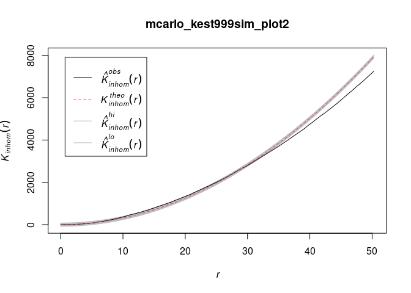
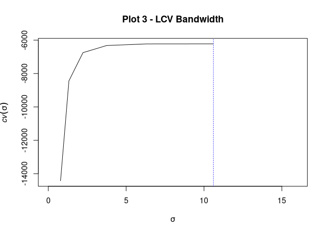

Spatial Point Pattern Processes of Conifer Seedlings
================
SMurphy
2021-01-30

- [1. Model Selection](#1-model-selection)
  - [1.1 Import Data](#11-import-data)
  - [1.2 Model Fitting](#12-model-fitting)
  - [1.3 Model Training](#13-model-training)
  - [1.4 Model Tuning](#14-model-tuning)
- [2. Spatial Point Patterns](#2-spatial-point-patterns)
  - [2.1 Import Data](#21-import-data)
  - [2.2 Tidy Data](#22-tidy-data)
  - [2.3 Seedling Sample Plots](#23-seedling-sample-plots)
  - [2.4 Seedling Heat Maps](#24-seedling-heat-maps)
  - [2.5 Seedling Nearest-Neighbour
    Analysis](#25-seedling-nearest-neighbour-analysis)
  - [2.6 Seedling Descriptives](#26-seedling-descriptives)
- [3. Spatial Point Processes](#3-spatial-point-processes)
  - [3.1 Seedling Clustering](#31-seedling-clustering)
  - [3.2 Seedling Bandwidth
    Optimization](#32-seedling-bandwidth-optimization)
  - [3.3 Seedling Point Processe
    Models](#33-seedling-point-processe-models)
  - [3.4 Alternative Model: Disturbance
    Interactions](#34-alternative-mode-disturbance-interactions)

## 1. Model Selection

### 1.1 Import Data

Seed set to `123` for replication. Import the
`1.1.darkwoods_seedlings.xls` dataset. This includes seedlings and
covariate values previously processed, classified and sampled from stem
locations of seedlings using ArcGIS environment.

``` r
set.seed(123)
darkwoods_seedlings_data <- readxl::read_excel("1.1.darkwoods_seedlings.xls")
darkwoods_seedlings_data
```

    # A tibble: 3,912 × 61
       data_point       x        y geodetic_datum plot123 plot1 plot2 plot3 bec_zone
            <dbl>   <dbl>    <dbl> <chr>            <dbl> <dbl> <dbl> <dbl>    <dbl>
     1          1 524355. 5446972. wgs84utm11n          3     0     0     1        2
     2          2 524350. 5446986. wgs84utm11n          3     0     0     1        2
     3          3 524350. 5446981. wgs84utm11n          3     0     0     1        2
     4          4 524350. 5446954. wgs84utm11n          3     0     0     1        2
     5          5 524202. 5447057. wgs84utm11n          3     0     0     1        2
     6          6 524185. 5447071. wgs84utm11n          3     0     0     1        2
     7          7 524215. 5447056. wgs84utm11n          3     0     0     1        2
     8          8 524197. 5447070. wgs84utm11n          3     0     0     1        2
     9          9 524197. 5447065. wgs84utm11n          3     0     0     1        2
    10         10 524225. 5447060. wgs84utm11n          3     0     0     1        2
    # ℹ 3,902 more rows
    # ℹ 52 more variables: bec_ichdw1 <dbl>, bec_ichmw4 <dbl>, bec_essfmw4 <dbl>,
    #   density <dbl>, intensity <dbl>, elevation_asl <dbl>, slope <dbl>,
    #   rix <dbl>, aspect <dbl>, precip <dbl>, twi <dbl>, wind <dbl>,
    #   species <dbl>, larix_spp <dbl>, pseudo_m <dbl>, picea_eng <dbl>,
    #   pinus_con <dbl>, pinus_pond <dbl>, pinus_albi <dbl>, thuja_plic <dbl>,
    #   tsuga_hete <dbl>, height_cm <dbl>, distance_m <dbl>, mpb_2005 <dbl>, …

``` r
# knitr::kable(head(darkwoods_seedlings_data))
```

For local deployment, package dependencies from this iteration are
loaded using the `requirements_I` variable.

``` r
requirements_I = install.packages(c("readxl", "sf", "kernlab",
    "ggplot2", "dplyr", "RColorBrewer", "psych", "useful", "caret",
    "tibble", "klaR", "ModelMetrics", "DescTools", "MLmetrics",
    "coefplot", "glmnet", "jsonlite", "plotly", "RSQLite", "tidyverse",
    "useful", "xgboost"), dependencies = TRUE)
# note warning messages are turned off for this chunk:
# 'warnings=FALSE'

requirements_I
```

### 1.2 Model Fitting

Derive OLS models to explore covariate effects against intercept only
models. Latest iterations suggest reporting different results that whats
in the current manuscript draft: model6.2 below. Thoughts?

``` r
seed_formula = intensity ~ distance_m + elevation_asl + slope +
    aspect + rix + twi + wind + mpb_grey + mpb_red + fire_high +
    fire_med + fire_low - 1

seed_formula2 = intensity ~ distance_m + elevation_asl + slope +
    aspect + rix + twi + wind + mpb_class + fire_high + fire_med +
    fire_low + fire_unbur - 1

seed_formula3 = intensity ~ distance_m + elevation_asl + slope +
    aspect + rix + twi + wind + mpb_grey + mpb_red + fire_high +
    fire_med + fire_low + fire_unbur + bec_zone - 1

seed_formula4 = intensity ~ distance_m + elevation_asl + slope +
    aspect + rix + twi + wind + mpb_grey + mpb_red + fire_high +
    fire_med + fire_low + fire_unbur + bec_zone + species - 1

seed_formula5 = intensity ~ distance_m + elevation_asl + slope +
    aspect + rix + twi + wind + mpb_grey + mpb_red + fire_high +
    fire_med + fire_low + fire_unbur + bec_zone + species + precip -
    1

# Fitted with disturbance interaction effects by mpb-class
# and fire-classes combined
seed_formula6.1 = intensity ~ distance_m + elevation_asl + slope +
    aspect + rix + twi + wind + bec_zone + species + precip +
    mpb_class * fire_class - 1

# Fitted with disturbance interaction effects by mpb-class
# and fire-classes combined
seed_formula6.2 = intensity ~ distance_m + elevation_asl + slope +
    aspect + rix + twi + wind + bec_zone + species + precip +
    mpb_red * fire_high + mpb_grey * fire_high + mpb_red * fire_low +
    mpb_grey * fire_low - 1

allseeds_lm = lm(seed_formula, data = darkwoods_seedlings_data)
allseeds_lm2 = lm(seed_formula2, data = darkwoods_seedlings_data)
allseeds_lm3 = lm(seed_formula3, data = darkwoods_seedlings_data)
allseeds_lm4 = lm(seed_formula4, data = darkwoods_seedlings_data)
allseeds_lm5 = lm(seed_formula5, data = darkwoods_seedlings_data)
allseeds_lm6.1 = lm(seed_formula6.1, data = darkwoods_seedlings_data)
allseeds_lm6.2 = lm(seed_formula6.2, data = darkwoods_seedlings_data)

coefplot::coefplot(allseeds_lm, sort = "magnitude")
coefplot::coefplot(allseeds_lm2, sort = "magnitude")
coefplot::coefplot(allseeds_lm3, sort = "magnitude")
coefplot::coefplot(allseeds_lm4, sort = "magnitude")
coefplot::coefplot(allseeds_lm5, sort = "magnitude")
coefplot::coefplot(allseeds_lm6.1, sort = "magnitude")
coefplot::coefplot(allseeds_lm6.2, sort = "magnitude")  #this seems the most interesting model
```


### 1.3 Model Training

Split into training and test data subset for each model with covariates
and repsonse variables mounted.

``` r
allseedsX_train <- useful::build.x(allseeds_lm, data = darkwoods_seedlings_data,
    contrasts = FALSE, sparse = TRUE)
allseedsY_train <- useful::build.y(allseeds_lm, data = darkwoods_seedlings_data)

allseedsX_train2 <- useful::build.x(allseeds_lm2, data = darkwoods_seedlings_data,
    contrasts = FALSE, sparse = TRUE)
allseedsY_train2 <- useful::build.y(allseeds_lm2, data = darkwoods_seedlings_data)

allseedsX_train3 <- useful::build.x(allseeds_lm3, data = darkwoods_seedlings_data,
    contrasts = FALSE, sparse = TRUE)
allseedsY_train3 <- useful::build.y(allseeds_lm3, data = darkwoods_seedlings_data)

allseedsX_train4 <- useful::build.x(allseeds_lm4, data = darkwoods_seedlings_data,
    contrasts = FALSE, sparse = TRUE)
allseedsY_train4 <- useful::build.y(allseeds_lm4, data = darkwoods_seedlings_data)

allseedsX_train5 <- useful::build.x(allseeds_lm5, data = darkwoods_seedlings_data,
    contrasts = FALSE, sparse = TRUE)
allseedsY_train5 <- useful::build.y(allseeds_lm5, data = darkwoods_seedlings_data)

allseedsX_train6.1 <- useful::build.x(allseeds_lm6.1, data = darkwoods_seedlings_data,
    contrasts = FALSE, sparse = TRUE)
allseedsY_train6.1 <- useful::build.y(allseeds_lm6.1, data = darkwoods_seedlings_data)

allseedsX_train6.2 <- useful::build.x(allseeds_lm6.2, data = darkwoods_seedlings_data,
    contrasts = FALSE, sparse = TRUE)
allseedsY_train6.2 <- useful::build.y(allseeds_lm6.2, data = darkwoods_seedlings_data)
```

### 1.4 Model Tuning

From the `glmnet` package, covariates are fitted to a generalised linear
model over an elastic-net (latticed plane) in order to explore their
effects under varying lambdas. The `alpha=1` function is used to fit a
lasso-model with a lambda that suppresses outliers, and the `alpha=0`
function fits a ridge-based lambda to empower correlation. Adding the
`nfolds` function, we apply a 10K-fold cross validation and then compare
coeffients visually using the `coefpath` function from the `coefplot`
package. Zoom in on graphs to determine the remaining predictors as the
model approaches a mean of zero. Most interesting model seems to 6.1.

``` r
allseeds_glmnet_lasso_cv_10fold <- glmnet::cv.glmnet(x = allseedsX_train,
    y = allseedsY_train, family = "gaussian", alpha = 1, nfolds = 10)
allseeds_glmnet_ridge_cv_10fold <- glmnet::cv.glmnet(x = allseedsX_train,
    y = allseedsY_train, family = "gaussian", alpha = 0, nfolds = 10)
allseeds_glmnet_lasso2_cv_10fold <- glmnet::cv.glmnet(x = allseedsX_train2,
    y = allseedsY_train2, family = "gaussian", alpha = 1, nfolds = 10)
allseeds_glmnet_ridge2_cv_10fold <- glmnet::cv.glmnet(x = allseedsX_train2,
    y = allseedsY_train2, family = "gaussian", alpha = 0, nfolds = 10)
allseeds_glmnet_lasso3_cv_10fold <- glmnet::cv.glmnet(x = allseedsX_train3,
    y = allseedsY_train3, family = "gaussian", alpha = 1, nfolds = 10)
allseeds_glmnet_ridge3_cv_10fold <- glmnet::cv.glmnet(x = allseedsX_train3,
    y = allseedsY_train3, family = "gaussian", alpha = 0, nfolds = 10)
allseeds_glmnet_lasso4_cv_10fold <- glmnet::cv.glmnet(x = allseedsX_train4,
    y = allseedsY_train4, family = "gaussian", alpha = 1, nfolds = 10)
allseeds_glmnet_ridge4_cv_10fold <- glmnet::cv.glmnet(x = allseedsX_train4,
    y = allseedsY_train4, family = "gaussian", alpha = 0, nfolds = 10)
allseeds_glmnet_lasso5_cv_10fold <- glmnet::cv.glmnet(x = allseedsX_train5,
    y = allseedsY_train5, family = "gaussian", alpha = 1, nfolds = 10)
allseeds_glmnet_ridge5_cv_10fold <- glmnet::cv.glmnet(x = allseedsX_train5,
    y = allseedsY_train5, family = "gaussian", alpha = 0, nfolds = 10)
allseeds_glmnet_lasso6.1_cv_10fold <- glmnet::cv.glmnet(x = allseedsX_train6.1,
    y = allseedsY_train6.1, family = "gaussian", alpha = 1, nfolds = 10)
allseeds_glmnet_ridge6.1_cv_10fold <- glmnet::cv.glmnet(x = allseedsX_train6.1,
    y = allseedsY_train6.1, family = "gaussian", alpha = 0, nfolds = 10)
allseeds_glmnet_lasso6.2_cv_10fold <- glmnet::cv.glmnet(x = allseedsX_train6.2,
    y = allseedsY_train6.2, family = "gaussian", alpha = 1, nfolds = 10)
allseeds_glmnet_ridge6.2_cv_10fold <- glmnet::cv.glmnet(x = allseedsX_train6.2,
    y = allseedsY_train6.2, family = "gaussian", alpha = 0, nfolds = 10)

plot(allseeds_glmnet_lasso6.2_cv_10fold)
```

<!-- -->

``` r
coefplot::coefpath(allseeds_glmnet_lasso6.2_cv_10fold)
```

<!-- -->

``` r
plot(allseeds_glmnet_ridge6.2_cv_10fold)
```

<!-- -->

``` r
coefplot::coefpath(allseeds_glmnet_ridge6.2_cv_10fold)
```

<!-- -->

## 2. Spatial Point Patterns

### 2.1 Import Data

In the following, we use three separate datasets; one which is already
loaded, the main seedlings dataset above, and two more imported as excel
and raster files and renamed below. Separate datasets of specific
formats are required by the `spatstat` package depending on spatial
modelling operations, including conversion of covariates into `.img`
image files in the code chunk after this.

1.  `darkwoods_seedlings_data` - already loaded excel file from above,
2.  `darkwoods_seedlings_tree_distance` - excel file showing
    seed-distance,
3.  Rasters x 11 showing terrain, climate, and disturbance covariates.

Package requirements for stage-II listed below.

``` r
requirements_II = install.packages(c("spdep", "gstat", "rgdal",
    "maptools", "raster", "spatstat", "GISTools", "rgeos", "sp",
    "rpanel", "ncf", "spatial", "spatstat.data", "spatstat.local",
    "dplyr", "RColorBrewer", "jsonlite", "plotly", "RSQLite",
    "tidyverse", "useful", "xgboost"), dependencies = TRUE)
requirements_II  # settings on 'warnings=FALSE'
```

``` r
darkwoods_seedlings_tree_distance = read_excel("1.2.darkwoods_seedlings_distance.xls")
darkwoods_seedlings_tree_distance
```

    # A tibble: 3,866 × 3
             x        y distance_m
         <dbl>    <dbl>      <dbl>
     1 524355. 5446972.       16.6
     2 524350. 5446986.       14.2
     3 524350. 5446981.       15.5
     4 524350. 5446954.       38.3
     5 524202. 5447057.       29.2
     6 524185. 5447071.       31.7
     7 524215. 5447056.       26.8
     8 524197. 5447070.       29.0
     9 524197. 5447065.       29.7
    10 524225. 5447060.       24.3
    # ℹ 3,856 more rows

``` r
# knitr::kable(head(darkwoods_seedlings_tree_distance))

elevation_utm = readAll(raster("~/Desktop/git_repos/darkwoods_seedlings/SpatialData/elevation_utm.tif"))
aspect_utm = readAll(raster("~/Desktop/git_repos/darkwoods_seedlings/SpatialData/aspect_utm_bear.tif"))
slope_utm = readAll(raster("~/Desktop/git_repos/darkwoods_seedlings/SpatialData/slope_utm.tif"))
rix_utm = readAll(raster("~/Desktop/git_repos/darkwoods_seedlings/SpatialData/rix_utm.tif"))
twi_utm = readAll(raster("~/Desktop/git_repos/darkwoods_seedlings/SpatialData/twi_utm.tif"))
wind_utm = readAll(raster("~/Desktop/git_repos/darkwoods_seedlings/SpatialData/wind_utm.tif"))
mpb_grey_utm = readAll(raster("~/Desktop/git_repos/darkwoods_seedlings/SpatialData/mpb_grey_na.tif"))
mpb_red_utm = readAll(raster("~/Desktop/git_repos/darkwoods_seedlings/SpatialData/mpb_red_na.tif"))
fire_high_utm = readAll(raster("~/Desktop/git_repos/darkwoods_seedlings/SpatialData/fire_high_na.tif"))
fire_med_utm = readAll(raster("~/Desktop/git_repos/darkwoods_seedlings/SpatialData/fire_med_na.tif"))
fire_low_utm = readAll(raster("~/Desktop/git_repos/darkwoods_seedlings/SpatialData/fire_low_na.tif"))
```

### 2.2 Tidy Data

Convert datasets of seedlings and seed-distance from `sf` simple feature
objects, to `sp` spatial objects, to `ppp` point pattern process
objects. This is the required conversion flow for `ppp` objects. Then
convert covariate rasters and seed-distance from `ppp` objects to `.img`
image objects. Make sure to complete all transformations and data
cleaning at the ‘sf’ stage.

The `crsProject` variable sets projections to `EPSG:32611`. Question, is
it better practice to reproject everything to the LiDAR’s *original*
coordinate system than to reproject everything to Landsat’s *official*
projection? Although our higher-resolution LiDAR is superior in terms of
georeferencing accuracy, most important predictors are Landsat-derived.
Additionally, field equipment was calibrated to `EPSG:3005`.

``` r
# Project crs projection
crsProject = st_crs("EPSG:32611")
# Convert to sf
seedlings_allplots_sf = st_as_sf(darkwoods_seedlings_data, coords = c("x",
    "y"), crs = crsProject)

distance_tree = st_as_sf(darkwoods_seedlings_tree_distance, coords = c("x",
    "y"), crs = crsProject)

# Factorise and relabel
seedlings_allplots_sf$plot1 = factor(seedlings_allplots_sf$plot1)
seedlings_allplots_sf$plot2 = factor(seedlings_allplots_sf$plot2)
seedlings_allplots_sf$plot3 = factor(seedlings_allplots_sf$plot3)
seedlings_allplots_sf$plot123 = factor(seedlings_allplots_sf$plot123)
seedlings_allplots_sf$bec_zone = factor(seedlings_allplots_sf$bec_zone)
seedlings_allplots_sf$species <- factor(seedlings_allplots_sf$species,
    levels = c(0, 1, 2, 3, 4, 5, 7), labels = c("Larix occidentalis",
        "Pseudostuga menzeisii", "Picea endelmannii", "Pinus contorta",
        "Pinus ponderosa", "Pinus monticola", "Tsuga heterophylla"))

# Convert sf to sp to ppp pbjects
seedlings_allplots_sp = as(seedlings_allplots_sf, "Spatial")
seedlings_allplots_ppp = as(seedlings_allplots_sp, "ppp")

distance_tree_sp = as(distance_tree, "Spatial")
distance_tree_ppp = as(distance_tree_sp, "ppp")
distance_tree_im = as.im.ppp(distance_tree_ppp)

elevation_im = as.im(elevation_utm)
aspect_im = as.im.RasterLayer(aspect_utm)
slope_im = as.im.RasterLayer(slope_utm)
rix_im = as.im.RasterLayer(rix_utm)
twi_im = as.im.RasterLayer(twi_utm)
wind_im = as.im.RasterLayer(wind_utm)
mpb_grey_im = as.im.RasterLayer(mpb_grey_utm)
mpb_red_im = as.im.RasterLayer(mpb_red_utm)
fire_high_im = as.im.RasterLayer(fire_high_utm)
fire_med_im = as.im.RasterLayer(fire_med_utm)
fire_low_im = as.im.RasterLayer(fire_low_utm)
```

Subset seedlings by plot and by species at the `sp` and `ppp` stages to
enable plotting and model fitting. For global analysis, plot subsamples
are pooled using ratio-estimation function: `superimpose`

``` r
seedlings_plot1_sp = subset(seedlings_allplots_sp, plot1 == 1)
seedlings_plot2_sp = subset(seedlings_allplots_sp, plot2 == 1)
seedlings_plot3_sp = subset(seedlings_allplots_sp, plot3 == 1)
seedlings_plot1_ppp = subset(seedlings_allplots_ppp, plot1 ==
    1)
seedlings_plot2_ppp = subset(seedlings_allplots_ppp, plot2 ==
    1)
seedlings_plot3_ppp = subset(seedlings_allplots_ppp, plot3 ==
    1)

larix_spp_allplots_sf = subset(seedlings_allplots_sf, larix_spp ==
    1)
pseudo_m_allplots_sf = subset(seedlings_allplots_sf, pseudo_m ==
    1)
picea_eng_allplots_sf = subset(seedlings_allplots_sf, picea_eng ==
    1)
pinus_con_allplots_sf = subset(seedlings_allplots_sf, pinus_con ==
    1)
pinus_pond_allplots_sf = subset(seedlings_allplots_sf, pinus_pond ==
    1)
pinus_monti_allplots_sf = subset(seedlings_allplots_sf, pinus_albi ==
    1)
tsuga_hete_allplots_sf = subset(seedlings_allplots_sf, tsuga_hete ==
    1)
larix_spp_allplots_sp = subset(seedlings_allplots_sp, larix_spp ==
    1)
pseudo_m_allplots_sp = subset(seedlings_allplots_sp, pseudo_m ==
    1)
picea_eng_allplots_sp = subset(seedlings_allplots_sp, picea_eng ==
    1)
pinus_con_allplots_sp = subset(seedlings_allplots_sp, pinus_con ==
    1)
pinus_pond_allplots_sp = subset(seedlings_allplots_sp, pinus_pond ==
    1)
pinus_monti_allplots_sp = subset(seedlings_allplots_sp, pinus_albi ==
    1)
tsuga_hete_allplots_sp = subset(seedlings_allplots_sp, tsuga_hete ==
    1)
larix_spp_allplots_ppp = subset(seedlings_allplots_ppp, larix_spp ==
    1)
pseudo_m_allplots_ppp = subset(seedlings_allplots_ppp, pseudo_m ==
    1)
picea_eng_allplots_ppp = subset(seedlings_allplots_ppp, picea_eng ==
    1)
pinus_con_allplots_ppp = subset(seedlings_allplots_ppp, pinus_con ==
    1)
pinus_pond_allplots_ppp = subset(seedlings_allplots_ppp, pinus_pond ==
    1)
pinus_monti_allplots_ppp = subset(seedlings_allplots_ppp, pinus_albi ==
    1)
tsuga_hete_allplots_ppp = subset(seedlings_allplots_ppp, tsuga_hete ==
    1)

# Plot 1 by species
larix_spp_plot1_sp = subset(seedlings_plot1_sp, larix_spp ==
    1)
pseudo_m_plot1_sp = subset(seedlings_plot1_sp, pseudo_m == 1)
picea_eng_plot1_sp = subset(seedlings_plot1_sp, picea_eng ==
    1)
pinus_con_plot1_sp = subset(seedlings_plot1_sp, pinus_con ==
    1)
pinus_pond_plot1_sp = subset(seedlings_plot1_sp, pinus_pond ==
    1)
pinus_monti_plot1_sp = subset(seedlings_plot1_sp, pinus_albi ==
    1)
tsuga_hete_plot1_sp = subset(seedlings_plot1_sp, tsuga_hete ==
    1)
larix_spp_plot1_ppp = subset(seedlings_plot1_ppp, larix_spp ==
    1)
pseudo_m_plot1_ppp = subset(seedlings_plot1_ppp, pseudo_m ==
    1)
picea_eng_plot1_ppp = subset(seedlings_plot1_ppp, picea_eng ==
    1)
pinus_con_plot1_ppp = subset(seedlings_plot1_ppp, pinus_con ==
    1)
pinus_pond_plot1_ppp = subset(seedlings_plot1_ppp, pinus_pond ==
    1)
pinus_monti_plot1_ppp = subset(seedlings_plot1_ppp, pinus_albi ==
    1)
tsuga_hete_plot1_ppp = subset(seedlings_plot1_ppp, tsuga_hete ==
    1)

# Plot 2 by species
larix_spp_plot2_sp = subset(seedlings_plot2_sp, larix_spp ==
    1)
pseudo_m_plot2_sp = subset(seedlings_plot2_sp, pseudo_m == 1)
picea_eng_plot2_sp = subset(seedlings_plot2_sp, picea_eng ==
    1)
pinus_con_plot2_sp = subset(seedlings_plot2_sp, pinus_con ==
    1)
pinus_pond_plot2_sp = subset(seedlings_plot2_sp, pinus_pond ==
    1)
pinus_monti_plot2_sp = subset(seedlings_plot2_sp, pinus_albi ==
    1)
tsuga_hete_plot2_sp = subset(seedlings_plot2_sp, tsuga_hete ==
    1)
larix_spp_plot2_ppp = subset(seedlings_plot2_ppp, larix_spp ==
    1)
pseudo_m_plot2_ppp = subset(seedlings_plot2_ppp, pseudo_m ==
    1)
picea_eng_plot2_ppp = subset(seedlings_plot2_ppp, picea_eng ==
    1)
pinus_con_plot2_ppp = subset(seedlings_plot2_ppp, pinus_con ==
    1)
pinus_pond_plot2_ppp = subset(seedlings_plot2_ppp, pinus_pond ==
    1)
pinus_monti_plot2_ppp = subset(seedlings_plot2_ppp, pinus_albi ==
    1)
tsuga_hete_plot2_ppp = subset(seedlings_plot2_ppp, tsuga_hete ==
    1)

# Plot 3 by species
larix_spp_plot3_sp = subset(seedlings_plot3_sp, larix_spp ==
    1)
pseudo_m_plot3_sp = subset(seedlings_plot3_sp, pseudo_m == 1)
picea_eng_plot3_sp = subset(seedlings_plot3_sp, picea_eng ==
    1)
pinus_con_plot3_sp = subset(seedlings_plot3_sp, pinus_con ==
    1)
pinus_pond_plot3_sp = subset(seedlings_plot3_sp, pinus_pond ==
    1)
pinus_monti_plot3_sp = subset(seedlings_plot3_sp, pinus_albi ==
    1)
tsuga_hete_plot3_sp = subset(seedlings_plot3_sp, tsuga_hete ==
    1)
larix_spp_plot3_ppp = subset(seedlings_plot3_ppp, larix_spp ==
    1)
pseudo_m_plot3_ppp = subset(seedlings_plot3_ppp, pseudo_m ==
    1)
picea_eng_plot3_ppp = subset(seedlings_plot3_ppp, picea_eng ==
    1)
pinus_con_plot3_ppp = subset(seedlings_plot3_ppp, pinus_con ==
    1)
pinus_pond_plot3_ppp = subset(seedlings_plot3_ppp, pinus_pond ==
    1)
pinus_monti_plot3_ppp = subset(seedlings_plot3_ppp, pinus_albi ==
    1)
tsuga_hete_plot3_ppp = subset(seedlings_plot3_ppp, tsuga_hete ==
    1)

# All plots by species pooled by ratio-estimation
seedlings_pooled = superimpose(seedlings_plot1_ppp, seedlings_plot2_ppp,
    seedlings_plot3_ppp)
pinus_con_pooled = superimpose(pinus_con_plot1_ppp, pinus_con_plot2_ppp,
    pinus_con_plot3_ppp)
larix_spp_pooled = superimpose(larix_spp_plot1_ppp, larix_spp_plot2_ppp,
    larix_spp_plot3_ppp)
picea_eng_pooled = superimpose(picea_eng_plot1_ppp, picea_eng_plot2_ppp,
    picea_eng_plot3_ppp)
pseudo_m_pooled = superimpose(pseudo_m_plot1_ppp, pseudo_m_plot2_ppp,
    pseudo_m_plot3_ppp)
pinus_pond_pooled = superimpose(pinus_pond_plot1_ppp, pinus_pond_plot2_ppp,
    pinus_pond_plot3_ppp)
pinus_monti_pooled = superimpose(pinus_monti_plot1_ppp, pinus_monti_plot2_ppp,
    pinus_monti_plot1_ppp)
tsuga_hete_pooled = superimpose(tsuga_hete_plot1_ppp, tsuga_hete_plot2_ppp,
    tsuga_hete_plot3_ppp)
```

Import and tidy shapefiles of seedling plot boundaries to derive and
assign observational windows to point pattern objects. Depending on
`spatstat` operation, `ppp` objects must be marked or unmarked using the
`marks` function, see bottom of chunk below.

``` r
mask_plot1 = readOGR(dsn = "~/Desktop/git_repos/darkwoods_seedlings/plots123.shps/",
    layer = "plot1X", verbose = FALSE)
mask_plot2 = readOGR(dsn = "~/Desktop/git_repos/darkwoods_seedlings/plots123.shps/",
    layer = "plot2X", verbose = FALSE)
mask_plot3 = readOGR(dsn = "~/Desktop/git_repos/darkwoods_seedlings/plots123.shps/",
    layer = "plot3X", verbose = FALSE)
mask_allplots = readOGR(dsn = "~/Desktop/git_repos/darkwoods_seedlings/plots123.shps/",
    layer = "plots123", verbose = FALSE)

# check OR assign coordinate reference systems
# crs(mask_plot1) crs(mask_plot2) crs(mask_plot3)
# crs(mask_allplots)

# crs(mask_plot1) <- '+proj=utm +zone=11 +datum=WGS84
# +units=m +no_defs' crs(mask_plot2) <- '+proj=utm +zone=11
# +datum=WGS84 +units=m +no_defs' crs(mask_plot3) <-
# '+proj=utm +zone=11 +datum=WGS84 +units=m +no_defs'
# crs(mask_allplots) <- '+proj=utm +zone=11 +datum=WGS84
# +units=m +no_defs'

# derive observational windows
win_plot1 = as.owin(mask_plot1, unitname = "meters")
win_plot2 = as.owin(mask_plot2, unitname = "meters")
win_plot3 = as.owin(mask_plot3, unitname = "meters")
win_allplots = as.owin(mask_allplots, unitname = "meters")

# assign observational windows
Window(seedlings_plot1_ppp) = win_plot1
Window(seedlings_plot2_ppp) = win_plot2
Window(seedlings_plot3_ppp) = win_plot3
Window(seedlings_allplots_ppp) = win_allplots

Window(larix_spp_allplots_ppp) = win_allplots
Window(pseudo_m_allplots_ppp) = win_allplots
Window(picea_eng_allplots_ppp) = win_allplots
Window(pinus_con_allplots_ppp) = win_allplots
Window(pinus_pond_allplots_ppp) = win_allplots
Window(pinus_monti_allplots_ppp) = win_allplots
Window(tsuga_hete_allplots_ppp) = win_allplots

Window(larix_spp_plot1_ppp) = win_plot1
Window(pseudo_m_plot1_ppp) = win_plot1
Window(picea_eng_plot1_ppp) = win_plot1
Window(pinus_con_plot1_ppp) = win_plot1
Window(pinus_pond_plot1_ppp) = win_plot1
Window(pinus_monti_plot1_ppp) = win_plot1
Window(tsuga_hete_plot1_ppp) = win_plot1

Window(larix_spp_plot2_ppp) = win_plot2
Window(pseudo_m_plot2_ppp) = win_plot2
Window(picea_eng_plot2_ppp) = win_plot2
Window(pinus_con_plot2_ppp) = win_plot2
Window(pinus_pond_plot2_ppp) = win_plot2
Window(pinus_monti_plot2_ppp) = win_plot2
Window(tsuga_hete_plot2_ppp) = win_plot2

Window(larix_spp_plot3_ppp) = win_plot3
Window(pseudo_m_plot3_ppp) = win_plot3
Window(picea_eng_plot3_ppp) = win_plot3
Window(pinus_con_plot3_ppp) = win_plot3
Window(pinus_pond_plot3_ppp) = win_plot3
Window(pinus_monti_plot3_ppp) = win_plot3
Window(tsuga_hete_plot3_ppp) = win_plot3

# assign unit of division is set to meters
unitname(larix_spp_allplots_ppp) = c("meter", "meter")
unitname(pseudo_m_allplots_ppp) = c("meter", "meter")
unitname(picea_eng_allplots_ppp) = c("meter", "meter")
unitname(pinus_con_allplots_ppp) = c("meter", "meter")
unitname(pinus_pond_allplots_ppp) = c("meter", "meter")
unitname(pinus_monti_allplots_ppp) = c("meter", "meter")
unitname(tsuga_hete_allplots_ppp) = c("meter", "meter")

unitname(larix_spp_plot1_ppp) = c("meter", "meter")
unitname(pseudo_m_plot1_ppp) = c("meter", "meter")
unitname(picea_eng_plot1_ppp) = c("meter", "meter")
unitname(pinus_con_plot1_ppp) = c("meter", "meter")
unitname(pinus_pond_plot1_ppp) = c("meter", "meter")
unitname(pinus_monti_plot1_ppp) = c("meter", "meter")
unitname(tsuga_hete_plot1_ppp) = c("meter", "meter")

unitname(larix_spp_plot2_ppp) = c("meter", "meter")
unitname(pseudo_m_plot2_ppp) = c("meter", "meter")
unitname(picea_eng_plot2_ppp) = c("meter", "meter")
unitname(pinus_con_plot2_ppp) = c("meter", "meter")
unitname(pinus_pond_plot2_ppp) = c("meter", "meter")
unitname(pinus_monti_plot2_ppp) = c("meter", "meter")
unitname(tsuga_hete_plot2_ppp) = c("meter", "meter")

unitname(larix_spp_plot3_ppp) = c("meter", "meter")
unitname(pseudo_m_plot3_ppp) = c("meter", "meter")
unitname(picea_eng_plot3_ppp) = c("meter", "meter")
unitname(pinus_con_plot3_ppp) = c("meter", "meter")
unitname(pinus_pond_plot3_ppp) = c("meter", "meter")
unitname(pinus_monti_plot3_ppp) = c("meter", "meter")
unitname(tsuga_hete_plot3_ppp) = c("meter", "meter")

marks(seedlings_plot1_ppp) <- seedlings_plot1_ppp$species
marks(seedlings_plot2_ppp) <- seedlings_plot2_ppp$species
marks(seedlings_plot3_ppp) <- seedlings_plot3_ppp$species
marks(seedlings_allplots_ppp) <- seedlings_allplots_ppp$species
```

### 2.3 Seedling Sample Plots

``` r
plot(seedlings_plot1_ppp, type = "n", main = "Plot 1 seedlings")
points(pinus_con_plot1_ppp, pch = 20, cex = 0.8, col = "yellow")
points(larix_spp_plot1_ppp, pch = 20, cex = 0.8, col = "green3")
points(pseudo_m_plot1_ppp, pch = 20, cex = 0.8, col = "brown")
points(picea_eng_plot1_ppp, pch = 20, cex = 0.8, col = "purple")
points(pinus_pond_plot1_ppp, pch = 20, cex = 0.8, col = "red")
points(pinus_monti_plot1_ppp, pch = 20, cex = 0.8, col = "black")
points(tsuga_hete_plot1_ppp, pch = 20, cex = 0.8, col = "blue")
species_palette = c("yellow", "green3", "brown", "purple", "red",
    "black", "cyan", "blue")
legend("topright", legend = levels(seedlings_allplots_sp$species),
    fill = species_palette)
```

<!-- -->

``` r
plot(seedlings_plot2_ppp, type = "n", main = "Plot 2 seedlings")
points(pinus_con_plot2_ppp, pch = 20, cex = 0.8, col = "yellow")
points(larix_spp_plot2_ppp, pch = 20, cex = 0.8, col = "green3")
points(pseudo_m_plot2_ppp, pch = 20, cex = 0.8, col = "brown")
points(picea_eng_plot2_ppp, pch = 20, cex = 0.8, col = "purple")
points(pinus_pond_plot2_ppp, pch = 20, cex = 0.8, col = "red")
points(pinus_monti_plot2_ppp, pch = 20, cex = 0.8, col = "black")
points(tsuga_hete_plot2_ppp, pch = 20, cex = 0.8, col = "blue")
```

<!-- -->

``` r
plot(seedlings_plot3_ppp, type = "n", main = "Plot 3 seedlings")
points(pinus_con_plot3_ppp, pch = 20, cex = 0.8, col = "yellow")
points(larix_spp_plot3_ppp, pch = 20, cex = 0.8, col = "green3")
points(pseudo_m_plot3_ppp, pch = 20, cex = 0.8, col = "brown")
points(picea_eng_plot3_ppp, pch = 20, cex = 0.8, col = "purple")
points(pinus_pond_plot3_ppp, pch = 20, cex = 0.8, col = "red")
points(pinus_monti_plot3_ppp, pch = 20, cex = 0.8, col = "black")
points(tsuga_hete_plot3_ppp, pch = 20, cex = 0.8, col = "blue")
```

<!-- -->

### 2.4 Seedling Heat Maps

Seedling density patterns were mapped using the `epanechnikov` kernel
density estimator and heat maps. The `epanechnikov` was chosen over
`Gaussian` and `Nadaraya-Watson` kernels to address non-constant
intensity as it handles negative outliers more conservatively and still
provides MSE rather than MISE metrics. Diggle default bandwidth settings
applied

``` r
# plot 1 - all species pooled - bandwidth=10
marks(seedlings_plot1_ppp) = NULL
density_plot1 = density(seedlings_plot1_ppp, sigma = 10, kernel = "epanechnikov",
    diggle = TRUE)

plot(density_plot1, main = "Plot 1", las = 1)
contour(density_plot1, add = TRUE)
persp(density_plot1, main = "Plot 1")

# kernel density of plot 2 all seedlings
marks(seedlings_plot2_ppp) = NULL
density_plot2 = density(seedlings_plot2_ppp, sigma = 10, kernel = "epanechnikov",
    diggle = TRUE)

plot(density_plot2, main = "Plot 2", las = 1)
contour(density_plot2, add = TRUE)
persp(density_plot2, main = "Plot 2")

# kernel density of plot 3 all seedlings
marks(seedlings_plot3_ppp) = NULL
density_plot3 = density(seedlings_plot3_ppp, sigma = 10, kernel = "epanechnikov",
    diggle = TRUE)

plot(density_plot3, main = "Plot 3", las = 1)
contour(density_plot3, add = TRUE)
persp(density_plot3, main = "Plot 3")
# style command for perspective plots persp(D, theta=70,
# phi=25, shade=0.4)
```


### 2.5 Seedling Nearest-Neighbour Analysis

To confirm spatial patterns in seeding density, we first test using
nearest-neighbour algorithms: `nndist`. This is applied across plots and
by species.

``` r
# compute nearest neighbour distance between plots
ann_seedlings_allplots <- nndist.ppp(seedlings_allplots_ppp,
    k = 1)
ann_seedlings_plot1 <- mean(nndist(seedlings_plot1_ppp, k = 1))
ann_seedlings_plot2 <- mean(nndist(seedlings_plot2_ppp, k = 1))
ann_seedlings_plot3 <- mean(nndist(seedlings_plot3_ppp, k = 1))
kruskal.test(ann_seedlings_allplots ~ plot123, data = seedlings_allplots_sf)  #significant: p<0.0001
```


        Kruskal-Wallis rank sum test

    data:  ann_seedlings_allplots by plot123
    Kruskal-Wallis chi-squared = 440.03, df = 2, p-value < 2.2e-16

``` r
ann_seedlings_allplots_metrics = psych::describe(ann_seedlings_allplots)
ann_seedlings_plot1_metrics = psych::describe(ann_seedlings_plot1)
ann_seedlings_plot2_metrics = psych::describe(ann_seedlings_plot2)
ann_seedlings_plot3_metrics = psych::describe(ann_seedlings_plot3)
ann_seedlings_allplots_metrics
```

    # A tibble: 1 × 13
       vars     n  mean    sd median trimmed   mad   min   max range  skew kurtosis
      <dbl> <dbl> <dbl> <dbl>  <dbl>   <dbl> <dbl> <dbl> <dbl> <dbl> <dbl>    <dbl>
    1     1  3912  2.24  2.63   1.83    1.86  2.16     0  42.5  42.5  4.75     49.6
    # ℹ 1 more variable: se <dbl>

``` r
ann_seedlings_plot1_metrics
```

    # A tibble: 1 × 13
       vars     n  mean    sd median trimmed   mad   min   max range  skew kurtosis
      <dbl> <dbl> <dbl> <dbl>  <dbl>   <dbl> <dbl> <dbl> <dbl> <dbl> <dbl>    <dbl>
    1     1     1  1.82    NA   1.82    1.82     0  1.82  1.82     0    NA       NA
    # ℹ 1 more variable: se <dbl>

``` r
ann_seedlings_plot2_metrics
```

    # A tibble: 1 × 13
       vars     n  mean    sd median trimmed   mad   min   max range  skew kurtosis
      <dbl> <dbl> <dbl> <dbl>  <dbl>   <dbl> <dbl> <dbl> <dbl> <dbl> <dbl>    <dbl>
    1     1     1  2.85    NA   2.85    2.85     0  2.85  2.85     0    NA       NA
    # ℹ 1 more variable: se <dbl>

``` r
ann_seedlings_plot3_metrics
```

    # A tibble: 1 × 13
       vars     n  mean    sd median trimmed   mad   min   max range  skew kurtosis
      <dbl> <dbl> <dbl> <dbl>  <dbl>   <dbl> <dbl> <dbl> <dbl> <dbl> <dbl>    <dbl>
    1     1     1  2.03    NA   2.03    2.03     0  2.03  2.03     0    NA       NA
    # ℹ 1 more variable: se <dbl>

``` r
# compute nearest neighbour distance by species within
# plots
ann_larix_spp_plot1 <- mean(nndist(seedlings_plot1_ppp, k = 1))
ann_pseudo_m_plot1 <- mean(nndist(seedlings_plot1_ppp, k = 1))
ann_picea_eng_plot1 <- mean(nndist(seedlings_plot1_ppp, k = 1))
ann_pinus_con_plot1 <- mean(nndist(seedlings_plot1_ppp, k = 1))
ann_pinus_pond_plot1 <- mean(nndist(seedlings_plot1_ppp, k = 1))
ann_pinus_monti_plot1 <- mean(nndist(seedlings_plot1_ppp, k = 1))
ann_tsuga_hete_plot1 <- mean(nndist(seedlings_plot1_ppp, k = 1))
ann_larix_spp_plot2 <- mean(nndist(seedlings_plot2_ppp, k = 1))
ann_pseudo_m_plot2 <- mean(nndist(seedlings_plot2_ppp, k = 1))
ann_picea_eng_plot2 <- mean(nndist(seedlings_plot2_ppp, k = 1))
ann_pinus_con_plot2 <- mean(nndist(seedlings_plot2_ppp, k = 1))
ann_pinus_pond_plot2 <- mean(nndist(seedlings_plot2_ppp, k = 1))
ann_pinus_monti_plot2 <- mean(nndist(seedlings_plot2_ppp, k = 1))
ann_tsuga_hete_plot2 <- mean(nndist(seedlings_plot2_ppp, k = 1))
ann_larix_spp_plot3 <- mean(nndist(seedlings_plot3_ppp, k = 1))
ann_pseudo_m_plot3 <- mean(nndist(seedlings_plot3_ppp, k = 1))
ann_picea_eng_plot3 <- mean(nndist(seedlings_plot3_ppp, k = 1))
ann_pinus_con_plot3 <- mean(nndist(seedlings_plot3_ppp, k = 1))
ann_pinus_pond_plot3 <- mean(nndist(seedlings_plot3_ppp, k = 1))
ann_pinus_monti_plot3 <- mean(nndist(seedlings_plot3_ppp, k = 1))
ann_tsuga_hete_plot3 <- mean(nndist(seedlings_plot3_ppp, k = 1))

ann_larix_spp_plot1_metrics = psych::describe(ann_larix_spp_plot1)
ann_pseudo_m_plot1_metrics = psych::describe(ann_pseudo_m_plot1)
ann_picea_eng_plot1_metrics = psych::describe(ann_picea_eng_plot1)
ann_pinus_con_plot1_metrics = psych::describe(ann_pinus_con_plot1)
ann_pinus_pond_plot1_metrics = psych::describe(ann_pinus_pond_plot1)
ann_pinus_monti_plot1_metrics = psych::describe(ann_pinus_monti_plot1)
ann_tsuga_hete_plot1_metrics = psych::describe(ann_tsuga_hete_plot1)
ann_larix_spp_plot2_metrics = psych::describe(ann_larix_spp_plot2)
ann_pseudo_m_plot2_metrics = psych::describe(ann_pseudo_m_plot2)
ann_picea_eng_plot2_metrics = psych::describe(ann_picea_eng_plot2)
ann_pinus_con_plot2_metrics = psych::describe(ann_pinus_con_plot2)
ann_pinus_pond_plot2_metrics = psych::describe(ann_pinus_pond_plot2)
ann_pinus_monti_plot2_metrics = psych::describe(ann_pinus_monti_plot2)
ann_tsuga_hete_plot2_metrics = psych::describe(ann_tsuga_hete_plot2)
ann_larix_spp_plot3_metrics = psych::describe(ann_larix_spp_plot3)
ann_pseudo_m_plot3_metrics = psych::describe(ann_pseudo_m_plot3)
ann_picea_eng_plot3_metrics = psych::describe(ann_picea_eng_plot3)
ann_pinus_con_plot3_metrics = psych::describe(ann_pinus_con_plot3)
ann_pinus_pond_plot3_metrics = psych::describe(ann_pinus_pond_plot3)
ann_pinus_monti_plot3_metrics = psych::describe(ann_pinus_monti_plot3)
ann_tsuga_hete_plot3_metrics = psych::describe(ann_tsuga_hete_plot3)

ann_larix_spp_plot1_metrics
```

    # A tibble: 1 × 13
       vars     n  mean    sd median trimmed   mad   min   max range  skew kurtosis
      <dbl> <dbl> <dbl> <dbl>  <dbl>   <dbl> <dbl> <dbl> <dbl> <dbl> <dbl>    <dbl>
    1     1     1  1.82    NA   1.82    1.82     0  1.82  1.82     0    NA       NA
    # ℹ 1 more variable: se <dbl>

``` r
ann_larix_spp_plot2_metrics
```

    # A tibble: 1 × 13
       vars     n  mean    sd median trimmed   mad   min   max range  skew kurtosis
      <dbl> <dbl> <dbl> <dbl>  <dbl>   <dbl> <dbl> <dbl> <dbl> <dbl> <dbl>    <dbl>
    1     1     1  2.85    NA   2.85    2.85     0  2.85  2.85     0    NA       NA
    # ℹ 1 more variable: se <dbl>

``` r
ann_larix_spp_plot3_metrics
```

    # A tibble: 1 × 13
       vars     n  mean    sd median trimmed   mad   min   max range  skew kurtosis
      <dbl> <dbl> <dbl> <dbl>  <dbl>   <dbl> <dbl> <dbl> <dbl> <dbl> <dbl>    <dbl>
    1     1     1  2.03    NA   2.03    2.03     0  2.03  2.03     0    NA       NA
    # ℹ 1 more variable: se <dbl>

``` r
ann_pseudo_m_plot1_metrics
```

    # A tibble: 1 × 13
       vars     n  mean    sd median trimmed   mad   min   max range  skew kurtosis
      <dbl> <dbl> <dbl> <dbl>  <dbl>   <dbl> <dbl> <dbl> <dbl> <dbl> <dbl>    <dbl>
    1     1     1  1.82    NA   1.82    1.82     0  1.82  1.82     0    NA       NA
    # ℹ 1 more variable: se <dbl>

``` r
ann_pseudo_m_plot2_metrics
```

    # A tibble: 1 × 13
       vars     n  mean    sd median trimmed   mad   min   max range  skew kurtosis
      <dbl> <dbl> <dbl> <dbl>  <dbl>   <dbl> <dbl> <dbl> <dbl> <dbl> <dbl>    <dbl>
    1     1     1  2.85    NA   2.85    2.85     0  2.85  2.85     0    NA       NA
    # ℹ 1 more variable: se <dbl>

``` r
ann_pseudo_m_plot3_metrics
```

    # A tibble: 1 × 13
       vars     n  mean    sd median trimmed   mad   min   max range  skew kurtosis
      <dbl> <dbl> <dbl> <dbl>  <dbl>   <dbl> <dbl> <dbl> <dbl> <dbl> <dbl>    <dbl>
    1     1     1  2.03    NA   2.03    2.03     0  2.03  2.03     0    NA       NA
    # ℹ 1 more variable: se <dbl>

``` r
ann_picea_eng_plot1_metrics
```

    # A tibble: 1 × 13
       vars     n  mean    sd median trimmed   mad   min   max range  skew kurtosis
      <dbl> <dbl> <dbl> <dbl>  <dbl>   <dbl> <dbl> <dbl> <dbl> <dbl> <dbl>    <dbl>
    1     1     1  1.82    NA   1.82    1.82     0  1.82  1.82     0    NA       NA
    # ℹ 1 more variable: se <dbl>

``` r
ann_picea_eng_plot2_metrics
```

    # A tibble: 1 × 13
       vars     n  mean    sd median trimmed   mad   min   max range  skew kurtosis
      <dbl> <dbl> <dbl> <dbl>  <dbl>   <dbl> <dbl> <dbl> <dbl> <dbl> <dbl>    <dbl>
    1     1     1  2.85    NA   2.85    2.85     0  2.85  2.85     0    NA       NA
    # ℹ 1 more variable: se <dbl>

``` r
ann_picea_eng_plot3_metrics
```

    # A tibble: 1 × 13
       vars     n  mean    sd median trimmed   mad   min   max range  skew kurtosis
      <dbl> <dbl> <dbl> <dbl>  <dbl>   <dbl> <dbl> <dbl> <dbl> <dbl> <dbl>    <dbl>
    1     1     1  2.03    NA   2.03    2.03     0  2.03  2.03     0    NA       NA
    # ℹ 1 more variable: se <dbl>

``` r
ann_pinus_con_plot1_metrics
```

    # A tibble: 1 × 13
       vars     n  mean    sd median trimmed   mad   min   max range  skew kurtosis
      <dbl> <dbl> <dbl> <dbl>  <dbl>   <dbl> <dbl> <dbl> <dbl> <dbl> <dbl>    <dbl>
    1     1     1  1.82    NA   1.82    1.82     0  1.82  1.82     0    NA       NA
    # ℹ 1 more variable: se <dbl>

``` r
ann_pinus_con_plot2_metrics
```

    # A tibble: 1 × 13
       vars     n  mean    sd median trimmed   mad   min   max range  skew kurtosis
      <dbl> <dbl> <dbl> <dbl>  <dbl>   <dbl> <dbl> <dbl> <dbl> <dbl> <dbl>    <dbl>
    1     1     1  2.85    NA   2.85    2.85     0  2.85  2.85     0    NA       NA
    # ℹ 1 more variable: se <dbl>

``` r
ann_pinus_con_plot3_metrics
```

    # A tibble: 1 × 13
       vars     n  mean    sd median trimmed   mad   min   max range  skew kurtosis
      <dbl> <dbl> <dbl> <dbl>  <dbl>   <dbl> <dbl> <dbl> <dbl> <dbl> <dbl>    <dbl>
    1     1     1  2.03    NA   2.03    2.03     0  2.03  2.03     0    NA       NA
    # ℹ 1 more variable: se <dbl>

``` r
ann_pinus_pond_plot1_metrics
```

    # A tibble: 1 × 13
       vars     n  mean    sd median trimmed   mad   min   max range  skew kurtosis
      <dbl> <dbl> <dbl> <dbl>  <dbl>   <dbl> <dbl> <dbl> <dbl> <dbl> <dbl>    <dbl>
    1     1     1  1.82    NA   1.82    1.82     0  1.82  1.82     0    NA       NA
    # ℹ 1 more variable: se <dbl>

``` r
ann_pinus_pond_plot2_metrics
```

    # A tibble: 1 × 13
       vars     n  mean    sd median trimmed   mad   min   max range  skew kurtosis
      <dbl> <dbl> <dbl> <dbl>  <dbl>   <dbl> <dbl> <dbl> <dbl> <dbl> <dbl>    <dbl>
    1     1     1  2.85    NA   2.85    2.85     0  2.85  2.85     0    NA       NA
    # ℹ 1 more variable: se <dbl>

``` r
ann_pinus_pond_plot3_metrics
```

    # A tibble: 1 × 13
       vars     n  mean    sd median trimmed   mad   min   max range  skew kurtosis
      <dbl> <dbl> <dbl> <dbl>  <dbl>   <dbl> <dbl> <dbl> <dbl> <dbl> <dbl>    <dbl>
    1     1     1  2.03    NA   2.03    2.03     0  2.03  2.03     0    NA       NA
    # ℹ 1 more variable: se <dbl>

``` r
ann_pinus_monti_plot1_metrics
```

    # A tibble: 1 × 13
       vars     n  mean    sd median trimmed   mad   min   max range  skew kurtosis
      <dbl> <dbl> <dbl> <dbl>  <dbl>   <dbl> <dbl> <dbl> <dbl> <dbl> <dbl>    <dbl>
    1     1     1  1.82    NA   1.82    1.82     0  1.82  1.82     0    NA       NA
    # ℹ 1 more variable: se <dbl>

``` r
ann_pinus_monti_plot2_metrics
```

    # A tibble: 1 × 13
       vars     n  mean    sd median trimmed   mad   min   max range  skew kurtosis
      <dbl> <dbl> <dbl> <dbl>  <dbl>   <dbl> <dbl> <dbl> <dbl> <dbl> <dbl>    <dbl>
    1     1     1  2.85    NA   2.85    2.85     0  2.85  2.85     0    NA       NA
    # ℹ 1 more variable: se <dbl>

``` r
ann_pinus_monti_plot3_metrics
```

    # A tibble: 1 × 13
       vars     n  mean    sd median trimmed   mad   min   max range  skew kurtosis
      <dbl> <dbl> <dbl> <dbl>  <dbl>   <dbl> <dbl> <dbl> <dbl> <dbl> <dbl>    <dbl>
    1     1     1  2.03    NA   2.03    2.03     0  2.03  2.03     0    NA       NA
    # ℹ 1 more variable: se <dbl>

``` r
ann_tsuga_hete_plot1_metrics
```

    # A tibble: 1 × 13
       vars     n  mean    sd median trimmed   mad   min   max range  skew kurtosis
      <dbl> <dbl> <dbl> <dbl>  <dbl>   <dbl> <dbl> <dbl> <dbl> <dbl> <dbl>    <dbl>
    1     1     1  1.82    NA   1.82    1.82     0  1.82  1.82     0    NA       NA
    # ℹ 1 more variable: se <dbl>

``` r
ann_tsuga_hete_plot2_metrics
```

    # A tibble: 1 × 13
       vars     n  mean    sd median trimmed   mad   min   max range  skew kurtosis
      <dbl> <dbl> <dbl> <dbl>  <dbl>   <dbl> <dbl> <dbl> <dbl> <dbl> <dbl>    <dbl>
    1     1     1  2.85    NA   2.85    2.85     0  2.85  2.85     0    NA       NA
    # ℹ 1 more variable: se <dbl>

``` r
ann_tsuga_hete_plot3_metrics
```

    # A tibble: 1 × 13
       vars     n  mean    sd median trimmed   mad   min   max range  skew kurtosis
      <dbl> <dbl> <dbl> <dbl>  <dbl>   <dbl> <dbl> <dbl> <dbl> <dbl> <dbl>    <dbl>
    1     1     1  2.03    NA   2.03    2.03     0  2.03  2.03     0    NA       NA
    # ℹ 1 more variable: se <dbl>

### 2.6 Seedling Descriptives

The following commands derive descriptive statistics used to populate
tables 2.1 and 2.2 in manuscript draft, as shown directly.

|           |               |              |                |              |               |             |
|-----------|---------------|--------------|----------------|--------------|---------------|-------------|
|           | **Elevation** | **Slope**    | **RIX**        | **Aspect**   | **TWI**       | **Wind**    |
| Pooled    | 1516 (224.2)  | 13.81(7.96)  | 0.51 (0.06)    | 91.5 (58.2)  | 5.03 (1.27)   | 4.88 (0.79) |
| Plot 1    | 1769 (14.1)   | 7.82 (4.99)  | 0.55 (0.07)    | 144.0(79.2)  | 5.19 (0.61)   | 5.75 (0.12) |
| Plot 2    | 1672 (12.7)   | 7.56 (1.47)  | 0.48 (0.05)    | 99.2 (29.9)  | 4.78 (1.28)   | 5.32 (0.09) |
| Plot 3    | 1251 (37.8)   | 22.5 (2.72)  | 0.50 (0.03)    | 51.7 (10.5)  | 5.13 (1.53)   | 3.97 (0.13) |
|           |               |              |                |              |               |             |
| Pinus c.  | 1516 (224.5)  | 13.70 (8.97) | 0.51 (0.060)   | 91.4 (57.6)  | 5.04 (1.28)   | 4.88 (0.79) |
| Larix o.  | 1511 (226.7)  | 13.55 (8.21) | 0.508 (0.060)  | 93.9 (64.3)  | 4.942 (1.288) | 4.86 (0.80) |
| Picea e.  | 1509 (225.1)  | 13.83 (8.20) | 0.507 (0.062)  | 91.0 (56.8)  | 5.076 (1.278) | 4.87 (0.78) |
| Pseudo m. | 1510 (222.3)  | 14.20 (7.70) | 0.505 (0.057)  | 86.3 (48.4)  | 4.890 (1.370) | 4.85 (0.77) |
| Pinus p.  | 1406 (208.2)  | 16.93 (7.46) | 0.491 (0.043)  | 68.6 (26.7)  | 4.996 (1.343) | 4.47 (0.68) |
| Pinus m.  | 1709 (291.1)  | 10.15 (5.48) | 0.539 (0.060)  | 156.6(100.8) | 5.121 (0.773) | 5.59 (0.34) |
| Tsuga h.  | 1475 (218.0)  | 13.89 (7.79) | 0.504 (0.046)  | 77.4 (28.0)  | 5.001 (0.991) | 4.89 (0.77) |

|           |              |              |             |               |              |              |               |            |            |             |
|-----------|--------------|--------------|-------------|---------------|--------------|--------------|---------------|------------|------------|-------------|
|           | **MPB-free** | **MPB-grey** | **MPB-red** | **Fire-free** | **Fire-low** | **Fire-med** | **Fire-high** | **ICHdw1** | **ICHmw4** | **ESSFmw4** |
| Pooled    | 0.72         | 0.04         | 0.25        | 0.06          | 0.38         | 0.44         | 0.13          | 0.06       | 0.35       | 0.59        |
| Plot 1    | 0.55         | 0.12         | 0.33        | 0.00          | 0.40         | 0.44         | 0.16          | 0.00       | 0.00       | 1.00        |
| Plot 2    | 0.49         | 0.02         | 0.49        | 0.15          | 0.19         | 0.56         | 0.10          | 0.00       | 0.00       | 1.00        |
| Plot 3    | 1.00         | 0.00         | 0.00        | 0.02          | 0.51         | 0.34         | 0.13          | 0.15       | 0.85       | 0.00        |
|           |              |              |             |               |              |              |               |            |            |             |
| Pinus c.  | 0.72         | 0.04         | 0.24        | 0.06          | 0.37         | 0.43         | 0.13          | 0.06       | 0.35       | 0.59        |
| Larix o.  | 0.69         | 0.05         | 0.26        | 0.05          | 0.36         | 0.43         | 0.15          | 0.07       | 0.35       | 0.58        |
| Picea e.  | 0.66         | 0.04         | 0.30        | 0.04          | 0.40         | 0.45         | 0.11          | 0.04       | 0.38       | 0.58        |
| Pseudo m. | 0.74         | 0.03         | 0.23        | 0.02          | 0.42         | 0.46         | 0.09          | 0.08       | 0.34       | 0.58        |
| Pinus p.  | 0.79         | 0.02         | 0.19        | 0.04          | 0.42         | 0.47         | 0.07          | 0.13       | 0.49       | 0.38        |
| Pinus a.  | 0.63         | 0.04         | 0.33        | 0.02          | 0.42         | 0.37         | 0.19          | 0.00       | 0.04       | 0.96        |
| Tsuga h.  | 0.82         | 0.00         | 0.18        | 0.06          | 0.41         | 0.47         | 0.06          | 0.00       | 0.41       | 0.59        |

``` r
group_by(darkwoods_seedlings_data, species) %>%
    summarise(count = n(), mean = mean(elevation_asl, na.rm = TRUE),
        sd = sd(elevation_asl, na.rm = TRUE))
```

    # A tibble: 8 × 4
      species count  mean    sd
        <dbl> <int> <dbl> <dbl>
    1       0   319 1512. 227. 
    2       1   209 1510. 222. 
    3       2   290 1514. 221. 
    4       3  2877 1517. 225. 
    5       4    85 1407. 208. 
    6       5    52 1709.  91.1
    7       6    46 1551. 219. 
    8       7    34 1520. 218. 

``` r
group_by(darkwoods_seedlings_data, plot123) %>%
    summarise(count = n(), mean = mean(elevation_asl, na.rm = TRUE),
        sd = sd(elevation_asl, na.rm = TRUE))
```

    # A tibble: 3 × 4
      plot123 count  mean    sd
        <dbl> <int> <dbl> <dbl>
    1       1  1037 1736.  14.1
    2       2  1268 1672.  12.7
    3       3  1607 1251.  37.8

``` r
group_by(darkwoods_seedlings_data, species) %>%
    summarise(count = n(), mean = mean(slope, na.rm = TRUE),
        sd = sd(slope, na.rm = TRUE))
```

    # A tibble: 8 × 4
      species count  mean    sd
        <dbl> <int> <dbl> <dbl>
    1       0   319  13.5  8.21
    2       1   209  14.2  7.70
    3       2   290  13.8  8.20
    4       3  2877  13.7  7.97
    5       4    85  16.9  7.46
    6       5    52  10.1  5.48
    7       6    46  14.2  7.19
    8       7    34  14.0  7.79

``` r
group_by(darkwoods_seedlings_data, plot123) %>%
    summarise(count = n(), mean = mean(slope, na.rm = TRUE),
        sd = sd(slope, na.rm = TRUE))
```

    # A tibble: 3 × 4
      plot123 count  mean    sd
        <dbl> <int> <dbl> <dbl>
    1       1  1037  7.82  4.99
    2       2  1268  7.56  1.47
    3       3  1607 22.5   2.72

``` r
group_by(darkwoods_seedlings_data, species) %>%
    summarise(count = n(), mean = mean(rix, na.rm = TRUE), sd = sd(rix,
        na.rm = TRUE))
```

    # A tibble: 8 × 4
      species count  mean    sd
        <dbl> <int> <dbl> <dbl>
    1       0   319  5.08 0.599
    2       1   209  5.05 0.565
    3       2   290  5.09 0.623
    4       3  2877  5.10 0.576
    5       4    85  4.91 0.434
    6       5    52  5.39 0.598
    7       6    46  5.10 0.593
    8       7    34  5.19 0.465

``` r
group_by(darkwoods_seedlings_data, plot123) %>%
    summarise(count = n(), mean = mean(rix, na.rm = TRUE), sd = sd(rix,
        na.rm = TRUE))
```

    # A tibble: 3 × 4
      plot123 count  mean    sd
        <dbl> <int> <dbl> <dbl>
    1       1  1037  5.52 0.742
    2       2  1268  4.82 0.513
    3       3  1607  5.03 0.277

``` r
group_by(darkwoods_seedlings_data, species) %>%
    summarise(count = n(), mean = mean(aspect, na.rm = TRUE),
        sd = sd(aspect, na.rm = TRUE))
```

    # A tibble: 8 × 4
      species count  mean    sd
        <dbl> <int> <dbl> <dbl>
    1       0   319  93.9  64.3
    2       1   209  86.3  48.4
    3       2   290  90.9  56.8
    4       3  2877  91.4  57.6
    5       4    85  68.6  26.7
    6       5    52 157.  101. 
    7       6    46  84.9  43.0
    8       7    34  79.4  28.0

``` r
group_by(darkwoods_seedlings_data, plot123) %>%
    summarise(count = n(), mean = mean(aspect, na.rm = TRUE),
        sd = sd(aspect, na.rm = TRUE))
```

    # A tibble: 3 × 4
      plot123 count  mean    sd
        <dbl> <int> <dbl> <dbl>
    1       1  1037 144.   79.2
    2       2  1268  99.2  29.9
    3       3  1607  51.7  10.5

``` r
group_by(darkwoods_seedlings_data, species) %>%
    summarise(count = n(), mean = mean(twi, na.rm = TRUE), sd = sd(twi,
        na.rm = TRUE))
```

    # A tibble: 8 × 4
      species count  mean    sd
        <dbl> <int> <dbl> <dbl>
    1       0   319  4.94 1.29 
    2       1   209  4.89 1.37 
    3       2   290  5.10 1.28 
    4       3  2877  5.04 1.28 
    5       4    85  5.00 1.34 
    6       5    52  5.12 0.773
    7       6    46  4.91 0.875
    8       7    34  5.18 0.991

``` r
group_by(darkwoods_seedlings_data, plot123) %>%
    summarise(count = n(), mean = mean(twi, na.rm = TRUE), sd = sd(twi,
        na.rm = TRUE))
```

    # A tibble: 3 × 4
      plot123 count  mean    sd
        <dbl> <int> <dbl> <dbl>
    1       1  1037  5.19 0.616
    2       2  1268  4.78 1.28 
    3       3  1607  5.13 1.53 

``` r
psych::describe(seedlings_allplots_sp$distance_m)
```

    # A tibble: 1 × 13
       vars     n  mean    sd median trimmed   mad   min   max range  skew kurtosis
      <dbl> <dbl> <dbl> <dbl>  <dbl>   <dbl> <dbl> <dbl> <dbl> <dbl> <dbl>    <dbl>
    1     1  3912  35.4  29.8   27.7    30.2  22.9  1.57  169.  168.  1.92     4.44
    # ℹ 1 more variable: se <dbl>

``` r
psych::describe(seedlings_plot1_sp$distance_m)
```

    # A tibble: 1 × 13
       vars     n  mean    sd median trimmed   mad   min   max range  skew kurtosis
      <dbl> <dbl> <dbl> <dbl>  <dbl>   <dbl> <dbl> <dbl> <dbl> <dbl> <dbl>    <dbl>
    1     1  1037  20.7  17.6   14.7    17.0  8.61  4.05  88.3  84.3  1.90     2.84
    # ℹ 1 more variable: se <dbl>

``` r
psych::describe(seedlings_plot2_sp$distance_m)
```

    # A tibble: 1 × 13
       vars     n  mean    sd median trimmed   mad   min   max range   skew kurtosis
      <dbl> <dbl> <dbl> <dbl>  <dbl>   <dbl> <dbl> <dbl> <dbl> <dbl>  <dbl>    <dbl>
    1     1  1268  29.0  13.7   29.7    28.8  16.9  3.60  61.5  57.9 0.0452    -1.03
    # ℹ 1 more variable: se <dbl>

``` r
psych::describe(seedlings_plot3_sp$distance_m)
```

    # A tibble: 1 × 13
       vars     n  mean    sd median trimmed   mad   min   max range  skew kurtosis
      <dbl> <dbl> <dbl> <dbl>  <dbl>   <dbl> <dbl> <dbl> <dbl> <dbl> <dbl>    <dbl>
    1     1  1607  50.0  37.8   41.5    44.5  30.2  1.57  169.  168.  1.21     1.04
    # ℹ 1 more variable: se <dbl>

``` r
psych::describe(pinus_con_allplots_sp$distance_m)
```

    # A tibble: 1 × 13
       vars     n  mean    sd median trimmed   mad   min   max range  skew kurtosis
      <dbl> <dbl> <dbl> <dbl>  <dbl>   <dbl> <dbl> <dbl> <dbl> <dbl> <dbl>    <dbl>
    1     1  2877  35.3  29.6   27.7    30.1  22.9  1.57  169.  168.  1.93     4.51
    # ℹ 1 more variable: se <dbl>

``` r
psych::describe(larix_spp_allplots_sp$distance_m)
```

    # A tibble: 1 × 13
       vars     n  mean    sd median trimmed   mad   min   max range  skew kurtosis
      <dbl> <dbl> <dbl> <dbl>  <dbl>   <dbl> <dbl> <dbl> <dbl> <dbl> <dbl>    <dbl>
    1     1   319  33.3  28.0   25.6    28.7  22.3  3.60  169.  166.  1.95     5.26
    # ℹ 1 more variable: se <dbl>

``` r
psych::describe(picea_eng_allplots_sp$distance_m)
```

    # A tibble: 1 × 13
       vars     n  mean    sd median trimmed   mad   min   max range  skew kurtosis
      <dbl> <dbl> <dbl> <dbl>  <dbl>   <dbl> <dbl> <dbl> <dbl> <dbl> <dbl>    <dbl>
    1     1   290  35.9  30.7   28.0    30.3  22.7  4.27  165.  160.  2.00     4.66
    # ℹ 1 more variable: se <dbl>

``` r
psych::describe(pseudo_m_allplots_sp$distance_m)
```

    # A tibble: 1 × 13
       vars     n  mean    sd median trimmed   mad   min   max range  skew kurtosis
      <dbl> <dbl> <dbl> <dbl>  <dbl>   <dbl> <dbl> <dbl> <dbl> <dbl> <dbl>    <dbl>
    1     1   209  36.2  29.7   27.7    31.2  20.5  4.72  164.  159.  1.88     4.15
    # ℹ 1 more variable: se <dbl>

``` r
psych::describe(pinus_pond_allplots_sp$distance_m)
```

    # A tibble: 1 × 13
       vars     n  mean    sd median trimmed   mad   min   max range  skew kurtosis
      <dbl> <dbl> <dbl> <dbl>  <dbl>   <dbl> <dbl> <dbl> <dbl> <dbl> <dbl>    <dbl>
    1     1    85  44.8  40.9   33.8    37.7  27.4  2.02  160.  158.  1.47     1.26
    # ℹ 1 more variable: se <dbl>

``` r
psych::describe(pinus_monti_allplots_sp$distance_m)
```

    # A tibble: 1 × 13
       vars     n  mean    sd median trimmed   mad   min   max range  skew kurtosis
      <dbl> <dbl> <dbl> <dbl>  <dbl>   <dbl> <dbl> <dbl> <dbl> <dbl> <dbl>    <dbl>
    1     1    52  26.8  20.5   19.5    24.4  12.8  4.27  76.9  72.7  1.01   -0.495
    # ℹ 1 more variable: se <dbl>

``` r
psych::describe(tsuga_hete_allplots_sp$distance_m)
```

    # A tibble: 1 × 13
       vars     n  mean    sd median trimmed   mad   min   max range  skew kurtosis
      <dbl> <dbl> <dbl> <dbl>  <dbl>   <dbl> <dbl> <dbl> <dbl> <dbl> <dbl>    <dbl>
    1     1    34  42.3  35.5   31.0    37.4  20.1  5.62  131.  125.  1.25    0.266
    # ℹ 1 more variable: se <dbl>

``` r
kruskal.test(distance_m ~ plot123, data = seedlings_allplots_sf)
```


        Kruskal-Wallis rank sum test

    data:  distance_m by plot123
    Kruskal-Wallis chi-squared = 683.68, df = 2, p-value < 2.2e-16

``` r
# Plot disturbances
plot1_fire_beetle_table = table(seedlings_plot1_sp$mpb_class,
    seedlings_plot1_sp$fire_class)
prop.table(plot1_fire_beetle_table, 1)
```

       
                 2          3          4
      0 0.51754386 0.33684211 0.14561404
      1 0.21138211 0.74796748 0.04065041
      2 0.27034884 0.50000000 0.22965116

``` r
prop.table(plot1_fire_beetle_table, 2)
```

       
                 2          3          4
      0 0.71256039 0.42105263 0.49700599
      1 0.06280193 0.20175439 0.02994012
      2 0.22463768 0.37719298 0.47305389

``` r
table(seedlings_plot1_sp$fire_class)/length((seedlings_plot1_sp$fire_class))
```


            2         3         4 
    0.3992285 0.4397300 0.1610415 

``` r
table(seedlings_plot1_sp$mpb_class)/length((seedlings_plot1_sp$mpb_class))
```


            0         1         2 
    0.5496625 0.1186114 0.3317261 

``` r
table(seedlings_plot1_sp$bec_zone)/length((seedlings_plot1_sp$bec_zone))
```


    1 2 3 
    0 0 1 

``` r
psych::describe(seedlings_plot1_sp$wind)
```

    # A tibble: 1 × 13
       vars     n  mean    sd median trimmed   mad   min   max range   skew kurtosis
      <dbl> <dbl> <dbl> <dbl>  <dbl>   <dbl> <dbl> <dbl> <dbl> <dbl>  <dbl>    <dbl>
    1     1  1037  5.75 0.123   5.80    5.76 0.113  5.45  5.96 0.511 -0.800   -0.256
    # ℹ 1 more variable: se <dbl>

``` r
plot2_fire_beetle_table = table(seedlings_plot2_sp$mpb_class,
    seedlings_plot2_sp$fire_class)
prop.table(plot2_fire_beetle_table, 1)
```

       
                  1           2           3           4
      0 0.286634461 0.164251208 0.499194847 0.049919485
      1 0.000000000 0.769230769 0.230769231 0.000000000
      2 0.009661836 0.199677939 0.626409018 0.164251208

``` r
table(seedlings_plot2_sp$fire_class)/length((seedlings_plot2_sp$fire_class))
```


            1         2         3         4 
    0.1451104 0.1940063 0.5559937 0.1048896 

``` r
table(seedlings_plot2_sp$mpb_class)/length((seedlings_plot2_sp$mpb_class))
```


             0          1          2 
    0.48974763 0.02050473 0.48974763 

``` r
table(seedlings_plot2_sp$bec_zone)/length((seedlings_plot2_sp$bec_zone))
```


    1 2 3 
    0 0 1 

``` r
psych::describe(seedlings_plot2_sp$wind)
```

    # A tibble: 1 × 13
       vars     n  mean     sd median trimmed    mad   min   max range   skew
      <dbl> <dbl> <dbl>  <dbl>  <dbl>   <dbl>  <dbl> <dbl> <dbl> <dbl>  <dbl>
    1     1  1268  5.32 0.0923   5.34    5.33 0.0932  5.14  5.46 0.316 -0.515
    # ℹ 2 more variables: kurtosis <dbl>, se <dbl>

``` r
plot3_fire_beetle_table = table(seedlings_plot3_sp$mpb_class,
    seedlings_plot3_sp$fire_class)
prop.table(plot3_fire_beetle_table, 1)
```

       
                 1          2          3          4
      0 0.02053516 0.50902302 0.33789670 0.13254512

``` r
table(seedlings_plot3_sp$fire_class)/length((seedlings_plot3_sp$fire_class))
```


             1          2          3          4 
    0.02053516 0.50902302 0.33789670 0.13254512 

``` r
table(seedlings_plot3_sp$mpb_class)/length((seedlings_plot3_sp$mpb_class))
```


    0 
    1 

``` r
table(seedlings_plot3_sp$bec_zone)/length((seedlings_plot3_sp$bec_zone))
```


            1         2         3 
    0.1468575 0.8531425 0.0000000 

``` r
psych::describe(seedlings_plot3_sp$wind)
```

    # A tibble: 1 × 13
       vars     n  mean    sd median trimmed   mad   min   max range   skew kurtosis
      <dbl> <dbl> <dbl> <dbl>  <dbl>   <dbl> <dbl> <dbl> <dbl> <dbl>  <dbl>    <dbl>
    1     1  1607  3.97 0.126   3.99    3.99 0.137  3.60  4.11 0.511 -0.866   -0.177
    # ℹ 1 more variable: se <dbl>

``` r
# Disturbances across plots
table(darkwoods_seedlings_data$fire_class)/length((darkwoods_seedlings_data$fire_class))
```


             1          2          3          4 
    0.05547035 0.37781186 0.43558282 0.13113497 

``` r
table(darkwoods_seedlings_data$mpb_class)/length((darkwoods_seedlings_data$mpb_class))
```


             0          1          2 
    0.71523517 0.03808793 0.24667689 

``` r
table(darkwoods_seedlings_data$bec_zone)/length((darkwoods_seedlings_data$bec_zone))
```


            1         2         3 
    0.0603272 0.3504601 0.5892127 

``` r
table(darkwoods_seedlings_data$mpb_class)/length((darkwoods_seedlings_data$mpb_class))
```


             0          1          2 
    0.71523517 0.03808793 0.24667689 

``` r
# Disturbances between plots; ANOVA
kruskal.test(seedlings_allplots_sp$fire_class ~ seedlings_allplots_sp$plot123)
```


        Kruskal-Wallis rank sum test

    data:  seedlings_allplots_sp$fire_class by seedlings_allplots_sp$plot123
    Kruskal-Wallis chi-squared = 41.131, df = 2, p-value = 1.171e-09

``` r
kruskal.test(seedlings_allplots_sp$fire_high ~ seedlings_allplots_sp$plot123)
```


        Kruskal-Wallis rank sum test

    data:  seedlings_allplots_sp$fire_high by seedlings_allplots_sp$plot123
    Kruskal-Wallis chi-squared = 15.83, df = 2, p-value = 0.0003652

``` r
kruskal.test(seedlings_allplots_sp$fire_med ~ seedlings_allplots_sp$plot123)
```


        Kruskal-Wallis rank sum test

    data:  seedlings_allplots_sp$fire_med by seedlings_allplots_sp$plot123
    Kruskal-Wallis chi-squared = 137.19, df = 2, p-value < 2.2e-16

``` r
kruskal.test(seedlings_allplots_sp$fire_low ~ seedlings_allplots_sp$plot123)
```


        Kruskal-Wallis rank sum test

    data:  seedlings_allplots_sp$fire_low by seedlings_allplots_sp$plot123
    Kruskal-Wallis chi-squared = 301.88, df = 2, p-value < 2.2e-16

``` r
# kruskal.test(seedlings_allplots_sp$fire_unburn ~
# seedlings_allplots_sp$plot123)
kruskal.test(seedlings_allplots_sp$mpb_grey ~ seedlings_allplots_sp$plot123)
```


        Kruskal-Wallis rank sum test

    data:  seedlings_allplots_sp$mpb_grey by seedlings_allplots_sp$plot123
    Kruskal-Wallis chi-squared = 202, df = 2, p-value < 2.2e-16

``` r
kruskal.test(seedlings_allplots_sp$mpb_red ~ seedlings_allplots_sp$plot123)
```


        Kruskal-Wallis rank sum test

    data:  seedlings_allplots_sp$mpb_red by seedlings_allplots_sp$plot123
    Kruskal-Wallis chi-squared = 969.49, df = 2, p-value < 2.2e-16

``` r
# Disturbance by species disturbance by pinus contorta
table(pinus_con_allplots_sp$mpb_class)/length((pinus_con_allplots_sp$mpb_class))
```


             0          1          2 
    0.71845673 0.03788669 0.24365659 

``` r
table(pinus_con_allplots_sp$fire_class)/length((pinus_con_allplots_sp$fire_class))
```


             1          2          3          4 
    0.06117483 0.37122002 0.43343761 0.13416754 

``` r
table(pinus_con_allplots_sp$bec_zone)/length((pinus_con_allplots_sp$bec_zone))
```


             1          2          3 
    0.06047967 0.34897463 0.59054571 

``` r
psych::describe(pinus_con_allplots_sp$wind)
```

    # A tibble: 1 × 13
       vars     n  mean    sd median trimmed   mad   min   max range   skew kurtosis
      <dbl> <dbl> <dbl> <dbl>  <dbl>   <dbl> <dbl> <dbl> <dbl> <dbl>  <dbl>    <dbl>
    1     1  2877  4.88 0.787   5.27    4.90 0.803  3.60  5.96  2.36 -0.237    -1.68
    # ℹ 1 more variable: se <dbl>

``` r
# disturbance by Larix spp
table(larix_spp_allplots_sp$mpb_class)/length((larix_spp_allplots_sp$mpb_class))
```


             0          1          2 
    0.68652038 0.05329154 0.26018809 

``` r
table(larix_spp_allplots_sp$fire_class)/length((larix_spp_allplots_sp$fire_class))
```


             1          2          3          4 
    0.05329154 0.36363636 0.42946708 0.15360502 

``` r
table(larix_spp_allplots_sp$bec_zone)/length((larix_spp_allplots_sp$bec_zone))
```


             1          2          3 
    0.07210031 0.35109718 0.57680251 

``` r
psych::describe(larix_spp_allplots_sp$wind)
```

    # A tibble: 1 × 13
       vars     n  mean    sd median trimmed   mad   min   max range   skew kurtosis
      <dbl> <dbl> <dbl> <dbl>  <dbl>   <dbl> <dbl> <dbl> <dbl> <dbl>  <dbl>    <dbl>
    1     1   319  4.86 0.798   5.25    4.87 0.873  3.64  5.96  2.32 -0.184    -1.72
    # ℹ 1 more variable: se <dbl>

``` r
# disturbance by Picea engelmanii
table(picea_eng_allplots_sp$mpb_class)/length((picea_eng_allplots_sp$mpb_class))
```


             0          1          2 
    0.66206897 0.03793103 0.30000000 

``` r
table(picea_eng_allplots_sp$fire_class)/length((picea_eng_allplots_sp$fire_class))
```


             1          2          3          4 
    0.04482759 0.39655172 0.44827586 0.11034483 

``` r
table(picea_eng_allplots_sp$bec_zone)/length((picea_eng_allplots_sp$bec_zone))
```


             1          2          3 
    0.04137931 0.37586207 0.58275862 

``` r
psych::describe(picea_eng_allplots_sp$wind)
```

    # A tibble: 1 × 13
       vars     n  mean    sd median trimmed   mad   min   max range   skew kurtosis
      <dbl> <dbl> <dbl> <dbl>  <dbl>   <dbl> <dbl> <dbl> <dbl> <dbl>  <dbl>    <dbl>
    1     1   290  4.87 0.779   5.22    4.87 0.885  3.65  5.91  2.26 -0.180    -1.70
    # ℹ 1 more variable: se <dbl>

``` r
# disturbance by Pseudotsuga menziesii
table(pseudo_m_allplots_sp$mpb_class)/length((pseudo_m_allplots_sp$mpb_class))
```


             0          1          2 
    0.73684211 0.02870813 0.23444976 

``` r
table(pseudo_m_allplots_sp$fire_class)/length((pseudo_m_allplots_sp$fire_class))
```


             1          2          3          4 
    0.02392344 0.42105263 0.46411483 0.09090909 

``` r
table(pseudo_m_allplots_sp$bec_zone)/length((pseudo_m_allplots_sp$bec_zone))
```


             1          2          3 
    0.07655502 0.34449761 0.57894737 

``` r
psych::describe(pseudo_m_allplots_sp$wind)
```

    # A tibble: 1 × 13
       vars     n  mean    sd median trimmed   mad   min   max range   skew kurtosis
      <dbl> <dbl> <dbl> <dbl>  <dbl>   <dbl> <dbl> <dbl> <dbl> <dbl>  <dbl>    <dbl>
    1     1   209  4.85 0.774   5.21    4.86 0.883  3.68  5.89  2.21 -0.184    -1.71
    # ℹ 1 more variable: se <dbl>

``` r
# disturbance by Pinus ponderosa
table(pinus_pond_allplots_sp$mpb_class)/length((pinus_pond_allplots_sp$mpb_class))
```


             0          1          2 
    0.78823529 0.02352941 0.18823529 

``` r
table(pinus_pond_allplots_sp$fire_class)/length((pinus_pond_allplots_sp$fire_class))
```


             1          2          3          4 
    0.03529412 0.42352941 0.47058824 0.07058824 

``` r
table(pinus_pond_allplots_sp$bec_zone)/length((pinus_pond_allplots_sp$bec_zone))
```


            1         2         3 
    0.1294118 0.4941176 0.3764706 

``` r
psych::describe(pinus_pond_allplots_sp$wind)
```

    # A tibble: 1 × 13
       vars     n  mean    sd median trimmed   mad   min   max range  skew kurtosis
      <dbl> <dbl> <dbl> <dbl>  <dbl>   <dbl> <dbl> <dbl> <dbl> <dbl> <dbl>    <dbl>
    1     1    85  4.47 0.680   4.08    4.43 0.454  3.64  5.89  2.25 0.513    -1.43
    # ℹ 1 more variable: se <dbl>

``` r
# disturbance by Pinus monticola
table(pinus_monti_allplots_sp$mpb_class)/length((pinus_monti_allplots_sp$mpb_class))
```


             0          1          2 
    0.63461538 0.03846154 0.32692308 

``` r
table(pinus_monti_allplots_sp$fire_class)/length((pinus_monti_allplots_sp$fire_class))
```


             1          2          3          4 
    0.01923077 0.42307692 0.36538462 0.19230769 

``` r
table(pinus_monti_allplots_sp$bec_zone)/length((pinus_monti_allplots_sp$bec_zone))
```


             1          2          3 
    0.00000000 0.03846154 0.96153846 

``` r
psych::describe(pinus_monti_allplots_sp$wind)
```

    # A tibble: 1 × 13
       vars     n  mean    sd median trimmed   mad   min   max range  skew kurtosis
      <dbl> <dbl> <dbl> <dbl>  <dbl>   <dbl> <dbl> <dbl> <dbl> <dbl> <dbl>    <dbl>
    1     1    52  5.59 0.337   5.66    5.65 0.148  4.05  5.89  1.84 -3.41     12.7
    # ℹ 1 more variable: se <dbl>

``` r
# disturbance by tsuga heterphylla
table(tsuga_hete_allplots_sp$mpb_class)/length((pinus_monti_allplots_sp$mpb_class))
```


            0         2 
    0.5384615 0.1153846 

``` r
table(tsuga_hete_allplots_sp$fire_class)/length((pinus_monti_allplots_sp$fire_class))
```


             1          2          3          4 
    0.03846154 0.26923077 0.30769231 0.03846154 

``` r
table(tsuga_hete_allplots_sp$bec_zone)/length((pinus_monti_allplots_sp$bec_zone))
```


            1         2         3 
    0.0000000 0.2692308 0.3846154 

``` r
psych::describe(tsuga_hete_allplots_sp$wind)
```

    # A tibble: 1 × 13
       vars     n  mean    sd median trimmed   mad   min   max range   skew kurtosis
      <dbl> <dbl> <dbl> <dbl>  <dbl>   <dbl> <dbl> <dbl> <dbl> <dbl>  <dbl>    <dbl>
    1     1    34  4.89 0.767   5.24    4.90 0.857  3.84  5.89  2.05 -0.186    -1.79
    # ℹ 1 more variable: se <dbl>

## 3. Spatial Point Processes

### 3.1 Seedling Clustering

To identify spatial trends in dispersion and clustering patterns, we ran
monte-carlo simulations of complete spatial randomness models (CSR),
repeated 999 times and fitted with non-linear `Kinhom` kernel.
Non-linear methods were employed after quadrat test, commented out
below, which showed non-constant intensity by species and by plots.

We have not tested CSR of individual species within indivdual plots.
There are likely advantages for MPB-hosts in plot 3 where there was no
MPB-attacks found. For further tests of clustering, we commented out
below functions to apply the Clark Evan’s test of aggregation (1954)
which is fitted with Donnelly’s edge effects constraint (1978). This
test is specifically suitable for rectangular field plots with long
boundaries and strong edge risks similar to ours.

- `Clark, P.J. and Evans, F.C. (1954) Distance to nearest neighbour as a measure of spatial relationships in populations Ecology 35, 445–453.`
- `Donnelly, K. (1978) Simulations to determine the variance and edge-effect of total nearest neighbour distance. In I. Hodder (ed.) Simulation studies in archaeology, Cambridge/New York: Cambridge University Press, pp 91–95.`

``` r
# Quadrat test of intensity distribution
# Quadrat_seedlings_allplots <-
# quadrat.test(seedlings_allplots_ppp)
# Quadrat_seedlings_allplots Quadrat_seedlings_plot1 <-
# quadrat.test(seedlings_plot1_ppp) Quadrat_seedlings_plot1
# Quadrat_seedlings_plot2 <-
# quadrat.test(seedlings_plot2_ppp) Quadrat_seedlings_plot2
# Quadrat_seedlings_plot3 <-
# quadrat.test(seedlings_plot3_ppp) Quadrat_seedlings_plot3

mcarlo_kinhom999sim_plot1 = envelope(seedlings_plot1_ppp, Kinhom,
    nsim = 999, correction = "best", global = TRUE)
```

    Generating 999 simulations of CSR  ...
    1, 2, 3, ......10.........20.........30.........40.........50.........60..
    .......70.........80.........90.........100.........110.........120.........130
    .........140.........150.........160.........170.........180.........190........
    .200.........210.........220.........230.........240.........250.........260......
    ...270.........280.........290.........300.........310.........320.........330....
    .....340.........350.........360.........370.........380.........390.........400..
    .......410.........420.........430.........440.........450.........460.........470
    .........480.........490.........500.........510.........520.........530........
    .540.........550.........560.........570.........580.........590.........600......
    ...610.........620.........630.........640.........650.........660.........670....
    .....680.........690.........700.........710.........720.........730.........740..
    .......750.........760.........770.........780.........790.........800.........810
    .........820.........830.........840.........850.........860.........870........
    .880.........890.........900.........910.........920.........930.........940......
    ...950.........960.........970.........980.........990........
    999.

    Done.

``` r
plot(mcarlo_kinhom999sim_plot1)
```

<!-- -->

``` r
mcarlo_kest999sim_plot2 = envelope(seedlings_plot2_ppp, Kinhom,
    nsim = 999, correction = "best", global = TRUE)
```

    Generating 999 simulations of CSR  ...
    1, 2, 3, ......10 [2:30 remaining] .........20 [2:22 remaining] ...
    ......30 [2:21 remaining] .........40 [2:19 remaining] .........50 [2:26 remaining] ..
    .......60 [2:23 remaining] .........70 [2:25 remaining] .........80 [2:21 remaining] .
    ........90 [2:19 remaining] .........100 [2:16 remaining] .........110
     [2:13 remaining] .........120 [2:11 remaining] .........130 [2:10 remaining] .........
    140 [2:12 remaining] .........150 [2:11 remaining] .........160 [2:09 remaining] ........
    .170 [2:07 remaining] .........180 [2:05 remaining] .........190 [2:05 remaining] .......
    ..200 [2:03 remaining] .........210 [2:01 remaining] .........220 [1:59 remaining] ......
    ...230 [1:57 remaining] .........240 [1:55 remaining] .........250 [1:53 remaining] .....
    ....260 [1:51 remaining] .........270 [1:51 remaining] .........280 [1:49 remaining] ....
    .....290 [1:47 remaining] .........300 [1:45 remaining] .........310 [1:44 remaining] ...
    ......320 [1:42 remaining] .........330 [1:41 remaining] .........340 [1:39 remaining] ..
    .......350 [1:38 remaining] .........360 [1:36 remaining] .........370 [1:34 remaining] .
    ........380 [1:33 remaining] .........390 [1:31 remaining] .........400
     [1:30 remaining] .........410 [1:29 remaining] .........420 [1:28 remaining] .........
    430 [1:26 remaining] .........440 [1:25 remaining] .........450 [1:23 remaining] ........
    .460 [1:21 remaining] .........470 [1:20 remaining] .........480 [1:19 remaining] .......
    ..490 [1:17 remaining] .........500 [1:16 remaining] .........510 [1:14 remaining] ......
    ...520 [1:13 remaining] .........530 [1:11 remaining] .........540 [1:10 remaining] .....
    ....550 [1:08 remaining] .........560 [1:07 remaining] .........570 [1:05 remaining] ....
    .....580 [1:04 remaining] .........590 [1:02 remaining] .........600 [1:01 remaining] ...
    ......610 [59 sec remaining] .........620 [58 sec remaining] .........630 [56 sec remaining] ..
    .......640 [55 sec remaining] .........650 [53 sec remaining] .........660 [51 sec remaining] .
    ........670 [50 sec remaining] .........680 [49 sec remaining] .........690
     [47 sec remaining] .........700 [46 sec remaining] .........710 [44 sec remaining] .........
    720 [42 sec remaining] .........730 [41 sec remaining] .........740 [39 sec remaining] ........
    .750 [38 sec remaining] .........760 [36 sec remaining] .........770 [35 sec remaining] .......
    ..780 [33 sec remaining] .........790 [32 sec remaining] .........800 [30 sec remaining] ......
    ...810 [29 sec remaining] .........820 [27 sec remaining] .........830 [26 sec remaining] .....
    ....840 [24 sec remaining] .........850 [23 sec remaining] .........860 [21 sec remaining] ....
    .....870 [20 sec remaining] .........880 [18 sec remaining] .........890 [17 sec remaining] ...
    ......900 [15 sec remaining] .........910 [14 sec remaining] .........920 [12 sec remaining] ..
    .......930 [11 sec remaining] .........940 [9 sec remaining] .........950 [8 sec remaining] .
    ........960 [6 sec remaining] .........970 [4 sec remaining] .........980
     [3 sec remaining] .........990 [1 sec remaining] ........
    999.

    Done.

``` r
plot(mcarlo_kest999sim_plot2)
```

<!-- -->

``` r
mcarlo_kinhom999sim_plot3 = envelope(seedlings_plot3_ppp, Kinhom,
    nsim = 999, correction = "best", global = TRUE)
```

    Generating 999 simulations of CSR  ...
    1, 2, 3, ......10 [3:35 remaining] .........20 [3:32 remaining] ...
    ......30 [3:44 remaining] .........40 [3:38 remaining] .........50 [3:34 remaining] ..
    .......60 [3:35 remaining] .........70 [3:31 remaining] .........80 [3:26 remaining] .
    ........90 [3:26 remaining] .........100 [3:25 remaining] .........110
     [3:23 remaining] .........120 [3:20 remaining] .........130 [3:18 remaining] .........
    140 [3:15 remaining] .........150 [3:14 remaining] .........160 [3:10 remaining] ........
    .170 [3:09 remaining] .........180 [3:07 remaining] .........190 [3:04 remaining] .......
    ..200 [3:01 remaining] .........210 [3:00 remaining] .........220 [2:57 remaining] ......
    ...230 [2:54 remaining] .........240 [2:51 remaining] .........250 [2:48 remaining] .....
    ....260 [2:48 remaining] .........270 [2:45 remaining] .........280 [2:42 remaining] ....
    .....290 [2:40 remaining] .........300 [2:37 remaining] .........310 [2:35 remaining] ...
    ......320 [2:34 remaining] .........330 [2:31 remaining] .........340 [2:29 remaining] ..
    .......350 [2:27 remaining] .........360 [2:25 remaining] .........370 [2:22 remaining] .
    ........380 [2:20 remaining] .........390 [2:17 remaining] .........400
     [2:16 remaining] .........410 [2:13 remaining] .........420 [2:11 remaining] .........
    430 [2:09 remaining] .........440 [2:07 remaining] .........450 [2:05 remaining] ........
    .460 [2:02 remaining] .........470 [2:00 remaining] .........480 [1:57 remaining] .......
    ..490 [1:55 remaining] .........500 [1:53 remaining] .........510 [1:51 remaining] ......
    ...520 [1:49 remaining] .........530 [1:46 remaining] .........540 [1:44 remaining] .....
    ....550 [1:41 remaining] .........560 [1:39 remaining] .........570 [1:37 remaining] ....
    .....580 [1:34 remaining] .........590 [1:32 remaining] .........600 [1:30 remaining] ...
    ......610 [1:28 remaining] .........620 [1:25 remaining] .........630 [1:23 remaining] ..
    .......640 [1:21 remaining] .........650 [1:18 remaining] .........660 [1:16 remaining] .
    ........670 [1:14 remaining] .........680 [1:12 remaining] .........690
     [1:09 remaining] .........700 [1:07 remaining] .........710 [1:05 remaining] .........
    720 [1:03 remaining] .........730 [1:00 remaining] .........740 [58 sec remaining] ........
    .750 [56 sec remaining] .........760 [54 sec remaining] .........770 [52 sec remaining] .......
    ..780 [49 sec remaining] .........790 [47 sec remaining] .........800 [45 sec remaining] ......
    ...810 [43 sec remaining] .........820 [40 sec remaining] .........830 [38 sec remaining] .....
    ....840 [36 sec remaining] .........850 [34 sec remaining] .........860 [31 sec remaining] ....
    .....870 [29 sec remaining] .........880 [27 sec remaining] .........890 [25 sec remaining] ...
    ......900 [22 sec remaining] .........910 [20 sec remaining] .........920 [18 sec remaining] ..
    .......930 [16 sec remaining] .........940 [13 sec remaining] .........950 [11 sec remaining] .
    ........960 [9 sec remaining] .........970 [7 sec remaining] .........980
     [4 sec remaining] .........990 [2 sec remaining] ........
    999.

    Done.

``` r
plot(mcarlo_kinhom999sim_plot3)
```

<!-- -->

``` r
mcarlo_999sim_pinus_con = envelope(pinus_con_pooled, Kinhom,
    nsim = 999, correction = "best", global = TRUE)
```

    Generating 999 simulations of CSR  ...
    1, 2, 3, ......10.........20.........30.........40.........50.........60..
    .......70.........80.........90.........100.........110.........120.........130
    .........140.........150.........160.........170.........180.........190........
    .200.........210.........220.........230.........240.........250.........260......
    ...270.........280.........290.........300.........310.........320.........330....
    .....340.........350.........360.........370.........380.........390.........400..
    .......410.........420.........430.........440.........450.........460.........470
    .........480.........490.........500.........510.........520.........530........
    .540.........550.........560.........570.........580.........590.........600......
    ...610.........620.........630.........640.........650.........660.........670....
    .....680.........690.........700.........710.........720.........730.........740..
    .......750.........760.........770.........780.........790.........800.........810
    .........820.........830.........840.........850.........860.........870........
    .880.........890.........900.........910.........920.........930.........940......
    ...950.........960.........970.........980.........990........
    999.

    Done.

``` r
plot(mcarlo_999sim_pinus_con)
```

<!-- -->

``` r
mcarlo_999sim_larix_spp = envelope(larix_spp_pooled, Kinhom,
    nsim = 999, correction = "best", global = TRUE)
```

    Generating 999 simulations of CSR  ...
    1, 2, 3, ......10.........20.........30.........40.........50.........60..
    .......70.........80.........90.........100.........110.........120.........130
    .........140.........150.........160.........170.........180.........190........
    .200.........210.........220.........230.........240.........250.........260......
    ...270.........280.........290.........300.........310.........320.........330....
    .....340.........350.........360.........370.........380.........390.........400..
    .......410.........420.........430.........440.........450.........460.........470
    .........480.........490.........500.........510.........520.........530........
    .540.........550.........560.........570.........580.........590.........600......
    ...610.........620.........630.........640.........650.........660.........670....
    .....680.........690.........700.........710.........720.........730.........740..
    .......750.........760.........770.........780.........790.........800.........810
    .........820.........830.........840.........850.........860.........870........
    .880.........890.........900.........910.........920.........930.........940......
    ...950.........960.........970.........980.........990........
    999.

    Done.

``` r
plot(mcarlo_999sim_larix_spp)
```

<!-- -->

``` r
mcarlo_999sim_picea_eng = envelope(picea_eng_pooled, Kinhom,
    nsim = 999, correction = "best", global = TRUE)
```

    Generating 999 simulations of CSR  ...
    1, 2, 3, ......10.........20.........30.........40.........50.........60..
    .......70.........80.........90.........100.........110.........120.........130
    .........140.........150.........160.........170.........180.........190........
    .200.........210.........220.........230.........240.........250.........260......
    ...270.........280.........290.........300.........310.........320.........330....
    .....340.........350.........360.........370.........380.........390.........400..
    .......410.........420.........430.........440.........450.........460.........470
    .........480.........490.........500.........510.........520.........530........
    .540.........550.........560.........570.........580.........590.........600......
    ...610.........620.........630.........640.........650.........660.........670....
    .....680.........690.........700.........710.........720.........730.........740..
    .......750.........760.........770.........780.........790.........800.........810
    .........820.........830.........840.........850.........860.........870........
    .880.........890.........900.........910.........920.........930.........940......
    ...950.........960.........970.........980.........990........
    999.

    Done.

``` r
plot(mcarlo_999sim_picea_eng)
```

<!-- -->

``` r
mcarlo_999sim_pseudo_m = envelope(pseudo_m_pooled, Kinhom, nsim = 999,
    correction = "best", global = TRUE)
```

    Generating 999 simulations of CSR  ...
    1, 2, 3, ......10.........20.........30.........40.........50.........60..
    .......70.........80.........90.........100.........110.........120.........130
    .........140.........150.........160.........170.........180.........190........
    .200.........210.........220.........230.........240.........250.........260......
    ...270.........280.........290.........300.........310.........320.........330....
    .....340.........350.........360.........370.........380.........390.........400..
    .......410.........420.........430.........440.........450.........460.........470
    .........480.........490.........500.........510.........520.........530........
    .540.........550.........560.........570.........580.........590.........600......
    ...610.........620.........630.........640.........650.........660.........670....
    .....680.........690.........700.........710.........720.........730.........740..
    .......750.........760.........770.........780.........790.........800.........810
    .........820.........830.........840.........850.........860.........870........
    .880.........890.........900.........910.........920.........930.........940......
    ...950.........960.........970.........980.........990........
    999.

    Done.

``` r
plot(mcarlo_999sim_pseudo_m)
```

<!-- -->

``` r
mcarlo_999sim_pinus_pond = envelope(pinus_pond_pooled, Kinhom,
    nsim = 999, correction = "best", global = TRUE)
```

    Generating 999 simulations of CSR  ...
    1, 2, 3, ......10.........20.........30.........40.........50.........60..
    .......70.........80.........90.........100.........110.........120.........130
    .........140.........150.........160.........170.........180.........190........
    .200.........210.........220.........230.........240.........250.........260......
    ...270.........280.........290.........300.........310.........320.........330....
    .....340.........350.........360.........370.........380.........390.........400..
    .......410.........420.........430.........440.........450.........460.........470
    .........480.........490.........500.........510.........520.........530........
    .540.........550.........560.........570.........580.........590.........600......
    ...610.........620.........630.........640.........650.........660.........670....
    .....680.........690.........700.........710.........720.........730.........740..
    .......750.........760.........770.........780.........790.........800.........810
    .........820.........830.........840.........850.........860.........870........
    .880.........890.........900.........910.........920.........930.........940......
    ...950.........960.........970.........980.........990........
    999.

    Done.

``` r
plot(mcarlo_999sim_pinus_pond)
```

<!-- -->

``` r
mcarlo_999sim_pinus_monti = envelope(pinus_monti_pooled, Kinhom,
    nsim = 999, correction = "best", global = TRUE)
```

    Generating 999 simulations of CSR  ...
    1, 2, 3, ......10.........20.........30.........40.........50.........60..
    .......70.........80.........90.........100.........110.........120.........130
    .........140.........150.........160.........170.........180.........190........
    .200.........210.........220.........230.........240.........250.........260......
    ...270.........280.........290.........300.........310.........320.........330....
    .....340.........350.........360.........370.........380.........390.........400..
    .......410.........420.........430.........440.........450.........460.........470
    .........480.........490.........500.........510.........520.........530........
    .540.........550.........560.........570.........580.........590.........600......
    ...610.........620.........630.........640.........650.........660.........670....
    .....680.........690.........700.........710.........720.........730.........740..
    .......750.........760.........770.........780.........790.........800.........810
    .........820.........830.........840.........850.........860.........870........
    .880.........890.........900.........910.........920.........930.........940......
    ...950.........960.........970.........980.........990........
    999.

    Done.

``` r
plot(mcarlo_999sim_pinus_monti)
```

<!-- -->

``` r
mcarlo_999sim_tsuga_hete = envelope(tsuga_hete_pooled, Kinhom,
    nsim = 999, correction = "best", global = TRUE)
```

    Generating 999 simulations of CSR  ...
    1, 2, 3, ......10.........20.........30.........40.........50.........60..
    .......70.........80.........90.........100.........110.........120.........130
    .........140.........150.........160.........170.........180.........190........
    .200.........210.........220.........230.........240.........250.........260......
    ...270.........280.........290.........300.........310.........320.........330....
    .....340.........350.........360.........370.........380.........390.........400..
    .......410.........420.........430.........440.........450.........460.........470
    .........480.........490.........500.........510.........520.........530........
    .540.........550.........560.........570.........580.........590.........600......
    ...610.........620.........630.........640.........650.........660.........670....
    .....680.........690.........700.........710.........720.........730.........740..
    .......750.........760.........770.........780.........790.........800.........810
    .........820.........830.........840.........850.........860.........870........
    .880.........890.........900.........910.........920.........930.........940......
    ...950.........960.........970.........980.........990........
    999.

    Done.

``` r
plot(mcarlo_999sim_tsuga_hete)
```

<!-- -->

``` r
# clarkevans.test(seedlings_allplots_ppp, nsim = 999)
# clarkevans.test(seedlings_plot1_ppp, nsim = 999)
# clarkevans.test(seedlings_plot2_ppp, nsim = 999)
# clarkevans.test(seedlings_plot3_ppp, nsim = 999)
# clarkevans.test(pinus_con_pooled, nsim = 999)
# clarkevans.test(larix_spp_pooled, nsim = 999)
# clarkevans.test(picea_eng_pooled, nsim = 999)
# clarkevans.test(pseudo_m_pooled, nsim = 999)
# clarkevans.test(pinus_pond_pooled, nsim = 999)
# clarkevans.test(pinus_monti_pooled, nsim = 999)
# clarkevans.test(tsuga_hete_pooled, nsim = 999)
```

### 3.2 Seedling Bandwidth Optimization

Bandwidth optimization is carried out with likelihood cross-validation
test `bw.ppl` that ranges from 5.5 to 11.0 metres across plots and
globally. Additional optimizer also available: `bw.diggle`.

``` r
bw_likelihood_plot1 = bw.ppl(seedlings_plot1_ppp)
bw_likelihood_plot2 = bw.ppl(seedlings_plot2_ppp)
bw_likelihood_plot3 = bw.ppl(seedlings_plot3_ppp)
bw_likelihood_allplots = bw.ppl(seedlings_pooled)

plot(bw_likelihood_plot1, main = "Plot 1 - LCV Bandwidth", xlim = c(0,
    16))
plot(bw_likelihood_plot2, main = "Plot 2 - LCV Bandwidth", xlim = c(0,
    16))
plot(bw_likelihood_plot3, main = "Plot 3 - LCV Bandwidth", xlim = c(0,
    16))
plot(bw_likelihood_allplots, main = "Pooled - LCV Bandwidth",
    xlim = c(0, 16))

# compute optimal bandwith - Diggle and Berman mean sq
# error cross validation method bw_diggle_plot1 =
# bw.diggle(seedlings_plot1_ppp) bw_diggle_plot2 =
# bw.diggle(seedlings_plot2_ppp) bw_diggle_plot3 =
# bw.diggle(seedlings_plot3_ppp) bw_diggle_allplots =
# bw.diggle(seedlings_allplots_ppp) plot(bw_diggle_plot1,
# main='Plot 1 - Diggle & Bearman CV-Bandwidth test')
# plot(bw_diggle_plot1, main='Plot 1 - Diggle & Bearman
# CV-Bandwidth test', xlim=c(0,1))
```



### 3.3 Seedling Point Processe Models

Terrain and climate covariates were screened for final inputs in the
point-pattern-Cox-process model using Likelihood-Ratio-Test. This is
quick and easy test to measure odds of prediction against intercept-only
model. Similar to glmnet in section 1, covariates are dropped if their
odds (or coefficients) are not impressive compared to zero-model. Anova
analysis provides metric of statistical signficance.

Using the remaining best subset, a Cox-thomas model is fitted using
`kppm` regression, with a previously optimized bandwidth as spatial
threshold, and `isotropic` correction.

``` r
ppm_allplots = ppm(seedlings_allplots_ppp ~ 1, correction = "isotropic")  #intercept only model
ppm_allplots_distance_tree = ppm(seedlings_allplots_ppp ~ distance_tree_im,
    correction = "isotropic")
ppm_allplots_elevation = ppm(seedlings_allplots_ppp ~ elevation_im,
    correction = "isotropic")
ppm_allplots_aspect = ppm(seedlings_allplots_ppp ~ aspect_im,
    correction = "isotropic")
ppm_allplots_slope = ppm(seedlings_allplots_ppp ~ slope_im, correction = "isotropic")
ppm_allplots_rix = ppm(seedlings_allplots_ppp ~ rix_im, correction = "isotropic")
ppm_allplots_twi = ppm(seedlings_allplots_ppp ~ twi_im, correction = "isotropic")
ppm_allplots_wind = ppm(seedlings_allplots_ppp ~ wind_im, correction = "isotropic")

anova(ppm_allplots, ppm_allplots_distance_tree, test = "LRT")
```

    # A tibble: 2 × 4
       Npar    Df Deviance `Pr(>Chi)`
      <dbl> <dbl>    <dbl>      <dbl>
    1     2    NA      NA          NA
    2     3     1    3339.          0

``` r
anova(ppm_allplots, ppm_allplots_elevation, test = "LRT")
```

    # A tibble: 2 × 4
       Npar    Df Deviance `Pr(>Chi)`
      <dbl> <dbl>    <dbl>      <dbl>
    1     1    NA     NA    NA       
    2     2     1     49.6   1.88e-12

``` r
anova(ppm_allplots, ppm_allplots_slope, test = "LRT")  #p=0.09702, dropped
```

    # A tibble: 2 × 4
       Npar    Df Deviance `Pr(>Chi)`
      <dbl> <dbl>    <dbl>      <dbl>
    1     1    NA    NA       NA     
    2     2     1     2.75     0.0970

``` r
anova(ppm_allplots, ppm_allplots_aspect, test = "LRT")
```

    # A tibble: 2 × 4
       Npar    Df Deviance `Pr(>Chi)`
      <dbl> <dbl>    <dbl>      <dbl>
    1     1    NA     NA    NA       
    2     2     1     72.3   1.84e-17

``` r
anova(ppm_allplots, ppm_allplots_rix, test = "LRT")
```

    # A tibble: 2 × 4
       Npar    Df Deviance `Pr(>Chi)`
      <dbl> <dbl>    <dbl>      <dbl>
    1     1    NA     NA   NA        
    2     2     1     17.6  0.0000279

``` r
anova(ppm_allplots, ppm_allplots_twi, test = "LRT")
```

    # A tibble: 2 × 4
       Npar    Df Deviance `Pr(>Chi)`
      <dbl> <dbl>    <dbl>      <dbl>
    1     1    NA     NA     NA      
    2     2     1     34.0    5.64e-9

``` r
anova(ppm_allplots, ppm_allplots_wind, test = "LRT")
```

    # A tibble: 2 × 4
       Npar    Df Deviance  `Pr(>Chi)`
      <dbl> <dbl>    <dbl>       <dbl>
    1     1    NA     NA   NA         
    2     2     1     22.3  0.00000232

``` r
marks(seedlings_pooled) <- NULL
marks(pinus_con_pooled) <- NULL
marks(larix_spp_pooled) <- NULL
marks(picea_eng_pooled) <- NULL
marks(pseudo_m_pooled) <- NULL
marks(pinus_pond_pooled) <- NULL
marks(pinus_monti_pooled) <- NULL
marks(tsuga_hete_pooled) <- NULL

ppm_seedlings_pooled = kppm(seedlings_pooled ~ distance_tree_im +
    aspect_im + rix_im + wind_im + mpb_grey_im + mpb_red_im +
    fire_high_im + fire_low_im, "Thomas", kernel = "epanechnikov",
    correction = "isotropic", sigma = bw_likelihood_allplots)

ppm_pinus_con_pooled = kppm(pinus_con_pooled ~ distance_tree_im +
    aspect_im + rix_im + wind_im + mpb_grey_im + mpb_red_im +
    fire_high_im + fire_low_im, "Thomas", kernel = "epanechnikov",
    correction = "isotropic", sigma = bw_likelihood_allplots)

ppm_larix_spp_pooled = kppm(larix_spp_pooled ~ distance_tree_im +
    aspect_im + rix_im + wind_im + mpb_grey_im + mpb_red_im +
    fire_high_im + fire_low_im, "Thomas", kernel = "epanechnikov",
    correction = "isotropic", sigma = bw_likelihood_allplots)

ppm_picea_eng_pooled = kppm(picea_eng_pooled ~ distance_tree_im +
    aspect_im + rix_im + wind_im + mpb_grey_im + mpb_red_im +
    fire_high_im + fire_low_im, "Thomas", kernel = "epanechnikov",
    correction = "isotropic", sigma = bw_likelihood_allplots)

ppm_pseudo_m_pooled = kppm(pseudo_m_pooled ~ distance_tree_im +
    aspect_im + rix_im + wind_im + mpb_grey_im + mpb_red_im +
    fire_high_im + fire_low_im, "Thomas", kernel = "epanechnikov",
    correction = "isotropic", sigma = bw_likelihood_allplots)

ppm_pinus_pond_pooled = kppm(pinus_pond_pooled ~ distance_tree_im +
    aspect_im + rix_im + wind_im + mpb_grey_im + mpb_red_im +
    fire_high_im + fire_low_im, "Thomas", kernel = "epanechnikov",
    correction = "isotropic", sigma = bw_likelihood_allplots)

ppm_pinus_monti_pooled = kppm(pinus_monti_pooled ~ distance_tree_im +
    aspect_im + rix_im + wind_im + mpb_grey_im + mpb_red_im +
    fire_high_im + fire_low_im, "Thomas", kernel = "epanechnikov",
    correction = "isotropic", sigma = bw_likelihood_allplots)

ppm_tsuga_hete_pooled = kppm(tsuga_hete_pooled ~ distance_tree_im +
    aspect_im + rix_im + wind_im + mpb_grey_im + mpb_red_im +
    fire_high_im + fire_low_im, "Thomas", kernel = "epanechnikov",
    correction = "isotropic", sigma = bw_likelihood_allplots)

summary(ppm_seedlings_pooled)
```

    Inhomogeneous cluster point process model
    Fitted to point pattern dataset 'seedlings_pooled'
    Fitted by minimum contrast
        Summary statistic: inhomogeneous K-function
    Minimum contrast fit (object of class "minconfit")
    Model: Thomas process
    Fitted by matching theoretical K function to seedlings_pooled

    Internal parameters fitted by minimum contrast ($par):
           kappa       sigma2 
    3.412206e-06 2.610398e+03 

    Fitted cluster parameters:
           kappa        scale 
    3.412206e-06 5.109205e+01 
    Mean cluster size:  [pixel image]

    Converged successfully after 155 function evaluations

    Starting values of parameters:
           kappa       sigma2 
     0.001863476 20.059649144 
    Domain of integration: [ 0 , 342.5 ]
    Exponents: p= 2, q= 0.25

    ----------- TREND  -----
    Point process model
    Fitted to data: X
    Fitting method: maximum likelihood (Berman-Turner approximation)
    Model was fitted using glm()
    Algorithm converged
    Call:
    ppm.ppp(Q = X, trend = trend, rename.intercept = FALSE, covariates = covariates, 
        covfunargs = covfunargs, use.gam = use.gam, forcefit = TRUE, 
        improve.type = ppm.improve.type, improve.args = ppm.improve.args, 
        nd = nd, eps = eps)
    Edge correction: "border"
        [border correction distance r = 0 ]
    --------------------------------------------------------------------------------
    Quadrature scheme (Berman-Turner) = data + dummy + weights

    Data pattern:
    Planar point pattern:  3912 points
    Average intensity 0.00186 points per square unit
    Window: rectangle = [522992.6, 524362.6] x [5445752, 5447285] units
                        (1370 x 1532 units)
    Window area = 2099300 square units

    Dummy quadrature points:
         130 x 130 grid of dummy points, plus 4 corner points
         dummy spacing: 10.53800 x 11.78773 units

    Original dummy parameters: =
    Planar point pattern:  16904 points
    Average intensity 0.00805 points per square unit
    Window: rectangle = [522992.6, 524362.6] x [5445752, 5447285] units
                        (1370 x 1532 units)
    Window area = 2099300 square units
    Quadrature weights:
         (counting weights based on 130 x 130 array of rectangular tiles)
    All weights:
        range: [3.45, 124]  total: 2100000
    Weights on data points:
        range: [3.45, 62.1] total: 65500
    Weights on dummy points:
        range: [3.45, 124]  total: 2030000
    --------------------------------------------------------------------------------
    FITTED :

    Nonstationary Poisson process

    ---- Intensity: ----

    Log intensity: ~distance_tree_im + aspect_im + rix_im + wind_im + mpb_grey_im + 
    mpb_red_im + fire_high_im + fire_low_im
    Model depends on external covariates 'distance_tree_im', 'aspect_im', 'rix_im', 
    'wind_im', 'mpb_grey_im', 'mpb_red_im', 'fire_high_im' and 'fire_low_im'
    Covariates provided:
        distance_tree_im: im
        aspect_im: im
        rix_im: im
        wind_im: im
        mpb_grey_im: im
        mpb_red_im: im
        fire_high_im: im
        fire_low_im: im

    Fitted trend coefficients:
         (Intercept) distance_tree_im        aspect_im           rix_im 
         -4.55392239       0.20382037       0.20206115      -4.07766302 
             wind_im      mpb_grey_im       mpb_red_im     fire_high_im 
         -0.19616851      -1.32681744       0.27083362       0.66306646 
         fire_low_im 
          0.06398365 

                        Estimate        S.E.      CI95.lo    CI95.hi Ztest
    (Intercept)      -4.55392239 0.224024694 -4.993002723 -4.1148421   ***
    distance_tree_im  0.20382037 0.001332111  0.201209478  0.2064313   ***
    aspect_im         0.20206115 0.022639906  0.157687753  0.2464346   ***
    rix_im           -4.07766302 0.302333192 -4.670225191 -3.4851009   ***
    wind_im          -0.19616851 0.027383589 -0.249839362 -0.1424977   ***
    mpb_grey_im      -1.32681744 0.181360910 -1.682278297 -0.9713566   ***
    mpb_red_im        0.27083362 0.049594050  0.173631073  0.3680362   ***
    fire_high_im      0.66306646 0.051853589  0.561435298  0.7646976   ***
    fire_low_im       0.06398365 0.035903465 -0.006385845  0.1343532      
                           Zval
    (Intercept)      -20.327770
    distance_tree_im 153.005519
    aspect_im          8.925000
    rix_im           -13.487315
    wind_im           -7.163725
    mpb_grey_im       -7.315895
    mpb_red_im         5.461010
    fire_high_im      12.787282
    fire_low_im        1.782102

    ----------- gory details -----

    Fitted regular parameters (theta):
         (Intercept) distance_tree_im        aspect_im           rix_im 
         -4.55392239       0.20382037       0.20206115      -4.07766302 
             wind_im      mpb_grey_im       mpb_red_im     fire_high_im 
         -0.19616851      -1.32681744       0.27083362       0.66306646 
         fire_low_im 
          0.06398365 

    Fitted exp(theta):
         (Intercept) distance_tree_im        aspect_im           rix_im 
          0.01052584       1.22607789       1.22392285       0.01694702 
             wind_im      mpb_grey_im       mpb_red_im     fire_high_im 
          0.82187373       0.26532032       1.31105692       1.94073441 
         fire_low_im 
          1.06607497 

    ----------- CLUSTER  -----------
    Model: Thomas process

    Fitted cluster parameters:
           kappa        scale 
    3.412206e-06 5.109205e+01 
    Mean cluster size:  [pixel image]

    Final standard error and CI
    (allowing for correlation of cluster process):
                        Estimate       S.E.      CI95.lo      CI95.hi Ztest
    (Intercept)      -4.55392239 5.93712790 -16.19047925 7.0826344695      
    distance_tree_im  0.20382037 0.05985977   0.08649737 0.3211433660   ***
    aspect_im         0.20206115 0.50870443  -0.79498120 1.1991035047      
    rix_im           -4.07766302 6.86434684 -17.53153560 9.3762095555      
    wind_im          -0.19616851 1.06575706  -2.28501396 1.8926769328      
    mpb_grey_im      -1.32681744 0.67724286  -2.65418905 0.0005541651      
    mpb_red_im        0.27083362 1.20191523  -2.08487693 2.6265441793      
    fire_high_im      0.66306646 0.53221516  -0.38005608 1.7061890125      
    fire_low_im       0.06398365 0.36401712  -0.64947678 0.7774440909      
                           Zval
    (Intercept)      -0.7670245
    distance_tree_im  3.4049640
    aspect_im         0.3972074
    rix_im           -0.5940351
    wind_im          -0.1840649
    mpb_grey_im      -1.9591457
    mpb_red_im        0.2253350
    fire_high_im      1.2458617
    fire_low_im       0.1757710

    ----------- cluster strength indices ----------
    Mean sibling probability 0.8993361
    Count overdispersion index (on original window): 1186.113
    Cluster strength: 8.934048

    Spatial persistence index (over window): 0

    Bound on distance from Poisson process (over window): 1
         = min (1, 6921.312, 108667300, 107077400, 10343.86)

``` r
summary(ppm_pinus_con_pooled)
```

    Inhomogeneous cluster point process model
    Fitted to point pattern dataset 'pinus_con_pooled'
    Fitted by minimum contrast
        Summary statistic: inhomogeneous K-function
    Minimum contrast fit (object of class "minconfit")
    Model: Thomas process
    Fitted by matching theoretical K function to pinus_con_pooled

    Internal parameters fitted by minimum contrast ($par):
           kappa       sigma2 
    2.872829e-06 2.789562e+03 

    Fitted cluster parameters:
           kappa        scale 
    2.872829e-06 5.281631e+01 
    Mean cluster size:  [pixel image]

    Converged successfully after 183 function evaluations

    Starting values of parameters:
           kappa       sigma2 
     0.001370455 27.330821189 
    Domain of integration: [ 0 , 342.5 ]
    Exponents: p= 2, q= 0.25

    ----------- TREND  -----
    Point process model
    Fitted to data: X
    Fitting method: maximum likelihood (Berman-Turner approximation)
    Model was fitted using glm()
    Algorithm converged
    Call:
    ppm.ppp(Q = X, trend = trend, rename.intercept = FALSE, covariates = covariates, 
        covfunargs = covfunargs, use.gam = use.gam, forcefit = TRUE, 
        improve.type = ppm.improve.type, improve.args = ppm.improve.args, 
        nd = nd, eps = eps)
    Edge correction: "border"
        [border correction distance r = 0 ]
    --------------------------------------------------------------------------------
    Quadrature scheme (Berman-Turner) = data + dummy + weights

    Data pattern:
    Planar point pattern:  2877 points
    Average intensity 0.00137 points per square unit
    Window: rectangle = [522992.6, 524362.6] x [5445752, 5447285] units
                        (1370 x 1532 units)
    Window area = 2099300 square units

    Dummy quadrature points:
         110 x 110 grid of dummy points, plus 4 corner points
         dummy spacing: 12.45400 x 13.93095 units

    Original dummy parameters: =
    Planar point pattern:  12104 points
    Average intensity 0.00577 points per square unit
    Window: rectangle = [522992.6, 524362.6] x [5445752, 5447285] units
                        (1370 x 1532 units)
    Window area = 2099300 square units
    Quadrature weights:
         (counting weights based on 110 x 110 array of rectangular tiles)
    All weights:
        range: [4.34, 173]  total: 2100000
    Weights on data points:
        range: [4.34, 86.7] total: 67600
    Weights on dummy points:
        range: [4.34, 173]  total: 2030000
    --------------------------------------------------------------------------------
    FITTED :

    Nonstationary Poisson process

    ---- Intensity: ----

    Log intensity: ~distance_tree_im + aspect_im + rix_im + wind_im + mpb_grey_im + 
    mpb_red_im + fire_high_im + fire_low_im
    Model depends on external covariates 'distance_tree_im', 'aspect_im', 'rix_im', 
    'wind_im', 'mpb_grey_im', 'mpb_red_im', 'fire_high_im' and 'fire_low_im'
    Covariates provided:
        distance_tree_im: im
        aspect_im: im
        rix_im: im
        wind_im: im
        mpb_grey_im: im
        mpb_red_im: im
        fire_high_im: im
        fire_low_im: im

    Fitted trend coefficients:
         (Intercept) distance_tree_im        aspect_im           rix_im 
         -4.93131716       0.20364793       0.22203450      -3.48540224 
             wind_im      mpb_grey_im       mpb_red_im     fire_high_im 
         -0.26184906      -1.44215819       0.23728590       0.78198395 
         fire_low_im 
          0.07242254 

                        Estimate        S.E.      CI95.lo    CI95.hi Ztest
    (Intercept)      -4.93131716 0.265043152 -5.450792192 -4.4118421   ***
    distance_tree_im  0.20364793 0.001570362  0.200570077  0.2067258   ***
    aspect_im         0.22203450 0.026389586  0.170311861  0.2737571   ***
    rix_im           -3.48540224 0.360054570 -4.191096234 -2.7797083   ***
    wind_im          -0.26184906 0.032035215 -0.324636925 -0.1990612   ***
    mpb_grey_im      -1.44215819 0.225553989 -1.884235883 -1.0000805   ***
    mpb_red_im        0.23728590 0.057702805  0.124190482  0.3503813   ***
    fire_high_im      0.78198395 0.059642816  0.665086179  0.8988817   ***
    fire_low_im       0.07242254 0.041820647 -0.009544423  0.1543895      
                           Zval
    (Intercept)      -18.605714
    distance_tree_im 129.682166
    aspect_im          8.413717
    rix_im            -9.680206
    wind_im           -8.173788
    mpb_grey_im       -6.393849
    mpb_red_im         4.112207
    fire_high_im      13.111117
    fire_low_im        1.731741

    ----------- gory details -----

    Fitted regular parameters (theta):
         (Intercept) distance_tree_im        aspect_im           rix_im 
         -4.93131716       0.20364793       0.22203450      -3.48540224 
             wind_im      mpb_grey_im       mpb_red_im     fire_high_im 
         -0.26184906      -1.44215819       0.23728590       0.78198395 
         fire_low_im 
          0.07242254 

    Fitted exp(theta):
         (Intercept) distance_tree_im        aspect_im           rix_im 
         0.007216991      1.225866486      1.248614454      0.030641431 
             wind_im      mpb_grey_im       mpb_red_im     fire_high_im 
         0.769627185      0.236416976      1.267803532      2.185804493 
         fire_low_im 
         1.075109524 

    ----------- CLUSTER  -----------
    Model: Thomas process

    Fitted cluster parameters:
           kappa        scale 
    2.872829e-06 5.281631e+01 
    Mean cluster size:  [pixel image]

    Final standard error and CI
    (allowing for correlation of cluster process):
                        Estimate       S.E.      CI95.lo     CI95.hi Ztest
    (Intercept)      -4.93131716 6.17115088 -17.02655064  7.16391632      
    distance_tree_im  0.20364793 0.06422929   0.07776083  0.32953503    **
    aspect_im         0.22203450 0.54535943  -0.84685035  1.29091935      
    rix_im           -3.48540224 7.05888106 -17.32055489 10.34975040      
    wind_im          -0.26184906 1.13593934  -2.48824925  1.96455113      
    mpb_grey_im      -1.44215819 0.72069973  -2.85470370 -0.02961267     *
    mpb_red_im        0.23728590 1.24492341  -2.20271915  2.67729095      
    fire_high_im      0.78198395 0.59408275  -0.38239685  1.94636475      
    fire_low_im       0.07242254 0.37875378  -0.66992123  0.81476631      
                           Zval
    (Intercept)      -0.7990920
    distance_tree_im  3.1706394
    aspect_im         0.4071342
    rix_im           -0.4937613
    wind_im          -0.2305132
    mpb_grey_im      -2.0010528
    mpb_red_im        0.1906028
    fire_high_im      1.3162879
    fire_low_im       0.1912127

    ----------- cluster strength indices ----------
    Mean sibling probability 0.9085078
    Count overdispersion index (on original window): 958.0997
    Cluster strength: 9.929888

    Spatial persistence index (over window): 0

    Bound on distance from Poisson process (over window): 1
         = min (1, 4977.151, 62522750, 61539960, 7841.93)

``` r
summary(ppm_larix_spp_pooled)
```

    Inhomogeneous cluster point process model
    Fitted to point pattern dataset 'larix_spp_pooled'
    Fitted by minimum contrast
        Summary statistic: inhomogeneous K-function
    Minimum contrast fit (object of class "minconfit")
    Model: Thomas process
    Fitted by matching theoretical K function to larix_spp_pooled

    Internal parameters fitted by minimum contrast ($par):
           kappa       sigma2 
    3.461944e-06 2.846486e+03 

    Fitted cluster parameters:
           kappa        scale 
    3.461944e-06 5.335247e+01 
    Mean cluster size:  [pixel image]

    Converged successfully after 107 function evaluations

    Starting values of parameters:
           kappa       sigma2 
    1.519552e-04 2.726308e+02 
    Domain of integration: [ 0 , 342.5 ]
    Exponents: p= 2, q= 0.25

    ----------- TREND  -----
    Point process model
    Fitted to data: X
    Fitting method: maximum likelihood (Berman-Turner approximation)
    Model was fitted using glm()
    Algorithm converged
    Call:
    ppm.ppp(Q = X, trend = trend, rename.intercept = FALSE, covariates = covariates, 
        covfunargs = covfunargs, use.gam = use.gam, forcefit = TRUE, 
        improve.type = ppm.improve.type, improve.args = ppm.improve.args, 
        nd = nd, eps = eps)
    Edge correction: "border"
        [border correction distance r = 0 ]
    --------------------------------------------------------------------------------
    Quadrature scheme (Berman-Turner) = data + dummy + weights

    Data pattern:
    Planar point pattern:  319 points
    Average intensity 0.000152 points per square unit
    Window: rectangle = [522992.6, 524362.6] x [5445752, 5447285] units
                        (1370 x 1532 units)
    Window area = 2099300 square units

    Dummy quadrature points:
         40 x 40 grid of dummy points, plus 4 corner points
         dummy spacing: 34.24850 x 38.31012 units

    Original dummy parameters: =
    Planar point pattern:  1604 points
    Average intensity 0.000764 points per square unit
    Window: rectangle = [522992.6, 524362.6] x [5445752, 5447285] units
                        (1370 x 1532 units)
    Window area = 2099300 square units
    Quadrature weights:
         (counting weights based on 40 x 40 array of rectangular tiles)
    All weights:
        range: [54.7, 1310] total: 2100000
    Weights on data points:
        range: [54.7, 656]  total: 71300
    Weights on dummy points:
        range: [54.7, 1310] total: 2030000
    --------------------------------------------------------------------------------
    FITTED :

    Nonstationary Poisson process

    ---- Intensity: ----

    Log intensity: ~distance_tree_im + aspect_im + rix_im + wind_im + mpb_grey_im + 
    mpb_red_im + fire_high_im + fire_low_im
    Model depends on external covariates 'distance_tree_im', 'aspect_im', 'rix_im', 
    'wind_im', 'mpb_grey_im', 'mpb_red_im', 'fire_high_im' and 'fire_low_im'
    Covariates provided:
        distance_tree_im: im
        aspect_im: im
        rix_im: im
        wind_im: im
        mpb_grey_im: im
        mpb_red_im: im
        fire_high_im: im
        fire_low_im: im

    Fitted trend coefficients:
         (Intercept) distance_tree_im        aspect_im           rix_im 
         -7.27189370       0.19224538       0.27989784      -4.36098774 
             wind_im      mpb_grey_im       mpb_red_im     fire_high_im 
         -0.18685673      -0.86084434       0.20096611       0.67353037 
         fire_low_im 
          0.05477299 

                        Estimate        S.E.    CI95.lo       CI95.hi Ztest
    (Intercept)      -7.27189370 0.777692853 -8.7961437 -5.7476437206   ***
    distance_tree_im  0.19224538 0.004471982  0.1834805  0.2010103075   ***
    aspect_im         0.27989784 0.080816087  0.1215012  0.4382944563   ***
    rix_im           -4.36098774 1.082744212 -6.4831274 -2.2388480859   ***
    wind_im          -0.18685673 0.095269496 -0.3735815 -0.0001319453     *
    mpb_grey_im      -0.86084434 0.508128164 -1.8567572  0.1350685618      
    mpb_red_im        0.20096611 0.175099087 -0.1422218  0.5441540110      
    fire_high_im      0.67353037 0.181205281  0.3183745  1.0286861914   ***
    fire_low_im       0.05477299 0.131251636 -0.2024755  0.3120214700      
                           Zval
    (Intercept)      -9.3505986
    distance_tree_im 42.9888541
    aspect_im         3.4633926
    rix_im           -4.0277174
    wind_im          -1.9613490
    mpb_grey_im      -1.6941481
    mpb_red_im        1.1477279
    fire_high_im      3.7169467
    fire_low_im       0.4173128

    ----------- gory details -----

    Fitted regular parameters (theta):
         (Intercept) distance_tree_im        aspect_im           rix_im 
         -7.27189370       0.19224538       0.27989784      -4.36098774 
             wind_im      mpb_grey_im       mpb_red_im     fire_high_im 
         -0.18685673      -0.86084434       0.20096611       0.67353037 
         fire_low_im 
          0.05477299 

    Fitted exp(theta):
         (Intercept) distance_tree_im        aspect_im           rix_im 
         0.000694795      1.211967878      1.322994643      0.012765772 
             wind_im      mpb_grey_im       mpb_red_im     fire_high_im 
         0.829562582      0.422804941      1.222583334      1.961148687 
         fire_low_im 
         1.056300798 

    ----------- CLUSTER  -----------
    Model: Thomas process

    Fitted cluster parameters:
           kappa        scale 
    3.461944e-06 5.335247e+01 
    Mean cluster size:  [pixel image]

    Final standard error and CI
    (allowing for correlation of cluster process):
                        Estimate       S.E.      CI95.lo   CI95.hi Ztest       Zval
    (Intercept)      -7.27189370 6.15780355 -19.34096688 4.7971795       -1.1809233
    distance_tree_im  0.19224538 0.05749162   0.07956389 0.3049269   ***  3.3438855
    aspect_im         0.27989784 0.51978934  -0.73887055 1.2986662        0.5384832
    rix_im           -4.36098774 7.06177847 -18.20181922 9.4798437       -0.6175481
    wind_im          -0.18685673 1.08864398  -2.32055971 1.9468463       -0.1716417
    mpb_grey_im      -0.86084434 0.82415242  -2.47615339 0.7544647       -1.0445208
    mpb_red_im        0.20096611 1.32859967  -2.40304139 2.8049736        0.1512616
    fire_high_im      0.67353037 0.60029369  -0.50302364 1.8500844        1.1220014
    fire_low_im       0.05477299 0.41901992  -0.76649096 0.8760369        0.1307169

    ----------- cluster strength indices ----------
    Mean sibling probability 0.8898113
    Count overdispersion index (on original window): 58.45387
    Cluster strength: 8.075342

    Spatial persistence index (over window): 0

    Bound on distance from Poisson process (over window): 1
         = min (1, 468.1832, 450059.7, 442830.5, 665.2215)

``` r
summary(ppm_picea_eng_pooled)
```

    Inhomogeneous cluster point process model
    Fitted to point pattern dataset 'picea_eng_pooled'
    Fitted by minimum contrast
        Summary statistic: inhomogeneous K-function
    Minimum contrast fit (object of class "minconfit")
    Model: Thomas process
    Fitted by matching theoretical K function to picea_eng_pooled

    Internal parameters fitted by minimum contrast ($par):
           kappa       sigma2 
    3.544082e-06 2.182906e+03 

    Fitted cluster parameters:
           kappa        scale 
    3.544082e-06 4.672157e+01 
    Mean cluster size:  [pixel image]

    Converged successfully after 109 function evaluations

    Starting values of parameters:
           kappa       sigma2 
    1.381411e-04 2.915626e+02 
    Domain of integration: [ 0 , 342.5 ]
    Exponents: p= 2, q= 0.25

    ----------- TREND  -----
    Point process model
    Fitted to data: X
    Fitting method: maximum likelihood (Berman-Turner approximation)
    Model was fitted using glm()
    Algorithm converged
    Call:
    ppm.ppp(Q = X, trend = trend, rename.intercept = FALSE, covariates = covariates, 
        covfunargs = covfunargs, use.gam = use.gam, forcefit = TRUE, 
        improve.type = ppm.improve.type, improve.args = ppm.improve.args, 
        nd = nd, eps = eps)
    Edge correction: "border"
        [border correction distance r = 0 ]
    --------------------------------------------------------------------------------
    Quadrature scheme (Berman-Turner) = data + dummy + weights

    Data pattern:
    Planar point pattern:  290 points
    Average intensity 0.000138 points per square unit
    Window: rectangle = [522992.6, 524362.6] x [5445752, 5447285] units
                        (1370 x 1532 units)
    Window area = 2099300 square units

    Dummy quadrature points:
         40 x 40 grid of dummy points, plus 4 corner points
         dummy spacing: 34.24850 x 38.31012 units

    Original dummy parameters: =
    Planar point pattern:  1604 points
    Average intensity 0.000764 points per square unit
    Window: rectangle = [522992.6, 524362.6] x [5445752, 5447285] units
                        (1370 x 1532 units)
    Window area = 2099300 square units
    Quadrature weights:
         (counting weights based on 40 x 40 array of rectangular tiles)
    All weights:
        range: [69.1, 1310] total: 2100000
    Weights on data points:
        range: [69.1, 656]  total: 68100
    Weights on dummy points:
        range: [69.1, 1310] total: 2030000
    --------------------------------------------------------------------------------
    FITTED :

    Nonstationary Poisson process

    ---- Intensity: ----

    Log intensity: ~distance_tree_im + aspect_im + rix_im + wind_im + mpb_grey_im + 
    mpb_red_im + fire_high_im + fire_low_im
    Model depends on external covariates 'distance_tree_im', 'aspect_im', 'rix_im', 
    'wind_im', 'mpb_grey_im', 'mpb_red_im', 'fire_high_im' and 'fire_low_im'
    Covariates provided:
        distance_tree_im: im
        aspect_im: im
        rix_im: im
        wind_im: im
        mpb_grey_im: im
        mpb_red_im: im
        fire_high_im: im
        fire_low_im: im

    Fitted trend coefficients:
         (Intercept) distance_tree_im        aspect_im           rix_im 
         -7.67826858       0.18729223       0.15773278      -2.86388669 
             wind_im      mpb_grey_im       mpb_red_im     fire_high_im 
         -0.18388693      -0.78136144       0.46231971       0.63801339 
         fire_low_im 
          0.01262337 

                        Estimate        S.E.       CI95.lo     CI95.hi Ztest
    (Intercept)      -7.67826858 0.797977751 -9.2422762349 -6.11426093   ***
    distance_tree_im  0.18729223 0.005034229  0.1774253246  0.19715914   ***
    aspect_im         0.15773278 0.080955825 -0.0009377183  0.31640328      
    rix_im           -2.86388669 1.079565804 -4.9797967868 -0.74797660    **
    wind_im          -0.18388693 0.102699266 -0.3851737933  0.01739993      
    mpb_grey_im      -0.78136144 0.507978245 -1.7769805010  0.21425763      
    mpb_red_im        0.46231971 0.173155111  0.1229419244  0.80169749    **
    fire_high_im      0.63801339 0.200948480  0.2441616037  1.03186517    **
    fire_low_im       0.01262337 0.131904723 -0.2459051379  0.27115188      
                            Zval
    (Intercept)      -9.62215872
    distance_tree_im 37.20376012
    aspect_im         1.94838090
    rix_im           -2.65281346
    wind_im          -1.79053793
    mpb_grey_im      -1.53817893
    mpb_red_im        2.66997435
    fire_high_im      3.17500977
    fire_low_im       0.09570066

    ----------- gory details -----

    Fitted regular parameters (theta):
         (Intercept) distance_tree_im        aspect_im           rix_im 
         -7.67826858       0.18729223       0.15773278      -2.86388669 
             wind_im      mpb_grey_im       mpb_red_im     fire_high_im 
         -0.18388693      -0.78136144       0.46231971       0.63801339 
         fire_low_im 
          0.01262337 

    Fitted exp(theta):
         (Intercept) distance_tree_im        aspect_im           rix_im 
        0.0004627755     1.2059796585     1.1708532811     0.0570466062 
             wind_im      mpb_grey_im       mpb_red_im     fire_high_im 
        0.8320298752     0.4577823459     1.5877528367     1.8927170442 
         fire_low_im 
        1.0127033803 

    ----------- CLUSTER  -----------
    Model: Thomas process

    Fitted cluster parameters:
           kappa        scale 
    3.544082e-06 4.672157e+01 
    Mean cluster size:  [pixel image]

    Final standard error and CI
    (allowing for correlation of cluster process):
                        Estimate       S.E.      CI95.lo    CI95.hi Ztest
    (Intercept)      -7.67826858 6.28253661 -19.99181408  4.6352769      
    distance_tree_im  0.18729223 0.06276401   0.06427704  0.3103074    **
    aspect_im         0.15773278 0.54988539  -0.92002278  1.2354883      
    rix_im           -2.86388669 7.89657666 -18.34089255 12.6131192      
    wind_im          -0.18388693 1.04041414  -2.22306118  1.8552873      
    mpb_grey_im      -0.78136144 0.83618413  -2.42025221  0.8575293      
    mpb_red_im        0.46231971 1.22588195  -1.94036477  2.8650042      
    fire_high_im      0.63801339 0.72464813  -0.78227085  2.0582976      
    fire_low_im       0.01262337 0.39909173  -0.76958205  0.7948288      
                            Zval
    (Intercept)      -1.22216058
    distance_tree_im  2.98407062
    aspect_im         0.28684665
    rix_im           -0.36267446
    wind_im          -0.17674398
    mpb_grey_im      -0.93443706
    mpb_red_im        0.37713232
    fire_high_im      0.88044578
    fire_low_im       0.03163024

    ----------- cluster strength indices ----------
    Mean sibling probability 0.9113956
    Count overdispersion index (on original window): 63.12209
    Cluster strength: 10.28612

    Spatial persistence index (over window): 0

    Bound on distance from Poisson process (over window): 1
         = min (1, 469.5974, 574487.9, 567597.6, 753.0458)

``` r
summary(ppm_pseudo_m_pooled)
```

    Inhomogeneous cluster point process model
    Fitted to point pattern dataset 'pseudo_m_pooled'
    Fitted by minimum contrast
        Summary statistic: inhomogeneous K-function
    Minimum contrast fit (object of class "minconfit")
    Model: Thomas process
    Fitted by matching theoretical K function to pseudo_m_pooled

    Internal parameters fitted by minimum contrast ($par):
           kappa       sigma2 
    2.800326e-06 2.533211e+03 

    Fitted cluster parameters:
           kappa        scale 
    2.800326e-06 5.033101e+01 
    Mean cluster size:  [pixel image]

    Converged successfully after 125 function evaluations

    Starting values of parameters:
           kappa       sigma2 
    9.955688e-05 4.147339e+02 
    Domain of integration: [ 0 , 342.5 ]
    Exponents: p= 2, q= 0.25

    ----------- TREND  -----
    Point process model
    Fitted to data: X
    Fitting method: maximum likelihood (Berman-Turner approximation)
    Model was fitted using glm()
    Algorithm converged
    Call:
    ppm.ppp(Q = X, trend = trend, rename.intercept = FALSE, covariates = covariates, 
        covfunargs = covfunargs, use.gam = use.gam, forcefit = TRUE, 
        improve.type = ppm.improve.type, improve.args = ppm.improve.args, 
        nd = nd, eps = eps)
    Edge correction: "border"
        [border correction distance r = 0 ]
    --------------------------------------------------------------------------------
    Quadrature scheme (Berman-Turner) = data + dummy + weights

    Data pattern:
    Planar point pattern:  209 points
    Average intensity 9.96e-05 points per square unit
    Window: rectangle = [522992.6, 524362.6] x [5445752, 5447285] units
                        (1370 x 1532 units)
    Window area = 2099300 square units

    Dummy quadrature points:
         32 x 32 grid of dummy points, plus 4 corner points
         dummy spacing: 42.81062 x 47.88764 units

    Original dummy parameters: =
    Planar point pattern:  1028 points
    Average intensity 0.00049 points per square unit
    Window: rectangle = [522992.6, 524362.6] x [5445752, 5447285] units
                        (1370 x 1532 units)
    Window area = 2099300 square units
    Quadrature weights:
         (counting weights based on 32 x 32 array of rectangular tiles)
    All weights:
        range: [121, 2050]  total: 2100000
    Weights on data points:
        range: [121, 1030]  total: 79200
    Weights on dummy points:
        range: [121, 2050]  total: 2020000
    --------------------------------------------------------------------------------
    FITTED :

    Nonstationary Poisson process

    ---- Intensity: ----

    Log intensity: ~distance_tree_im + aspect_im + rix_im + wind_im + mpb_grey_im + 
    mpb_red_im + fire_high_im + fire_low_im
    Model depends on external covariates 'distance_tree_im', 'aspect_im', 'rix_im', 
    'wind_im', 'mpb_grey_im', 'mpb_red_im', 'fire_high_im' and 'fire_low_im'
    Covariates provided:
        distance_tree_im: im
        aspect_im: im
        rix_im: im
        wind_im: im
        mpb_grey_im: im
        mpb_red_im: im
        fire_high_im: im
        fire_low_im: im

    Fitted trend coefficients:
         (Intercept) distance_tree_im        aspect_im           rix_im 
         -6.64190062       0.17735010       0.21032067      -4.98184229 
             wind_im      mpb_grey_im       mpb_red_im     fire_high_im 
         -0.29070679      -0.76784970       0.05135115       0.51798464 
         fire_low_im 
          0.24566420 

                        Estimate        S.E.      CI95.lo     CI95.hi Ztest
    (Intercept)      -6.64190062 1.013423579 -8.628174335 -4.65562690   ***
    distance_tree_im  0.17735010 0.006266996  0.165067011  0.18963318   ***
    aspect_im         0.21032067 0.095290326  0.023555059  0.39708627     *
    rix_im           -4.98184229 1.337283066 -7.602868934 -2.36081564   ***
    wind_im          -0.29070679 0.123639634 -0.533036018 -0.04837756     *
    mpb_grey_im      -0.76784970 0.588329484 -1.920954300  0.38525490      
    mpb_red_im        0.05135115 0.225292579 -0.390214187  0.49291650      
    fire_high_im      0.51798464 0.259882118  0.008625046  1.02734423     *
    fire_low_im       0.24566420 0.151187720 -0.050658289  0.54198668      
                          Zval
    (Intercept)      -6.553924
    distance_tree_im 28.299060
    aspect_im         2.207157
    rix_im           -3.725346
    wind_im          -2.351243
    mpb_grey_im      -1.305136
    mpb_red_im        0.227931
    fire_high_im      1.993152
    fire_low_im       1.624895

    ----------- gory details -----

    Fitted regular parameters (theta):
         (Intercept) distance_tree_im        aspect_im           rix_im 
         -6.64190062       0.17735010       0.21032067      -4.98184229 
             wind_im      mpb_grey_im       mpb_red_im     fire_high_im 
         -0.29070679      -0.76784970       0.05135115       0.51798464 
         fire_low_im 
          0.24566420 

    Fitted exp(theta):
         (Intercept) distance_tree_im        aspect_im           rix_im 
         0.001304545      1.194049053      1.234073722      0.006861410 
             wind_im      mpb_grey_im       mpb_red_im     fire_high_im 
         0.747734890      0.464009756      1.052692485      1.678641167 
         fire_low_im 
         1.278470187 

    ----------- CLUSTER  -----------
    Model: Thomas process

    Fitted cluster parameters:
           kappa        scale 
    2.800326e-06 5.033101e+01 
    Mean cluster size:  [pixel image]

    Final standard error and CI
    (allowing for correlation of cluster process):
                        Estimate       S.E.     CI95.lo  CI95.hi Ztest        Zval
    (Intercept)      -6.64190062 5.89475421 -18.1954066 4.911605       -1.12674768
    distance_tree_im  0.17735010 0.07345742   0.0333762 0.321324     *  2.41432509
    aspect_im         0.21032067 0.60073935  -0.9671068 1.387748        0.35010303
    rix_im           -4.98184229 6.80260515 -18.3147034 8.351019       -0.73234330
    wind_im          -0.29070679 1.15647024  -2.5573468 1.975933       -0.25137421
    mpb_grey_im      -0.76784970 1.04828643  -2.8224534 1.286754       -0.73248081
    mpb_red_im        0.05135115 1.50162151  -2.8917729 2.994475        0.03419714
    fire_high_im      0.51798464 0.81309003  -1.0756425 2.111612        0.63705693
    fire_low_im       0.24566420 0.45701840  -0.6500754 1.141404        0.53753678

    ----------- cluster strength indices ----------
    Mean sibling probability 0.9181527
    Count overdispersion index (on original window): 38.6918
    Cluster strength: 11.21787

    Spatial persistence index (over window): 0

    Bound on distance from Poisson process (over window): 1
         = min (1, 308.4498, 270866.6, 267031.2, 516.5468)

``` r
summary(ppm_pinus_pond_pooled)
```

    Inhomogeneous cluster point process model
    Fitted to point pattern dataset 'pinus_pond_pooled'
    Fitted by minimum contrast
        Summary statistic: inhomogeneous K-function
    Minimum contrast fit (object of class "minconfit")
    Model: Thomas process
    Fitted by matching theoretical K function to pinus_pond_pooled

    Internal parameters fitted by minimum contrast ($par):
           kappa       sigma2 
    2.185480e-06 1.820436e+03 

    Fitted cluster parameters:
           kappa        scale 
    2.185480e-06 4.266656e+01 
    Mean cluster size:  [pixel image]

    Converged successfully after 85 function evaluations

    Starting values of parameters:
           kappa       sigma2 
    4.048964e-05 8.449762e+02 
    Domain of integration: [ 0 , 342.5 ]
    Exponents: p= 2, q= 0.25

    ----------- TREND  -----
    Point process model
    Fitted to data: X
    Fitting method: maximum likelihood (Berman-Turner approximation)
    Model was fitted using glm()
    Algorithm converged
    Call:
    ppm.ppp(Q = X, trend = trend, rename.intercept = FALSE, covariates = covariates, 
        covfunargs = covfunargs, use.gam = use.gam, forcefit = TRUE, 
        improve.type = ppm.improve.type, improve.args = ppm.improve.args, 
        nd = nd, eps = eps)
    Edge correction: "border"
        [border correction distance r = 0 ]
    --------------------------------------------------------------------------------
    Quadrature scheme (Berman-Turner) = data + dummy + weights

    Data pattern:
    Planar point pattern:  85 points
    Average intensity 4.05e-05 points per square unit
    Window: rectangle = [522992.6, 524362.6] x [5445752, 5447285] units
                        (1370 x 1532 units)
    Window area = 2099300 square units

    Dummy quadrature points:
         32 x 32 grid of dummy points, plus 4 corner points
         dummy spacing: 42.81062 x 47.88764 units

    Original dummy parameters: =
    Planar point pattern:  1028 points
    Average intensity 0.00049 points per square unit
    Window: rectangle = [522992.6, 524362.6] x [5445752, 5447285] units
                        (1370 x 1532 units)
    Window area = 2099300 square units
    Quadrature weights:
         (counting weights based on 32 x 32 array of rectangular tiles)
    All weights:
        range: [256, 2050]  total: 2100000
    Weights on data points:
        range: [256, 1030]  total: 43300
    Weights on dummy points:
        range: [256, 2050]  total: 2060000
    --------------------------------------------------------------------------------
    FITTED :

    Nonstationary Poisson process

    ---- Intensity: ----

    Log intensity: ~distance_tree_im + aspect_im + rix_im + wind_im + mpb_grey_im + 
    mpb_red_im + fire_high_im + fire_low_im
    Model depends on external covariates 'distance_tree_im', 'aspect_im', 'rix_im', 
    'wind_im', 'mpb_grey_im', 'mpb_red_im', 'fire_high_im' and 'fire_low_im'
    Covariates provided:
        distance_tree_im: im
        aspect_im: im
        rix_im: im
        wind_im: im
        mpb_grey_im: im
        mpb_red_im: im
        fire_high_im: im
        fire_low_im: im

    Fitted trend coefficients:
         (Intercept) distance_tree_im        aspect_im           rix_im 
          -2.9381024        0.2118847        0.4219905       -8.0187825 
             wind_im      mpb_grey_im       mpb_red_im     fire_high_im 
          -1.0385356      -14.3955315        0.7411791       -0.3247937 
         fire_low_im 
          -0.7200928 

                        Estimate         S.E.       CI95.lo      CI95.hi Ztest
    (Intercept)       -2.9381024   1.59653157 -6.067247e+00    0.1910420      
    distance_tree_im   0.2118847   0.01073776  1.908391e-01    0.2329303   ***
    aspect_im          0.4219905   0.16212534  1.042307e-01    0.7397503    **
    rix_im            -8.0187825   2.34985716 -1.262442e+01   -3.4131471   ***
    wind_im           -1.0385356   0.19984911 -1.430233e+00   -0.6468385   ***
    mpb_grey_im      -14.3955315 951.31982314 -1.878948e+03 1850.1570596      
    mpb_red_im         0.7411791   0.34523720  6.452659e-02    1.4178316     *
    fire_high_im      -0.3247937   0.44375260 -1.194533e+00    0.5449454      
    fire_low_im       -0.7200928   0.27902271 -1.266967e+00   -0.1732183    **
                            Zval
    (Intercept)      -1.84030334
    distance_tree_im 19.73267051
    aspect_im         2.60286570
    rix_im           -3.41245531
    wind_im          -5.19659840
    mpb_grey_im      -0.01513217
    mpb_red_im        2.14686908
    fire_high_im     -0.73192529
    fire_low_im      -2.58076764

    ----------- gory details -----

    Fitted regular parameters (theta):
         (Intercept) distance_tree_im        aspect_im           rix_im 
          -2.9381024        0.2118847        0.4219905       -8.0187825 
             wind_im      mpb_grey_im       mpb_red_im     fire_high_im 
          -1.0385356      -14.3955315        0.7411791       -0.3247937 
         fire_low_im 
          -0.7200928 

    Fitted exp(theta):
         (Intercept) distance_tree_im        aspect_im           rix_im 
        5.296614e-02     1.236005e+00     1.524994e+00     3.292206e-04 
             wind_im      mpb_grey_im       mpb_red_im     fire_high_im 
        3.539727e-01     5.598866e-07     2.098408e+00     7.226764e-01 
         fire_low_im 
        4.867071e-01 

    ----------- CLUSTER  -----------
    Model: Thomas process

    Fitted cluster parameters:
           kappa        scale 
    2.185480e-06 4.266656e+01 
    Mean cluster size:  [pixel image]

    Final standard error and CI
    (allowing for correlation of cluster process):
                        Estimate        S.E.       CI95.lo      CI95.hi Ztest
    (Intercept)       -2.9381024   8.9021500 -2.038600e+01   14.5097910      
    distance_tree_im   0.2118847   0.1127885 -9.176654e-03    0.4329460      
    aspect_im          0.4219905   0.7174507 -9.841871e-01    1.8281681      
    rix_im            -8.0187825  10.9489299 -2.947829e+01   13.4407257      
    wind_im           -1.0385356   1.3155398 -3.616946e+00    1.5398750      
    mpb_grey_im      -14.3955315 951.3203830 -1.878949e+03 1850.1581570      
    mpb_red_im         0.7411791   1.5137328 -2.225683e+00    3.7080409      
    fire_high_im      -0.3247937   1.3015994 -2.875882e+00    2.2262942      
    fire_low_im       -0.7200928   0.8439248 -2.374155e+00    0.9339693      
                            Zval
    (Intercept)      -0.33004413
    distance_tree_im  1.87860235
    aspect_im         0.58818042
    rix_im           -0.73238048
    wind_im          -0.78943684
    mpb_grey_im      -0.01513216
    mpb_red_im        0.48963665
    fire_high_im     -0.24953435
    fire_low_im      -0.85326658

    ----------- cluster strength indices ----------
    Mean sibling probability 0.9523849
    Count overdispersion index (on original window): 61.53161
    Cluster strength: 20.00175

    Spatial persistence index (over window): 0

    Bound on distance from Poisson process (over window): 1
         = min (1, 159.3448, 128348.5, 127104.4, 356.3214)

``` r
summary(ppm_pinus_monti_pooled)
```

    Inhomogeneous cluster point process model
    Fitted to point pattern dataset 'pinus_monti_pooled'
    Fitted by minimum contrast
        Summary statistic: inhomogeneous K-function
    Minimum contrast fit (object of class "minconfit")
    Model: Thomas process
    Fitted by matching theoretical K function to pinus_monti_pooled

    Internal parameters fitted by minimum contrast ($par):
           kappa       sigma2 
    1.484750e-05 2.526558e+02 

    Fitted cluster parameters:
           kappa        scale 
    1.484750e-05 1.589515e+01 
    Mean cluster size:  [pixel image]

    Converged successfully after 81 function evaluations

    Starting values of parameters:
           kappa       sigma2 
    4.620583e-05 6.149680e+01 
    Domain of integration: [ 0 , 342.5 ]
    Exponents: p= 2, q= 0.25

    ----------- TREND  -----
    Point process model
    Fitted to data: X
    Fitting method: maximum likelihood (Berman-Turner approximation)
    Model was fitted using glm()
    Algorithm converged
    Call:
    ppm.ppp(Q = X, trend = trend, rename.intercept = FALSE, covariates = covariates, 
        covfunargs = covfunargs, use.gam = use.gam, forcefit = TRUE, 
        improve.type = ppm.improve.type, improve.args = ppm.improve.args, 
        nd = nd, eps = eps)
    Edge correction: "border"
        [border correction distance r = 0 ]
    --------------------------------------------------------------------------------
    Quadrature scheme (Berman-Turner) = data + dummy + weights

    Data pattern:
    Planar point pattern:  97 points
    Average intensity 4.62e-05 points per square unit
    Window: rectangle = [522992.6, 524362.6] x [5445752, 5447285] units
                        (1370 x 1532 units)
    Window area = 2099300 square units

    Dummy quadrature points:
         32 x 32 grid of dummy points, plus 4 corner points
         dummy spacing: 42.81062 x 47.88764 units

    Original dummy parameters: =
    Planar point pattern:  1028 points
    Average intensity 0.00049 points per square unit
    Window: rectangle = [522992.6, 524362.6] x [5445752, 5447285] units
                        (1370 x 1532 units)
    Window area = 2099300 square units
    Quadrature weights:
         (counting weights based on 32 x 32 array of rectangular tiles)
    All weights:
        range: [97.6, 2050] total: 2100000
    Weights on data points:
        range: [97.6, 1030] total: 24700
    Weights on dummy points:
        range: [97.6, 2050] total: 2070000
    --------------------------------------------------------------------------------
    FITTED :

    Nonstationary Poisson process

    ---- Intensity: ----

    Log intensity: ~distance_tree_im + aspect_im + rix_im + wind_im + mpb_grey_im + 
    mpb_red_im + fire_high_im + fire_low_im
    Model depends on external covariates 'distance_tree_im', 'aspect_im', 'rix_im', 
    'wind_im', 'mpb_grey_im', 'mpb_red_im', 'fire_high_im' and 'fire_low_im'
    Covariates provided:
        distance_tree_im: im
        aspect_im: im
        rix_im: im
        wind_im: im
        mpb_grey_im: im
        mpb_red_im: im
        fire_high_im: im
        fire_low_im: im

    Fitted trend coefficients:
         (Intercept) distance_tree_im        aspect_im           rix_im 
         -29.8028259        0.1351359       -0.3582562       -1.6312003 
             wind_im      mpb_grey_im       mpb_red_im     fire_high_im 
           4.0273722      -15.3667919        0.1234843        1.0638541 
         fire_low_im 
          -0.5984416 

                        Estimate         S.E.       CI95.lo       CI95.hi Ztest
    (Intercept)      -29.8028259 2.263641e+00   -34.2394813  -25.36617047   ***
    distance_tree_im   0.1351359 1.255967e-02     0.1105194    0.15975236   ***
    aspect_im         -0.3582562 1.501453e-01    -0.6525355   -0.06397679     *
    rix_im            -1.6312003 1.796335e+00    -5.1519517    1.88955107      
    wind_im            4.0273722 4.456050e-01     3.1540024    4.90074209   ***
    mpb_grey_im      -15.3667919 1.447433e+03 -2852.2824490 2821.54886512      
    mpb_red_im         0.1234843 2.714039e-01    -0.4084575    0.65542612      
    fire_high_im       1.0638541 3.077903e-01     0.4605963    1.66711188   ***
    fire_low_im       -0.5984416 3.032126e-01    -1.1927274   -0.00415585     *
                             Zval
    (Intercept)      -13.16587833
    distance_tree_im  10.75950726
    aspect_im         -2.38606315
    rix_im            -0.90807146
    wind_im            9.03798611
    mpb_grey_im       -0.01061659
    mpb_red_im         0.45498359
    fire_high_im       3.45642548
    fire_low_im       -1.97367004

    ----------- gory details -----

    Fitted regular parameters (theta):
         (Intercept) distance_tree_im        aspect_im           rix_im 
         -29.8028259        0.1351359       -0.3582562       -1.6312003 
             wind_im      mpb_grey_im       mpb_red_im     fire_high_im 
           4.0273722      -15.3667919        0.1234843        1.0638541 
         fire_low_im 
          -0.5984416 

    Fitted exp(theta):
         (Intercept) distance_tree_im        aspect_im           rix_im 
        1.139717e-13     1.144692e+00     6.988940e-01     1.956945e-01 
             wind_im      mpb_grey_im       mpb_red_im     fire_high_im 
        5.611327e+01     2.119762e-07     1.131432e+00     2.897517e+00 
         fire_low_im 
        5.496676e-01 

    ----------- CLUSTER  -----------
    Model: Thomas process

    Fitted cluster parameters:
           kappa        scale 
    1.484750e-05 1.589515e+01 
    Mean cluster size:  [pixel image]

    Final standard error and CI
    (allowing for correlation of cluster process):
                        Estimate         S.E.       CI95.lo      CI95.hi Ztest
    (Intercept)      -29.8028259    8.4721112 -4.640786e+01  -13.1977931   ***
    distance_tree_im   0.1351359    0.1126779 -8.570872e-02    0.3559804      
    aspect_im         -0.3582562    0.7493148 -1.826886e+00    1.1103739      
    rix_im            -1.6312003    9.9651263 -2.116249e+01   17.9000883      
    wind_im            4.0273722    1.6738473  7.466917e-01    7.3080527     *
    mpb_grey_im      -15.3667919 1447.4337833 -2.852285e+03 2821.5512934      
    mpb_red_im         0.1234843    2.5012855 -4.778945e+00    5.0259139      
    fire_high_im       1.0638541    1.2259981 -1.339058e+00    3.4667662      
    fire_low_im       -0.5984416    1.8752206 -4.273806e+00    3.0769231      
                            Zval
    (Intercept)      -3.51775671
    distance_tree_im  1.19931137
    aspect_im        -0.47811168
    rix_im           -0.16369088
    wind_im           2.40605708
    mpb_grey_im      -0.01061658
    mpb_red_im        0.04936834
    fire_high_im      0.86774530
    fire_low_im      -0.31913132

    ----------- cluster strength indices ----------
    Mean sibling probability 0.9549818
    Count overdispersion index (on original window): 52.1872
    Cluster strength: 21.21326

    Spatial persistence index (over window): 0

    Bound on distance from Poisson process (over window): 1
         = min (1, 181.8133, 175571.9, 176694.5, 418.6965)

``` r
summary(ppm_tsuga_hete_pooled)
```

    Inhomogeneous cluster point process model
    Fitted to point pattern dataset 'tsuga_hete_pooled'
    Fitted by minimum contrast
        Summary statistic: inhomogeneous K-function
    Minimum contrast fit (object of class "minconfit")
    Model: Thomas process
    Fitted by matching theoretical K function to tsuga_hete_pooled

    Internal parameters fitted by minimum contrast ($par):
           kappa       sigma2 
    2.934178e-06 2.001022e+03 

    Fitted cluster parameters:
           kappa        scale 
    2.934178e-06 4.473278e+01 
    Mean cluster size:  [pixel image]

    Converged successfully after 89 function evaluations

    Starting values of parameters:
           kappa       sigma2 
    1.619586e-05 1.885789e+03 
    Domain of integration: [ 0 , 342.5 ]
    Exponents: p= 2, q= 0.25

    ----------- TREND  -----
    Point process model
    Fitted to data: X
    Fitting method: maximum likelihood (Berman-Turner approximation)
    Model was fitted using glm()
    Algorithm converged
    Call:
    ppm.ppp(Q = X, trend = trend, rename.intercept = FALSE, covariates = covariates, 
        covfunargs = covfunargs, use.gam = use.gam, forcefit = TRUE, 
        improve.type = ppm.improve.type, improve.args = ppm.improve.args, 
        nd = nd, eps = eps)
    Edge correction: "border"
        [border correction distance r = 0 ]
    --------------------------------------------------------------------------------
    Quadrature scheme (Berman-Turner) = data + dummy + weights

    Data pattern:
    Planar point pattern:  34 points
    Average intensity 1.62e-05 points per square unit
    Window: rectangle = [522992.6, 524362.6] x [5445752, 5447285] units
                        (1370 x 1532 units)
    Window area = 2099300 square units

    Dummy quadrature points:
         32 x 32 grid of dummy points, plus 4 corner points
         dummy spacing: 42.81062 x 47.88764 units

    Original dummy parameters: =
    Planar point pattern:  1028 points
    Average intensity 0.00049 points per square unit
    Window: rectangle = [522992.6, 524362.6] x [5445752, 5447285] units
                        (1370 x 1532 units)
    Window area = 2099300 square units
    Quadrature weights:
         (counting weights based on 32 x 32 array of rectangular tiles)
    All weights:
        range: [410, 2050]  total: 2100000
    Weights on data points:
        range: [410, 1030]  total: 24200
    Weights on dummy points:
        range: [410, 2050]  total: 2080000
    --------------------------------------------------------------------------------
    FITTED :

    Nonstationary Poisson process

    ---- Intensity: ----

    Log intensity: ~distance_tree_im + aspect_im + rix_im + wind_im + mpb_grey_im + 
    mpb_red_im + fire_high_im + fire_low_im
    Model depends on external covariates 'distance_tree_im', 'aspect_im', 'rix_im', 
    'wind_im', 'mpb_grey_im', 'mpb_red_im', 'fire_high_im' and 'fire_low_im'
    Covariates provided:
        distance_tree_im: im
        aspect_im: im
        rix_im: im
        wind_im: im
        mpb_grey_im: im
        mpb_red_im: im
        fire_high_im: im
        fire_low_im: im

    Fitted trend coefficients:
         (Intercept) distance_tree_im        aspect_im           rix_im 
         -13.8562554        0.2182580        0.1705663        4.0896098 
             wind_im      mpb_grey_im       mpb_red_im     fire_high_im 
           0.0106779      -14.9145558       -0.8547068       -0.1267294 
         fire_low_im 
          -0.4010784 

                        Estimate         S.E.       CI95.lo      CI95.hi Ztest
    (Intercept)      -13.8562554    2.3749709   -18.5111128   -9.2013980   ***
    distance_tree_im   0.2182580    0.0196139     0.1798155    0.2567006   ***
    aspect_im          0.1705663    0.2440049    -0.3076744    0.6488071      
    rix_im             4.0896098    3.8044444    -3.3669641   11.5461837      
    wind_im            0.0106779    0.2987726    -0.5749055    0.5962614      
    mpb_grey_im      -14.9145558 1577.3381707 -3106.4405618 3076.6114502      
    mpb_red_im        -0.8547068    0.6467687    -2.1223501    0.4129365      
    fire_high_im      -0.1267294    0.7606515    -1.6175788    1.3641201      
    fire_low_im       -0.4010784    0.3932683    -1.1718700    0.3697132      
                             Zval
    (Intercept)      -5.834284307
    distance_tree_im 11.127719415
    aspect_im         0.699028439
    rix_im            1.074955875
    wind_im           0.035739242
    mpb_grey_im      -0.009455522
    mpb_red_im       -1.321503147
    fire_high_im     -0.166606360
    fire_low_im      -1.019859689

    ----------- gory details -----

    Fitted regular parameters (theta):
         (Intercept) distance_tree_im        aspect_im           rix_im 
         -13.8562554        0.2182580        0.1705663        4.0896098 
             wind_im      mpb_grey_im       mpb_red_im     fire_high_im 
           0.0106779      -14.9145558       -0.8547068       -0.1267294 
         fire_low_im 
          -0.4010784 

    Fitted exp(theta):
         (Intercept) distance_tree_im        aspect_im           rix_im 
        9.600740e-07     1.243908e+00     1.185976e+00     5.971659e+01 
             wind_im      mpb_grey_im       mpb_red_im     fire_high_im 
        1.010735e+00     3.331890e-07     4.254079e-01     8.809721e-01 
         fire_low_im 
        6.695975e-01 

    ----------- CLUSTER  -----------
    Model: Thomas process

    Fitted cluster parameters:
           kappa        scale 
    2.934178e-06 4.473278e+01 
    Mean cluster size:  [pixel image]

    Final standard error and CI
    (allowing for correlation of cluster process):
                        Estimate         S.E.       CI95.lo      CI95.hi Ztest
    (Intercept)      -13.8562554 6.422691e+00 -2.644450e+01   -1.2680128     *
    distance_tree_im   0.2182580 9.293931e-02  3.610031e-02    0.4004157     *
    aspect_im          0.1705663 6.091137e-01 -1.023274e+00    1.3644072      
    rix_im             4.0896098 6.588385e+00 -8.823388e+00   17.0026079      
    wind_im            0.0106779 1.161029e+00 -2.264898e+00    2.2862536      
    mpb_grey_im      -14.9145558 1.577338e+03 -3.106441e+03 3076.6118527      
    mpb_red_im        -0.8547068 1.381814e+00 -3.563013e+00    1.8535991      
    fire_high_im      -0.1267294 1.170332e+00 -2.420539e+00    2.1670801      
    fire_low_im       -0.4010784 7.647762e-01 -1.900012e+00    1.0978554      
                             Zval
    (Intercept)      -2.157391017
    distance_tree_im  2.348392885
    aspect_im         0.280023830
    rix_im            0.620730207
    wind_im           0.009196929
    mpb_grey_im      -0.009455521
    mpb_red_im       -0.618539645
    fire_high_im     -0.108284933
    fire_low_im      -0.524438939

    ----------- cluster strength indices ----------
    Mean sibling probability 0.9312881
    Count overdispersion index (on original window): 35.22245
    Cluster strength: 13.55351

    Spatial persistence index (over window): 0

    Bound on distance from Poisson process (over window): 1
         = min (1, 81.98862, 23049.96, 22799.9, 150.9209)

### 3.4 Alternative Mode: Disturbance Interactions

Alternative model `see_formula6.2` identified in section ‘1.1 Model
Fitting’ is tested below. This includes additional variables of
disturbance interaction effects:

- `mpb_red*fire_high`
- `mpb_grey*fire_high`
- `mpb_red*fire_low`
- `mpb_grey*fire_low`

``` r
ppm_seedlings_pooled_interaction = kppm(seedlings_pooled ~ distance_tree_im +
    aspect_im + rix_im + wind_im + mpb_grey_im + mpb_red_im +
    fire_high_im + fire_low_im + mpb_red_im * fire_high_im +
    mpb_red_im * fire_high_im + mpb_red_im * fire_low_im + mpb_red_im *
    fire_low_im, "Thomas", kernel = "epanechnikov", correction = "isotropic",
    sigma = bw_likelihood_allplots)

ppm_pinus_con_pooled_interaction = kppm(pinus_con_pooled ~ distance_tree_im +
    aspect_im + rix_im + wind_im + mpb_grey_im + mpb_red_im +
    fire_high_im + fire_low_im + mpb_red_im * fire_high_im +
    mpb_red_im * fire_high_im + mpb_red_im * fire_low_im + mpb_red_im *
    fire_low_im, "Thomas", kernel = "epanechnikov", correction = "isotropic",
    sigma = bw_likelihood_allplots)

ppm_larix_spp_pooled_interaction = kppm(larix_spp_pooled ~ distance_tree_im +
    aspect_im + rix_im + wind_im + mpb_grey_im + mpb_red_im +
    fire_high_im + fire_low_im + mpb_red_im * fire_high_im +
    mpb_red_im * fire_high_im + mpb_red_im * fire_low_im + mpb_red_im *
    fire_low_im, "Thomas", kernel = "epanechnikov", correction = "isotropic",
    sigma = bw_likelihood_allplots)

ppm_picea_eng_pooled_interaction = kppm(picea_eng_pooled ~ distance_tree_im +
    aspect_im + rix_im + wind_im + mpb_grey_im + mpb_red_im +
    fire_high_im + fire_low_im + mpb_red_im * fire_high_im +
    mpb_red_im * fire_high_im + mpb_red_im * fire_low_im + mpb_red_im *
    fire_low_im, "Thomas", kernel = "epanechnikov", correction = "isotropic",
    sigma = bw_likelihood_allplots)

ppm_pseudo_m_pooled_interaction = kppm(pseudo_m_pooled ~ distance_tree_im +
    aspect_im + rix_im + wind_im + mpb_grey_im + mpb_red_im +
    fire_high_im + fire_low_im + mpb_red_im * fire_high_im +
    mpb_red_im * fire_high_im + mpb_red_im * fire_low_im + mpb_red_im *
    fire_low_im, "Thomas", kernel = "epanechnikov", correction = "isotropic",
    sigma = bw_likelihood_allplots)

ppm_pinus_pond_pooled_interaction = kppm(pinus_pond_pooled ~
    distance_tree_im + aspect_im + rix_im + wind_im + mpb_grey_im +
        mpb_red_im + fire_high_im + fire_low_im + mpb_red_im *
        fire_high_im + mpb_red_im * fire_high_im + mpb_red_im *
        fire_low_im + mpb_red_im * fire_low_im, "Thomas", kernel = "epanechnikov",
    correction = "isotropic", sigma = bw_likelihood_allplots)

ppm_pinus_monti_pooled_interaction = kppm(pinus_monti_pooled ~
    distance_tree_im + aspect_im + rix_im + wind_im + mpb_grey_im +
        mpb_red_im + fire_high_im + fire_low_im + mpb_red_im *
        fire_high_im + mpb_red_im * fire_high_im + mpb_red_im *
        fire_low_im + mpb_red_im * fire_low_im, "Thomas", kernel = "epanechnikov",
    correction = "isotropic", sigma = bw_likelihood_allplots)

ppm_tsuga_hete_pooled_interaction = kppm(tsuga_hete_pooled ~
    distance_tree_im + aspect_im + rix_im + wind_im + mpb_grey_im +
        mpb_red_im + fire_high_im + fire_low_im + mpb_red_im *
        fire_high_im + mpb_red_im * fire_high_im + mpb_red_im *
        fire_low_im + mpb_red_im * fire_low_im, "Thomas", kernel = "epanechnikov",
    correction = "isotropic", sigma = bw_likelihood_allplots)

summary(ppm_seedlings_pooled_interaction)
```

    Inhomogeneous cluster point process model
    Fitted to point pattern dataset 'seedlings_pooled'
    Fitted by minimum contrast
        Summary statistic: inhomogeneous K-function
    Minimum contrast fit (object of class "minconfit")
    Model: Thomas process
    Fitted by matching theoretical K function to seedlings_pooled

    Internal parameters fitted by minimum contrast ($par):
           kappa       sigma2 
    3.341176e-06 2.667702e+03 

    Fitted cluster parameters:
           kappa        scale 
    3.341176e-06 5.164981e+01 
    Mean cluster size:  [pixel image]

    Converged successfully after 143 function evaluations

    Starting values of parameters:
           kappa       sigma2 
     0.001863476 20.059649144 
    Domain of integration: [ 0 , 342.5 ]
    Exponents: p= 2, q= 0.25

    ----------- TREND  -----
    Point process model
    Fitted to data: X
    Fitting method: maximum likelihood (Berman-Turner approximation)
    Model was fitted using glm()
    Algorithm converged
    Call:
    ppm.ppp(Q = X, trend = trend, rename.intercept = FALSE, covariates = covariates, 
        covfunargs = covfunargs, use.gam = use.gam, forcefit = TRUE, 
        improve.type = ppm.improve.type, improve.args = ppm.improve.args, 
        nd = nd, eps = eps)
    Edge correction: "border"
        [border correction distance r = 0 ]
    --------------------------------------------------------------------------------
    Quadrature scheme (Berman-Turner) = data + dummy + weights

    Data pattern:
    Planar point pattern:  3912 points
    Average intensity 0.00186 points per square unit
    Window: rectangle = [522992.6, 524362.6] x [5445752, 5447285] units
                        (1370 x 1532 units)
    Window area = 2099300 square units

    Dummy quadrature points:
         130 x 130 grid of dummy points, plus 4 corner points
         dummy spacing: 10.53800 x 11.78773 units

    Original dummy parameters: =
    Planar point pattern:  16904 points
    Average intensity 0.00805 points per square unit
    Window: rectangle = [522992.6, 524362.6] x [5445752, 5447285] units
                        (1370 x 1532 units)
    Window area = 2099300 square units
    Quadrature weights:
         (counting weights based on 130 x 130 array of rectangular tiles)
    All weights:
        range: [3.45, 124]  total: 2100000
    Weights on data points:
        range: [3.45, 62.1] total: 65500
    Weights on dummy points:
        range: [3.45, 124]  total: 2030000
    --------------------------------------------------------------------------------
    FITTED :

    Nonstationary Poisson process

    ---- Intensity: ----

    Log intensity: ~distance_tree_im + aspect_im + rix_im + wind_im + mpb_grey_im + 
    mpb_red_im + fire_high_im + fire_low_im + mpb_red_im * fire_high_im + 
    mpb_red_im * fire_high_im + mpb_red_im * fire_low_im + mpb_red_im * fire_low_im
    Model depends on external covariates 'distance_tree_im', 'aspect_im', 'rix_im', 
    'wind_im', 'mpb_grey_im', 'mpb_red_im', 'fire_high_im' and 'fire_low_im'
    Covariates provided:
        distance_tree_im: im
        aspect_im: im
        rix_im: im
        wind_im: im
        mpb_grey_im: im
        mpb_red_im: im
        fire_high_im: im
        fire_low_im: im

    Fitted trend coefficients:
                (Intercept)        distance_tree_im               aspect_im 
                 -4.8192084               0.2045116               0.1615850 
                     rix_im                 wind_im             mpb_grey_im 
                 -3.6876434              -0.1750796              -1.3027875 
                 mpb_red_im            fire_high_im             fire_low_im 
                  0.5715231               0.8274246               0.2216878 
    mpb_red_im:fire_high_im  mpb_red_im:fire_low_im 
                 -0.5941272              -0.8373945 

                              Estimate       S.E.    CI95.lo    CI95.hi Ztest
    (Intercept)             -4.8192084 0.22568815 -5.2615491 -4.3768678   ***
    distance_tree_im         0.2045116 0.00133018  0.2019045  0.2071187   ***
    aspect_im                0.1615850 0.02309085  0.1163278  0.2068423   ***
    rix_im                  -3.6876434 0.30308771 -4.2816844 -3.0936024   ***
    wind_im                 -0.1750796 0.02753363 -0.2290445 -0.1211147   ***
    mpb_grey_im             -1.3027875 0.18139236 -1.6583100 -0.9472650   ***
    mpb_red_im               0.5715231 0.05747955  0.4588652  0.6841809   ***
    fire_high_im             0.8274246 0.06295795  0.7040293  0.9508199   ***
    fire_low_im              0.2216878 0.04000529  0.1432789  0.3000968   ***
    mpb_red_im:fire_high_im -0.5941272 0.10887056 -0.8075095 -0.3807448   ***
    mpb_red_im:fire_low_im  -0.8373945 0.09673608 -1.0269938 -0.6477953   ***
                                  Zval
    (Intercept)             -21.353396
    distance_tree_im        153.747321
    aspect_im                 6.997794
    rix_im                  -12.166919
    wind_im                  -6.358755
    mpb_grey_im              -7.182152
    mpb_red_im                9.943068
    fire_high_im             13.142497
    fire_low_im               5.541463
    mpb_red_im:fire_high_im  -5.457189
    mpb_red_im:fire_low_im   -8.656486

    ----------- gory details -----

    Fitted regular parameters (theta):
                (Intercept)        distance_tree_im               aspect_im 
                 -4.8192084               0.2045116               0.1615850 
                     rix_im                 wind_im             mpb_grey_im 
                 -3.6876434              -0.1750796              -1.3027875 
                 mpb_red_im            fire_high_im             fire_low_im 
                  0.5715231               0.8274246               0.2216878 
    mpb_red_im:fire_high_im  mpb_red_im:fire_low_im 
                 -0.5941272              -0.8373945 

    Fitted exp(theta):
                (Intercept)        distance_tree_im               aspect_im 
                0.008073175             1.226925650             1.175372409 
                     rix_im                 wind_im             mpb_grey_im 
                0.025030920             0.839390190             0.271773162 
                 mpb_red_im            fire_high_im             fire_low_im 
                1.770962342             2.287420157             1.248181682 
    mpb_red_im:fire_high_im  mpb_red_im:fire_low_im 
                0.552044197             0.432836794 

    ----------- CLUSTER  -----------
    Model: Thomas process

    Fitted cluster parameters:
           kappa        scale 
    3.341176e-06 5.164981e+01 
    Mean cluster size:  [pixel image]

    Final standard error and CI
    (allowing for correlation of cluster process):
                              Estimate       S.E.      CI95.lo    CI95.hi Ztest
    (Intercept)             -4.8192084 6.08143088 -16.73859394 7.10017708      
    distance_tree_im         0.2045116 0.05931047   0.08826519 0.32075794   ***
    aspect_im                0.1615850 0.48712855  -0.79316936 1.11633945      
    rix_im                  -3.6876434 6.87125201 -17.15504989 9.77976302      
    wind_im                 -0.1750796 1.08162400  -2.29502370 1.94486447      
    mpb_grey_im             -1.3027875 0.68551527  -2.64637276 0.04079771      
    mpb_red_im               0.5715231 1.39323083  -2.15915915 3.30220534      
    fire_high_im             0.8274246 0.74801333  -0.63865458 2.29350381      
    fire_low_im              0.2216878 0.39175910  -0.54614588 0.98952156      
    mpb_red_im:fire_high_im -0.5941272 0.90397135  -2.36587846 1.17762412      
    mpb_red_im:fire_low_im  -0.8373945 1.05329692  -2.90181856 1.22702948      
                                  Zval
    (Intercept)             -0.7924465
    distance_tree_im         3.4481532
    aspect_im                0.3317092
    rix_im                  -0.5366771
    wind_im                 -0.1618674
    mpb_grey_im             -1.9004500
    mpb_red_im               0.4102142
    fire_high_im             1.1061629
    fire_low_im              0.5658780
    mpb_red_im:fire_high_im -0.6572411
    mpb_red_im:fire_low_im  -0.7950223

    ----------- cluster strength indices ----------
    Mean sibling probability 0.8992746
    Count overdispersion index (on original window): 1154.045
    Cluster strength: 8.927985

    Spatial persistence index (over window): 0

    Bound on distance from Poisson process (over window): 1
         = min (1, 6855.946, 106588100, 104991400, 10242.69)

``` r
summary(ppm_pinus_con_pooled_interaction)
```

    Inhomogeneous cluster point process model
    Fitted to point pattern dataset 'pinus_con_pooled'
    Fitted by minimum contrast
        Summary statistic: inhomogeneous K-function
    Minimum contrast fit (object of class "minconfit")
    Model: Thomas process
    Fitted by matching theoretical K function to pinus_con_pooled

    Internal parameters fitted by minimum contrast ($par):
           kappa       sigma2 
    2.831666e-06 2.787664e+03 

    Fitted cluster parameters:
           kappa        scale 
    2.831666e-06 5.279833e+01 
    Mean cluster size:  [pixel image]

    Converged successfully after 247 function evaluations

    Starting values of parameters:
           kappa       sigma2 
     0.001370455 27.330821189 
    Domain of integration: [ 0 , 342.5 ]
    Exponents: p= 2, q= 0.25

    ----------- TREND  -----
    Point process model
    Fitted to data: X
    Fitting method: maximum likelihood (Berman-Turner approximation)
    Model was fitted using glm()
    Algorithm converged
    Call:
    ppm.ppp(Q = X, trend = trend, rename.intercept = FALSE, covariates = covariates, 
        covfunargs = covfunargs, use.gam = use.gam, forcefit = TRUE, 
        improve.type = ppm.improve.type, improve.args = ppm.improve.args, 
        nd = nd, eps = eps)
    Edge correction: "border"
        [border correction distance r = 0 ]
    --------------------------------------------------------------------------------
    Quadrature scheme (Berman-Turner) = data + dummy + weights

    Data pattern:
    Planar point pattern:  2877 points
    Average intensity 0.00137 points per square unit
    Window: rectangle = [522992.6, 524362.6] x [5445752, 5447285] units
                        (1370 x 1532 units)
    Window area = 2099300 square units

    Dummy quadrature points:
         110 x 110 grid of dummy points, plus 4 corner points
         dummy spacing: 12.45400 x 13.93095 units

    Original dummy parameters: =
    Planar point pattern:  12104 points
    Average intensity 0.00577 points per square unit
    Window: rectangle = [522992.6, 524362.6] x [5445752, 5447285] units
                        (1370 x 1532 units)
    Window area = 2099300 square units
    Quadrature weights:
         (counting weights based on 110 x 110 array of rectangular tiles)
    All weights:
        range: [4.34, 173]  total: 2100000
    Weights on data points:
        range: [4.34, 86.7] total: 67600
    Weights on dummy points:
        range: [4.34, 173]  total: 2030000
    --------------------------------------------------------------------------------
    FITTED :

    Nonstationary Poisson process

    ---- Intensity: ----

    Log intensity: ~distance_tree_im + aspect_im + rix_im + wind_im + mpb_grey_im + 
    mpb_red_im + fire_high_im + fire_low_im + mpb_red_im * fire_high_im + 
    mpb_red_im * fire_high_im + mpb_red_im * fire_low_im + mpb_red_im * fire_low_im
    Model depends on external covariates 'distance_tree_im', 'aspect_im', 'rix_im', 
    'wind_im', 'mpb_grey_im', 'mpb_red_im', 'fire_high_im' and 'fire_low_im'
    Covariates provided:
        distance_tree_im: im
        aspect_im: im
        rix_im: im
        wind_im: im
        mpb_grey_im: im
        mpb_red_im: im
        fire_high_im: im
        fire_low_im: im

    Fitted trend coefficients:
                (Intercept)        distance_tree_im               aspect_im 
                 -5.0307548               0.2042264               0.1736705 
                     rix_im                 wind_im             mpb_grey_im 
                 -3.2714499              -0.2506922              -1.4199048 
                 mpb_red_im            fire_high_im             fire_low_im 
                  0.5195014               0.8277711               0.2408036 
    mpb_red_im:fire_high_im  mpb_red_im:fire_low_im 
                 -0.2462394              -0.8783495 

                              Estimate        S.E.    CI95.lo      CI95.hi Ztest
    (Intercept)             -5.0307548 0.264949235 -5.5500458 -4.511463874   ***
    distance_tree_im         0.2042264 0.001561856  0.2011652  0.207287542   ***
    aspect_im                0.1736705 0.027054869  0.1206439  0.226697065   ***
    rix_im                  -3.2714499 0.357895233 -3.9729117 -2.569988138   ***
    wind_im                 -0.2506922 0.032182881 -0.3137695 -0.187614934   ***
    mpb_grey_im             -1.4199048 0.225582645 -1.8620387 -0.977770950   ***
    mpb_red_im               0.5195014 0.068588740  0.3850699  0.653932870   ***
    fire_high_im             0.8277711 0.073421775  0.6838671  0.971675173   ***
    fire_low_im              0.2408036 0.046740787  0.1491934  0.332413900   ***
    mpb_red_im:fire_high_im -0.2462394 0.124825119 -0.4908922 -0.001586702     *
    mpb_red_im:fire_low_im  -0.8783495 0.113283051 -1.1003802 -0.656318830   ***
                                  Zval
    (Intercept)             -18.987618
    distance_tree_im        130.758777
    aspect_im                 6.419196
    rix_im                   -9.140803
    wind_im                  -7.789614
    mpb_grey_im              -6.294389
    mpb_red_im                7.574150
    fire_high_im             11.274191
    fire_low_im               5.151895
    mpb_red_im:fire_high_im  -1.972675
    mpb_red_im:fire_low_im   -7.753583

    ----------- gory details -----

    Fitted regular parameters (theta):
                (Intercept)        distance_tree_im               aspect_im 
                 -5.0307548               0.2042264               0.1736705 
                     rix_im                 wind_im             mpb_grey_im 
                 -3.2714499              -0.2506922              -1.4199048 
                 mpb_red_im            fire_high_im             fire_low_im 
                  0.5195014               0.8277711               0.2408036 
    mpb_red_im:fire_high_im  mpb_red_im:fire_low_im 
                 -0.2462394              -0.8783495 

    Fitted exp(theta):
                (Intercept)        distance_tree_im               aspect_im 
                0.006533877             1.226575770             1.189663503 
                     rix_im                 wind_im             mpb_grey_im 
                0.037951361             0.778261866             0.241737027 
                 mpb_red_im            fire_high_im             fire_low_im 
                1.681189214             2.288212943             1.272271188 
    mpb_red_im:fire_high_im  mpb_red_im:fire_low_im 
                0.781735024             0.415468064 

    ----------- CLUSTER  -----------
    Model: Thomas process

    Fitted cluster parameters:
           kappa        scale 
    2.831666e-06 5.279833e+01 
    Mean cluster size:  [pixel image]

    Final standard error and CI
    (allowing for correlation of cluster process):
                              Estimate       S.E.      CI95.lo     CI95.hi Ztest
    (Intercept)             -5.0307548 6.49710881 -17.76485409  7.70334443      
    distance_tree_im         0.2042264 0.06392245   0.07894066  0.32951206    **
    aspect_im                0.1736705 0.52223681  -0.84989484  1.19723583      
    rix_im                  -3.2714499 7.38053142 -17.73702567 11.19412586      
    wind_im                 -0.2506922 1.16363524  -2.53137539  2.02999095      
    mpb_grey_im             -1.4199048 0.73026171  -2.85119147  0.01138185      
    mpb_red_im               0.5195014 1.48412549  -2.38933111  3.42833393      
    fire_high_im             0.8277711 0.79806852  -0.73641442  2.39195669      
    fire_low_im              0.2408036 0.41833221  -0.57911242  1.06071970      
    mpb_red_im:fire_high_im -0.2462394 0.98452048  -2.17586413  1.68338525      
    mpb_red_im:fire_low_im  -0.8783495 1.15628304  -3.14462265  1.38792359      
                                  Zval
    (Intercept)             -0.7743067
    distance_tree_im         3.1949082
    aspect_im                0.3325512
    rix_im                  -0.4432540
    wind_im                 -0.2154388
    mpb_grey_im             -1.9443780
    mpb_red_im               0.3500387
    fire_high_im             1.0372181
    fire_low_im              0.5756278
    mpb_red_im:fire_high_im -0.2501110
    mpb_red_im:fire_low_im  -0.7596319

    ----------- cluster strength indices ----------
    Mean sibling probability 0.9097562
    Count overdispersion index (on original window): 925.7861
    Cluster strength: 10.0811

    Spatial persistence index (over window): 0

    Bound on distance from Poisson process (over window): 1
         = min (1, 4918.627, 61990170, 61016470, 7808.503)

``` r
summary(ppm_larix_spp_pooled_interaction)
```

    Inhomogeneous cluster point process model
    Fitted to point pattern dataset 'larix_spp_pooled'
    Fitted by minimum contrast
        Summary statistic: inhomogeneous K-function
    Minimum contrast fit (object of class "minconfit")
    Model: Thomas process
    Fitted by matching theoretical K function to larix_spp_pooled

    Internal parameters fitted by minimum contrast ($par):
           kappa       sigma2 
    3.395855e-06 2.928236e+03 

    Fitted cluster parameters:
           kappa        scale 
    3.395855e-06 5.411318e+01 
    Mean cluster size:  [pixel image]

    Converged successfully after 109 function evaluations

    Starting values of parameters:
           kappa       sigma2 
    1.519552e-04 2.726308e+02 
    Domain of integration: [ 0 , 342.5 ]
    Exponents: p= 2, q= 0.25

    ----------- TREND  -----
    Point process model
    Fitted to data: X
    Fitting method: maximum likelihood (Berman-Turner approximation)
    Model was fitted using glm()
    Algorithm converged
    Call:
    ppm.ppp(Q = X, trend = trend, rename.intercept = FALSE, covariates = covariates, 
        covfunargs = covfunargs, use.gam = use.gam, forcefit = TRUE, 
        improve.type = ppm.improve.type, improve.args = ppm.improve.args, 
        nd = nd, eps = eps)
    Edge correction: "border"
        [border correction distance r = 0 ]
    --------------------------------------------------------------------------------
    Quadrature scheme (Berman-Turner) = data + dummy + weights

    Data pattern:
    Planar point pattern:  319 points
    Average intensity 0.000152 points per square unit
    Window: rectangle = [522992.6, 524362.6] x [5445752, 5447285] units
                        (1370 x 1532 units)
    Window area = 2099300 square units

    Dummy quadrature points:
         40 x 40 grid of dummy points, plus 4 corner points
         dummy spacing: 34.24850 x 38.31012 units

    Original dummy parameters: =
    Planar point pattern:  1604 points
    Average intensity 0.000764 points per square unit
    Window: rectangle = [522992.6, 524362.6] x [5445752, 5447285] units
                        (1370 x 1532 units)
    Window area = 2099300 square units
    Quadrature weights:
         (counting weights based on 40 x 40 array of rectangular tiles)
    All weights:
        range: [54.7, 1310] total: 2100000
    Weights on data points:
        range: [54.7, 656]  total: 71300
    Weights on dummy points:
        range: [54.7, 1310] total: 2030000
    --------------------------------------------------------------------------------
    FITTED :

    Nonstationary Poisson process

    ---- Intensity: ----

    Log intensity: ~distance_tree_im + aspect_im + rix_im + wind_im + mpb_grey_im + 
    mpb_red_im + fire_high_im + fire_low_im + mpb_red_im * fire_high_im + 
    mpb_red_im * fire_high_im + mpb_red_im * fire_low_im + mpb_red_im * fire_low_im
    Model depends on external covariates 'distance_tree_im', 'aspect_im', 'rix_im', 
    'wind_im', 'mpb_grey_im', 'mpb_red_im', 'fire_high_im' and 'fire_low_im'
    Covariates provided:
        distance_tree_im: im
        aspect_im: im
        rix_im: im
        wind_im: im
        mpb_grey_im: im
        mpb_red_im: im
        fire_high_im: im
        fire_low_im: im

    Fitted trend coefficients:
                (Intercept)        distance_tree_im               aspect_im 
                 -7.9322068               0.1942318               0.2598378 
                     rix_im                 wind_im             mpb_grey_im 
                 -3.5221913              -0.1446052              -0.8195224 
                 mpb_red_im            fire_high_im             fire_low_im 
                  0.4586193               1.1433927               0.1470851 
    mpb_red_im:fire_high_im  mpb_red_im:fire_low_im 
                 -1.2506713              -0.4305350 

                              Estimate        S.E.     CI95.lo     CI95.hi Ztest
    (Intercept)             -7.9322068 0.804981128 -9.50994084 -6.35447280   ***
    distance_tree_im         0.1942318 0.004530169  0.18535283  0.20311076   ***
    aspect_im                0.2598378 0.081895001  0.09932652  0.42034902    **
    rix_im                  -3.5221913 1.128199898 -5.73342250 -1.31096017    **
    wind_im                 -0.1446052 0.096396272 -0.33353840  0.04432805      
    mpb_grey_im             -0.8195224 0.507951345 -1.81508879  0.17604390      
    mpb_red_im               0.4586193 0.195507042  0.07543256  0.84180608     *
    fire_high_im             1.1433927 0.213053220  0.72581611  1.56096938   ***
    fire_low_im              0.1470851 0.146827267 -0.14069105  0.43486126      
    mpb_red_im:fire_high_im -1.2506713 0.369925203 -1.97571140 -0.52563125   ***
    mpb_red_im:fire_low_im  -0.4305350 0.351792945 -1.12003649  0.25896651      
                                 Zval
    (Intercept)             -9.853904
    distance_tree_im        42.875178
    aspect_im                3.172816
    rix_im                  -3.121957
    wind_im                 -1.500112
    mpb_grey_im             -1.613388
    mpb_red_im               2.345794
    fire_high_im             5.366700
    fire_low_im              1.001756
    mpb_red_im:fire_high_im -3.380876
    mpb_red_im:fire_low_im  -1.223831

    ----------- gory details -----

    Fitted regular parameters (theta):
                (Intercept)        distance_tree_im               aspect_im 
                 -7.9322068               0.1942318               0.2598378 
                     rix_im                 wind_im             mpb_grey_im 
                 -3.5221913              -0.1446052              -0.8195224 
                 mpb_red_im            fire_high_im             fire_low_im 
                  0.4586193               1.1433927               0.1470851 
    mpb_red_im:fire_high_im  mpb_red_im:fire_low_im 
                 -1.2506713              -0.4305350 

    Fitted exp(theta):
                (Intercept)        distance_tree_im               aspect_im 
               0.0003589933            1.2143777384            1.2967197021 
                     rix_im                 wind_im             mpb_grey_im 
               0.0295346438            0.8653638923            0.4406420349 
                 mpb_red_im            fire_high_im             fire_low_im 
               1.5818883945            3.1373947065            1.1584525460 
    mpb_red_im:fire_high_im  mpb_red_im:fire_low_im 
               0.2863125245            0.6501611701 

    ----------- CLUSTER  -----------
    Model: Thomas process

    Fitted cluster parameters:
           kappa        scale 
    3.395855e-06 5.411318e+01 
    Mean cluster size:  [pixel image]

    Final standard error and CI
    (allowing for correlation of cluster process):
                              Estimate      S.E.      CI95.lo   CI95.hi Ztest
    (Intercept)             -7.9322068 5.9657464 -19.62485496 3.7604413      
    distance_tree_im         0.1942318 0.0569044   0.08270122 0.3057624   ***
    aspect_im                0.2598378 0.5052683  -0.73046991 1.2501454      
    rix_im                  -3.5221913 6.5139199 -16.28923971 9.2448570      
    wind_im                 -0.1446052 1.0850258  -2.27121670 1.9820064      
    mpb_grey_im             -0.8195224 0.8311922  -2.44862913 0.8095842      
    mpb_red_im               0.4586193 1.5331636  -2.54632610 3.4635647      
    fire_high_im             1.1433927 0.8329625  -0.48918366 2.7759692      
    fire_low_im              0.1470851 0.4563484  -0.74734126 1.0415115      
    mpb_red_im:fire_high_im -1.2506713 1.1480098  -3.50072926 0.9993866      
    mpb_red_im:fire_low_im  -0.4305350 1.2727021  -2.92498526 2.0639153      
                                  Zval
    (Intercept)             -1.3296252
    distance_tree_im         3.4133000
    aspect_im                0.5142570
    rix_im                  -0.5407176
    wind_im                 -0.1332735
    mpb_grey_im             -0.9859603
    mpb_red_im               0.2991327
    fire_high_im             1.3726822
    fire_low_im              0.3223088
    mpb_red_im:fire_high_im -1.0894256
    mpb_red_im:fire_low_im  -0.3382842

    ----------- cluster strength indices ----------
    Mean sibling probability 0.8889218
    Count overdispersion index (on original window): 62.14689
    Cluster strength: 8.00267

    Spatial persistence index (over window): 0

    Bound on distance from Poisson process (over window): 1
         = min (1, 473.4086, 456240.4, 448687.3, 669.6126)

``` r
summary(ppm_picea_eng_pooled_interaction)
```

    Inhomogeneous cluster point process model
    Fitted to point pattern dataset 'picea_eng_pooled'
    Fitted by minimum contrast
        Summary statistic: inhomogeneous K-function
    Minimum contrast fit (object of class "minconfit")
    Model: Thomas process
    Fitted by matching theoretical K function to picea_eng_pooled

    Internal parameters fitted by minimum contrast ($par):
           kappa       sigma2 
    3.439472e-06 2.292981e+03 

    Fitted cluster parameters:
           kappa        scale 
    3.439472e-06 4.788508e+01 
    Mean cluster size:  [pixel image]

    Converged successfully after 105 function evaluations

    Starting values of parameters:
           kappa       sigma2 
    1.381411e-04 2.915626e+02 
    Domain of integration: [ 0 , 342.5 ]
    Exponents: p= 2, q= 0.25

    ----------- TREND  -----
    Point process model
    Fitted to data: X
    Fitting method: maximum likelihood (Berman-Turner approximation)
    Model was fitted using glm()
    Algorithm converged
    Call:
    ppm.ppp(Q = X, trend = trend, rename.intercept = FALSE, covariates = covariates, 
        covfunargs = covfunargs, use.gam = use.gam, forcefit = TRUE, 
        improve.type = ppm.improve.type, improve.args = ppm.improve.args, 
        nd = nd, eps = eps)
    Edge correction: "border"
        [border correction distance r = 0 ]
    --------------------------------------------------------------------------------
    Quadrature scheme (Berman-Turner) = data + dummy + weights

    Data pattern:
    Planar point pattern:  290 points
    Average intensity 0.000138 points per square unit
    Window: rectangle = [522992.6, 524362.6] x [5445752, 5447285] units
                        (1370 x 1532 units)
    Window area = 2099300 square units

    Dummy quadrature points:
         40 x 40 grid of dummy points, plus 4 corner points
         dummy spacing: 34.24850 x 38.31012 units

    Original dummy parameters: =
    Planar point pattern:  1604 points
    Average intensity 0.000764 points per square unit
    Window: rectangle = [522992.6, 524362.6] x [5445752, 5447285] units
                        (1370 x 1532 units)
    Window area = 2099300 square units
    Quadrature weights:
         (counting weights based on 40 x 40 array of rectangular tiles)
    All weights:
        range: [69.1, 1310] total: 2100000
    Weights on data points:
        range: [69.1, 656]  total: 68100
    Weights on dummy points:
        range: [69.1, 1310] total: 2030000
    --------------------------------------------------------------------------------
    FITTED :

    Nonstationary Poisson process

    ---- Intensity: ----

    Log intensity: ~distance_tree_im + aspect_im + rix_im + wind_im + mpb_grey_im + 
    mpb_red_im + fire_high_im + fire_low_im + mpb_red_im * fire_high_im + 
    mpb_red_im * fire_high_im + mpb_red_im * fire_low_im + mpb_red_im * fire_low_im
    Model depends on external covariates 'distance_tree_im', 'aspect_im', 'rix_im', 
    'wind_im', 'mpb_grey_im', 'mpb_red_im', 'fire_high_im' and 'fire_low_im'
    Covariates provided:
        distance_tree_im: im
        aspect_im: im
        rix_im: im
        wind_im: im
        mpb_grey_im: im
        mpb_red_im: im
        fire_high_im: im
        fire_low_im: im

    Fitted trend coefficients:
                (Intercept)        distance_tree_im               aspect_im 
                 -7.9412342               0.1877239               0.1190340 
                     rix_im                 wind_im             mpb_grey_im 
                 -2.4884514              -0.1629429              -0.7632578 
                 mpb_red_im            fire_high_im             fire_low_im 
                  0.6999958               0.7672865               0.1842831 
    mpb_red_im:fire_high_im  mpb_red_im:fire_low_im 
                 -0.3833109              -0.7228712 

                              Estimate       S.E.     CI95.lo     CI95.hi Ztest
    (Intercept)             -7.9412342 0.80287693 -9.51484402 -6.36762429   ***
    distance_tree_im         0.1877239 0.00499824  0.17792752  0.19752026   ***
    aspect_im                0.1190340 0.08297591 -0.04359581  0.28166379      
    rix_im                  -2.4884514 1.09515135 -4.63490863 -0.34199422     *
    wind_im                 -0.1629429 0.10357872 -0.36595346  0.04006768      
    mpb_grey_im             -0.7632578 0.50799052 -1.75890090  0.23238534      
    mpb_red_im               0.6999958 0.20204818  0.30398865  1.09600298   ***
    fire_high_im             0.7672865 0.24684776  0.28347380  1.25109926    **
    fire_low_im              0.1842831 0.15138525 -0.11242651  0.48099276      
    mpb_red_im:fire_high_im -0.3833109 0.41475245 -1.19621077  0.42958897      
    mpb_red_im:fire_low_im  -0.7228712 0.32224291 -1.35445573 -0.09128673     *
                                 Zval
    (Intercept)             -9.890973
    distance_tree_im        37.558001
    aspect_im                1.434561
    rix_im                  -2.272244
    wind_im                 -1.573131
    mpb_grey_im             -1.502504
    mpb_red_im               3.464499
    fire_high_im             3.108339
    fire_low_im              1.217312
    mpb_red_im:fire_high_im -0.924192
    mpb_red_im:fire_low_im  -2.243249

    ----------- gory details -----

    Fitted regular parameters (theta):
                (Intercept)        distance_tree_im               aspect_im 
                 -7.9412342               0.1877239               0.1190340 
                     rix_im                 wind_im             mpb_grey_im 
                 -2.4884514              -0.1629429              -0.7632578 
                 mpb_red_im            fire_high_im             fire_low_im 
                  0.6999958               0.7672865               0.1842831 
    mpb_red_im:fire_high_im  mpb_red_im:fire_low_im 
                 -0.3833109              -0.7228712 

    Fitted exp(theta):
                (Intercept)        distance_tree_im               aspect_im 
               0.0003557671            1.2065003478            1.1264082060 
                     rix_im                 wind_im             mpb_grey_im 
               0.0830384584            0.8496397074            0.4661453512 
                 mpb_red_im            fire_high_im             fire_low_im 
               2.0137442764            2.1539137295            1.2023561948 
    mpb_red_im:fire_high_im  mpb_red_im:fire_low_im 
               0.6816009559            0.4853566822 

    ----------- CLUSTER  -----------
    Model: Thomas process

    Fitted cluster parameters:
           kappa        scale 
    3.439472e-06 4.788508e+01 
    Mean cluster size:  [pixel image]

    Final standard error and CI
    (allowing for correlation of cluster process):
                              Estimate       S.E.      CI95.lo    CI95.hi Ztest
    (Intercept)             -7.9412342 6.29696359 -20.28305600  4.4005877      
    distance_tree_im         0.1877239 0.06225315   0.06570997  0.3097378    **
    aspect_im                0.1190340 0.51438495  -0.88914198  1.1272100      
    rix_im                  -2.4884514 7.62279685 -17.42885871 12.4519559      
    wind_im                 -0.1629429 1.05226077  -2.22533610  1.8994503      
    mpb_grey_im             -0.7632578 0.83931821  -2.40829124  0.8817757      
    mpb_red_im               0.6999958 1.34762409  -1.94129887  3.3412905      
    fire_high_im             0.7672865 0.88007481  -0.95762840  2.4922015      
    fire_low_im              0.1842831 0.44985448  -0.69741545  1.0659817      
    mpb_red_im:fire_high_im -0.3833109 1.39421936  -3.11593064  2.3493088      
    mpb_red_im:fire_low_im  -0.7228712 1.06038773  -2.80119300  1.3554505      
                                  Zval
    (Intercept)             -1.2611212
    distance_tree_im         3.0154924
    aspect_im                0.2314103
    rix_im                  -0.3264486
    wind_im                 -0.1548503
    mpb_grey_im             -0.9093783
    mpb_red_im               0.5194296
    fire_high_im             0.8718424
    fire_low_im              0.4096505
    mpb_red_im:fire_high_im -0.2749287
    mpb_red_im:fire_low_im  -0.6817046

    ----------- cluster strength indices ----------
    Mean sibling probability 0.90983
    Count overdispersion index (on original window): 62.0095
    Cluster strength: 10.09016

    Spatial persistence index (over window): 0

    Bound on distance from Poisson process (over window): 1
         = min (1, 464.6307, 552044.8, 545045.1, 737.95)

``` r
summary(ppm_pseudo_m_pooled_interaction)
```

    Inhomogeneous cluster point process model
    Fitted to point pattern dataset 'pseudo_m_pooled'
    Fitted by minimum contrast
        Summary statistic: inhomogeneous K-function
    Minimum contrast fit (object of class "minconfit")
    Model: Thomas process
    Fitted by matching theoretical K function to pseudo_m_pooled

    Internal parameters fitted by minimum contrast ($par):
           kappa       sigma2 
    2.801052e-06 2.727889e+03 

    Fitted cluster parameters:
           kappa        scale 
    2.801052e-06 5.222920e+01 
    Mean cluster size:  [pixel image]

    Converged successfully after 101 function evaluations

    Starting values of parameters:
           kappa       sigma2 
    9.955688e-05 4.147339e+02 
    Domain of integration: [ 0 , 342.5 ]
    Exponents: p= 2, q= 0.25

    ----------- TREND  -----
    Point process model
    Fitted to data: X
    Fitting method: maximum likelihood (Berman-Turner approximation)
    Model was fitted using glm()
    Algorithm converged
    Call:
    ppm.ppp(Q = X, trend = trend, rename.intercept = FALSE, covariates = covariates, 
        covfunargs = covfunargs, use.gam = use.gam, forcefit = TRUE, 
        improve.type = ppm.improve.type, improve.args = ppm.improve.args, 
        nd = nd, eps = eps)
    Edge correction: "border"
        [border correction distance r = 0 ]
    --------------------------------------------------------------------------------
    Quadrature scheme (Berman-Turner) = data + dummy + weights

    Data pattern:
    Planar point pattern:  209 points
    Average intensity 9.96e-05 points per square unit
    Window: rectangle = [522992.6, 524362.6] x [5445752, 5447285] units
                        (1370 x 1532 units)
    Window area = 2099300 square units

    Dummy quadrature points:
         32 x 32 grid of dummy points, plus 4 corner points
         dummy spacing: 42.81062 x 47.88764 units

    Original dummy parameters: =
    Planar point pattern:  1028 points
    Average intensity 0.00049 points per square unit
    Window: rectangle = [522992.6, 524362.6] x [5445752, 5447285] units
                        (1370 x 1532 units)
    Window area = 2099300 square units
    Quadrature weights:
         (counting weights based on 32 x 32 array of rectangular tiles)
    All weights:
        range: [121, 2050]  total: 2100000
    Weights on data points:
        range: [121, 1030]  total: 79200
    Weights on dummy points:
        range: [121, 2050]  total: 2020000
    --------------------------------------------------------------------------------
    FITTED :

    Nonstationary Poisson process

    ---- Intensity: ----

    Log intensity: ~distance_tree_im + aspect_im + rix_im + wind_im + mpb_grey_im + 
    mpb_red_im + fire_high_im + fire_low_im + mpb_red_im * fire_high_im + 
    mpb_red_im * fire_high_im + mpb_red_im * fire_low_im + mpb_red_im * fire_low_im
    Model depends on external covariates 'distance_tree_im', 'aspect_im', 'rix_im', 
    'wind_im', 'mpb_grey_im', 'mpb_red_im', 'fire_high_im' and 'fire_low_im'
    Covariates provided:
        distance_tree_im: im
        aspect_im: im
        rix_im: im
        wind_im: im
        mpb_grey_im: im
        mpb_red_im: im
        fire_high_im: im
        fire_low_im: im

    Fitted trend coefficients:
                (Intercept)        distance_tree_im               aspect_im 
                -7.06235920              0.18110851              0.12082526 
                     rix_im                 wind_im             mpb_grey_im 
                -4.45487060             -0.24458948             -0.76610769 
                 mpb_red_im            fire_high_im             fire_low_im 
                 0.52317264              0.57434612              0.61935407 
    mpb_red_im:fire_high_im  mpb_red_im:fire_low_im 
                 0.07460503             -1.87672945 

                               Estimate        S.E.     CI95.lo       CI95.hi Ztest
    (Intercept)             -7.06235920 1.015279479 -9.05227042 -5.0724479889   ***
    distance_tree_im         0.18110851 0.006262802  0.16883365  0.1933833788   ***
    aspect_im                0.12082526 0.097373412 -0.07002312  0.3116736406      
    rix_im                  -4.45487060 1.320502800 -7.04300853 -1.8667326649   ***
    wind_im                 -0.24458948 0.124594240 -0.48878971 -0.0003892579     *
    mpb_grey_im             -0.76610769 0.588196524 -1.91895169  0.3867363122      
    mpb_red_im               0.52317264 0.256908297  0.01964163  1.0267036504     *
    fire_high_im             0.57434612 0.313634010 -0.04036524  1.1890574849      
    fire_low_im              0.61935407 0.174611343  0.27712213  0.9615860115   ***
    mpb_red_im:fire_high_im  0.07460503 0.548341739 -1.00012503  1.1493350953      
    mpb_red_im:fire_low_im  -1.87672945 0.446773064 -2.75238857 -1.0010703388   ***
                                  Zval
    (Intercept)             -6.9560740
    distance_tree_im        28.9181301
    aspect_im                1.2408445
    rix_im                  -3.3736169
    wind_im                 -1.9630882
    mpb_grey_im             -1.3024689
    mpb_red_im               2.0364178
    fire_high_im             1.8312622
    fire_low_im              3.5470437
    mpb_red_im:fire_high_im  0.1360557
    mpb_red_im:fire_low_im  -4.2006325

    ----------- gory details -----

    Fitted regular parameters (theta):
                (Intercept)        distance_tree_im               aspect_im 
                -7.06235920              0.18110851              0.12082526 
                     rix_im                 wind_im             mpb_grey_im 
                -4.45487060             -0.24458948             -0.76610769 
                 mpb_red_im            fire_high_im             fire_low_im 
                 0.52317264              0.57434612              0.61935407 
    mpb_red_im:fire_high_im  mpb_red_im:fire_low_im 
                 0.07460503             -1.87672945 

    Fitted exp(theta):
                (Intercept)        distance_tree_im               aspect_im 
               0.0008567545            1.1985452302            1.1284277145 
                     rix_im                 wind_im             mpb_grey_im 
               0.0116218237            0.7830259188            0.4648187703 
                 mpb_red_im            fire_high_im             fire_low_im 
               1.6873725929            1.7759688784            1.8577276892 
    mpb_red_im:fire_high_im  mpb_red_im:fire_low_im 
               1.0774585084            0.1530899756 

    ----------- CLUSTER  -----------
    Model: Thomas process

    Fitted cluster parameters:
           kappa        scale 
    2.801052e-06 5.222920e+01 
    Mean cluster size:  [pixel image]

    Final standard error and CI
    (allowing for correlation of cluster process):
                               Estimate       S.E.      CI95.lo   CI95.hi Ztest
    (Intercept)             -7.06235920 5.94045640 -18.70543981 4.5807214      
    distance_tree_im         0.18110851 0.07030606   0.04331116 0.3189059    **
    aspect_im                0.12082526 0.57442055  -1.00501833 1.2466688      
    rix_im                  -4.45487060 6.88220386 -17.94374229 9.0340011      
    wind_im                 -0.24458948 1.15120426  -2.50090837 2.0117294      
    mpb_grey_im             -0.76610769 1.06882670  -2.86096952 1.3287541      
    mpb_red_im               0.52317264 1.73729038  -2.88185394 3.9281992      
    fire_high_im             0.57434612 0.88036429  -1.15113619 2.2998284      
    fire_low_im              0.61935407 0.47750888  -0.31654615 1.5552543      
    mpb_red_im:fire_high_im  0.07460503 1.89637662  -3.64222483 3.7914349      
    mpb_red_im:fire_low_im  -1.87672945 1.16770188  -4.16538309 0.4119242      
                                   Zval
    (Intercept)             -1.18885801
    distance_tree_im         2.57600139
    aspect_im                0.21034286
    rix_im                  -0.64730291
    wind_im                 -0.21246402
    mpb_grey_im             -0.71677447
    mpb_red_im               0.30114289
    fire_high_im             0.65239597
    fire_low_im              1.29705245
    mpb_red_im:fire_high_im  0.03934083
    mpb_red_im:fire_low_im  -1.60719913

    ----------- cluster strength indices ----------
    Mean sibling probability 0.9123928
    Count overdispersion index (on original window): 38.68251
    Cluster strength: 10.41459

    Spatial persistence index (over window): 0

    Bound on distance from Poisson process (over window): 1
         = min (1, 305.3009, 246645.2, 242860.4, 492.6281)

``` r
summary(ppm_pinus_pond_pooled_interaction)
```

    Inhomogeneous cluster point process model
    Fitted to point pattern dataset 'pinus_pond_pooled'
    Fitted by minimum contrast
        Summary statistic: inhomogeneous K-function
    Minimum contrast fit (object of class "minconfit")
    Model: Thomas process
    Fitted by matching theoretical K function to pinus_pond_pooled

    Internal parameters fitted by minimum contrast ($par):
           kappa       sigma2 
    2.139194e-06 1.488569e+03 

    Fitted cluster parameters:
           kappa        scale 
    2.139194e-06 3.858197e+01 
    Mean cluster size:  [pixel image]

    Converged successfully after 89 function evaluations

    Starting values of parameters:
           kappa       sigma2 
    4.048964e-05 8.449762e+02 
    Domain of integration: [ 0 , 342.5 ]
    Exponents: p= 2, q= 0.25

    ----------- TREND  -----
    Point process model
    Fitted to data: X
    Fitting method: maximum likelihood (Berman-Turner approximation)
    Model was fitted using glm()
    Algorithm converged
    Call:
    ppm.ppp(Q = X, trend = trend, rename.intercept = FALSE, covariates = covariates, 
        covfunargs = covfunargs, use.gam = use.gam, forcefit = TRUE, 
        improve.type = ppm.improve.type, improve.args = ppm.improve.args, 
        nd = nd, eps = eps)
    Edge correction: "border"
        [border correction distance r = 0 ]
    --------------------------------------------------------------------------------
    Quadrature scheme (Berman-Turner) = data + dummy + weights

    Data pattern:
    Planar point pattern:  85 points
    Average intensity 4.05e-05 points per square unit
    Window: rectangle = [522992.6, 524362.6] x [5445752, 5447285] units
                        (1370 x 1532 units)
    Window area = 2099300 square units

    Dummy quadrature points:
         32 x 32 grid of dummy points, plus 4 corner points
         dummy spacing: 42.81062 x 47.88764 units

    Original dummy parameters: =
    Planar point pattern:  1028 points
    Average intensity 0.00049 points per square unit
    Window: rectangle = [522992.6, 524362.6] x [5445752, 5447285] units
                        (1370 x 1532 units)
    Window area = 2099300 square units
    Quadrature weights:
         (counting weights based on 32 x 32 array of rectangular tiles)
    All weights:
        range: [256, 2050]  total: 2100000
    Weights on data points:
        range: [256, 1030]  total: 43300
    Weights on dummy points:
        range: [256, 2050]  total: 2060000
    --------------------------------------------------------------------------------
    FITTED :

    Nonstationary Poisson process

    ---- Intensity: ----

    Log intensity: ~distance_tree_im + aspect_im + rix_im + wind_im + mpb_grey_im + 
    mpb_red_im + fire_high_im + fire_low_im + mpb_red_im * fire_high_im + 
    mpb_red_im * fire_high_im + mpb_red_im * fire_low_im + mpb_red_im * fire_low_im
    Model depends on external covariates 'distance_tree_im', 'aspect_im', 'rix_im', 
    'wind_im', 'mpb_grey_im', 'mpb_red_im', 'fire_high_im' and 'fire_low_im'
    Covariates provided:
        distance_tree_im: im
        aspect_im: im
        rix_im: im
        wind_im: im
        mpb_grey_im: im
        mpb_red_im: im
        fire_high_im: im
        fire_low_im: im

    Fitted trend coefficients:
                (Intercept)        distance_tree_im               aspect_im 
                 -4.8178398               0.2138951               0.3159806 
                     rix_im                 wind_im             mpb_grey_im 
                 -5.1307932              -0.8975168             -15.3688865 
                 mpb_red_im            fire_high_im             fire_low_im 
                  1.3150813               0.1299337              -0.4722468 
    mpb_red_im:fire_high_im  mpb_red_im:fire_low_im 
                -17.1900061              -2.1497025 

                               Estimate         S.E.       CI95.lo      CI95.hi
    (Intercept)              -4.8178398 1.839615e+00 -8.423418e+00   -1.2122616
    distance_tree_im          0.2138951 1.024773e-02  1.938100e-01    0.2339803
    aspect_im                 0.3159806 1.670707e-01 -1.147201e-02    0.6434332
    rix_im                   -5.1307932 2.756542e+00 -1.053352e+01    0.2719292
    wind_im                  -0.8975168 2.085505e-01 -1.306268e+00   -0.4887654
    mpb_grey_im             -15.3688865 1.582411e+03 -3.116838e+03 3086.1005020
    mpb_red_im                1.3150813 3.595368e-01  6.104020e-01    2.0197605
    fire_high_im              0.1299337 4.547677e-01 -7.613946e-01    1.0212619
    fire_low_im              -0.4722468 2.935897e-01 -1.047672e+00    0.1031784
    mpb_red_im:fire_high_im -17.1900061 2.972640e+03 -5.843457e+03 5809.0769104
    mpb_red_im:fire_low_im   -2.1497025 8.814769e-01 -3.877366e+00   -0.4220395
                            Ztest         Zval
    (Intercept)                ** -2.618939860
    distance_tree_im          *** 20.872448911
    aspect_im                      1.891298417
    rix_im                        -1.861315317
    wind_im                   *** -4.303595207
    mpb_grey_im                   -0.009712320
    mpb_red_im                ***  3.657709395
    fire_high_im                   0.285714450
    fire_low_im                   -1.608526609
    mpb_red_im:fire_high_im       -0.005782741
    mpb_red_im:fire_low_im      * -2.438750725

    ----------- gory details -----

    Fitted regular parameters (theta):
                (Intercept)        distance_tree_im               aspect_im 
                 -4.8178398               0.2138951               0.3159806 
                     rix_im                 wind_im             mpb_grey_im 
                 -5.1307932              -0.8975168             -15.3688865 
                 mpb_red_im            fire_high_im             fire_low_im 
                  1.3150813               0.1299337              -0.4722468 
    mpb_red_im:fire_high_im  mpb_red_im:fire_low_im 
                -17.1900061              -2.1497025 

    Fitted exp(theta):
                (Intercept)        distance_tree_im               aspect_im 
               8.084232e-03            1.238493e+00            1.371604e+00 
                     rix_im                 wind_im             mpb_grey_im 
               5.911869e-03            4.075805e-01            2.115326e-07 
                 mpb_red_im            fire_high_im             fire_low_im 
               3.725054e+00            1.138753e+00            6.235996e-01 
    mpb_red_im:fire_high_im  mpb_red_im:fire_low_im 
               3.423538e-08            1.165188e-01 

    ----------- CLUSTER  -----------
    Model: Thomas process

    Fitted cluster parameters:
           kappa        scale 
    2.139194e-06 3.858197e+01 
    Mean cluster size:  [pixel image]

    Final standard error and CI
    (allowing for correlation of cluster process):
                               Estimate         S.E.       CI95.lo      CI95.hi
    (Intercept)              -4.8178398    6.8933812 -1.832862e+01    8.6929390
    distance_tree_im          0.2138951    0.1252220 -3.153556e-02    0.4593258
    aspect_im                 0.3159806    0.6641796 -9.857876e-01    1.6177488
    rix_im                   -5.1307932    6.4573109 -1.778689e+01    7.5253035
    wind_im                  -0.8975168    1.3196669 -3.484016e+00    1.6889829
    mpb_grey_im             -15.3688865 1582.4118115 -3.116839e+03 3086.1012728
    mpb_red_im                1.3150813    1.8252930 -2.262427e+00    4.8925898
    fire_high_im              0.1299337    1.3428969 -2.502096e+00    2.7619633
    fire_low_im              -0.4722468    1.0575910 -2.545087e+00    1.6005935
    mpb_red_im:fire_high_im -17.1900061 2972.6410102 -5.843459e+03 5809.0793128
    mpb_red_im:fire_low_im   -2.1497025    5.2985110 -1.253459e+01    8.2351881
                            Ztest         Zval
    (Intercept)                   -0.698908087
    distance_tree_im               1.708126827
    aspect_im                      0.475745714
    rix_im                        -0.794571198
    wind_im                       -0.680108555
    mpb_grey_im                   -0.009712318
    mpb_red_im                     0.720476791
    fire_high_im                   0.096756268
    fire_low_im                   -0.446530634
    mpb_red_im:fire_high_im       -0.005782739
    mpb_red_im:fire_low_im        -0.405718239

    ----------- cluster strength indices ----------
    Mean sibling probability 0.9615241
    Count overdispersion index (on original window): 64.12825
    Cluster strength: 24.99028

    Spatial persistence index (over window): 0

    Bound on distance from Poisson process (over window): 1
         = min (1, 163.0558, 167585.5, 166328.6, 407.5603)

``` r
summary(ppm_pinus_monti_pooled_interaction)
```

    Inhomogeneous cluster point process model
    Fitted to point pattern dataset 'pinus_monti_pooled'
    Fitted by minimum contrast
        Summary statistic: inhomogeneous K-function
    Minimum contrast fit (object of class "minconfit")
    Model: Thomas process
    Fitted by matching theoretical K function to pinus_monti_pooled

    Internal parameters fitted by minimum contrast ($par):
           kappa       sigma2 
    2.190736e-05 1.841946e+02 

    Fitted cluster parameters:
           kappa        scale 
    2.190736e-05 1.357183e+01 
    Mean cluster size:  [pixel image]

    Converged successfully after 71 function evaluations

    Starting values of parameters:
           kappa       sigma2 
    4.620583e-05 6.149680e+01 
    Domain of integration: [ 0 , 342.5 ]
    Exponents: p= 2, q= 0.25

    ----------- TREND  -----
    Point process model
    Fitted to data: X
    Fitting method: maximum likelihood (Berman-Turner approximation)
    Model was fitted using glm()
    Algorithm converged
    Call:
    ppm.ppp(Q = X, trend = trend, rename.intercept = FALSE, covariates = covariates, 
        covfunargs = covfunargs, use.gam = use.gam, forcefit = TRUE, 
        improve.type = ppm.improve.type, improve.args = ppm.improve.args, 
        nd = nd, eps = eps)
    Edge correction: "border"
        [border correction distance r = 0 ]
    --------------------------------------------------------------------------------
    Quadrature scheme (Berman-Turner) = data + dummy + weights

    Data pattern:
    Planar point pattern:  97 points
    Average intensity 4.62e-05 points per square unit
    Window: rectangle = [522992.6, 524362.6] x [5445752, 5447285] units
                        (1370 x 1532 units)
    Window area = 2099300 square units

    Dummy quadrature points:
         32 x 32 grid of dummy points, plus 4 corner points
         dummy spacing: 42.81062 x 47.88764 units

    Original dummy parameters: =
    Planar point pattern:  1028 points
    Average intensity 0.00049 points per square unit
    Window: rectangle = [522992.6, 524362.6] x [5445752, 5447285] units
                        (1370 x 1532 units)
    Window area = 2099300 square units
    Quadrature weights:
         (counting weights based on 32 x 32 array of rectangular tiles)
    All weights:
        range: [97.6, 2050] total: 2100000
    Weights on data points:
        range: [97.6, 1030] total: 24700
    Weights on dummy points:
        range: [97.6, 2050] total: 2070000
    --------------------------------------------------------------------------------
    FITTED :

    Nonstationary Poisson process

    ---- Intensity: ----

    Log intensity: ~distance_tree_im + aspect_im + rix_im + wind_im + mpb_grey_im + 
    mpb_red_im + fire_high_im + fire_low_im + mpb_red_im * fire_high_im + 
    mpb_red_im * fire_high_im + mpb_red_im * fire_low_im + mpb_red_im * fire_low_im
    Model depends on external covariates 'distance_tree_im', 'aspect_im', 'rix_im', 
    'wind_im', 'mpb_grey_im', 'mpb_red_im', 'fire_high_im' and 'fire_low_im'
    Covariates provided:
        distance_tree_im: im
        aspect_im: im
        rix_im: im
        wind_im: im
        mpb_grey_im: im
        mpb_red_im: im
        fire_high_im: im
        fire_low_im: im

    Fitted trend coefficients:
                (Intercept)        distance_tree_im               aspect_im 
                -29.3219142               0.1190285              -0.6037328 
                     rix_im                 wind_im             mpb_grey_im 
                 -1.8570270               3.9904517             -15.1966795 
                 mpb_red_im            fire_high_im             fire_low_im 
                  1.5201704               1.7104478               0.2777261 
    mpb_red_im:fire_high_im  mpb_red_im:fire_low_im 
                 -2.0481166              -2.3233291 

                               Estimate         S.E.       CI95.lo      CI95.hi
    (Intercept)             -29.3219142 2.303908e+00 -3.383749e+01  -24.8063374
    distance_tree_im          0.1190285 1.172968e-02  9.603874e-02    0.1420182
    aspect_im                -0.6037328 1.664888e-01 -9.300449e-01   -0.2774207
    rix_im                   -1.8570270 1.723606e+00 -5.235233e+00    1.5211789
    wind_im                   3.9904517 4.529810e-01  3.102625e+00    4.8782782
    mpb_grey_im             -15.1966795 1.451209e+03 -2.859514e+03 2829.1210117
    mpb_red_im                1.5201704 4.244028e-01  6.883562e-01    2.3519846
    fire_high_im              1.7104478 3.814416e-01  9.628360e-01    2.4580597
    fire_low_im               0.2777261 3.772679e-01 -4.617054e-01    1.0171577
    mpb_red_im:fire_high_im  -2.0481166 6.757957e-01 -3.372652e+00   -0.7235813
    mpb_red_im:fire_low_im   -2.3233291 6.263161e-01 -3.550886e+00   -1.0957721
                            Ztest         Zval
    (Intercept)               *** -12.72703322
    distance_tree_im          ***  10.14763497
    aspect_im                 ***  -3.62626667
    rix_im                         -1.07740800
    wind_im                   ***   8.80931332
    mpb_grey_im                    -0.01047174
    mpb_red_im                ***   3.58190457
    fire_high_im              ***   4.48416659
    fire_low_im                     0.73615097
    mpb_red_im:fire_high_im    **  -3.03067398
    mpb_red_im:fire_low_im    ***  -3.70951519

    ----------- gory details -----

    Fitted regular parameters (theta):
                (Intercept)        distance_tree_im               aspect_im 
                -29.3219142               0.1190285              -0.6037328 
                     rix_im                 wind_im             mpb_grey_im 
                 -1.8570270               3.9904517             -15.1966795 
                 mpb_red_im            fire_high_im             fire_low_im 
                  1.5201704               1.7104478               0.2777261 
    mpb_red_im:fire_high_im  mpb_red_im:fire_low_im 
                 -2.0481166              -2.3233291 

    Fitted exp(theta):
                (Intercept)        distance_tree_im               aspect_im 
               1.843548e-13            1.126402e+00            5.467668e-01 
                     rix_im                 wind_im             mpb_grey_im 
               1.561361e-01            5.407931e+01            2.512846e-07 
                 mpb_red_im            fire_high_im             fire_low_im 
               4.573004e+00            5.531438e+00            1.320125e+00 
    mpb_red_im:fire_high_im  mpb_red_im:fire_low_im 
               1.289776e-01            9.794697e-02 

    ----------- CLUSTER  -----------
    Model: Thomas process

    Fitted cluster parameters:
           kappa        scale 
    2.190736e-05 1.357183e+01 
    Mean cluster size:  [pixel image]

    Final standard error and CI
    (allowing for correlation of cluster process):
                               Estimate         S.E.       CI95.lo      CI95.hi
    (Intercept)             -29.3219142 7.400948e+00 -4.382751e+01  -14.8163230
    distance_tree_im          0.1190285 9.814768e-02 -7.333743e-02    0.3113944
    aspect_im                -0.6037328 6.710662e-01 -1.918998e+00    0.7115327
    rix_im                   -1.8570270 1.106375e+01 -2.354158e+01   19.8275235
    wind_im                   3.9904517 1.653906e+00  7.488557e-01    7.2320478
    mpb_grey_im             -15.1966795 1.451210e+03 -2.859517e+03 2829.1232899
    mpb_red_im                1.5201704 1.520792e+00 -1.460528e+00    4.5008685
    fire_high_im              1.7104478 1.285025e+00 -8.081545e-01    4.2290501
    fire_low_im               0.2777261 1.600661e+00 -2.859511e+00    3.4149635
    mpb_red_im:fire_high_im  -2.0481166 2.325766e+00 -6.606534e+00    2.5103007
    mpb_red_im:fire_low_im   -2.3233291 3.828423e+00 -9.826900e+00    5.1802415
                            Ztest        Zval
    (Intercept)               *** -3.96191337
    distance_tree_im               1.21274885
    aspect_im                     -0.89966212
    rix_im                        -0.16784789
    wind_im                     *  2.41274406
    mpb_grey_im                   -0.01047173
    mpb_red_im                     0.99959105
    fire_high_im                   1.33106214
    fire_low_im                    0.17350719
    mpb_red_im:fire_high_im       -0.88062029
    mpb_red_im:fire_low_im        -0.60686327

    ----------- cluster strength indices ----------
    Mean sibling probability 0.9517392
    Count overdispersion index (on original window): 23.56747
    Cluster strength: 19.72074

    Spatial persistence index (over window): 0

    Bound on distance from Poisson process (over window): 1
         = min (1, 157.2645, 122068.4, 123257.9, 349.1904)

``` r
summary(ppm_tsuga_hete_pooled_interaction)
```

    Inhomogeneous cluster point process model
    Fitted to point pattern dataset 'tsuga_hete_pooled'
    Fitted by minimum contrast
        Summary statistic: inhomogeneous K-function
    Minimum contrast fit (object of class "minconfit")
    Model: Thomas process
    Fitted by matching theoretical K function to tsuga_hete_pooled

    Internal parameters fitted by minimum contrast ($par):
           kappa       sigma2 
    3.394556e-06 1.513896e+03 

    Fitted cluster parameters:
           kappa        scale 
    3.394556e-06 3.890881e+01 
    Mean cluster size:  [pixel image]

    Converged successfully after 83 function evaluations

    Starting values of parameters:
           kappa       sigma2 
    1.619586e-05 1.885789e+03 
    Domain of integration: [ 0 , 342.5 ]
    Exponents: p= 2, q= 0.25

    ----------- TREND  -----
    Point process model
    Fitted to data: X
    Fitting method: maximum likelihood (Berman-Turner approximation)
    Model was fitted using glm()
    Algorithm converged
    Call:
    ppm.ppp(Q = X, trend = trend, rename.intercept = FALSE, covariates = covariates, 
        covfunargs = covfunargs, use.gam = use.gam, forcefit = TRUE, 
        improve.type = ppm.improve.type, improve.args = ppm.improve.args, 
        nd = nd, eps = eps)
    Edge correction: "border"
        [border correction distance r = 0 ]
    --------------------------------------------------------------------------------
    Quadrature scheme (Berman-Turner) = data + dummy + weights

    Data pattern:
    Planar point pattern:  34 points
    Average intensity 1.62e-05 points per square unit
    Window: rectangle = [522992.6, 524362.6] x [5445752, 5447285] units
                        (1370 x 1532 units)
    Window area = 2099300 square units

    Dummy quadrature points:
         32 x 32 grid of dummy points, plus 4 corner points
         dummy spacing: 42.81062 x 47.88764 units

    Original dummy parameters: =
    Planar point pattern:  1028 points
    Average intensity 0.00049 points per square unit
    Window: rectangle = [522992.6, 524362.6] x [5445752, 5447285] units
                        (1370 x 1532 units)
    Window area = 2099300 square units
    Quadrature weights:
         (counting weights based on 32 x 32 array of rectangular tiles)
    All weights:
        range: [410, 2050]  total: 2100000
    Weights on data points:
        range: [410, 1030]  total: 24200
    Weights on dummy points:
        range: [410, 2050]  total: 2080000
    --------------------------------------------------------------------------------
    FITTED :

    Nonstationary Poisson process

    ---- Intensity: ----

    Log intensity: ~distance_tree_im + aspect_im + rix_im + wind_im + mpb_grey_im + 
    mpb_red_im + fire_high_im + fire_low_im + mpb_red_im * fire_high_im + 
    mpb_red_im * fire_high_im + mpb_red_im * fire_low_im + mpb_red_im * fire_low_im
    Model depends on external covariates 'distance_tree_im', 'aspect_im', 'rix_im', 
    'wind_im', 'mpb_grey_im', 'mpb_red_im', 'fire_high_im' and 'fire_low_im'
    Covariates provided:
        distance_tree_im: im
        aspect_im: im
        rix_im: im
        wind_im: im
        mpb_grey_im: im
        mpb_red_im: im
        fire_high_im: im
        fire_low_im: im

    Fitted trend coefficients:
                (Intercept)        distance_tree_im               aspect_im 
               -13.86448141              0.23820461              0.01315783 
                     rix_im                 wind_im             mpb_grey_im 
                 4.17725806              0.04289329            -14.77944218 
                 mpb_red_im            fire_high_im             fire_low_im 
                 0.59115313             -0.47987389             -0.06280497 
    mpb_red_im:fire_high_im  mpb_red_im:fire_low_im 
                 0.67176213             -3.05733610 

                                Estimate         S.E.       CI95.lo      CI95.hi
    (Intercept)             -13.86448141 2.384364e+00   -18.5377485   -9.1912144
    distance_tree_im          0.23820461 1.963091e-02     0.1997287    0.2766805
    aspect_im                 0.01315783 2.574103e-01    -0.4913572    0.5176728
    rix_im                    4.17725806 3.838459e+00    -3.3459836   11.7004997
    wind_im                   0.04289329 2.969476e-01    -0.5391134    0.6249000
    mpb_grey_im             -14.77944218 1.580428e+03 -3112.3606036 3082.8017193
    mpb_red_im                0.59115313 7.884131e-01    -0.9541082    2.1364145
    fire_high_im             -0.47987389 1.046157e+00    -2.5303038    1.5705561
    fire_low_im              -0.06280497 4.001136e-01    -0.8470131    0.7214032
    mpb_red_im:fire_high_im   0.67176213 1.617983e+00    -2.4994257    3.8429499
    mpb_red_im:fire_low_im   -3.05733610 1.279468e+00    -5.5650482   -0.5496240
                            Ztest         Zval
    (Intercept)               *** -5.814751009
    distance_tree_im          *** 12.134158035
    aspect_im                      0.051116173
    rix_im                         1.088264305
    wind_im                        0.144447322
    mpb_grey_im                   -0.009351547
    mpb_red_im                     0.749801222
    fire_high_im                  -0.458701625
    fire_low_im                   -0.156967854
    mpb_red_im:fire_high_im        0.415184994
    mpb_red_im:fire_low_im      * -2.389536142

    ----------- gory details -----

    Fitted regular parameters (theta):
                (Intercept)        distance_tree_im               aspect_im 
               -13.86448141              0.23820461              0.01315783 
                     rix_im                 wind_im             mpb_grey_im 
                 4.17725806              0.04289329            -14.77944218 
                 mpb_red_im            fire_high_im             fire_low_im 
                 0.59115313             -0.47987389             -0.06280497 
    mpb_red_im:fire_high_im  mpb_red_im:fire_low_im 
                 0.67176213             -3.05733610 

    Fitted exp(theta):
                (Intercept)        distance_tree_im               aspect_im 
               9.522089e-07            1.268969e+00            1.013245e+00 
                     rix_im                 wind_im             mpb_grey_im 
               6.518687e+01            1.043827e+00            3.813904e-07 
                 mpb_red_im            fire_high_im             fire_low_im 
               1.806070e+00            6.188614e-01            9.391266e-01 
    mpb_red_im:fire_high_im  mpb_red_im:fire_low_im 
               1.957684e+00            4.701277e-02 

    ----------- CLUSTER  -----------
    Model: Thomas process

    Fitted cluster parameters:
           kappa        scale 
    3.394556e-06 3.890881e+01 
    Mean cluster size:  [pixel image]

    Final standard error and CI
    (allowing for correlation of cluster process):
                                Estimate         S.E.       CI95.lo      CI95.hi
    (Intercept)             -13.86448141    7.3272179 -2.822556e+01    0.4966018
    distance_tree_im          0.23820461    0.1000093  4.219008e-02    0.4342191
    aspect_im                 0.01315783    0.6237628 -1.209395e+00    1.2357104
    rix_im                    4.17725806    7.6317739 -1.078074e+01   19.1352600
    wind_im                   0.04289329    1.2945926 -2.494462e+00    2.5802481
    mpb_grey_im             -14.77944218 1580.4278205 -3.112361e+03 3082.8021662
    mpb_red_im                0.59115313    1.3962517 -2.145450e+00    3.3277562
    fire_high_im             -0.47987389    1.4612107 -3.343794e+00    2.3840464
    fire_low_im              -0.06280497    1.1130460 -2.244335e+00    2.1187252
    mpb_red_im:fire_high_im   0.67176213    2.6298535 -4.482656e+00    5.8261803
    mpb_red_im:fire_low_im   -3.05733610    2.9884960 -8.914681e+00    2.8000085
                            Ztest         Zval
    (Intercept)                   -1.892189035
    distance_tree_im            *  2.381825736
    aspect_im                      0.021094287
    rix_im                         0.547350868
    wind_im                        0.033132657
    mpb_grey_im                   -0.009351545
    mpb_red_im                     0.423385791
    fire_high_im                  -0.328408423
    fire_low_im                   -0.056426206
    mpb_red_im:fire_high_im        0.255437089
    mpb_red_im:fire_low_im        -1.023035018

    ----------- cluster strength indices ----------
    Mean sibling probability 0.9393388
    Count overdispersion index (on original window): 69.54263
    Cluster strength: 15.485

    Spatial persistence index (over window): 0

    Bound on distance from Poisson process (over window): 1
         = min (1, 108.5779, 46052.37, 45699.08, 213.6324)
