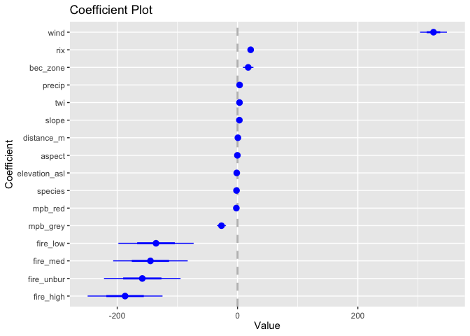
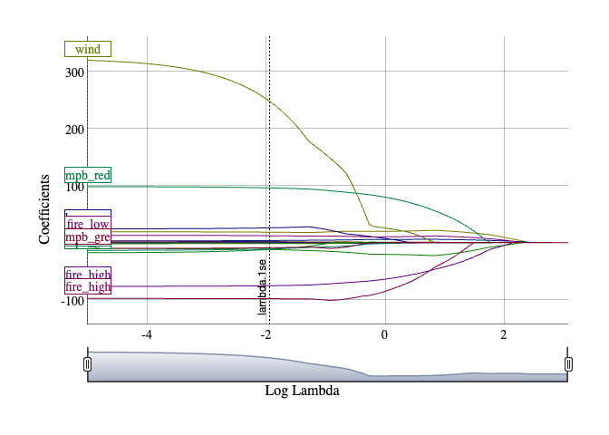

Spatial Point Process Model of Seedling Patterns; Darkwoods Conservation
Area
================
SMurphy
2021-01-30

## Import

Seed set to `123` for replication. Import master dataset of spatial
covariates and seedlings attributes sampled at stem locations.

``` r
set.seed(123)
darkwoods_seedlings_data <- read_excel("1.1.darkwoods_masterfile.xlsx")
knitr::kable(head(darkwoods_seedlings_data, digits = 3)) %>%
    kable_styling(bootstrap_options = c("striped", "hover", "condensed"))
```

<table class="table table-striped table-hover table-condensed" style="margin-left: auto; margin-right: auto;">
<thead>
<tr>
<th style="text-align:right;">
data_point
</th>
<th style="text-align:right;">
x
</th>
<th style="text-align:right;">
y
</th>
<th style="text-align:left;">
geodetic_datum
</th>
<th style="text-align:right;">
plot123
</th>
<th style="text-align:right;">
plot1
</th>
<th style="text-align:right;">
plot2
</th>
<th style="text-align:right;">
plot3
</th>
<th style="text-align:right;">
bec_zone
</th>
<th style="text-align:right;">
bec_ichdw1
</th>
<th style="text-align:right;">
bec_ichmw4
</th>
<th style="text-align:right;">
bec_essfmw4
</th>
<th style="text-align:right;">
density
</th>
<th style="text-align:right;">
intensity
</th>
<th style="text-align:right;">
elevation_asl
</th>
<th style="text-align:right;">
slope
</th>
<th style="text-align:right;">
rix
</th>
<th style="text-align:right;">
aspect
</th>
<th style="text-align:right;">
precip
</th>
<th style="text-align:right;">
twi
</th>
<th style="text-align:right;">
wind
</th>
<th style="text-align:right;">
species
</th>
<th style="text-align:right;">
larix_spp
</th>
<th style="text-align:right;">
pseudo_m
</th>
<th style="text-align:right;">
picea_eng
</th>
<th style="text-align:right;">
pinus_con
</th>
<th style="text-align:right;">
pinus_pond
</th>
<th style="text-align:right;">
pinus_albi
</th>
<th style="text-align:right;">
thuja_plic
</th>
<th style="text-align:right;">
tsuga_hete
</th>
<th style="text-align:right;">
height_cm
</th>
<th style="text-align:right;">
distance_m
</th>
<th style="text-align:right;">
mpb_2005
</th>
<th style="text-align:right;">
mpb_2006
</th>
<th style="text-align:right;">
mpb_2007
</th>
<th style="text-align:right;">
mpb_2008
</th>
<th style="text-align:right;">
mpb_2009
</th>
<th style="text-align:right;">
mpb_2010
</th>
<th style="text-align:right;">
mpb_2011
</th>
<th style="text-align:right;">
mpb_2013
</th>
<th style="text-align:right;">
mpb_2014
</th>
<th style="text-align:right;">
mpb_red
</th>
<th style="text-align:right;">
mpb_grey
</th>
<th style="text-align:right;">
mpb_class
</th>
<th style="text-align:right;">
fire_high
</th>
<th style="text-align:right;">
fire_med
</th>
<th style="text-align:right;">
fire_low
</th>
<th style="text-align:right;">
fire_unbur
</th>
<th style="text-align:right;">
fire_class
</th>
<th style="text-align:left;">
ZONE
</th>
<th style="text-align:left;">
SUBZONE
</th>
<th style="text-align:left;">
VARIANT
</th>
<th style="text-align:left;">
NTRLDSTRBN
</th>
<th style="text-align:left;">
MAP_LABEL
</th>
<th style="text-align:left;">
BGC_LABEL
</th>
<th style="text-align:left;">
…56
</th>
<th style="text-align:left;">
ZONE_NAME
</th>
<th style="text-align:left;">
SBZNNM
</th>
<th style="text-align:left;">
VRNTNM
</th>
<th style="text-align:left;">
NTRLDSTRB1
</th>
<th style="text-align:right;">
freq_code
</th>
</tr>
</thead>
<tbody>
<tr>
<td style="text-align:right;">
1
</td>
<td style="text-align:right;">
524354.9
</td>
<td style="text-align:right;">
5446972
</td>
<td style="text-align:left;">
wgs84utm11n
</td>
<td style="text-align:right;">
3
</td>
<td style="text-align:right;">
0
</td>
<td style="text-align:right;">
0
</td>
<td style="text-align:right;">
1
</td>
<td style="text-align:right;">
2
</td>
<td style="text-align:right;">
0
</td>
<td style="text-align:right;">
1
</td>
<td style="text-align:right;">
0
</td>
<td style="text-align:right;">
53.4266
</td>
<td style="text-align:right;">
100.2280
</td>
<td style="text-align:right;">
1195
</td>
<td style="text-align:right;">
21.3325
</td>
<td style="text-align:right;">
4.93466
</td>
<td style="text-align:right;">
41.6335
</td>
<td style="text-align:right;">
120.226
</td>
<td style="text-align:right;">
5.4566998
</td>
<td style="text-align:right;">
3.79284
</td>
<td style="text-align:right;">
3
</td>
<td style="text-align:right;">
0
</td>
<td style="text-align:right;">
0
</td>
<td style="text-align:right;">
0
</td>
<td style="text-align:right;">
1
</td>
<td style="text-align:right;">
0
</td>
<td style="text-align:right;">
0
</td>
<td style="text-align:right;">
0
</td>
<td style="text-align:right;">
0
</td>
<td style="text-align:right;">
30
</td>
<td style="text-align:right;">
16.64356
</td>
<td style="text-align:right;">
0
</td>
<td style="text-align:right;">
0
</td>
<td style="text-align:right;">
0
</td>
<td style="text-align:right;">
0
</td>
<td style="text-align:right;">
0
</td>
<td style="text-align:right;">
0
</td>
<td style="text-align:right;">
0
</td>
<td style="text-align:right;">
0
</td>
<td style="text-align:right;">
0
</td>
<td style="text-align:right;">
0
</td>
<td style="text-align:right;">
0
</td>
<td style="text-align:right;">
0
</td>
<td style="text-align:right;">
0
</td>
<td style="text-align:right;">
0
</td>
<td style="text-align:right;">
1
</td>
<td style="text-align:right;">
0
</td>
<td style="text-align:right;">
2
</td>
<td style="text-align:left;">
ICH
</td>
<td style="text-align:left;">
mw
</td>
<td style="text-align:left;">
4
</td>
<td style="text-align:left;">
NDT2
</td>
<td style="text-align:left;">
ICHmw4
</td>
<td style="text-align:left;">
ICH mw 4
</td>
<td style="text-align:left;">
NA
</td>
<td style="text-align:left;">
Interior Cedar – Hemlock
</td>
<td style="text-align:left;">
Moist Warm
</td>
<td style="text-align:left;">
Ymir
</td>
<td style="text-align:left;">
Ecosystems with infrequent stand-initiating events
</td>
<td style="text-align:right;">
1
</td>
</tr>
<tr>
<td style="text-align:right;">
2
</td>
<td style="text-align:right;">
524350.2
</td>
<td style="text-align:right;">
5446986
</td>
<td style="text-align:left;">
wgs84utm11n
</td>
<td style="text-align:right;">
3
</td>
<td style="text-align:right;">
0
</td>
<td style="text-align:right;">
0
</td>
<td style="text-align:right;">
1
</td>
<td style="text-align:right;">
2
</td>
<td style="text-align:right;">
0
</td>
<td style="text-align:right;">
1
</td>
<td style="text-align:right;">
0
</td>
<td style="text-align:right;">
61.0590
</td>
<td style="text-align:right;">
111.3160
</td>
<td style="text-align:right;">
1188
</td>
<td style="text-align:right;">
20.1858
</td>
<td style="text-align:right;">
5.18518
</td>
<td style="text-align:right;">
48.5763
</td>
<td style="text-align:right;">
120.226
</td>
<td style="text-align:right;">
4.4154701
</td>
<td style="text-align:right;">
3.79284
</td>
<td style="text-align:right;">
3
</td>
<td style="text-align:right;">
0
</td>
<td style="text-align:right;">
0
</td>
<td style="text-align:right;">
0
</td>
<td style="text-align:right;">
1
</td>
<td style="text-align:right;">
0
</td>
<td style="text-align:right;">
0
</td>
<td style="text-align:right;">
0
</td>
<td style="text-align:right;">
0
</td>
<td style="text-align:right;">
30
</td>
<td style="text-align:right;">
14.16952
</td>
<td style="text-align:right;">
0
</td>
<td style="text-align:right;">
0
</td>
<td style="text-align:right;">
0
</td>
<td style="text-align:right;">
0
</td>
<td style="text-align:right;">
0
</td>
<td style="text-align:right;">
0
</td>
<td style="text-align:right;">
0
</td>
<td style="text-align:right;">
0
</td>
<td style="text-align:right;">
0
</td>
<td style="text-align:right;">
0
</td>
<td style="text-align:right;">
0
</td>
<td style="text-align:right;">
0
</td>
<td style="text-align:right;">
0
</td>
<td style="text-align:right;">
0
</td>
<td style="text-align:right;">
1
</td>
<td style="text-align:right;">
0
</td>
<td style="text-align:right;">
2
</td>
<td style="text-align:left;">
ICH
</td>
<td style="text-align:left;">
mw
</td>
<td style="text-align:left;">
4
</td>
<td style="text-align:left;">
NDT2
</td>
<td style="text-align:left;">
ICHmw4
</td>
<td style="text-align:left;">
ICH mw 4
</td>
<td style="text-align:left;">
NA
</td>
<td style="text-align:left;">
Interior Cedar – Hemlock
</td>
<td style="text-align:left;">
Moist Warm
</td>
<td style="text-align:left;">
Ymir
</td>
<td style="text-align:left;">
Ecosystems with infrequent stand-initiating events
</td>
<td style="text-align:right;">
1
</td>
</tr>
<tr>
<td style="text-align:right;">
3
</td>
<td style="text-align:right;">
524349.5
</td>
<td style="text-align:right;">
5446981
</td>
<td style="text-align:left;">
wgs84utm11n
</td>
<td style="text-align:right;">
3
</td>
<td style="text-align:right;">
0
</td>
<td style="text-align:right;">
0
</td>
<td style="text-align:right;">
1
</td>
<td style="text-align:right;">
2
</td>
<td style="text-align:right;">
0
</td>
<td style="text-align:right;">
1
</td>
<td style="text-align:right;">
0
</td>
<td style="text-align:right;">
56.4796
</td>
<td style="text-align:right;">
110.6190
</td>
<td style="text-align:right;">
1188
</td>
<td style="text-align:right;">
20.1858
</td>
<td style="text-align:right;">
5.18518
</td>
<td style="text-align:right;">
48.5763
</td>
<td style="text-align:right;">
120.226
</td>
<td style="text-align:right;">
4.4154701
</td>
<td style="text-align:right;">
3.79284
</td>
<td style="text-align:right;">
3
</td>
<td style="text-align:right;">
0
</td>
<td style="text-align:right;">
0
</td>
<td style="text-align:right;">
0
</td>
<td style="text-align:right;">
1
</td>
<td style="text-align:right;">
0
</td>
<td style="text-align:right;">
0
</td>
<td style="text-align:right;">
0
</td>
<td style="text-align:right;">
0
</td>
<td style="text-align:right;">
30
</td>
<td style="text-align:right;">
15.51900
</td>
<td style="text-align:right;">
0
</td>
<td style="text-align:right;">
0
</td>
<td style="text-align:right;">
0
</td>
<td style="text-align:right;">
0
</td>
<td style="text-align:right;">
0
</td>
<td style="text-align:right;">
0
</td>
<td style="text-align:right;">
0
</td>
<td style="text-align:right;">
0
</td>
<td style="text-align:right;">
0
</td>
<td style="text-align:right;">
0
</td>
<td style="text-align:right;">
0
</td>
<td style="text-align:right;">
0
</td>
<td style="text-align:right;">
0
</td>
<td style="text-align:right;">
0
</td>
<td style="text-align:right;">
1
</td>
<td style="text-align:right;">
0
</td>
<td style="text-align:right;">
2
</td>
<td style="text-align:left;">
ICH
</td>
<td style="text-align:left;">
mw
</td>
<td style="text-align:left;">
4
</td>
<td style="text-align:left;">
NDT2
</td>
<td style="text-align:left;">
ICHmw4
</td>
<td style="text-align:left;">
ICH mw 4
</td>
<td style="text-align:left;">
NA
</td>
<td style="text-align:left;">
Interior Cedar – Hemlock
</td>
<td style="text-align:left;">
Moist Warm
</td>
<td style="text-align:left;">
Ymir
</td>
<td style="text-align:left;">
Ecosystems with infrequent stand-initiating events
</td>
<td style="text-align:right;">
1
</td>
</tr>
<tr>
<td style="text-align:right;">
4
</td>
<td style="text-align:right;">
524349.5
</td>
<td style="text-align:right;">
5446954
</td>
<td style="text-align:left;">
wgs84utm11n
</td>
<td style="text-align:right;">
3
</td>
<td style="text-align:right;">
0
</td>
<td style="text-align:right;">
0
</td>
<td style="text-align:right;">
1
</td>
<td style="text-align:right;">
2
</td>
<td style="text-align:right;">
0
</td>
<td style="text-align:right;">
1
</td>
<td style="text-align:right;">
0
</td>
<td style="text-align:right;">
74.7973
</td>
<td style="text-align:right;">
103.2070
</td>
<td style="text-align:right;">
1195
</td>
<td style="text-align:right;">
21.3325
</td>
<td style="text-align:right;">
4.93466
</td>
<td style="text-align:right;">
41.6335
</td>
<td style="text-align:right;">
120.447
</td>
<td style="text-align:right;">
5.4566998
</td>
<td style="text-align:right;">
3.84034
</td>
<td style="text-align:right;">
3
</td>
<td style="text-align:right;">
0
</td>
<td style="text-align:right;">
0
</td>
<td style="text-align:right;">
0
</td>
<td style="text-align:right;">
1
</td>
<td style="text-align:right;">
0
</td>
<td style="text-align:right;">
0
</td>
<td style="text-align:right;">
0
</td>
<td style="text-align:right;">
0
</td>
<td style="text-align:right;">
30
</td>
<td style="text-align:right;">
38.26937
</td>
<td style="text-align:right;">
0
</td>
<td style="text-align:right;">
0
</td>
<td style="text-align:right;">
0
</td>
<td style="text-align:right;">
0
</td>
<td style="text-align:right;">
0
</td>
<td style="text-align:right;">
0
</td>
<td style="text-align:right;">
0
</td>
<td style="text-align:right;">
0
</td>
<td style="text-align:right;">
0
</td>
<td style="text-align:right;">
0
</td>
<td style="text-align:right;">
0
</td>
<td style="text-align:right;">
0
</td>
<td style="text-align:right;">
1
</td>
<td style="text-align:right;">
0
</td>
<td style="text-align:right;">
0
</td>
<td style="text-align:right;">
0
</td>
<td style="text-align:right;">
4
</td>
<td style="text-align:left;">
ICH
</td>
<td style="text-align:left;">
mw
</td>
<td style="text-align:left;">
4
</td>
<td style="text-align:left;">
NDT2
</td>
<td style="text-align:left;">
ICHmw4
</td>
<td style="text-align:left;">
ICH mw 4
</td>
<td style="text-align:left;">
NA
</td>
<td style="text-align:left;">
Interior Cedar – Hemlock
</td>
<td style="text-align:left;">
Moist Warm
</td>
<td style="text-align:left;">
Ymir
</td>
<td style="text-align:left;">
Ecosystems with infrequent stand-initiating events
</td>
<td style="text-align:right;">
1
</td>
</tr>
<tr>
<td style="text-align:right;">
5
</td>
<td style="text-align:right;">
524202.1
</td>
<td style="text-align:right;">
5447057
</td>
<td style="text-align:left;">
wgs84utm11n
</td>
<td style="text-align:right;">
3
</td>
<td style="text-align:right;">
0
</td>
<td style="text-align:right;">
0
</td>
<td style="text-align:right;">
1
</td>
<td style="text-align:right;">
2
</td>
<td style="text-align:right;">
0
</td>
<td style="text-align:right;">
1
</td>
<td style="text-align:right;">
0
</td>
<td style="text-align:right;">
74.7973
</td>
<td style="text-align:right;">
88.9428
</td>
<td style="text-align:right;">
1254
</td>
<td style="text-align:right;">
23.8554
</td>
<td style="text-align:right;">
4.62962
</td>
<td style="text-align:right;">
58.4957
</td>
<td style="text-align:right;">
123.916
</td>
<td style="text-align:right;">
6.6795702
</td>
<td style="text-align:right;">
3.84098
</td>
<td style="text-align:right;">
3
</td>
<td style="text-align:right;">
0
</td>
<td style="text-align:right;">
0
</td>
<td style="text-align:right;">
0
</td>
<td style="text-align:right;">
1
</td>
<td style="text-align:right;">
0
</td>
<td style="text-align:right;">
0
</td>
<td style="text-align:right;">
0
</td>
<td style="text-align:right;">
0
</td>
<td style="text-align:right;">
16
</td>
<td style="text-align:right;">
29.23869
</td>
<td style="text-align:right;">
0
</td>
<td style="text-align:right;">
0
</td>
<td style="text-align:right;">
0
</td>
<td style="text-align:right;">
0
</td>
<td style="text-align:right;">
0
</td>
<td style="text-align:right;">
0
</td>
<td style="text-align:right;">
0
</td>
<td style="text-align:right;">
0
</td>
<td style="text-align:right;">
0
</td>
<td style="text-align:right;">
0
</td>
<td style="text-align:right;">
0
</td>
<td style="text-align:right;">
0
</td>
<td style="text-align:right;">
0
</td>
<td style="text-align:right;">
0
</td>
<td style="text-align:right;">
0
</td>
<td style="text-align:right;">
1
</td>
<td style="text-align:right;">
1
</td>
<td style="text-align:left;">
ICH
</td>
<td style="text-align:left;">
mw
</td>
<td style="text-align:left;">
4
</td>
<td style="text-align:left;">
NDT2
</td>
<td style="text-align:left;">
ICHmw4
</td>
<td style="text-align:left;">
ICH mw 4
</td>
<td style="text-align:left;">
NA
</td>
<td style="text-align:left;">
Interior Cedar – Hemlock
</td>
<td style="text-align:left;">
Moist Warm
</td>
<td style="text-align:left;">
Ymir
</td>
<td style="text-align:left;">
Ecosystems with infrequent stand-initiating events
</td>
<td style="text-align:right;">
1
</td>
</tr>
<tr>
<td style="text-align:right;">
6
</td>
<td style="text-align:right;">
524184.9
</td>
<td style="text-align:right;">
5447071
</td>
<td style="text-align:left;">
wgs84utm11n
</td>
<td style="text-align:right;">
3
</td>
<td style="text-align:right;">
0
</td>
<td style="text-align:right;">
0
</td>
<td style="text-align:right;">
1
</td>
<td style="text-align:right;">
2
</td>
<td style="text-align:right;">
0
</td>
<td style="text-align:right;">
1
</td>
<td style="text-align:right;">
0
</td>
<td style="text-align:right;">
41.2148
</td>
<td style="text-align:right;">
56.8787
</td>
<td style="text-align:right;">
1246
</td>
<td style="text-align:right;">
22.4813
</td>
<td style="text-align:right;">
4.53455
</td>
<td style="text-align:right;">
55.3758
</td>
<td style="text-align:right;">
124.590
</td>
<td style="text-align:right;">
0.0458695
</td>
<td style="text-align:right;">
3.84098
</td>
<td style="text-align:right;">
3
</td>
<td style="text-align:right;">
0
</td>
<td style="text-align:right;">
0
</td>
<td style="text-align:right;">
0
</td>
<td style="text-align:right;">
1
</td>
<td style="text-align:right;">
0
</td>
<td style="text-align:right;">
0
</td>
<td style="text-align:right;">
0
</td>
<td style="text-align:right;">
0
</td>
<td style="text-align:right;">
16
</td>
<td style="text-align:right;">
31.71273
</td>
<td style="text-align:right;">
0
</td>
<td style="text-align:right;">
0
</td>
<td style="text-align:right;">
0
</td>
<td style="text-align:right;">
0
</td>
<td style="text-align:right;">
0
</td>
<td style="text-align:right;">
0
</td>
<td style="text-align:right;">
0
</td>
<td style="text-align:right;">
0
</td>
<td style="text-align:right;">
0
</td>
<td style="text-align:right;">
0
</td>
<td style="text-align:right;">
0
</td>
<td style="text-align:right;">
0
</td>
<td style="text-align:right;">
0
</td>
<td style="text-align:right;">
0
</td>
<td style="text-align:right;">
0
</td>
<td style="text-align:right;">
1
</td>
<td style="text-align:right;">
1
</td>
<td style="text-align:left;">
ICH
</td>
<td style="text-align:left;">
mw
</td>
<td style="text-align:left;">
4
</td>
<td style="text-align:left;">
NDT2
</td>
<td style="text-align:left;">
ICHmw4
</td>
<td style="text-align:left;">
ICH mw 4
</td>
<td style="text-align:left;">
NA
</td>
<td style="text-align:left;">
Interior Cedar – Hemlock
</td>
<td style="text-align:left;">
Moist Warm
</td>
<td style="text-align:left;">
Ymir
</td>
<td style="text-align:left;">
Ecosystems with infrequent stand-initiating events
</td>
<td style="text-align:right;">
1
</td>
</tr>
</tbody>
</table>

## Covariate Screening

Derive OLS models to explore covariate effects against intercept only
models

``` r
seed_formula = intensity ~ distance_m + elevation_asl + slope +
    aspect + rix + twi + wind + mpb_grey + mpb_red + fire_high +
    fire_med + fire_low - 1

seed_formula2 = intensity ~ distance_m + elevation_asl + slope +
    aspect + rix + twi + wind + mpb_class + fire_high + fire_med +
    fire_low + fire_unbur - 1

seed_formula3 = intensity ~ distance_m + elevation_asl + slope +
    aspect + rix + twi + wind + mpb_grey + mpb_red + fire_high +
    fire_med + fire_low + fire_unbur + bec_zone - 1

seed_formula4 = intensity ~ distance_m + elevation_asl + slope +
    aspect + rix + twi + wind + mpb_grey + mpb_red + fire_high +
    fire_med + fire_low + fire_unbur + bec_zone + species - 1

seed_formula5 = intensity ~ distance_m + elevation_asl + slope +
    aspect + rix + twi + wind + mpb_grey + mpb_red + fire_high +
    fire_med + fire_low + fire_unbur + bec_zone + species + precip -
    1

# Fitted with disturbance interaction effects with
# mpb-class and fire-classes combined
seed_formula6.1 = intensity ~ distance_m + elevation_asl + slope +
    aspect + rix + twi + wind + bec_zone + species + precip +
    mpb_class * fire_class - 1

# Fitted with disturbance interaction effects with
# mpb-class and fire-classes combined
seed_formula6.2 = intensity ~ distance_m + elevation_asl + slope +
    aspect + rix + twi + wind + bec_zone + species + precip +
    mpb_red * fire_high + mpb_grey * fire_high + mpb_red * fire_low +
    mpb_grey * fire_low - 1

allseeds_lm = lm(seed_formula, data = darkwoods_seedlings_data)
allseeds_lm2 = lm(seed_formula2, data = darkwoods_seedlings_data)
allseeds_lm3 = lm(seed_formula3, data = darkwoods_seedlings_data)
allseeds_lm4 = lm(seed_formula4, data = darkwoods_seedlings_data)  #best fit model
allseeds_lm5 = lm(seed_formula5, data = darkwoods_seedlings_data)
allseeds_lm6.1 = lm(seed_formula6.1, data = darkwoods_seedlings_data)
allseeds_lm6.2 = lm(seed_formula6.2, data = darkwoods_seedlings_data)

coefplot(allseeds_lm, sort = "magnitude")
coefplot(allseeds_lm2, sort = "magnitude")
coefplot(allseeds_lm3, sort = "magnitude")
coefplot(allseeds_lm4, sort = "magnitude")
coefplot(allseeds_lm5, sort = "magnitude")
coefplot(allseeds_lm6.1, sort = "magnitude")
coefplot(allseeds_lm6.2, sort = "magnitude")
```


## Model Training

Split into training and test data subset for each model with covariates
and repsonse variables mounted.

``` r
allseedsX_train <- build.x(allseeds_lm, data = darkwoods_seedlings_data,
    contrasts = FALSE, sparse = TRUE)
allseedsY_train <- build.y(allseeds_lm, data = darkwoods_seedlings_data)

allseedsX_train2 <- build.x(allseeds_lm2, data = darkwoods_seedlings_data,
    contrasts = FALSE, sparse = TRUE)
allseedsY_train2 <- build.y(allseeds_lm2, data = darkwoods_seedlings_data)

allseedsX_train3 <- build.x(allseeds_lm3, data = darkwoods_seedlings_data,
    contrasts = FALSE, sparse = TRUE)
allseedsY_train3 <- build.y(allseeds_lm3, data = darkwoods_seedlings_data)

allseedsX_train4 <- build.x(allseeds_lm4, data = darkwoods_seedlings_data,
    contrasts = FALSE, sparse = TRUE)
allseedsY_train4 <- build.y(allseeds_lm4, data = darkwoods_seedlings_data)

allseedsX_train5 <- build.x(allseeds_lm5, data = darkwoods_seedlings_data,
    contrasts = FALSE, sparse = TRUE)
allseedsY_train5 <- build.y(allseeds_lm5, data = darkwoods_seedlings_data)

allseedsX_train6.1 <- build.x(allseeds_lm6.1, data = darkwoods_seedlings_data,
    contrasts = FALSE, sparse = TRUE)
allseedsY_train6.1 <- build.y(allseeds_lm6.1, data = darkwoods_seedlings_data)

allseedsX_train6.2 <- build.x(allseeds_lm6.2, data = darkwoods_seedlings_data,
    contrasts = FALSE, sparse = TRUE)
allseedsY_train6.2 <- build.y(allseeds_lm6.2, data = darkwoods_seedlings_data)
```

## Model Tuning

We run a generalised linear model over an elastic-net (latticed plane)
using the `glmnet` package and its `glmnet` kernel to explore data with
two varying lambda’s; one penalizing and one performance-enhancing
lambda’s. Below, the `alpha=1` function is used to fit the lasso-model
with a lambda that suppresses outliers. Contrastly, the `alpha=0`
function fits a ridge-based lambda designed to seek out correlation.
Better yet, we can apply the elastic-net function to estimate an optimal
lambda as a percentage of alpha between `0` & `1`.

``` r
allseeds_glmnet_lasso <- glmnet(x = allseedsX_train, y = allseedsY_train,
    family = "gaussian", alpha = 1)
allseeds_glmnet_ridge <- glmnet(x = allseedsX_train, y = allseedsY_train,
    family = "gaussian", alpha = 0)
allseeds_glmnet_lasso2 <- glmnet(x = allseedsX_train2, y = allseedsY_train2,
    family = "gaussian", alpha = 1)
allseeds_glmnet_ridge2 <- glmnet(x = allseedsX_train2, y = allseedsY_train2,
    family = "gaussian", alpha = 0)
allseeds_glmnet_lasso3 <- glmnet(x = allseedsX_train3, y = allseedsY_train3,
    family = "gaussian", alpha = 1)
allseeds_glmnet_ridge3 <- glmnet(x = allseedsX_train3, y = allseedsY_train3,
    family = "gaussian", alpha = 0)
allseeds_glmnet_lasso4 <- glmnet(x = allseedsX_train4, y = allseedsY_train4,
    family = "gaussian", alpha = 1)
allseeds_glmnet_ridge4 <- glmnet(x = allseedsX_train4, y = allseedsY_train4,
    family = "gaussian", alpha = 0)
allseeds_glmnet_lasso5 <- glmnet(x = allseedsX_train5, y = allseedsY_train5,
    family = "gaussian", alpha = 1)
allseeds_glmnet_ridge5 <- glmnet(x = allseedsX_train5, y = allseedsY_train5,
    family = "gaussian", alpha = 0)
allseeds_glmnet_lasso6.1 <- glmnet(x = allseedsX_train6.1, y = allseedsY_train6.1,
    family = "gaussian", alpha = 1)
allseeds_glmnet_ridge6.1 <- glmnet(x = allseedsX_train6.1, y = allseedsY_train6.1,
    family = "gaussian", alpha = 0)
allseeds_glmnet_lasso6.2 <- glmnet(x = allseedsX_train6.2, y = allseedsY_train6.2,
    family = "gaussian", alpha = 1)
allseeds_glmnet_ridge6.2 <- glmnet(x = allseedsX_train6.2, y = allseedsY_train6.2,
    family = "gaussian", alpha = 0)

plot(allseeds_glmnet_lasso)
plot(allseeds_glmnet_ridge)
plot(allseeds_glmnet_lasso2)
plot(allseeds_glmnet_ridge2)
plot(allseeds_glmnet_lasso3)
plot(allseeds_glmnet_ridge3)
plot(allseeds_glmnet_lasso4)
plot(allseeds_glmnet_ridge4)
plot(allseeds_glmnet_lasso5)
plot(allseeds_glmnet_ridge5)
plot(allseeds_glmnet_lasso6.1)
plot(allseeds_glmnet_ridge6.1)
plot(allseeds_glmnet_lasso6.2)
plot(allseeds_glmnet_ridge6.2)
```



## Model Validation

Adding the `nfolds` function, we apply a 10K-fold cross validation to
measure the generalized and singular effects of covariates. Taken from
`coefplot` package, the `coefpath` function produces an interactive
graph of covariance and reduced magnitude as the model approaches a mean
of zero. Zoom in to distinguish remaining predictors and their
coefficients.

``` r
allseeds_glmnet_lasso_cv_10fold <- cv.glmnet(x = allseedsX_train,
    y = allseedsY_train, family = "gaussian", alpha = 1, nfolds = 10)
allseeds_glmnet_ridge_cv_10fold <- cv.glmnet(x = allseedsX_train,
    y = allseedsY_train, family = "gaussian", alpha = 0, nfolds = 10)
allseeds_glmnet_lasso2_cv_10fold <- glmnet(x = allseedsX_train2,
    y = allseedsY_train2, family = "gaussian", alpha = 1, nfolds = 10)
allseeds_glmnet_ridge2_cv_10fold <- glmnet(x = allseedsX_train2,
    y = allseedsY_train2, family = "gaussian", alpha = 0, nfolds = 10)
allseeds_glmnet_lasso3_cv_10fold <- glmnet(x = allseedsX_train3,
    y = allseedsY_train3, family = "gaussian", alpha = 1, nfolds = 10)
allseeds_glmnet_ridge3_cv_10fold <- glmnet(x = allseedsX_train3,
    y = allseedsY_train3, family = "gaussian", alpha = 0, nfolds = 10)
allseeds_glmnet_lasso4_cv_10fold <- glmnet(x = allseedsX_train4,
    y = allseedsY_train4, family = "gaussian", alpha = 1, nfolds = 10)
allseeds_glmnet_ridge4_cv_10fold <- glmnet(x = allseedsX_train4,
    y = allseedsY_train4, family = "gaussian", alpha = 0, nfolds = 10)
allseeds_glmnet_lasso5_cv_10fold <- glmnet(x = allseedsX_train5,
    y = allseedsY_train5, family = "gaussian", alpha = 1, nfolds = 10)
allseeds_glmnet_ridge5_cv_10fold <- glmnet(x = allseedsX_train5,
    y = allseedsY_train5, family = "gaussian", alpha = 0, nfolds = 10)
allseeds_glmnet_lasso6.1_cv_10fold <- glmnet(x = allseedsX_train6.1,
    y = allseedsY_train6.1, family = "gaussian", alpha = 1, nfolds = 10)
allseeds_glmnet_ridge6.1_cv_10fold <- glmnet(x = allseedsX_train6.1,
    y = allseedsY_train6.1, family = "gaussian", alpha = 0, nfolds = 10)
allseeds_glmnet_lasso6.2_cv_10fold <- glmnet(x = allseedsX_train6.2,
    y = allseedsY_train6.2, family = "gaussian", alpha = 1, nfolds = 10)
allseeds_glmnet_ridge6.2_cv_10fold <- glmnet(x = allseedsX_train6.2,
    y = allseedsY_train6.2, family = "gaussian", alpha = 0, nfolds = 10)

plot(allseeds_glmnet_lasso_cv_10fold)
plot(allseeds_glmnet_lasso_cv_10fold)
plot(allseeds_glmnet_ridge_cv_10fold)
plot(allseeds_glmnet_lasso2_cv_10fold)
plot(allseeds_glmnet_ridge2_cv_10fold)
plot(allseeds_glmnet_lasso3_cv_10fold)
plot(allseeds_glmnet_ridge3_cv_10fold)
plot(allseeds_glmnet_lasso4_cv_10fold)
plot(allseeds_glmnet_ridge4_cv_10fold)
plot(allseeds_glmnet_lasso5_cv_10fold)
plot(allseeds_glmnet_ridge5_cv_10fold)
plot(allseeds_glmnet_lasso6.1_cv_10fold)
plot(allseeds_glmnet_ridge6.1_cv_10fold)
plot(allseeds_glmnet_lasso6.2_cv_10fold)
plot(allseeds_glmnet_ridge6.2_cv_10fold)

coefpath(allseeds_glmnet_lasso_cv_10fold)
coefpath(allseeds_glmnet_ridge_cv_10fold)
coefpath(allseeds_glmnet_lasso2_cv_10fold)
coefpath(allseeds_glmnet_ridge2_cv_10fold)
coefpath(allseeds_glmnet_lasso3_cv_10fold)
coefpath(allseeds_glmnet_ridge3_cv_10fold)
coefpath(allseeds_glmnet_lasso4_cv_10fold)
coefpath(allseeds_glmnet_ridge4_cv_10fold)
coefpath(allseeds_glmnet_lasso5_cv_10fold)
coefpath(allseeds_glmnet_ridge5_cv_10fold)
coefpath(allseeds_glmnet_lasso6.1_cv_10fold)
coefpath(allseeds_glmnet_ridge6.1_cv_10fold)
coefpath(allseeds_glmnet_lasso6.2_cv_10fold)
coefpath(allseeds_glmnet_ridge6.2_cv_10fold)
```



<div class="dygraphs html-widget html-fill-item-overflow-hidden html-fill-item" id="coefpath_Ajktmr8QOGrY" style="width:50%;height:480px;"></div>
<script type="application/json" data-for="coefpath_Ajktmr8QOGrY">{"x":{"attrs":{"axes":{"x":{"pixelsPerLabel":60},"y":[]},"labels":["lambda","distance_m","elevation_asl","slope","aspect","rix","twi","wind","mpb_grey","mpb_red","fire_high","fire_med","fire_low"],"retainDateWindow":false,"xlabel":"Log Lambda","ylabel":"Coefficients","legend":"onmouseover","labelsDivWidth":250,"labelsShowZeroValues":true,"labelsSeparateLines":false,"showRangeSelector":true,"rangeSelectorHeight":40,"rangeSelectorPlotFillColor":" #A7B1C4","rangeSelectorPlotStrokeColor":"#808FAB","interactionModel":"Dygraph.Interaction.defaultModel","highlightCircleSize":3,"highlightSeriesBackgroundAlpha":0.5,"highlightSeriesOpts":{"strokeWidth":3},"hideOverlayOnMouseOut":true},"annotations":[{"x":-4.63615297429361,"shortText":"distance_m","text":"distance_m","width":50,"attachAtBottom":false,"series":"distance_m"},{"x":-4.63615297429361,"shortText":"elevation_asl","text":"elevation_asl","width":50,"attachAtBottom":false,"series":"elevation_asl"},{"x":-4.63615297429361,"shortText":"slope","text":"slope","width":50,"attachAtBottom":false,"series":"slope"},{"x":-4.63615297429361,"shortText":"aspect","text":"aspect","width":50,"attachAtBottom":false,"series":"aspect"},{"x":-4.63615297429361,"shortText":"rix","text":"rix","width":50,"attachAtBottom":false,"series":"rix"},{"x":-4.63615297429361,"shortText":"twi","text":"twi","width":50,"attachAtBottom":false,"series":"twi"},{"x":-4.63615297429361,"shortText":"wind","text":"wind","width":50,"attachAtBottom":false,"series":"wind"},{"x":-4.63615297429361,"shortText":"mpb_grey","text":"mpb_grey","width":50,"attachAtBottom":false,"series":"mpb_grey"},{"x":-4.63615297429361,"shortText":"mpb_red","text":"mpb_red","width":50,"attachAtBottom":false,"series":"mpb_red"},{"x":-4.63615297429361,"shortText":"fire_high","text":"fire_high","width":50,"attachAtBottom":false,"series":"fire_high"},{"x":-4.63615297429361,"shortText":"fire_med","text":"fire_med","width":50,"attachAtBottom":false,"series":"fire_med"},{"x":-4.63615297429361,"shortText":"fire_low","text":"fire_low","width":50,"attachAtBottom":false,"series":"fire_low"}],"shadings":[],"events":[{"pos":-4.63615297429361,"label":"lambda.min","labelLoc":"bottom","color":"black","strokePattern":[2,2],"axis":"x"},{"pos":-1.100870811312853,"label":"lambda.1se","labelLoc":"bottom","color":"black","strokePattern":[2,2],"axis":"x"}],"format":"numeric","data":[[-4.63615297429361,-4.543119233162537,-4.450085492031465,-4.357051750900392,-4.26401800976932,-4.170984268638247,-4.077950527507174,-3.984916786376102,-3.891883045245029,-3.798849304113957,-3.705815562982885,-3.612781821851812,-3.519748080720739,-3.426714339589667,-3.333680598458594,-3.240646857327522,-3.147613116196449,-3.054579375065377,-2.961545633934304,-2.868511892803232,-2.775478151672159,-2.682444410541086,-2.589410669410014,-2.496376928278941,-2.403343187147869,-2.310309446016796,-2.217275704885724,-2.124241963754651,-2.031208222623579,-1.938174481492506,-1.845140740361433,-1.752106999230361,-1.659073258099288,-1.566039516968216,-1.473005775837143,-1.379972034706071,-1.286938293574998,-1.193904552443926,-1.100870811312853,-1.007837070181781,-0.914803329050708,-0.8217695879196355,-0.7287358467885631,-0.6357021056574905,-0.542668364526418,-0.4496346233953456,-0.3566008822642729,-0.2635671411332006,-0.170533400002128,-0.07749965887105552,0.01553408226001709,0.1085678233910895,0.2016015645221621,0.2946353056532348,0.3876690467843072,0.4807027879153799,0.5737365290464524,0.6667702701775249,0.7598040113085975,0.85283775243967,0.9458714935707426,1.038905234701815,1.131938975832888,1.22497271696396,1.318006458095033,1.411040199226105,1.504073940357178,1.59710768148825,1.690141422619323,1.783175163750395,1.876208904881468,1.969242646012541,2.062276387143613,2.155310128274686,2.248343869405758,2.341377610536831,2.434411351667904,2.527445092798976,2.620478833930048,2.713512575061121,2.806546316192193,2.899580057323266,2.992613798454338,3.08564753958541],[0.7437316713015495,0.7437464523679997,0.7435814210376093,0.7435481512102368,0.7434457451816838,0.7433272276715529,0.7432081277091468,0.7430717564109346,0.7429161360023614,0.7427468912748403,0.7425577253763233,0.7423521370389462,0.7421228580359901,0.7418706102986874,0.7415935912088648,0.7412897090734196,0.7409552574946361,0.7405876850069287,0.7401852363499503,0.7397422665274287,0.7392578218229672,0.7387254348985866,0.7381403632881262,0.7374993544638303,0.7367958543328077,0.7360241964701836,0.735176022276969,0.7341023047214142,0.7335547101611706,0.7330103795630697,0.731996082392897,0.7302514002644123,0.7283344322295957,0.726228039567082,0.7240427885853955,0.7225711292017255,0.7209559890184506,0.7191830333128139,0.7172378160088911,0.7151025430087271,0.7127596441544543,0.7101877923017773,0.7073652796866234,0.7042676591788105,0.7009469263287877,0.6976230364739514,0.6939750775918505,0.6899707122818629,0.685511167123523,0.6802825554749109,0.6763731244192717,0.6765390609295083,0.6768880618968186,0.6770996142916823,0.6774815743288185,0.6775558055684103,0.6782912309118839,0.6787197310392564,0.6792312027077791,0.6674055060453253,0.6545285177488575,0.6406587147661286,0.6251648048976862,0.608160257568099,0.5894977399724859,0.5690185592073603,0.5468171338560771,0.5221737856884868,0.4951277415431559,0.4654447273799372,0.4328680530624924,0.3973822725246121,0.3592067920326736,0.3162203768223263,0.277762701886548,0.2555869391270599,0.2385061534270995,0.2203900715894813,0.1946201295235813,0.1656866218226807,0.1339321328234132,0.09908160085198976,0.06080964340990824,0],[-0.7259913852218459,-0.7253085955285744,-0.7243529613101852,-0.723488670303145,-0.7224387185922869,-0.7212922312869071,-0.7201434751368068,-0.7188202578644207,-0.7173122313486712,-0.7157040417197007,-0.7139055082310055,-0.7120075264768596,-0.709825679130792,-0.7074313535326862,-0.7048190007920955,-0.701988861073306,-0.698838901131678,-0.6953420435040489,-0.6915868003582314,-0.6873604201173278,-0.6828411442432512,-0.6778280062517161,-0.6722673089842299,-0.6662316472819336,-0.6596034604536162,-0.6523534229689277,-0.6443137790803015,-0.6355204384096236,-0.626056280517825,-0.6157426981533033,-0.6046582172644748,-0.5938920859374853,-0.5820516405463074,-0.56902828299032,-0.5549509857234998,-0.537694897305584,-0.5187557811857448,-0.4980172832987244,-0.4751739950565528,-0.4501586961508862,-0.4226269808251277,-0.392483249028609,-0.3593878827276751,-0.3230542085973845,-0.284141766445267,-0.2469215696212096,-0.2060721752626469,-0.1612728991820757,-0.1113678677686617,-0.05088600276532672,0,0,0,0,0,0,0,0,0,0,0,0,0,0,0,0,0,0,0,0,0,0,0,0,0,0,0,0,0,0,0,0,0,0],[1.335597234374784,1.335830004580446,1.33512891643021,1.33563625436161,1.335418478275487,1.335234887069325,1.334964571550379,1.334706358992408,1.334461460754512,1.334191749779501,1.3339154898316,1.333615673947055,1.333294970634457,1.332947497613718,1.332569699825595,1.332161510317216,1.331711949723918,1.331213490091745,1.33067420158051,1.330071968207298,1.329418459837112,1.328696888894088,1.32790038776026,1.327028879282379,1.326071433932492,1.325021286089949,1.323864614517465,1.322547617209323,1.321457187470279,1.320136988102855,1.322514450898489,1.335057500086013,1.348847896270804,1.364011071543749,1.380601439547586,1.385047567288465,1.389927177995495,1.395283299287618,1.401160311024236,1.407611206971451,1.414689818179747,1.422459741775433,1.430987020829987,1.440345514280757,1.447988815745217,1.440691524439335,1.432682621707708,1.423908989468491,1.416261740866827,1.424185072906415,1.40698777182256,1.288019997823104,1.155813431217925,1.01240156117327,0.8535356742396004,0.6843076573571467,0.4902291767520776,0.2856476165275205,0.06065774647778412,0.05689762154887289,0.07530034495912043,0.09462290359271154,0.1167139601181294,0.140958867113914,0.1675677500567472,0.1967708044874231,0.2280404088230136,0.2631395074241996,0.3016607246055668,0.3439377341301457,0.3903388360018699,0.4406137528901127,0.4947901551077123,0.5591126496464427,0.6418422603181644,0.6444117043411001,0.6143732256589755,0.5891905511454301,0.5308688449593881,0.4225456334623556,0.3036610426035727,0.173185391296058,0.03003730417289073,0],[-0.2887142521190196,-0.2885910746676658,-0.2884551146256079,-0.2883105525216118,-0.2881464173387678,-0.2879683125154908,-0.2877856903622138,-0.2875778828265357,-0.2873433456262574,-0.2870920854727828,-0.2868123760514223,-0.2865154538453687,-0.2861767510986981,-0.285805168339702,-0.2853994825673062,-0.2849592636480948,-0.2844702994782669,-0.2839283036580467,-0.2833445479607919,-0.2826897748158213,-0.2819870829471255,-0.281208747598171,-0.2803466536682785,-0.2794094508441788,-0.2783803148593877,-0.2772540788347495,-0.2760070047128191,-0.2746540469018541,-0.2731417373688382,-0.2714821045777419,-0.2699180151196067,-0.2688676001857765,-0.2677128315413665,-0.2664432312962686,-0.265046818460516,-0.2625966142892071,-0.2599074398962838,-0.2569624402584814,-0.2537191279688661,-0.2501670457028325,-0.2462581840837141,-0.2419779719300403,-0.2372787356934934,-0.2321197705302531,-0.2264642996912068,-0.2202196042354149,-0.2133660155463615,-0.2058493817500275,-0.1975920874434414,-0.1885682390697031,-0.1802360173894021,-0.1767669603729484,-0.1729245785326679,-0.1687436303782946,-0.1641235460432006,-0.159088783665251,-0.1536483841006284,-0.1479495173085556,-0.1416863494446166,-0.1389740910820105,-0.1362953228013072,-0.1333406409720011,-0.1301142012839362,-0.1265731878001551,-0.1226869355025955,-0.118421161584775,-0.1137142556280838,-0.1085742675989674,-0.1029331370798297,-0.09674200555278714,-0.08994708433955498,-0.08245891126931809,-0.07408730825551182,-0.06533162096148618,-0.05592669528426793,-0.04138381022111541,-0.02396588292957163,-0.009072328760169038,0,0,0,0,0,0],[14.30142407052544,14.3152354778476,14.3329101282111,14.35016985389632,14.37039071136062,14.39241611627509,14.41426095489778,14.43958656105935,14.46856641065123,14.49935898100098,14.53385862764078,14.57008126171334,14.61198163429226,14.65795367912605,14.7080609410983,14.76223924744879,14.82266024715102,14.88984211924422,14.96175237041625,15.04298624003211,15.12950856973993,15.22564047558127,15.33244238083471,15.4481729002103,15.57527634148604,15.71423343998553,15.86856626832819,16.03165086361778,16.22562780252608,16.43555762380272,16.65396402170217,16.84660017979571,17.05853293789118,17.29172424331245,17.54337791262665,17.88200891587263,18.25366914464646,18.6604996688133,19.10886781048888,19.59970379659056,20.14014672866305,20.73164787605404,21.38110581202302,22.09414621697421,22.83067965020615,23.35111455711627,23.92229622173338,24.54856835261625,25.27019457006877,26.36166002275161,27.21114313928549,26.89197898520221,26.54174518117039,26.15731421970451,25.73544520929921,25.27200048815839,24.80236617783189,24.34745323531278,23.84819360270984,23.28465852003242,22.66475962163828,21.98441695231013,21.23772969635284,20.41824135325322,19.51885390943556,18.53178614241858,17.44851980718519,16.25958817917263,14.95473718507634,13.52266481115845,11.95097092017587,10.22615563975959,8.333897969000239,6.307591834126754,4.492320095105808,2.488093225677049,0.286515910941444,0,0,0,0,0,0,0],[4.426030826413525,4.426621386688304,4.429227772544261,4.430110209737959,4.432156003764819,4.43436741320752,4.436518557528388,4.439042180034323,4.441951637003829,4.445018443249757,4.44846709411449,4.452046542285743,4.456242767393052,4.460844873676449,4.465850357782499,4.471239447440322,4.477275382466765,4.484010295334216,4.491169233796414,4.499321030156452,4.507931971280178,4.517532130267663,4.528233790685347,4.539789721306687,4.552483824185396,4.56634699371474,4.581794774327818,4.597475568983631,4.619448358862173,4.643755751800549,4.67055018014663,4.695271251161752,4.722480402153163,4.752432392790319,4.783942959504441,4.824318046325272,4.868631406565389,4.917122879417764,4.970592244942948,5.029108198417476,5.093563245511937,5.164084310914399,5.241519310791393,5.32653900168111,5.417248231188453,5.502135904061399,5.595300863701437,5.697448173445814,5.811550495889922,5.952046515376312,6.066019256196552,6.05861513828495,6.05071542613627,6.041812980560465,6.032245660917926,6.020023050608645,6.010419574220301,5.998431261293833,5.985362136413753,5.88382035910251,5.758885402853736,5.621146965873098,5.470635671114407,5.305449712683473,5.124158467051367,4.925179130029804,4.706053532288215,4.466321757470041,4.203216430464273,3.914458708521751,3.597544654494272,3.24893667338818,2.863409985939184,2.446678070504706,1.976293009833804,1.405534149756201,0.760095383942592,0,0,0,0,0,0,0],[225.4933074017713,225.3000567210156,225.0142846486308,224.7704873893611,224.4641739902396,224.1301027255182,223.7944118589789,223.4083170493051,222.9688338877563,222.4999665133857,221.975899433143,221.4225798986295,220.7869623857155,220.0894828132508,219.3284664387789,218.5039206704611,217.5863487469513,216.5678363758295,215.4738317510965,214.2428754392552,212.9262494834119,211.4659038750775,209.8462277590772,208.0879914911078,206.1571554512176,204.0450884403585,201.7032586339495,199.1449677779349,196.3821536312104,193.3713080903014,190.1447729399849,187.0505497020175,183.6476255074093,179.9048042569797,175.8637167661441,170.8495170270637,165.3462717643516,159.3200559467487,152.6824286178937,145.4135417784444,137.4136281187482,128.6545640782589,119.0378546643311,108.4801996146559,97.16970238280858,86.34413992667749,74.46301940541134,61.43298605503703,46.92129623728921,29.34200586250491,14.31120680730982,13.08676107503482,11.73097227387783,10.25528580617994,8.62498654231497,6.876722032272368,4.8596401694344,2.663390458825281,0.2495989805022434,0,0,0,0,0,0,0,0,0,0,0,0,0,0,0,0,0,0,0,0,0,0,0,0,0],[-22.94024971726485,-22.9094521217067,-22.86288770967012,-22.82364355500854,-22.77410943979503,-22.7200465480204,-22.66543616080957,-22.60276518452504,-22.53157753005823,-22.45548661094351,-22.3705458657426,-22.28062161693536,-22.17761125343305,-22.06458108670954,-21.94122429882609,-21.80747208909559,-21.65875054709504,-21.49378358288918,-21.31638603292535,-21.11705431880782,-20.90356742164143,-20.66691137514265,-20.40457958385382,-20.11964931909504,-19.80675980377929,-19.4644451599832,-19.08508859343662,-18.68042219848475,-18.20186009508042,-17.67876660482508,-17.08978539004638,-16.45432330372405,-15.75561795523365,-14.98730190511064,-14.15790495906425,-13.24008002769619,-12.23274167505364,-11.12935233986592,-9.914585134476566,-8.583910923708503,-7.11994457310576,-5.516559480350095,-3.756265678598521,-1.823815560887271,0,0,0,0,0.2161265696372894,2.534345406778704,4.355259434994772,3.73495939685205,3.053526049123459,2.306326625953228,1.485688473713785,0.583660171320401,0,0,0,0,0,0,0,0,0,0,0,0,0,0,0,0,0,0,0,0,0,0,0,0,0,0,0,0],[4.086181454453729,4.061712458596465,4.027635520571915,3.997812819939096,3.960646682035081,3.920189330240245,3.878926384985886,3.831873435236522,3.778644672912498,3.721654100619145,3.658131204086429,3.590744822679995,3.513812941582596,3.429394931800179,3.337214273930655,3.237177924699412,3.126055856911397,3.002877931538482,2.870196789051712,2.721384112230977,2.56166482035758,2.384757857940417,2.18882136012278,1.975806447530277,1.741897418966575,1.485916464859139,1.202480868713415,0.8856865152710865,0.5764926149091887,0.2421357718358323,0,0,0,0,-0.01711777223449602,-0.4096330175741772,-0.840434673328853,-1.311885293970439,-1.831678853485602,-2.400567681224359,-3.02714579020491,-3.712739394592188,-4.465540866269422,-5.292071102144815,-6.197831077181206,-7.204769841881313,-8.309893069198543,-9.521664358677798,-10.85338623515252,-12.30176321806567,-13.54150419965866,-13.67091288771688,-13.81879610973217,-13.97507932936605,-14.15185697817554,-14.33071207124349,-14.52405850260338,-14.66788288282546,-14.82738846330324,-14.45451573721727,-14.0155990687132,-13.5380775373726,-13.00980315461226,-12.43002267672829,-11.79371370824784,-11.09534363622327,-10.33246839738073,-9.491651080724942,-8.568855114902238,-7.556087628277417,-6.444556834327023,-5.227423519471395,-3.894702415561712,-2.392180005884487,-0.5188583310303777,0,0,0,0,0,0,0,0,0],[-44.24588660061817,-44.22326280199935,-44.19018377274791,-44.16077706931589,-44.1253299666733,-44.08612788973769,-44.04576105688117,-44.00020601539097,-43.94884561379019,-43.89345089160997,-43.83174547565929,-43.76559966409459,-43.69108038107731,-43.60921133522452,-43.5195257292286,-43.42167868893073,-43.31351549110523,-43.19409252033182,-43.06431728080712,-42.9201918944143,-42.76385372619478,-42.5914281527366,-42.40127278496593,-42.19360777797763,-41.96562997654091,-41.71579846007579,-41.44033772414987,-41.07397657093296,-40.96434135003118,-40.86559655594252,-40.77237948222487,-40.70009714016313,-40.62075322655635,-40.53365703346766,-40.43539226699243,-40.28503674118638,-40.12001944373958,-39.93909954569548,-39.74021288708677,-39.52215311589325,-39.28252666342733,-39.01982264163314,-38.73145527518979,-38.41492679635881,-38.06279968070126,-37.64470493871445,-37.18584496935933,-36.68242728744148,-36.1333761247069,-35.56367035563891,-34.96231626794364,-34.33802654189258,-33.65122584595517,-32.89915162265126,-32.07227604671149,-31.16874152580221,-30.17818388493698,-29.10950726276125,-27.93609532841037,-26.98994199568086,-25.99263741431399,-24.89845988291159,-23.69717963482945,-22.37877604084943,-20.93182966676311,-19.34383679475796,-17.60148003930459,-15.68875326462629,-13.58953799047414,-11.28565174715721,-8.757150704111339,-5.982814608366168,-2.940969539602481,0,0,0,0,0,0,0,0,0,0,0],[-2.441025308254673,-2.421240417406056,-2.399149639561027,-2.373826563796297,-2.347089974416235,-2.317418136761658,-2.287111705761203,-2.252803044677687,-2.213987090982418,-2.172180951154651,-2.125520724398631,-2.075593394691958,-2.019234956489265,-1.957300749518152,-1.889445238567418,-1.815426210087829,-1.733571870256235,-1.643169507004553,-1.544958787956171,-1.435843810120812,-1.31752243492695,-1.187004916543019,-1.043046090223831,-0.8858539982082707,-0.713284844738477,-0.5241818506650261,-0.3156518872062334,-0.02886374107470048,0,0,0,0,0,0,0,0,0,0,0,0,0,0,0,0,0,0,0,0,0,0,0,0,0,0,0,0,0,0,0,0,0,0,0,0,0,0,0,0,0,0,0,0,0,0,0,0,0,0,0,0,0,0,0,0],[8.703502949378931,8.72264364613067,8.742055646169073,8.765277438100588,8.789692344689007,8.816578304728774,8.843921233162327,8.874949936465397,8.910105494263203,8.947821606598582,8.989960327283562,9.034790531127864,9.085697547405394,9.141624965135827,9.202837079050997,9.26946661370423,9.343299536368308,9.424990327796218,9.513441981506453,9.612095227920339,9.718659704687145,9.83639846477679,9.966470488968946,10.10827141561052,10.26396033437049,10.43448377546054,10.62281070482941,10.88141682581898,10.91406222087593,10.9251941277305,10.92987346679866,10.91687961206614,10.90267565638954,10.88715251235356,10.87057591333689,10.87750646151663,10.88511500101743,10.89328072177954,10.90256682753972,10.91254226261527,10.92379355436065,10.93585878728838,10.94914992519302,10.96378215648685,10.98895092019449,11.07382304863171,11.1669718141448,11.26899754462537,11.37420663537326,11.4301503862994,11.507196378721,11.61515770696733,11.73933328643054,11.8697712354955,12.01803189035198,12.16834753052124,12.34317041677917,12.49927159767331,12.67207382048396,12.35998057788444,12.00368120052438,11.61997677266253,11.19131473339002,10.7208586674364,10.20453240943323,9.63792501521834,9.023552485665489,8.341742283487699,7.593456429763303,6.772213285818691,5.87090262334459,4.888771924281923,3.829870560391677,2.53954148078004,0.5396908527463002,0,0,0,0,0,0,0,0,0]],"plugins":{"Unzoom":"{}"}},"evals":["attrs.interactionModel","plugins.Unzoom"],"jsHooks":[]}</script>
<div class="dygraphs html-widget html-fill-item-overflow-hidden html-fill-item" id="coefpath_O4qBxea0NVKe" style="width:50%;height:480px;"></div>
<script type="application/json" data-for="coefpath_O4qBxea0NVKe">{"x":{"attrs":{"axes":{"x":{"pixelsPerLabel":60},"y":[]},"labels":["lambda","distance_m","elevation_asl","slope","aspect","rix","twi","wind","mpb_grey","mpb_red","fire_high","fire_med","fire_low"],"retainDateWindow":false,"xlabel":"Log Lambda","ylabel":"Coefficients","legend":"onmouseover","labelsDivWidth":250,"labelsShowZeroValues":true,"labelsSeparateLines":false,"showRangeSelector":true,"rangeSelectorHeight":40,"rangeSelectorPlotFillColor":" #A7B1C4","rangeSelectorPlotStrokeColor":"#808FAB","interactionModel":"Dygraph.Interaction.defaultModel","highlightCircleSize":3,"highlightSeriesBackgroundAlpha":0.5,"highlightSeriesOpts":{"strokeWidth":3},"hideOverlayOnMouseOut":true},"annotations":[{"x":-4.63615297429361,"shortText":"distance_m","text":"distance_m","width":50,"attachAtBottom":false,"series":"distance_m"},{"x":-4.63615297429361,"shortText":"elevation_asl","text":"elevation_asl","width":50,"attachAtBottom":false,"series":"elevation_asl"},{"x":-4.63615297429361,"shortText":"slope","text":"slope","width":50,"attachAtBottom":false,"series":"slope"},{"x":-4.63615297429361,"shortText":"aspect","text":"aspect","width":50,"attachAtBottom":false,"series":"aspect"},{"x":-4.63615297429361,"shortText":"rix","text":"rix","width":50,"attachAtBottom":false,"series":"rix"},{"x":-4.63615297429361,"shortText":"twi","text":"twi","width":50,"attachAtBottom":false,"series":"twi"},{"x":-4.63615297429361,"shortText":"wind","text":"wind","width":50,"attachAtBottom":false,"series":"wind"},{"x":-4.63615297429361,"shortText":"mpb_grey","text":"mpb_grey","width":50,"attachAtBottom":false,"series":"mpb_grey"},{"x":-4.63615297429361,"shortText":"mpb_red","text":"mpb_red","width":50,"attachAtBottom":false,"series":"mpb_red"},{"x":-4.63615297429361,"shortText":"fire_high","text":"fire_high","width":50,"attachAtBottom":false,"series":"fire_high"},{"x":-4.63615297429361,"shortText":"fire_med","text":"fire_med","width":50,"attachAtBottom":false,"series":"fire_med"},{"x":-4.63615297429361,"shortText":"fire_low","text":"fire_low","width":50,"attachAtBottom":false,"series":"fire_low"}],"shadings":[],"events":[{"pos":-4.63615297429361,"label":"lambda.min","labelLoc":"bottom","color":"black","strokePattern":[2,2],"axis":"x"},{"pos":-1.100870811312853,"label":"lambda.1se","labelLoc":"bottom","color":"black","strokePattern":[2,2],"axis":"x"}],"format":"numeric","data":[[-4.63615297429361,-4.543119233162537,-4.450085492031465,-4.357051750900392,-4.26401800976932,-4.170984268638247,-4.077950527507174,-3.984916786376102,-3.891883045245029,-3.798849304113957,-3.705815562982885,-3.612781821851812,-3.519748080720739,-3.426714339589667,-3.333680598458594,-3.240646857327522,-3.147613116196449,-3.054579375065377,-2.961545633934304,-2.868511892803232,-2.775478151672159,-2.682444410541086,-2.589410669410014,-2.496376928278941,-2.403343187147869,-2.310309446016796,-2.217275704885724,-2.124241963754651,-2.031208222623579,-1.938174481492506,-1.845140740361433,-1.752106999230361,-1.659073258099288,-1.566039516968216,-1.473005775837143,-1.379972034706071,-1.286938293574998,-1.193904552443926,-1.100870811312853,-1.007837070181781,-0.914803329050708,-0.8217695879196355,-0.7287358467885631,-0.6357021056574905,-0.542668364526418,-0.4496346233953456,-0.3566008822642729,-0.2635671411332006,-0.170533400002128,-0.07749965887105552,0.01553408226001709,0.1085678233910895,0.2016015645221621,0.2946353056532348,0.3876690467843072,0.4807027879153799,0.5737365290464524,0.6667702701775249,0.7598040113085975,0.85283775243967,0.9458714935707426,1.038905234701815,1.131938975832888,1.22497271696396,1.318006458095033,1.411040199226105,1.504073940357178,1.59710768148825,1.690141422619323,1.783175163750395,1.876208904881468,1.969242646012541,2.062276387143613,2.155310128274686,2.248343869405758,2.341377610536831,2.434411351667904,2.527445092798976,2.620478833930048,2.713512575061121,2.806546316192193,2.899580057323266,2.992613798454338,3.08564753958541],[0.7437316713015495,0.7437464523679997,0.7435814210376093,0.7435481512102368,0.7434457451816838,0.7433272276715529,0.7432081277091468,0.7430717564109346,0.7429161360023614,0.7427468912748403,0.7425577253763233,0.7423521370389462,0.7421228580359901,0.7418706102986874,0.7415935912088648,0.7412897090734196,0.7409552574946361,0.7405876850069287,0.7401852363499503,0.7397422665274287,0.7392578218229672,0.7387254348985866,0.7381403632881262,0.7374993544638303,0.7367958543328077,0.7360241964701836,0.735176022276969,0.7341023047214142,0.7335547101611706,0.7330103795630697,0.731996082392897,0.7302514002644123,0.7283344322295957,0.726228039567082,0.7240427885853955,0.7225711292017255,0.7209559890184506,0.7191830333128139,0.7172378160088911,0.7151025430087271,0.7127596441544543,0.7101877923017773,0.7073652796866234,0.7042676591788105,0.7009469263287877,0.6976230364739514,0.6939750775918505,0.6899707122818629,0.685511167123523,0.6802825554749109,0.6763731244192717,0.6765390609295083,0.6768880618968186,0.6770996142916823,0.6774815743288185,0.6775558055684103,0.6782912309118839,0.6787197310392564,0.6792312027077791,0.6674055060453253,0.6545285177488575,0.6406587147661286,0.6251648048976862,0.608160257568099,0.5894977399724859,0.5690185592073603,0.5468171338560771,0.5221737856884868,0.4951277415431559,0.4654447273799372,0.4328680530624924,0.3973822725246121,0.3592067920326736,0.3162203768223263,0.277762701886548,0.2555869391270599,0.2385061534270995,0.2203900715894813,0.1946201295235813,0.1656866218226807,0.1339321328234132,0.09908160085198976,0.06080964340990824,0],[-0.7259913852218459,-0.7253085955285744,-0.7243529613101852,-0.723488670303145,-0.7224387185922869,-0.7212922312869071,-0.7201434751368068,-0.7188202578644207,-0.7173122313486712,-0.7157040417197007,-0.7139055082310055,-0.7120075264768596,-0.709825679130792,-0.7074313535326862,-0.7048190007920955,-0.701988861073306,-0.698838901131678,-0.6953420435040489,-0.6915868003582314,-0.6873604201173278,-0.6828411442432512,-0.6778280062517161,-0.6722673089842299,-0.6662316472819336,-0.6596034604536162,-0.6523534229689277,-0.6443137790803015,-0.6355204384096236,-0.626056280517825,-0.6157426981533033,-0.6046582172644748,-0.5938920859374853,-0.5820516405463074,-0.56902828299032,-0.5549509857234998,-0.537694897305584,-0.5187557811857448,-0.4980172832987244,-0.4751739950565528,-0.4501586961508862,-0.4226269808251277,-0.392483249028609,-0.3593878827276751,-0.3230542085973845,-0.284141766445267,-0.2469215696212096,-0.2060721752626469,-0.1612728991820757,-0.1113678677686617,-0.05088600276532672,0,0,0,0,0,0,0,0,0,0,0,0,0,0,0,0,0,0,0,0,0,0,0,0,0,0,0,0,0,0,0,0,0,0],[1.335597234374784,1.335830004580446,1.33512891643021,1.33563625436161,1.335418478275487,1.335234887069325,1.334964571550379,1.334706358992408,1.334461460754512,1.334191749779501,1.3339154898316,1.333615673947055,1.333294970634457,1.332947497613718,1.332569699825595,1.332161510317216,1.331711949723918,1.331213490091745,1.33067420158051,1.330071968207298,1.329418459837112,1.328696888894088,1.32790038776026,1.327028879282379,1.326071433932492,1.325021286089949,1.323864614517465,1.322547617209323,1.321457187470279,1.320136988102855,1.322514450898489,1.335057500086013,1.348847896270804,1.364011071543749,1.380601439547586,1.385047567288465,1.389927177995495,1.395283299287618,1.401160311024236,1.407611206971451,1.414689818179747,1.422459741775433,1.430987020829987,1.440345514280757,1.447988815745217,1.440691524439335,1.432682621707708,1.423908989468491,1.416261740866827,1.424185072906415,1.40698777182256,1.288019997823104,1.155813431217925,1.01240156117327,0.8535356742396004,0.6843076573571467,0.4902291767520776,0.2856476165275205,0.06065774647778412,0.05689762154887289,0.07530034495912043,0.09462290359271154,0.1167139601181294,0.140958867113914,0.1675677500567472,0.1967708044874231,0.2280404088230136,0.2631395074241996,0.3016607246055668,0.3439377341301457,0.3903388360018699,0.4406137528901127,0.4947901551077123,0.5591126496464427,0.6418422603181644,0.6444117043411001,0.6143732256589755,0.5891905511454301,0.5308688449593881,0.4225456334623556,0.3036610426035727,0.173185391296058,0.03003730417289073,0],[-0.2887142521190196,-0.2885910746676658,-0.2884551146256079,-0.2883105525216118,-0.2881464173387678,-0.2879683125154908,-0.2877856903622138,-0.2875778828265357,-0.2873433456262574,-0.2870920854727828,-0.2868123760514223,-0.2865154538453687,-0.2861767510986981,-0.285805168339702,-0.2853994825673062,-0.2849592636480948,-0.2844702994782669,-0.2839283036580467,-0.2833445479607919,-0.2826897748158213,-0.2819870829471255,-0.281208747598171,-0.2803466536682785,-0.2794094508441788,-0.2783803148593877,-0.2772540788347495,-0.2760070047128191,-0.2746540469018541,-0.2731417373688382,-0.2714821045777419,-0.2699180151196067,-0.2688676001857765,-0.2677128315413665,-0.2664432312962686,-0.265046818460516,-0.2625966142892071,-0.2599074398962838,-0.2569624402584814,-0.2537191279688661,-0.2501670457028325,-0.2462581840837141,-0.2419779719300403,-0.2372787356934934,-0.2321197705302531,-0.2264642996912068,-0.2202196042354149,-0.2133660155463615,-0.2058493817500275,-0.1975920874434414,-0.1885682390697031,-0.1802360173894021,-0.1767669603729484,-0.1729245785326679,-0.1687436303782946,-0.1641235460432006,-0.159088783665251,-0.1536483841006284,-0.1479495173085556,-0.1416863494446166,-0.1389740910820105,-0.1362953228013072,-0.1333406409720011,-0.1301142012839362,-0.1265731878001551,-0.1226869355025955,-0.118421161584775,-0.1137142556280838,-0.1085742675989674,-0.1029331370798297,-0.09674200555278714,-0.08994708433955498,-0.08245891126931809,-0.07408730825551182,-0.06533162096148618,-0.05592669528426793,-0.04138381022111541,-0.02396588292957163,-0.009072328760169038,0,0,0,0,0,0],[14.30142407052544,14.3152354778476,14.3329101282111,14.35016985389632,14.37039071136062,14.39241611627509,14.41426095489778,14.43958656105935,14.46856641065123,14.49935898100098,14.53385862764078,14.57008126171334,14.61198163429226,14.65795367912605,14.7080609410983,14.76223924744879,14.82266024715102,14.88984211924422,14.96175237041625,15.04298624003211,15.12950856973993,15.22564047558127,15.33244238083471,15.4481729002103,15.57527634148604,15.71423343998553,15.86856626832819,16.03165086361778,16.22562780252608,16.43555762380272,16.65396402170217,16.84660017979571,17.05853293789118,17.29172424331245,17.54337791262665,17.88200891587263,18.25366914464646,18.6604996688133,19.10886781048888,19.59970379659056,20.14014672866305,20.73164787605404,21.38110581202302,22.09414621697421,22.83067965020615,23.35111455711627,23.92229622173338,24.54856835261625,25.27019457006877,26.36166002275161,27.21114313928549,26.89197898520221,26.54174518117039,26.15731421970451,25.73544520929921,25.27200048815839,24.80236617783189,24.34745323531278,23.84819360270984,23.28465852003242,22.66475962163828,21.98441695231013,21.23772969635284,20.41824135325322,19.51885390943556,18.53178614241858,17.44851980718519,16.25958817917263,14.95473718507634,13.52266481115845,11.95097092017587,10.22615563975959,8.333897969000239,6.307591834126754,4.492320095105808,2.488093225677049,0.286515910941444,0,0,0,0,0,0,0],[4.426030826413525,4.426621386688304,4.429227772544261,4.430110209737959,4.432156003764819,4.43436741320752,4.436518557528388,4.439042180034323,4.441951637003829,4.445018443249757,4.44846709411449,4.452046542285743,4.456242767393052,4.460844873676449,4.465850357782499,4.471239447440322,4.477275382466765,4.484010295334216,4.491169233796414,4.499321030156452,4.507931971280178,4.517532130267663,4.528233790685347,4.539789721306687,4.552483824185396,4.56634699371474,4.581794774327818,4.597475568983631,4.619448358862173,4.643755751800549,4.67055018014663,4.695271251161752,4.722480402153163,4.752432392790319,4.783942959504441,4.824318046325272,4.868631406565389,4.917122879417764,4.970592244942948,5.029108198417476,5.093563245511937,5.164084310914399,5.241519310791393,5.32653900168111,5.417248231188453,5.502135904061399,5.595300863701437,5.697448173445814,5.811550495889922,5.952046515376312,6.066019256196552,6.05861513828495,6.05071542613627,6.041812980560465,6.032245660917926,6.020023050608645,6.010419574220301,5.998431261293833,5.985362136413753,5.88382035910251,5.758885402853736,5.621146965873098,5.470635671114407,5.305449712683473,5.124158467051367,4.925179130029804,4.706053532288215,4.466321757470041,4.203216430464273,3.914458708521751,3.597544654494272,3.24893667338818,2.863409985939184,2.446678070504706,1.976293009833804,1.405534149756201,0.760095383942592,0,0,0,0,0,0,0],[225.4933074017713,225.3000567210156,225.0142846486308,224.7704873893611,224.4641739902396,224.1301027255182,223.7944118589789,223.4083170493051,222.9688338877563,222.4999665133857,221.975899433143,221.4225798986295,220.7869623857155,220.0894828132508,219.3284664387789,218.5039206704611,217.5863487469513,216.5678363758295,215.4738317510965,214.2428754392552,212.9262494834119,211.4659038750775,209.8462277590772,208.0879914911078,206.1571554512176,204.0450884403585,201.7032586339495,199.1449677779349,196.3821536312104,193.3713080903014,190.1447729399849,187.0505497020175,183.6476255074093,179.9048042569797,175.8637167661441,170.8495170270637,165.3462717643516,159.3200559467487,152.6824286178937,145.4135417784444,137.4136281187482,128.6545640782589,119.0378546643311,108.4801996146559,97.16970238280858,86.34413992667749,74.46301940541134,61.43298605503703,46.92129623728921,29.34200586250491,14.31120680730982,13.08676107503482,11.73097227387783,10.25528580617994,8.62498654231497,6.876722032272368,4.8596401694344,2.663390458825281,0.2495989805022434,0,0,0,0,0,0,0,0,0,0,0,0,0,0,0,0,0,0,0,0,0,0,0,0,0],[-22.94024971726485,-22.9094521217067,-22.86288770967012,-22.82364355500854,-22.77410943979503,-22.7200465480204,-22.66543616080957,-22.60276518452504,-22.53157753005823,-22.45548661094351,-22.3705458657426,-22.28062161693536,-22.17761125343305,-22.06458108670954,-21.94122429882609,-21.80747208909559,-21.65875054709504,-21.49378358288918,-21.31638603292535,-21.11705431880782,-20.90356742164143,-20.66691137514265,-20.40457958385382,-20.11964931909504,-19.80675980377929,-19.4644451599832,-19.08508859343662,-18.68042219848475,-18.20186009508042,-17.67876660482508,-17.08978539004638,-16.45432330372405,-15.75561795523365,-14.98730190511064,-14.15790495906425,-13.24008002769619,-12.23274167505364,-11.12935233986592,-9.914585134476566,-8.583910923708503,-7.11994457310576,-5.516559480350095,-3.756265678598521,-1.823815560887271,0,0,0,0,0.2161265696372894,2.534345406778704,4.355259434994772,3.73495939685205,3.053526049123459,2.306326625953228,1.485688473713785,0.583660171320401,0,0,0,0,0,0,0,0,0,0,0,0,0,0,0,0,0,0,0,0,0,0,0,0,0,0,0,0],[4.086181454453729,4.061712458596465,4.027635520571915,3.997812819939096,3.960646682035081,3.920189330240245,3.878926384985886,3.831873435236522,3.778644672912498,3.721654100619145,3.658131204086429,3.590744822679995,3.513812941582596,3.429394931800179,3.337214273930655,3.237177924699412,3.126055856911397,3.002877931538482,2.870196789051712,2.721384112230977,2.56166482035758,2.384757857940417,2.18882136012278,1.975806447530277,1.741897418966575,1.485916464859139,1.202480868713415,0.8856865152710865,0.5764926149091887,0.2421357718358323,0,0,0,0,-0.01711777223449602,-0.4096330175741772,-0.840434673328853,-1.311885293970439,-1.831678853485602,-2.400567681224359,-3.02714579020491,-3.712739394592188,-4.465540866269422,-5.292071102144815,-6.197831077181206,-7.204769841881313,-8.309893069198543,-9.521664358677798,-10.85338623515252,-12.30176321806567,-13.54150419965866,-13.67091288771688,-13.81879610973217,-13.97507932936605,-14.15185697817554,-14.33071207124349,-14.52405850260338,-14.66788288282546,-14.82738846330324,-14.45451573721727,-14.0155990687132,-13.5380775373726,-13.00980315461226,-12.43002267672829,-11.79371370824784,-11.09534363622327,-10.33246839738073,-9.491651080724942,-8.568855114902238,-7.556087628277417,-6.444556834327023,-5.227423519471395,-3.894702415561712,-2.392180005884487,-0.5188583310303777,0,0,0,0,0,0,0,0,0],[-44.24588660061817,-44.22326280199935,-44.19018377274791,-44.16077706931589,-44.1253299666733,-44.08612788973769,-44.04576105688117,-44.00020601539097,-43.94884561379019,-43.89345089160997,-43.83174547565929,-43.76559966409459,-43.69108038107731,-43.60921133522452,-43.5195257292286,-43.42167868893073,-43.31351549110523,-43.19409252033182,-43.06431728080712,-42.9201918944143,-42.76385372619478,-42.5914281527366,-42.40127278496593,-42.19360777797763,-41.96562997654091,-41.71579846007579,-41.44033772414987,-41.07397657093296,-40.96434135003118,-40.86559655594252,-40.77237948222487,-40.70009714016313,-40.62075322655635,-40.53365703346766,-40.43539226699243,-40.28503674118638,-40.12001944373958,-39.93909954569548,-39.74021288708677,-39.52215311589325,-39.28252666342733,-39.01982264163314,-38.73145527518979,-38.41492679635881,-38.06279968070126,-37.64470493871445,-37.18584496935933,-36.68242728744148,-36.1333761247069,-35.56367035563891,-34.96231626794364,-34.33802654189258,-33.65122584595517,-32.89915162265126,-32.07227604671149,-31.16874152580221,-30.17818388493698,-29.10950726276125,-27.93609532841037,-26.98994199568086,-25.99263741431399,-24.89845988291159,-23.69717963482945,-22.37877604084943,-20.93182966676311,-19.34383679475796,-17.60148003930459,-15.68875326462629,-13.58953799047414,-11.28565174715721,-8.757150704111339,-5.982814608366168,-2.940969539602481,0,0,0,0,0,0,0,0,0,0,0],[-2.441025308254673,-2.421240417406056,-2.399149639561027,-2.373826563796297,-2.347089974416235,-2.317418136761658,-2.287111705761203,-2.252803044677687,-2.213987090982418,-2.172180951154651,-2.125520724398631,-2.075593394691958,-2.019234956489265,-1.957300749518152,-1.889445238567418,-1.815426210087829,-1.733571870256235,-1.643169507004553,-1.544958787956171,-1.435843810120812,-1.31752243492695,-1.187004916543019,-1.043046090223831,-0.8858539982082707,-0.713284844738477,-0.5241818506650261,-0.3156518872062334,-0.02886374107470048,0,0,0,0,0,0,0,0,0,0,0,0,0,0,0,0,0,0,0,0,0,0,0,0,0,0,0,0,0,0,0,0,0,0,0,0,0,0,0,0,0,0,0,0,0,0,0,0,0,0,0,0,0,0,0,0],[8.703502949378931,8.72264364613067,8.742055646169073,8.765277438100588,8.789692344689007,8.816578304728774,8.843921233162327,8.874949936465397,8.910105494263203,8.947821606598582,8.989960327283562,9.034790531127864,9.085697547405394,9.141624965135827,9.202837079050997,9.26946661370423,9.343299536368308,9.424990327796218,9.513441981506453,9.612095227920339,9.718659704687145,9.83639846477679,9.966470488968946,10.10827141561052,10.26396033437049,10.43448377546054,10.62281070482941,10.88141682581898,10.91406222087593,10.9251941277305,10.92987346679866,10.91687961206614,10.90267565638954,10.88715251235356,10.87057591333689,10.87750646151663,10.88511500101743,10.89328072177954,10.90256682753972,10.91254226261527,10.92379355436065,10.93585878728838,10.94914992519302,10.96378215648685,10.98895092019449,11.07382304863171,11.1669718141448,11.26899754462537,11.37420663537326,11.4301503862994,11.507196378721,11.61515770696733,11.73933328643054,11.8697712354955,12.01803189035198,12.16834753052124,12.34317041677917,12.49927159767331,12.67207382048396,12.35998057788444,12.00368120052438,11.61997677266253,11.19131473339002,10.7208586674364,10.20453240943323,9.63792501521834,9.023552485665489,8.341742283487699,7.593456429763303,6.772213285818691,5.87090262334459,4.888771924281923,3.829870560391677,2.53954148078004,0.5396908527463002,0,0,0,0,0,0,0,0,0]],"plugins":{"Unzoom":"{}"}},"evals":["attrs.interactionModel","plugins.Unzoom"],"jsHooks":[]}</script>
<div class="dygraphs html-widget html-fill-item-overflow-hidden html-fill-item" id="coefpath_wQnrJStHMpXc" style="width:50%;height:480px;"></div>
<script type="application/json" data-for="coefpath_wQnrJStHMpXc">{"x":{"attrs":{"axes":{"x":{"pixelsPerLabel":60},"y":[]},"labels":["lambda","distance_m","elevation_asl","slope","aspect","rix","twi","wind","mpb_grey","mpb_red","fire_high","fire_med","fire_low"],"retainDateWindow":false,"xlabel":"Log Lambda","ylabel":"Coefficients","legend":"onmouseover","labelsDivWidth":250,"labelsShowZeroValues":true,"labelsSeparateLines":false,"showRangeSelector":true,"rangeSelectorHeight":40,"rangeSelectorPlotFillColor":" #A7B1C4","rangeSelectorPlotStrokeColor":"#808FAB","interactionModel":"Dygraph.Interaction.defaultModel","highlightCircleSize":3,"highlightSeriesBackgroundAlpha":0.5,"highlightSeriesOpts":{"strokeWidth":3},"hideOverlayOnMouseOut":true},"annotations":[{"x":0.7830624465913665,"shortText":"distance_m","text":"distance_m","width":50,"attachAtBottom":false,"series":"distance_m"},{"x":0.7830624465913665,"shortText":"elevation_asl","text":"elevation_asl","width":50,"attachAtBottom":false,"series":"elevation_asl"},{"x":0.7830624465913665,"shortText":"slope","text":"slope","width":50,"attachAtBottom":false,"series":"slope"},{"x":0.7830624465913665,"shortText":"aspect","text":"aspect","width":50,"attachAtBottom":false,"series":"aspect"},{"x":0.7830624465913665,"shortText":"rix","text":"rix","width":50,"attachAtBottom":false,"series":"rix"},{"x":0.7830624465913665,"shortText":"twi","text":"twi","width":50,"attachAtBottom":false,"series":"twi"},{"x":0.7830624465913665,"shortText":"wind","text":"wind","width":50,"attachAtBottom":false,"series":"wind"},{"x":0.7830624465913665,"shortText":"mpb_grey","text":"mpb_grey","width":50,"attachAtBottom":false,"series":"mpb_grey"},{"x":0.7830624465913665,"shortText":"mpb_red","text":"mpb_red","width":50,"attachAtBottom":false,"series":"mpb_red"},{"x":0.7830624465913665,"shortText":"fire_high","text":"fire_high","width":50,"attachAtBottom":false,"series":"fire_high"},{"x":0.7830624465913665,"shortText":"fire_med","text":"fire_med","width":50,"attachAtBottom":false,"series":"fire_med"},{"x":0.7830624465913665,"shortText":"fire_low","text":"fire_low","width":50,"attachAtBottom":false,"series":"fire_low"}],"shadings":[],"events":[{"pos":0.7830624465913665,"label":"lambda.min","labelLoc":"bottom","color":"black","strokePattern":[2,2],"axis":"x"},{"pos":1.527332375639947,"label":"lambda.1se","labelLoc":"bottom","color":"black","strokePattern":[2,2],"axis":"x"}],"format":"numeric","data":[[0.7830624465913665,0.8760961877224389,0.9691299288535115,1.062163669984584,1.155197411115656,1.248231152246729,1.341264893377802,1.434298634508874,1.527332375639947,1.620366116771019,1.713399857902092,1.806433599033164,1.899467340164237,1.992501081295309,2.085534822426382,2.178568563557454,2.271602304688527,2.3646360458196,2.457669786950672,2.550703528081744,2.643737269212817,2.73677101034389,2.829804751474962,2.922838492606035,3.015872233737107,3.10890597486818,3.201939715999252,3.294973457130325,3.388007198261397,3.48104093939247,3.574074680523542,3.667108421654615,3.760142162785688,3.85317590391676,3.946209645047833,4.039243386178905,4.132277127309978,4.22531086844105,4.318344609572123,4.411378350703195,4.504412091834268,4.597445832965341,4.690479574096413,4.783513315227486,4.876547056358558,4.969580797489631,5.062614538620704,5.155648279751776,5.248682020882849,5.341715762013921,5.434749503144993,5.527783244276066,5.620816985407139,5.713850726538211,5.806884467669284,5.899918208800356,5.992951949931428,6.085985691062501,6.179019432193574,6.272053173324647,6.365086914455719,6.458120655586792,6.551154396717864,6.644188137848936,6.73722187898001,6.830255620111082,6.923289361242154,7.016323102373227,7.109356843504299,7.202390584635372,7.295424325766445,7.388458066897517,7.481491808028589,7.574525549159662,7.667559290290734,7.760593031421807,7.85362677255288,7.946660513683952,8.039694254815025,8.132727995946096,8.225761737077169,8.318795478208242,8.411829219339316,8.504862960470387,8.59789670160146,8.690930442732533,8.783964183863604,8.876997924994678,8.970031666125751,9.063065407256822,9.156099148387895,9.249132889518968,9.342166630650039,9.435200371781113,9.528234112912186,9.621267854043259,9.71430159517433,9.807335336305403,9.900369077436476,9.993402818567549],[0.6775734047444122,0.6745386042572104,0.6712498702798106,0.6675726261350805,0.6636849493615732,0.6593335974921036,0.6547235803582832,0.6495671936870755,0.6439596727846018,0.6378697479290586,0.6312681163565592,0.624128221566187,0.6164270736835533,0.6081474878355966,0.5992767860139362,0.5895917890391942,0.579496091498251,0.5685806993367246,0.5572674883638494,0.5451523048874096,0.5326861096510422,0.5194569091494344,0.5059626908542436,0.4917683913544827,0.4771658017652594,0.4624415254389826,0.4471733710873861,0.4316766497658365,0.4160080379403482,0.4004354389643866,0.3845932220819989,0.3687762440015044,0.3530449153289042,0.337456303013117,0.3220633805918696,0.3069141053717424,0.2921269270440095,0.2775658791099531,0.2633692459830935,0.2495650937486476,0.2361763379079934,0.2232210979965153,0.2107131097017204,0.198662157195401,0.1870745001176492,0.1759532807393438,0.1652989048532846,0.1551093943711447,0.145380711218785,0.1361070521984948,0.1272811141561391,0.1188943287579389,0.110937066699801,0.1033988121657127,0.09626830957141358,0.08953368578882219,0.0831825519131414,0.07720208907428464,0.0715791227775399,0.0663001898399966,0.06135160127710416,0.05671950361945035,0.05239082024779808,0.04834963693781294,0.04458303026926017,0.04107711070887989,0.03781813238366281,0.03479255391060743,0.03198709581708516,0.02938879348608334,0.02698504473890934,0.02476365138746315,0.02271285432491984,0.02082136195752873,0.01907837199589268,0.01747358681109562,0.01599722271347488,0.01464001362759781,0.01339320971698827,0.01224857155935982,0.01119836049186254,0.01023532574109919,0.009352688929495983,0.008544126512859055,0.007803750657955958,0.007126089017465975,0.006505969591694573,0.005938898544419255,0.005420401690938926,0.004946458524402246,0.004513358361476393,0.00411768023025026,0.003756273430969871,0.003426238866190546,0.003124911209060798,0.00284984195477759,0.002598783380425193,0.002369673422062728,0.002160625114819362,7.416214207559909e-37],[-0.07404103356043693,-0.06687460915702186,-0.06025714094189712,-0.05420899049383077,-0.04861779182488372,-0.0435416527436777,-0.0388774078468945,-0.03467183800209776,-0.03086352142224545,-0.02742883132239504,-0.02434459584612989,-0.02158820836702415,-0.01913773678079616,-0.01697194502524941,-0.01506471061512718,-0.01341692359998686,-0.01198039156274211,-0.01075783505020246,-0.009720623854359666,-0.008857289223053942,-0.008153277708405154,-0.007588068013695455,-0.007156139876398838,-0.006830379938429693,-0.006604226178864257,-0.006478709437184065,-0.006416164774367849,-0.006416487503156038,-0.006469100327399047,-0.006582662758348016,-0.006711777175362822,-0.006864052485939211,-0.007031420922464694,-0.007206426290739764,-0.007382229315721522,-0.007552374487841109,-0.007724065492503684,-0.007864989150578547,-0.007985672417523819,-0.008082830424441032,-0.00815382649762119,-0.008196667904183498,-0.008209998939689638,-0.008193086835317304,-0.008145797139195733,-0.008068557163766686,-0.00796230803105993,-0.007828447277259575,-0.007668764719848137,-0.007485374428414844,-0.007280645381998352,-0.007057132958722239,-0.006817512948804496,-0.006564519396975452,-0.006300887288722192,-0.006029300879936974,-0.005752348297905118,-0.005472482880530038,-0.005191991548826945,-0.004912970317834318,-0.004637306848307925,-0.00436666973877776,-0.004102494934182746,-0.003846035405801547,-0.003598270709755707,-0.003360002875693882,-0.003131840172011925,-0.0029142127224339,-0.002707389637707852,-0.002511496942988985,-0.002326535682161653,-0.002152399687400817,-0.001988892609207908,-0.001835743903820191,-0.001692623567539313,-0.00155915548875645,-0.001434929357067606,-0.001319511124655584,-0.001212452058596111,-0.001113296454974887,-0.001021588108044887,-0.0009368756416195032,-0.0008587168170124102,-0.0007866819335471933,-0.000720356435279063,-0.0006593428322380303,-0.0006032490396757335,-0.0005517442586835069,-0.0005044715837290429,-0.000461110804009657,-0.0004213612889753973,-0.0003849416144113631,-0.0003515890220305917,-0.000321058754018543,-0.0002931232973626219,-0.0002675715669362351,-0.000244208051162596,-0.0002228519396180063,-0.0002033367559571344,-7.030573191820705e-38],[1.504804304136568,1.48415581450277,1.462046340679269,1.439508014837828,1.414743796291978,1.38984757585986,1.362839910593253,1.336077424801414,1.308570966938779,1.280458793789595,1.251878702911323,1.222965186156586,1.193846674100297,1.164632487525842,1.135424160594513,1.107834530685014,1.07905198978615,1.051994314587721,1.023988529210391,0.9977720871881804,0.9707780699698482,0.9456097696023126,0.9197418075193025,0.8956682188286269,0.8721081193279872,0.8480771535548691,0.8256052687403542,0.8035525585613448,0.78192667054362,0.7601169305878096,0.7393607201466041,0.7188913004546403,0.6986766204623104,0.6786857627631702,0.6588894394566707,0.6392588672170529,0.6198097571107933,0.6004834007315145,0.5812277569621653,0.5620301050631659,0.5428818461836999,0.5237786131823319,0.5047205314533328,0.4857125751532433,0.4667649183704752,0.4478931734850555,0.4291184320275218,0.4104670619604606,0.3919702551202131,0.3736633502459991,0.3555849770595179,0.3377760759696981,0.3202788489951883,0.3031356936016861,0.2863881648756792,0.2700760043686196,0.2542362667687834,0.2389025684808573,0.2241044751893486,0.2098670385361024,0.1962104852560582,0.183150055706493,0.1706949859669838,0.1588529266076094,0.1476231126661898,0.1370018328110647,0.1269813711234775,0.1175504319177687,0.1086945953912047,0.1003967862273542,0.09263773976061387,0.08539645303365373,0.07865061084499696,0.07237697953405545,0.06655176367268778,0.06115092295342126,0.05615044834805873,0.05152659804841324,0.04725609480701265,0.0433162870983526,0.03968527705820551,0.03634201847129596,0.03326638820843345,0.03043923450284726,0.02784240533800862,0.02545876002688487,0.02327202738836398,0.02126738168693845,0.01943047993980474,0.01774810163153419,0.01620793281946654,0.01479852699053732,0.01350926330722254,0.01233030329617382,0.01125254684670071,0.01026758822224125,0.009367672645363416,0.008545653894228884,0.007794958931006895,2.686912177045268e-36],[-0.201168050424804,-0.1992685797179274,-0.197347750325981,-0.1954322932369162,-0.1934447711630222,-0.1914497305256112,-0.1893613113239071,-0.1872542898642254,-0.1850794576801214,-0.1828293012598634,-0.1804965868061825,-0.1780744413374603,-0.1755564371786159,-0.1729362139153636,-0.1702081283482454,-0.1674393432379531,-0.1644921891089042,-0.1615018287412115,-0.1583304787929954,-0.1551196421607322,-0.1517289386698158,-0.1483102088045435,-0.1447153783110543,-0.1411101595280787,-0.1374227109061839,-0.1335862867651897,-0.1297688271759617,-0.1258985904570233,-0.1219902169581829,-0.1179925147855844,-0.1140536558081194,-0.1101123707682743,-0.1061810259804905,-0.1022714732776046,-0.09839484292455582,-0.09456144050574185,-0.0907635326105182,-0.08705041938236488,-0.08340186996582241,-0.07982350072134897,-0.0763198511988204,-0.07289444868591825,-0.06954991343206487,-0.06628809799418585,-0.06311024855497273,-0.06001717302482955,-0.05700940079842665,-0.05408732164256874,-0.05125129523497917,-0.04850172723268882,-0.04583911161506574,-0.04326404200679491,-0.04077719665146848,-0.038379302785229,-0.03607108654061489,-0.03385321438405955,-0.03172623161274508,-0.02969050272358796,-0.0277461576040601,-0.02589304654869707,-0.02413070613584172,-0.02245833706094712,-0.0208747051679378,-0.01937852279242495,-0.0179678511184586,-0.01664055949181019,-0.01539423593684985,-0.01422622132074636,-0.01313364722689449,-0.01211347577742885,-0.01116253984403059,-0.01027758232957101,-0.00945529346538442,-0.008692345330041304,-0.0079854230405007,-0.007331252285446446,-0.006726623057719476,-0.006168409595812509,-0.00565358666382712,-0.005179242387417496,-0.004742587923552856,-0.004340964278522139,-0.003971846605750002,-0.00363284631681548,-0.00332171132933434,-0.003036324757385883,-0.002774694514529212,-0.0025349827242301,-0.002315448762575438,-0.002114481677666676,-0.001930584712937114,-0.001762369626789909,-0.001608550861044993,-0.001467939659954325,-0.001339438222565049,-0.001222033954532578,-0.001114793871016151,-0.00101685918988417,-0.0009274404714800617,-3.193620638723581e-37],[27.12700325170104,27.13448306305509,27.11717395579461,27.07367824253575,27.00572472858286,26.91092012349383,26.790838123223,26.64319603177099,26.46852589581838,26.26640011822164,26.03640512935927,25.778154954084,25.49130700086114,25.17558561153387,24.83090845978975,24.45603292009852,24.05290870791993,23.6198254774601,23.15891029169143,22.66888077040576,22.15230335535635,21.60821535248425,21.03989445119702,20.44658857169333,19.83111818941119,19.19657558513018,18.54279080918088,17.87344480511361,17.19111022379507,16.49965090338313,15.7996428282461,15.09536209608735,14.38985092555623,13.68615423115881,12.98727449979645,12.29612715795768,11.61593582939673,10.94829950272667,10.29627934157786,9.662078096296096,9.047651077368101,8.454690906525281,7.884618239138367,7.338578174632549,6.817441983536864,6.321813719045006,5.852041223727917,5.408230979446635,4.990266184965587,4.597827392262862,4.230415000016054,3.887372898021481,3.567912580912559,3.271137100583458,2.996064298583088,2.741648845779771,2.506802710355309,2.290413771051276,2.091362385980122,1.908535814639253,1.740840469306799,1.587212039811989,1.446626338003414,1.318093811780876,1.200682830427989,1.093509201120386,0.9957414871927797,0.9066015725163077,0.8253643064666083,0.7513564115152853,0.6839548187923378,0.6225845780838936,0.566716468974082,0.5158644202624673,0.4695828261691644,0.4274638307112383,0.3891346363161577,0.3542548793773243,0.3225141040661263,0.2936293562114667,0.2673429112945119,0.2434201443997352,0.2216475451131581,0.2018308766641485,0.1837934758768721,0.1673746885564128,0.1524286237838552,0.1388220356104889,0.1264344015160664,0.115155915499309,0.1048867346928864,0.09553607029978883,0.08702136077069947,0.07926752023870576,0.07220625566999131,0.06577544664766864,0.05991858216499389,0.05458424925278333,0.04972566078593321,1.691474771355166e-35],[6.201239690068919,6.224561268302184,6.246235830659846,6.266051421878291,6.284249012515726,6.300442796821667,6.314789286291943,6.326906121969555,6.336754292295375,6.34413710054455,6.3488276664745,6.350567658152263,6.349066398730545,6.344000121928104,6.335036757603476,6.321822140449813,6.303857158888377,6.280858523195588,6.252159641639084,6.217569543765407,6.176293198324687,6.128255484936522,6.072578046963306,6.009346350654145,5.937952847281983,5.857776762566761,5.769200420071892,5.671765002160666,5.565424146538697,5.449910653703802,5.326045686868226,5.19378669325023,5.053543919923022,4.905847049971084,4.751338768159946,4.590766297041978,4.424844577028422,4.254752716679326,4.081288305729385,3.905443074450243,3.72822218283105,3.550623856606124,3.373620158778575,3.198139605617657,3.025052165232047,2.85515699139518,2.689173066731598,2.527732771000018,2.371378258360388,2.22056042404962,2.07564016539655,1.936891593086394,1.80450682386062,1.678601982574932,1.559224056254786,1.44635827150164,1.339935705110399,1.23984088197602,1.145919160644646,1.057983752208859,0.9758222604283769,0.8992026685098554,0.8278786496357243,0.7615946728617105,0.7000896860513731,0.6431010195358422,0.5903673502267467,0.5416312223570863,0.49664110122234,0.4551530071146727,0.4169317769241861,0.3817519997196859,0.3493986704203632,0.3196676027626739,0.2923656394231086,0.2673106935901873,0.2443316526515055,0.2232681710961591,0.2039703763172064,0.1862985077928744,0.1701225071665632,0.1553215740544321,0.1417836999921593,0.1294051907860656,0.1180901856477126,0.107750179849959,0.09830357285635527,0.08967514193433009,0.08179571657893805,0.07460167522034938,0.06803456631772926,0.06204072769813095,0.05657092711251126,0.05158002408880807,0.04702665286133035,0.04287292592256744,0.03908415756697575,0.03562860666678691,0.03247723735934036,1.111830164822091e-35],[36.91055780250073,34.56252353414861,32.35238451394862,30.29149750351386,28.33651470702025,26.51592237055451,24.78807560053644,23.17980565798415,21.66730808365169,20.24432503145213,18.90480842092825,17.64295048047325,16.45321506384228,15.33028469645078,14.26776866368635,13.27503591223966,12.32342790782539,11.43063775519746,10.57474718814677,9.768777728696451,8.995930854490092,8.266158608862851,7.566191336745838,6.903644820342823,6.272013748419894,5.668715667537502,5.096307410923362,4.551462514678448,4.03382263936789,3.544720231901908,3.081110654431351,2.64353683770333,2.23192350926904,1.846198240432463,1.486260643270595,1.151914984491469,0.8452745038730781,0.5610354226387112,0.3014412759087169,0.06605333320387323,-0.1456804998215313,-0.3344232454031164,-0.5009428863399493,-0.6461043802124286,-0.7708607347029915,-0.8762436648974294,-0.9633538872378127,-1.033350846365147,-1.087441627602074,-1.126868917563147,-1.152898055496033,-1.166803398190441,-1.169854358198239,-1.163301551618464,-1.148363509489035,-1.126214377418412,-1.097972965925142,-1.064693432345147,-1.027357784739724,-0.9868703068870773,-0.9440539169169769,-0.8996483946521112,-0.854309935062475,-0.8086140706877092,-0.7630570185566888,-0.7180600107740772,-0.6739743099051433,-0.6310866202705206,-0.5896248898779453,-0.5497642990302533,-0.5116332590423317,-0.475319274545179,-0.4408745533716257,-0.4083212772982976,-0.3776564737362798,-0.3488564520394428,-0.3218807880397512,-0.2966758566372507,-0.2731779249137511,-0.2513158276060648,-0.2310132532639247,-0.2121906734693446,-0.1947669495523738,-0.1786606517240966,-0.1637911248421433,-0.1500793334581307,-0.1374484617484783,-0.1258246335312269,-0.1151369149038455,-0.1053177987913588,-0.09630328966862166,-0.08803297355773798,-0.08045002614678198,-0.07350117190780762,-0.06713660514923417,-0.06130988220686296,-0.0559777924527407,-0.05110021447046292,-0.04663996668948624,-1.617844752056272e-35],[6.19101929883834,6.403200171737859,6.580095085853976,6.722204770388174,6.830265135803361,6.905146027711345,6.946786303699153,6.957028749030437,6.935975177163249,6.884288120893676,6.80265915048449,6.691817571068147,6.552541608128549,6.385656370453345,6.192138250537855,5.975184856173506,5.731642003092935,5.467162104854393,5.178801186825143,4.872545386614022,4.545897508154004,4.205102058721745,3.8481826282733,3.481507859569094,3.105606574094034,2.721835377008428,2.33594959489026,1.949256382210973,1.564848781618944,1.185492158481989,0.8149955122280186,0.4556008363779848,0.1100686422475561,-0.2190386227480186,-0.5294082481211639,-0.8190374435749151,-1.08532833373066,-1.328805883926909,-1.547631774136509,-1.741199596332831,-1.909273624400962,-2.051973836103439,-2.169751575600303,-2.263357877778081,-2.333806665061227,-2.3823349031884,-2.410361493278683,-2.419446314206912,-2.411250499891852,-2.387498776162588,-2.349944488410696,-2.300337803465767,-2.240397444974999,-2.171786206148187,-2.096090370994718,-2.014803065658093,-1.929311458913193,-1.840887639588927,-1.750682921822807,-1.65972526835248,-1.568919477906416,-1.47904975468559,-1.390784643800246,-1.304681322927681,-1.2211964417807,-1.140691358938798,-1.063441883780012,-0.9896472427736214,-0.9194390343191152,-0.8528899660303181,-0.7900222104678205,-0.7308152555945399,-0.6752131632969652,-0.6231311822296582,-0.5744616894566805,-0.5290794586878889,-0.4868462714351551,-0.4476149014537754,-0.4112325128434973,-0.3775435187006326,-0.3463919508080197,-0.3176233920850537,-0.2910865229207489,-0.2666343305493982,-0.2441250277072351,-0.2234227232692194,-0.2043978954539133,-0.1869276255745265,-0.170895833202507,-0.1561932315499469,-0.1427172828149628,-0.1303720587398639,-0.1190680451947568,-0.1087219051581535,-0.09925621208155019,-0.09059916353597428,-0.08268428322590145,-0.07545011789698386,-0.0688399352361604,-2.37917897671758e-35],[-13.1697549049501,-13.37729050797192,-13.5684028534922,-13.73709776487984,-13.89521730721691,-14.03042255336935,-14.15522534437441,-14.25629266586374,-14.34000098514105,-14.40605077398953,-14.45413057994574,-14.48392917199706,-14.49514763510952,-14.48756617854214,-14.46123750666402,-14.40772213972595,-14.34226613681963,-14.2500683912732,-14.14498418618506,-14.0138458843109,-13.86941589071565,-13.69988642499271,-13.51736379162138,-13.31138604468267,-13.08829397429654,-12.85249384406772,-12.59715609367791,-12.32771686304627,-12.04509687417528,-11.75153011832131,-11.44559582179095,-11.130510712345,-10.80758721619226,-10.47814898747973,-10.14351532341375,-9.805008177510279,-9.462311164552499,-9.119838493937447,-8.777251983606778,-8.435593995009825,-8.095834311279628,-7.758867770365402,-7.425513205954315,-7.096514138064263,-6.772541544156253,-6.454198695032291,-6.142027630205323,-5.836516533158286,-5.538107134039062,-5.247201322246283,-4.9641663458405,-4.689338239607316,-4.423023394977962,-4.16549841769584,-3.917008589321159,-3.677765350250381,-3.447943260376645,-3.22767688035306,-3.017057965198976,-2.816133285962357,-2.624903306140147,-2.443321847511401,-2.271296238230364,-2.108691082480407,-1.95532818859419,-1.810991347299244,-1.675430207945323,-1.54836473413467,-1.429489920311242,-1.318480602653147,-1.214996215678795,-1.118685369131208,-1.029190145290557,-0.9461500427100547,-0.8692055168350464,-0.7980010899272654,-0.7321880215139638,-0.6714265459338622,-0.6153876954700024,-0.5637547362624619,-0.5162242500322403,-0.47250689804177,-0.432327905109381,-0.3954273013136269,-0.3615599576621606,-0.330495449803857,-0.3020176525892062,-0.2759248921340365,-0.2520286112980621,-0.2301534354289093,-0.2101364222176062,-0.1918264436085222,-0.1750835510545091,-0.1597783352681333,-0.1457912895312546,-0.1330121837934416,-0.1213394552029508,-0.11067961935532,-0.1009467114662597,-3.476028280591602e-35],[-32.76961815091285,-32.43228460037474,-32.08616169306631,-31.73190333284598,-31.36469490976935,-30.98696500807121,-30.59415747193409,-30.18847739691512,-29.76697613410057,-29.32853923648875,-28.87209749847439,-28.39665050388394,-27.90129385765577,-27.38524536987029,-26.84805620937873,-26.28798900058535,-25.70641520084095,-25.1008937517188,-24.4746311737181,-23.82421145957371,-23.15507936323868,-22.46248835741229,-21.75478371787611,-21.02518670824485,-20.28003138416188,-19.52656098089762,-18.75644879326726,-17.97821125381686,-17.1946506067473,-16.41411941790539,-15.6279430350298,-14.84576905127192,-14.07069994362669,-13.30576940707544,-12.55389599354357,-11.81784076926493,-11.10285903944736,-10.40512171831388,-9.730360316539574,-9.080349201069927,-8.456564159831897,-7.860176664105937,-7.292054447010246,-6.752767965268827,-6.242602257893525,-5.761573632666722,-5.309450496323214,-4.885777520184417,-4.489902232216732,-4.121003075495573,-3.778117984094864,-3.460172598075962,-3.166007356671502,-2.894402855264105,-2.644103009619254,-2.413835725324109,-2.202330911088032,-2.008335795339193,-1.830627603800183,-1.66802373136887,-1.519389596186749,-1.383644399642584,-1.259769224617756,-1.146791415735108,-1.043814498201036,-0.9499970522306054,-0.8645574081883294,-0.7867718812248199,-0.7159724781772184,-0.6515442280300804,-0.5929222642316448,-0.5395887653314624,-0.4910698403165912,-0.4469324270140614,-0.4067812561529533,-0.3702559201556101,-0.3370280743673453,-0.3067987890812123,-0.2792960631706825,-0.2542725041895996,-0.2315031752127144,-0.2107836052562733,-0.1919279576368129,-0.1747673489178433,-0.1591483100010193,-0.1449313803057057,-0.1319902095181084,-0.1202087645201881,-0.1094828623914336,-0.09971735166135955,-0.09082573685756476,-0.08272938234275207,-0.0753567898266289,-0.06864294288360062,-0.06252871233811565,-0.05696031689121532,-0.05188883384775392,-0.04726975525998384,-0.04306257063191164,-1.464969907049026e-35],[4.969771396332757,5.036795876907247,5.093790282531812,5.139984161333601,5.176770588368901,5.202715117396718,5.21888731651759,5.224169708847777,5.219137060176007,5.203763747350936,5.178044457167222,5.1419935610796,5.095643960695273,5.039043707141518,4.972055310571511,4.896593228783078,4.810017969114907,4.715628431751407,4.610274687316863,4.497994090299001,4.374946429280102,4.246198450015946,4.106828766114667,3.963367791995869,3.813137299142276,3.653743609192425,3.492521152299749,3.326475446376516,3.156480911489467,2.980872691432651,2.806524638227658,2.630908326292018,2.45505491810158,2.280010744684376,2.106817282067997,1.936479513945028,1.769297804422317,1.607879393396368,1.451911304176057,1.302173345671888,1.15934465810174,1.023995005374624,0.8965797708896709,0.7774382905551942,0.6667950357337153,0.5647631700726516,0.4713500850630244,0.3864646072194931,0.3099256259937496,0.2414719052125312,0.1807728218130293,0.1274397426382639,0.08103772106502077,0.04109718241197796,0.007125275499332455,-0.02138340330144187,-0.04493696196241335,-0.06403743335705031,-0.07917319676324931,-0.09081267239490379,-0.09939930493081636,-0.1053478027151177,-0.1090438100031296,-0.1108325972462049,-0.1110346904697661,-0.1099340863775099,-0.1077826100564168,-0.1048013518439076,-0.101182495252359,-0.09709141450883796,-0.09266893489610557,-0.08803366511987198,-0.08328432725899075,-0.07850202560558597,-0.07375241024209107,-0.06908770412871262,-0.06454857357823311,-0.06016583122066711,-0.05596196796923304,-0.05195251623202307,-0.04814725085946292,-0.04455123728790278,-0.04116573825006795,-0.0379889914795949,-0.03501687122722016,-0.03224344629513546,-0.02966146782754994,-0.02726266603881687,-0.02503821501617902,-0.02297888402042711,-0.02107527528378727,-0.0193179889033823,-0.01769775162546984,-0.016205515469113,-0.01483253134183299,-0.01357040207815904,-0.01241111868587824,-0.01134708301235414,-0.01037111926952001,-3.648826936915421e-36],[16.07725382089061,16.1342116372308,16.17752619627966,16.20214673851887,16.21618348403422,16.20984031782575,16.19170999378131,16.15130080028597,16.09288104076746,16.01577713276919,15.91938361084722,15.80318128461902,15.66675489704776,15.50985104295309,15.33222626793585,15.12892444579455,14.90997559217729,14.66620693217299,14.40707662960959,14.12464742186742,13.82790590990173,13.51003927616801,13.1796768974551,12.83113545678536,12.46934700076445,12.09860773957299,11.71511901295462,11.32346153504409,10.92530294246486,10.5241398364958,10.11835651674745,9.711531085959212,9.305377243679798,8.901524587221306,8.501499196556898,8.106706600875155,7.718514926019817,7.337778892029576,6.965766325662154,6.603349254444669,6.251260042240612,5.910097723381184,5.58033582858472,5.262331182621098,4.956333376442686,4.662494731920861,4.380880590668205,4.111479713919896,3.854214529258604,3.608950938044852,3.375507418306256,3.153663216557089,2.943165503453179,2.743735455077718,2.555073299810154,2.376862431233368,2.208772726722441,2.05046322964873,1.901584353521542,1.761779753127098,1.630687985357939,1.507944055202341,1.393182376289341,1.286031972701301,1.186128188499256,1.093106760419132,1.006607366670704,0.9262750911316323,0.8517618252028284,0.7827275796576265,0.718841681273053,0.6597838334997242,0.605245026041725,0.5549282842458401,0.508549255069446,0.4658366317033599,0.4265324234182604,0.3903920807586072,0.3571844888052937,0.3266918429195511,0.2987094222652975,0.2730452766105388,0.2495198415652181,0.2279654966548611,0.2082260795775109,0.1901563687513577,0.1736215465433715,0.1584966424249672,0.1446659906125929,0.1320226719736963,0.1204679748793105,0.1099108672562896,0.1002674855113193,0.0914606429961824,0.08341935994332135,0.07607841616818573,0.06937792730214974,0.06326294487777202,0.05768308019724903,1.980364729396844e-35]],"plugins":{"Unzoom":"{}"}},"evals":["attrs.interactionModel","plugins.Unzoom"],"jsHooks":[]}</script>
<div class="dygraphs html-widget html-fill-item-overflow-hidden html-fill-item" id="coefpath_JCoW2GEkEQPc" style="width:50%;height:480px;"></div>
<script type="application/json" data-for="coefpath_JCoW2GEkEQPc">{"x":{"attrs":{"axes":{"x":{"pixelsPerLabel":60},"y":[]},"labels":["lambda","distance_m","elevation_asl","slope","aspect","rix","twi","wind","mpb_class","fire_high","fire_med","fire_low","fire_unbur"],"retainDateWindow":false,"xlabel":"Log Lambda","ylabel":"Coefficients","legend":"onmouseover","labelsDivWidth":250,"labelsShowZeroValues":true,"labelsSeparateLines":false,"showRangeSelector":true,"rangeSelectorHeight":40,"rangeSelectorPlotFillColor":" #A7B1C4","rangeSelectorPlotStrokeColor":"#808FAB","interactionModel":"Dygraph.Interaction.defaultModel","highlightCircleSize":3,"highlightSeriesBackgroundAlpha":0.5,"highlightSeriesOpts":{"strokeWidth":3},"hideOverlayOnMouseOut":true},"annotations":[{"x":-4.450085492031465,"shortText":"distance_m","text":"distance_m","width":50,"attachAtBottom":false,"series":"distance_m"},{"x":-4.450085492031465,"shortText":"elevation_asl","text":"elevation_asl","width":50,"attachAtBottom":false,"series":"elevation_asl"},{"x":-4.450085492031465,"shortText":"slope","text":"slope","width":50,"attachAtBottom":false,"series":"slope"},{"x":-4.450085492031465,"shortText":"aspect","text":"aspect","width":50,"attachAtBottom":false,"series":"aspect"},{"x":-4.450085492031465,"shortText":"rix","text":"rix","width":50,"attachAtBottom":false,"series":"rix"},{"x":-4.450085492031465,"shortText":"twi","text":"twi","width":50,"attachAtBottom":false,"series":"twi"},{"x":-4.450085492031465,"shortText":"wind","text":"wind","width":50,"attachAtBottom":false,"series":"wind"},{"x":-4.450085492031465,"shortText":"mpb_class","text":"mpb_class","width":50,"attachAtBottom":false,"series":"mpb_class"},{"x":-4.450085492031465,"shortText":"fire_high","text":"fire_high","width":50,"attachAtBottom":false,"series":"fire_high"},{"x":-4.450085492031465,"shortText":"fire_med","text":"fire_med","width":50,"attachAtBottom":false,"series":"fire_med"},{"x":-4.450085492031465,"shortText":"fire_low","text":"fire_low","width":50,"attachAtBottom":false,"series":"fire_low"},{"x":-4.450085492031465,"shortText":"fire_unbur","text":"fire_unbur","width":50,"attachAtBottom":false,"series":"fire_unbur"}],"shadings":[],"events":[],"format":"numeric","data":[[-4.450085492031465,-4.357051750900392,-4.26401800976932,-4.170984268638247,-4.077950527507174,-3.984916786376102,-3.891883045245029,-3.798849304113957,-3.705815562982885,-3.612781821851812,-3.519748080720739,-3.426714339589667,-3.333680598458594,-3.240646857327522,-3.147613116196449,-3.054579375065377,-2.961545633934304,-2.868511892803232,-2.775478151672159,-2.682444410541086,-2.589410669410014,-2.496376928278941,-2.403343187147869,-2.310309446016796,-2.217275704885724,-2.124241963754651,-2.031208222623579,-1.938174481492506,-1.845140740361433,-1.752106999230361,-1.659073258099288,-1.566039516968216,-1.473005775837143,-1.379972034706071,-1.286938293574998,-1.193904552443926,-1.100870811312853,-1.007837070181781,-0.914803329050708,-0.8217695879196355,-0.7287358467885631,-0.6357021056574905,-0.542668364526418,-0.4496346233953456,-0.3566008822642729,-0.2635671411332006,-0.170533400002128,-0.07749965887105552,0.01553408226001709,0.1085678233910895,0.2016015645221621,0.2946353056532348,0.3876690467843072,0.4807027879153799,0.5737365290464524,0.6667702701775249,0.7598040113085975,0.85283775243967,0.9458714935707426,1.038905234701815,1.131938975832888,1.22497271696396,1.318006458095033,1.411040199226105,1.504073940357178,1.59710768148825,1.690141422619323,1.783175163750395,1.876208904881468,1.969242646012541,2.062276387143613,2.155310128274686,2.248343869405758,2.341377610536831,2.434411351667904,2.527445092798976,2.620478833930048,2.713512575061121,2.806546316192193,2.899580057323266,2.992613798454338,3.08564753958541],[0.7478701155471477,0.7478440276381474,0.7476587191745661,0.7476119129604529,0.7474106827951134,0.7473044522850698,0.7471397070347398,0.7469593354106593,0.7467706925243859,0.7465052070850505,0.7462526806185653,0.7460234640453637,0.7457275384419497,0.7454016148583466,0.7450449482617877,0.7446084254101287,0.7442152439041585,0.7437010012988036,0.7432177624063729,0.7426452435050755,0.7420160639094328,0.7413251798491693,0.7405671696283737,0.7395086341541893,0.7381799046298823,0.7367262753737931,0.7351237684630404,0.7333738108240998,0.731582772123588,0.7298734855925794,0.7279609364737224,0.7259507355590454,0.7244232326357973,0.7227464967339737,0.7208707271389897,0.7188866577067937,0.7166342447683935,0.7142371837682672,0.7115320791118743,0.7086014920353485,0.7054210889664506,0.7018916691795521,0.6977553735304017,0.6927502813797566,0.6872568512274955,0.6812275260696847,0.6746101003430062,0.6673472192045331,0.6593753307055359,0.6566636112553166,0.657436885027437,0.6583096074941285,0.659435838833759,0.6604999959377829,0.6618407937670415,0.66313095925911,0.6646064401252678,0.658758785182199,0.6460604641746353,0.632376643718574,0.6170955216753177,0.600324508156551,0.5819182894788932,0.5617213618401052,0.5398217014948011,0.5155165868345681,0.4888417535069107,0.4595661362707981,0.4274370617934385,0.3924400640370418,0.3545351107817747,0.3121921796933486,0.2763210943801827,0.2555869391270599,0.2385061534270995,0.2203900715894813,0.1946201295235813,0.1656866218226807,0.1339321328234132,0.09908160085198976,0.06080964340990824,0],[-0.6486793492408358,-0.6479871644003622,-0.647105920145202,-0.6463202301574519,-0.6452581068230706,-0.6441942453875914,-0.6430273126757835,-0.6417668282669193,-0.6404172485387054,-0.6387851153725354,-0.6370433579187855,-0.6351941083962543,-0.6331351864705986,-0.6308651442730702,-0.6283759375731965,-0.6255444051596963,-0.6225668414479847,-0.6192260631210842,-0.6156286592286122,-0.6116468773515842,-0.6072600455700494,-0.6024387615662511,-0.5971570810407393,-0.5914073409977233,-0.5856976901482248,-0.5794729957309364,-0.5725778377476427,-0.5650888626951962,-0.5568885862926992,-0.5471318055801324,-0.536427603313256,-0.5247456183632653,-0.5122590279499125,-0.4985253047235713,-0.4833889684945995,-0.4669114586391748,-0.44867074036782,-0.4288046131338265,-0.4068949800367774,-0.3828661957476636,-0.3565690415548931,-0.3276559990857894,-0.2958106634431189,-0.2606523904749362,-0.2220582837917595,-0.1796946186585908,-0.1331948627079139,-0.08215539196436342,-0.02611940368768066,0,0,0,0,0,0,0,0,0,0,0,0,0,0,0,0,0,0,0,0,0,0,0,0,0,0,0,0,0,0,0,0,0],[1.442782653157982,1.442779489824484,1.441917868690844,1.441876872232464,1.440851226051765,1.441003862080375,1.440414727112742,1.439777510967563,1.439003021659997,1.437544623677359,1.436795582013834,1.436639843872691,1.435681795622641,1.434635306808613,1.433477349791816,1.431494651011588,1.430848916387827,1.42861883853918,1.4277033637863,1.425895655432277,1.42390901101889,1.421727842794165,1.419338187638037,1.41906922369179,1.424411689621851,1.430246615081932,1.436694345418168,1.443716861410922,1.450862174311513,1.451304528414977,1.451064056216331,1.452365789338357,1.453340022253578,1.454403097947938,1.454833126694746,1.456850568650229,1.457512811325643,1.459792791647863,1.460754697238012,1.462603421573932,1.465376505410292,1.467613188414659,1.469912727685112,1.472224560615899,1.474760006127178,1.477541150835692,1.480592174035429,1.483939307470011,1.48760822926824,1.423363019096976,1.296528892973888,1.157094492645584,1.002427344530473,0.8343519823396608,0.6482080515007842,0.4456790836215104,0.222824514733217,0.1004886939080581,0.1185564792662681,0.1374812387304649,0.1591709054875026,0.1829752886611578,0.2091007551907238,0.2377712312026487,0.2684069988997639,0.3028617656846026,0.3406758294262727,0.3821767615969732,0.4277257441846596,0.4769979843430568,0.530500309114886,0.5925011668420316,0.6548017712842679,0.6444117043411001,0.6143732256589755,0.5891905511454301,0.5308688449593881,0.4225456334623556,0.3036610426035727,0.173185391296058,0.03003730417289073,0],[-0.282943256758752,-0.2828076839415279,-0.2826727754260466,-0.2825194850536343,-0.2823524986018289,-0.2821612203954061,-0.2819607708508431,-0.2817436674298326,-0.2815082771804302,-0.2812399364295292,-0.2809449357191852,-0.2806205646314518,-0.2802691901120241,-0.2798822835634363,-0.2794577388353823,-0.278986418353341,-0.2784707369392908,-0.277910924414131,-0.2772901606566616,-0.2766125122308514,-0.2758664977785938,-0.2750468334621843,-0.2741486289809636,-0.2733093483299898,-0.2726959285016802,-0.2720264356644995,-0.2712859761797584,-0.2704803537431299,-0.2695427796560234,-0.2681032293060263,-0.266531341421558,-0.2648001693677502,-0.2628849443571153,-0.2607788044930444,-0.2584649078794519,-0.2559306373068224,-0.2531409591703335,-0.2500870803744312,-0.246734175527165,-0.2430496215101338,-0.239009715076877,-0.2345758069882419,-0.2297174162519165,-0.2244022877962382,-0.2185678457588301,-0.2121636320338045,-0.2051342317146529,-0.1974186402306346,-0.1889479995433215,-0.1830869747060328,-0.1794861579060494,-0.1755292686592783,-0.1711516054225327,-0.1663828260349033,-0.1611131869176515,-0.1553674335025284,-0.1490491109286021,-0.1442885542294621,-0.1415129663433512,-0.1384500335008622,-0.135107374977184,-0.1314388115992129,-0.1274125733730097,-0.1229928269240273,-0.1181134420373447,-0.112787990952463,-0.1069433149716848,-0.1005287938736385,-0.09348854404089711,-0.08572586382144329,-0.07708574746619362,-0.0679567502334411,-0.05684752276009847,-0.04138381022111541,-0.02396588292957163,-0.009072328760169038,0,0,0,0,0,0],[18.14410412856907,18.15277015315757,18.16294533930157,18.17249223681691,18.18488581303268,18.19814780158844,18.21201348847766,18.22690637278862,18.24270751132727,18.26186836415132,18.28276767207307,18.30531291904521,18.32986040455046,18.35696797556199,18.38668366507585,18.42029055065101,18.45635747032687,18.49584149333645,18.53933419015425,18.58694369545998,18.63946535124453,18.69721606588327,18.7604421067728,18.82617691062844,18.88482124041136,18.94855426814578,19.01946149626059,19.0960968886747,19.18123412039738,19.29219750561773,19.41331341258837,19.54638454606959,19.69950809481036,19.86805504383734,20.05370198074653,20.25603027831746,20.47987039698733,20.7238111023729,20.9924883741851,21.2875048129582,21.61044104613972,21.9652972378344,22.35208734281907,22.77134940155083,23.23161658010563,23.73686651706906,24.29146899958164,24.90024162432788,25.56869371057842,25.7341891509299,25.45593456036785,25.15054675232534,24.81535800769895,24.44751529504214,24.04378169609248,23.60071254188179,23.11443542943742,22.56984102882361,21.9698445146616,21.31127837422319,20.58853983261194,19.79533517110369,18.92479408564307,17.96939533312451,16.9209013305698,15.77010644717262,14.50711048281767,13.12097393360094,11.59969957276117,9.930321814391881,8.099950525855919,6.123001184052112,4.440001754829479,2.488093225677049,0.286515910941444,0,0,0,0,0,0,0],[4.641809751043136,4.642520078104082,4.644803724062512,4.645621244031402,4.648273152410691,4.649659518924778,4.651838390975758,4.654169426500335,4.656643560169726,4.660374224153689,4.663658169915747,4.666491094776928,4.6703426331163,4.674598835644719,4.679265472993636,4.685272367397143,4.690229867836814,4.697137601885409,4.703262270855777,4.710739174941181,4.718994292346724,4.728073944749315,4.738010083733789,4.749482161986662,4.760136299587307,4.77170005660485,4.784588292912382,4.798489866469811,4.813131045245754,4.831460194326971,4.852163201639872,4.873451758745676,4.902434748647427,4.934338793304022,4.970218181820327,5.007778074308445,5.050890154629351,5.096325266928595,5.147918728509946,5.203766848427475,5.264155953312715,5.331326526139814,5.403285467427731,5.478997461978005,5.56211461480949,5.65335520554773,5.753508337716227,5.863444030921602,5.984157730866326,6.036850178554443,6.03447229952827,6.031901358605729,6.029350845097871,6.026275034277446,6.023177580374091,6.01948627295304,6.015531019592843,5.961315868400076,5.834104339062234,5.69393914510926,5.540697363388454,5.37251470097006,5.18793455990234,4.98534189179061,4.762317089342921,4.518243307299255,4.250372632947635,3.956384965122415,3.633728830157044,3.278863480775932,2.887422713374272,2.462185922246966,1.980191244750966,1.405534149756201,0.760095383942592,0,0,0,0,0,0,0],[202.8078672004364,202.6127200143588,202.3495564449822,202.1271358039386,201.8108574720649,201.5101593517209,201.1705744690659,200.8037075319099,200.4101498128784,199.9269754676553,199.4211804809194,198.8925070415421,198.2939907391287,197.6342006572604,196.9106287728954,196.0791306385391,195.222756396831,194.2430361914563,193.2066282918737,192.0495597730755,190.7748659061141,189.3739651226502,187.8392631603796,186.1717730615229,184.5375247468938,182.7557718972422,180.782241947536,178.6385861421383,176.2938678610695,173.4741239436086,170.3714564711325,167.0044207582888,163.3885389394614,159.4115978595509,155.0195088638635,150.2570191432172,144.9660198753349,139.222311620966,132.868799049909,125.9107116541363,118.3047861379435,109.9323100642334,100.7130444997256,90.53952503589207,79.37182430076845,67.11337310390429,53.65810958048248,38.88924283310064,22.67463509764868,14.41059151797831,13.03842327845915,11.53076884629994,9.86421491136165,8.047323053851541,6.041066330141567,3.852020582753569,1.445335368794409,0,0,0,0,0,0,0,0,0,0,0,0,0,0,0,0,0,0,0,0,0,0,0,0,0],[0.9697439354762816,0.9570278681808774,0.9417318105003698,0.9271666107521718,0.9085823610323355,0.8899953492827525,0.8692174446270775,0.8467044419446159,0.822315535188224,0.7933215052052019,0.7627097706767707,0.7302522051524036,0.6938076911680533,0.6536786731816159,0.6096490297808549,0.5596081551342529,0.507293582535765,0.4480610707302516,0.3848399307149678,0.314551624313649,0.2371777696845973,0.1521673787673745,0.05900704002290558,0,0,0,0,0,-0.01932658632894562,-0.1296830237511881,-0.2511445760813469,-0.3823379480504898,-0.5002663474578471,-0.6300750932995856,-0.7736809790318179,-0.9288794325763123,-1.101903375425184,-1.289148980160804,-1.496699181523691,-1.723914708254594,-1.972000951766124,-2.245298608115845,-2.554926256052716,-2.911757864530177,-3.303490837911141,-3.7335103905781,-4.205535552053473,-4.723666837235839,-5.292597224559418,-5.565565926567442,-5.5858742619466,-5.608566845362875,-5.636299491252415,-5.663850580065567,-5.696990213862815,-5.730316488558186,-5.767892197934038,-5.704934976420732,-5.513934697322839,-5.306880423217893,-5.077030453888007,-4.824770395096737,-4.547914700773595,-4.244068586338424,-3.913024678060351,-3.547275494172666,-3.145866217330215,-2.705319902317012,-2.221813397380138,-1.693277375152363,-1.11492244724192,-0.463147435244608,0,0,0,0,0,0,0,0,0,0],[-41.85433368577861,-41.8465576373715,-41.83759086928391,-41.82845242613286,-41.81757157527478,-41.80644593205303,-41.79390993680586,-41.78023571777253,-41.76526985722745,-41.7480847660067,-41.72983402471943,-41.71030342974355,-41.68840225468897,-41.66433324090615,-41.63791514123205,-41.60823732972742,-41.57685275102923,-41.5414391168602,-41.50354029319119,-41.46144782150208,-41.41518696595399,-41.36439020128856,-41.30868070301293,-41.25602986972856,-41.2111711296029,-41.16198902014356,-41.1079353646121,-41.04870605808518,-40.97986368563518,-40.88652973626859,-40.78377383974205,-40.67163941472194,-40.53529162838372,-40.38551318852884,-40.22055946799734,-40.04072849866176,-39.8420562565169,-39.62530572844268,-39.38634563234715,-39.12447003089846,-38.83768579957201,-38.52239410723347,-38.18132428823821,-37.8153440276655,-37.41365016595591,-36.97276560226639,-36.48887317050974,-35.95777825220818,-35.37482335557219,-34.75448487232423,-34.07291713180165,-33.32466140676802,-32.50180055070673,-31.60039674096897,-30.6094123442257,-29.52358601335471,-28.33130903323432,-27.20512595045924,-26.20471801972871,-25.10717409422427,-23.90213184760706,-22.57959945929795,-21.12812179527904,-19.53517162403648,-17.78756237982155,-15.86886702718022,-13.76310124535098,-11.45202578592737,-8.915642257035,-6.132920938988329,-3.083282744082011,0,0,0,0,0,0,0,0,0,0,0],[0,0,0,0,0,0,0,0,0,0,0,0,0,0,0,0,0,0,0,0,0,0,0,0,0,0,0,0,0,0,0,0,0,0,0,0,0,0,0,0,0,0,0,0,0,0,0,0,0,0,0,0,0,0,0,0,0,0,0,0,0,0,0,0,0,0,0,0,0,0,0,0,0,0,0,0,0,0,0,0,0,0],[10.76258028947693,10.7634798222264,10.76032844428514,10.76070298639974,10.75760695841533,10.75695665376159,10.754956166593,10.75267491832907,10.75033379285146,10.74681454328211,10.74367697212073,10.74124836119765,10.73756497949482,10.73353362571484,10.7291352290722,10.72357537419382,10.71909695994493,10.71238414629688,10.70677866790776,10.6997025903132,10.69199091898569,10.68354828935033,10.67424242992435,10.66350882297117,10.64891589590285,10.63276161198134,10.61524177553223,10.59575393084519,10.57441306993912,10.55458695697511,10.53187700367264,10.50919736298107,10.53197139976843,10.55713805619549,10.5844430137834,10.61506465229323,10.6481435829505,10.68499891019233,10.7246300347829,10.7687729502955,10.81747732357529,10.87047889938695,10.91095866043105,10.92376134819938,10.93783967619963,10.95331365705571,10.97031593495401,10.98899675893748,11.00956869325636,11.10499726403382,11.24352506881433,11.39639500847753,11.57002112856107,11.75460382603998,11.96318982656508,12.18581167310656,12.4322071949137,12.37874083939134,12.02072393135788,11.63493105294414,11.2041444160244,10.73135659334683,10.21247103149936,9.643077423305414,9.025493944935283,8.34029041105382,7.588280379343742,6.76294977587898,5.857163391466131,4.870117496504352,3.798507009033329,2.536984334802924,0.5351402769916691,0,0,0,0,0,0,0,0,0],[3.370963853499195,3.350761872949457,3.322051551100292,3.298062226388388,3.263958279855702,3.232574047957788,3.195883817527391,3.155948996299046,3.112700845768706,3.060757025965493,3.006679149765515,2.950347962336554,2.885886281384383,2.814966434647455,2.7371703589327,2.648199323323507,2.556766133062161,2.45115727699345,2.340438498257366,2.216252899106304,2.079681323902143,1.929682757653944,1.765218585915979,1.610410646455204,1.491089291387002,1.36046237530123,1.216597726201476,1.059325181923265,0.8772085918182679,0.6095684522079142,0.3139724212721182,0,0,0,0,0,0,0,0,0,0,0,-0.1281932625885779,-0.4929796281895113,-0.8934633249823691,-1.333103927711209,-1.815702768795845,-2.345454167640292,-2.927189530060378,-3.024179142260826,-2.72336499559879,-2.393088072083646,-2.029669938737841,-1.631778179592198,-1.19412765359773,-0.714819002194957,-0.188447266045398,0,0,0,0,0,0,0,0,0,0,0,0,0,0,0,0,0,0,0,0,0,0,0,0,0]],"plugins":{"Unzoom":"{}"}},"evals":["attrs.interactionModel","plugins.Unzoom"],"jsHooks":[]}</script>
<div class="dygraphs html-widget html-fill-item-overflow-hidden html-fill-item" id="coefpath_Uq6WC4bkJgt5" style="width:50%;height:480px;"></div>
<script type="application/json" data-for="coefpath_Uq6WC4bkJgt5">{"x":{"attrs":{"axes":{"x":{"pixelsPerLabel":60},"y":[]},"labels":["lambda","distance_m","elevation_asl","slope","aspect","rix","twi","wind","mpb_class","fire_high","fire_med","fire_low","fire_unbur"],"retainDateWindow":false,"xlabel":"Log Lambda","ylabel":"Coefficients","legend":"onmouseover","labelsDivWidth":250,"labelsShowZeroValues":true,"labelsSeparateLines":false,"showRangeSelector":true,"rangeSelectorHeight":40,"rangeSelectorPlotFillColor":" #A7B1C4","rangeSelectorPlotStrokeColor":"#808FAB","interactionModel":"Dygraph.Interaction.defaultModel","highlightCircleSize":3,"highlightSeriesBackgroundAlpha":0.5,"highlightSeriesOpts":{"strokeWidth":3},"hideOverlayOnMouseOut":true},"annotations":[{"x":0.7830624465913665,"shortText":"distance_m","text":"distance_m","width":50,"attachAtBottom":false,"series":"distance_m"},{"x":0.7830624465913665,"shortText":"elevation_asl","text":"elevation_asl","width":50,"attachAtBottom":false,"series":"elevation_asl"},{"x":0.7830624465913665,"shortText":"slope","text":"slope","width":50,"attachAtBottom":false,"series":"slope"},{"x":0.7830624465913665,"shortText":"aspect","text":"aspect","width":50,"attachAtBottom":false,"series":"aspect"},{"x":0.7830624465913665,"shortText":"rix","text":"rix","width":50,"attachAtBottom":false,"series":"rix"},{"x":0.7830624465913665,"shortText":"twi","text":"twi","width":50,"attachAtBottom":false,"series":"twi"},{"x":0.7830624465913665,"shortText":"wind","text":"wind","width":50,"attachAtBottom":false,"series":"wind"},{"x":0.7830624465913665,"shortText":"mpb_class","text":"mpb_class","width":50,"attachAtBottom":false,"series":"mpb_class"},{"x":0.7830624465913665,"shortText":"fire_high","text":"fire_high","width":50,"attachAtBottom":false,"series":"fire_high"},{"x":0.7830624465913665,"shortText":"fire_med","text":"fire_med","width":50,"attachAtBottom":false,"series":"fire_med"},{"x":0.7830624465913665,"shortText":"fire_low","text":"fire_low","width":50,"attachAtBottom":false,"series":"fire_low"},{"x":0.7830624465913665,"shortText":"fire_unbur","text":"fire_unbur","width":50,"attachAtBottom":false,"series":"fire_unbur"}],"shadings":[],"events":[],"format":"numeric","data":[[0.7830624465913665,0.8760961877224389,0.9691299288535115,1.062163669984584,1.155197411115656,1.248231152246729,1.341264893377802,1.434298634508874,1.527332375639947,1.620366116771019,1.713399857902092,1.806433599033164,1.899467340164237,1.992501081295309,2.085534822426382,2.178568563557454,2.271602304688527,2.3646360458196,2.457669786950672,2.550703528081744,2.643737269212817,2.73677101034389,2.829804751474962,2.922838492606035,3.015872233737107,3.10890597486818,3.201939715999252,3.294973457130325,3.388007198261397,3.48104093939247,3.574074680523542,3.667108421654615,3.760142162785688,3.85317590391676,3.946209645047833,4.039243386178905,4.132277127309978,4.22531086844105,4.318344609572123,4.411378350703195,4.504412091834268,4.597445832965341,4.690479574096413,4.783513315227486,4.876547056358558,4.969580797489631,5.062614538620704,5.155648279751776,5.248682020882849,5.341715762013921,5.434749503144993,5.527783244276066,5.620816985407139,5.713850726538211,5.806884467669284,5.899918208800356,5.992951949931428,6.085985691062501,6.179019432193574,6.272053173324647,6.365086914455719,6.458120655586792,6.551154396717864,6.644188137848936,6.73722187898001,6.830255620111082,6.923289361242154,7.016323102373227,7.109356843504299,7.202390584635372,7.295424325766445,7.388458066897517,7.481491808028589,7.574525549159662,7.667559290290734,7.760593031421807,7.85362677255288,7.946660513683952,8.039694254815025,8.132727995946096,8.225761737077169,8.318795478208242,8.411829219339316,8.504862960470387,8.59789670160146,8.690930442732533,8.783964183863604,8.876997924994678,8.970031666125751,9.063065407256822,9.156099148387895,9.249132889518968,9.342166630650039,9.435200371781113,9.528234112912186,9.621267854043259,9.71430159517433,9.807335336305403,9.900369077436476,9.993402818567549],[0.6682987862169796,0.6650282503747224,0.6615216358780135,0.6576320007053968,0.6535587482374783,0.6490213237663152,0.6441111153705067,0.6389407667665737,0.6331859400814388,0.6269601410627932,0.6202342236122808,0.6129820801957403,0.6051828071551899,0.596819417192308,0.5876595689732295,0.5781113323005628,0.5679806510654777,0.557023412106542,0.545719366205598,0.5336176419222077,0.5209814088395611,0.5080489350895848,0.4944266347716994,0.4806045931682228,0.466177547881881,0.4514325164308275,0.4366366087922241,0.4214163018570683,0.4060579017693687,0.3908301841781061,0.3753623558298668,0.3599455852263117,0.3446364999270264,0.3294880180538596,0.3145472256780906,0.2999539183463865,0.2855308452499016,0.2714374590752088,0.2577028789136208,0.2443511399723588,0.2314015266031544,0.2188689914534778,0.2067646129404234,0.1950960524879269,0.1838679859753734,0.1730824963206772,0.1627394233413426,0.1528366722780276,0.1433704843519567,0.1343356727770789,0.1257258269913593,0.1175334873232903,0.1097502922218339,0.1023671005506182,0.09537409208408087,0.08876084999056663,0.08251642952927508,0.07662941729508731,0.07108798508437593,0.06587994187206792,0.06099278658199291,0.056413763417072,0.05213071975194988,0.04812883927265521,0.04439590890990972,0.0409187765493053,0.03768435185612875,0.03467967293722609,0.03189196996311285,0.02930872443052342,0.02691772298367737,0.02470710498338207,0.02266540329280098,0.02078157801771709,0.01904504318281729,0.01744568653432543,0.01597388282818992,0.01462050109076295,0.01337690642719092,0.0122349570052983,0.01118699686454147,0.01022584519613822,0.009344782717281454,0.008537535724628776,0.007798258364671021,0.007121513605089057,0.006502156733407255,0.005935724164556513,0.005417759516613038,0.004944259817325074,0.004511529061743002,0.004116158556544857,0.003755007866368413,0.003425186469218776,0.003124036198721357,0.002849114526049599,0.00259817871341822,0.002369170853714958,0.002160207535358465,7.416214207559909e-37],[-0.07972280215005471,-0.0721518425472264,-0.06512798200151632,-0.05867733427011108,-0.0526920070767612,-0.04723109028326494,-0.04223385306303951,-0.03764557786944086,-0.03350470761146877,-0.02975685998783295,-0.02637949262022997,-0.02335030470830595,-0.02064738333824767,-0.0182435104223769,-0.01613848140634797,-0.01428706477630503,-0.01267407575939776,-0.01129430017310294,-0.0101151934744336,-0.009124202946721149,-0.008303550561546583,-0.007648327855381441,-0.007124589542040387,-0.00673797874710389,-0.006451757405277723,-0.00626293136563862,-0.006174523201105775,-0.006144562983514569,-0.006174803831295133,-0.006269484460192286,-0.006389643972489582,-0.006538290536880048,-0.006706625303044915,-0.006886507312490054,-0.007070127355212952,-0.007262927621127485,-0.007433513802228771,-0.007589333718241894,-0.007725991415874241,-0.007839798515087591,-0.007927767316718111,-0.007987604677459851,-0.008017702614367687,-0.008017121256490258,-0.007985560885665228,-0.007923321728478625,-0.00783125211074822,-0.007710687033738397,-0.007563379986165812,-0.007391430944627911,-0.007197213245388438,-0.006983301553178329,-0.006752402673758188,-0.00650729054772096,-0.00625074645007712,-0.005985505188468267,-0.005714207909241794,-0.005439361952097125,-0.005163308018299251,-0.00488819472636641,-0.004615960426875497,-0.004348321946583232,-0.004086750683300692,-0.003832564638115783,-0.003586768797018,-0.003350201188241877,-0.003123502789072074,-0.002907133247365275,-0.002701388160729017,-0.002506417181530302,-0.002322242318486833,-0.002148775914402103,-0.00198583788815101,-0.001833171932144587,-0.001690460450448133,-0.001557338105097113,-0.001433403907749331,-0.001318231850417403,-0.001211380113181621,-0.001112398919551903,-0.001020837132907296,-0.0009362477017180217,-0.0008581920685893637,-0.0007862436600219412,-0.0007199905714837855,-0.0006590375570900367,-0.0006029941654729204,-0.0005515317854016862,-0.0005042945201677284,-0.0004609632967868556,-0.0004212384408881607,-0.0003848393309543188,-0.0003515038819059304,-0.0003209879000402456,-0.0002930643446606277,-0.0002675225258076383,-0.0002441672623021664,-0.0002228180197948098,-0.0002033085623679284,-7.030573191820705e-38],[1.523983939829529,1.501411220433195,1.47727853996371,1.452729087580731,1.425778143977858,1.398758222260348,1.370682884799742,1.340455632034339,1.310718104338598,1.280378693475245,1.24959295225199,1.21851370073241,1.1872778305089,1.156007778974203,1.126440972093335,1.095648394136453,1.065154776836052,1.036723519440943,1.007297536600901,0.9799579147072951,0.9532119441608248,0.9259752309918806,0.9006806513462698,0.8749659467160785,0.8511247112733309,0.8279447466294531,0.8045527104243639,0.7827327192550536,0.7614746968238743,0.7400492132843229,0.7198972593433326,0.7001247316919491,0.6806857436036476,0.6615350778672539,0.6426313920781672,0.6238497327762818,0.6053916677727416,0.5870307086772391,0.568738360732415,0.5504914089504308,0.5322720189074516,0.5140679179868738,0.4958726807760978,0.4776860692109668,0.4595143332073685,0.4413703700056633,0.4232736634853357,0.4052499634480919,0.3873307047376811,0.3695521975413196,0.3519546396989063,0.3345810101095141,0.3174759023155695,0.3006843523748646,0.2842507078442489,0.2682175767413777,0.2526248874839669,0.2375090832251382,0.2229024666662738,0.2088327042915902,0.1953224921002282,0.1823893784975855,0.1700445775291911,0.1582980653502659,0.1471506549275248,0.1366002583837922,0.1266406203352294,0.1172617513283572,0.1084503934149265,0.1001904994681144,0.09246371042287339,0.08524981743360473,0.07852719878399393,0.07227322410024334,0.06646462089728569,0.06107780065608193,0.05608914345261116,0.05147524162838214,0.04721310412270929,0.04328032390805109,0.03965521151983621,0.03631689799393588,0.03324541066116826,0.03042172523955545,0.02782779754813966,0.0254465779727793,0.02326187244083759,0.02125891919388282,0.01942343010752208,0.0177422303788008,0.01620304443801159,0.01479445795337147,0.01350587705254274,0.01232748583870553,0.01125020308950609,0.01026563886048367,0.009366051569541926,0.008544306014243467,0.007793838352092695,2.686912177045268e-36],[-0.204120063903739,-0.2021516480936601,-0.2001616444796287,-0.1981804978301329,-0.1961253087539147,-0.1940677355036292,-0.1919601790477156,-0.189748019578541,-0.1875159465534201,-0.1852104983950381,-0.1828243041130021,-0.1803502955365064,-0.1777813731103378,-0.1751106284300127,-0.1724054426965104,-0.1695257547331299,-0.1665301462922622,-0.1635003600127939,-0.1602796316811456,-0.1570254942666438,-0.1536611507371646,-0.1501208210540757,-0.1465552093275805,-0.1428209078022797,-0.1390798352160831,-0.1352630959780703,-0.1313110638398258,-0.1273814520596254,-0.123410856525118,-0.119342588482505,-0.1153362850037417,-0.1113253645020981,-0.1073226622844563,-0.1033405528366226,-0.09939119097336752,-0.09545638267552099,-0.09161295219078806,-0.08782867862126703,-0.08411087060058596,-0.08046568796054923,-0.07689815104501181,-0.07341219363164675,-0.07001075991372942,-0.066695939409685,-0.06346912774973296,-0.06033119790372238,-0.05728266618977537,-0.05432383983038611,-0.05145493679582935,-0.04867617305264032,-0.0459878162803591,-0.04339020819340648,-0.04088375969804554,-0.03846892432134846,-0.03614615584941567,-0.03391585609096398,-0.03177831829309225,-0.02973367109303658,-0.0277818270779306,-0.02592243911224637,-0.02415486664076746,-0.02247815324059578,-0.02089092616883021,-0.01939177890850331,-0.01797866908912681,-0.0166493775276754,-0.01540141711376087,-0.01423206535828092,-0.01313840073285502,-0.01211734107120664,-0.01116568248971284,-0.01028013751730273,-0.00945737137939256,-0.008694035636159931,-0.007986798616889957,-0.007332372308972607,-0.006727535546300908,-0.006169153494767125,-0.005654193552452158,-0.005179737871055592,-0.004742992766453459,-0.004341295323980864,-0.003972117522304641,-0.00363306820264577,-0.003321893201369842,-0.003036473946871786,-0.002774817454516481,-0.002535083690511448,-0.002315531742820398,-0.002114549923303633,-0.001930640877561296,-0.001762415878108909,-0.001608588971486981,-0.001467971080066126,-0.001339464140522291,-0.001222055344435774,-0.001114811532125011,-0.001016873778523219,-0.000927452510741662,-3.193620638723581e-37],[25.78273533519743,25.76322220660307,25.72315431702137,25.66122881866907,25.57852828250189,25.47304865571368,25.34501114173228,25.19461445815815,25.02001706517117,24.82140940258709,24.59832388759669,24.35032651195915,24.0770331503763,23.77819669940362,23.45270632890173,23.10181793967667,22.72494492329553,22.32120363809918,21.89249380446101,21.43758071059541,20.95785236898016,20.45483195914083,19.92800255383411,19.38025420858532,18.81126282260168,18.22360007097029,17.6200877301562,17.00089834795095,16.36928674242519,15.72874390619602,15.07960877846022,14.42571554414627,13.76977159505662,13.11450368288658,12.46261146631321,11.81734767643706,11.17990553927749,10.55350734004625,9.940427099681273,9.342753231760978,8.762367116114437,8.20092663566143,7.65985463355103,7.140332149399314,6.643296247521711,6.16944221846768,5.719229889555996,5.2928937109629,4.890456198310203,4.511744226223667,4.156407595955912,3.823939255190582,3.513696534572482,3.224922782822471,2.956768826267552,2.7083137431817,2.478584522001067,2.266574259155425,2.071258641601316,1.891610546634835,1.726612673496625,1.575268194754275,1.43661215032365,1.309706981364266,1.193665927780122,1.087643712461255,0.9908423902630202,0.9025125528138175,0.8219535678452986,0.7485130301424614,0.6815855875637427,0.6206112889691928,0.5650735827574588,0.5144970762157467,0.4684451479209835,0.4265174886264566,0.3883476308312717,0.353600513777148,0.3219701190184548,0.293177201928191,0.2669671364216787,0.2431078836416733,0.2213880901705973,0.201615317328121,0.1836144000910447,0.1672259319660564,0.1523049974632201,0.1387193570145553,0.1263491249829514,0.1150850944942152,0.104827920847399,0.09548722938861581,0.08698080280531487,0.07923384132121954,0.07217828963978455,0.06575222487944858,0.05989930014983386,0.05456823882185535,0.049712369277471,1.691474771355166e-35],[6.208258491044936,6.230530106097656,6.250876665590388,6.269029795088634,6.285256690218752,6.299102602071569,6.31060539939089,6.319734517667207,6.326066546344549,6.32953524951714,6.329918203654024,6.326968438722742,6.320413885979309,6.309974636867255,6.295353710005605,6.276146569503959,6.252035952351522,6.222767310189193,6.187718885404974,6.146816990905771,6.099526031323262,6.045238611264291,5.984072583740719,5.915195438087827,5.83890254470387,5.754693072145524,5.662091218285206,5.561665857991459,5.45309793723833,5.336145247848174,5.211707212282632,5.079714945876811,4.940569213701487,4.794771481800121,4.64292150685083,4.485539199442307,4.323749446688455,4.158157306980284,3.989626487463051,3.819050436888785,3.647335082025488,3.475381687674948,3.304070511964475,3.134245834334482,2.966702807276402,2.802176445380383,2.641332932305152,2.484763306609068,2.332979484429761,2.186412491557428,2.045412709538161,1.910251890071485,1.781126659027084,1.658163215315635,1.541422929254143,1.430908557798504,1.326570817273847,1.228315084899055,1.136008035386019,1.049484055420572,0.968551314626241,0.8929974049804835,0.8225940959495361,0.7571036333384804,0.6962801691649306,0.6398752205154842,0.5876402229897337,0.5393291073896257,0.4947004317718672,0.453519107862248,0.4155577627914401,0.3805977774395216,0.3484300417544378,0.3188554655707299,0.2916852809805303,0.2667411694309975,0.2438552436276001,0.2228699111569874,0.2036376436175243,0.186020672040977,0.169890626561636,0.1551281356754802,0.1416223980519173,0.1292707377218522,0.1179781515666096,0.1076568563640598,0.09822585256137355,0.08961043803207147,0.08174186222056443,0.07455686111263227,0.06799728248468323,0.06200971454440951,0.05654513434744746,0.05155857628239961,0.04700882058725887,0.04285810160167988,0.03907183526054944,0.035618365185142,0.03246872635547333,1.111830164822091e-35],[39.14458683886829,36.68574327982283,34.36189492504263,32.18658666547714,30.1170164242635,28.18316217317912,26.36142863347797,24.62956625830843,23.01350282412027,21.49110389109615,20.05664806659269,18.70456107955447,17.42939551061593,16.22445722243057,15.09929270445927,14.02521181514926,13.00741767249782,12.054328918427,11.14147209218538,10.2829627174236,9.467134579695349,8.688331608196806,7.95198876283616,7.249190882271755,6.58380627491005,5.951095347033611,5.34984271496214,4.780038930091916,4.239807672718359,3.72945484696283,3.247415050153483,2.793174892283388,2.366498686563896,1.96716597278859,1.594890998666317,1.251565909909973,0.9324164555623464,0.6392040174013207,0.3715063274195703,0.1288000206912286,-0.08954285765924606,-0.2842532718610228,-0.4561600603375073,-0.6061827276135932,-0.7353232317992983,-0.8446572877998523,-0.935325243372387,-1.008522326748668,-1.065488020712635,-1.107494428076777,-1.135833674502528,-1.151804575826507,-1.156698934658447,-1.151787907786274,-1.138308903578084,-1.117453438780922,-1.09035632147979,-1.058086444925501,-1.021639386141352,-0.9819319115680865,-0.9397984052191745,-0.8959891570605583,-0.8511710511622937,-0.8059258821487614,-0.7607593453463336,-0.7160998432617814,-0.672305108905808,-0.6296676605673984,-0.5884206478252845,-0.5487438845997918,-0.5107698922907313,-0.4745898060134486,-0.4402590274414621,-0.4078025370689618,-0.3772198055804076,-0.348489267666139,-0.3215723416471956,-0.2964169945755639,-0.2729608651968529,-0.2511339665996864,-0.2308609969246671,-0.2120632906047697,-0.1946604447028881,-0.1785716554230317,-0.1637167991815031,-0.1500172910659744,-0.1373967158684556,-0.125781475893505,-0.1151009342141766,-0.105287812328917,-0.09627830705592733,-0.08801216608731124,-0.08043270085596961,-0.07348674970057967,-0.06712460235930985,-0.06129989508097478,-0.05596948410700302,-0.0510933039375648,-0.04663421907559483,-1.617844752056272e-35],[-5.747777250811556,-5.85863425947313,-5.963348383693639,-6.058641479293515,-6.150708679296915,-6.232921019691943,-6.308349253792283,-6.380331455304209,-6.441681993381625,-6.495657425490381,-6.542005781465197,-6.58046575889646,-6.610796922773064,-6.632925362306191,-6.642151694246614,-6.646259317172687,-6.64150621975957,-6.623157583715627,-6.599232880692609,-6.561952110000439,-6.515114070101468,-6.461194073064508,-6.394729544124107,-6.321172366834714,-6.235642061633176,-6.141087495457225,-6.039407386481877,-5.927503304969891,-5.807835980602992,-5.682070386633765,-5.548163727295421,-5.408435258206086,-5.263543024870212,-5.114168599788523,-4.961013576417677,-4.804382962281464,-4.645609601915915,-4.485227711960256,-4.323858116799291,-4.162087873299925,-4.000466401422997,-3.839502546733404,-3.679662740154426,-3.521370510068488,-3.365007515469005,-3.210916055895787,-3.059402770635379,-2.910743054898384,-2.765185642647352,-2.622956837641857,-2.484263988288343,-2.34929795821534,-2.21823450616848,-2.09123462943225,-1.968444030302716,-1.849991931046501,-1.735989491940676,-1.62652808565966,-1.521677657040913,-1.421485357653723,-1.325974596416471,-1.235144596546221,-1.148971648399928,-1.067404662970192,-0.9903749218984862,-0.9177911092622204,-0.849543204156831,-0.785504692226504,-0.7255349474305229,-0.669481694036526,-0.6171834674810877,-0.5684720044558869,-0.5231745058853193,-0.4811157301371318,-0.4421198869180069,-0.4060123142006208,-0.3726209308113416,-0.3417774657939454,-0.3133184723343624,-0.2870861389822538,-0.2629289143113845,-0.24070196323853,-0.2202674742015445,-0.2014948365086086,-0.1842607066229302,-0.1684489811260718,-0.1539506313169443,-0.1406637958192301,-0.1284931562810555,-0.1173499751119891,-0.1071517394459178,-0.09782186393267553,-0.08928938241914246,-0.08148863454610547,-0.07435895218768346,-0.06784434969254538,-0.06189322104523853,-0.05645804634358195,-0.05149511238052787,-1.773858558754914e-35],[-34.67552240590187,-34.42342224414386,-34.15405814851233,-33.86422882028246,-33.55629774604113,-33.22511877907039,-32.87116732949691,-32.49601267385435,-32.09335576854666,-31.66452520958642,-31.2085202756705,-30.72447444351324,-30.21170763522714,-29.66984241233638,-29.09293245221621,-28.49104523813212,-27.85995274927478,-27.19298935735056,-26.50390986450932,-25.78033773485834,-25.03066045375683,-24.26263567989107,-23.46547228766861,-22.65528169395787,-21.82013067095979,-20.97075778999341,-20.11712564149465,-19.24796986688289,-18.37473631997682,-17.50815319706135,-16.63632518826425,-15.77146679468546,-14.91709178937788,-14.07657213202022,-13.2530742356665,-12.45314713227713,-11.67130050013131,-10.9147475036732,-10.18554624387647,-9.485415205556897,-8.815727869586684,-8.177514230008425,-7.571468558727414,-6.997962778009219,-6.457064816330186,-5.94856129035598,-5.471983771624949,-5.026637790162157,-4.611633638820852,-4.225918003486917,-3.86830546982925,-3.537509044243029,-3.232168960460071,-2.950879204390348,-2.692211358929131,-2.454735532250016,-2.237038277012445,-2.037737528230226,-1.855494682379143,-1.689024010404799,-1.537099644931213,-1.398560410246056,-1.27231281284664,-1.157332304715365,-1.052663321148665,-0.9574183868646163,-0.8707761122949219,-0.7919786707015817,-0.7203288113924734,-0.655186561639938,-0.5959657447236235,-0.5421304180960023,-0.4931913144834739,-0.4487023500365971,-0.4082572475013361,-0.3714863087391582,-0.3380533596256691,-0.3076528811949678,-0.2800073336282074,-0.2548646740569803,-0.2319960649162985,-0.2111937665037895,-0.1922692052680108,-0.1750512079707246,-0.1593843910823967,-0.145127694439028,-0.1321532113568117,-0.1203442883028952,-0.1095955257363652,-0.09981099972718868,-0.09090357071007195,-0.08279406619717213,-0.07541054059146905,-0.06868760488845661,-0.0625658196678899,-0.05699114536017068,-0.05191444431858654,-0.0472910297365193,-0.04308025017837681,-1.464969907049026e-35],[3.100380967342,3.070257215021995,3.037896142535455,3.006360295721719,2.969977097714886,2.934800497689104,2.898092392767984,2.856104221714979,2.816047964515421,2.77448881303159,2.73144592342076,2.686908885082545,2.640806985493509,2.592838391083717,2.549151418508499,2.498422128483059,2.445339891115069,2.396987668087504,2.340071717108828,2.287445216820389,2.232124620226235,2.168888958509291,2.108603286252592,2.039700453366575,1.973874534986688,1.904669250105642,1.827345382518371,1.752555822362888,1.674522198057669,1.58884205442174,1.506259096803434,1.421103413189696,1.333849006107406,1.24503298217066,1.155236368335298,1.063500001043414,0.9742746378892276,0.8857408113782215,0.7985612090497594,0.7133735041937246,0.6307754574329574,0.5513127712176856,0.4754697541901085,0.4036625601571928,0.3362346524171143,0.2734541791656042,0.2155130549246286,0.162527650583597,0.1145410531506136,0.07152685308194293,0.03339436536668303,-4.884776917946734e-06,-0.02886965522198601,-0.05344075908967897,-0.07399244478207048,-0.09082371399269168,-0.1042498844546205,-0.1145946626277983,-0.1221829384938849,-0.1273344563022098,-0.130358456615555,-0.1315493302782655,-0.1311852139195376,-0.1295171883032138,-0.1267816177211994,-0.1231891674362996,-0.1189276510049178,-0.114162515819097,-0.1090377627235848,-0.1036771907510115,-0.09818586792767399,-0.09265174135271061,-0.08714731313857904,-0.08173132234049368,-0.0764503859558799,-0.07134056392924068,-0.0664288235417058,-0.06173438745256841,-0.05726995697517211,-0.05304280798651408,-0.04905576132397954,-0.04530803278261206,-0.04179597007450823,-0.03851368552902022,-0.03545359406762977,-0.03260686623224316,-0.02996367522505679,-0.02751406171384028,-0.02524730580788889,-0.02315276135590685,-0.0212198485594027,-0.01943818089695235,-0.01779766199285795,-0.01628855744364044,-0.01490154595688014,-0.0136277535541504,-0.01245877404620915,-0.01138667850427621,-0.01040402116112798,-3.648826936915421e-36],[14.29567997819748,14.26154044037044,14.22097856588834,14.17219919412121,14.11730994967401,14.05278439844619,13.97966829485143,13.89865517783206,13.80608372188675,13.702959151996,13.58871560642424,13.46283261752018,13.32486649947402,13.17432243228951,13.00981963637716,12.83364479885378,12.64432206136621,12.44102222670433,12.22583267476229,11.99725252754886,11.75643760806987,11.50486419972744,11.24145633029608,10.96853029640133,10.68565236778295,10.3941993702643,10.09591970676855,9.790823718251396,9.4803454728543,9.166127624393146,8.848676769402349,8.529296685107244,8.209117021066039,7.889222321194293,7.570623750200237,7.254365341860056,6.941184513454384,6.631989226911969,6.327552389606602,6.028571191690382,5.735669791332707,5.449402745471832,5.170258509581064,4.898662656817294,4.634980758873247,4.379521049763754,4.132537045610484,3.894230252403184,3.664753011747649,3.44421145641207,3.232668498450507,3.030146759004586,2.836631363863674,2.652072560328522,2.476388146828421,2.3094657381494,2.151164911010444,2.001319285445047,1.859738597755322,1.72621081281217,1.600504309851368,1.482370159372892,1.371545379294866,1.267751555375642,1.170703559895647,1.080107514360489,0.9956645226079791,0.917073073845551,0.8440313300284931,0.7762392614447772,0.7134006007111487,0.6552245928517323,0.6014275269950481,0.5517340428829401,0.5058782123802016,0.4636044022037297,0.4246679289907059,0.388835521548027,0.3558856077103604,0.3256084447837267,0.2978061132051354,0.2722923929636908,0.2488925416641303,0.2274429920205161,0.207790985180723,0.1897941547169696,0.1733200805819803,0.1582457860974358,0.1444572890213912,0.1318490728002442,0.120323598075617,0.1097908119910242,0.1001676684778047,0.09137766309007893,0.08335038508805614,0.0760210887234181,0.06933028504995582,0.06322335505627076,0.05765018439785891,1.980364729396844e-35],[-3.278398216478674,-3.535954121642528,-3.795395729685058,-4.053662794057326,-4.317922328348874,-4.581791655277839,-4.848761291076487,-5.122909163546683,-5.397172812023058,-5.675125607640763,-5.956671082427121,-6.241575790131292,-6.529470727340542,-6.820173199746987,-7.107916758326347,-7.400356584851849,-7.692845005159469,-7.978875356602933,-8.265784272749352,-8.543589601679107,-8.814611131476651,-9.078729617238059,-9.328627799537442,-9.566661786654091,-9.785745269138628,-9.986010319636238,-10.16573444368174,-10.31995217863265,-10.44807284816573,-10.54835401689183,-10.61736920692024,-10.6548966896936,-10.65971619289962,-10.63103296893371,-10.56854013838414,-10.47159739166472,-10.34230950551532,-10.18117913996926,-9.98969634957021,-9.769761980108303,-9.523637716218358,-9.253886079337544,-8.963303774433426,-8.654851878457324,-8.331586083899921,-7.996589709643316,-7.652911617161958,-7.303510619305295,-6.951207479227418,-6.598645168370704,-6.248257671905815,-5.902247288808888,-5.56257007235349,-5.230928802783609,-4.908772686623863,-4.597302842800295,-4.297482565303508,-4.010051340571074,-3.73554163570122,-3.474297549198667,-3.226494516878895,-2.992159380503842,-2.771189363558737,-2.563374849681951,-2.368412159711828,-2.185924003209867,-2.015474156840733,-1.856581436010089,-1.708732123649884,-1.571390872887106,-1.444010136923397,-1.326038206419849,-1.216925953310893,-1.116132391564554,-1.023129171217227,-0.9374041232042681,-0.8584639701331491,-0.7858363131255027,-0.7190709979773653,-0.6577409558125188,-0.6014426046688439,-0.5497958894867785,-0.5024440290879063,-0.4590530301801319,-0.4193110203711426,-0.3829274447219578,-0.3496322019495572,-0.3191745101814438,-0.2913221652811771,-0.2658603153115729,-0.2425904839113298,-0.2213295506431734,-0.2019087539327953,-0.1841727247809882,-0.167978557281297,-0.1531949201901413,-0.1397012123283977,-0.1273867633992811,-0.1161500803517875,-3.987168799778035e-35]],"plugins":{"Unzoom":"{}"}},"evals":["attrs.interactionModel","plugins.Unzoom"],"jsHooks":[]}</script>
<div class="dygraphs html-widget html-fill-item-overflow-hidden html-fill-item" id="coefpath_o3iU4eiIreZY" style="width:50%;height:480px;"></div>
<script type="application/json" data-for="coefpath_o3iU4eiIreZY">{"x":{"attrs":{"axes":{"x":{"pixelsPerLabel":60},"y":[]},"labels":["lambda","distance_m","elevation_asl","slope","aspect","rix","twi","wind","mpb_grey","mpb_red","fire_high","fire_med","fire_low","fire_unbur","bec_zone"],"retainDateWindow":false,"xlabel":"Log Lambda","ylabel":"Coefficients","legend":"onmouseover","labelsDivWidth":250,"labelsShowZeroValues":true,"labelsSeparateLines":false,"showRangeSelector":true,"rangeSelectorHeight":40,"rangeSelectorPlotFillColor":" #A7B1C4","rangeSelectorPlotStrokeColor":"#808FAB","interactionModel":"Dygraph.Interaction.defaultModel","highlightCircleSize":3,"highlightSeriesBackgroundAlpha":0.5,"highlightSeriesOpts":{"strokeWidth":3},"hideOverlayOnMouseOut":true},"annotations":[{"x":-4.63615297429361,"shortText":"distance_m","text":"distance_m","width":50,"attachAtBottom":false,"series":"distance_m"},{"x":-4.63615297429361,"shortText":"elevation_asl","text":"elevation_asl","width":50,"attachAtBottom":false,"series":"elevation_asl"},{"x":-4.63615297429361,"shortText":"slope","text":"slope","width":50,"attachAtBottom":false,"series":"slope"},{"x":-4.63615297429361,"shortText":"aspect","text":"aspect","width":50,"attachAtBottom":false,"series":"aspect"},{"x":-4.63615297429361,"shortText":"rix","text":"rix","width":50,"attachAtBottom":false,"series":"rix"},{"x":-4.63615297429361,"shortText":"twi","text":"twi","width":50,"attachAtBottom":false,"series":"twi"},{"x":-4.63615297429361,"shortText":"wind","text":"wind","width":50,"attachAtBottom":false,"series":"wind"},{"x":-4.63615297429361,"shortText":"mpb_grey","text":"mpb_grey","width":50,"attachAtBottom":false,"series":"mpb_grey"},{"x":-4.63615297429361,"shortText":"mpb_red","text":"mpb_red","width":50,"attachAtBottom":false,"series":"mpb_red"},{"x":-4.63615297429361,"shortText":"fire_high","text":"fire_high","width":50,"attachAtBottom":false,"series":"fire_high"},{"x":-4.63615297429361,"shortText":"fire_med","text":"fire_med","width":50,"attachAtBottom":false,"series":"fire_med"},{"x":-4.63615297429361,"shortText":"fire_low","text":"fire_low","width":50,"attachAtBottom":false,"series":"fire_low"},{"x":-4.63615297429361,"shortText":"fire_unbur","text":"fire_unbur","width":50,"attachAtBottom":false,"series":"fire_unbur"},{"x":-4.63615297429361,"shortText":"bec_zone","text":"bec_zone","width":50,"attachAtBottom":false,"series":"bec_zone"}],"shadings":[],"events":[],"format":"numeric","data":[[-4.63615297429361,-4.543119233162537,-4.450085492031465,-4.357051750900392,-4.26401800976932,-4.170984268638247,-4.077950527507174,-3.984916786376102,-3.891883045245029,-3.798849304113957,-3.705815562982885,-3.612781821851812,-3.519748080720739,-3.426714339589667,-3.333680598458594,-3.240646857327522,-3.147613116196449,-3.054579375065377,-2.961545633934304,-2.868511892803232,-2.775478151672159,-2.682444410541086,-2.589410669410014,-2.496376928278941,-2.403343187147869,-2.310309446016796,-2.217275704885724,-2.124241963754651,-2.031208222623579,-1.938174481492506,-1.845140740361433,-1.752106999230361,-1.659073258099288,-1.566039516968216,-1.473005775837143,-1.379972034706071,-1.286938293574998,-1.193904552443926,-1.100870811312853,-1.007837070181781,-0.914803329050708,-0.8217695879196355,-0.7287358467885631,-0.6357021056574905,-0.542668364526418,-0.4496346233953456,-0.3566008822642729,-0.2635671411332006,-0.170533400002128,-0.07749965887105552,0.01553408226001709,0.1085678233910895,0.2016015645221621,0.2946353056532348,0.3876690467843072,0.4807027879153799,0.5737365290464524,0.6667702701775249,0.7598040113085975,0.85283775243967,0.9458714935707426,1.038905234701815,1.131938975832888,1.22497271696396,1.318006458095033,1.411040199226105,1.504073940357178,1.59710768148825,1.690141422619323,1.783175163750395,1.876208904881468,1.969242646012541,2.062276387143613,2.155310128274686,2.248343869405758,2.341377610536831,2.434411351667904,2.527445092798976,2.620478833930048,2.713512575061121,2.806546316192193,2.899580057323266,2.992613798454338,3.08564753958541],[0.6727297626312465,0.6727606282518847,0.6727846810680044,0.6728219674713931,0.6728576807176956,0.6728976800031072,0.6729455454460661,0.672997882127529,0.6730546054976461,0.6731189072437993,0.6731896191344533,0.6732676296388962,0.673354633433743,0.673446614191375,0.6735442959129374,0.6735899433565675,0.6736045673424871,0.6736192412634134,0.6736347689263551,0.6736527422323162,0.6736851809674915,0.6738121259905001,0.6739465184128117,0.6740967029444804,0.674259998805173,0.6744372197026335,0.674632582248748,0.6748464594318666,0.6750814503613672,0.6753377746807716,0.6756196015215189,0.6760358203847349,0.6763744515551383,0.6766386367965089,0.6771533526816442,0.6776006301516702,0.6780912747457657,0.678629740962483,0.6792207012874564,0.6798692791729676,0.6805810915251435,0.6813622797828204,0.6822194397874942,0.6831604185216318,0.6842394954389883,0.6854960825941414,0.6867172504164543,0.6863004586970803,0.6806335285361337,0.6743861581501374,0.6700431353930093,0.6706213349440572,0.6714258834100247,0.6721343972237376,0.6730663584798119,0.6736544456676978,0.6752891873008369,0.6766782774525012,0.6783750125267933,0.6674055060453253,0.6545285177488575,0.6406587147661286,0.6251648048976862,0.608160257568099,0.5894977399724859,0.5690185592073603,0.5468171338560771,0.5221737856884868,0.4951277415431559,0.4654447273799372,0.4328680530624924,0.3973822725246121,0.3592067920326736,0.3162203768223263,0.277762701886548,0.2555869391270599,0.2385061534270995,0.2203900715894813,0.1946201295235813,0.1656866218226807,0.1339321328234132,0.09908160085198976,0.06080964340990824,0],[-0.8540621288456993,-0.8531007109603633,-0.8521342459101006,-0.8509886459279086,-0.8498377373045305,-0.8485078812593713,-0.846987527765088,-0.8454571728848387,-0.843646844965864,-0.84172645237045,-0.8396063847326625,-0.837280521487815,-0.8347454494406482,-0.8318935222703434,-0.8288072151346996,-0.8253992594144666,-0.8219464110163485,-0.8181380340744406,-0.8139538789955593,-0.8093787176463977,-0.8044039143382625,-0.7987834627486886,-0.7923950825938095,-0.7855102239952313,-0.7778984882412828,-0.7694754992350231,-0.7603007305141711,-0.7502278042454333,-0.7392072719582793,-0.7270316268066599,-0.7137288378438994,-0.6991165035027614,-0.6830597709171796,-0.6654260813610814,-0.6461353506979259,-0.6248762772148824,-0.6016131276747361,-0.5760640322421894,-0.5480091348351031,-0.5172069259973763,-0.4833931184660282,-0.446284489256621,-0.4056192817092752,-0.3608992461819892,-0.3130089679563346,-0.2652866704329966,-0.2127069984652924,-0.1593945234132498,-0.1094310076008137,-0.04849489117875802,0,0,0,0,0,0,0,0,0,0,0,0,0,0,0,0,0,0,0,0,0,0,0,0,0,0,0,0,0,0,0,0,0,0],[0.7954318365098302,0.7959458115554368,0.7964128376442963,0.7970434599206377,0.7975703243178722,0.7982463799805288,0.799118085254708,0.7998305114790725,0.8008380574883704,0.8018514672597693,0.8029908801316233,0.8042538282347492,0.8055980781385399,0.8072116835653942,0.809111103615164,0.812827222146364,0.818182872930152,0.824110234682917,0.8306420441055306,0.8377920326571833,0.8452228454036137,0.8509899521333527,0.8571289436711015,0.8638168184717532,0.8711910686261397,0.8793299773388771,0.8882566018963641,0.8980709340059815,0.9088451080530318,0.920696675631293,0.9337068717977202,0.9478787206561108,0.9635660222211925,0.9809021043773942,0.9996960419856314,1.020451627373405,1.043230616175042,1.068233439029167,1.095676158688841,1.125796099346438,1.158853843658664,1.195135321951143,1.234953133886679,1.278656008597434,1.323463429798816,1.358511276080862,1.398633656908362,1.423892762808136,1.414500269431841,1.422058321647345,1.400002458421134,1.281494029291349,1.1498010780439,1.00694149806531,0.8486728644835608,0.6799916252235161,0.4876518110804748,0.2838688891095108,0.05843472326630528,0.05689762154887289,0.07530034495912043,0.09462290359271154,0.1167139601181294,0.140958867113914,0.1675677500567472,0.1967708044874231,0.2280404088230136,0.2631395074241996,0.3016607246055668,0.3439377341301457,0.3903388360018699,0.4406137528901127,0.4947901551077123,0.5591126496464427,0.6418422603181644,0.6444117043411001,0.6143732256589755,0.5891905511454301,0.5308688449593881,0.4225456334623556,0.3036610426035727,0.173185391296058,0.03003730417289073,0],[-0.2746960245589268,-0.2745849969650739,-0.2744704814325601,-0.2743386526921927,-0.274201832372002,-0.2740463649650097,-0.2738723840740515,-0.2736912989692782,-0.2734829959822601,-0.2732600489681692,-0.2730146445517226,-0.2727458336356567,-0.2724518562696315,-0.2721244088035529,-0.2717740743002757,-0.2714531225264367,-0.2712257660982856,-0.2709755548326182,-0.2707011071227128,-0.2704010842835552,-0.2700673048985093,-0.2695600818025961,-0.2689497480061526,-0.2682943753611407,-0.2675690847244173,-0.2667656806243008,-0.2658924919863127,-0.2649341955264753,-0.2638868729138567,-0.2627280759876662,-0.2614639027124209,-0.260072311670387,-0.2585458477129276,-0.2568721037004132,-0.2550372310942473,-0.2530157143951844,-0.2508057028646966,-0.2483780684626712,-0.2457119499851236,-0.2427844306604737,-0.2395704592424226,-0.2360433968329881,-0.2321801254229777,-0.2279289872962709,-0.2232778906196599,-0.2181612369286909,-0.2125643482640535,-0.2059955143159136,-0.1977811200202568,-0.1887904083714464,-0.1807572005196844,-0.1772542544867561,-0.1733746082488846,-0.1691527993585912,-0.1644874316292478,-0.1594292158802322,-0.1539654485608105,-0.1481650289644732,-0.1417629542036957,-0.1389740910820105,-0.1362953228013072,-0.1333406409720011,-0.1301142012839362,-0.1265731878001551,-0.1226869355025955,-0.118421161584775,-0.1137142556280838,-0.1085742675989674,-0.1029331370798297,-0.09674200555278714,-0.08994708433955498,-0.08245891126931809,-0.07408730825551182,-0.06533162096148618,-0.05592669528426793,-0.04138381022111541,-0.02396588292957163,-0.009072328760169038,0,0,0,0,0,0],[17.03419797176456,17.04711236358879,17.06004909806407,17.07530919244277,17.09053617443107,17.10829183429055,17.12850911347205,17.14862309545703,17.17270378121868,17.19799440901336,17.22591757582996,17.25649372555952,17.2897802953884,17.32741542907517,17.36751259935241,17.40825840097674,17.44343408288712,17.48230919171582,17.52500093844516,17.57154381657802,17.62258134450301,17.68758521231236,17.76437873764028,17.84613483332431,17.936944044485,18.03794502170637,18.14735658169254,18.26747137070877,18.39857013444994,18.54407241732959,18.70250161121824,18.873916424799,19.06540774086188,19.27849883172812,19.50539540026185,19.75916954282103,20.03627983934304,20.34076624650511,20.67523780473213,21.04256192617599,21.44586954454399,21.88845697988522,22.37293896269224,22.90649537490882,23.43214670687874,23.73924390005557,24.07854795277834,24.5225147674763,25.20427352766091,26.28303552929057,27.0636026088476,26.75405645342331,26.41444759853898,26.04160653331592,25.63252077415535,25.18334239337155,24.75065291512079,24.31221119742685,23.83115507442497,23.28465852003242,22.66475962163828,21.98441695231013,21.23772969635284,20.41824135325322,19.51885390943556,18.53178614241858,17.44851980718519,16.25958817917263,14.95473718507634,13.52266481115845,11.95097092017587,10.22615563975959,8.333897969000239,6.307591834126754,4.492320095105808,2.488093225677049,0.286515910941444,0,0,0,0,0,0,0],[3.918067946031548,3.920485899973511,3.922887630635521,3.925762117883327,3.92862279014066,3.931946757445771,3.93575893956365,3.93956651701826,3.944101668025065,3.948895732791549,3.954190468827905,3.959997355650223,3.966324407177687,3.973454983488644,3.98113535642859,3.989696878555679,3.998827779131615,4.008901852699446,4.019967357815022,4.032058478381854,4.045263022642031,4.059788849064242,4.076107836876271,4.093653311437336,4.113068224616092,4.134573000981903,4.157971246063194,4.183659135727536,4.211749857862634,4.242812617847329,4.276727406713518,4.313911759588788,4.35485810154264,4.399903112615473,4.449002781509225,4.503225901991653,4.562534903629351,4.627678234714319,4.6992159884541,4.777763480058528,4.863993753403255,4.958625495608512,5.062304039785468,5.176354099190043,5.29787344191915,5.416181496460357,5.546477140030828,5.672557031775108,5.776632313393059,5.909967906616774,6.012636409269554,6.008711825228157,6.00465771042031,5.999948507329936,5.995010034742372,5.988256017948021,5.985146271591137,5.981219198223613,5.977218515616667,5.88382035910251,5.758885402853736,5.621146965873098,5.470635671114407,5.305449712683473,5.124158467051367,4.925179130029804,4.706053532288215,4.466321757470041,4.203216430464273,3.914458708521751,3.597544654494272,3.24893667338818,2.863409985939184,2.446678070504706,1.976293009833804,1.405534149756201,0.760095383942592,0,0,0,0,0,0,0],[229.3391920035906,229.0987961710996,228.8559664754273,228.5701925556896,228.2816217177404,227.9486599711911,227.5699042624763,227.1871236636084,226.73562280909,226.2568578120365,225.7285977515774,225.1494510568614,224.5179833155766,223.8081505101844,223.0439356459794,222.2229653682931,221.4104011428947,220.5141932548333,219.5299039371434,218.4542345316677,217.2784788798449,215.9161228716142,214.3611874075923,212.6893563204818,210.8394946117569,208.79065235317,206.5615421017473,204.1144101269925,201.4384797098659,198.4794146633346,195.2488323495038,191.7164953651306,187.8161118820092,183.5157084437002,178.8484656853767,173.6835034520332,168.0341702500493,161.8291060416405,155.014958002525,147.533114434383,139.3194666327846,130.3055658823449,120.4299991823474,109.5664449013016,97.99163931367457,86.71450759812346,74.29519043020824,60.92692779029157,46.41087867753756,28.71070791571143,14.33804679909377,13.11188025172873,11.75422917009383,10.27645966554612,8.643770531125408,6.890844961950026,4.863309702426172,2.665724310989734,0.2407732281386855,0,0,0,0,0,0,0,0,0,0,0,0,0,0,0,0,0,0,0,0,0,0,0,0,0],[-22.47302487059649,-22.43382708222627,-22.39401649980671,-22.34737671018569,-22.30009424986219,-22.24565669740421,-22.18381864168216,-22.1211405064598,-22.04739740252819,-21.96910333040321,-21.88272871394493,-21.78802292714201,-21.68475381298663,-21.56873313788049,-21.4435739731091,-21.30299975761365,-21.14889180216685,-20.97897591845017,-20.7923716227408,-20.58839182084061,-20.36537263870321,-20.12370277672001,-19.85442031734605,-19.56425376074202,-19.24346055205119,-18.88849376515855,-18.50191640427164,-18.07752885996231,-17.61326584522938,-17.10030123695014,-16.53992974664195,-15.92949185134333,-15.25310753722366,-14.50519389659121,-13.69773745956159,-12.80222750760703,-11.82233410776428,-10.74614866834874,-9.564410038834575,-8.266945254909318,-6.842622558296076,-5.279516109421263,-3.566627948320773,-1.682902187528539,0,0,0,0,0.0008866738121553007,2.2763775564137,3.943394503660008,3.349946299166635,2.698216240863439,1.983375862739927,1.198456735275802,0.3357529626438805,0,0,0,0,0,0,0,0,0,0,0,0,0,0,0,0,0,0,0,0,0,0,0,0,0,0,0,0],[0.6381398013383724,0.6152742775479068,0.5917372190454566,0.5646297367622591,0.536627955518878,0.504682034264286,0.4688892788615915,0.4318882568304779,0.389056548592566,0.3433812258427899,0.2930862236841799,0.2380096662765941,0.1778251724986855,0.1106102356186441,0.03884235168972783,0,0,0,0,0,-0.004384828274587893,-0.07694995145541864,-0.1692631189266803,-0.2672341124538382,-0.3761553521251679,-0.4974166538346221,-0.6285391752447839,-0.7724493121540718,-0.9293823594859953,-1.103776175537477,-1.293432209728324,-1.501031240701719,-1.730342231211988,-1.983168316733075,-2.257019334436577,-2.560989847184338,-2.89263936764935,-3.257115288127193,-3.657536488143226,-4.097330972873836,-4.580238310460653,-5.110168070400739,-5.69001770992105,-6.328953526627484,-7.031049970107153,-7.828692121110187,-8.702462700223652,-9.759085507347443,-11.17341452929419,-12.69005560702745,-13.91419423928664,-14.0192920585082,-14.14025178334565,-14.2672412512308,-14.41171142706149,-14.55576254277109,-14.68601680747514,-14.7782322774433,-14.88575961089485,-14.45451573721727,-14.0155990687132,-13.5380775373726,-13.00980315461226,-12.43002267672829,-11.79371370824784,-11.09534363622327,-10.33246839738073,-9.491651080724942,-8.568855114902238,-7.556087628277417,-6.444556834327023,-5.227423519471395,-3.894702415561712,-2.392180005884487,-0.5188583310303777,0,0,0,0,0,0,0,0,0],[-43.36331980318973,-43.35427081924441,-43.3447106726424,-43.33385989138763,-43.3223339149866,-43.30946033906643,-43.29511607969687,-43.27981376161963,-43.26260774417438,-43.24392775594609,-43.22338752061379,-43.20084879184434,-43.17615495607728,-43.14886231845961,-43.11913311440149,-43.09038331691657,-43.06168252773748,-43.03015715651076,-42.99555092185591,-42.9575912357142,-42.91543653365805,-42.86325878876406,-42.8053931865623,-42.74231973474422,-42.67291202553801,-42.59650921236619,-42.51290665326121,-42.42114860993527,-42.32057112921527,-42.20990817943962,-42.08867525270773,-41.95453656175205,-41.80839728485887,-41.64901559366846,-41.47213781799512,-41.27883564245333,-41.06694509711596,-40.83432997557844,-40.57898062100113,-40.29869072348725,-39.99104182060921,-39.6534053422906,-39.28308056288787,-38.87631221402956,-38.42482822654287,-37.90422259233497,-37.33378391792448,-36.75207284572606,-36.22300705751924,-35.67180469776024,-35.08476319183889,-34.45249460216471,-33.75686367108604,-32.99517202113485,-32.15765706781212,-31.24341647572798,-30.24059728830976,-29.15196233971681,-27.95525208085169,-26.98994199568086,-25.99263741431399,-24.89845988291159,-23.69717963482945,-22.37877604084943,-20.93182966676311,-19.34383679475796,-17.60148003930459,-15.68875326462629,-13.58953799047414,-11.28565174715721,-8.757150704111339,-5.982814608366168,-2.940969539602481,0,0,0,0,0,0,0,0,0,0,0],[0,0,0,0,0,0,0,0,0,0,0,0,0,0,0,0,0,0,0,0,0,0,0,0,0,0,0,0,0,0,0,0,0,0,0,0,0,0,0,0,0,0,0,0,0,0,0,0,0,0,0,0,0,0,0,0,0,0,0,0,0,0,0,0,0,0,0,0,0,0,0,0,0,0,0,0,0,0,0,0,0,0,0,0],[10.33589155341917,10.33684320812433,10.33760123263426,10.33870442478916,10.33978130928142,10.34100217479643,10.3423909034435,10.34392392777424,10.34558611142707,10.34742599125063,10.34943985877555,10.35163933901271,10.35409986815431,10.35669703744754,10.35919508313257,10.36213719563696,10.3645541866726,10.36717963593385,10.37001860013288,10.37309848597615,10.37674927374461,10.38096475398414,10.38606658602178,10.39149426852596,10.3975017997708,10.40415180751491,10.41131277609311,10.41914485243495,10.42766056353251,10.43712558001354,10.44737842321801,10.46116497789581,10.47355352689919,10.4846419807888,10.5019424155015,10.51836403633066,10.53621910774877,10.55585277482174,10.57743258367414,10.60114255376155,10.62718252118771,10.65575519507274,10.68696530646154,10.72143299049519,10.76706283620294,10.85209336184137,10.94029157235306,11.02374414415726,11.05202041458748,11.04080737729409,11.07501672587305,11.21113888781142,11.36644153371643,11.53082074381488,11.71659293869518,11.90503724902128,12.13106267003232,12.35492105132393,12.60667574158865,12.35998057788444,12.00368120052438,11.61997677266253,11.19131473339002,10.7208586674364,10.20453240943323,9.63792501521834,9.023552485665489,8.341742283487699,7.593456429763303,6.772213285818691,5.87090262334459,4.888771924281923,3.829870560391677,2.53954148078004,0.5396908527463002,0,0,0,0,0,0,0,0,0],[-0.6297579099458719,-0.6337722719942196,-0.6378686639410791,-0.6425308434495597,-0.6471846603244672,-0.6526896682943,-0.6588540445812349,-0.6648682290552664,-0.6722284931036349,-0.6797920220398436,-0.6881403879577368,-0.6972406887669431,-0.7071140886995863,-0.7184141500330298,-0.7300750402481417,-0.7309821683092131,-0.7163719986732733,-0.7003614769813133,-0.6827892698337549,-0.6634675329021753,-0.6433957475863966,-0.6430187538956758,-0.6481752256725274,-0.6525199453268832,-0.6578417782230002,-0.6643646613508791,-0.6707587574799918,-0.6777825033956209,-0.68509971469433,-0.6939782722578697,-0.7030461196512624,-0.710391191390392,-0.7216568800148847,-0.736867491374597,-0.7471413149007412,-0.7623531697102854,-0.7783078034718497,-0.7960042374192448,-0.8155812665154006,-0.8371931624815205,-0.8610006922131282,-0.8871066977203047,-0.9150969410909283,-0.9467816293485259,-1.005739464838115,-1.200014293868793,-1.416245251061263,-1.737895837475469,-2.328685666167948,-2.815061805195289,-3.135467661179289,-2.931073083141405,-2.705539220211267,-2.459259229312042,-2.187867365959393,-1.892387683279164,-1.494682958404671,-1.018809401813632,-0.4956736296920441,0,0,0,0,0,0,0,0,0,0,0,0,0,0,0,0,0,0,0,0,0,0,0,0,0],[36.43631361647071,36.39250750149928,36.34910153161138,36.2962487223771,36.24360769825593,36.18301901960577,36.11260787411352,36.04169547207854,35.95811284522294,35.86858146165831,35.76962696834654,35.66072662079966,35.54197110657131,35.40878265838095,35.26127473692525,35.07719629593015,34.87460800561101,34.65138266916932,34.40593812945241,34.13690471310218,33.8492142275249,33.55505205106981,33.22626671017082,32.86742612814431,32.47254331798702,32.03780666739538,31.56148406651109,31.03844074978756,30.46471738078245,29.83384625144154,29.14204371075533,28.36318546151134,27.52933807681564,26.6333593354818,25.61006511875636,24.50707915397536,23.29745640170459,21.9696218112547,20.5121003087984,18.91229236296867,17.15637836696505,15.22928167279061,13.11511602089582,10.79360123074398,8.240531934042462,5.412206754547917,2.302702345869631,0,0,0,0,0,0,0,0,0,0,0,0,0,0,0,0,0,0,0,0,0,0,0,0,0,0,0,0,0,0,0,0,0,0,0,0,0]],"plugins":{"Unzoom":"{}"}},"evals":["attrs.interactionModel","plugins.Unzoom"],"jsHooks":[]}</script>
<div class="dygraphs html-widget html-fill-item-overflow-hidden html-fill-item" id="coefpath_WsCGzXCnm8EM" style="width:50%;height:480px;"></div>
<script type="application/json" data-for="coefpath_WsCGzXCnm8EM">{"x":{"attrs":{"axes":{"x":{"pixelsPerLabel":60},"y":[]},"labels":["lambda","distance_m","elevation_asl","slope","aspect","rix","twi","wind","mpb_grey","mpb_red","fire_high","fire_med","fire_low","fire_unbur","bec_zone"],"retainDateWindow":false,"xlabel":"Log Lambda","ylabel":"Coefficients","legend":"onmouseover","labelsDivWidth":250,"labelsShowZeroValues":true,"labelsSeparateLines":false,"showRangeSelector":true,"rangeSelectorHeight":40,"rangeSelectorPlotFillColor":" #A7B1C4","rangeSelectorPlotStrokeColor":"#808FAB","interactionModel":"Dygraph.Interaction.defaultModel","highlightCircleSize":3,"highlightSeriesBackgroundAlpha":0.5,"highlightSeriesOpts":{"strokeWidth":3},"hideOverlayOnMouseOut":true},"annotations":[{"x":0.7830624465913665,"shortText":"distance_m","text":"distance_m","width":50,"attachAtBottom":false,"series":"distance_m"},{"x":0.7830624465913665,"shortText":"elevation_asl","text":"elevation_asl","width":50,"attachAtBottom":false,"series":"elevation_asl"},{"x":0.7830624465913665,"shortText":"slope","text":"slope","width":50,"attachAtBottom":false,"series":"slope"},{"x":0.7830624465913665,"shortText":"aspect","text":"aspect","width":50,"attachAtBottom":false,"series":"aspect"},{"x":0.7830624465913665,"shortText":"rix","text":"rix","width":50,"attachAtBottom":false,"series":"rix"},{"x":0.7830624465913665,"shortText":"twi","text":"twi","width":50,"attachAtBottom":false,"series":"twi"},{"x":0.7830624465913665,"shortText":"wind","text":"wind","width":50,"attachAtBottom":false,"series":"wind"},{"x":0.7830624465913665,"shortText":"mpb_grey","text":"mpb_grey","width":50,"attachAtBottom":false,"series":"mpb_grey"},{"x":0.7830624465913665,"shortText":"mpb_red","text":"mpb_red","width":50,"attachAtBottom":false,"series":"mpb_red"},{"x":0.7830624465913665,"shortText":"fire_high","text":"fire_high","width":50,"attachAtBottom":false,"series":"fire_high"},{"x":0.7830624465913665,"shortText":"fire_med","text":"fire_med","width":50,"attachAtBottom":false,"series":"fire_med"},{"x":0.7830624465913665,"shortText":"fire_low","text":"fire_low","width":50,"attachAtBottom":false,"series":"fire_low"},{"x":0.7830624465913665,"shortText":"fire_unbur","text":"fire_unbur","width":50,"attachAtBottom":false,"series":"fire_unbur"},{"x":0.7830624465913665,"shortText":"bec_zone","text":"bec_zone","width":50,"attachAtBottom":false,"series":"bec_zone"}],"shadings":[],"events":[],"format":"numeric","data":[[0.7830624465913665,0.8760961877224389,0.9691299288535115,1.062163669984584,1.155197411115656,1.248231152246729,1.341264893377802,1.434298634508874,1.527332375639947,1.620366116771019,1.713399857902092,1.806433599033164,1.899467340164237,1.992501081295309,2.085534822426382,2.178568563557454,2.271602304688527,2.3646360458196,2.457669786950672,2.550703528081744,2.643737269212817,2.73677101034389,2.829804751474962,2.922838492606035,3.015872233737107,3.10890597486818,3.201939715999252,3.294973457130325,3.388007198261397,3.48104093939247,3.574074680523542,3.667108421654615,3.760142162785688,3.85317590391676,3.946209645047833,4.039243386178905,4.132277127309978,4.22531086844105,4.318344609572123,4.411378350703195,4.504412091834268,4.597445832965341,4.690479574096413,4.783513315227486,4.876547056358558,4.969580797489631,5.062614538620704,5.155648279751776,5.248682020882849,5.341715762013921,5.434749503144993,5.527783244276066,5.620816985407139,5.713850726538211,5.806884467669284,5.899918208800356,5.992951949931428,6.085985691062501,6.179019432193574,6.272053173324647,6.365086914455719,6.458120655586792,6.551154396717864,6.644188137848936,6.73722187898001,6.830255620111082,6.923289361242154,7.016323102373227,7.109356843504299,7.202390584635372,7.295424325766445,7.388458066897517,7.481491808028589,7.574525549159662,7.667559290290734,7.760593031421807,7.85362677255288,7.946660513683952,8.039694254815025,8.132727995946096,8.225761737077169,8.318795478208242,8.411829219339316,8.504862960470387,8.59789670160146,8.690930442732533,8.783964183863604,8.876997924994678,8.970031666125751,9.063065407256822,9.156099148387895,9.249132889518968,9.342166630650039,9.435200371781113,9.528234112912186,9.621267854043259,9.71430159517433,9.807335336305403,9.900369077436476,9.993402818567549],[0.6526051423002474,0.6498654999493885,0.6468539743323736,0.6435499917805755,0.6399317577460184,0.6357858554683317,0.6314540056368297,0.6265250197961976,0.62115946538881,0.6155653571836103,0.6092708189358437,0.60247683100115,0.5951643822158268,0.5870433014578262,0.5786181708516674,0.5696363112943649,0.5601000349712648,0.5496901691215612,0.5390227410332642,0.527506829124049,0.5154522454094909,0.5031737206621962,0.4901445173477114,0.4766695615220338,0.4630529986378462,0.448836041406508,0.4343177257710123,0.4197862975274602,0.4048368961161634,0.3897596369539145,0.3748318701777137,0.3596693131674112,0.3445663334327804,0.3295777737204928,0.3147549541560073,0.3001450123605626,0.2857908309668184,0.2717697270698871,0.258010206618062,0.244613188289408,0.2316029459003321,0.2189991178371616,0.2068170900753444,0.1950684042031857,0.1837611505413197,0.1729003264743842,0.1624881570289592,0.1525243845080796,0.1430065366403574,0.133930180622175,0.1252891664839202,0.1170758595295338,0.1092813592643785,0.1018957014590117,0.09490804050208981,0.08830681047482368,0.08207986493120735,0.07621459679935683,0.0706980408840491,0.06551696204620074,0.06065793227192204,0.0561073996190468,0.051852408526325,0.04787800647213366,0.04417127977264877,0.04071880165646557,0.03750730107072256,0.03452371551284841,0.03175524070349035,0.02918937647656428,0.02681396829581387,0.02461724389416164,0.0225878446570334,0.02071485151761677,0.01898780528570716,0.0173967214798346,0.01593209986525107,0.01458492901181538,0.01334668627255054,0.01220933364490008,0.01116531001363847,0.01020752028950112,0.009329321954186681,0.008524509504086621,0.007787297255546568,0.007112300937051912,0.006494391675279806,0.005929213139391652,0.005412304734162317,0.00493969355051514,0.004507709349858609,0.004112965456019549,0.003752340196172175,0.003422958998365544,0.003122177225560211,0.002847563802168126,0.002596885668737726,0.002368093083387219,0.002159310768242297,7.416214207559909e-37],[-0.0906774251038366,-0.08279190582379659,-0.07549627559268672,-0.06876078045883816,-0.06254925991974332,-0.05690235324815009,-0.05165992370404112,-0.04691376788190358,-0.0425844278998435,-0.03858087015963722,-0.03498723550353137,-0.03172572121598852,-0.02876187556222574,-0.0261346251356022,-0.02373274598281316,-0.0215779376766856,-0.01963827330013821,-0.01794880719401138,-0.01641588822943248,-0.01508116204381088,-0.01390731517418474,-0.01287439250651876,-0.0119795298620987,-0.01120643010326566,-0.01055593375066936,-0.009996003994988846,-0.009524969012060602,-0.009155272578051373,-0.008838699608858733,-0.008582967744467469,-0.008405842299361137,-0.008252174443951401,-0.008136085286609135,-0.008050922151737687,-0.007990383969608454,-0.007948502916563113,-0.00791920260456532,-0.007914922503666605,-0.007892223768417278,-0.007867634262596089,-0.00783745775121323,-0.007798432196511967,-0.007747760693704119,-0.007683144541093256,-0.007602809014657391,-0.00750551454630161,-0.007390549797224376,-0.007257706893377321,-0.007107241748278237,-0.006939823628373179,-0.006756478173046298,-0.006558527444207039,-0.006347529696731327,-0.006125220732239227,-0.005893458068792795,-0.005654168753437471,-0.005409301419665712,-0.005160783078178262,-0.00491048105986189,-0.004660170456164383,-0.004411507298619683,-0.004166007580632294,-0.003924918887793558,-0.003689712136814739,-0.003461234934871929,-0.003240349742656958,-0.003027752741276978,-0.002823981521936925,-0.002629425394441131,-0.00244433759151501,-0.002268848705376871,-0.002102980768589251,-0.001946661476589977,-0.001799738138589968,-0.001661991031727851,-0.001533145916538021,-0.001412885547076734,-0.001300860074684864,-0.001196696299512437,-0.001100005768525941,-0.001010391753283028,-0.0009274551662065921,-0.0008507994915720789,-0.0007800348181899251,-0.0007147810660695926,-0.000654670500369008,-0.0005993302086691065,-0.0005484656341433842,-0.0005017304053555562,-0.000458820369580977,-0.0004194485491488737,-0.0003833451027563065,-0.0003502570796784345,-0.0003199480116832829,-0.0002921973810114484,-0.0002667999969081277,-0.0002435653079256314,-0.0002223166725500492,-0.0002028913815024021,-7.030573191820705e-38],[1.460853285274629,1.44640905489587,1.430275572413297,1.412527918635903,1.393228524895154,1.373613850847585,1.351614255428697,1.329608495371253,1.306643257101778,1.281411000029481,1.256682682532112,1.231255386443032,1.205178215735398,1.180214159775967,1.15343840461392,1.126362306992439,1.098962436595107,1.073182300550217,1.045681813991401,1.019758454646337,0.9939352751905656,0.9669147606803451,0.9413236708796877,0.9159588590478422,0.8898774277333672,0.8650263292913403,0.8404654669248722,0.8155689512522266,0.7916924496492356,0.7681327574282802,0.7444868196085802,0.7216784949007702,0.6991543713652875,0.6769214320294166,0.6549860994913137,0.6333538969860879,0.6120197093697224,0.59125487897324,0.5705469934340466,0.5501045314930064,0.529927317572945,0.510014119359732,0.4903629257032927,0.4709716477822206,0.4518391001460023,0.4329660517005026,0.4143561452279677,0.3960165440790778,0.3779582418959604,0.3601960384477389,0.3427482288768805,0.3256360740791024,0.3088831225078819,0.292514446059758,0.2765558412518632,0.2610330357011065,0.2459709307784886,0.2313929044809373,0.217320193434081,0.2037713686773062,0.1907619158062897,0.1783039257524695,0.1664023351492428,0.1550701597653966,0.1443036481419713,0.1341004679066105,0.1244549171159952,0.115358175836837,0.1067986090584551,0.09876210450255911,0.09123243010687444,0.08419159767352524,0.0776202211974306,0.07149786055263317,0.06580334337205065,0.06051505999705527,0.05561122821828766,0.0510701261290306,0.04687029274422491,0.04299069709976363,0.03941087735170669,0.03611105196781012,0.03307220547474975,0.03027615142671367,0.02770557532757043,0.02534406020045217,0.02317584583893952,0.02118689078547172,0.01936316641482397,0.01769184371397327,0.01616094189602815,0.01475929731929151,0.01347652883595611,0.01230300069884523,0.01122978397358006,0.01024861724055587,0.009351867226478355,0.008532489878546805,0.007784002700815319,2.686912177045268e-36],[-0.1969090123677755,-0.1952134274423244,-0.1934975982428162,-0.1917542153487099,-0.1899743161917776,-0.1881862478976341,-0.1863150881368307,-0.1844236279934945,-0.1824725294183533,-0.1804059843571546,-0.178303978556611,-0.1761166106189339,-0.1738338185166453,-0.1715121914937669,-0.1690337918472903,-0.1664443209963354,-0.1637339094090879,-0.1609802196728747,-0.1580338900752435,-0.1550385220720463,-0.1519268679275211,-0.1486294601120196,-0.1452833362421312,-0.1418301354403031,-0.1382135920342327,-0.1345620112343437,-0.1308258732780549,-0.1269619117345918,-0.1230900805401548,-0.1191679962048104,-0.1151596356946782,-0.1111824938611496,-0.1071927586491747,-0.1032044849381786,-0.09923155323479696,-0.09528741363091625,-0.09138431406483664,-0.08753858900761484,-0.08375804331301745,-0.08004722082182698,-0.07641404620472604,-0.07286511435544758,-0.06940568332104464,-0.06603973557682294,-0.0627701003708962,-0.05959861968192978,-0.05652633560349896,-0.05355367786648198,-0.05068063491848224,-0.04790689813418373,-0.04523197448732343,-0.0426552674145016,-0.04017612844244375,-0.03779388367661699,-0.03550783985870403,-0.03331727476414051,-0.03122141649228602,-0.02921941584877903,-0.0273103155931295,-0.02549301983783881,-0.02376626633757489,-0.0221286038003972,-0.02057806993949357,-0.01911348612511005,-0.01773236300142454,-0.01643240878443313,-0.01521113607663932,-0.0140658801302252,-0.01299382182076129,-0.01199201397975162,-0.01105740976443563,-0.01018689184579662,-0.009377301347511529,-0.008625465648760065,-0.007928224354741284,-0.007282452926451084,-0.006685083635521228,-0.00613312366397101,-0.005623670298873512,-0.005153923276949406,-0.004721194414597093,-0.004322914716764525,-0.00395663919607584,-0.003620049654841937,-0.003310955690180509,-0.00302729417947602,-0.00276711141208734,-0.002528628199207241,-0.002310128077588765,-0.002110029932625423,-0.001926862520331706,-0.001759259353979936,-0.001605953380108652,-0.001465771547923694,-0.001337629358328241,-0.001220525462840715,-0.001113536368524882,-0.001015811292724222,-0.000926567881543669,-3.193620638723581e-37],[28.14287767980327,28.11459132719049,28.06101653243423,27.98152522170758,27.87562553354598,27.74353612998512,27.58286439841861,27.3951092863587,27.17854957790559,26.93157243180078,26.65621924987859,26.35082791137203,26.01531554233187,25.65072450893998,25.25426843964556,24.82746754709134,24.37079887538807,23.88606031401297,23.37113724642912,22.82984400048398,22.26189404624394,21.66746705078912,21.05077738057166,20.41250024510385,19.75383749970884,19.07908776500668,18.38986842938264,17.68832234108014,16.9785265878795,16.26281896630648,15.54397625564865,14.8254868469465,14.11005998912637,13.40059959355694,12.69989049643292,12.01056237507854,11.33506239703265,10.67568220911312,10.03424994749963,9.412652128041712,8.812405445114425,8.234773100168121,7.680767358498785,7.151156064543029,6.646472297562277,6.167026483353578,5.712920441476998,5.284062981316261,4.880186737452192,4.50086595933398,4.14553496228514,3.813506928725461,3.503992736309939,3.216119491550379,2.948948464892128,2.701492153797187,2.472730240297495,2.261624254945708,2.067130807035003,1.8882132890851,1.72385201015446,1.573052756182509,1.434860488218319,1.308336477176038,1.192608119658245,1.086839170857854,0.9902404345427595,0.9020706425705104,0.8216365073395384,0.7482920886193526,0.6814376084048979,0.6205178365863622,0.5650201574079714,0.5144724128680505,0.4684406051849604,0.4265265268421519,0.388365373983508,0.3536233873559676,0.3219955547570157,0.2932034001002189,0.2669928767420909,0.2431323765403234,0.2214108611222122,0.2016361178982797,0.1836331403177473,0.1672426295899991,0.1523199946592983,0.1387324713061278,0.1263605231842427,0.115094949722669,0.1048364037962911,0.09549450271749957,0.08698701778721374,0.07923913609329088,0.07218278856711149,0.06575603866813853,0.05990252644293384,0.05457096308577664,0.04971465562365245,1.691474771355166e-35],[6.060839607958377,6.083384524936656,6.103874002665628,6.122283008198329,6.138591584183954,6.152393325584554,6.164263821096256,6.173479563851706,6.180195624121,6.184583676728982,6.185884671186041,6.184177941835557,6.179268258456843,6.170606552864818,6.158352764029131,6.141968839295624,6.121159033672366,6.095358237101618,6.064478572829507,6.027939384057275,5.985417848177221,5.936464235211616,5.880791049770515,5.817996550546291,5.747592862690115,5.66959868391527,5.583665682790431,5.489426512919816,5.387235027189064,5.276929793477594,5.158392743115551,5.032346230334105,4.898889015847788,4.758470963728042,4.61164576907648,4.459063495411304,4.301460580926584,4.139578726770099,3.974444308644252,3.806851910445478,3.63772183560017,3.467976738179646,3.298523738425171,3.130237838732007,2.963947219455539,2.800420823336685,2.64035846509676,2.484383549407086,2.333038354281034,2.186781738002995,2.045989052910254,1.91095399567737,1.781892089230423,1.6589454746601,1.54218869101889,1.431635134612191,1.327243914597251,1.228926855200883,1.13655543335083,1.04996748090041,0.9689735203043477,0.8933626395809711,0.8229072693366417,0.7573704007600406,0.6965060042423349,0.6400653764389265,0.5877995892167631,0.5394621298482428,0.4948110792533729,0.4536108706918549,0.4156336729010127,0.380660441578576,0.3484816817504172,0.318897961307363,0.2917202131437509,0.2667698601259251,0.2438787937512654,0.2228892339719334,0.2036534943585112,0.1860336736417988,0.1699012917457071,0.1551368857399229,0.1416295787119198,0.1292766323864498,0.1179829924008678,0.1076608334646064,0.09822910931987754,0.08961311680987946,0.08174406666327977,0.07455867609973918,0.06799877754889495,0.06201094666873858,0.05654615025147035,0.05155941429007435,0.04700951215249206,0.0428586725542889,0.03907230682398386,0.03561875480798771,0.03246904889507268,1.111830164822091e-35],[33.72135349089369,31.42808127387736,29.27608020914689,27.25880704360249,25.36775804579559,23.60947130901122,21.95381161449971,20.41475224736325,18.97807642093732,17.62622261034113,16.37059658787722,15.19721793575721,14.09736936656978,13.07587984830217,12.11553332690041,11.2167343788204,10.37146333014749,9.5825758358024,8.838699408455783,8.138393912254257,7.478370974701131,6.859835148325432,6.271192123963393,5.714333772419172,5.195181061304275,4.69666878935967,4.22415699243642,3.785745501195869,3.362421174135357,2.961530388256112,2.591822590004789,2.234306391556089,1.897610694107253,1.581407868327716,1.285406495601543,1.009323218731184,0.7528001638677083,0.5188468568100449,0.2994371044353671,0.09879650402426526,-0.08343788361092416,-0.2476924698211897,-0.3944539520976265,-0.5242652032478501,-0.6377221388300335,-0.7354722261355353,-0.8182141869577634,-0.8866978216751168,-0.9417227961598018,-0.9841355289909863,-1.014823775025676,-1.034708944606811,-1.04473652721276,-1.045865177123158,-1.039055084182202,-1.025256230818006,-1.005397063491589,-0.9803740108293472,-0.9510421796611997,-0.9182074632744465,-0.8826202071137615,-0.8449704968324653,-0.8058787623660439,-0.7659198292953794,-0.7255842596923163,-0.6853046978358835,-0.6454523340071182,-0.6063399925294597,-0.5682259247560011,-0.5313181056631322,-0.4957788463270374,-0.461729554468368,-0.429255499009372,-0.3984104600734668,-0.3692211713356168,-0.3416914857822301,-0.3158062178407434,-0.2915346339303699,-0.2688335795084323,-0.2476502436221052,-0.2279245719794945,-0.209591346899981,-0.1925819575321186,-0.1768258868060251,-0.1622519430818274,-0.1487892647092366,-0.1363679900695661,-0.1249204468614519,-0.1143807716953672,-0.1046858578674933,-0.09577545419549928,-0.08759232571163915,-0.08008234167461596,-0.073194504622279,-0.06688093230478699,-0.06109680261820716,-0.0558002701102803,-0.05095236125348571,-0.04651686501475623,-1.617844752056272e-35],[6.900720566168356,7.074576457356955,7.210859122804758,7.309937006016057,7.372356368760381,7.400284333122835,7.390969457291627,7.348909766361855,7.272912443735307,7.161131993053982,7.019678401595107,6.847007972732969,6.644226516781409,6.416137698900793,6.157741674038081,5.873776312287542,5.565766855393261,5.239940745498894,4.890984086500178,4.528222605260732,4.150993031473972,3.75971857009053,3.361759267021173,2.957953584524621,2.550740068129591,2.144824613216636,1.742388945136795,1.347328420941278,0.9615248326214842,0.5880247266943525,0.2312786260055297,-0.1094184454442296,-0.4307517647288912,-0.7308882778721005,-1.008327700972567,-1.261921029669617,-1.49092367591341,-1.69297766027159,-1.872174060631668,-2.026475559036151,-2.156345612391904,-2.262510720183927,-2.345924368097859,-2.407728307290656,-2.44921388523177,-2.47178556603025,-2.476927890632199,-2.466176278604394,-2.441091485001625,-2.403237251186692,-2.354160661619562,-2.295374829790555,-2.228343687526799,-2.154468780515243,-2.075078052926319,-1.991416634774605,-1.904639639205169,-1.815806948441005,-1.725879929470021,-1.635719982187358,-1.546088788179313,-1.457650099490709,-1.370974863453853,-1.286536052998655,-1.204731243043781,-1.125874125065428,-1.05020577662056,-0.9779014670877199,-0.9090776135740164,-0.8437987211602967,-0.7820841637766643,-0.7239146865735452,-0.6692385360577359,-0.6179771491115332,-0.5700303552136737,-0.5252810669541214,-0.483599451801403,-0.4448465928272057,-0.408877657721957,-0.3755446041157658,-0.3446984552337626,-0.3161911836133864,-0.2898772423723766,-0.26561478371832,-0.2432666033896732,-0.2227008478345395,-0.2037916569485756,-0.1864189012103767,-0.1704693395237953,-0.1558359838561015,-0.1424182728311713,-0.1301219716998945,-0.1188590130090236,-0.1085472921919705,-0.09911043008860547,-0.09047751242555531,-0.08258281454787096,-0.0753655181751953,-0.06876942387450014,-2.37917897671758e-35],[-14.39253346444668,-14.57848419742143,-14.75025528098311,-14.90766195198973,-15.05085543465884,-15.1746627566269,-15.28767460819757,-15.38066466587923,-15.45691515697992,-15.52168871571428,-15.56456815558851,-15.58976016706443,-15.59758198946384,-15.58078468033937,-15.54943942323763,-15.49815383197612,-15.42766411198175,-15.33046014360826,-15.21757446787962,-15.07917630987334,-14.91931624870391,-14.74047833490167,-14.53827624182084,-14.31513573239196,-14.07139230335236,-13.80765388085683,-13.52503633943387,-13.22250721343387,-12.90470717017342,-12.57175862579085,-12.22197532115745,-11.86276644547276,-11.493464677962,-11.11586072198219,-10.7317921742366,-10.34311625584486,-9.951747164727749,-9.55653766123366,-9.165626256662264,-8.777193785796413,-8.39268797668351,-8.01342497382784,-7.640576484072199,-7.275161136957016,-6.9180415068501,-6.569927477681449,-6.231385582023912,-5.902853033264226,-5.58465464988614,-5.27702079053273,-4.980104675392788,-4.693997907375762,-4.418743485386686,-4.15434602885438,-3.900779263256073,-3.657991042328231,-3.425906315795112,-3.204428511358819,-2.993439806059424,-2.792800731379956,-2.602349501314003,-2.421901382681515,-2.251249496573531,-2.090158867252703,-1.938379163132009,-1.795634945672747,-1.661631318248684,-1.536056110641438,-1.418582449104559,-1.30887160203851,-1.206575986266088,-1.111342223161895,-1.022814144848157,-0.9406356658799822,-0.8644534531961282,-0.7939193449063172,-0.7286924854519897,-0.6684411599479495,-0.6128443235758473,-0.5615928325340468,-0.5143903912497332,-0.470954236480777,-0.4310155828275819,-0.3943198563411625,-0.3606267436710117,-0.3297100838534796,-0.3013575420160711,-0.2753706193913981,-0.2515636714829325,-0.2297637856641915,-0.2098101415699091,-0.1915534332342399,-0.1748552715766844,-0.1595875780880875,-0.1456319786916054,-0.1328792050682006,-0.1212285092463607,-0.1105870959567926,-0.1008695834295469,-3.476028280591602e-35],[-34.80979430786112,-34.55704756719694,-34.28701169152809,-33.99843161559958,-33.69018526291612,-33.3584656645634,-33.00648267094788,-32.62817659306783,-32.22438324196089,-31.7975254751522,-31.34015524665495,-30.85439776655603,-30.3396178714111,-29.79023618150359,-29.21489723767918,-28.60936941490692,-27.97400677131789,-27.30235849784821,-26.60788941132653,-25.87857114619824,-25.12245868640093,-24.34755223364887,-23.5432579441807,-22.71854088614351,-21.8820240969273,-21.0245719306368,-20.15584660428597,-19.28494206952547,-18.40358327058894,-17.52186569535321,-16.64932168760916,-15.77719048822866,-14.91602994139999,-14.06930832674045,-13.24028717823515,-12.43197615250694,-11.64709762206469,-10.88982061106486,-10.15800046607396,-9.455979714293747,-8.785090788143764,-8.146307448424951,-7.540256488914741,-6.96723523994409,-6.427233796151175,-5.919961023041973,-5.444873485644111,-5.001206462286779,-4.588006182042403,-4.204162401211809,-3.848440449928608,-3.51951195065543,-3.215983531821059,-2.936423015403455,-2.679382726257675,-2.443419734904818,-2.227112990978383,-2.029077424007204,-1.847975179146334,-1.682524218902858,-1.531504561055187,-1.393762442043091,-1.268210273615842,-1.153838033633013,-1.049695661474095,-0.954904516900058,-0.8686516304504456,-0.7901870434693641,-0.7188207389309369,-0.6539193042555831,-0.5949024432479985,-0.541239432228985,-0.4924455956989214,-0.4480788595937073,-0.4077364253669335,-0.3710515956479314,-0.3376907719114033,-0.307350636238291,-0.2797555226182936,-0.2546549781073967,-0.2318215102819621,-0.2110485146125071,-0.1921483734232604,-0.1749507168380097,-0.1593008353916037,-0.1450582336848472,-0.1320954594167648,-0.1202962949141695,-0.1095556469256828,-0.09977786707075155,-0.09087604554662021,-0.08277120133552701,-0.07539154831848419,-0.06867183026411694,-0.0625527182505019,-0.05698026463868833,-0.05190540824364703,-0.04728352583915266,-0.04307401941576764,-1.464969907049026e-35],[3.379765626815207,3.345438087417075,3.309077465402508,3.270564412576118,3.229548618534999,3.190340261083335,3.144827938679232,3.101253308280183,3.055933053636295,3.003209298356069,2.953095463706457,2.900690873340381,2.84553841759565,2.794651606626921,2.735553818469369,2.673878724640987,2.608944394745723,2.549341207784297,2.479499758600826,2.414385639579568,2.346521597210925,2.269756481179471,2.196435962599792,2.120260553135016,2.03670123150571,1.955618891861394,1.87190545064833,1.782326530803114,1.69490177552037,1.605511106841363,1.511608583280793,1.420446562951853,1.328342601630328,1.235820936872762,1.143428877007961,1.051722268717866,0.9612249423768707,0.8724985196600186,0.7862380672439677,0.7025592148271681,0.6219276945808188,0.5447565357712187,0.4714013206977712,0.4021579378850179,0.3372620798908306,0.2768897810462297,0.2211585334511894,0.1701288105457263,0.1238060497664098,0.08214324925027131,0.04504432729798089,0.01236831720468369,-0.01606563167681408,-0.04047256976492715,-0.06109557105529823,-0.0781992925060833,-0.09206350447252264,-0.102976813457693,-0.1112307694420422,-0.1171145125790018,-0.1209100729635172,-0.1228883959999841,-0.1233050630057665,-0.1224021267867737,-0.1203999723354644,-0.1175004068165509,-0.1138852624277009,-0.1097164563353095,-0.1051364836463565,-0.1002692553649967,-0.0952211965925871,-0.09008252679477101,-0.08492865270953279,-0.07982161444241934,-0.07481153567901686,-0.0699380391034992,-0.06523159758275454,-0.06071480015520003,-0.05640351918586863,-0.05230797115874375,-0.0484336685003174,-0.04478226364890985,-0.04135228942171196,-0.03813980172275339,-0.03513893192123406,-0.03234235694676431,-0.0297414320125035,-0.02732763407091025,-0.0250910627648035,-0.02302192356605354,-0.02111036759658322,-0.01934663368630981,-0.01772115897646426,-0.01622466307343134,-0.01484821014937122,-0.01358325281596939,-0.01242166107392587,-0.01135573916666621,-0.01037824380639442,-3.648826936915421e-36],[14.12122232347813,14.08070430548217,14.03488600797877,13.98326615056229,13.9251559297331,13.85867391001391,13.78615750688358,13.70391331310156,13.61311493601912,13.51456524133985,13.4045821750035,13.28431005516991,13.15308152786902,13.00934333723682,12.85532009768771,12.68935548427879,12.51108264903041,12.31962883744046,12.11679734610204,11.90098846554118,11.67297620168855,11.4341725400395,11.18336292825034,10.92158042282042,10.65048550898548,10.36944975628682,10.07973314117661,9.782984311489862,9.47930408012185,9.169996940400035,8.856502362760718,8.539702941730713,8.220788980245729,7.900937001742473,7.581295955848328,7.262974009875583,6.947034981575731,6.634156324290439,6.325919501003806,6.022888316081288,5.725855707876637,5.435531502535452,5.152541505707805,4.877427221689227,4.610646297677153,4.352573954331653,4.103505633002061,3.863660927980093,3.633188674582646,3.412172907416904,3.200639323827106,2.998561884866323,2.80586923911259,2.622450736709254,2.44816188958413,2.282829213913736,2.126254454929829,1.978218239903835,1.838483233593913,1.706796884121694,1.582893849175757,1.466498185624379,1.357325148823114,1.255083809723541,1.15947825568616,1.070209362823092,0.9869767153763673,0.9094802810423663,0.837422020388837,0.7705074128157673,0.7084468796019192,0.6509570853590859,0.5977621019743005,0.5485944231474934,0.5031958222909932,0.4613180513220043,0.4227233823521973,0.3871849981892262,0.3544872407569625,0.3244257289525148,0.2968073590990357,0.2714502020848871,0.2481833115942824,0.2268464576399574,0.2072897990160061,0.1893735074048934,0.1729673737131428,0.1579502861986841,0.1442099128621324,0.1316421327453654,0.1201505988163309,0.1096462741862175,0.1000469764108273,0.09127693358149157,0.08326635508924383,0.07595101922757909,0.0692718791799706,0.06317468841206586,0.05760964645806044,1.980364729396844e-35],[-3.477082895486742,-3.688530207760515,-3.905818507664701,-4.12934342271883,-4.359844144358927,-4.595255461804914,-4.83968428088648,-5.089578744711978,-5.346151425510962,-5.612158045366839,-5.882988213250614,-6.160184821972595,-6.443895912603934,-6.729747053870349,-7.021810580168517,-7.316662912116798,-7.613799306955488,-7.907640242453091,-8.201996664994121,-8.490269055471954,-8.772269412891037,-9.04563649422459,-9.307059135129149,-9.554364218050232,-9.783026919603952,-9.992675925434337,-10.17977694441965,-10.33891012908702,-10.4721656556017,-10.57559617049006,-10.64412495192016,-10.6818782056083,-10.68529690504071,-10.65372929053301,-10.5870313408165,-10.48557861060847,-10.35029221756219,-10.18094377128503,-9.982975114309289,-9.756502778508802,-9.504023269553272,-9.22830754432464,-8.932326704914566,-8.619176820164069,-8.292006643953806,-7.953951041537548,-7.608071903957492,-7.257307474105546,-6.904430413030253,-6.55201456496735,-6.202410149037172,-5.857726938920212,-5.519824847068855,-5.190311196801685,-4.870543852159712,-4.561639295063795,-4.264484701903014,-3.97975307984005,-3.707920572506596,-3.449285126273777,-3.20398581076548,-2.972022199801615,-2.753271996577504,-2.547514258010327,-2.354439676796268,-2.173670066387714,-2.004772364007485,-1.847271643535949,-1.700662693871292,-1.564420189201548,-1.43800750597374,-1.320884262196841,-1.212512669135062,-1.112362794456228,-1.019916840445313,-0.9346725418375993,-0.8561457859396947,-0.7838725536671241,-0.717410274521714,-0.6563386818607101,-0.6002602474917578,-0.5488002670064621,-0.5016066596143928,-0.4583495387708752,-0.4187206027630464,-0.3824323877396383,-0.3492175067179747,-0.3188273557967006,-0.2910317605312757,-0.2656175432155868,-0.242387653908174,-0.2211601845809945,-0.2017674019569565,-0.1840548074859689,-0.1678802307949439,-0.1531129611760371,-0.139632920208346,-0.1273298774025838,-0.1161027086382202,-3.987168799778035e-35],[9.968363992872604,9.726937380039059,9.496220817729105,9.273655252814782,9.056693883981117,8.859412991358074,8.647721221294875,8.452241976841625,8.255411612988535,8.037348232897168,7.831724798789695,7.619754901647295,7.399920486902239,7.191228351231881,6.956339888055619,6.712283509679525,6.457696188163162,6.213804393019144,5.941391830774397,5.677867564031481,5.406026098178401,5.111314054493183,4.823729241845484,4.530096963973608,4.220674009046314,3.918039247374223,3.61271125206144,3.299099176781443,2.993382834839396,2.689225501884835,2.383847428053004,2.088741157341665,1.799515680460886,1.517821668270449,1.245257631579939,0.983334215866138,0.7333585380434219,0.4986814544577973,0.2762968318969445,0.0687604485240601,-0.1231918261281483,-0.2990286605707191,-0.4584240889510672,-0.6012504547824699,-0.727565848103613,-0.8375986202937925,-0.9317309918804189,-1.01048286206795,-1.074496102021893,-1.124519099272128,-1.161391151928157,-1.18602639880139,-1.199397186973513,-1.202517012745252,-1.196423357561675,-1.18216084985361,-1.16076521730712,-1.133248467131368,-1.100585664086732,-1.063703585371449,-1.023471431921414,-0.9806936771441356,-0.9361120935242826,-0.8903717267242804,-0.8440716323494969,-0.7977263457850816,-0.7517792387586223,-0.7066056975125522,-0.6625172251707974,-0.6197662191535731,-0.5785511907014513,-0.5390222175075197,-0.5012864492371654,-0.4654135167595936,-0.4314407270834701,-0.399377955634531,-0.369212174478503,-0.3409115786666578,-0.3144292927289666,-0.2897066554243025,-0.2666760933602509,-0.2452636033444975,-0.2253908697373407,-0.2069770470873263,-0.1899402403941665,-0.1741987158727059,-0.159671981554728,-0.1462810941036947,-0.133949995668778,-0.1226054064355346,-0.1121772870388633,-0.1025990427106617,-0.09380764006092399,-0.08574365283614599,-0.07835125077112991,-0.07157814361241166,-0.06537549055468803,-0.05969778369672889,-0.05450271123774782,-1.89621408822614e-35]],"plugins":{"Unzoom":"{}"}},"evals":["attrs.interactionModel","plugins.Unzoom"],"jsHooks":[]}</script>
<div class="dygraphs html-widget html-fill-item-overflow-hidden html-fill-item" id="coefpath_k4AzXFKT8Gr6" style="width:50%;height:480px;"></div>
<script type="application/json" data-for="coefpath_k4AzXFKT8Gr6">{"x":{"attrs":{"axes":{"x":{"pixelsPerLabel":60},"y":[]},"labels":["lambda","distance_m","elevation_asl","slope","aspect","rix","twi","wind","mpb_grey","mpb_red","fire_high","fire_med","fire_low","fire_unbur","bec_zone","species"],"retainDateWindow":false,"xlabel":"Log Lambda","ylabel":"Coefficients","legend":"onmouseover","labelsDivWidth":250,"labelsShowZeroValues":true,"labelsSeparateLines":false,"showRangeSelector":true,"rangeSelectorHeight":40,"rangeSelectorPlotFillColor":" #A7B1C4","rangeSelectorPlotStrokeColor":"#808FAB","interactionModel":"Dygraph.Interaction.defaultModel","highlightCircleSize":3,"highlightSeriesBackgroundAlpha":0.5,"highlightSeriesOpts":{"strokeWidth":3},"hideOverlayOnMouseOut":true},"annotations":[{"x":-4.63615297429361,"shortText":"distance_m","text":"distance_m","width":50,"attachAtBottom":false,"series":"distance_m"},{"x":-4.63615297429361,"shortText":"elevation_asl","text":"elevation_asl","width":50,"attachAtBottom":false,"series":"elevation_asl"},{"x":-4.63615297429361,"shortText":"slope","text":"slope","width":50,"attachAtBottom":false,"series":"slope"},{"x":-4.63615297429361,"shortText":"aspect","text":"aspect","width":50,"attachAtBottom":false,"series":"aspect"},{"x":-4.63615297429361,"shortText":"rix","text":"rix","width":50,"attachAtBottom":false,"series":"rix"},{"x":-4.63615297429361,"shortText":"twi","text":"twi","width":50,"attachAtBottom":false,"series":"twi"},{"x":-4.63615297429361,"shortText":"wind","text":"wind","width":50,"attachAtBottom":false,"series":"wind"},{"x":-4.63615297429361,"shortText":"mpb_grey","text":"mpb_grey","width":50,"attachAtBottom":false,"series":"mpb_grey"},{"x":-4.63615297429361,"shortText":"mpb_red","text":"mpb_red","width":50,"attachAtBottom":false,"series":"mpb_red"},{"x":-4.63615297429361,"shortText":"fire_high","text":"fire_high","width":50,"attachAtBottom":false,"series":"fire_high"},{"x":-4.63615297429361,"shortText":"fire_med","text":"fire_med","width":50,"attachAtBottom":false,"series":"fire_med"},{"x":-4.63615297429361,"shortText":"fire_low","text":"fire_low","width":50,"attachAtBottom":false,"series":"fire_low"},{"x":-4.63615297429361,"shortText":"fire_unbur","text":"fire_unbur","width":50,"attachAtBottom":false,"series":"fire_unbur"},{"x":-4.63615297429361,"shortText":"bec_zone","text":"bec_zone","width":50,"attachAtBottom":false,"series":"bec_zone"},{"x":-4.63615297429361,"shortText":"species","text":"species","width":50,"attachAtBottom":false,"series":"species"}],"shadings":[],"events":[],"format":"numeric","data":[[-4.63615297429361,-4.543119233162537,-4.450085492031465,-4.357051750900392,-4.26401800976932,-4.170984268638247,-4.077950527507174,-3.984916786376102,-3.891883045245029,-3.798849304113957,-3.705815562982885,-3.612781821851812,-3.519748080720739,-3.426714339589667,-3.333680598458594,-3.240646857327522,-3.147613116196449,-3.054579375065377,-2.961545633934304,-2.868511892803232,-2.775478151672159,-2.682444410541086,-2.589410669410014,-2.496376928278941,-2.403343187147869,-2.310309446016796,-2.217275704885724,-2.124241963754651,-2.031208222623579,-1.938174481492506,-1.845140740361433,-1.752106999230361,-1.659073258099288,-1.566039516968216,-1.473005775837143,-1.379972034706071,-1.286938293574998,-1.193904552443926,-1.100870811312853,-1.007837070181781,-0.914803329050708,-0.8217695879196355,-0.7287358467885631,-0.6357021056574905,-0.542668364526418,-0.4496346233953456,-0.3566008822642729,-0.2635671411332006,-0.170533400002128,-0.07749965887105552,0.01553408226001709,0.1085678233910895,0.2016015645221621,0.2946353056532348,0.3876690467843072,0.4807027879153799,0.5737365290464524,0.6667702701775249,0.7598040113085975,0.85283775243967,0.9458714935707426,1.038905234701815,1.131938975832888,1.22497271696396,1.318006458095033,1.411040199226105,1.504073940357178,1.59710768148825,1.690141422619323,1.783175163750395,1.876208904881468,1.969242646012541,2.062276387143613,2.155310128274686,2.248343869405758,2.341377610536831,2.434411351667904,2.527445092798976,2.620478833930048,2.713512575061121,2.806546316192193,2.899580057323266,2.992613798454338,3.08564753958541],[0.6750489534164105,0.675078240361498,0.6751005444144754,0.6751359355808538,0.6751695627537314,0.6752072615778512,0.6752526164629182,0.6753022041599891,0.6753558738793918,0.6754167625527714,0.6754833475703995,0.6755540921249866,0.6756096597560511,0.6756111759190679,0.6756186524596777,0.6756227752032742,0.675631740777147,0.6756431124668849,0.6757123843736393,0.6758090480805651,0.6759135555145216,0.6760259418151405,0.6761519679055896,0.6762874905288965,0.6764367284552044,0.6765984937824212,0.6767769343763689,0.6769720425998994,0.6772945626996962,0.6775289672827601,0.6776780008970793,0.6780674330043583,0.6783763867609884,0.678715268575363,0.6790871992848106,0.6794952135616558,0.6799430922791982,0.6804344311631346,0.6809736626004188,0.681565462665508,0.682214957675806,0.6829277541118574,0.6837098855242297,0.6845685063492469,0.6855445862988385,0.6867205205497043,0.6878552183959055,0.6874130041460157,0.6816661948584408,0.6752578081430093,0.6707524139022019,0.6711897960434737,0.6718412569719809,0.6723673530186565,0.6728135574519531,0.6736544456676978,0.6752891873008369,0.6766782774525012,0.6783750125267933,0.6674055060453253,0.6545285177488575,0.6406587147661286,0.6251648048976862,0.608160257568099,0.5894977399724859,0.5690185592073603,0.5468171338560771,0.5221737856884868,0.4951277415431559,0.4654447273799372,0.4328680530624924,0.3973822725246121,0.3592067920326736,0.3162203768223263,0.277762701886548,0.2555869391270599,0.2385061534270995,0.2203900715894813,0.1946201295235813,0.1656866218226807,0.1339321328234132,0.09908160085198976,0.06080964340990824,0],[-0.8552669103113569,-0.8543048310251753,-0.8533377416263643,-0.8521914185370812,-0.8510398469211323,-0.8497092752382542,-0.8481881871945238,-0.8466572421114289,-0.844846390904154,-0.8429257644660371,-0.8408060198409854,-0.8384820392641812,-0.8358506529065887,-0.8332106277492547,-0.8303462638604394,-0.8271473395747128,-0.8236999870511179,-0.8199017524982267,-0.8157213630804496,-0.8109682167104654,-0.8057080743767515,-0.7998939435753132,-0.7936195539726684,-0.7866457076445214,-0.7790268566351418,-0.7705963124050833,-0.7614141253356901,-0.7513352053119254,-0.7403300454138224,-0.7281982495258371,-0.7147966800252551,-0.7001747948104919,-0.6841178095560267,-0.6665373109874593,-0.647156142373045,-0.6259371651331974,-0.6025699406581699,-0.5769961099082136,-0.5489140511029793,-0.5180820185791641,-0.4842354471823409,-0.4470906868652547,-0.4063846394420847,-0.3616102276434143,-0.3130268860349002,-0.2653043080320795,-0.2127307643827723,-0.1592192668855337,-0.1094271736270731,-0.04886187092889813,0,0,0,0,0,0,0,0,0,0,0,0,0,0,0,0,0,0,0,0,0,0,0,0,0,0,0,0,0,0,0,0,0,0],[0.8074503686202359,0.8079559454468658,0.8084142609258809,0.8090348379890686,0.8095511471398127,0.8102154587555782,0.8110740433356844,0.811772709496417,0.8127655557267713,0.8137659453825566,0.8149044341222184,0.8162400133230333,0.8184197250505969,0.8223864252700628,0.8267327955181994,0.8316509991639036,0.8369250476068636,0.8426441973402594,0.8475265010422713,0.8520169968484227,0.8569868002155986,0.8625082653151209,0.868513669796337,0.8751704843503889,0.8824718078627275,0.8905305255550934,0.8993693574560954,0.9090950157370657,0.9196395559640771,0.9313642239798394,0.9443740873777533,0.9584065541145071,0.973941409489534,0.9909932563417007,1.009717069471322,1.030267132029573,1.052826686530945,1.077585268690392,1.104759898301922,1.134585581042231,1.167320357466,1.20324738800843,1.242676375796187,1.285952365118729,1.332230975837404,1.366737342467895,1.406200390919658,1.431409824972582,1.421040282480674,1.426696491736265,1.404182579501403,1.284807113435869,1.152146426357677,1.008365268966073,0.8513317601958541,0.6799916252235161,0.4876518110804748,0.2838688891095108,0.05843472326630528,0.05689762154887289,0.07530034495912043,0.09462290359271154,0.1167139601181294,0.140958867113914,0.1675677500567472,0.1967708044874231,0.2280404088230136,0.2631395074241996,0.3016607246055668,0.3439377341301457,0.3903388360018699,0.4406137528901127,0.4947901551077123,0.5591126496464427,0.6418422603181644,0.6444117043411001,0.6143732256589755,0.5891905511454301,0.5308688449593881,0.4225456334623556,0.3036610426035727,0.173185391296058,0.03003730417289073,0],[-0.2742515787815862,-0.2741408728880849,-0.2740267216316163,-0.2738952885586373,-0.2737589154396863,-0.2736039458954954,-0.2734305197166091,-0.2732500684845899,-0.2730425064718608,-0.2728204915679059,-0.2725765541690829,-0.272311531149078,-0.272030333675241,-0.2718494154929189,-0.2716601965923357,-0.2714505876240068,-0.2712237963716977,-0.2709720579979129,-0.2706378551276877,-0.2701853894580806,-0.2696845093985639,-0.2691315077830672,-0.2685364281739394,-0.2678741760174055,-0.2671516035057631,-0.2663512220533455,-0.2654814525439589,-0.2645273902241503,-0.2634842364919179,-0.2623363339180757,-0.2610692212950926,-0.2596833464412062,-0.2581644780794931,-0.2565028502893231,-0.2546686497179732,-0.2526621248948953,-0.2504501951686554,-0.2480315614262167,-0.2453753211670527,-0.242458642882347,-0.2392565664808717,-0.2357425370533092,-0.2318934139679706,-0.2276566210404098,-0.2230257929070265,-0.2179248354239865,-0.2123441709549881,-0.205800094359599,-0.1976188408391655,-0.1886486136987611,-0.1806046648368819,-0.1771320231870444,-0.1732853351434802,-0.1691026763892579,-0.1645312661098992,-0.1594292158802322,-0.1539654485608105,-0.1481650289644732,-0.1417629542036957,-0.1389740910820105,-0.1362953228013072,-0.1333406409720011,-0.1301142012839362,-0.1265731878001551,-0.1226869355025955,-0.118421161584775,-0.1137142556280838,-0.1085742675989674,-0.1029331370798297,-0.09674200555278714,-0.08994708433955498,-0.08245891126931809,-0.07408730825551182,-0.06533162096148618,-0.05592669528426793,-0.04138381022111541,-0.02396588292957163,-0.009072328760169038,0,0,0,0,0,0],[17.07461924144878,17.08750267398855,17.10040446957472,17.11562588735921,17.13080894076949,17.14851528837616,17.16867656172998,17.18872565592863,17.21272928307897,17.23792216494288,17.26569514020422,17.29592424155603,17.32916211565133,17.35650936225932,17.38568039409713,17.41847634163575,17.45344177275159,17.49227583188113,17.53820512121465,17.59463940640375,17.65738764775137,17.72695633710286,17.80120877157694,17.88437853665098,17.97493869308208,18.07566019071432,18.18474766560378,18.30444430083815,18.43196421560495,18.5759566388472,18.73841334790719,18.90926938824499,19.09993261511126,19.30831920667428,19.53877372294734,19.79063434237669,20.06866320935329,20.37233330575486,20.70590906954722,21.07225019205996,21.47447952467905,21.91588709968581,22.39909921315965,22.93145622042222,23.49185410663229,23.79524854437602,24.13052040794227,24.56840547225679,25.24241651756792,26.29451183305133,27.07983807632777,26.76701611561294,26.42381083122733,26.04701519170249,25.6332819640784,25.18334239337155,24.75065291512079,24.31221119742685,23.83115507442497,23.28465852003242,22.66475962163828,21.98441695231013,21.23772969635284,20.41824135325322,19.51885390943556,18.53178614241858,17.44851980718519,16.25958817917263,14.95473718507634,13.52266481115845,11.95097092017587,10.22615563975959,8.333897969000239,6.307591834126754,4.492320095105808,2.488093225677049,0.286515910941444,0,0,0,0,0,0,0],[3.93111320379168,3.933521755286843,3.935913017464614,3.938776009219151,3.941623871036396,3.944933591105262,3.948729905414056,3.952519682843159,3.957034556202213,3.961805143284407,3.967070612312249,3.972830925589613,3.979295430956883,3.986177762495405,3.993713719775878,4.002138451950557,4.011197479879004,4.021204732771666,4.03216468427255,4.044227315509741,4.057588368356949,4.072363876443327,4.088274451310432,4.10598485329099,4.12532011274922,4.146736512138379,4.170035431165735,4.195606988357272,4.223437818925603,4.254212886527151,4.288310774783626,4.325331594174525,4.366067105630497,4.410651225718283,4.459834123740235,4.513660779269736,4.572966818291476,4.637845791365909,4.709093407432474,4.787322476121791,4.873203348437602,4.967452134596146,5.070714046337625,5.184334466704317,5.307363294552898,5.42508258179298,5.554721532535694,5.680809372388486,5.783668799019092,5.914848318990682,6.017415695065375,6.012530127475401,6.007423295604557,6.001537525314228,5.995075102586547,5.988256017948021,5.985146271591137,5.981219198223613,5.977218515616667,5.88382035910251,5.758885402853736,5.621146965873098,5.470635671114407,5.305449712683473,5.124158467051367,4.925179130029804,4.706053532288215,4.466321757470041,4.203216430464273,3.914458708521751,3.597544654494272,3.24893667338818,2.863409985939184,2.446678070504706,1.976293009833804,1.405534149756201,0.760095383942592,0,0,0,0,0,0,0],[229.8920195380596,229.6512889823793,229.4081240704671,229.1219689177821,228.8330200982142,228.4996456702378,228.120451026813,227.7372573262376,227.2853498710134,226.8062944370805,226.2781390082051,225.7008674320628,225.0582850527621,224.4354248300152,223.7595521768326,223.0049158155102,222.1926347934027,221.2953419148459,220.2875042871241,219.1307531418173,217.8497388107806,216.433528893512,214.9082761861667,213.2108391016367,211.3576783381081,209.3052842888592,207.0725263007628,204.6221465564351,201.9651184221484,199.016087893039,195.73907268835,192.2015730331184,188.2983846124541,184.0264451930252,179.3139541060289,174.1565176274123,168.4741306900738,162.2577617286366,155.4312020604595,147.93573228191,139.7071203063861,130.6767482072268,120.7827756174655,109.8963449577298,98.1094988373126,86.82531332637022,74.39879129505209,61.00007733858343,46.51943817784935,28.9133036067898,14.42138486335435,13.17822371052371,11.80179380648017,10.30445315382127,8.666544200918446,6.890844961950026,4.863309702426172,2.665724310989734,0.2407732281386855,0,0,0,0,0,0,0,0,0,0,0,0,0,0,0,0,0,0,0,0,0,0,0,0,0],[-22.91112830185855,-22.87163709193085,-22.83151339983088,-22.78452461313668,-22.73687001203866,-22.6820210264008,-22.61973150237972,-22.55657455086089,-22.48230639374995,-22.40346131605463,-22.31653591725832,-22.22143340884275,-22.11510023888853,-21.9978623379491,-21.86893809730769,-21.7251629196558,-21.57020908435419,-21.39910532754668,-21.21282834569088,-21.01086297468585,-20.78740718145442,-20.54052710843636,-20.27408715021733,-19.97800568465584,-19.65456407687095,-19.29669673016013,-18.90697956797968,-18.4792561785182,-18.01734796967578,-17.50251893828929,-16.92871671199978,-16.31339118810785,-15.63206272716858,-14.88610604191021,-14.06374036083843,-13.16341095684642,-12.171920065524,-11.08682089047565,-9.895297682573739,-8.587092801332133,-7.150980822991215,-5.574928442455309,-3.847786391563902,-1.948001853137414,0,0,0,0,0,2.119825702758067,3.82708445003786,3.25711061233333,2.631156982376412,1.944623172612744,1.19046780263066,0.3357529626438805,0,0,0,0,0,0,0,0,0,0,0,0,0,0,0,0,0,0,0,0,0,0,0,0,0,0,0,0],[0.444973815768447,0.4222447449894731,0.3988582604099907,0.3719167124567618,0.3440981348874507,0.3123559332221592,0.2767896658389352,0.2400406541338567,0.1974975068073107,0.1521634613050597,0.1023374848672878,0.0482255808254918,0,0,0,0,0,0,-0.03725196803146907,-0.104563358382592,-0.1794440469136577,-0.2624143359385619,-0.3507330558243507,-0.4497947289549389,-0.5575393341951691,-0.6774990645405575,-0.8071711263196559,-0.9493832704758959,-1.103061476632923,-1.274072864756328,-1.464931083906532,-1.670163915174764,-1.896572443525318,-2.143844831415602,-2.417635147084563,-2.716639649458745,-3.047022966260763,-3.407580551793354,-3.803701118254838,-4.238775514726556,-4.716503095832986,-5.240753074843331,-5.814405636651683,-6.446807588568264,-7.137566824646178,-7.928599781051608,-8.795303890316012,-9.842473490011665,-11.24479821710967,-12.75462035752986,-13.97571838973877,-14.06847568290133,-14.17593611461801,-14.28763858758323,-14.40846602940937,-14.55576254277109,-14.68601680747514,-14.7782322774433,-14.88575961089485,-14.45451573721727,-14.0155990687132,-13.5380775373726,-13.00980315461226,-12.43002267672829,-11.79371370824784,-11.09534363622327,-10.33246839738073,-9.491651080724942,-8.568855114902238,-7.556087628277417,-6.444556834327023,-5.227423519471395,-3.894702415561712,-2.392180005884487,-0.5188583310303777,0,0,0,0,0,0,0,0,0],[-43.42689144829905,-43.41779935749325,-43.40819348894672,-43.39729125736843,-43.38571054251076,-43.37277625774111,-43.35836489793903,-43.34299125318737,-43.32570648996958,-43.30694349541821,-43.28632104802725,-43.26374014783698,-43.24017555307471,-43.21855661185455,-43.1945392891578,-43.16810193552512,-43.13916908919097,-43.10739299987569,-43.06877260136095,-43.02500865786252,-42.97683971855091,-42.9238584788771,-42.86607241906479,-42.80236614058822,-42.7325735952891,-42.65574858950159,-42.57168673355857,-42.47943636563521,-42.37735394842748,-42.26627570312483,-42.14509583857097,-42.01023899008556,-41.8633458329428,-41.70229069702945,-41.5252110838714,-41.33106247932507,-41.11768797411622,-40.88378001156453,-40.62701154200712,-40.3451639769796,-40.03580531741546,-39.69629175741206,-39.32390313860186,-38.91483264937037,-38.46437653841296,-37.94133123985092,-37.36820654945247,-36.78174385665439,-36.24982950621533,-35.69322341614711,-35.10217901750546,-34.46637019390156,-33.76683489249168,-33.00100833792529,-32.16061844313204,-31.24341647572798,-30.24059728830976,-29.15196233971681,-27.95525208085169,-26.98994199568086,-25.99263741431399,-24.89845988291159,-23.69717963482945,-22.37877604084943,-20.93182966676311,-19.34383679475796,-17.60148003930459,-15.68875326462629,-13.58953799047414,-11.28565174715721,-8.757150704111339,-5.982814608366168,-2.940969539602481,0,0,0,0,0,0,0,0,0,0,0],[0,0,0,0,0,0,0,0,0,0,0,0,0,0,0,0,0,0,0,0,0,0,0,0,0,0,0,0,0,0,0,0,0,0,0,0,0,0,0,0,0,0,0,0,0,0,0,0,0,0,0,0,0,0,0,0,0,0,0,0,0,0,0,0,0,0,0,0,0,0,0,0,0,0,0,0,0,0,0,0,0,0,0,0],[10.38418751504801,10.38510612386062,10.38582683665824,10.38689014654092,10.38792243613933,10.38909413863032,10.39042929679149,10.39190259934604,10.39349727445175,10.39525678790143,10.39715426719761,10.39906104801781,10.40113688100248,10.40312247115572,10.40509268954362,10.40716734956055,10.40944239893764,10.41219363847375,10.41488276330738,10.41859207670873,10.42267406842283,10.42710797467259,10.43185613092307,10.43712237401084,10.4428367645436,10.449163851956,10.4559691908418,10.4633909727997,10.47396557678926,10.48285980439396,10.49024715676918,10.50346278910889,10.5151960693796,10.52796631975873,10.54217329639444,10.55763791509476,10.57479167071002,10.59344453589105,10.61394779628831,10.63647616450206,10.66121931514644,10.68836916891164,10.71802121952156,10.75080107690832,10.78971795536327,10.87334536035176,10.96012279616581,11.04285596781597,11.06987145896166,11.05837885349017,11.08967750921153,11.22292253335987,11.37511996288968,11.53558860069943,11.70775633382619,11.90503724902128,12.13106267003232,12.35492105132393,12.60667574158865,12.35998057788444,12.00368120052438,11.61997677266253,11.19131473339002,10.7208586674364,10.20453240943323,9.63792501521834,9.023552485665489,8.341742283487699,7.593456429763303,6.772213285818691,5.87090262334459,4.888771924281923,3.829870560391677,2.53954148078004,0.5396908527463002,0,0,0,0,0,0,0,0,0],[-0.5414038056983017,-0.5454770172151123,-0.5496365457679588,-0.5543685148151377,-0.5590969795663188,-0.5646842242053304,-0.5709381840055486,-0.5770470405476064,-0.5845091667528918,-0.5921741433052635,-0.6006010982096258,-0.6096487312059904,-0.616586545085028,-0.6064360514932409,-0.5947135191341014,-0.5819184159849164,-0.5677607575555896,-0.552268839079787,-0.5462238591520885,-0.5497379702501982,-0.5539978309756725,-0.5589991189256043,-0.5634027274280842,-0.5690861192860096,-0.5749415983155109,-0.5820482778422361,-0.5890721839643397,-0.5967479669242602,-0.6018283177750873,-0.6109750138159072,-0.6246441035491057,-0.6329600712661728,-0.6451881760109086,-0.6581497663123786,-0.6732907993053155,-0.6893468294523816,-0.7078139053877124,-0.7273084983459038,-0.748859374100679,-0.7726378899453414,-0.7988237531329653,-0.8275418047849981,-0.8584106156757156,-0.893358884514761,-0.9382502396176639,-1.136682609402458,-1.357518633305898,-1.681759260578203,-2.275785220082714,-2.781098066780433,-3.110446778635867,-2.911087157397222,-2.691072689858447,-2.450948593618822,-2.189705673791619,-1.892387683279164,-1.494682958404671,-1.018809401813632,-0.4956736296920441,0,0,0,0,0,0,0,0,0,0,0,0,0,0,0,0,0,0,0,0,0,0,0,0,0],[36.51217812207826,36.46832287227324,36.424866776906,36.37195541907521,36.3192542222296,36.25859772927179,36.18810989428717,36.11711591293326,36.03343140059468,35.94375150815362,35.84445390440097,35.73428367308179,35.59990198679665,35.44501079856549,35.27770662461213,35.09144100800332,34.88919224230695,34.66816806658394,34.44447016087096,34.19785620922854,33.92615504959758,33.62659353986241,33.29969178887064,32.93908400495879,32.54374333688838,32.10850598856086,31.63164340834486,31.10792291380432,30.51456971062659,29.88378004632198,29.20938178063344,28.42969239857442,27.59506130151578,26.67957352476482,25.67355317492716,24.57011865580424,23.35797199937156,22.02859217787711,20.56937442309652,18.96770451598305,17.20974648807595,15.28040417221855,13.16375871936675,10.83939454614607,8.287310363064162,5.456108119096667,2.344426041376468,0,0,0,0,0,0,0,0,0,0,0,0,0,0,0,0,0,0,0,0,0,0,0,0,0,0,0,0,0,0,0,0,0,0,0,0,0],[-1.849157543625112,-1.847889423932519,-1.846521856056412,-1.84500023000942,-1.843358937596423,-1.841538129207882,-1.839526319945574,-1.837356660411954,-1.834938630751229,-1.832306216641025,-1.829415099200934,-1.826247910455523,-1.822651875786117,-1.818296807527618,-1.813535997259085,-1.808286419870894,-1.80256090637238,-1.796254549575365,-1.789683268627695,-1.78264875415636,-1.77491315908673,-1.766410523838476,-1.757118834786479,-1.746889538841813,-1.735676728571388,-1.723345462324729,-1.709839941508212,-1.695018443916031,-1.67885066436602,-1.66100181421388,-1.641302779987116,-1.619878867097793,-1.596278008402216,-1.570392692172889,-1.541950154013101,-1.510754856102673,-1.476487240251583,-1.438906637894403,-1.397656281183426,-1.352379442685258,-1.302684915133192,-1.248145976878857,-1.188313139214417,-1.122607791299012,-1.051364074285678,-0.9863880985171375,-0.9150664880800544,-0.838295210304408,-0.7561217826225765,-0.6527872243379674,-0.5426702949888025,-0.4331543561009397,-0.3129180890704735,-0.1810059344484626,-0.03622963520260782,0,0,0,0,0,0,0,0,0,0,0,0,0,0,0,0,0,0,0,0,0,0,0,0,0,0,0,0,0]],"plugins":{"Unzoom":"{}"}},"evals":["attrs.interactionModel","plugins.Unzoom"],"jsHooks":[]}</script>
<div class="dygraphs html-widget html-fill-item-overflow-hidden html-fill-item" id="coefpath_i5ZgMaopL8x3" style="width:50%;height:480px;"></div>
<script type="application/json" data-for="coefpath_i5ZgMaopL8x3">{"x":{"attrs":{"axes":{"x":{"pixelsPerLabel":60},"y":[]},"labels":["lambda","distance_m","elevation_asl","slope","aspect","rix","twi","wind","mpb_grey","mpb_red","fire_high","fire_med","fire_low","fire_unbur","bec_zone","species"],"retainDateWindow":false,"xlabel":"Log Lambda","ylabel":"Coefficients","legend":"onmouseover","labelsDivWidth":250,"labelsShowZeroValues":true,"labelsSeparateLines":false,"showRangeSelector":true,"rangeSelectorHeight":40,"rangeSelectorPlotFillColor":" #A7B1C4","rangeSelectorPlotStrokeColor":"#808FAB","interactionModel":"Dygraph.Interaction.defaultModel","highlightCircleSize":3,"highlightSeriesBackgroundAlpha":0.5,"highlightSeriesOpts":{"strokeWidth":3},"hideOverlayOnMouseOut":true},"annotations":[{"x":0.7830624465913665,"shortText":"distance_m","text":"distance_m","width":50,"attachAtBottom":false,"series":"distance_m"},{"x":0.7830624465913665,"shortText":"elevation_asl","text":"elevation_asl","width":50,"attachAtBottom":false,"series":"elevation_asl"},{"x":0.7830624465913665,"shortText":"slope","text":"slope","width":50,"attachAtBottom":false,"series":"slope"},{"x":0.7830624465913665,"shortText":"aspect","text":"aspect","width":50,"attachAtBottom":false,"series":"aspect"},{"x":0.7830624465913665,"shortText":"rix","text":"rix","width":50,"attachAtBottom":false,"series":"rix"},{"x":0.7830624465913665,"shortText":"twi","text":"twi","width":50,"attachAtBottom":false,"series":"twi"},{"x":0.7830624465913665,"shortText":"wind","text":"wind","width":50,"attachAtBottom":false,"series":"wind"},{"x":0.7830624465913665,"shortText":"mpb_grey","text":"mpb_grey","width":50,"attachAtBottom":false,"series":"mpb_grey"},{"x":0.7830624465913665,"shortText":"mpb_red","text":"mpb_red","width":50,"attachAtBottom":false,"series":"mpb_red"},{"x":0.7830624465913665,"shortText":"fire_high","text":"fire_high","width":50,"attachAtBottom":false,"series":"fire_high"},{"x":0.7830624465913665,"shortText":"fire_med","text":"fire_med","width":50,"attachAtBottom":false,"series":"fire_med"},{"x":0.7830624465913665,"shortText":"fire_low","text":"fire_low","width":50,"attachAtBottom":false,"series":"fire_low"},{"x":0.7830624465913665,"shortText":"fire_unbur","text":"fire_unbur","width":50,"attachAtBottom":false,"series":"fire_unbur"},{"x":0.7830624465913665,"shortText":"bec_zone","text":"bec_zone","width":50,"attachAtBottom":false,"series":"bec_zone"},{"x":0.7830624465913665,"shortText":"species","text":"species","width":50,"attachAtBottom":false,"series":"species"}],"shadings":[],"events":[],"format":"numeric","data":[[0.7830624465913665,0.8760961877224389,0.9691299288535115,1.062163669984584,1.155197411115656,1.248231152246729,1.341264893377802,1.434298634508874,1.527332375639947,1.620366116771019,1.713399857902092,1.806433599033164,1.899467340164237,1.992501081295309,2.085534822426382,2.178568563557454,2.271602304688527,2.3646360458196,2.457669786950672,2.550703528081744,2.643737269212817,2.73677101034389,2.829804751474962,2.922838492606035,3.015872233737107,3.10890597486818,3.201939715999252,3.294973457130325,3.388007198261397,3.48104093939247,3.574074680523542,3.667108421654615,3.760142162785688,3.85317590391676,3.946209645047833,4.039243386178905,4.132277127309978,4.22531086844105,4.318344609572123,4.411378350703195,4.504412091834268,4.597445832965341,4.690479574096413,4.783513315227486,4.876547056358558,4.969580797489631,5.062614538620704,5.155648279751776,5.248682020882849,5.341715762013921,5.434749503144993,5.527783244276066,5.620816985407139,5.713850726538211,5.806884467669284,5.899918208800356,5.992951949931428,6.085985691062501,6.179019432193574,6.272053173324647,6.365086914455719,6.458120655586792,6.551154396717864,6.644188137848936,6.73722187898001,6.830255620111082,6.923289361242154,7.016323102373227,7.109356843504299,7.202390584635372,7.295424325766445,7.388458066897517,7.481491808028589,7.574525549159662,7.667559290290734,7.760593031421807,7.85362677255288,7.946660513683952,8.039694254815025,8.132727995946096,8.225761737077169,8.318795478208242,8.411829219339316,8.504862960470387,8.59789670160146,8.690930442732533,8.783964183863604,8.876997924994678,8.970031666125751,9.063065407256822,9.156099148387895,9.249132889518968,9.342166630650039,9.435200371781113,9.528234112912186,9.621267854043259,9.71430159517433,9.807335336305403,9.900369077436476,9.993402818567549],[0.6544309626160513,0.6516682285202252,0.6486320897526872,0.6453018496414481,0.6416555907735049,0.6374793429933806,0.6331155441043225,0.6281519878163001,0.6227495854458023,0.6171169031917902,0.6107808264293637,0.6039429037717633,0.5965841071891133,0.5884135212135277,0.5799373783653903,0.5709024073790414,0.5613110274244151,0.5508434088341442,0.5401176460196315,0.5285412685526133,0.5164253994723669,0.5040860491800166,0.4909950595753199,0.4774586881167121,0.4637823688882447,0.4495060297986671,0.434929948579069,0.4203435054242979,0.4053406975985807,0.3902126655780653,0.3752375788844353,0.3600302162652066,0.3448856341611909,0.3298587468932457,0.3150008901734195,0.3003591648987221,0.2859763601300327,0.2719299529331268,0.2581477166402098,0.2447306742872727,0.2317028990209604,0.2190838178124518,0.2068886010935997,0.1951285766061629,0.1838116273932838,0.1729425539660147,0.1625233976747067,0.1525537321597323,0.1430309324532447,0.1339504292525805,0.1253059519480953,0.1170897603018951,0.1092928623256147,0.1019052151187168,0.09491590591324366,0.08831331182925287,0.08208523837781825,0.07621903816296988,0.07070171228493759,0.065519997531821,0.06066044257548123,0.05610947615683736,0.0518541279537889,0.04787942948899439,0.0441724578284073,0.04071977720174447,0.03750810914035404,0.03452438503106913,0.03175579555893398,0.02918983640711452,0.02681434961674972,0.02461756009734553,0.02258810690408304,0.0207150690459664,0.01898798574310441,0.01739687120003661,0.01593222409539075,0.01458503210002324,0.01334677182287258,0.01220940464528629,0.01116536894174112,0.01020756920017474,0.009329362551888683,0.008524543202809437,0.007787325228447861,0.007112324157567608,0.006494410933498287,0.005929229127664145,0.005412318007808388,0.004939704570512207,0.00450771849888112,0.004112973051747611,0.003752346502335663,0.003422964233909798,0.003122181572253352,0.002847567410915366,0.002596888664822678,0.002368095570822761,0.002159312834046537,7.416214207559909e-37],[-0.09058845730897878,-0.08269651454607078,-0.0753955387889057,-0.06865570864439383,-0.06244078289994819,-0.05679147145364153,-0.05154732448410765,-0.04680031211040843,-0.04247082644070411,-0.03846762082656542,-0.03487503664303968,-0.03161510047968504,-0.02865327918362826,-0.02602866516260063,-0.02362967153010904,-0.02147808880531635,-0.01954190272627125,-0.01785641031386473,-0.01632745266918416,-0.01499707770798515,-0.0138277483421708,-0.0127992299875011,-0.01190903113549903,-0.01114063476004366,-0.01049462861903336,-0.00993932655303746,-0.009472841538730748,-0.009107388459758312,-0.008795095547059232,-0.008543473160896434,-0.008370071604339707,-0.008220103042412876,-0.008107473444039885,-0.0080255211076883,-0.007967940757741912,-0.007928764906659846,-0.007901922145000597,-0.007899805240396542,-0.007879112357033502,-0.007856307262551694,-0.007827708445040592,-0.007790069763631556,-0.007740610789461978,-0.007677049365345128,-0.007597626967206366,-0.007501119566447653,-0.007386830476058565,-0.007254565434871157,-0.007104592841990442,-0.006937593284424076,-0.006754602559404469,-0.006556951757205676,-0.006346207087832221,-0.006124111307193171,-0.005892527969411814,-0.005653389327174629,-0.005408648478093012,-0.005160236242248524,-0.00491002318748854,-0.004659787146070707,-0.004411186463485885,-0.004165739082181128,-0.003924694369784987,-0.003689524295279906,-0.00346107780965911,-0.003240218339209342,-0.003027642874346488,-0.002823889684514332,-0.002629348647914985,-0.002444273473656069,-0.00226879515326323,-0.002102936054039953,-0.001946624152064804,-0.001799706991845295,-0.001661965047799326,-0.001533124245856673,-0.00141286747872234,-0.001300845013944812,-0.001196683749051171,-0.001099995312583835,-0.00101038304441827,-0.0009274479141724386,-0.0008507934539876178,-0.0007800297927173283,-0.0007147768838567598,-0.0006546670205549613,-0.0005993273096987808,-0.0005484632231406641,-0.0005017284004620892,-0.0004588187026072582,-0.0004194471633058176,-0.0003833439507602656,-0.0003502561221688015,-0.0003199472159016173,-0.0002921967196993083,-0.0002667994473877188,-0.0002435648513332073,-0.0002223162931968887,-0.0002028910664978492,-7.030573191820705e-38],[1.468443788789773,1.453733552428762,1.437327881861785,1.419302558109838,1.399720704324741,1.379822379292118,1.357533629521679,1.33523977758507,1.311985904356527,1.286461477560361,1.261445873408508,1.235733572680584,1.209374650332213,1.184138407636988,1.157091113511768,1.12974958437464,1.102091301635901,1.076067070273835,1.048325197334253,1.022176416704226,0.9961381135743891,0.9689072416545184,0.9431230288776444,0.9175767385361719,0.8913198654486243,0.8663109016584413,0.8416041392805919,0.8165681474153709,0.7925690851178282,0.7688981324292364,0.7451468715471976,0.7222485862978204,0.6996441820736787,0.6773400484058067,0.6553419742361566,0.6336548245471229,0.6122728631342945,0.5914646546746517,0.5707216820931162,0.5502492810118839,0.5300466747518912,0.5101120691006138,0.4904429340993826,0.4710367071968453,0.4518917748386836,0.4330085229238141,0.4143902549679002,0.3960438367759032,0.3779800036069278,0.3602133330319008,0.3427619309103531,0.3256468983439708,0.3088916500293992,0.2925211467830446,0.2765610935427566,0.2610371429224496,0.2459741352333368,0.2313953990311428,0.2173221311011697,0.2037728705176152,0.1907630773286908,0.1783048221186558,0.1664030259097503,0.1550706905756024,0.1443040550839901,0.1341007791356109,0.1244551545523167,0.1153583565088238,0.1067987461650704,0.0987622082520256,0.09123250837688733,0.0841916565297495,0.07762026529975193,0.07149789347273411,0.06580336784110744,0.06051507809849838,0.05561124153747572,0.05107013586920912,0.04687029981616388,0.04299070219089351,0.03941088097932229,0.03611105451992112,0.03307220724137488,0.03027615262379884,0.02770557611522661,0.02534406069682873,0.02317584604382704,0.02118689086988698,0.01936316641958791,0.01769184366816693,0.01616094182011195,0.01475929722743413,0.01347652873776672,0.01230300060065656,0.01122978387939436,0.01024861715273868,0.009351867146264169,0.008532489806405044,0.00778400263996733,2.686912177045268e-36],[-0.1964810588685211,-0.1947922235722721,-0.1930837777774036,-0.1913484309757273,-0.1895772318022197,-0.1877986370103491,-0.1859375385494599,-0.1840569314427814,-0.1821173712474739,-0.1800628636372802,-0.177973660952776,-0.1757996736496494,-0.1735307821093331,-0.1712237595588725,-0.1687601345947459,-0.1661857272482469,-0.163490572747438,-0.1607525713245764,-0.1578216088577591,-0.1548418442626577,-0.1517455844410656,-0.148462905430851,-0.1451314199880396,-0.141692335095174,-0.1380889505254544,-0.1344501674551753,-0.1307260761802297,-0.1268730381108655,-0.1230116073332994,-0.1190990773895966,-0.1150991470259681,-0.1111298671476323,-0.1071471808916726,-0.1031651804866319,-0.09919779198932971,-0.09525851706477112,-0.0913596629842956,-0.08751748928800987,-0.08374013395523097,-0.08003205229384935,-0.07640122189918469,-0.07285428729416996,-0.06939655227682753,-0.0660320408400388,-0.06276361937026464,-0.05959316264188003,-0.05652174138483154,-0.05354981009618053,-0.05067737847390087,-0.04790415601115739,-0.04522966505380521,-0.04265332203183248,-0.04017448942451504,-0.03779250255141215,-0.03550667589525383,-0.0333162937292194,-0.031220589604003,-0.02921871889771833,-0.02730972820534139,-0.02549252485746428,-0.02376584931006754,-0.02212825254012803,-0.02057777415308614,-0.01911323716733201,-0.01773215354228531,-0.016432232635448,-0.01521098801161322,-0.01406575573495193,-0.01299371736677188,-0.01199192631809157,-0.01105733623615327,-0.01018683020640321,-0.009377249703149444,-0.0086254224022052,-0.007928188159684876,-0.007282422648767208,-0.00668505832043972,-0.006133102508251189,-0.00562365262721819,-0.005153908522017986,-0.004721182100075586,-0.004322904443032815,-0.003956630628081841,-0.00362004251185049,-0.003310949737114238,-0.003027289219607178,-0.002767107273979257,-0.002528624753850746,-0.002310125209675547,-0.002110027545887609,-0.001926860534432304,-0.001759257701903467,-0.001605952005973161,-0.001465770405147397,-0.001337628408094365,-0.001220524672812859,-0.001113535711772664,-0.001015810746825297,-0.0009265674280954892,-3.193620638723581e-37],[28.19518722294663,28.16649517952815,28.11244667759735,28.03241070405139,27.92589291622207,27.7931094354313,27.63166545579039,27.44305851194391,27.22556575304749,26.9775746411169,26.70112592609889,26.39455852870065,26.05779197060974,25.69186818812503,25.29400802098026,24.86573475511145,24.40753208811714,23.92119811219253,23.40463530720426,22.86165675614927,22.29198942976199,21.69582808689049,21.07738835558279,20.43736101587947,19.77696411178985,19.10049816189428,18.40959648080228,17.70641755536014,16.99503839828726,16.27781105169828,15.55752571955226,14.83766598425004,14.1209524564988,13.41029272497363,12.70847379293552,12.01812603289083,11.34169591204533,10.6814752670697,10.03928437026212,9.417008592558668,8.816159939828479,8.237996397039332,7.683524674986298,7.153506900882567,6.648470428950542,6.168720082995029,5.714352308787816,5.285270849658491,4.881203637227867,4.501720614711131,4.146252202879042,3.814108100891871,3.504496102056241,3.216540606234974,2.949300527723661,2.70178632758113,2.472975938873204,2.261829398314839,2.067302045332278,1.888356197332607,1.723971256228704,1.573152244669312,1.434943484263567,1.308405705804737,1.192665858186706,1.086887320776456,0.9902805833108886,0.9021041153678113,0.8216644103466841,0.7483153451807986,0.6814569892263571,0.6205339849428706,0.565033610184342,0.514483618121038,0.468449936803673,0.4265342967879953,0.3883718425109339,0.3536287715484069,0.3220000356565692,0.2932071286632469,0.2669959788142098,0.243134957012198,0.2214130074008248,0.2016379028061217,0.183634624513871,0.1672438635914302,0.1523210208702024,0.1387333243202926,0.126361232165195,0.115095538938463,0.1048368934379377,0.09549490958127761,0.08698735584335922,0.07923941695987002,0.07218302190479145,0.06575623250898413,0.05990268746419541,0.05457109683782353,0.04971476670657921,1.691474771355166e-35],[6.075246206829283,6.09774668216575,6.118183238359329,6.136529967760542,6.152765978751913,6.166482895904603,6.178256874228676,6.187361399039714,6.193951018652858,6.198197234177979,6.199337469760559,6.197450692680452,6.192340406904265,6.183454661355359,6.170954887701382,6.154300792509337,6.133196023789784,6.107072811549876,6.075846836672245,6.038933934328006,5.996013567800333,5.946639136590825,5.890521186045172,5.827261824183327,5.756377779206399,5.677887412596937,5.591447777035944,5.496697416322336,5.393990749546486,5.283172684807783,5.164131772038203,5.037590177219228,4.90365324281045,4.762774532923445,4.615510954946325,4.462515216129317,4.304525787289871,4.142286384980459,3.976822542992057,3.808930037162507,3.639528759860534,3.469540477417743,3.299871029947163,3.131393836214885,2.96493527744114,2.801262364355972,2.641072920751292,2.484988364598124,2.33354904272305,2.187211977034862,2.04635080623365,1.911257653801626,1.782146618883589,1.659158570055942,1.542366921499626,1.431784084706197,1.327368313867402,1.229030696374931,1.136642078110524,1.050039753371775,0.969033788761785,0.8934128871834841,0.8229491545335051,0.7574053104619778,0.6965350961367571,0.6400896169694246,0.5878197848886779,0.5394789535241868,0.4948250921940914,0.4536225410017683,0.4156433909472931,0.3806685328700849,0.3484884176893098,0.3189035681618447,0.2917248795349499,0.2667737432744257,0.2438820246886597,0.2228919218888974,0.2036557302325133,0.1860355332637956,0.1699028382453618,0.1551381716923491,0.1416306478951851,0.1292775212475975,0.1179837312786556,0.1076614476091924,0.0982296197525656,0.08961354100173971,0.08174441915788377,0.07455896899420369,0.06799902090406221,0.06201114885087023,0.05654631821683279,0.05155955382191361,0.04700962805832529,0.0428587688301271,0.03907238679100405,0.03561882122625717,0.0324691040575664,1.111830164822091e-35],[33.84386012793581,31.5445826464477,29.38680007013862,27.36396056808692,25.46754742455258,23.70412291931764,22.04348576368724,20.49965520732233,19.05838711542204,17.70207302270777,16.44217350049363,15.264672779268,14.16083719130837,13.13554679298473,12.17149766362964,11.26912450920431,10.42038983214996,9.628224759541261,8.881129402123099,8.177778773040874,7.514833369629867,6.893444118388127,6.30211381778985,5.74269108332199,5.221055533592777,4.720225552390707,4.245522563876466,3.805011580609555,3.379754387166892,2.977059822677088,2.605641933248874,2.246582481667009,1.908467095638825,1.590965773677752,1.293783809436674,1.016633666333786,0.7591523539049537,0.5243379472780679,0.3041725933178386,0.1028647858010366,-0.07995537139658204,-0.2447213776836935,-0.3919270048442808,-0.5221220512716096,-0.6359090911290289,-0.7339418869946679,-0.8169250211250769,-0.885613673177837,-0.9408123840335558,-0.9833719398691761,-1.014183968515836,-1.034173283280944,-1.044288339264744,-1.045490356514047,-1.038741730478862,-1.024994328919196,-1.005178201967941,-0.9801911365988368,-0.9508893860949577,-0.9180798084985599,-0.8825135591693094,-0.8448814024162695,-0.8058043311052108,-0.7658576571114558,-0.7255323318747321,-0.6852613310243878,-0.6454161215055202,-0.6063097586609495,-0.5682006867859567,-0.5312970420406182,-0.4957612701939,-0.4617148915556494,-0.4292432691865415,-0.3984002619391495,-0.3692126693418104,-0.341684399470168,-0.3158003128381206,-0.2915297144189498,-0.2688294819201016,-0.2476468313620188,-0.2279217310085189,-0.2095889820364442,-0.1925799893559353,-0.1768242490674204,-0.1622505805328283,-0.1487881312893893,-0.1363670472329297,-0.1249196628082195,-0.1143801197696826,-0.1046853158691493,-0.09577500363940568,-0.08759195120945788,-0.08008203041859571,-0.0731942459545476,-0.06688071735807546,-0.06109662401625614,-0.05580012171809215,-0.05095223796919151,-0.04651676260331496,-1.617844752056272e-35],[6.613595005596142,6.792075192671297,6.933151484033735,7.037208281785644,7.104808088251111,7.138140608514656,7.134453611491977,7.098276323083119,7.028418136339554,6.923028445257954,6.788251640264814,6.622533848411669,6.426981393252807,6.206416563050144,5.955787925990013,5.679839835869121,5.380078786771126,5.062743239262035,4.722424610878348,4.368483498538874,4.000184554094473,3.617868116072855,3.228920633624174,2.834094684586594,2.435736237514413,2.038573258622632,1.644697494203703,1.257914068806981,0.8801315777121613,0.5143150142409101,0.1648390916508439,-0.1689597643845403,-0.4838310663423442,-0.7779595436444124,-1.049854881125568,-1.298370374160217,-1.522756422503961,-1.720651911401382,-1.896111001194895,-2.047086877213518,-2.174017552064111,-2.277601454220607,-2.358762405828917,-2.418611847003636,-2.45841098962613,-2.479535019846686,-2.48344059355424,-2.471637030403511,-2.445661030984394,-2.407054471782345,-2.357344808306771,-2.298027728802091,-2.230551851562825,-2.156305386058255,-2.076604756022582,-1.992685210960855,-1.905693443500962,-1.816682199082883,-1.726606824564327,-1.636323662021681,-1.546590157914535,-1.458066527711742,-1.371320749984172,-1.286823398010871,-1.204969977705095,-1.126072490906081,-1.050370613281358,-0.9780384514356918,-0.9091914581496793,-0.8438933387322818,-0.7821628037236951,-0.7239800478923203,-0.6692928610026709,-0.6180223007982073,-0.5700678819496593,-0.5253122555852829,-0.4836253719657847,-0.444868133680205,-0.4088955584248424,-0.3755594791553003,-0.3447108154556954,-0.3162014537000148,-0.289885775368586,-0.2656218731067216,-0.2432724931297705,-0.2227057407100679,-0.203795720892456,-0.1864222770792465,-0.1704721437025651,-0.1558383130680805,-0.1424202074547067,-0.1301235785264362,-0.1188603475365541,-0.1085484005319512,-0.09911135055145709,-0.09047827683876618,-0.08258344935173999,-0.07536604533365318,-0.06876986165214428,-2.37917897671758e-35],[-14.56769321570718,-14.75164615554083,-14.92123066448315,-15.07625007162956,-15.21684496802436,-15.33781590215912,-15.44777376279315,-15.53745223646648,-15.61014126594887,-15.67112443915655,-15.70993872816562,-15.73081370496695,-15.73407359207252,-15.71243961661641,-15.67606141499241,-15.619533444472,-15.54361604184771,-15.44076816692502,-15.32214967486702,-15.17786191019204,-15.01203759121823,-14.82725021403923,-14.61905572758603,-14.38996731508828,-14.14041053649298,-13.87094014603625,-13.58275641052495,-13.27490801105858,-12.95197917867027,-12.61416452071099,-12.25984236419814,-11.89635542250304,-11.52309254769076,-11.14185020005392,-10.75446611226289,-10.36279242633912,-9.968733501300612,-9.571138449757962,-9.178105762136109,-8.787811542228868,-8.401682876544205,-8.021014427355256,-7.64695625075597,-7.280505726999893,-6.92250503923843,-6.573644880577357,-6.23447402811462,-5.905413514720008,-5.586773612272052,-5.278771760564696,-4.981549832574662,-4.695189563500024,-4.419725448149002,-4.155154836175807,-3.901445283254771,-3.658539440297746,-3.426357894190641,-3.204800431893687,-2.99374620483335,-2.793053238767578,-2.602557678391401,-2.422073085486029,-2.251391165346017,-2.090275821323329,-1.938475756670485,-1.795714757464632,-1.661697291000023,-1.53611066522851,-1.418627578196116,-1.30890894678024,-1.206606899083933,-1.111367819204365,-1.022835344137775,-0.9406532278696417,-0.8644680051167454,-0.7939314050377339,-0.728702482240682,-0.6684494477248738,-0.6128511954889758,-0.5615985311971514,-0.5143951175170236,-0.4709581566821638,-0.4310188347384453,-0.3943225541108903,-0.3606289818941446,-0.3297119409343014,-0.301359082427073,-0.2753718976719605,-0.2515647322878987,-0.2297646660289624,-0.2098108722137107,-0.1915540396396587,-0.1748557748840875,-0.159587995836828,-0.1456323254343741,-0.1328794928803198,-0.1212287481480494,-0.110587294263321,-0.100869748060142,-3.476028280591602e-35],[-34.86340444437409,-34.60966266656857,-34.33858151020534,-34.04890324648874,-33.7395035446016,-33.40656374622993,-33.0533102810361,-32.67366194315688,-32.26846356415917,-31.8401538276119,-31.38125663459514,-30.89391347210258,-30.37749224055614,-29.82639468229317,-29.24931456864564,-28.64200686564548,-28.00483320354446,-27.33132021573576,-26.635002960646,-25.90380141582793,-25.14581501535715,-24.36908484699056,-23.56296927611605,-22.73647717007793,-21.89827025808615,-21.03916770400653,-20.16887163145145,-19.29650968708041,-18.41376103152126,-17.5307550427077,-16.65705187651273,-15.78384002261041,-14.92170563334325,-14.07411485575486,-13.24432548471228,-12.43534206790761,-11.6498806760162,-10.89211491847162,-10.1598670975871,-9.457486326265242,-8.78629721006919,-8.147265903605847,-7.541011990145699,-6.967826115469947,-6.427692301953136,-5.920314001068369,-5.445143033174417,-5.001410584372112,-4.588159406091102,-4.20427633961009,-3.848524302624249,-3.519572944613752,-3.216027298092032,-2.936453907256929,-2.679404083577928,-2.443434100959464,-2.227122287976901,-2.029083093718154,-1.847978294404153,-1.682525571229762,-1.531504728946073,-1.393761843778304,-1.268209217530333,-1.153836716874388,-1.049694229680645,-0.9549030678495052,-0.8686502273961137,-0.7901857250618325,-0.7188195265501418,-0.6539182073894559,-0.5949014634052101,-0.5412385657575409,-0.4924448357926741,-0.448078197699831,-0.4077358521545683,-0.3710511016579217,-0.3376903479764785,-0.3073502737399174,-0.2797552136290026,-0.2546547154543195,-0.2318212875575203,-0.211048326150938,-0.1921482142562558,-0.1749505826387833,-0.1593007224137885,-0.1450581387005192,-0.1320953795424904,-0.1202962279238488,-0.1095555907948638,-0.09977782007957987,-0.0908760062374758,-0.08277116847562856,-0.07539152086714311,-0.06867180734425492,-0.06255269912401631,-0.05698024868524706,-0.05190539494251044,-0.04728351475364558,-0.04307401018420801,-1.464969907049026e-35],[3.366946238641303,3.332638100185358,3.296303475048036,3.257824196528084,3.216850805090316,3.177707965756306,3.132261088726222,3.088780044023467,3.043570930248431,2.990957447969237,2.940990830818972,2.888753956241399,2.833790024643331,2.783142283736432,2.724281884743295,2.662866618596933,2.598213347125232,2.538951446380753,2.469437221580201,2.404709904126363,2.337252783573558,2.260877169626881,2.187997674987629,2.11227587262211,2.02914682424633,1.94853490126332,1.86529423096046,1.776156561451322,1.689200801854383,1.600270491317886,1.506787041790459,1.416061703815716,1.324375554649728,1.232250580102535,1.14023227268775,1.048875123304347,0.9587021718532532,0.8702636729067379,0.7842793002091286,0.7008506565161902,0.6204442854756134,0.5434743295348401,0.4702977216012185,0.401211874045278,0.3364541157065369,0.2762021744723117,0.2205752450908509,0.1696354721953061,0.1233899002381566,0.0817930451520444,0.04475023603525072,0.01212179883036608,-0.0162719479604505,-0.04064500959208176,-0.06123953550792499,-0.07831937247152682,-0.09216358677835608,-0.1030601776095428,-0.1113001744467926,-0.1171722738476991,-0.1209581296624875,-0.1229283694709256,-0.1233383147100119,-0.1224297759781124,-0.1204229606768456,-0.1175195184860629,-0.1139011501529561,-0.1097296632415658,-0.1051474615476877,-0.1002783800488986,-0.09522878057381864,-0.09008882994594523,-0.08493389111490417,-0.07982596776768491,-0.07481515330348545,-0.06994104522117024,-0.06523409544500866,-0.06071687559922681,-0.05640524356894264,-0.05230940379834934,-0.04843485870332775,-0.04478325239902569,-0.04135311078270838,-0.03814048400538661,-0.0351394986535968,-0.03234282768117603,-0.02974182299134086,-0.02732795880097601,-0.02509133246323483,-0.02302214755253901,-0.0211105536139427,-0.01934678816698858,-0.01772128726405209,-0.01622476960678494,-0.01484829861564331,-0.01358332627778697,-0.01242172207507787,-0.01135578981992646,-0.01037828586689079,-3.648826936915421e-36],[14.15054513181908,14.10973790495712,14.06360094210319,14.01163010965379,13.95313354729048,13.88622647267148,13.81324526232063,13.73049241709169,13.63914075107944,13.53999182621528,13.42936133635218,13.30839395504265,13.17642169033482,13.03189399736741,12.87703575890378,12.71019366988402,12.53100272757434,12.33860012040409,12.13478649385644,11.91797553717893,11.68894385990055,11.44910889305282,11.19726818262569,10.93445936907593,10.66235072066887,10.38032380838663,10.08964345780292,9.791965340303436,9.487398407986129,9.177249868622875,8.862962167804389,8.545426233629163,8.225830457232151,7.905352545365441,7.585141600985311,7.266304987588829,6.949904790141366,6.636616294410951,6.328018064607423,6.024670086160649,5.727361744360591,5.436799152144244,5.153604363090843,4.878315194406519,4.611385754781862,4.353187937538267,4.104014110396864,3.864081072436264,3.63353515192634,3.412458162485828,3.2008738555424,2.998754504109806,2.806027305474614,2.622580372024346,2.4482681676186,2.282916326649158,2.126325856646565,1.978276770761631,1.838531224683574,1.706836246071688,1.582926146384326,1.46652469808903,1.357346919473648,1.255101699737881,1.159492964594396,1.070221462766754,0.9869866744459835,0.9094884823551035,0.8374287776661414,0.7705129830935922,0.7084514735969755,0.6509608759221054,0.5977652309838668,0.5485970071335653,0.5031979570240355,0.461319815559926,0.4227248409014777,0.3871862044074056,0.3544882385998754,0.3244265546503001,0.2968080425292479,0.2714507678982819,0.2481837801384967,0.2268468457179115,0.2072901205090357,0.1893737737850836,0.1729675941452768,0.1579504689231799,0.1442100643490594,0.1316422583499582,0.1201507029721775,0.1096463605647174,0.1000470480528638,0.09127699300620752,0.0832664043839357,0.07595106012201401,0.06927191310784628,0.06317471656185353,0.05760966982652827,1.980364729396844e-35],[-3.432188861768435,-3.644591555852196,-3.862852636683324,-4.087368375635275,-4.318879424258575,-4.555312216603772,-4.80079040545333,-5.051745903315034,-5.309398519330874,-5.57651801679502,-5.848471086987248,-6.1268117451805,-6.411690375088041,-6.698710448560768,-6.991979666574698,-7.288058031440485,-7.586443586529922,-7.881521627451817,-8.177158141195275,-8.466694516232421,-8.749966303838013,-9.024634425297075,-9.287332738327272,-9.535908025515427,-9.765852452215624,-9.976743309499945,-10.16506346565687,-10.32540698669206,-10.45981515959941,-10.56435703971159,-10.63397024259302,-10.67273286106279,-10.67710549124103,-10.64643257811087,-10.58056726744519,-10.47988331691992,-10.34530114229263,-10.17659650902026,-9.979203060983323,-9.753245841615655,-9.501224197096249,-9.225912517335033,-8.93028577359099,-8.617444182997236,-8.290540778457215,-7.952714702751871,-7.607032012027703,-7.2564349147454,-6.903699774849112,-6.551403835981016,-6.201900391847754,-5.857301960610424,-5.519470876274912,-5.190016577030778,-4.870298757404153,-4.561435471235346,-4.264315235595991,-3.979612194408663,-3.707803450358606,-3.449187755571198,-3.203904854311282,-2.971954883709337,-2.753216009473766,-2.547467694634647,-2.354400946871482,-2.173637849144338,-2.004745562339243,-1.847249345924499,-1.700644142799582,-1.564404754967698,-1.437994664988532,-1.320873578997177,-1.212503781473858,-1.112355400937954,-1.019910690267734,-0.9346674262765303,-0.8561415312768382,-0.7838690153134372,-0.7174073321318583,-0.6563362352697369,-0.6002582133344108,-0.5487985759035814,-0.5016052538307374,-0.4583483702650392,-0.4187196315636298,-0.3824315805930028,-0.3492168357114406,-0.3188267982317251,-0.2910312972589896,-0.2656171583129791,-0.2423873341359972,-0.2211599189325093,-0.2017671812823363,-0.1840546241797175,-0.1678800785357867,-0.1531128347105068,-0.139632815170744,-0.1273297901652236,-0.1161026361964738,-3.987168799778035e-35],[10.02082101152452,9.779761408231202,9.549339321586919,9.326980096926183,9.110122003610579,8.912854157487601,8.701022510493319,8.505292790415298,8.308068675713054,8.089429852449712,7.883105177841505,7.670276621147964,7.449426798274432,7.239602603243252,7.003399848352979,6.757886391879721,6.501709906656214,6.256148084392617,5.981917266178474,5.716522518297631,5.442735389683831,5.145973780815064,4.856337613383703,4.560630994580416,4.249083906800703,3.944375853203719,3.637004249276893,3.321353768208053,3.013695474174711,2.707670362124501,2.4004757604959,2.103679846414251,1.812866406987798,1.529691505681352,1.255756961967083,0.9925747331813594,0.7414517836368778,0.5057231144560214,0.282408093837303,0.07404148996525479,-0.1186467603132828,-0.2951319179240809,-0.4550950268120192,-0.5984156363541165,-0.7251590428756945,-0.8355606381504049,-0.9300093826365348,-1.009031512969933,-1.073274764733519,-1.123492875203264,-1.16052996087207,-1.18530445127132,-1.198792475889694,-1.202010835630714,-1.195999876430153,-1.181806692655921,-1.160469122180803,-1.133000968738564,-1.100378819951882,-1.06353073924836,-1.023327010729462,-0.9805730178222687,-0.9360112936030209,-0.8902875283828279,-0.8440013096800476,-0.7976676199775368,-0.751730204764241,-0.7065647626849549,-0.6624830579766491,-0.6197377063232249,-0.5785274014381676,-0.5390023735915817,-0.5012699000490131,-0.4653997184063909,-0.4314292249489227,-0.3993683697854405,-0.3692041874564825,-0.3409049252724433,-0.3144237514723798,-0.2897020413673831,-0.2666722521262486,-0.2452604061029228,-0.225388209006442,-0.206974833221288,-0.1899383986439363,-0.1741971839273889,-0.1596707075487454,-0.1462800346891856,-0.1339491148128287,-0.1226046741301687,-0.1121766782992786,-0.1025985367388194,-0.09380721954744457,-0.08574330337784167,-0.07835096038518202,-0.07157790233128716,-0.06537529008848045,-0.05969761715178384,-0.05450257288144835,-1.89621408822614e-35],[-1.472301235614383,-1.457659281075017,-1.442282493778335,-1.426106642204934,-1.40906517996875,-1.391071410465149,-1.372102509808516,-1.352044127283953,-1.330859902598243,-1.308532101314752,-1.28493164544609,-1.260050010257413,-1.233848790670713,-1.206237221924025,-1.177314683785936,-1.147023425575447,-1.115376902417957,-1.082309804522823,-1.048038229846629,-1.012450120200106,-0.9757118858608136,-0.9380191194812023,-0.8993218850706286,-0.8598467658803771,-0.8198383236675943,-0.7793148971977886,-0.7385482217215904,-0.6978116186833868,-0.6571731912749293,-0.6169200922502592,-0.5773257055437785,-0.5384656630869514,-0.5006094038283975,-0.4639379781308037,-0.428613919581874,-0.3947781723334123,-0.3625483275451978,-0.3320123450440898,-0.3032373141314211,-0.2762684072696183,-0.2511200803976139,-0.2277833732606523,-0.2062281280428969,-0.1864056050350262,-0.1682513554509929,-0.1516882200581908,-0.1366293329706673,-0.1229810227965917,-0.1106455192306417,-0.09952339240689162,-0.08951567398064238,-0.08052563124009303,-0.07246018660054693,-0.06523099297682361,-0.0587551897497014,-0.05295587397719019,-0.04776232732486443,-0.04311004143382832,-0.0389405838266584,-0.03520134373246141,-0.03184519310540681,-0.02883009323146067,-0.02611876279456951,-0.02367785524665246,-0.02147817103779448,-0.01949378374461445,-0.01770178746899494,-0.01608194453134577,-0.01461636532889911,-0.01328922087991721,-0.0120864872465155,-0.01099572012099516,-0.01000585729399052,-0.009107046422484213,-0.008290495414874373,-0.007548342791613485,-0.006873545516597914,-0.006259781989482232,-0.005701368114363327,-0.005193184595422637,-0.004730613841032653,-0.004309485075413634,-0.003926026455858273,-0.003576823171299158,-0.003258780653998343,-0.00296909217110351,-0.0027052105013694,-0.002464821144950081,-0.002245821968474717,-0.002046301407699166,-0.001864520878880506,-0.00169889859753537,-0.001547995033057639,-0.001410499807706413,-0.001285219875740414,-0.001171068841166246,-0.001067057291507692,-0.000972284040870979,-0.0008859281842601603,-3.020659535870629e-37]],"plugins":{"Unzoom":"{}"}},"evals":["attrs.interactionModel","plugins.Unzoom"],"jsHooks":[]}</script>
<div class="dygraphs html-widget html-fill-item-overflow-hidden html-fill-item" id="coefpath_RU6jI7H5tY1a" style="width:50%;height:480px;"></div>
<script type="application/json" data-for="coefpath_RU6jI7H5tY1a">{"x":{"attrs":{"axes":{"x":{"pixelsPerLabel":60},"y":[]},"labels":["lambda","distance_m","elevation_asl","slope","aspect","rix","twi","wind","mpb_grey","mpb_red","fire_high","fire_med","fire_low","fire_unbur","bec_zone","species","precip"],"retainDateWindow":false,"xlabel":"Log Lambda","ylabel":"Coefficients","legend":"onmouseover","labelsDivWidth":250,"labelsShowZeroValues":true,"labelsSeparateLines":false,"showRangeSelector":true,"rangeSelectorHeight":40,"rangeSelectorPlotFillColor":" #A7B1C4","rangeSelectorPlotStrokeColor":"#808FAB","interactionModel":"Dygraph.Interaction.defaultModel","highlightCircleSize":3,"highlightSeriesBackgroundAlpha":0.5,"highlightSeriesOpts":{"strokeWidth":3},"hideOverlayOnMouseOut":true},"annotations":[{"x":-5.101321679948973,"shortText":"distance_m","text":"distance_m","width":50,"attachAtBottom":false,"series":"distance_m"},{"x":-5.101321679948973,"shortText":"elevation_asl","text":"elevation_asl","width":50,"attachAtBottom":false,"series":"elevation_asl"},{"x":-5.101321679948973,"shortText":"slope","text":"slope","width":50,"attachAtBottom":false,"series":"slope"},{"x":-5.101321679948973,"shortText":"aspect","text":"aspect","width":50,"attachAtBottom":false,"series":"aspect"},{"x":-5.101321679948973,"shortText":"rix","text":"rix","width":50,"attachAtBottom":false,"series":"rix"},{"x":-5.101321679948973,"shortText":"twi","text":"twi","width":50,"attachAtBottom":false,"series":"twi"},{"x":-5.101321679948973,"shortText":"wind","text":"wind","width":50,"attachAtBottom":false,"series":"wind"},{"x":-5.101321679948973,"shortText":"mpb_grey","text":"mpb_grey","width":50,"attachAtBottom":false,"series":"mpb_grey"},{"x":-5.101321679948973,"shortText":"mpb_red","text":"mpb_red","width":50,"attachAtBottom":false,"series":"mpb_red"},{"x":-5.101321679948973,"shortText":"fire_high","text":"fire_high","width":50,"attachAtBottom":false,"series":"fire_high"},{"x":-5.101321679948973,"shortText":"fire_med","text":"fire_med","width":50,"attachAtBottom":false,"series":"fire_med"},{"x":-5.101321679948973,"shortText":"fire_low","text":"fire_low","width":50,"attachAtBottom":false,"series":"fire_low"},{"x":-5.101321679948973,"shortText":"fire_unbur","text":"fire_unbur","width":50,"attachAtBottom":false,"series":"fire_unbur"},{"x":-5.101321679948973,"shortText":"bec_zone","text":"bec_zone","width":50,"attachAtBottom":false,"series":"bec_zone"},{"x":-5.101321679948973,"shortText":"species","text":"species","width":50,"attachAtBottom":false,"series":"species"},{"x":-5.101321679948973,"shortText":"precip","text":"precip","width":50,"attachAtBottom":false,"series":"precip"}],"shadings":[],"events":[],"format":"numeric","data":[[-5.101321679948973,-5.0082879388179,-4.915254197686828,-4.822220456555756,-4.729186715424682,-4.63615297429361,-4.543119233162537,-4.450085492031465,-4.357051750900392,-4.26401800976932,-4.170984268638247,-4.077950527507174,-3.984916786376102,-3.891883045245029,-3.798849304113957,-3.705815562982885,-3.612781821851812,-3.519748080720739,-3.426714339589667,-3.333680598458594,-3.240646857327522,-3.147613116196449,-3.054579375065377,-2.961545633934304,-2.868511892803232,-2.775478151672159,-2.682444410541086,-2.589410669410014,-2.496376928278941,-2.403343187147869,-2.310309446016796,-2.217275704885724,-2.124241963754651,-2.031208222623579,-1.938174481492506,-1.845140740361433,-1.752106999230361,-1.659073258099288,-1.566039516968216,-1.473005775837143,-1.379972034706071,-1.286938293574998,-1.193904552443926,-1.100870811312853,-1.007837070181781,-0.914803329050708,-0.8217695879196355,-0.7287358467885631,-0.6357021056574905,-0.542668364526418,-0.4496346233953456,-0.3566008822642729,-0.2635671411332006,-0.170533400002128,-0.07749965887105552,0.01553408226001709,0.1085678233910895,0.2016015645221621,0.2946353056532348,0.3876690467843072,0.4807027879153799,0.5737365290464524,0.6667702701775249,0.7598040113085975,0.85283775243967,0.9458714935707426,1.038905234701815,1.131938975832888,1.22497271696396,1.318006458095033,1.411040199226105,1.504073940357178,1.59710768148825,1.690141422619323,1.783175163750395,1.876208904881468,1.969242646012541,2.062276387143613,2.155310128274686,2.248343869405758,2.341377610536831,2.434411351667904,2.527445092798976,2.620478833930048,2.713512575061121,2.806546316192193,2.899580057323266,2.992613798454338,3.08564753958541],[0.5914279173492355,0.5914488875308451,0.5916385615345433,0.5918514899858517,0.5920874519425636,0.5923311398367965,0.59257932163135,0.5929133112308095,0.5932540893727344,0.5936473270623035,0.5940631400073688,0.5945306526172127,0.5950345190228793,0.5956053868513329,0.5962133685068554,0.5969032087095076,0.5976473819636876,0.5984756128078399,0.5993925274705677,0.6003843795795876,0.6014818221194276,0.6026903815787061,0.6040142833215817,0.6054744593076826,0.6070793151356058,0.6088352572546564,0.6107655816200039,0.6128792759219611,0.615203092998501,0.6177496453821557,0.6205510046740869,0.6236273891270016,0.6269957332563041,0.630690792495915,0.6347603451175764,0.639216743794119,0.6441019472077499,0.6494692652012556,0.6553625224484756,0.661823516623086,0.668919823942272,0.6767123930665723,0.681055958007849,0.6815955013430141,0.682187635978119,0.6828329078491711,0.6835479101751869,0.6843264544911802,0.684015531300863,0.6930918457559243,0.7000694750666511,0.7077273905561647,0.7143689639650915,0.7129272793458652,0.7115465381563083,0.7100643495530418,0.7084626243291121,0.7071302818741284,0.7033812976781276,0.6995465061342915,0.695120329282326,0.6905313445254542,0.6854325641244252,0.6800666409884578,0.6695915713631582,0.6567065440710315,0.6424264455569926,0.6268930078287868,0.6097052559389704,0.591005316423746,0.5704357537443615,0.5476856325098781,0.522910176319041,0.4957487115680441,0.4658493332631412,0.4329367448035719,0.3971056593936624,0.3600407420017627,0.3162203768223263,0.277762701886548,0.2555869391270599,0.2385061534270995,0.2203900715894813,0.1946201295235813,0.1656866218226807,0.1339321328234132,0.09908160085198976,0.06080964340990824,0],[-1.260750836976872,-1.260658494117004,-1.259216186881242,-1.257599300845224,-1.255807165229385,-1.253925283671024,-1.251951107679686,-1.249528245578096,-1.246924752379408,-1.243956924266262,-1.240795348429137,-1.237261934780011,-1.233440121498913,-1.229140751226516,-1.224539120414357,-1.219349235718338,-1.213738959948937,-1.207508633785263,-1.200622190729962,-1.19316235197159,-1.184917791719836,-1.175843554130554,-1.165902656882382,-1.154945014711322,-1.142904238215526,-1.129726647022044,-1.115243186080311,-1.099380785542908,-1.081944627241598,-1.062834689460252,-1.041817337177782,-1.018737998774053,-0.9934627835679406,-0.9657348140991594,-0.9352066597188582,-0.9017695816391031,-0.8651111173135085,-0.8248389709891892,-0.7806224416077682,-0.7321414247335972,-0.6788970246658219,-0.6204315719715805,-0.5766049047130751,-0.5485129827241718,-0.5176823010638608,-0.4839027594239322,-0.4467450523150854,-0.4060411730941543,-0.3563217793194723,-0.2783884798415198,-0.1920450766271796,-0.09728348193004459,-0.0007205210734422803,0,0,0,0,0,0,0,0,0,0,0,0,0,0,0,0,0,0,0,0,0,0,0,0,0,0,0,0,0,0,0,0,0,0,0,0],[2.971956220150126,2.971459088754148,2.967527540915556,2.963075013578397,2.958089652962152,2.952937802825007,2.947799190839479,2.940849654453593,2.933634090745369,2.925319206763126,2.916489098994669,2.906570479229113,2.895859026192171,2.883751476486332,2.870800051718566,2.85616758222476,2.840326714112408,2.822736423931939,2.803280588003402,2.782160468817744,2.75882528523074,2.733138699643822,2.704981610061088,2.673957391595243,2.639866348079493,2.602534172213634,2.561508507010875,2.516557988384176,2.467159031782241,2.413003788483943,2.353464105967749,2.288088815563032,2.216466179763252,2.137887195439568,2.051420584801663,1.956681367199585,1.852795575390954,1.738688635229832,1.613414562326953,1.476035262269342,1.325176232801502,1.159539019234302,1.083642593159582,1.110824724108859,1.140656943604348,1.173353083515795,1.209303343104607,1.248698712806565,1.300597076250665,1.152488554292074,0.9750438461412166,0.7802989675160776,0.6038565123615196,0.5995423002705125,0.5847589822571386,0.5671028767998798,0.5470880644618867,0.5329645951597469,0.4705508967063916,0.3930605193887557,0.3162773430211172,0.2287116438671266,0.1334801787643634,0.02592770194892507,0.009463408896758266,0.0294620550519934,0.05295316486551471,0.0772020334295445,0.1053572936796358,0.1344587692345322,0.1669091036675356,0.2044407231466035,0.2435131939518005,0.2860648140144141,0.3336899774182842,0.3865107858256495,0.440725791905728,0.4793088106136556,0.5591126496464427,0.6418422603181644,0.6444117043411001,0.6143732256589755,0.5891905511454301,0.5308688449593881,0.4225456334623556,0.3036610426035727,0.173185391296058,0.03003730417289073,0],[-0.2485374987178788,-0.2485025708347291,-0.2484985259263741,-0.2484961713474507,-0.2484972978961675,-0.2484994038653433,-0.2484948696064243,-0.2484646601457527,-0.2484668638085895,-0.2484700695465974,-0.2484743793160251,-0.2484792572200857,-0.2484853444502564,-0.2484913215788649,-0.2484994960952695,-0.2485068570497023,-0.2485162542345661,-0.2485256320909485,-0.2485352618941562,-0.2485472868353945,-0.2485596551915688,-0.24857284103189,-0.2485875618668776,-0.2486030095377113,-0.2486197295073206,-0.2486386002422472,-0.248658992509615,-0.2486818401299163,-0.248706515820537,-0.2487339686890079,-0.2487634589422359,-0.2487956377695356,-0.2488317325780018,-0.2488715113831132,-0.2489137789350441,-0.2489611367990766,-0.249013667239824,-0.2490707517289994,-0.2491331448583411,-0.2492022898068316,-0.2492776516283897,-0.2493599335042039,-0.2483098758886798,-0.2456527122475399,-0.2427364923062087,-0.2395407069956282,-0.2360262709271377,-0.2321755762139698,-0.2275176436323591,-0.2253959311822128,-0.2228509023625724,-0.2200577398370926,-0.2174900353551937,-0.2137063774075526,-0.2094227060986829,-0.2047136572177482,-0.1995360838203435,-0.1936015598767363,-0.1870288825981214,-0.1799712129797143,-0.1721652037413804,-0.1636056801106685,-0.1542043921344827,-0.1436640390354501,-0.1391629011091441,-0.1364705643126732,-0.1335153279567338,-0.1302722025381586,-0.1267126313204018,-0.1228063137305842,-0.1185190540982353,-0.1138135740375629,-0.1086497429003779,-0.1029826121527866,-0.0967640041695064,-0.08995060961260361,-0.08248418816459957,-0.0741800461690456,-0.06533162096148618,-0.05592669528426793,-0.04138381022111541,-0.02396588292957163,-0.009072328760169038,0,0,0,0,0,0],[21.80382294652448,21.80532806502307,21.80250935958472,21.79912652905361,21.79492686164048,21.79034628721288,21.7864655463484,21.78500022490972,21.77889362661604,21.77193754057831,21.76429658468581,21.75580107443206,21.74643903282524,21.73612591649269,21.72468984626643,21.7122217681922,21.69840792305012,21.68331553150047,21.66679004646004,21.64849612447958,21.628489757745,21.60656155168785,21.58246103991587,21.55607923252562,21.52714475599891,21.49532913285223,21.46044282435819,21.42210228470285,21.38006544803017,21.33388861626047,21.28327856651671,21.22775401519566,21.16673071059225,21.09973956538925,21.02636834557549,20.94573773391425,20.85718513379205,20.76006066597053,20.65349471223163,20.53646577008668,20.40808388534962,20.26723158464144,20.32862482825194,20.66236154437799,21.02863485550669,21.42982444847255,21.87130886096193,22.3547701363542,22.998773692281,23.0211150864379,22.81677805320451,22.59251868961371,22.33934814599599,22.38688144099023,22.43675589592812,22.49088441083886,22.55050947435592,22.64139484064532,22.76571168740875,22.88078991857213,23.02575022993149,23.18099645358057,23.35381880376739,23.55977649546821,23.17453274524576,22.55887672763703,21.88641675866118,21.14517682157168,20.33490299842949,19.4418445772947,18.46278815139979,17.39230982056743,16.21300108148662,14.91801503316387,13.49870347526139,11.94191831517835,10.22475043041823,8.297644651102043,6.307591834126754,4.492320095105808,2.488093225677049,0.286515910941444,0,0,0,0,0,0,0],[3.347417613661976,3.347563431730983,3.350314827012834,3.3533836962135,3.356755581985678,3.360282880675235,3.364040772786665,3.369038184686988,3.373931235242092,3.379519085471931,3.385448153202511,3.392082690592006,3.399243204586561,3.407320770634623,3.415930366502038,3.425680678797963,3.436190232378233,3.447884420473247,3.460823727395321,3.474803509557405,3.490273106475901,3.507307349773818,3.525960588929656,3.546538513067423,3.569155259424131,3.59389276761235,3.621089229898047,3.650862124792531,3.683598986995253,3.719468305989981,3.758934566164378,3.802277618273616,3.849723862399189,3.901769959526483,3.959108894755975,4.021885820363948,4.090696065109981,4.166304465264532,4.249325001067076,4.340334790925931,4.440300431626594,4.550079858721699,4.640490830283174,4.711767752296352,4.789993564002133,4.87566885201225,4.969960624455583,5.073207477277506,5.199667187207541,5.356627713493407,5.511978498500886,5.682475415827083,5.854003785515726,5.863062156905327,5.875139315532723,5.888348490459029,5.902885167487677,5.921917061104052,5.930512342841788,5.937204366891949,5.943511340545265,5.951986140779966,5.961275607196623,5.971227674131367,5.89078016875558,5.765378211907574,5.627755526277768,5.476704714052544,5.31093678895814,5.128993357656195,4.929314123295385,4.710183371392969,4.469671921955269,4.205710565898197,3.916044484652715,3.59835348110856,3.24986933579308,2.865510578352674,2.446678070504706,1.976293009833804,1.405534149756201,0.760095383942592,0,0,0,0,0,0,0],[317.8406632236404,317.8071231935735,317.4790592423598,317.1116416083291,316.705424340961,316.2800125789448,315.8330957031535,315.2680039976469,314.6781214080174,314.0052049531631,313.2890201173743,312.4881966126412,311.622539756331,310.6478032106942,309.6054670251675,308.4287657001626,307.1572564675627,305.7447178319375,304.1829526971594,302.4915468637523,300.6218235002949,298.5637069567393,296.30900965061,293.8234320505904,291.0920344001598,288.1028400975812,284.8173042457009,281.2190469428728,277.2636775290698,272.9286897120171,268.1608521874746,262.9251976075284,257.1915804780921,250.9015995141244,243.9760741572418,236.3908691915439,228.0750244108359,218.9392926804925,208.9087166682719,197.9108955899053,185.8323853615659,172.5693756934427,162.4677932955827,155.6387459493784,148.1439150015147,139.9320054609383,130.8991819238264,121.0040078864991,108.7432715145025,90.89350908107657,71.17966672792043,49.54379095224329,27.75881244553286,26.59323398604846,25.39992147365255,24.07674130264827,22.61719384065072,21.03567408832053,18.45312594843202,15.58385598530346,12.46462464714616,9.044039634152899,5.287342900429936,1.070718258256255,0,0,0,0,0,0,0,0,0,0,0,0,0,0,0,0,0,0,0,0,0,0,0,0,0],[-25.96141841814645,-25.95380788520835,-25.92204127074097,-25.88678750397222,-25.8482414994158,-25.8076157995796,-25.76365938793449,-25.70735807201799,-25.65136547058507,-25.58795101167087,-25.52029384638377,-25.44487318167849,-25.36327293520829,-25.27163943602306,-25.17356226709771,-25.06301147387616,-24.94355659340025,-24.81090328948688,-24.66429249012402,-24.50554495012557,-24.3300814409688,-24.13695737441641,-23.92540872590489,-23.69219798000877,-23.43592971801829,-23.15549467292243,-22.84725697640903,-22.50969705024543,-22.13862893881045,-21.73195910780302,-21.28466810071058,-20.79348528183868,-20.25560694842435,-19.66554003858911,-19.01581621656067,-18.30422939709175,-17.52411402918393,-16.66706966838957,-15.72607117500549,-14.6943499915314,-13.56123411114423,-12.31698612033902,-11.12421460652059,-9.932311647907161,-8.624205633510011,-7.19060915434792,-5.614200041098235,-3.886843152109839,-1.759250877112158,0,0,0,0,0,0,0,0,0,0,0,0,0,0,0,0,0,0,0,0,0,0,0,0,0,0,0,0,0,0,0,0,0,0,0,0,0,0,0,0],[-2.10521040998661,-2.108905952615049,-2.111951001924706,-2.11509064565154,-2.117954666923135,-2.12050895693086,-2.124059251466031,-2.135518327269082,-2.139572640860297,-2.144423957554326,-2.149149272238432,-2.154623300794964,-2.160227053338296,-2.167019625937617,-2.173630310208005,-2.18184138111895,-2.190224984649116,-2.199935827950471,-2.210949324490432,-2.22233847204746,-2.235254058440613,-2.249622901514524,-2.265273231848659,-2.282793898141525,-2.302135111884136,-2.323107035027961,-2.346277039027268,-2.37147711868859,-2.399327751244008,-2.42971197000227,-2.463369689956688,-2.500399639805939,-2.540660068199583,-2.584765321744179,-2.633848330964615,-2.687244156513176,-2.745575213792641,-2.809870251994398,-2.880559307414433,-2.957814426435807,-3.042857679909988,-3.136401088665021,-3.342924116976656,-3.739256124431595,-4.174226881638371,-4.650532323818704,-5.174870982458209,-5.748889389795933,-6.49847749671435,-6.895007203099517,-7.575834695893632,-8.323040192914402,-8.996409978093814,-9.221372859807412,-9.49439582602314,-9.796481645661215,-10.13004385631461,-10.52689133416034,-11.04326332148051,-11.59494562995855,-12.2083405188975,-12.8899287292378,-13.6388380168415,-14.5137465792148,-14.40701086145248,-13.97101866925795,-13.4930563518994,-12.96788388355694,-12.39212138898885,-11.75945895847565,-11.06531955212539,-10.30433649904236,-9.468237322514346,-8.550482896738645,-7.543700937929344,-6.438872253162975,-5.223024127286664,-3.881674490482236,-2.392180005884487,-0.5188583310303777,0,0,0,0,0,0,0,0,0],[-42.11434304026157,-42.1108614561693,-42.10795123496549,-42.10486660419837,-42.10164260709511,-42.09808248250147,-42.09380299857732,-42.08795985847423,-42.08331162890866,-42.07827449135147,-42.07276559852968,-42.06674661490779,-42.06015802394041,-42.05292993942839,-42.04505194120601,-42.03635893650866,-42.02688124701119,-42.01644289448535,-42.00497180362436,-41.99246561693043,-41.97870589779999,-41.96359335348266,-41.94702887150878,-41.92881549706317,-41.90881855489778,-41.88690693406457,-41.86284359637182,-41.83646452491416,-41.80749141665596,-41.77571703528652,-41.74080698743178,-41.70248251888918,-41.66046881140946,-41.61436898286352,-41.5636906403136,-41.50812986099332,-41.44718556929424,-41.38026500480773,-41.306804246296,-41.22622156552161,-41.13775046712494,-41.04062769115324,-40.87292676613757,-40.61611727657436,-40.33427001035474,-40.02522516404007,-39.68563019477531,-39.31330401432954,-38.90006263185927,-38.56442033633483,-38.21031961757149,-37.82169471372909,-37.4055872329517,-36.87565145514758,-36.27719998427658,-35.62062703032328,-34.8998295233745,-34.09190310228526,-33.27743154019905,-32.40205945069149,-31.44805114311571,-30.40234826529035,-29.25481665999665,-27.99159562178262,-26.96051897337723,-25.9644595664158,-24.87157139114274,-23.67188893024753,-22.35547917204849,-20.91047077231829,-19.3246536466332,-17.58447251465105,-15.67434471823747,-13.57793067112494,-11.27717661441983,-8.751912286666526,-5.980449439802165,-2.936300907285994,0,0,0,0,0,0,0,0,0,0,0],[0,0,0,0,0,0,0,0,0,0,0,0,0,0,0,0,0,0,0,0,0,0,0,0,0,0,0,0,0,0,0,0,0,0,0,0,0,0,0,0,0,0,0,0,0,0,0,0,0,0,0,0,0,0,0,0,0,0,0,0,0,0,0,0,0,0,0,0,0,0,0,0,0,0,0,0,0,0,0,0,0,0,0,0,0,0,0,0,0],[9.323848180439859,9.325018093205072,9.327790162123268,9.330860748174292,9.334165315255241,9.3374503671961,9.340809095182371,9.346947677750091,9.351672126519654,9.357217995555297,9.362982121752825,9.369527944986725,9.376514351117789,9.384553827447943,9.392988418412896,9.402715626320894,9.413127814197608,9.42479179555942,9.437763235677341,9.451713625740874,9.467207643571623,9.484300317669886,9.503014759646252,9.523700051323363,9.546451308713753,9.571317664552087,9.59867304096721,9.628602348065542,9.661529989561242,9.697593761022247,9.737301799700251,9.78091873977074,9.828632336407562,9.880964945014272,9.938678263767219,10.00182441427799,10.07101602158733,10.14706741618236,10.23058521025783,10.32211197262287,10.42266757331518,10.53311287517535,10.5961758633427,10.61669665818515,10.63921777235538,10.66378542824532,10.69096981483779,10.7206042630899,10.72691388904635,10.87457058931648,10.9261022381714,10.98265777711528,10.99117683615354,11.06873444881315,11.17143677298937,11.2856086494884,11.41207208637596,11.57009057187302,11.70480572156499,11.85268774003485,12.00735405509884,12.18278442347713,12.37403391935784,12.59071218360882,12.40654408748552,12.05054865358965,11.65660618206469,11.22746947594866,10.75325781923926,10.23657826736607,9.668450815907756,9.040908068650987,8.356611724849595,7.606279608312962,6.780748145307995,5.872434618462443,4.881603004250301,3.847070347899223,2.53954148078004,0.5396908527463002,0,0,0,0,0,0,0,0,0],[-13.00675863053055,-13.00654209234412,-12.98099372636627,-12.95204236151854,-12.9193608236647,-12.88489331871836,-12.85008215945235,-12.81187501622955,-12.76439063720118,-12.71023479640376,-12.65224953059043,-12.58747932006319,-12.51720686223699,-12.43840723221798,-12.35354640924694,-12.25839174740547,-12.15506496465952,-12.04065100825031,-11.91438301000069,-11.77704059210157,-11.62553733644107,-11.45890526637782,-11.27623835011228,-11.07514303999917,-10.8542420926269,-10.61226533384116,-10.34642333383687,-10.05507682985749,-9.734977911523758,-9.383998722900147,-8.9982401398671,-8.574707961866887,-8.110566871181927,-7.601317965460522,-7.041197217401159,-6.427317283873792,-5.754072828878735,-5.014689170540122,-4.202990696458524,-3.312740124769547,-2.335230186988705,-1.262038437712812,-0.6847847231462015,-0.7064054025294159,-0.73013326446576,-0.7558959752763312,-0.7845838400253026,-0.815694676984444,-0.9182993501319752,0,0,0,0,0,0,0,0,0,0,0,0,0,0,-0.1099229990737863,0,0,0,0,0,0,0,0,0,0,0,0,0,0,0,0,0,0,0,0,0,0,0,0,0],[17.86614098029456,17.8628840738141,17.86919367394348,17.87741275190409,17.88774921960539,17.89716826427276,17.9022744764269,17.91214894850924,17.92713923130452,17.94571247225775,17.96508470284113,17.98754638754336,18.01157504336257,18.03953645735824,18.06935741495146,18.10338022679377,18.14056331945033,18.18181165224618,18.22762601184714,18.27803652556119,18.33362914513393,18.39487142807775,18.46226953875457,18.53633650009272,18.61772980899464,18.70720881145812,18.80544919556808,18.91337990613768,19.03181982840178,19.16188344310326,19.30455700764858,19.46112601446134,19.63307641528688,19.82181925207655,20.02877090636239,20.25603829923032,20.50554323680856,20.77929487863622,21.07970089184635,21.40949071721923,21.77136056671215,22.16845163244987,21.70795798812981,20.24836141340683,18.64646499831688,16.89141809069925,14.96075759603125,12.845931662504,10.52143791631744,9.541748408843052,8.616700948265212,7.601463195915568,6.267351275294806,5.246373578417393,4.177382484998825,3.024223897674529,1.765714222956476,0.1684667026260071,0,0,0,0,0,0,0,0,0,0,0,0,0,0,0,0,0,0,0,0,0,0,0,0,0,0,0,0,0,0,0],[-1.691318526107354,-1.690599209307247,-1.690027925201017,-1.689412477349974,-1.688752092862002,-1.688017955518785,-1.68717155220706,-1.686161503937331,-1.685204886876097,-1.684171708141832,-1.683029685908279,-1.681785004956294,-1.680414981187779,-1.678921902143648,-1.677276272562034,-1.675480144885687,-1.673505348831496,-1.671342371189572,-1.668971865656519,-1.666366723595726,-1.663510517436504,-1.660377359257823,-1.656938385228456,-1.653166183817992,-1.64902696888508,-1.644482984260714,-1.639496855791409,-1.634023468956009,-1.628017474494415,-1.621424997963164,-1.61419137781212,-1.606252965148589,-1.597538627232008,-1.587974244019813,-1.577480819541381,-1.565961878607771,-1.553318468640768,-1.539443760273083,-1.524216927305648,-1.507503826731659,-1.48916253034004,-1.469034048369094,-1.43930229235825,-1.398048610365733,-1.352772799136532,-1.303101024930772,-1.248559056582549,-1.188723982482681,-1.121144375183531,-1.066400295493532,-1.016608790287427,-0.9619626483436637,-0.901057045266672,-0.8121696137831743,-0.7138703395501004,-0.6059951001857931,-0.4875940770045357,-0.35705555103392,-0.2167993960239678,-0.06371301906485058,0,0,0,0,0,0,0,0,0,0,0,0,0,0,0,0,0,0,0,0,0,0,0,0,0,0,0,0,0],[3.297201896239894,3.29732816445637,3.290480541941328,3.282724518899882,3.274007795897037,3.264880616055793,3.255630449057052,3.244733195181468,3.232069844387131,3.217573242163381,3.202115687564639,3.184813728691204,3.166085052511267,3.145011125432982,3.122404933638171,3.096952785137107,3.069379252443706,3.038793064307357,3.004999884468103,2.968313479106746,2.927800961226855,2.883222419601383,2.834365722942254,2.780544658812146,2.721411065050068,2.656661062168496,2.585509282103193,2.507554225747355,2.421886267292366,2.32797208381422,2.224720264876079,2.111348828600464,1.987145403299289,1.850879304471912,1.70093242839816,1.536641554066431,1.356490422184894,1.158613410714635,0.9413705645556447,0.7031369046113237,0.4415265807294632,0.1542879783696784,0,0,0,0,0,0,-0.000583259476923118,-0.2795433457491032,-0.5966119306229501,-0.9445935520385614,-1.291682768825231,-1.210186983324094,-1.119907145132565,-1.021551624369081,-0.9137844170490501,-0.784313701127812,-0.6843312920270455,-0.5837868140314484,-0.4711343073648536,-0.3487526669294928,-0.2139637528986204,-0.0621840362330796,-0.02501496762960746,-0.02404719972949425,-0.02237992999305063,-0.02115200323449351,-0.01919869739477399,-0.01776179551822853,-0.01598387748802726,-0.01327921351041589,-0.0111434077855527,-0.00892930966012161,-0.006137374722635109,-0.002877180784694458,-0.0008292656705602533,-0.006678367054607507,0,0,0,0,0,0,0,0,0,0,0]],"plugins":{"Unzoom":"{}"}},"evals":["attrs.interactionModel","plugins.Unzoom"],"jsHooks":[]}</script>
<div class="dygraphs html-widget html-fill-item-overflow-hidden html-fill-item" id="coefpath_O8SAl85EVBHY" style="width:50%;height:480px;"></div>
<script type="application/json" data-for="coefpath_O8SAl85EVBHY">{"x":{"attrs":{"axes":{"x":{"pixelsPerLabel":60},"y":[]},"labels":["lambda","distance_m","elevation_asl","slope","aspect","rix","twi","wind","mpb_grey","mpb_red","fire_high","fire_med","fire_low","fire_unbur","bec_zone","species","precip"],"retainDateWindow":false,"xlabel":"Log Lambda","ylabel":"Coefficients","legend":"onmouseover","labelsDivWidth":250,"labelsShowZeroValues":true,"labelsSeparateLines":false,"showRangeSelector":true,"rangeSelectorHeight":40,"rangeSelectorPlotFillColor":" #A7B1C4","rangeSelectorPlotStrokeColor":"#808FAB","interactionModel":"Dygraph.Interaction.defaultModel","highlightCircleSize":3,"highlightSeriesBackgroundAlpha":0.5,"highlightSeriesOpts":{"strokeWidth":3},"hideOverlayOnMouseOut":true},"annotations":[{"x":0.7830624465913665,"shortText":"distance_m","text":"distance_m","width":50,"attachAtBottom":false,"series":"distance_m"},{"x":0.7830624465913665,"shortText":"elevation_asl","text":"elevation_asl","width":50,"attachAtBottom":false,"series":"elevation_asl"},{"x":0.7830624465913665,"shortText":"slope","text":"slope","width":50,"attachAtBottom":false,"series":"slope"},{"x":0.7830624465913665,"shortText":"aspect","text":"aspect","width":50,"attachAtBottom":false,"series":"aspect"},{"x":0.7830624465913665,"shortText":"rix","text":"rix","width":50,"attachAtBottom":false,"series":"rix"},{"x":0.7830624465913665,"shortText":"twi","text":"twi","width":50,"attachAtBottom":false,"series":"twi"},{"x":0.7830624465913665,"shortText":"wind","text":"wind","width":50,"attachAtBottom":false,"series":"wind"},{"x":0.7830624465913665,"shortText":"mpb_grey","text":"mpb_grey","width":50,"attachAtBottom":false,"series":"mpb_grey"},{"x":0.7830624465913665,"shortText":"mpb_red","text":"mpb_red","width":50,"attachAtBottom":false,"series":"mpb_red"},{"x":0.7830624465913665,"shortText":"fire_high","text":"fire_high","width":50,"attachAtBottom":false,"series":"fire_high"},{"x":0.7830624465913665,"shortText":"fire_med","text":"fire_med","width":50,"attachAtBottom":false,"series":"fire_med"},{"x":0.7830624465913665,"shortText":"fire_low","text":"fire_low","width":50,"attachAtBottom":false,"series":"fire_low"},{"x":0.7830624465913665,"shortText":"fire_unbur","text":"fire_unbur","width":50,"attachAtBottom":false,"series":"fire_unbur"},{"x":0.7830624465913665,"shortText":"bec_zone","text":"bec_zone","width":50,"attachAtBottom":false,"series":"bec_zone"},{"x":0.7830624465913665,"shortText":"species","text":"species","width":50,"attachAtBottom":false,"series":"species"},{"x":0.7830624465913665,"shortText":"precip","text":"precip","width":50,"attachAtBottom":false,"series":"precip"}],"shadings":[],"events":[],"format":"numeric","data":[[0.7830624465913665,0.8760961877224389,0.9691299288535115,1.062163669984584,1.155197411115656,1.248231152246729,1.341264893377802,1.434298634508874,1.527332375639947,1.620366116771019,1.713399857902092,1.806433599033164,1.899467340164237,1.992501081295309,2.085534822426382,2.178568563557454,2.271602304688527,2.3646360458196,2.457669786950672,2.550703528081744,2.643737269212817,2.73677101034389,2.829804751474962,2.922838492606035,3.015872233737107,3.10890597486818,3.201939715999252,3.294973457130325,3.388007198261397,3.48104093939247,3.574074680523542,3.667108421654615,3.760142162785688,3.85317590391676,3.946209645047833,4.039243386178905,4.132277127309978,4.22531086844105,4.318344609572123,4.411378350703195,4.504412091834268,4.597445832965341,4.690479574096413,4.783513315227486,4.876547056358558,4.969580797489631,5.062614538620704,5.155648279751776,5.248682020882849,5.341715762013921,5.434749503144993,5.527783244276066,5.620816985407139,5.713850726538211,5.806884467669284,5.899918208800356,5.992951949931428,6.085985691062501,6.179019432193574,6.272053173324647,6.365086914455719,6.458120655586792,6.551154396717864,6.644188137848936,6.73722187898001,6.830255620111082,6.923289361242154,7.016323102373227,7.109356843504299,7.202390584635372,7.295424325766445,7.388458066897517,7.481491808028589,7.574525549159662,7.667559290290734,7.760593031421807,7.85362677255288,7.946660513683952,8.039694254815025,8.132727995946096,8.225761737077169,8.318795478208242,8.411829219339316,8.504862960470387,8.59789670160146,8.690930442732533,8.783964183863604,8.876997924994678,8.970031666125751,9.063065407256822,9.156099148387895,9.249132889518968,9.342166630650039,9.435200371781113,9.528234112912186,9.621267854043259,9.71430159517433,9.807335336305403,9.900369077436476,9.993402818567549],[0.6713232549958769,0.6674488969383299,0.6632621553391231,0.6587533875610646,0.6539135209850347,0.6485889055428538,0.643031417951959,0.6369475146270706,0.630606310665758,0.6236995359554738,0.6163402914528705,0.6086849539988487,0.6003972417105291,0.5916162100315511,0.5823301470524287,0.5725423369400404,0.5620469281866516,0.5512015880654529,0.5398408544891348,0.5279929270717314,0.51545449418203,0.5026297104965495,0.4893888909077816,0.4755311711009735,0.4615204416034426,0.4469784964583042,0.4323769287080602,0.4173631821101368,0.4021832262407199,0.3870869780415686,0.3717682843714758,0.3564609481367044,0.341385556624217,0.3262758729427943,0.3113512733465978,0.296654699252716,0.2823342705705083,0.2682113480854998,0.254440069107819,0.2410502264645054,0.2280664137003056,0.2155081926865286,0.203390410204639,0.1917236137254156,0.180514509266779,0.1697664133520395,0.1594796701956536,0.1496520247824855,0.1402789557935537,0.1313539776580187,0.1228689203121013,0.1148141916559535,0.1071790238096148,0.0999517015150154,0.09311976983630105,0.08667021848105376,0.08058964114088302,0.07486436973524616,0.06948058492415984,0.06442440545219426,0.05968195965322976,0.05523944275473108,0.05108316352638393,0.04719958345606674,0.04357664389032548,0.04019841820919853,0.03705353206523997,0.03412938402470589,0.03141367051833135,0.02889441409013679,0.02655998976538395,0.02439914912625858,0.02240104167271182,0.02055523308665795,0.01885172009642524,0.01728094174050439,0.01583378694185935,0.01450159841516741,0.01327617303085902,0.01214975884606146,0.01111504908040941,0.01016517336321555,0.009293686608380669,0.008494555886480914,0.007762145662213887,0.00709095468647297,0.006476644853285365,0.005914355190484197,0.005399874357029979,0.004929300982109258,0.004499025774564257,0.004105713862913225,0.003746287515336663,0.003417909359661311,0.003117966196836615,0.002844053477840375,0.002593960493388618,0.002365656308239542,0.00215728406763704,7.416214207559909e-37],[-0.06302953490992581,-0.05672263124910659,-0.05094808830518088,-0.0456720294475744,-0.04085205142778513,-0.03653893003470452,-0.03255611974147851,-0.02901766181146626,-0.02575759062741854,-0.0228767152188615,-0.02029964489729095,-0.01793244134646561,-0.01587267772966266,-0.01404343783517187,-0.01242724294684664,-0.01099579033202666,-0.009795046349324644,-0.008713726798383267,-0.007782956944763052,-0.006980242285588587,-0.006341035735484022,-0.005784354832957872,-0.005321291077383624,-0.004985121350042762,-0.004699329502233966,-0.004514787620569321,-0.004370179485059677,-0.004303326235113722,-0.004282165101973152,-0.00429382677505841,-0.004350868576415091,-0.004434066114445171,-0.00453726015049068,-0.004662732509339485,-0.004798120971378638,-0.004938777927383529,-0.005083449980731813,-0.005226036315740138,-0.005361671815042175,-0.005487403159026199,-0.005600577676905043,-0.005698829116362848,-0.005780081286234821,-0.005842570093106454,-0.005884877122763281,-0.005905963870552733,-0.005905196257117436,-0.005882352899948825,-0.005837615377527788,-0.005771542509668199,-0.005685032697495704,-0.005579278776510942,-0.005455719230781023,-0.005315988606221672,-0.005161868972572791,-0.004995243529873379,-0.004818052986398568,-0.004632255106582171,-0.004439787755764125,-0.004242535768413849,-0.004042301971628114,-0.003840782666767898,-0.003639547795054013,-0.003440025895977028,-0.003243480204767176,-0.003051084412447488,-0.002863744726591201,-0.002682269763520148,-0.002507315326981666,-0.002339392818195184,-0.002178879615015559,-0.002026030825158827,-0.001880991871373643,-0.001743811431849216,-0.001614454331878042,-0.001492814058082266,-0.001378724640299215,-0.001271971715305085,-0.001172302648665362,-0.00107943564475572,-0.0009930678197995276,-0.0009128822486531675,-0.0008385540235459646,-0.0007697553828724507,-0.00070615998143805,-0.0006474012903040767,-0.0005932661708512683,-0.0005433928944784457,-0.0004974896595627815,-0.0004552772645359926,-0.000416489928299292,-0.0003808757802246583,-0.0003481970772733819,-0.0003182301990958009,-0.0002907654655370104,-0.000265606814913348,-0.0002425713758372656,-0.0002214889603101505,-0.0002022029048707047,-7.030573191820705e-38],[0.8027615581063136,0.8130524407803614,0.8229881189141095,0.8323020871269017,0.8407719403405546,0.8491904677398157,0.8553946146101388,0.8612641862061886,0.8646257896405468,0.8674608366757307,0.8687573861399125,0.867327227956611,0.86533972864131,0.8617660723016861,0.8566490253493947,0.8499577413640563,0.8430625975766717,0.8337671049137195,0.8232591356201073,0.8115017556979344,0.7999447938135845,0.7864205482454398,0.7719318449412442,0.7579681639097804,0.7421941581552596,0.7270628901332643,0.7103774129508584,0.6943301380024633,0.677981980006837,0.6605851912875397,0.6437963582501349,0.6268655519752387,0.6092860932958186,0.5922589724185113,0.5751767074931218,0.5580945357477065,0.5408502435048883,0.5239392986341508,0.5070827495433732,0.4903049861327623,0.4736277709038236,0.457069676730972,0.4406457453889234,0.4243676097653547,0.4082441517240547,0.3922825807271828,0.3764897008418435,0.3608731173976465,0.345442196374625,0.3302086826387794,0.3151869672134872,0.3003940489591885,0.2858492606167043,0.2715738312461478,0.2575903470000581,0.2439221582638006,0.2305927685450937,0.217625231196541,0.2050415741780382,0.1928622696270282,0.18110576274322,0.1697880723602177,0.1589224729475125,0.1485192644771763,0.1385826102285617,0.1291236944380341,0.1201389066462162,0.1116262148607973,0.1035807156962531,0.09599486335133878,0.08885873835942831,0.08216034252281146,0.07588590754676579,0.07002020637698471,0.06454685796259782,0.05944861798023299,0.05470764984807371,0.05030577204392229,0.0462246792553286,0.04244613619485443,0.03895214399271139,0.03572507993259282,0.03274781193740815,0.03000378966113397,0.02747711432701796,0.02515188041961638,0.02301520798031303,0.02105248745147568,0.01925078766426618,0.01759793755331903,0.01608251561828942,0.01469383265153612,0.01342190919848342,0.01225744902953073,0.01119180972360345,0.01021697129714486,0.009325503660636236,0.008510533548619947,0.007765734157257289,2.686912177045268e-36],[-0.2123278479093164,-0.210150574106798,-0.2078973382614296,-0.2055690562654668,-0.2031657969028948,-0.2006925556083168,-0.1981424464722892,-0.1955250326685886,-0.1928275824246176,-0.1900633431738231,-0.1872266470507049,-0.1843007709020952,-0.1813087022489556,-0.1782373278252148,-0.1750847385648915,-0.1718455068040279,-0.1685465804651728,-0.1651404813498871,-0.161646857567684,-0.1580604577688229,-0.1544219956641582,-0.1506700069663358,-0.1468283874892596,-0.1429532145484173,-0.1389622388081566,-0.1349535069664325,-0.1308405675899455,-0.1267267428867878,-0.122578326116981,-0.1183617055045772,-0.1141761563658755,-0.1099911958741719,-0.1057796692535106,-0.1016365641154537,-0.0975295224295149,-0.09347211846075842,-0.08944987134397878,-0.08553195330514761,-0.08169290394217726,-0.07794112936840261,-0.07428383530171816,-0.07072693499191393,-0.06727499620415739,-0.06393124556465417,-0.06069763973672938,-0.05757499888899335,-0.05456318542184551,-0.05166130461988412,-0.04886790453364598,-0.04618115773122767,-0.04359901452885006,-0.04111932358414347,-0.03873992023263385,-0.03645868557440497,-0.03427358049711782,-0.03218265910168213,-0.03018406583524759,-0.02827602032540484,-0.02645679358717635,-0.02472467896972932,-0.02307796089681726,-0.0215148840960691,-0.02003362558449479,-0.01863227117961991,-0.01730846359570847,-0.01606083430113049,-0.01488664413510244,-0.0137835094005004,-0.01274892933061551,-0.01178029848755887,-0.01087492310161975,-0.01003004020765858,-0.009242838480426983,-0.008510479769585104,-0.007830120469170509,-0.007198932009305832,-0.006614119916533599,-0.006072941042767824,-0.005572718703828535,-0.005110855591983882,-0.004684844430328346,-0.004292276419535391,-0.003930847590315947,-0.003598363219533419,-0.00329274049667342,-0.003011957697812726,-0.002754273475481107,-0.00251787605285437,-0.002301129613479082,-0.002102504317316136,-0.001920572659080572,-0.001754005371755966,-0.001601567004249694,-0.001462111284681693,-0.001334576364152402,-0.001217980020367183,-0.001111414886411961,-0.001014043757376317,-0.0009250966983744706,-3.193620638723581e-37],[24.94285267228262,24.98484738309416,25.01178010786488,25.02169078494112,25.01263088115874,24.98627505084837,24.93366615593338,24.86015215345501,24.75668886959807,24.62895547853193,24.47202101138311,24.28061336955092,24.06109892250068,23.80892021557773,23.52339368624967,23.20395255177407,22.85445792316649,22.46772965651623,22.04782673106791,21.59527774481226,21.11507151717001,20.6016961126689,20.05994191217249,19.49549862508103,18.90393960664451,18.29425130504672,17.6631089177224,17.01902708068048,16.36241746496778,15.69431769784651,15.02211566853489,14.34697107447813,13.67065545533641,12.99908719470595,12.33371423156716,11.67736292549728,11.03209309681151,10.40138348033594,9.786737926453084,9.190028185816541,8.612864550325805,8.056594250409594,7.522305072145411,7.010833502204294,6.522776510198947,6.05850601439163,5.618185164136413,5.201785755979288,4.809106299302583,4.439790402261219,4.093345239409031,3.769159899499632,3.466523418618969,3.184642301457551,2.92265733559278,2.679659515493863,2.454704914490665,2.246828371503366,2.055055891757598,1.878415694410747,1.715947873206259,1.566712667816718,1.429797372654035,1.304321935996085,1.189447343925709,1.084361413959282,0.9883095563999401,0.9005750161904478,0.8204852342619212,0.7474116442162516,0.6807689075662475,0.6200136985536618,0.5646431403733547,0.514192983986682,0.4682356093168729,0.4263779170827,0.3882591683219835,0.3535488181390622,0.3219443806217727,0.2931693533546015,0.2669712225631075,0.2431195636529042,0.221404246699401,0.2016337522153178,0.1836335991667849,0.1672459245091881,0.1523237361784166,0.1387366669383845,0.1263648441974702,0.1150991803913811,0.1048404094993316,0.09549820619253011,0.08699038159319433,0.07924214977078277,0.07218545933244906,0.06575838474909752,0.05990457237533597,0.05457273645475906,0.04971616737782771,1.691474771355166e-35],[5.947897296480654,5.968860013238183,5.988410170196135,6.00648013337311,6.023028335997791,6.037756164252595,6.05084211741643,6.06183437573443,6.070850794706282,6.07744126920235,6.081449845695655,6.082792649684706,6.080948304832788,6.075718297089086,6.066760847327929,6.053769437323728,6.036235215854073,6.013898787366246,5.986289815264741,5.953026439435214,5.913663805010606,5.867753266444754,5.814962696027515,5.754948485689269,5.687275714560188,5.611831232987162,5.528196040957968,5.436464241918904,5.336503893761342,5.228131361539607,5.111847672591932,4.987756910665976,4.856005181404821,4.717413038818342,4.572376724894158,4.421560228151197,4.265585745177783,4.105489779363459,3.94202180073792,3.776081392050005,3.608588152667882,3.440463416185982,3.272612411632373,3.105907615040076,2.941173951496891,2.779176340791578,2.620609872794111,2.466092699225431,2.316161567894304,2.171269812693149,2.031787541231337,1.89800372068557,1.770129841879051,1.648304836124374,1.532600926133607,1.423030109653038,1.319551000796537,1.222075787275858,1.130477099400437,1.044594626250711,0.964241353406356,0.8892093330526296,0.8192749297795291,0.7542035130867569,0.6937527060784532,0.6376797316887164,0.585738447989067,0.5376862280778326,0.4932849215304614,0.452302565320038,0.414514731241981,0.3797055527080551,0.3476684721711296,0.3182067480559657,0.291133757185666,0.2662731255305736,0.243458716836132,0.222534505434168,0.2033543563980739,0.1857817332277362,0.1696893504839206,0.1549587862563135,0.1414800670539278,0.1291512356511128,0.1178779106001721,0.107572829331173,0.09815547352805311,0.08955154438938602,0.0816926127932919,0.07451570204950315,0.06796290426302455,0.06198101497444581,0.05652118684221042,0.05153860272381357,0.0469921681845774,0.04284422320270845,0.03906027263738571,0.03560873487345259,0.03246070893577383,1.111830164822091e-35],[33.37160058589485,31.41554379957847,29.56555763932172,27.81540872478118,26.15788928396393,24.59379362330148,23.10763393347046,21.70371952845362,20.37048292233165,19.10867285992101,17.91351394968847,16.77989887419321,15.70561787692527,14.68714021127258,13.72181557439432,12.80556792124201,11.93431506048479,11.11101419062128,10.33045971707002,9.589627002634677,8.881338791216933,8.214876911724621,7.582114750775352,6.974718043674103,6.404892484350723,5.856129251091587,5.343013641697159,4.848102454495439,4.377691213569306,3.940557471126633,3.518300764106605,3.118424236312067,2.749096090856662,2.393237904245268,2.058772430565798,1.745113268371783,1.457887882235555,1.184460379409575,0.9309900861130883,0.6971323067850773,0.4824841124770326,0.2865829140287238,0.1089110173266743,-0.05109684614582759,-0.1940463202427242,-0.3205788274097252,-0.4313701745971638,-0.5271315089535167,-0.6086110337258612,-0.6765948994451058,-0.731906161045606,-0.7754013141582957,-0.8079644644140587,-0.830499541933614,-0.8439211455071483,-0.8491446321000843,-0.8470760134277835,-0.8386021294587152,-0.8245814696131141,-0.8058359215132188,-0.7831436488579654,-0.7572332329215694,-0.7287791531070943,-0.6983986279020225,-0.6666192278687133,-0.6340086280669855,-0.6009657887278372,-0.5678729999816555,-0.5350575681875221,-0.5027949412968685,-0.4713123693040229,-0.4407929290114885,-0.4113797566920898,-0.3831803509821199,-0.3562708295848571,-0.3307000454702112,-0.3064934899082316,-0.283656929885332,-0.2621797455515547,-0.2420379489463179,-0.2231968781962884,-0.2056135717044496,-0.1892388347198059,-0.1740190163452494,-0.1598975188066333,-0.1468140613517816,-0.1347141594688553,-0.1235366041995623,-0.113223616299156,-0.1037188503627323,-0.09496780402061368,-0.08691812001019592,-0.0795197982724236,-0.07272533330714451,-0.0664897901693097,-0.06077083074023561,-0.05552870029185651,-0.0507261828915344,-0.04632860505662433,-1.617844752056272e-35],[3.582774517761074,3.821333286005296,4.035756150028745,4.224939553941588,4.387860509062951,4.526889500283839,4.634363581420103,4.71638643694216,4.765046234392561,4.787070575904721,4.778735546449639,4.735744942289749,4.665945507669062,4.565962825879806,4.436469834647876,4.278058082669643,4.096366737980263,3.885344861920875,3.650560520294873,3.393669209273778,3.121029910600618,2.828905628120529,2.522607519608688,2.208663992854662,1.884409138050143,1.558161807309773,1.228807629087205,0.9029910837472468,0.5818865568331785,0.2685518824915465,-0.03388490336128216,-0.3234738279457716,-0.5968558506323861,-0.8537321470236093,-1.092035409383706,-1.310534306224421,-1.506673304032162,-1.682888485994003,-1.837585472940746,-1.97076974611839,-2.082732117200918,-2.174020826581346,-2.245407349372549,-2.297847907629635,-2.332443661577086,-2.350402631880019,-2.3530056210001,-2.341577208263109,-2.317461806009652,-2.28200408590723,-2.236532852097653,-2.182347521661689,-2.120706602592668,-2.052817803200212,-1.979829594453274,-1.902824159263606,-1.822811711060275,-1.740726170205474,-1.657422171894478,-1.573673357896561,-1.490171884527949,-1.407529063012477,-1.326277035445182,-1.246871378383869,-1.169678938900454,-1.095047796898616,-1.023207205271766,-0.9543468187065259,-0.8886023667255344,-0.82606112289444,-0.7667674133017707,-0.710728049665959,-0.657917587939452,-0.6082833307524654,-0.5617500102386095,-0.5182241056610088,-0.4775977669806893,-0.4397523304831772,-0.4045614254340137,-0.3718936812989662,-0.3416150533351301,-0.3135907904557172,-0.2876870734021565,-0.2637723536822735,-0.2417184247354918,-0.2214006865874908,-0.2027011583816341,-0.1855051829251921,-0.1697043491920013,-0.1551959769621175,-0.1418831852773444,-0.129674875621015,-0.118485646755278,-0.1082356559064524,-0.0988504389047319,-0.09026069998074855,-0.08240208020807453,-0.07521491205835433,-0.06864399204284136,-2.37917897671758e-35],[-11.28427371007585,-11.50634748465781,-11.72529217929132,-11.93979464499448,-12.14867617202679,-12.35117557160034,-12.54408527946159,-12.72748659379321,-12.89815857393611,-13.05630824263573,-13.1991189255226,-13.32461052247325,-13.43279106868421,-13.52141230545227,-13.58905035852705,-13.63499870606681,-13.65830795429935,-13.65654454951151,-13.62977944605561,-13.5778885220054,-13.50120843249184,-13.3969336064694,-13.26710580487089,-13.11291096757085,-12.93210063015025,-12.72881894169356,-12.50027424603739,-12.25197916505967,-11.98371740311705,-11.69351778481639,-11.38950828921386,-11.07101833268911,-10.73625798075941,-10.39431436593848,-10.04414174847522,-9.687962952972448,-9.324600714003818,-8.962443355458083,-8.600248958749281,-8.239721535019848,-7.88242306590532,-7.529760993277855,-7.182977602608307,-6.84314219189136,-6.511147763206184,-6.187713820005392,-5.873395840158119,-5.568600695610367,-5.27360627686584,-4.988583139129741,-4.713616091686593,-4.448724104961301,-4.193877488860004,-3.949011840183279,-3.714038684633171,-3.488853031119623,-3.273338229215032,-3.06736860440328,-2.870810369268588,-2.683521294218575,-2.505349583272298,-2.336132347484535,-2.175694005945727,-2.023844875514488,-1.880359778617449,-1.745063827786782,-1.617694793350418,-1.498001617206689,-1.385719395291917,-1.280570922273828,-1.182268612382857,-1.090516688782954,-1.005013533696299,-0.9254540984779875,-0.8515322847297824,-0.7829432223313939,-0.7193853862665927,-0.6605625100076026,-0.6061852680346227,-0.5559727131796062,-0.5096534655497053,-0.4669666586877616,-0.4276626554159943,-0.3915035506515079,-0.358263481615354,-0.3277274908522332,-0.2996968865317023,-0.2739806143762161,-0.2504010179420664,-0.2287919198076981,-0.2089982324522109,-0.190875518838864,-0.1742895167960201,-0.15911563938809,-0.14523846165811,-0.1325512024396845,-0.1209552084018284,-0.1103594461164276,-0.1006800558368719,-3.476028280591602e-35],[-35.87219866009259,-35.58965740676238,-35.28702220151867,-34.96345426022254,-34.61816495778132,-34.24745097896555,-33.85565025561646,-33.43647308699953,-32.99455002887499,-32.52348659558454,-32.02504778404887,-31.50180097265888,-30.94712990839651,-30.36353873746829,-29.75080899653969,-29.10903772616713,-28.43470170337251,-27.73519695321273,-27.0080079126247,-26.25442661600547,-25.47160388897209,-24.66905871596754,-23.84546921333365,-22.99844170783031,-22.13957784575971,-21.26283430428458,-20.38064491532336,-19.48721357202613,-18.59072895923838,-17.69912893544738,-16.80749879649498,-15.9239150325502,-15.05583438996625,-14.19862824378767,-13.35990564782548,-12.54256371871402,-11.75210429221929,-10.98474307839984,-10.2460177896053,-9.537588506578675,-8.860751097956532,-8.216441194245427,-7.605246339173368,-7.027424938686639,-6.48293037443609,-5.971438728853443,-5.492378847434653,-5.044963760342037,-4.628222687379344,-4.241032943494933,-3.882151093544217,-3.550242732475537,-3.243910326476182,-2.961718650568307,-2.702217488176588,-2.463961400009851,-2.245526505571427,-2.04552433802812,-1.862612925282888,-1.695505315322641,-1.542975804250645,-1.403864144839281,-1.277078016606922,-1.161594029861392,-1.056456423535115,-0.9607807008436643,-0.8737436181098771,-0.7945867893158142,-0.7226119149186412,-0.6571775609055454,-0.5976957648365515,-0.5436285637823227,-0.4944845205243761,-0.4498153079560051,-0.4092123973309458,-0.3723038837927467,-0.3387514723598992,-0.3082476390804149,-0.2805129752229105,-0.2552937169480506,-0.2323594587130968,-0.2115010455191047,-0.1925286368428675,-0.1752699335472022,-0.1595685580940131,-0.1452825977238484,-0.132283181539186,-0.1204533754673275,-0.1096869992666934,-0.0998876375601243,-0.09096772835680884,-0.08284773723828578,-0.07545540940873892,-0.068725092407287,-0.06259712286594039,-0.05701727126073031,-0.05193623913819641,-0.04730920380066778,-0.04309540350972762,-1.464969907049026e-35],[3.192475523732155,3.17582342174401,3.157622476666549,3.137609068011265,3.115261813410379,3.093913865759508,3.066963695668691,3.04082958226277,3.008568184315664,2.976730973921822,2.942380598626354,2.901208265875265,2.860530538506142,2.816759227993344,2.769871934812361,2.719367015760113,2.669948687977028,2.613535878471726,2.553915314242025,2.490583587209121,2.428330608550334,2.359211993807977,2.286373116936042,2.2149485530574,2.136270548663773,2.058970389659601,1.974932530325602,1.89230154714341,1.807155858715517,1.71712330325715,1.628460397876618,1.53825043036675,1.44488386288334,1.353545942118214,1.261894851154241,1.170478404700785,1.078630923610747,0.9897535577328991,0.9024910940201429,0.8173495237359933,0.734798078497794,0.655261101614268,0.5791124750827783,0.5066725534854295,0.4382070938249711,0.3739274522644092,0.3139914006939129,0.2585041926037618,0.2075198124266763,0.1610425513399208,0.1190291248090781,0.08139150799283758,0.04800056654426647,0.01869045054482293,-0.006736371024989443,-0.02850361617212476,-0.04685544341598353,-0.06205066123262813,-0.07435708546841477,-0.08404621042827215,-0.09138832800755779,-0.09664819616576277,-0.1000813252062593,-0.101930918948249,-0.1024201507269411,-0.1017731529792028,-0.1001773106884247,-0.09780894918821216,-0.0948261128332728,-0.09136886771736666,-0.08755994322193394,-0.08350563623954628,-0.07929690648092452,-0.07501059811735464,-0.07071073127506858,-0.06644981583773696,-0.06227014901643264,-0.05820506674616742,-0.05428012683653742,-0.05051420873824961,-0.04692052068954063,-0.04350750986175306,-0.04027967497742654,-0.03723828381378146,-0.0343820001395797,-0.03170644652032739,-0.02920880605091921,-0.02688163550502162,-0.02471787616484165,-0.02270987196148825,-0.02084959681698085,-0.0191288396480407,-0.01753935295320185,-0.01607297033987477,-0.01472169777727611,-0.01347778280514247,-0.01233376540087845,-0.01128251371808779,-0.01031727979000077,-3.648826936915421e-36],[13.80657930888783,13.75385201981796,13.69682539311225,13.63504263330661,13.5678225831103,13.49485190948413,13.41548253731883,13.32916846215723,13.23529521119996,13.13313494509642,13.02226796929713,12.9020408028877,12.77180175957421,12.6311016881022,12.47949662414384,12.31654137038104,12.14196146714384,11.95558434214513,11.75724708822036,11.54695930347874,11.32485167724681,11.09114986052737,10.84620676810928,10.59071592778456,10.32497318323229,10.05009588508908,9.766424528292861,9.475623190965443,9.178155650301219,8.87489750209618,8.567796545889228,8.257472091579043,7.944652787069199,7.631723120515677,7.319149434134893,7.008080427085488,6.69896212414739,6.394286960220456,6.094192367961529,5.799567610251231,5.511210608781004,5.229825273199337,4.956020379100652,4.690309674037386,4.433113185374752,4.184759890526274,3.945491908549667,3.715470215601968,3.49478167454144,3.283446996077879,3.081429164987536,2.888641872126421,2.704957565211494,2.530214835411865,2.364224965480796,2.206777561636585,2.057645268258122,1.916587620615454,1.783354128421188,1.657686705058667,1.53932156685075,1.427990726140365,1.323423193382403,1.22534598878984,1.133476382399492,1.04755960455904,0.9673106401639487,0.8924573857136072,0.8227301264211451,0.7578624424100298,0.6975921227595656,0.6416620666350396,0.5898211490289587,0.5418250295174749,0.4974368851603693,0.4564280525520579,0.4185785684671278,0.3836776030569613,0.3515237837886577,0.3219254120360873,0.2947005773010741,0.2696771764094457,0.2466928467041432,0.2255948233014639,0.2062397309688455,0.1884927867599255,0.1722297428467998,0.1573329780745477,0.1436936532009843,0.1312106512969115,0.1197901808884164,0.1093453744523972,0.09979588746787352,0.0910675023609083,0.08309174088183446,0.07580548772979911,0.0691506275958523,0.06307369723225861,0.057525573278539,1.980364729396844e-35],[1.097184773955009,0.7917241419695875,0.4689058436080497,0.1299389800497877,-0.224310168307898,-0.594572661712044,-0.9750745762842917,-1.369007201023824,-1.770558116891418,-2.183049301488906,-2.602423529594526,-3.025251708827897,-3.454431297303563,-3.886073668682555,-4.318353029086805,-4.749783641795665,-5.180402103943488,-5.603454876245137,-6.019077883716439,-6.425084181828522,-6.821824684833432,-7.20079611001854,-7.562491124547144,-7.907303726801395,-8.226096459429009,-8.523147778819236,-8.788721021956508,-9.027601118651759,-9.234744587605135,-9.403461459323895,-9.540391798358378,-9.640858925880355,-9.699792249200597,-9.724581488394646,-9.711722816885173,-9.661945999177819,-9.573527350914782,-9.453472481563827,-9.3009442674113,-9.118188088423908,-8.907772664911697,-8.672524208388392,-8.415454057555321,-8.139684286096012,-7.84837586796995,-7.544663116151118,-7.231596700155317,-6.912096161529917,-6.588911856812344,-6.26459574008468,-5.941480226607869,-5.621664376604651,-5.30700667043439,-4.999123651394552,-4.699393683755447,-4.408965031919569,-4.128767436801605,-3.859526365101464,-3.601779142481956,-3.355892249637286,-3.122079151823185,-2.900418136460213,-2.690869739511208,-2.493293441181156,-2.30744919779952,-2.133072351260126,-1.969790706549336,-1.817205387688213,-1.67488332710258,-1.542366917635947,-1.419182487204544,-1.304847653003346,-1.19887762379059,-1.100790526604292,-1.010111838955989,-0.9263780096611025,-0.8491393514742366,-0.7779622870063867,-0.7124310263626098,-0.652148750865123,-0.5967383723953339,-0.5458429325446523,-0.4991257001234144,-0.4562700198246726,-0.4169789591294369,-0.380974526622456,-0.347998149063367,-0.3178082059680466,-0.2901804340534732,-0.2649067784895074,-0.2417945290762702,-0.2206654476808327,-0.2013548994998258,-0.1837109981789052,-0.1675937726315889,-0.1528743615298761,-0.1394342398567896,-0.1271644805858019,-0.1159650679790443,-3.987168799778035e-35],[18.1276456591897,17.6424836241969,17.15090526171686,16.65438256861099,16.15235823649565,15.65717270102277,15.15121433431017,14.65483541546657,14.14798185618818,13.6512143099354,13.1574879393988,12.65274580139826,12.16071467478349,11.67061439457273,11.18281023469679,10.69510194130459,10.2235592701265,9.743028881290908,9.265451234248745,8.788832805023238,8.328223741884655,7.86111707650119,7.395849153125082,6.947822883924974,6.493192920862962,6.055569614049642,5.614113717826474,5.189466096696379,4.772136600812011,4.357833642080086,3.959954209697625,3.572399230678086,3.192944558522262,2.831267718590412,2.482946396180107,2.149095286482256,1.829115509988619,1.528338164690153,1.244348024066746,0.9778450537859023,0.7293696243749754,0.4992888779125481,0.287792434000845,0.09489731616206147,-0.0795402357233619,-0.2358094881720141,-0.3743295757136914,-0.495635364490724,-0.6003652769318603,-0.6892505325122086,-0.7631048439778835,-0.8228136785853636,-0.8693225299859785,-0.9036240454675154,-0.9267441871828157,-0.9397278225447437,-0.9436242383486214,-0.9394730815890411,-0.9282911799169397,-0.9110606141523659,-0.8887183235585189,-0.8621474328900296,-0.8321704040328584,-0.7995440364716865,-0.7649515415532001,-0.7290198885877559,-0.6922922970402251,-0.6552468335135229,-0.6182954038631193,-0.5817871916648379,-0.546012819092102,-0.5112090138077139,-0.4775635827749456,-0.4452205170254001,-0.4142850779127479,-0.3848287431049651,-0.3568939178113255,-0.3304983422255858,-0.3056391490276797,-0.2822965445225405,-0.2604371034094253,-0.240016680306503,-0.2209829512105532,-0.2032776053665712,-0.186838212932202,-0.1716003636215468,-0.1574965354900011,-0.1444611227222802,-0.1324284069451389,-0.1213340429459425,-0.1111155831249953,-0.1017128703904841,-0.0930683202711254,-0.08512711073286029,-0.07783729596417212,-0.07114985829310198,-0.06501871045163135,-0.05940065862840115,-0.05425532983485229,-1.89621408822614e-35],[-1.557030950797361,-1.540338757201436,-1.522648548001216,-1.503929654115115,-1.484148888977632,-1.463190157426403,-1.441186774889256,-1.417937297684634,-1.393583739875395,-1.367922413278506,-1.341010068827104,-1.312922333895035,-1.283458866411984,-1.252700387374124,-1.220647411281182,-1.187315327454418,-1.152617083129542,-1.116789200927808,-1.079787715192993,-1.041691077994692,-1.002465541834665,-0.962427323752348,-0.9216130338593023,-0.8800368445832386,-0.8380892985318069,-0.7957173891420981,-0.7533352486476089,-0.7109281203188808,-0.6688045965095428,-0.6272644691260971,-0.5863381397380857,-0.5463160803551803,-0.5074586220720056,-0.469800458798045,-0.4335782608261018,-0.3989274872679049,-0.3659977893882747,-0.3347958549433414,-0.3054321034217036,-0.2779422202354755,-0.252336687499733,-0.2286024801790285,-0.2067053240069937,-0.1865923543653815,-0.1681950228546207,-0.1514321159438041,-0.1362127690372311,-0.1224393757522314,-0.1100103070717444,-0.09882237081874881,-0.08877296003404288,-0.07976185887336576,-0.07169269484330501,-0.06447404456818949,-0.05802021529022124,-0.052251735175949,-0.04709559216699349,-0.04248526401092382,-0.03836058195361437,-0.03466746816609709,-0.03135758307273462,-0.02838791398831723,-0.02572033136954118,-0.02332113391994748,-0.02116063715699776,-0.01921257013053564,-0.01745396196046045,-0.01586453992522085,-0.01442645713496122,-0.01312398637080883,-0.01194324820938689,-0.01087197175474898,-0.009899285623206336,-0.00901553644474285,-0.008212131989088127,-0.007481406034591732,-0.006816502222861671,-0.006211274340378276,-0.005660200707732243,-0.005158310613615789,-0.004701120986968811,-0.004284581745139592,-0.003905028481394688,-0.003559141357798469,-0.003243909248007788,-0.002956600869091989,-0.002694726243623171,-0.002456030007014786,-0.002238456849858285,-0.002040135840670458,-0.001859363205945056,-0.001694586896783974,-0.00154439271676345,-0.001407491821276419,-0.001282709427713749,-0.001168974599698899,-0.001065310988166985,-0.0009708284282000163,-0.0008847152793734353,-3.020659535870629e-37],[-1.055098137502484,-1.029380363906626,-1.001382894035565,-0.9714985336548771,-0.9400963488174433,-0.9067709248742344,-0.8733956419867346,-0.8387760068081889,-0.8047145258984889,-0.770011810050599,-0.7356240040679112,-0.7025158959133468,-0.669458510237515,-0.6373199190072288,-0.606245342565959,-0.5763792746505318,-0.5470862541205826,-0.5197754037326171,-0.4938380868512783,-0.4693537400624698,-0.4456029734440825,-0.4238687092617381,-0.4035724852727592,-0.3839597914967271,-0.3662980485073311,-0.3492548691139976,-0.3340048705532664,-0.3193319634038892,-0.3057086131163469,-0.2935376875722617,-0.2818257629048939,-0.2709473297303209,-0.2611640954632285,-0.2517111195461138,-0.2428826906923813,-0.2345950269760142,-0.2269276232506262,-0.2194762691186184,-0.2123751169731527,-0.205564358058599,-0.1989891306355805,-0.1926004034748807,-0.1863556297069184,-0.1802190577113392,-0.174161676509939,-0.1681608642051434,-0.1621998586570716,-0.1562671685113318,-0.1503560058053898,-0.1444637744296511,-0.1385916114960797,-0.1327439591703368,-0.1269281412201885,-0.1211539254533267,-0.1154330641077223,-0.1097788146433488,-0.1042054509652061,-0.09872777928994822,-0.09336067406262599,-0.08811864834917957,-0.08301547080263832,-0.07806383828892408,-0.07327511002141242,-0.06865910588428523,-0.06422419421934622,-0.0599762064229677,-0.05592013412162691,-0.0520588325332852,-0.04839348981055041,-0.04492373176738826,-0.04164775287915638,-0.03856246564988895,-0.03566366100803331,-0.03294617321182546,-0.03040404371827314,-0.02803067950758395,-0.02581900238623579,-0.02376158676265574,-0.02185078426255107,-0.02007883430443923,-0.01843796038063323,-0.01692045228550724,-0.01551873490903887,-0.0142254244817525,-0.01303337333214118,-0.01193571770394593,-0.0109258455423732,-0.009997507177543203,-0.009144757796030235,-0.008361981126933518,-0.007643889402181781,-0.006985519424017063,-0.006382225520232285,-0.005829670071367683,-0.005323812201828201,-0.004860895140701694,-0.004437432679103137,-0.004050195079717911,-0.003696194601332981,-1.280528625800568e-36]],"plugins":{"Unzoom":"{}"}},"evals":["attrs.interactionModel","plugins.Unzoom"],"jsHooks":[]}</script>
<div class="dygraphs html-widget html-fill-item-overflow-hidden html-fill-item" id="coefpath_Xsvy1fwXzfrC" style="width:50%;height:480px;"></div>
<script type="application/json" data-for="coefpath_Xsvy1fwXzfrC">{"x":{"attrs":{"axes":{"x":{"pixelsPerLabel":60},"y":[]},"labels":["lambda","distance_m","elevation_asl","slope","aspect","rix","twi","wind","bec_zone","species","precip","mpb_class","fire_class","mpb_class:fire_class"],"retainDateWindow":false,"xlabel":"Log Lambda","ylabel":"Coefficients","legend":"onmouseover","labelsDivWidth":250,"labelsShowZeroValues":true,"labelsSeparateLines":false,"showRangeSelector":true,"rangeSelectorHeight":40,"rangeSelectorPlotFillColor":" #A7B1C4","rangeSelectorPlotStrokeColor":"#808FAB","interactionModel":"Dygraph.Interaction.defaultModel","highlightCircleSize":3,"highlightSeriesBackgroundAlpha":0.5,"highlightSeriesOpts":{"strokeWidth":3},"hideOverlayOnMouseOut":true},"annotations":[{"x":-5.194355421080045,"shortText":"distance_m","text":"distance_m","width":50,"attachAtBottom":false,"series":"distance_m"},{"x":-5.194355421080045,"shortText":"elevation_asl","text":"elevation_asl","width":50,"attachAtBottom":false,"series":"elevation_asl"},{"x":-5.194355421080045,"shortText":"slope","text":"slope","width":50,"attachAtBottom":false,"series":"slope"},{"x":-5.194355421080045,"shortText":"aspect","text":"aspect","width":50,"attachAtBottom":false,"series":"aspect"},{"x":-5.194355421080045,"shortText":"rix","text":"rix","width":50,"attachAtBottom":false,"series":"rix"},{"x":-5.194355421080045,"shortText":"twi","text":"twi","width":50,"attachAtBottom":false,"series":"twi"},{"x":-5.194355421080045,"shortText":"wind","text":"wind","width":50,"attachAtBottom":false,"series":"wind"},{"x":-5.194355421080045,"shortText":"bec_zone","text":"bec_zone","width":50,"attachAtBottom":false,"series":"bec_zone"},{"x":-5.194355421080045,"shortText":"species","text":"species","width":50,"attachAtBottom":false,"series":"species"},{"x":-5.194355421080045,"shortText":"precip","text":"precip","width":50,"attachAtBottom":false,"series":"precip"},{"x":-5.194355421080045,"shortText":"mpb_class","text":"mpb_class","width":50,"attachAtBottom":false,"series":"mpb_class"},{"x":-5.194355421080045,"shortText":"fire_class","text":"fire_class","width":50,"attachAtBottom":false,"series":"fire_class"},{"x":-5.194355421080045,"shortText":"mpb_class:fire_class","text":"mpb_class:fire_class","width":50,"attachAtBottom":false,"series":"mpb_class:fire_class"}],"shadings":[],"events":[],"format":"numeric","data":[[-5.194355421080045,-5.101321679948973,-5.0082879388179,-4.915254197686828,-4.822220456555756,-4.729186715424682,-4.63615297429361,-4.543119233162537,-4.450085492031465,-4.357051750900392,-4.26401800976932,-4.170984268638247,-4.077950527507174,-3.984916786376102,-3.891883045245029,-3.798849304113957,-3.705815562982885,-3.612781821851812,-3.519748080720739,-3.426714339589667,-3.333680598458594,-3.240646857327522,-3.147613116196449,-3.054579375065377,-2.961545633934304,-2.868511892803232,-2.775478151672159,-2.682444410541086,-2.589410669410014,-2.496376928278941,-2.403343187147869,-2.310309446016796,-2.217275704885724,-2.124241963754651,-2.031208222623579,-1.938174481492506,-1.845140740361433,-1.752106999230361,-1.659073258099288,-1.566039516968216,-1.473005775837143,-1.379972034706071,-1.286938293574998,-1.193904552443926,-1.100870811312853,-1.007837070181781,-0.914803329050708,-0.8217695879196355,-0.7287358467885631,-0.6357021056574905,-0.542668364526418,-0.4496346233953456,-0.3566008822642729,-0.2635671411332006,-0.170533400002128,-0.07749965887105552,0.01553408226001709,0.1085678233910895,0.2016015645221621,0.2946353056532348,0.3876690467843072,0.4807027879153799,0.5737365290464524,0.6667702701775249,0.7598040113085975,0.85283775243967,0.9458714935707426,1.038905234701815,1.131938975832888,1.22497271696396,1.318006458095033,1.411040199226105,1.504073940357178,1.59710768148825,1.690141422619323,1.783175163750395,1.876208904881468,1.969242646012541,2.062276387143613,2.155310128274686,2.248343869405758,2.341377610536831,2.434411351667904,2.527445092798976,2.620478833930048,2.713512575061121,2.806546316192193,2.899580057323266,2.992613798454338,3.08564753958541],[0.6650714934331868,0.6651931475300692,0.6653257176224124,0.665479540268903,0.6656428192098163,0.665827669963607,0.6660199804162727,0.6662477564180227,0.6664971261147843,0.6667668884594103,0.6670716168795582,0.667395026884875,0.667765973703731,0.6681703060089272,0.668622330927702,0.669123596600568,0.6696578860175634,0.6702684906939452,0.670930219327617,0.6716561663776111,0.6724631948128962,0.6733386997905676,0.6743136577719741,0.6753787798935483,0.6765516293441692,0.6778369673900968,0.6792566358088835,0.6808003030367055,0.6825017059494602,0.6843749359375459,0.6864338613980266,0.6886863280928418,0.691162164272579,0.6938764358394343,0.696868582536303,0.7001425163630471,0.7037288633230706,0.707670883570274,0.7120043342810359,0.7167158203711788,0.7170655039318347,0.7153053662165136,0.7133742532157402,0.7112539542903685,0.7089276910803366,0.70637437813592,0.7035974419512735,0.7059608215452601,0.7101148782577009,0.7146781333907909,0.7196892964018831,0.7251914685844615,0.7312325513813812,0.7281164441929704,0.7193460367175135,0.7104829378155875,0.704560748064245,0.6974893957678885,0.6898737541317994,0.6815170027116505,0.6726235175599807,0.6624630317181829,0.6515608445450417,0.6397669213464336,0.6267916948759251,0.6091212127605903,0.5920798769996525,0.5790447845790944,0.5642164061341089,0.5450815301130192,0.5239215675649292,0.5008625674756729,0.4753905408037452,0.4476210253801149,0.4171172641865084,0.3834861247574495,0.346860099054386,0.3196514514380427,0.3043365386560918,0.2877501277957373,0.2712104169627878,0.2555869391270599,0.2385061534270995,0.2203900715894813,0.1946201295235813,0.1656866218226807,0.1339321328234132,0.09908160085198976,0.06080964340990824,0],[-1.118675898195151,-1.117565281366627,-1.116365004407323,-1.114988750809725,-1.113520097374152,-1.111873145644771,-1.110133207532173,-1.108126545348346,-1.105934134569289,-1.10355563785696,-1.100901305044964,-1.098057551805623,-1.094843262744159,-1.091337424827412,-1.087441876980703,-1.083142243836602,-1.078530318147192,-1.073311512080724,-1.067646857016968,-1.061435269833531,-1.054551238315971,-1.047070664429649,-1.038764064886203,-1.029685624227951,-1.019697024041758,-1.008750219967174,-0.9966732257182317,-0.9835209431734007,-0.9689553123321057,-0.9530258608325894,-0.9356026318206082,-0.9163545233308156,-0.8952994476563375,-0.8722154637619671,-0.8468698362860581,-0.8190303718060826,-0.7884396870205991,-0.7549197590618704,-0.7181673628752724,-0.6778848091239192,-0.6531772615266833,-0.6335828115669424,-0.6121355612691031,-0.5885164299083481,-0.5626656525468581,-0.534259462062228,-0.5029927732535748,-0.4469481038240366,-0.3800788744359016,-0.3067564876086797,-0.2262625739085687,-0.1379022409034289,-0.04091737526277703,0,0,0,0,0,0,0,0,0,0,0,0,0,0,0,0,0,0,0,0,0,0,0,0,0,0,0,0,0,0,0,0,0,0,0,0,0],[2.173807521034994,2.170710437458195,2.167335591474805,2.163455892481455,2.159305627093773,2.154635543823936,2.14972013865254,2.144002828891995,2.137736996742819,2.130937384183463,2.123303564833738,2.115144145204501,2.105883996584654,2.095776261211439,2.084527200978341,2.072071299974691,2.058699380379521,2.043570807528499,2.027112268252266,2.009049847158222,1.989033753348028,1.967242467539639,1.94307259123184,1.916627308148781,1.887531931932071,1.855629270532221,1.82045706113719,1.782106149999534,1.738960252428166,1.692517075689808,1.642420920730546,1.585622124708319,1.524235163872875,1.456914287596448,1.383723411307358,1.302554637262038,1.212663784863912,1.114919915645062,1.008447332382534,0.8904842817063556,0.8701064584938131,0.8988474908537468,0.9303016616550553,0.9649474772974227,1.002861434784497,1.044524633654389,1.090128752820445,1.01893198149735,0.9013802981411758,0.7733103686609581,0.6327009976498884,0.4783396250752813,0.3088802794984052,0.2861791197672016,0.3226014529408808,0.3565660551177682,0.3561723080962816,0.3264015126351305,0.2919694344518867,0.2541894188084982,0.2091579990341161,0.1675624853735718,0.1203442623965778,0.06651334668456259,0.007675940334070212,0,0,0,0.004614185125220915,0.05551920203412587,0.1129805208169479,0.1744060399599259,0.2434663642150962,0.3174026666896331,0.3988148847829803,0.4896953733399433,0.5862822035967614,0.6380055984547495,0.6546278716341044,0.6718896854060539,0.6716196900073519,0.6444117043411001,0.6143732256589755,0.5891905511454301,0.5308688449593881,0.4225456334623556,0.3036610426035727,0.173185391296058,0.03003730417289073,0],[-0.2610683878512776,-0.2610595040825575,-0.2610488578081947,-0.2610403092771269,-0.2610304116700425,-0.2610217306977924,-0.2610111236659013,-0.2610008526496481,-0.2609903362713928,-0.2609791465836148,-0.2609674637470587,-0.2609552455177112,-0.2609415537965921,-0.2609269865092761,-0.2609107507267792,-0.2608928551444976,-0.2608745698630627,-0.2608527586240111,-0.2608296172584849,-0.2608043197537394,-0.2607757659799824,-0.2607453208455757,-0.2607107544202408,-0.2606732658245619,-0.2606318250254099,-0.2605865288291622,-0.2605360797391659,-0.2604818852011033,-0.2603786777610902,-0.2603124634086231,-0.2602827044429514,-0.2601599250400297,-0.2600724203629751,-0.259976756734409,-0.2599137681829172,-0.2597980362535922,-0.259628286628328,-0.2594890816919425,-0.2593789780365238,-0.2591695253677473,-0.2581563015224688,-0.2563280597710935,-0.2543255290861463,-0.2521221986446575,-0.2497089468743111,-0.2470579647934374,-0.2441356474561777,-0.2419484285034395,-0.2400383969616638,-0.2379894015266729,-0.2357402935733931,-0.2332716269225281,-0.2305622224599545,-0.2276417269791071,-0.2234007252905707,-0.2187541381460281,-0.2143942311444326,-0.2097421320527571,-0.2046546584150867,-0.1990680053437468,-0.1929416426964378,-0.1861884185058909,-0.1787507343907226,-0.1706010798960364,-0.161670440255719,-0.1509441840462942,-0.1430698744392301,-0.1407128132423664,-0.1383060538586139,-0.1347654512469817,-0.1308795434762028,-0.1266148842699159,-0.1219343055998428,-0.1167975248794314,-0.1111598976617108,-0.1049724820362659,-0.09817371426000042,-0.09022754736418648,-0.08069150908620683,-0.07021751802179983,-0.05725707684274931,-0.04138381022111541,-0.02396588292957163,-0.009072328760169038,0,0,0,0,0,0],[20.47481516254282,20.46970760929463,20.4642300583224,20.45766775037138,20.45065379098487,20.44257780260432,20.43408476257004,20.42422473517354,20.41333210996762,20.40143033781133,20.38809970102659,20.37365962420614,20.35747617761825,20.33972872406708,20.32009019012959,20.29842246789252,20.27485263407442,20.24862841112573,20.21994504944749,20.18845889157755,20.15375701093559,20.11579857573669,20.07395145638564,20.0280817189049,19.97768526992694,19.9223950629936,19.86159535037767,19.79505685916826,19.72541167373614,19.64506025440258,19.55335684170088,19.46012031276865,19.35390781262216,19.23736595849764,19.10581630869796,18.96539333234552,18.81485755517198,18.64572847097178,18.45652968880992,18.25695484869224,18.25198812901061,18.38706498844623,18.53481588959993,18.69766758588467,18.87578431752771,19.07157036431468,19.28763222611571,19.27083763000877,19.15006926564223,19.01363277109248,18.8638630959322,18.69946608538184,18.51899097854846,18.51458499107031,18.70359746648914,18.89648891013816,19.026880515929,19.15221136754116,19.28486148802694,19.43082147504634,19.58690545615928,19.77009700573888,19.97436458030712,20.19382133859221,20.43350300520303,20.78469713680646,20.75250229437514,20.09683240611395,19.38702762318286,18.66933965001821,17.88432556658251,17.02005094166473,16.07424601872937,15.0331394462023,13.89097037220143,12.63998520076471,11.26175400749481,9.747008853594263,8.140295333709892,6.377815605125515,4.494151585425292,2.488093225677049,0.286515910941444,0,0,0,0,0,0,0],[4.634657357632203,4.636378225424244,4.638239870048809,4.640356839197827,4.642605868695198,4.645114173997959,4.647752580470835,4.650813178583307,4.654143085400066,4.657741000706635,4.661762533853643,4.666039666051796,4.670911240905867,4.676210760729846,4.682119434583544,4.688647180457927,4.695592316061441,4.703533126050456,4.712115766400663,4.721522402589133,4.731982053964108,4.743305500159382,4.755932304510466,4.769709851754988,4.784881670115706,4.801499215832207,4.819867188922105,4.839813716047789,4.862590562091939,4.886793899326961,4.912619911927952,4.942516314632989,4.974506141172469,5.00956317046185,5.047448738980008,5.08974928684656,5.136865943065296,5.187789163663745,5.24298851422202,5.30477368605006,5.349016960325384,5.394351414622985,5.443926370614101,5.498586529333918,5.55835413464037,5.624058431367704,5.696526716229025,5.800166113065321,5.91654820176929,6.043462760808061,6.182799884100961,6.335761500260772,6.503653909248382,6.56704504955941,6.568608294883565,6.570713376345615,6.577654587340789,6.574624756991476,6.571317744890752,6.56771545836518,6.564597409784318,6.56039401048998,6.557289256354403,6.553970410973525,6.55018204651408,6.533275988056023,6.461531700264055,6.304000607217991,6.132192372739188,5.932081560257149,5.712359049509345,5.47131790844982,5.206671021877415,4.91633940420052,4.597683856552879,4.247862506769834,3.864111853261902,3.453625862603664,3.012246516036044,2.52747740443463,1.993501598341143,1.405534149756201,0.760095383942592,0,0,0,0,0,0,0],[287.0754693035559,286.8257550544046,286.5553847401665,286.2465508925788,285.9167008685966,285.547586845998,285.1573078844573,284.7075285220238,284.2163045362065,283.683527530942,283.0889411052255,282.4523256794157,281.7324346947721,280.9474159567204,280.0749421522493,279.1116491238263,278.0788916584968,276.9095340560218,275.6403245745018,274.2485050176177,272.7057002610229,271.0292555926636,269.1674313091104,267.1325657711424,264.8935859063195,262.439775757844,259.7325159699636,256.7843118551036,253.5001524479609,249.929139823318,246.0422875732477,241.7083747639159,236.9883241278756,231.813451878596,226.1504362686699,219.9094550782299,213.0327589197641,205.5183321228448,197.2981683114403,188.250325089609,182.6948609592227,178.1647533522591,173.2057351632151,167.7453154449541,161.7682876622492,155.200735830668,147.9692950261289,135.2126583877127,120.0778928652718,103.5032140530202,85.30740693438442,65.33338847632061,43.40965571581692,33.92867933865043,32.83137224927756,31.66434918504847,30.15651545588144,28.09694421492474,25.84465716117083,23.37144134966084,20.64606594949006,17.69714423080175,14.45273482914209,10.89804282042397,7.002439122113111,2.728544264527144,0,0,0,0,0,0,0,0,0,0,0,0,0,0,0,0,0,0,0,0,0,0,0,0],[18.71943453650536,18.72239307926214,18.72583870518585,18.73040033420395,18.73537877012284,18.74141628908731,18.74749330533518,18.75522004267542,18.76400447425444,18.77361079963567,18.78496284900548,18.79692877302175,18.810832614736,18.82612609687172,18.84327677643273,18.86278925199056,18.88405792857388,18.90778121611608,18.93423713901477,18.96348865069098,18.99575889842921,19.03161436417618,19.07080781307885,19.11418689472716,19.16184800414588,19.21436782831555,19.27180056046146,19.33530570802514,19.40374489155708,19.48035293133482,19.56543697781352,19.65638177727458,19.75764820171003,19.86902638508463,19.99203881253353,20.125942689691,20.2718226082464,20.4332822034223,20.61160117029663,20.80185891961285,20.15546717361025,18.96209515617794,17.6562965983769,16.21768201651843,14.64365101314174,12.91378243874141,11.01138662835152,9.902504523947906,9.051699548765331,8.119368758713868,7.095973347328974,5.972666338484696,4.740150062041812,3.339017135475189,2.165401992565649,0.8735977360552566,0,0,0,0,0,0,0,0,0,0,0,0,0,0,0,0,0,0,0,0,0,0,0,0,0,0,0,0,0,0,0,0,0,0],[-1.619562352816955,-1.619184645056036,-1.618766779727137,-1.618328942928564,-1.61784091814006,-1.617319084698859,-1.616731615074242,-1.616110893612003,-1.615431516736966,-1.614682884863502,-1.613873139718476,-1.61297375419768,-1.612004403833715,-1.61093875903849,-1.6097781432159,-1.608510435384125,-1.607104726278089,-1.605584985179039,-1.603910004291355,-1.602071800730484,-1.600064145614753,-1.597851914166194,-1.59543683503125,-1.59278229495379,-1.58987265664942,-1.586677946338104,-1.583179891380383,-1.579327904721594,-1.574988504729188,-1.570362494770202,-1.56540660233001,-1.559711831991962,-1.553596053721007,-1.546881890086079,-1.539643051181512,-1.531559384271016,-1.522562739657973,-1.512825038648377,-1.50226296606135,-1.49037380831341,-1.469644546272332,-1.442559870725264,-1.412847535933323,-1.380219951922104,-1.344427327579342,-1.305137204883196,-1.262026599964873,-1.223684300925227,-1.184671002068884,-1.141988397614603,-1.095146622010427,-1.043739720208164,-0.9873237523851666,-0.9124758214358373,-0.8181872646773468,-0.7157335623325841,-0.6059982213680979,-0.488715699964321,-0.3600100108971946,-0.2187504919292519,-0.06344442912206877,0,0,0,0,0,0,0,0,0,0,0,0,0,0,0,0,0,0,0,0,0,0,0,0,0,0,0,0,0],[2.232249568337689,2.226963540788262,2.221252874641269,2.21462626398877,2.207557122327283,2.199571549904751,2.191165302028774,2.181415467392872,2.170732589440374,2.1591309776858,2.146145433361978,2.132224929372089,2.116483395504731,2.099296621004711,2.08019894836997,2.059098249137658,2.036415801415065,2.010808159484021,1.98296337560821,1.952417504433182,1.918591062846807,1.881778214813656,1.840955391539862,1.796305513330028,1.747189412267794,1.693344995403099,1.633980945860438,1.569262674360371,1.498316361468583,1.419967152530004,1.3335895605597,1.239615854191627,1.136055372895135,1.022492132183412,0.8971663078175515,0.7602374602120839,0.6104517590087825,0.4455688863477352,0.2641100897630222,0.06672885365184314,0,0,0,0,0,0,0,-0.1706056266386849,-0.4111565521651943,-0.6755986620003106,-0.9659159562320879,-1.284613652899108,-1.634441547267313,-1.718757487406473,-1.610736431678936,-1.495652644742232,-1.395043342464479,-1.314988441369467,-1.228247285944977,-1.132980544560947,-1.029492578534744,-0.9140714246303887,-0.7875421956598545,-0.6497996906787384,-0.4988023063333765,-0.3114821075172999,-0.1920688445082243,-0.1946033791162558,-0.1953714743392425,-0.1793898141046754,-0.1612010936753386,-0.1419062777644727,-0.1200598280477226,-0.09683993419940852,-0.07124728854320447,-0.04253587925208335,-0.01229339604642759,0,0,0,0,0,0,0,0,0,0,0,0,0],[-47.39465155338285,-47.36459039815881,-47.33231350615885,-47.29712767354584,-47.25930536699976,-47.21802583684646,-47.17364084551712,-47.12461755547071,-47.07135619308607,-47.01356100790631,-46.95011283876528,-46.88147742063733,-46.80540072098423,-46.72240362671922,-46.63096895032831,-46.5306761803152,-46.42212481128283,-46.30103767593526,-46.16928177851876,-46.02488910154664,-45.86563223024411,-45.69212367282029,-45.50032258536402,-45.29058432993889,-45.0601280130401,-44.80757509361943,-44.52946480318034,-44.22583608655901,-43.88267735050009,-43.5161730766304,-43.12280702157425,-42.67205747654229,-42.18757282456908,-41.65639284229791,-41.08128613812541,-40.44080765537915,-39.72913947763924,-38.95802153597662,-38.12048818583791,-37.18050379813285,-36.12122333124601,-34.96335789751031,-33.69550671956312,-32.299962597853,-30.77192785479461,-29.09323739060033,-27.26268234242979,-25.28115137136243,-23.09153445800998,-20.69859090677045,-18.07190017458262,-15.18875635742858,-12.02478649852844,-8.895111056953251,-5.369626345310683,-1.771656131502815,-1.919420737121168,-2.09321957739382,-2.283496863883431,-2.492482195036831,-2.722363184570396,-2.979446693718115,-3.266442805901522,-3.581269163383172,-3.92604514569299,-4.282068443321518,-4.457700466773127,-4.342465000529718,-4.210147320620132,-4.045936581341167,-3.865432995127406,-3.667618792614676,-3.45022834946485,-3.211968106745669,-2.950430543223451,-2.663125523256646,-2.349403761595197,-1.872779874048008,-1.186173584528437,-0.4366921354112238,0,0,0,0,0,0,0,0,0,0],[-22.79718852956613,-22.79499297881872,-22.79264219862391,-22.79033651775987,-22.7877944051565,-22.78519902228041,-22.78224155503637,-22.77931633603064,-22.77618639979857,-22.77277142101284,-22.76920886618896,-22.76522725032455,-22.76106581339447,-22.75652102066107,-22.75164359417898,-22.74640525362191,-22.74058230248153,-22.73436145278761,-22.72754884723919,-22.72009960816447,-22.7120014833927,-22.7031154892117,-22.69342113861305,-22.68280559761358,-22.67118761453284,-22.65845843648608,-22.64451618079709,-22.62918591932646,-22.60969269042634,-22.59136796161527,-22.57395859910506,-22.549106170458,-22.52487550336555,-22.49831072427896,-22.47189184194075,-22.43987656537979,-22.40198675787097,-22.36344919862843,-22.32391468832366,-22.27383246077022,-22.08323922675675,-21.80831797752039,-21.50719052586305,-21.17586367387613,-20.81296958163798,-20.41434440724928,-19.97845609452039,-19.65630955439626,-19.34704919984846,-19.01068223826122,-18.6415079640132,-18.23633011491142,-17.79173462380501,-17.15881964709004,-16.32219180309483,-15.45254016970307,-15.14846251083752,-14.83629127906022,-14.49597434483793,-14.12247369602878,-13.71646155023869,-13.2662478296545,-12.77601355883582,-12.24062097982834,-11.65266592057228,-10.96510535505645,-10.29760161633773,-9.727941123438447,-9.095380039097179,-8.365453613811354,-7.561974196603578,-6.682611514006022,-5.715045544870522,-4.655927154309464,-3.493145683564296,-2.214699809691778,-0.8156195564091129,0,0,0,0,0,0,0,0,0,0,0,0,0],[17.00050803844794,16.98954359853102,16.97773808204049,16.96487409106242,16.95103764180481,16.93594137096891,16.91970920828432,16.90173717558257,16.88221083805956,16.86102567622484,16.83774008705157,16.81258175341718,16.78464038780752,16.7541633978908,16.72055647923521,16.68366496520852,16.64378545574513,16.59921845094916,16.5507395396512,16.49760674252556,16.43896717173678,16.37509981054371,16.30445850255282,16.2272149031135,16.1423263674208,16.04929731364779,15.9468307016731,15.83499508402836,15.70763030814327,15.57258032556959,15.42857356513551,15.26155580546835,15.0830344981374,14.88730945847742,14.67630957839068,14.44030293137611,14.17713867442058,13.89299196419634,13.58529332913544,13.23824402686087,12.84224379536081,12.40033724077006,11.91644644469812,11.38383097919092,10.8006415922188,10.1599518128841,9.460261397311447,8.711871727169367,7.890224392002842,6.993228655326825,6.008609940277373,4.927857154539049,3.74181195544265,2.599854559207353,1.318048805143117,0,0,0,0,0,0,0,0,0,0,0,0,0,0,0,0,0,0,0,0,0,0,0,0,0,0,0,0,0,0,0,0,0,0,0]],"plugins":{"Unzoom":"{}"}},"evals":["attrs.interactionModel","plugins.Unzoom"],"jsHooks":[]}</script>
<div class="dygraphs html-widget html-fill-item-overflow-hidden html-fill-item" id="coefpath_MYVB59UqxH4g" style="width:50%;height:480px;"></div>
<script type="application/json" data-for="coefpath_MYVB59UqxH4g">{"x":{"attrs":{"axes":{"x":{"pixelsPerLabel":60},"y":[]},"labels":["lambda","distance_m","elevation_asl","slope","aspect","rix","twi","wind","bec_zone","species","precip","mpb_class","fire_class","mpb_class:fire_class"],"retainDateWindow":false,"xlabel":"Log Lambda","ylabel":"Coefficients","legend":"onmouseover","labelsDivWidth":250,"labelsShowZeroValues":true,"labelsSeparateLines":false,"showRangeSelector":true,"rangeSelectorHeight":40,"rangeSelectorPlotFillColor":" #A7B1C4","rangeSelectorPlotStrokeColor":"#808FAB","interactionModel":"Dygraph.Interaction.defaultModel","highlightCircleSize":3,"highlightSeriesBackgroundAlpha":0.5,"highlightSeriesOpts":{"strokeWidth":3},"hideOverlayOnMouseOut":true},"annotations":[{"x":0.7830624465913665,"shortText":"distance_m","text":"distance_m","width":50,"attachAtBottom":false,"series":"distance_m"},{"x":0.7830624465913665,"shortText":"elevation_asl","text":"elevation_asl","width":50,"attachAtBottom":false,"series":"elevation_asl"},{"x":0.7830624465913665,"shortText":"slope","text":"slope","width":50,"attachAtBottom":false,"series":"slope"},{"x":0.7830624465913665,"shortText":"aspect","text":"aspect","width":50,"attachAtBottom":false,"series":"aspect"},{"x":0.7830624465913665,"shortText":"rix","text":"rix","width":50,"attachAtBottom":false,"series":"rix"},{"x":0.7830624465913665,"shortText":"twi","text":"twi","width":50,"attachAtBottom":false,"series":"twi"},{"x":0.7830624465913665,"shortText":"wind","text":"wind","width":50,"attachAtBottom":false,"series":"wind"},{"x":0.7830624465913665,"shortText":"bec_zone","text":"bec_zone","width":50,"attachAtBottom":false,"series":"bec_zone"},{"x":0.7830624465913665,"shortText":"species","text":"species","width":50,"attachAtBottom":false,"series":"species"},{"x":0.7830624465913665,"shortText":"precip","text":"precip","width":50,"attachAtBottom":false,"series":"precip"},{"x":0.7830624465913665,"shortText":"mpb_class","text":"mpb_class","width":50,"attachAtBottom":false,"series":"mpb_class"},{"x":0.7830624465913665,"shortText":"fire_class","text":"fire_class","width":50,"attachAtBottom":false,"series":"fire_class"},{"x":0.7830624465913665,"shortText":"mpb_class:fire_class","text":"mpb_class:fire_class","width":50,"attachAtBottom":false,"series":"mpb_class:fire_class"}],"shadings":[],"events":[],"format":"numeric","data":[[0.7830624465913665,0.8760961877224389,0.9691299288535115,1.062163669984584,1.155197411115656,1.248231152246729,1.341264893377802,1.434298634508874,1.527332375639947,1.620366116771019,1.713399857902092,1.806433599033164,1.899467340164237,1.992501081295309,2.085534822426382,2.178568563557454,2.271602304688527,2.3646360458196,2.457669786950672,2.550703528081744,2.643737269212817,2.73677101034389,2.829804751474962,2.922838492606035,3.015872233737107,3.10890597486818,3.201939715999252,3.294973457130325,3.388007198261397,3.48104093939247,3.574074680523542,3.667108421654615,3.760142162785688,3.85317590391676,3.946209645047833,4.039243386178905,4.132277127309978,4.22531086844105,4.318344609572123,4.411378350703195,4.504412091834268,4.597445832965341,4.690479574096413,4.783513315227486,4.876547056358558,4.969580797489631,5.062614538620704,5.155648279751776,5.248682020882849,5.341715762013921,5.434749503144993,5.527783244276066,5.620816985407139,5.713850726538211,5.806884467669284,5.899918208800356,5.992951949931428,6.085985691062501,6.179019432193574,6.272053173324647,6.365086914455719,6.458120655586792,6.551154396717864,6.644188137848936,6.73722187898001,6.830255620111082,6.923289361242154,7.016323102373227,7.109356843504299,7.202390584635372,7.295424325766445,7.388458066897517,7.481491808028589,7.574525549159662,7.667559290290734,7.760593031421807,7.85362677255288,7.946660513683952,8.039694254815025,8.132727995946096,8.225761737077169,8.318795478208242,8.411829219339316,8.504862960470387,8.59789670160146,8.690930442732533,8.783964183863604,8.876997924994678,8.970031666125751,9.063065407256822,9.156099148387895,9.249132889518968,9.342166630650039,9.435200371781113,9.528234112912186,9.621267854043259,9.71430159517433,9.807335336305403,9.900369077436476,9.993402818567549],[0.6773966943841453,0.6707409218823545,0.6638023103469777,0.656585980022618,0.6490962549664249,0.6413387463545145,0.6331961755382837,0.6248936651276177,0.6162028599076097,0.6072236142917646,0.5980770845621317,0.5885217833854579,0.5786653782596972,0.5685009885630774,0.5580223736722081,0.5472245317305792,0.5361043162932149,0.5246610434312238,0.5128970704477409,0.500818288010249,0.4884341532234802,0.4757691048565201,0.4626987098088863,0.4495111952111761,0.4359660764508595,0.4223621443798933,0.4084632538974454,0.3945793990060706,0.3804723457257655,0.3664660933433497,0.3523237829749132,0.33822431265403,0.3242020968654806,0.3104324334280114,0.296698412399146,0.2831663481971402,0.2698713503515457,0.2568452682586482,0.2441147534405294,0.2317679081368132,0.2196907109442491,0.2079756985167376,0.196637684519833,0.18568814994212,0.1751355071047122,0.1649853861109339,0.1552409127213933,0.1459029617545686,0.1369703836286286,0.1284402096243623,0.1203078436271663,0.1125672464181751,0.1052111153481741,0.09823105915379435,0.09161776563275097,0.08536115908527736,0.07945054465956498,0.07387473764823041,0.06862217698866772,0.06368102340530513,0.05903924358216829,0.05468468236411309,0.05060512524049477,0.0467883533771026,0.04322436148947904,0.03989631630326392,0.03679490465219225,0.03390834847554169,0.03122507648905875,0.02873376163903125,0.0264233556993203,0.0242831207280894,0.02230265708031159,0.02047192769677498,0.01878127845052521,0.01722145441594064,0.01578361202231347,0.01445932715252203,0.01324059933977222,0.01211985229547254,0.01108993106544745,0.01014409615831844,0.009276015019090362,0.008479751234087082,0.007749751852593652,0.007080545299002867,0.006467944709885571,0.005907087656039137,0.005393806634515882,0.004924237380381382,0.004494801961160039,0.004102191968740647,0.00374335197365939,0.003415463376067332,0.003115928759861043,0.002842356831618747,0.002592548004187222,0.002364480666060186,0.002156307093226604,7.416214207559909e-37],[-0.0563101002424566,-0.05027219222184313,-0.0447686653468709,-0.03976683406618837,-0.03523484885921013,-0.03113354786109048,-0.02751190078500192,-0.02419758405800163,-0.02129527780443842,-0.01871922182500839,-0.01637675066288052,-0.01436345557133891,-0.01259710680245554,-0.01105604021948776,-0.009719893938171123,-0.008569603203382334,-0.007587376544208423,-0.006756653834959272,-0.006062055057615472,-0.00548922675738841,-0.005025649222649264,-0.004651934591198112,-0.004408799822258447,-0.004198980116536463,-0.004088769562072217,-0.004005424585067665,-0.003996860478801862,-0.004007403222035792,-0.004073925509026893,-0.00414947789046429,-0.004266540744682645,-0.004397242647397009,-0.004536943493612198,-0.004683114056953115,-0.004837515423067334,-0.004990012952199143,-0.005137793427247652,-0.0052783070461615,-0.005408666443464288,-0.005530067346902017,-0.00563532452099377,-0.00572400167088285,-0.005794730965729561,-0.005846371366166113,-0.005878027940210987,-0.005889078783030274,-0.005879200159024759,-0.005848382172737633,-0.005796930919394747,-0.005725456745542526,-0.005634850783352792,-0.005526253038701601,-0.005401015328166931,-0.005260661772423481,-0.005106848790153333,-0.00494132586215607,-0.004765897861637431,-0.004582389479539206,-0.004392612162302485,-0.004198333954276063,-0.004001252635351103,-0.003802972522993834,-0.003604985245861973,-0.003408654701221381,-0.003215320905758373,-0.003025834619896252,-0.002841234208671481,-0.00266230918541318,-0.002489704551067363,-0.002323927815344497,-0.00216535803517423,-0.002014256322788391,-0.001870777312693354,-0.001734981128265971,-0.001606845449961249,-0.001486277353524766,-0.001373124653994532,-0.001267186556199816,-0.00116822347229578,-0.001075965919842259,-0.0009901224590606894,-0.0009103866648730014,-0.0008364431583542538,-0.0007679727439071718,-0.0007046567136156307,-0.0006461247529558951,-0.0005921932156899367,-0.0005424920083456835,-0.0004967339816559279,-0.0004546439531695288,-0.000415959600933566,-0.0003804320215350331,-0.0003478260094839914,-0.000317920108607157,-0.0002905064799362277,-0.0002653906246904026,-0.0002423909954787177,-0.0002213385238633346,-0.0002020778260260754,-7.030573191820705e-38],[0.5842501329622861,0.6118343273475289,0.6386850687636517,0.6644775225986135,0.6889082569731148,0.7117102380095792,0.7334982979845365,0.7523929342712976,0.7699095892133605,0.7851418449965968,0.7971192373205941,0.8074793671094804,0.8153883405389432,0.8208689314889632,0.8239720064426767,0.8247733138281039,0.823370000572869,0.8198769616542548,0.8144230846831666,0.8071473767046022,0.7982012446780362,0.7876406161419462,0.7766224550953301,0.7634740084443045,0.7501281549179907,0.734990564412327,0.7198893767447407,0.7033036323825683,0.6869731039303082,0.6694067836271712,0.6522290859058512,0.6347498146309236,0.6170769583029296,0.5988035020851233,0.5809926449797184,0.5631529415146773,0.5453335958315846,0.527579614553767,0.5099284529318555,0.4923058791932399,0.4750058342130777,0.4578725418059847,0.4409240590504276,0.4241747033034765,0.4076354796041893,0.3913148778628271,0.3752199192345069,0.3593572626507642,0.3437341920833591,0.3283593640540455,0.3132432661588108,0.2983983950772555,0.2838391968928992,0.2695818254767292,0.2556437732649521,0.2420434204213318,0.2287995385795183,0.2159307771100708,0.203455154109652,0.1913895707291191,0.1797493651321612,0.168547920363681,0.1577963380429539,0.1475031868715475,0.1376724863004275,0.1283119444302815,0.119418674518055,0.1109903086516145,0.1030218353600686,0.09550578550694153,0.08843246072511077,0.08179019182914413,0.07556561534137844,0.06974395740740362,0.06430931581252919,0.05924493240976857,0.05453344991450342,0.0501571486152885,0.0460981600219964,0.04233865577307797,0.03886101122602936,0.0356479440502117,0.03268262883409487,0.02994878922498443,0.02743076945960935,0.02511265698116574,0.02298225302492557,0.0210248274860806,0.01922759368958803,0.01757850520328545,0.0160662476480014,0.01468022359126155,0.01341053197885745,0.01224794338088166,0.01118387215714511,0.01021034648537265,0.009319977046844253,0.008505925029759897,0.007761899710270551,2.686912177045268e-36],[-0.2219178431059075,-0.2193843016137618,-0.2167588929526454,-0.214043715176284,-0.2112408957792394,-0.2083527921774385,-0.2053842898601063,-0.2023317022077169,-0.1992039246474316,-0.1959995821334189,-0.1927122083711987,-0.1893555961897115,-0.1859242574105426,-0.1824183013554071,-0.1788376413283057,-0.1751821162901262,-0.1714516393155916,-0.1676463665111164,-0.1637668764983328,-0.1598143507327426,-0.1557908771456133,-0.1516965166630087,-0.1475638765285019,-0.1433470416262247,-0.1391074073936449,-0.1347940326697819,-0.1304781503096623,-0.1261035777981337,-0.1217519017611921,-0.1173592302626878,-0.1130152552529885,-0.1086943550827558,-0.1044109333704533,-0.1001395590761014,-0.09596539899137288,-0.09186110401235649,-0.08783646086031366,-0.08390036495955129,-0.08006080998364555,-0.07630886943935726,-0.07268514029479188,-0.06917245101404149,-0.065773458141186,-0.06248966265948751,-0.05932148294613405,-0.05626837245796758,-0.05332897604866751,-0.05050130978599807,-0.04778294559039881,-0.04517118380317451,-0.04266320174746596,-0.0402561720482164,-0.03794734929820512,-0.03573412694716859,-0.03361406810364027,-0.03158491465804514,-0.02964457919802182,-0.02779112393871503,-0.02602273054226722,-0.02433766434233108,-0.02273423613269446,-0.02121076430073096,-0.01976553966156445,-0.01839679487004871,-0.01710237342458407,-0.0158810463238052,-0.01473030168366233,-0.01364797055256575,-0.01263176901373001,-0.01167930636829503,-0.01078809796179073,-0.009955581508105469,-0.009179135784092501,-0.008456100645450326,-0.007783797433165126,-0.007159548983496571,-0.006580698609198139,-0.006044627573954257,-0.005548770727232945,-0.0050906300969465,-0.004667786348971025,-0.004277908114223928,-0.003918759255752866,-0.003588204201408803,-0.003284211504129304,-0.003004787382104818,-0.002748265533258056,-0.002512845969845624,-0.002296921244865527,-0.002098985741545572,-0.001917632586997933,-0.001751550048717456,-0.001599517546903439,-0.001460401398690082,-0.001333150393990326,-0.00121679128722382,-0.001110424274986552,-0.0010132185168832,-0.0009244099604266992,-3.193620638723581e-37],[20.88023960314219,20.99455732193224,21.10151422226989,21.19911153859597,21.28527512801571,21.35781649734659,21.4172123350651,21.45634453795084,21.4780339610476,21.47794681174368,21.45156864442436,21.40192217386998,21.32493559037372,21.21909810349914,21.08309230012171,20.91581716984509,20.71640905920359,20.48426024843048,20.21903476017817,19.9206810067923,19.589450030751,19.22574832525543,18.83274150586525,18.40731604168992,17.95499632876111,17.47374243472712,16.96916970435517,16.44020609249573,15.89254349252343,15.32588050412933,14.74591255733254,14.1541017833159,13.55354555379038,12.94677980017838,12.33831470654838,11.73038779660809,11.12598036388453,10.52794273595408,9.938951846136209,9.361388255874665,8.797762019217437,8.249913162115357,7.719602222348573,7.20832446135868,6.717308297913381,6.247519008958801,5.799666836737203,5.374218735596536,4.971413120008851,4.591277063473784,4.233645427998074,3.898181395840067,3.584397860387928,3.291679135055693,3.019302467982218,2.766458904728155,2.532273113361325,2.315821866890704,2.116150958843801,1.932290403343021,1.763267838373009,1.60812010902855,1.465903056491904,1.335699578844044,1.216631965378693,1.107841155273582,1.008532485388702,0.9179468966500389,0.8353709637379265,0.7601372864281492,0.691624129956896,0.629254458437183,0.5724944931909951,0.5208519139669867,0.4738738062653597,0.4311444431245376,0.3922829753228955,0.3569410904487021,0.3248006889892533,0.2955716146599877,0.2689894667076457,0.2448135138687707,0.2228247229767203,0.2028239097770039,0.1846300151989158,0.168080023510179,0.153021079177562,0.1393193281372091,0.1268514170427444,0.1155053069987158,0.105179234144804,0.09578076266908174,0.08722592323114012,0.07943842995659554,0.0723489694479553,0.06589455560717636,0.0600179444549068,0.05466710353939427,0.04979468113657261,1.691474771355166e-35],[6.727105422974748,6.745633372837385,6.76253213535654,6.77766254537396,6.790859826809779,6.801967892718255,6.810641670981344,6.816847629809925,6.820146461617488,6.820311150550078,6.817135601541411,6.810126764394115,6.799006210937938,6.783400729560502,6.762921478301478,6.73716764852671,6.705730931467785,6.66820085506236,6.624170974315215,6.573246664882879,6.515047770613353,6.449258267512638,6.375479335014283,6.293526291587322,6.203188053688524,6.104238288085522,5.996751308984606,5.88054193497774,5.755957262124176,5.622934947594259,5.482049544685599,5.333609200464466,5.17813012837903,5.015933215833941,4.848182381818154,4.675436752651304,4.49852864119479,4.318345230599687,4.135818296939291,3.951755382880482,3.767399387076791,3.583532109109902,3.401057480283501,3.220834494583885,3.043663934094448,2.870277426339892,2.701329108533951,2.537389982177736,2.37894487377477,2.226391793703039,2.080043407095877,1.940130289339431,1.806805623928767,1.680151003623338,1.560183011749431,1.446860285789878,1.340090797682826,1.239739122350914,1.145633505707337,1.057572583567164,0.9753316415522272,0.8986683415991138,0.8273278719169539,0.7610475035161316,0.6995594750800206,0.6425989911642433,0.5898997283106505,0.5412014568730817,0.4962505444638176,0.4548014671050375,0.4166179640840703,0.3814738818888272,0.3491537502232093,0.3194531300628267,0.2921787702856704,0.2671486058143667,0.2441916265960657,0.2231476432376742,0.2038669717865442,0.1862100570499504,0.1700470510091001,0.1552573603171258,0.1417291745759042,0.1293589850556969,0.1180511017409886,0.1077172070506911,0.09827575005208607,0.08965171336326452,0.0817760131671538,0.07458512372454904,0.06802067708869844,0.06202908362585518,0.05656117374525424,0.05157186088004797,0.04701982547418063,0.04286721950748703,0.03907939092230128,0.0356246271906468,0.03247391671937308,1.111830164822091e-35],[37.49605472236106,35.44642187236227,33.48737750069152,31.61385218077267,29.82135415071049,28.10498646862019,26.46748982201358,24.89462034345559,23.39293992781304,21.95614092023801,20.57910566903275,19.26535919232652,18.01050630793235,16.81303664931273,15.67149102808875,14.58442668666967,13.55039061664077,12.56790111060917,11.63543891256928,10.75143287374608,9.914372475768859,9.122119110657289,8.370496661299402,7.663761091052667,6.992633470007505,6.364661516796194,5.767737031453763,5.211971471008827,4.683135622266146,4.193446118288567,3.727263927859383,3.290324159864352,2.881180682567732,2.506604273616307,2.150365689715409,1.819196800549903,1.512234865489113,1.228628253275131,0.9674459771201017,0.7318027058524053,0.5122476538576377,0.3128067350542961,0.1326784682905172,-0.02894931594828614,-0.1728963220718418,-0.2999877944086907,-0.4110546472931878,-0.5069355189389156,-0.5884797438446777,-0.6565499958502643,-0.7120235681882733,-0.7557916957802087,-0.7887567791353971,-0.8118277169566517,-0.8259137594608974,-0.8319173737682846,-0.830726605621582,-0.8232073676594298,-0.8101960129725401,-0.7924924808501892,-0.7708542364007587,-0.7459911677072389,-0.7185615513623443,-0.6891691470559103,-0.6583224358729599,-0.6266013654328753,-0.5943865844160098,-0.562057601285182,-0.5299407898077472,-0.4983122112408249,-0.46740097041147,-0.4373929504846494,-0.4084347807831202,-0.3806379065902588,-0.3540826476468476,-0.3288221514502155,-0.3048861671336814,-0.282284584584236,-0.2610107007743497,-0.241044190539199,-0.2223537719612921,-0.2048995670634301,-0.1886351667398278,-0.1735094149595602,-0.1594679315041372,-0.1464504117623749,-0.1344085119681415,-0.1232799778639296,-0.1130083569676233,-0.10353844974798,-0.09481673985305666,-0.08679171567610142,-0.07941410026563125,-0.07263700476905788,-0.06641601881630657,-0.06070924954977737,-0.05547731942140782,-0.05068333142507785,-0.0462929424862957,-1.617844752056272e-35],[14.92592676307273,14.48346735202892,14.04619021457538,13.61489247149953,13.19013108924881,12.77075047040248,12.36638218970601,11.96050593380738,11.56840941212712,11.18295773739673,10.79328239901102,10.41582250581285,10.04138518836588,9.669103967669546,9.298177008441391,8.927896697011644,8.557672224293976,8.187044710583837,7.815695999823137,7.443432600499786,7.070346641427141,6.69511373807417,6.330090675319104,5.955418304144078,5.589797613482191,5.218168880142575,4.85554504426675,4.49020427450192,4.134952701292858,3.779577708233453,3.43622325075244,3.099419372008074,2.770473327717309,2.450857121342533,2.14362047440981,1.847871662211411,1.564788446275843,1.295416482004097,1.040544286351868,0.8021764185989022,0.5785421901425649,0.3709419628657384,0.1796743474385664,0.004870169663454461,-0.1534958958388723,-0.2955909083978062,-0.4217091164498158,-0.5322588855569559,-0.6277514681790356,-0.7087910897640507,-0.7760654544390506,-0.8303358417188501,-0.872426275476244,-0.9032116122712495,-0.9236047006250865,-0.9345429591152264,-0.9369748110754311,-0.9318464226840733,-0.9200891498469723,-0.9026080328189372,-0.8802716025361826,-0.8539031878235268,-0.8242738414516163,-0.7920969357033421,-0.7579931520178476,-0.722621310235666,-0.686464706414247,-0.649984136462548,-0.6135786713223498,-0.5775883931435791,-0.5422979018847204,-0.5079403874953352,-0.4747020755216489,-0.4427268729965012,-0.4121210645438573,-0.3829579337017531,-0.3552822098319445,-0.329114265296156,-0.3044540098679753,-0.2812844489939718,-0.2595748891971399,-0.2392837875547473,-0.2203612528908887,-0.2027512143396176,-0.1863932785732762,-0.1712225593237451,-0.1571783097666768,-0.1441934191953074,-0.1322034647318934,-0.1211452310035477,-0.1109572508621876,-0.1015802142788295,-0.09295726573743558,-0.0850342083307384,-0.07775963066304883,-0.07108497065446794,-0.06496452845801576,-0.05935543897042485,-0.0542176804612263,-1.89621408822614e-35],[-1.569907340575349,-1.552848751555558,-1.534775067960868,-1.515664350791134,-1.495494685496263,-1.474243593490764,-1.451802841949016,-1.428317231023619,-1.403595951915894,-1.377697302767682,-1.350699500020793,-1.322408043829819,-1.292900069978984,-1.262171436232631,-1.230225347398743,-1.197073823007815,-1.162739202165467,-1.127255632911417,-1.090670496803159,-1.053045619116803,-1.014458245640152,-0.9750106058907455,-0.9346782803103189,-0.8938436921536284,-0.8523812306208033,-0.8107307541268525,-0.7687709468239001,-0.7269882980498532,-0.6852574923099812,-0.6441019256616112,-0.6033892232012015,-0.5634724373602497,-0.5245317524500911,-0.4869067353950379,-0.4504404022027607,-0.4154377097673542,-0.3820213263514919,-0.3502898919346298,-0.3203158563254677,-0.2922229942173304,-0.2658687859465855,-0.2413488987167725,-0.2186423838662336,-0.1977087248713434,-0.1784906187042972,-0.1609169107338837,-0.1449055431613977,-0.1303664130432353,-0.1172040629988257,-0.105320145696954,-0.09461561658638361,-0.08499262228647669,-0.07635606636696103,-0.06861484945523577,-0.06168279514167153,-0.0554792854063902,-0.04992963822851762,-0.04496526533385931,-0.04052364994749712,-0.03654818356280547,-0.03298789787983566,-0.0297971239480812,-0.02693510580438409,-0.02436559101869229,-0.02205689714784903,-0.01997943557248849,-0.0181086836656076,-0.01642237012052368,-0.01490081784472587,-0.01352663738602475,-0.01228445089132602,-0.01116064586806011,-0.01014315721200165,-0.009221275455375818,-0.008385478911657954,-0.007627287291089236,-0.006939134384732929,-0.006314257524642122,-0.00574660169146311,-0.005230736334105658,-0.004761783170962033,-0.004335353445873369,-0.00394749330620591,-0.003594636149878956,-0.003273560950298731,-0.00298137324871028,-0.002715398882942195,-0.002473273720700683,-0.002252834523925648,-0.002052119360614787,-0.001869347833867096,-0.001702903457019571,-0.001551317904906421,-0.001413256910880875,-0.001287507612438298,-0.001172967176109209,-0.001068632555645638,-0.0009735912571617234,-0.0008870124592440052,-3.020659535870629e-37],[-1.421848724917017,-1.382995009710055,-1.341635987752147,-1.298184258883785,-1.253051252645044,-1.206651000176194,-1.158657976890039,-1.110835085905599,-1.062182670952007,-1.013667438762229,-0.9662603390260288,-0.9189644932260596,-0.872655823364191,-0.8275505538350756,-0.7838356636718005,-0.7416688323795536,-0.7011788599778894,-0.6624665222489601,-0.6256058354787146,-0.5906456944900618,-0.5576088952386972,-0.5265446927557683,-0.4968503390585902,-0.46957294703478,-0.4436193718650183,-0.4199232701348322,-0.3974525970076039,-0.3770407352932064,-0.3577100201442693,-0.3402255470434465,-0.3236725444279951,-0.3083750198425018,-0.2942212335380879,-0.2813344350774324,-0.2691226386388081,-0.2577659837019503,-0.247170331490626,-0.2372451304762255,-0.2279067077835847,-0.2191207797893183,-0.2107021944153613,-0.202665970061198,-0.1949546896222785,-0.1875183800266663,-0.180314421486815,-0.1733071845551379,-0.1664675056796252,-0.1597721094735869,-0.1532030512804845,-0.1467472102595793,-0.1403958292802275,-0.1341440805685805,-0.1279906336079747,-0.1219372085295116,-0.1159881083063258,-0.1101497324293466,-0.1044300814165532,-0.09883826508957551,-0.09338402851944962,-0.08807730868273433,-0.08292783292035844,-0.07794476780298178,-0.07313642432619068,-0.06851002266853201,-0.0640710013096492,-0.05982505344637093,-0.05577470227776528,-0.05192161562160153,-0.04826604416928917,-0.0448068882789714,-0.04154179416284778,-0.03846727190131434,-0.03557882810733783,-0.03287110672924749,-0.03033803232535504,-0.02797295108461896,-0.02576876583207871,-0.02371806218928791,-0.02181322391726856,-0.02004653622589394,-0.01841027647498792,-0.01689679221494387,-0.01549856692219,-0.01420827408660491,-0.01301882051652871,-0.01192336894788883,-0.01091540741969252,-0.009988698361831022,-0.009137334900163337,-0.008355734458476387,-0.007638638961713575,-0.006981111204963719,-0.006378528139212725,-0.005826571736991677,-0.005321218015372262,-0.004858724712557637,-0.00443561803907491,-0.004048678856132772,-0.00369492939294095,-1.280528625800568e-36],[-18.2162715781218,-17.25847150380209,-16.32992375841552,-15.43369772039797,-14.57241365674141,-13.74822562708902,-12.96359547067558,-12.21814547333374,-11.51406752643824,-10.85073254812502,-10.2278072786108,-9.645631352782024,-9.102853422914814,-8.598370697400567,-8.130830738605178,-7.698671565389926,-7.300160286339127,-6.933429638114792,-6.596511892326299,-6.287371807630987,-6.003908853233558,-5.744297096826045,-5.505159658177647,-5.286554395372455,-5.084243318473183,-4.898726007138276,-4.725683218763765,-4.565990639035843,-4.415345045743421,-4.27511296225181,-4.141078369411608,-4.01347122465608,-3.891225952453031,-3.774363577626741,-3.659866656115482,-3.548304949558298,-3.43910258253658,-3.331774301976786,-3.225950442688589,-3.121645552390591,-3.017772567039724,-2.914781586879172,-2.812574766785241,-2.711104971587568,-2.610368645619449,-2.510397927070561,-2.411252880218886,-2.313014700126931,-2.215780410178545,-2.119659136689513,-2.024769690239804,-1.931238995971681,-1.839200890918391,-1.748794893655128,-1.660164689511963,-1.573456215816996,-1.488815348485005,-1.406385273254534,-1.326303672751926,-1.248699880479726,-1.173692152230879,-1.101385190882042,-1.031868037060275,-0.9652124092684747,-0.9014673500776769,-0.8406758145837701,-0.7828482430307734,-0.727980537304279,-0.6760506162358025,-0.6270195611740025,-0.5808330603228447,-0.5374230720801644,-0.4967096291276518,-0.4586027106083782,-0.4230041181627856,-0.3898093017386466,-0.3589090919558969,-0.3301913065947775,-0.3035422088889209,-0.2788478043408014,-0.2559949705032948,-0.2348724204967158,-0.2153715059726105,-0.1973868688873392,-0.1808169539521958,-0.1655646231294811,-0.1515364448793675,-0.1386444826766595,-0.1268052026899861,-0.1159398297952863,-0.105974310638405,-0.09683922909283249,-0.08846968385553608,-0.08080513675961906,-0.07378923925176309,-0.06736964341398226,-0.061497802921669,-0.05612876843356563,-0.05122098070726311,-1.773858558754914e-35],[-18.25640208160143,-17.90610154465613,-17.5484686949063,-17.18390243771763,-16.81274735096165,-16.43528973368587,-16.05050541034468,-15.66096464139086,-15.264372971654,-14.86189412450652,-14.45486144347108,-14.04089068824142,-13.62119112568505,-13.19583392884719,-12.7649454678597,-12.32872875728609,-11.88748390742254,-11.44162657997977,-10.99170357754747,-10.53840388258277,-10.08256418854747,-9.625259533889345,-9.166503879185548,-8.709726874018081,-8.254148103846164,-7.803461522316149,-7.357038219850503,-6.918684951656689,-6.487825304214831,-6.068232678975386,-5.65934409302035,-5.263599159804796,-4.882259213736348,-4.517434638293838,-4.16827617775333,-3.836490291667127,-3.522662068375503,-3.227163763984291,-2.950149757234477,-2.691937857155862,-2.45152745111959,-2.228974241301494,-2.02374084410208,-1.835162958840196,-1.66247348777426,-1.504826513147597,-1.361320313140268,-1.231018839393131,-1.112971262232986,-1.00622931434581,-0.9098622530308673,-0.8229693397820202,-0.7446898165379634,-0.6742104410099841,-0.6107707225059643,-0.5536660666797069,-0.5022490868138618,-0.4559293681426744,-0.4141719810142967,-0.3764950312220331,-0.3424665155214656,-0.3117007213192567,-0.2838543755278748,-0.258622711752899,-0.23573615522923,-0.2149541036949769,-0.1960655893724337,-0.17888290065741,-0.1632395578671878,-0.1489876758977592,-0.1359956244694764,-0.1241459718012592,-0.1133336913264521,-0.1034646074416719,-0.09445405470933502,-0.08622572490209586,-0.07871067733312784,-0.07184648968312432,-0.06557652871103997,-0.05984932258960908,-0.05461801897008128,-0.04983991513808483,-0.04547604870167567,-0.04149083911426852,-0.03785177196455928,-0.03452914360717619,-0.03149570808149531,-0.02872662308944639,-0.02619912651935536,-0.02389238957850823,-0.02178735264119258,-0.01986657599175217,-0.01811410375922352,-0.01651533961785735,-0.01505693304929159,-0.01372667513884599,-0.01251340301979593,-0.01140691219319134,-0.01039787580405579,-3.559877367464124e-36],[5.694991613554512,5.318119020279566,4.949716813057934,4.590938767136332,4.242806814616694,3.90620553250135,3.582366432718429,3.270929068129401,2.973304817954087,2.689317302190991,2.418755179637496,2.16257923930569,1.920314402561525,1.69185245448351,1.477005261422941,1.275516979080811,1.087075799384021,0.9113249336822739,0.7478725384432836,0.5963007842067974,0.4561711452442835,0.3270286791228137,0.2088733523151258,0.100378378265599,0.001980995251012205,-0.08767244485240801,-0.1680917802742545,-0.2406865448048063,-0.3048789321780212,-0.3621578763925782,-0.4118789798656503,-0.4549907265839737,-0.4918779323307145,-0.5234706720366028,-0.5491673342929755,-0.5698711759422685,-0.5859673955454243,-0.5978265479885591,-0.6057998117059904,-0.6104389822340389,-0.6115871581839802,-0.6098266267158959,-0.6054455583443599,-0.5987141934010584,-0.5898858237892241,-0.5791977245882691,-0.566871953066051,-0.5531160735127364,-0.5381239158588368,-0.5220764449859608,-0.5051427490489927,-0.4874810912060719,-0.4692399336155565,-0.4505588395548517,-0.4315691809247366,-0.4123946120062497,-0.3931513052995096,-0.3739479744882404,-0.3548857297879777,-0.336057821776157,-0.3175493325449692,-0.2994368695853989,-0.2817883101513893,-0.2646626336390446,-0.2481104995160749,-0.2321714486843622,-0.2168791003932051,-0.2022575543069631,-0.1883230518638457,-0.1750845218085385,-0.1625442029837941,-0.1506983216185032,-0.1395378002977496,-0.1290489771434204,-0.1192143160776268,-0.110013092009607,-0.1014220380501123,-0.09341594514679419,-0.08596820764728889,-0.07905131109487373,-0.07263726096279718,-0.06669795300255855,-0.06120548741953604,-0.05613243022310658,-0.051452025870892,-0.04713842379446253,-0.04316655848666807,-0.03951264840670195,-0.03615396611852353,-0.03306895947160175,-0.03023726937874154,-0.02763972991970168,-0.02525835407987297,-0.02307630804638959,-0.02107787660905105,-0.01924842185941326,-0.01757433705415981,-0.01604299721159691,-0.01464270717546557,-5.079815183176042e-36]],"plugins":{"Unzoom":"{}"}},"evals":["attrs.interactionModel","plugins.Unzoom"],"jsHooks":[]}</script>
<div class="dygraphs html-widget html-fill-item-overflow-hidden html-fill-item" id="coefpath_Q34vBc1b0w7X" style="width:50%;height:480px;"></div>
<script type="application/json" data-for="coefpath_Q34vBc1b0w7X">{"x":{"attrs":{"axes":{"x":{"pixelsPerLabel":60},"y":[]},"labels":["lambda","distance_m","elevation_asl","slope","aspect","rix","twi","wind","bec_zone","species","precip","mpb_red","fire_high","mpb_grey","fire_low","mpb_red:fire_high","fire_high:mpb_grey","mpb_red:fire_low","mpb_grey:fire_low"],"retainDateWindow":false,"xlabel":"Log Lambda","ylabel":"Coefficients","legend":"onmouseover","labelsDivWidth":250,"labelsShowZeroValues":true,"labelsSeparateLines":false,"showRangeSelector":true,"rangeSelectorHeight":40,"rangeSelectorPlotFillColor":" #A7B1C4","rangeSelectorPlotStrokeColor":"#808FAB","interactionModel":"Dygraph.Interaction.defaultModel","highlightCircleSize":3,"highlightSeriesBackgroundAlpha":0.5,"highlightSeriesOpts":{"strokeWidth":3},"hideOverlayOnMouseOut":true},"annotations":[{"x":-5.0082879388179,"shortText":"distance_m","text":"distance_m","width":50,"attachAtBottom":false,"series":"distance_m"},{"x":-5.0082879388179,"shortText":"elevation_asl","text":"elevation_asl","width":50,"attachAtBottom":false,"series":"elevation_asl"},{"x":-5.0082879388179,"shortText":"slope","text":"slope","width":50,"attachAtBottom":false,"series":"slope"},{"x":-5.0082879388179,"shortText":"aspect","text":"aspect","width":50,"attachAtBottom":false,"series":"aspect"},{"x":-5.0082879388179,"shortText":"rix","text":"rix","width":50,"attachAtBottom":false,"series":"rix"},{"x":-5.0082879388179,"shortText":"twi","text":"twi","width":50,"attachAtBottom":false,"series":"twi"},{"x":-5.0082879388179,"shortText":"wind","text":"wind","width":50,"attachAtBottom":false,"series":"wind"},{"x":-5.0082879388179,"shortText":"bec_zone","text":"bec_zone","width":50,"attachAtBottom":false,"series":"bec_zone"},{"x":-5.0082879388179,"shortText":"species","text":"species","width":50,"attachAtBottom":false,"series":"species"},{"x":-5.0082879388179,"shortText":"precip","text":"precip","width":50,"attachAtBottom":false,"series":"precip"},{"x":-5.0082879388179,"shortText":"mpb_red","text":"mpb_red","width":50,"attachAtBottom":false,"series":"mpb_red"},{"x":-5.0082879388179,"shortText":"fire_high","text":"fire_high","width":50,"attachAtBottom":false,"series":"fire_high"},{"x":-5.0082879388179,"shortText":"mpb_grey","text":"mpb_grey","width":50,"attachAtBottom":false,"series":"mpb_grey"},{"x":-5.0082879388179,"shortText":"fire_low","text":"fire_low","width":50,"attachAtBottom":false,"series":"fire_low"},{"x":-5.0082879388179,"shortText":"mpb_red:fire_high","text":"mpb_red:fire_high","width":50,"attachAtBottom":false,"series":"mpb_red:fire_high"},{"x":-5.0082879388179,"shortText":"fire_high:mpb_grey","text":"fire_high:mpb_grey","width":50,"attachAtBottom":false,"series":"fire_high:mpb_grey"},{"x":-5.0082879388179,"shortText":"mpb_red:fire_low","text":"mpb_red:fire_low","width":50,"attachAtBottom":false,"series":"mpb_red:fire_low"},{"x":-5.0082879388179,"shortText":"mpb_grey:fire_low","text":"mpb_grey:fire_low","width":50,"attachAtBottom":false,"series":"mpb_grey:fire_low"}],"shadings":[],"events":[],"format":"numeric","data":[[-5.0082879388179,-4.915254197686828,-4.822220456555756,-4.729186715424682,-4.63615297429361,-4.543119233162537,-4.450085492031465,-4.357051750900392,-4.26401800976932,-4.170984268638247,-4.077950527507174,-3.984916786376102,-3.891883045245029,-3.798849304113957,-3.705815562982885,-3.612781821851812,-3.519748080720739,-3.426714339589667,-3.333680598458594,-3.240646857327522,-3.147613116196449,-3.054579375065377,-2.961545633934304,-2.868511892803232,-2.775478151672159,-2.682444410541086,-2.589410669410014,-2.496376928278941,-2.403343187147869,-2.310309446016796,-2.217275704885724,-2.124241963754651,-2.031208222623579,-1.938174481492506,-1.845140740361433,-1.752106999230361,-1.659073258099288,-1.566039516968216,-1.473005775837143,-1.379972034706071,-1.286938293574998,-1.193904552443926,-1.100870811312853,-1.007837070181781,-0.914803329050708,-0.8217695879196355,-0.7287358467885631,-0.6357021056574905,-0.542668364526418,-0.4496346233953456,-0.3566008822642729,-0.2635671411332006,-0.170533400002128,-0.07749965887105552,0.01553408226001709,0.1085678233910895,0.2016015645221621,0.2946353056532348,0.3876690467843072,0.4807027879153799,0.5737365290464524,0.6667702701775249,0.7598040113085975,0.85283775243967,0.9458714935707426,1.038905234701815,1.131938975832888,1.22497271696396,1.318006458095033,1.411040199226105,1.504073940357178,1.59710768148825,1.690141422619323,1.783175163750395,1.876208904881468,1.969242646012541,2.062276387143613,2.155310128274686,2.248343869405758,2.341377610536831,2.434411351667904,2.527445092798976,2.620478833930048,2.713512575061121,2.806546316192193,2.899580057323266,2.992613798454338,3.08564753958541],[0.7022421779561721,0.7023451194620162,0.7024655714904199,0.7025910429733029,0.7027286782502282,0.7028788642964899,0.7030504548133173,0.7032337296647291,0.7034380614723417,0.7036515530159181,0.703894259299183,0.7041669408778358,0.7044563908772493,0.7048210335434805,0.7051821997551055,0.7055825914890969,0.7060223912928897,0.7065003153105036,0.7070404610962889,0.707621264612596,0.7082645124540897,0.7089726801085946,0.7097468212520869,0.710600471391303,0.7115368752605303,0.7125562589832581,0.7136870652477237,0.7149238849521722,0.716283908603612,0.7177731047770817,0.7194120888418117,0.7212120959200753,0.7231812275209329,0.7253406936049904,0.7277215889197401,0.7303274093163079,0.7331843916059873,0.7363305733614176,0.739775568141914,0.7435518056864673,0.7477032763712214,0.7487539209995363,0.7490674401002643,0.7494062092860544,0.7497858232987322,0.7496347222595181,0.7493942710938806,0.7498345261310784,0.754080133889507,0.7587416046962981,0.763852865412993,0.7698171019278088,0.7672474586793797,0.7647910654694625,0.7621350359751001,0.759276743433021,0.7560423066829211,0.7524616744610768,0.7484636241708061,0.7431416626489364,0.7364101409833954,0.7291251729620541,0.7212771780997901,0.7124352790400668,0.6964609410675164,0.6789294909821058,0.6596946684142796,0.6386010905129327,0.6157018162941341,0.5910445592254543,0.5628926960476377,0.5325750314462637,0.499869375181405,0.4658542218246207,0.4329428778313149,0.3970871497358978,0.3596953121963087,0.3162203768223263,0.277762701886548,0.2555869391270599,0.2385061534270995,0.2203900715894813,0.1946201295235813,0.1656866218226807,0.1339321328234132,0.09908160085198976,0.06080964340990824,0],[-1.260657140318737,-1.259291956622752,-1.257666847536668,-1.255948646348773,-1.254052683243925,-1.251977037652755,-1.249631889151661,-1.247099955729363,-1.244293515543835,-1.241300472160971,-1.237942842251066,-1.2342079153947,-1.230177494477624,-1.225643989664425,-1.220705895849618,-1.215254664288177,-1.209272133141035,-1.202748171977823,-1.195455722548626,-1.187559238355734,-1.178843624166111,-1.16926057271609,-1.158771756440788,-1.14722558633137,-1.13455886573168,-1.120731981944807,-1.105450015271042,-1.088716274267606,-1.070327853190757,-1.050177386363975,-1.028021280059999,-1.003694086388051,-0.9770520811783366,-0.9478273269941806,-0.915655827063249,-0.880412154446172,-0.8417582389860816,-0.7992403528097789,-0.7526480299995224,-0.7015545288637005,-0.6454159037589891,-0.6122890767304454,-0.5833618128170927,-0.551670034447684,-0.5168038812027577,-0.4825065232274521,-0.4451212156523898,-0.3986201343899881,-0.3162675668326815,-0.2258683003568844,-0.1266977995165246,-0.01552105946833632,0,0,0,0,0,0,0,0,0,0,0,0,0,0,0,0,0,0,0,0,0,0,0,0,0,0,0,0,0,0,0,0,0,0,0,0],[3.005833169718746,3.00238776691537,2.998239704553577,2.993870711097873,2.989043726308512,2.983765774501126,2.977747796937347,2.971256124876075,2.964004081848659,2.956310258535744,2.947655387286234,2.937980502425583,2.927635080191972,2.915526674922377,2.902683118293557,2.888488791747577,2.872886938561459,2.855858285531589,2.836835072905044,2.816191104266797,2.79340980327989,2.768355954124436,2.740914116207292,2.710712933952729,2.677572372240546,2.641359733215602,2.60138076096152,2.557584645151289,2.509466846903397,2.456723325882202,2.398748136779813,2.33509652055614,2.265362038939117,2.188860407478612,2.104689492971903,2.012451364325938,1.911276226334015,1.800030795904777,1.67809248523469,1.544355037960062,1.397443950508534,1.382910332018015,1.408876446097934,1.437333648949243,1.468638653766907,1.500049061240441,1.534182741342988,1.545944713639225,1.393794401152827,1.226768493663336,1.043558388508596,0.8465424666554253,0.8366731631922244,0.8156345633621603,0.7910962744392144,0.762911182357761,0.7343277630939521,0.7038562508999067,0.675710156773874,0.615708764304282,0.5144200624965707,0.4016249468063494,0.2767214795538758,0.1498074979035481,0.1607964845508242,0.1728550488129079,0.1860026447085153,0.2002453899070938,0.213935687041544,0.2220812618177912,0.2466343196605924,0.2716109152358667,0.292755745546556,0.3337063403667351,0.3865160926136697,0.4408026389278091,0.4852867134706759,0.5591126496464427,0.6418422603181644,0.6444117043411001,0.6143732256589755,0.5891905511454301,0.5308688449593881,0.4225456334623556,0.3036610426035727,0.173185391296058,0.03003730417289073,0],[-0.2367837223387461,-0.2367700181624439,-0.2367609247893588,-0.2367504652274864,-0.2367401387762904,-0.236728694104554,-0.236717691349758,-0.2367061222737935,-0.2366946786489384,-0.2366830050774589,-0.2366699031867954,-0.2366555898165849,-0.2366410584921378,-0.236592529026685,-0.2365744300519559,-0.2365541179698924,-0.2365319268744481,-0.2365084974545105,-0.2364801299316734,-0.2364511482288165,-0.2364183369189605,-0.2363819401257956,-0.2363425343761959,-0.2362985654353591,-0.2362503813108765,-0.2361989566057818,-0.2361403894161835,-0.2360768515508243,-0.2360066536006389,-0.2359302109127241,-0.2358455052194818,-0.2357523241400946,-0.2356511775939568,-0.235540459464385,-0.2354170329350161,-0.2352828395351158,-0.2351360725180625,-0.2349731243128589,-0.2347956837613497,-0.2346017585582372,-0.2343876982989927,-0.2324099830263475,-0.2295537867109194,-0.2264241002669975,-0.2229821170221392,-0.2196243383109613,-0.2159658540386347,-0.2121257665822587,-0.210153809974514,-0.2079893415219212,-0.2056144481516598,-0.2027020614643698,-0.1996534460961604,-0.1955509020907933,-0.1910418303079506,-0.1860669970472931,-0.1806707168883159,-0.1746941132329106,-0.1681452314881468,-0.1604399819773955,-0.1523974327357247,-0.1435943608687026,-0.133868387066633,-0.1248341445670646,-0.1231812066961377,-0.121367061944192,-0.1193764572984013,-0.1171917743351401,-0.114774332209048,-0.1121766489646205,-0.1091737642360906,-0.1056721611938907,-0.1018326208436542,-0.09676427875158757,-0.08995052244104425,-0.08248715734961942,-0.07407683566580141,-0.06533162096148618,-0.05592669528426793,-0.04138381022111541,-0.02396588292957163,-0.009072328760169038,0,0,0,0,0,0],[19.11817622940768,19.11619171139438,19.11308309061663,19.10983060674233,19.10610033718249,19.10203971860238,19.09724839032983,19.09198603213382,19.08595727866078,19.07937745499262,19.07207724043944,19.06394520147071,19.05503744323563,19.04927000705348,19.03835380038926,19.02637745348462,19.01319989919827,18.99865572803588,18.98288405968007,18.96539071470884,18.94626490170359,18.92529905139319,18.9022388268978,18.87698701609608,18.84926413183225,18.81871296418817,18.78536235942337,18.74869641380862,18.70849456090266,18.66432172056857,18.61591077846869,18.56279813654294,18.50441170718086,18.44030793500216,18.37011697504454,18.2929746166863,18.20826754803076,18.11546095227967,18.01348709013184,17.90150147770131,17.77870293143902,17.9825515464997,18.32918509348715,18.70885438567758,19.12664301867512,19.42488710624522,19.73181401612354,20.02539303603708,19.94177474748446,19.84999235330255,19.74928919684936,19.75649510792241,19.78181780474688,19.84724498009886,19.91825876010231,19.99831989553396,20.07980296862674,20.21360793469454,20.37760516503001,20.62043797847833,20.88833843735327,21.1768920126469,21.49815847164691,21.67898352316348,21.16847394188014,20.60818715768238,19.99308843566913,19.31763575106484,18.57381393969746,17.74424014021775,16.85834782090601,15.8716905136145,14.77508183817397,13.49898410596352,11.94216418961105,10.22491499026947,8.31086806737661,6.307591834126754,4.492320095105808,2.488093225677049,0.286515910941444,0,0,0,0,0,0,0],[3.2556267508499,3.257947461091408,3.260672779653661,3.263548703710943,3.266713377699594,3.270178091306552,3.274085333759082,3.278292362832555,3.282943617489693,3.287885579193081,3.293443405102809,3.299628991960773,3.306294933578632,3.314225534399535,3.322389247201596,3.331409522107392,3.341305019614786,3.352078415838014,3.364170679828216,3.37722003541638,3.391641567988606,3.407504262585223,3.424853404300087,3.443965098471616,3.464928726329441,3.48778068874225,3.51308224869286,3.540771209691402,3.571207718389798,3.604547729848242,3.641223367332447,3.681497407435657,3.725579667473724,3.773929134147026,3.827194695994639,3.885519690856673,3.94947739347909,4.019868610201752,4.096975510656032,4.181514071525981,4.274427275965493,4.344038755034908,4.413400538617733,4.489359309458296,4.572974721045488,4.666275346540194,4.770182875832929,4.891793958898274,5.057138172456296,5.238641819305792,5.437747588241377,5.654152991880496,5.691876483812201,5.708886065494226,5.727518715176469,5.748192898529561,5.770300526189522,5.795350396253391,5.823136985932838,5.850191536281878,5.866693165993441,5.884780848059452,5.905073670255649,5.906453458371045,5.782550253279322,5.646565803927835,5.497330004972451,5.333543513683286,5.153549941617751,4.956810833062603,4.736902699073965,4.486890824166553,4.212377732611761,3.916036201152039,3.598342711158074,3.249926525661159,2.864366459575211,2.446678070504706,1.976293009833804,1.405534149756201,0.760095383942592,0,0,0,0,0,0,0],[319.2149056671933,318.90036423494,318.5282941092113,318.1346997976843,317.7007986858519,317.2257288500388,316.6893227260765,316.1103473982905,315.4687362245766,314.7850060888585,314.0178018191174,313.1641283618809,312.244129089832,311.1914276815277,310.0627139266033,308.8164317581253,307.4485182434511,305.9570224993645,304.2889715806131,302.4831236325434,300.48961924376,298.2975165314898,295.8982318483879,293.2568788832945,290.3591290076801,287.1961582265987,283.6999615717077,279.8717182795774,275.6648403670052,271.0549228493834,265.9860379940929,260.4204142421833,254.3253663664369,247.6394892479428,240.2791875214441,232.2162106851805,223.3731205197585,213.6457691783208,202.9864637092771,191.2975075940761,178.4542023251769,170.6177041031459,163.5716329148317,155.8519387410849,147.3597015084745,139.2573848270367,130.4636373893853,119.5599459904785,100.8014688138026,80.21010127690175,57.62078431232891,32.07227824781983,27.98391572797467,26.79784557393429,25.48363785912824,24.02227755905245,22.46267517151579,20.65604865623433,18.69328522385543,15.85432267186006,12.25556012885217,8.314209124844927,3.963735982351692,0,0,0,0,0,0,0,0,0,0,0,0,0,0,0,0,0,0,0,0,0,0,0,0,0],[24.27169200861036,24.27610588300576,24.283383155345,24.29071719671485,24.29912116487997,24.30827593724208,24.31972504132451,24.3320785219404,24.34679788268818,24.36194285829173,24.37928142637571,24.39931590759562,24.41942607358101,24.44114375105993,24.46855335780004,24.49901627679347,24.53285411281692,24.57007817147157,24.61124361110211,24.65678745115154,24.70689403813179,24.76204702546573,24.82281162150703,24.88951989062861,24.96285889730044,25.04368767796267,25.13205785052872,25.22922560077152,25.33580440770109,25.45291061329369,25.58128569845589,25.72214127733089,25.8769575001708,26.04692858827055,26.23309130028471,26.43765833710659,26.66227267921959,26.90841319963755,27.17883074277294,27.47577657010612,27.80137169123686,26.7990189602836,25.29127473860461,23.63956910216525,21.82195940786603,19.78640317862546,17.53126995417293,15.27746386668869,14.38187005336759,13.39888224660162,12.32023479456892,11.15456720376706,9.822712591102103,8.666003183292657,7.41497343587407,6.053483808065034,4.535987295973662,2.901131901067441,1.042278591575065,0,0,0,0,0,0,0,0,0,0,0,0,0,0,0,0,0,0,0,0,0,0,0,0,0,0,0,0,0],[-1.701436894126068,-1.700789522873717,-1.70011152655908,-1.69936055564735,-1.698541585642639,-1.697641827215671,-1.696666564932724,-1.695594999952083,-1.694427366428271,-1.693141714141099,-1.691735513067783,-1.690197501833992,-1.688505865550128,-1.686511324290871,-1.684483446861961,-1.682258785579557,-1.679818290528576,-1.677140856292826,-1.674201217857611,-1.67097702117143,-1.667437987781133,-1.663553842686873,-1.659291661085008,-1.654613415070187,-1.649479219408363,-1.64384585677488,-1.637661324446235,-1.630874526775943,-1.623425611314749,-1.61525100859618,-1.606278642725524,-1.59643128424715,-1.585624871026888,-1.573765119025754,-1.560747265613408,-1.546461374127841,-1.530783103612673,-1.513574469185336,-1.494689320019014,-1.473963655650547,-1.451216079236474,-1.416753876327738,-1.375667184097731,-1.330593317885879,-1.28109736284943,-1.233695544924588,-1.182716048444585,-1.128177227373904,-1.079008172663135,-1.025046653093003,-0.9658203894419352,-0.8957347897760982,-0.810386158888487,-0.7132410219806492,-0.6066337506486683,-0.4895553005970558,-0.3612678142645894,-0.2186646739044711,-0.06147954245467778,0,0,0,0,0,0,0,0,0,0,0,0,0,0,0,0,0,0,0,0,0,0,0,0,0,0,0,0,0],[2.92959018423196,2.923507293882049,2.916062881691588,2.908217431014376,2.899526027348554,2.890017063187141,2.879196585617349,2.867505333235925,2.854478752746583,2.840589669272488,2.825001442566516,2.807629979406007,2.788917099181351,2.768592329481409,2.745569199365942,2.720155492518664,2.692246868821295,2.661779132090707,2.627799230431172,2.590920136712256,2.550244196235084,2.505526372338524,2.456554821885154,2.40266969084746,2.343547574513281,2.278948614024543,2.207635922989844,2.129516890179789,2.043691113904398,1.949615925330834,1.846209906282682,1.732679673906906,1.608300594181238,1.471851838077779,1.321723510775296,1.157206909730343,0.9767504099895741,0.7783318096201206,0.5608417895555964,0.3223070525900916,0.06027149793384871,0,0,0,0,0,0,-0.03878534676161943,-0.3398805690451732,-0.6704038894143691,-1.032977585212779,-1.428019565075113,-1.406947249101639,-1.315260682720921,-1.215349234148788,-1.105734547059961,-0.9857007042232854,-0.8507395269336728,-0.6990322203063473,-0.5508748129727733,-0.4240320858542913,-0.2859037060759328,-0.1334810417025793,-0.0008930841505553583,-0.00151791335412183,-0.002204254374596791,-0.002993474630654885,-0.003934953114809163,-0.005737185599610707,-0.0105583450795386,-0.009278066044319407,-0.008168345289793693,-0.009347427026638678,-0.006148084330723412,-0.002911420444499279,-0.0009155208229247204,-0.003956155726471884,0,0,0,0,0,0,0,0,0,0,0],[-10.15868763144267,-10.16665971721987,-10.17594684387617,-10.18565176927946,-10.19629170280251,-10.20793647864761,-10.22116379607446,-10.23530328401668,-10.25098580779584,-10.26739005481316,-10.2860162339601,-10.30689485048633,-10.32905165594993,-10.35755467207368,-10.38514559054817,-10.41573351593151,-10.44931954585988,-10.485782041314,-10.52707189286332,-10.57139994693944,-10.62052506553552,-10.67462070466758,-10.73373931743065,-10.79895370253462,-10.87048891976537,-10.94831814923482,-11.0347226991794,-11.12920513166245,-11.2331143228855,-11.34687417014736,-11.47210189771699,-11.6096395943811,-11.76006517697917,-11.92502173382074,-12.10695268794133,-12.30603133287448,-12.52428223392291,-12.76468424104117,-13.02787528245618,-13.3163471574091,-13.63352093031869,-13.96098108051451,-14.3212893711828,-14.71574730667015,-15.15009707678897,-15.63883837266804,-16.18583679011368,-16.79906874926471,-17.47580001048435,-18.21868345648455,-19.03357725584036,-19.91436166600579,-20.04617616231539,-20.16703196662072,-20.30171625235928,-20.45320132176237,-20.61081065098909,-20.78016962181472,-20.95547680777582,-21.28465846066047,-21.58434673045235,-21.91120021944211,-22.2783835373011,-22.45927270842641,-21.47354962239989,-20.39172309566132,-19.20443034957948,-17.90145026468792,-16.47517020373174,-14.91206460899283,-13.19067459638348,-11.3171186045396,-9.262498735388787,-7.530937703385105,-6.425421955591187,-5.21277325490205,-3.903750200558342,-2.392180005884487,-0.5188583310303777,0,0,0,0,0,0,0,0,0],[-76.3626570238747,-76.35648556897749,-76.35018297586171,-76.34322546874361,-76.33567938578602,-76.32739439617411,-76.31844370040616,-76.30865696927735,-76.29803628644306,-76.28641500681567,-76.27365301833007,-76.25968004848841,-76.24434302211932,-76.22453471684476,-76.20616444343705,-76.18598001868411,-76.16385174294075,-76.13964022894406,-76.11287361155081,-76.0836840110376,-76.05157563937729,-76.01631499416963,-75.97767128251726,-75.93520477077745,-75.88861061727319,-75.83760609467554,-75.78144418717844,-75.71987441296986,-75.65226203741625,-75.57811189838142,-75.49666087082217,-75.40724961894918,-75.30922080235358,-75.2016602815437,-75.08344246558359,-74.953811421984,-74.81158695528148,-74.65532914590658,-74.48396060346252,-74.29595646397105,-74.0895093529878,-73.65805324061758,-73.11530483360116,-72.52020183042865,-71.86622933583419,-71.21327463697988,-70.50376337649006,-69.75384833942337,-69.17258690164903,-68.53463828595942,-67.83452682301223,-67.01842970189695,-66.05821988935458,-64.93076373721026,-63.69341034155416,-62.33393466779351,-60.84520134630681,-59.20571180822009,-57.40360889585517,-55.49357442726371,-53.45604943033609,-51.21846489058253,-48.76037817697013,-46.13943509064217,-43.87246482366459,-41.38447099049073,-38.65382531083079,-35.65688833560326,-32.37521302074104,-28.7745860255675,-24.7784577650744,-20.29529799441332,-15.36551438732863,-11.28058112610473,-8.755418712423442,-5.982878087547651,-2.930934616789549,0,0,0,0,0,0,0,0,0,0,0],[-17.51489196422924,-17.48710935179236,-17.45633327812605,-17.42346493151075,-17.38757071024406,-17.34820894880606,-17.30446224155078,-17.25728024303352,-17.20552454040968,-17.15034938806433,-17.08855018138632,-17.02001134370257,-16.94611407611934,-16.85429159030566,-16.76403709906846,-16.6643510860294,-16.55501872107311,-16.43602352614644,-16.30241657805586,-16.15827321095325,-15.99895180978864,-15.82369507745583,-15.63201681778329,-15.42084698080238,-15.1892080330222,-14.9367180096309,-14.65713028995097,-14.35116729608162,-14.01483581984525,-13.64642553753658,-13.24114551946899,-12.79609852565494,-12.30898178646913,-11.774714858672,-11.18610170273064,-10.54159397571049,-9.834849224950679,-9.05699073798557,-8.204937014227038,-7.270770918957271,-6.244054367901931,-5.027712158209845,-3.580450443947857,-1.994593328298787,-0.2504334867033935,0,0,0,0,0,0,1.206836762155638,1.151296110789288,0.9243294920795401,0.6735650736095607,0.4009051649738075,0.0935336803317636,0,0,0,0,0,0,0,0,0,0,0,0,0,0,0,0,0,0,0,0,0,0,0,0,0,0,0,0,0,0,0],[12.97571528898639,12.97273751120772,12.96880579470844,12.96458981357895,12.95984847833644,12.95464558250887,12.94877731850875,12.94232974591212,12.93517546966424,12.92729920365507,12.91862545644668,12.90909750504374,12.8985275005,12.89047912359955,12.87786412980046,12.86404156140407,12.84888707483644,12.83223629121343,12.81403694407108,12.79403596322699,12.77211415088297,12.74807339478234,12.72169092626346,12.69275387331992,12.66100198432374,12.62614259560241,12.58791174398156,12.54594814212998,12.49989987938412,12.44935696132654,12.39389527374886,12.33302883761286,12.26621686792404,12.1928880345241,12.11242931440264,12.02411312459941,11.92718105470889,11.82081728603027,11.70406899699553,11.57592960044979,11.43530538948406,11.41980684401966,11.45034719339711,11.48359870839577,11.52045968531919,11.46782457536645,11.39602566927246,11.29701685164066,11.03085949395515,10.73873203342633,10.41817144417698,10.13454545440447,10.07182963066849,10.16303050579863,10.26524991742792,10.38096746470059,10.50086336193035,10.63706993035654,10.78258729391391,10.93905799851645,11.15873398744693,11.40208810681236,11.67512551864806,11.89833207140642,11.57054710339339,11.21081270013426,10.81616228836914,10.38345935814232,9.91359285120028,9.409305540670328,8.833073686873497,8.219377049600618,7.562291687733675,6.776506322464238,5.868013275105058,4.877738790877316,3.846052131214691,2.53954148078004,0.5396908527463002,0,0,0,0,0,0,0,0,0],[98.03551735595033,98.02478500254981,98.01342989307207,98.00097983485962,97.98740911957198,97.97251651318707,97.95626657652893,97.93851109077693,97.91912691570872,97.8979773891198,97.87468959132173,97.84911596317598,97.82113140973456,97.78677698289098,97.75307576724225,97.71603037628671,97.67539456820343,97.63091542906946,97.58176186816681,97.5281126099385,97.4691063046879,97.40430465752767,97.33326748994413,97.25521200199431,97.16956299237766,97.07577151094915,96.97254095142767,96.85935191381783,96.73506349971107,96.59874266985115,96.44901745828481,96.28466418374515,96.10444468677755,95.90669505975229,95.68939557233792,95.451088242317,95.18961814529258,94.90239132960018,94.58735681659043,94.24172175522165,93.8622108212152,93.27200259627811,92.5587124942532,91.77647686022472,90.91707909271567,90.05933405788083,89.12769679668858,88.12540223118994,87.23800174235578,86.26405237293348,85.19521356773787,83.96013578056652,82.64588529503335,81.13961555312186,79.48631104521419,77.66976900297705,75.68062016045695,73.48006078971488,71.05841579625387,68.46623067307299,65.57945590995246,62.41026294552687,58.93024399317829,55.16109017324264,51.4521414847616,47.38157826652159,42.91409896692407,38.01105314558824,32.63798872281275,26.74471019292588,20.22908407235214,12.99032021336074,5.038390029105471,0,0,0,0,0,0,0,0,0,0,0,0,0,0,0],[-97.56098164803429,-97.56330071413581,-97.56617542780174,-97.56879784857783,-97.57160254476128,-97.57467592545881,-97.57821917098757,-97.58163600501591,-97.58515375907109,-97.58826225357006,-97.59232271723656,-97.59698304072801,-97.60188291529452,-97.60777193264315,-97.61349466784887,-97.6200485733694,-97.62706565637818,-97.63412698607682,-97.64362942604151,-97.65239813130606,-97.66267346372159,-97.67414236409628,-97.68623742805946,-97.69999971838122,-97.71498534318536,-97.73024491119635,-97.74863902309191,-97.76821790256132,-97.79005865649368,-97.81354165878669,-97.83995177931962,-97.86910508090864,-97.90020661375279,-97.93410788812373,-97.97283779125465,-98.01433402905559,-98.05946950859108,-98.11049641911528,-98.16538712565792,-98.22497986587379,-98.291395341198,-98.7548610242999,-99.42913202336135,-100.166784790548,-100.9799568754416,-100.3453112020722,-99.3934410735389,-98.27634188332338,-96.74750088866872,-95.06949433531454,-93.22814268169813,-92.32091070257557,-90.2999351086435,-87.63986182401148,-84.71068708925068,-81.48751517873445,-77.96645907189823,-74.29397765358485,-70.37959226681001,-65.81630620422817,-60.61954527732055,-54.91408095803365,-48.64071841659081,-42.15241983784474,-37.46404773265199,-32.31856595952083,-26.67110270315602,-20.47245435665908,-13.66027032686876,-6.153341806029434,0,0,0,0,0,0,0,0,0,0,0,0,0,0,0,0,0,0],[-13.29134106627954,-13.28031282733318,-13.26711793367843,-13.25305829592556,-13.23750468028357,-13.22046319044632,-13.20130563260444,-13.18051003176956,-13.15750272594292,-13.13271302081093,-13.10508723644517,-13.07449757797625,-13.04120951274673,-13.00684890036879,-12.96640588712926,-12.92186308998362,-12.87299718223888,-12.81959365891601,-12.76028876271667,-12.69579701266124,-12.62476013132214,-12.54671233474443,-12.46122284520096,-12.36721357149965,-12.26407458913053,-12.15130244799203,-12.02694042624654,-11.89066969414755,-11.74098472208501,-11.57687949344357,-11.39654505970374,-11.19856759524847,-10.98160791882653,-10.74357820863803,-10.48179478054467,-10.19484972385442,-9.880073604368869,-9.534072810418769,-9.154735702289974,-8.738646596567229,-8.281629005640449,-8.001876524887736,-7.758932390104353,-7.492510166272393,-7.19976808861113,-6.81702093143592,-6.384819227154827,-5.870538839390696,-5.064371162696633,-4.179484139973348,-3.208612370116408,-2.191054750436171,-1.822040436488742,-1.618965470670898,-1.397897746216201,-1.158239188360382,-0.8890574778593489,-0.624030052977991,-0.3393891529985625,-0.02933595917583486,0,0,0,0,0,0,0,0,0,0,0,0,0,0,0,0,0,0,0,0,0,0,0,0,0,0,0,0],[-9.999314257620059,-9.996248713403107,-9.990920182883006,-9.985349265010962,-9.978884856668342,-9.971834455079335,-9.96348988302592,-9.954276602931103,-9.943723177214574,-9.932092278990659,-9.919247526520914,-9.905002858645977,-9.889235775622968,-9.880610251503786,-9.861504263089254,-9.840590588018307,-9.817598058938616,-9.792180402856175,-9.764770873136747,-9.734276162040555,-9.700993739730455,-9.664536868989908,-9.62442117184286,-9.580530721094499,-9.532347039325613,-9.479187800571454,-9.421251164713679,-9.357525008959133,-9.28767435796755,-9.210899260582885,-9.126793016905522,-9.034527834028514,-8.933053707985326,-8.821630751263074,-8.699708645324158,-8.565657971865051,-8.418440380734296,-8.257225710271303,-8.080027143733508,-7.885396604660357,-7.672023209796941,-8.040705030996584,-8.67000337286307,-9.359237008508067,-10.11771450203373,-9.50530935667949,-8.587066067587758,-7.471239414297698,-5.695326595624257,-3.745962945715215,-1.607275491468117,-0.3173359979868932,0,0,0,0,0,0,0,0,0,0,0,0,0,0,0,0,0,0,0,0,0,0,0,0,0,0,0,0,0,0,0,0,0,0,0,0]],"plugins":{"Unzoom":"{}"}},"evals":["attrs.interactionModel","plugins.Unzoom"],"jsHooks":[]}</script>
<div class="dygraphs html-widget html-fill-item-overflow-hidden html-fill-item" id="coefpath_5yhp2nez3qv0" style="width:50%;height:480px;"></div>
<script type="application/json" data-for="coefpath_5yhp2nez3qv0">{"x":{"attrs":{"axes":{"x":{"pixelsPerLabel":60},"y":[]},"labels":["lambda","distance_m","elevation_asl","slope","aspect","rix","twi","wind","bec_zone","species","precip","mpb_red","fire_high","mpb_grey","fire_low","mpb_red:fire_high","fire_high:mpb_grey","mpb_red:fire_low","mpb_grey:fire_low"],"retainDateWindow":false,"xlabel":"Log Lambda","ylabel":"Coefficients","legend":"onmouseover","labelsDivWidth":250,"labelsShowZeroValues":true,"labelsSeparateLines":false,"showRangeSelector":true,"rangeSelectorHeight":40,"rangeSelectorPlotFillColor":" #A7B1C4","rangeSelectorPlotStrokeColor":"#808FAB","interactionModel":"Dygraph.Interaction.defaultModel","highlightCircleSize":3,"highlightSeriesBackgroundAlpha":0.5,"highlightSeriesOpts":{"strokeWidth":3},"hideOverlayOnMouseOut":true},"annotations":[{"x":0.7830624465913665,"shortText":"distance_m","text":"distance_m","width":50,"attachAtBottom":false,"series":"distance_m"},{"x":0.7830624465913665,"shortText":"elevation_asl","text":"elevation_asl","width":50,"attachAtBottom":false,"series":"elevation_asl"},{"x":0.7830624465913665,"shortText":"slope","text":"slope","width":50,"attachAtBottom":false,"series":"slope"},{"x":0.7830624465913665,"shortText":"aspect","text":"aspect","width":50,"attachAtBottom":false,"series":"aspect"},{"x":0.7830624465913665,"shortText":"rix","text":"rix","width":50,"attachAtBottom":false,"series":"rix"},{"x":0.7830624465913665,"shortText":"twi","text":"twi","width":50,"attachAtBottom":false,"series":"twi"},{"x":0.7830624465913665,"shortText":"wind","text":"wind","width":50,"attachAtBottom":false,"series":"wind"},{"x":0.7830624465913665,"shortText":"bec_zone","text":"bec_zone","width":50,"attachAtBottom":false,"series":"bec_zone"},{"x":0.7830624465913665,"shortText":"species","text":"species","width":50,"attachAtBottom":false,"series":"species"},{"x":0.7830624465913665,"shortText":"precip","text":"precip","width":50,"attachAtBottom":false,"series":"precip"},{"x":0.7830624465913665,"shortText":"mpb_red","text":"mpb_red","width":50,"attachAtBottom":false,"series":"mpb_red"},{"x":0.7830624465913665,"shortText":"fire_high","text":"fire_high","width":50,"attachAtBottom":false,"series":"fire_high"},{"x":0.7830624465913665,"shortText":"mpb_grey","text":"mpb_grey","width":50,"attachAtBottom":false,"series":"mpb_grey"},{"x":0.7830624465913665,"shortText":"fire_low","text":"fire_low","width":50,"attachAtBottom":false,"series":"fire_low"},{"x":0.7830624465913665,"shortText":"mpb_red:fire_high","text":"mpb_red:fire_high","width":50,"attachAtBottom":false,"series":"mpb_red:fire_high"},{"x":0.7830624465913665,"shortText":"fire_high:mpb_grey","text":"fire_high:mpb_grey","width":50,"attachAtBottom":false,"series":"fire_high:mpb_grey"},{"x":0.7830624465913665,"shortText":"mpb_red:fire_low","text":"mpb_red:fire_low","width":50,"attachAtBottom":false,"series":"mpb_red:fire_low"},{"x":0.7830624465913665,"shortText":"mpb_grey:fire_low","text":"mpb_grey:fire_low","width":50,"attachAtBottom":false,"series":"mpb_grey:fire_low"}],"shadings":[],"events":[],"format":"numeric","data":[[0.7830624465913665,0.8760961877224389,0.9691299288535115,1.062163669984584,1.155197411115656,1.248231152246729,1.341264893377802,1.434298634508874,1.527332375639947,1.620366116771019,1.713399857902092,1.806433599033164,1.899467340164237,1.992501081295309,2.085534822426382,2.178568563557454,2.271602304688527,2.3646360458196,2.457669786950672,2.550703528081744,2.643737269212817,2.73677101034389,2.829804751474962,2.922838492606035,3.015872233737107,3.10890597486818,3.201939715999252,3.294973457130325,3.388007198261397,3.48104093939247,3.574074680523542,3.667108421654615,3.760142162785688,3.85317590391676,3.946209645047833,4.039243386178905,4.132277127309978,4.22531086844105,4.318344609572123,4.411378350703195,4.504412091834268,4.597445832965341,4.690479574096413,4.783513315227486,4.876547056358558,4.969580797489631,5.062614538620704,5.155648279751776,5.248682020882849,5.341715762013921,5.434749503144993,5.527783244276066,5.620816985407139,5.713850726538211,5.806884467669284,5.899918208800356,5.992951949931428,6.085985691062501,6.179019432193574,6.272053173324647,6.365086914455719,6.458120655586792,6.551154396717864,6.644188137848936,6.73722187898001,6.830255620111082,6.923289361242154,7.016323102373227,7.109356843504299,7.202390584635372,7.295424325766445,7.388458066897517,7.481491808028589,7.574525549159662,7.667559290290734,7.760593031421807,7.85362677255288,7.946660513683952,8.039694254815025,8.132727995946096,8.225761737077169,8.318795478208242,8.411829219339316,8.504862960470387,8.59789670160146,8.690930442732533,8.783964183863604,8.876997924994678,8.970031666125751,9.063065407256822,9.156099148387895,9.249132889518968,9.342166630650039,9.435200371781113,9.528234112912186,9.621267854043259,9.71430159517433,9.807335336305403,9.900369077436476,9.993402818567549],[0.7408153661959676,0.7366902661097783,0.7321790034874293,0.7272582993944436,0.7219054192472881,0.7160972765845611,0.7096766836641494,0.7028724463451973,0.6954002199480751,0.6873563521055099,0.6788700031515156,0.6696394711174686,0.6597859263559411,0.6492974873968831,0.638168704550179,0.6264096689912992,0.613841480653988,0.6008068233829872,0.5871691786247849,0.5729725392239605,0.5580380959891252,0.5427945313112281,0.5268982105524505,0.5107966318606332,0.4941508902079974,0.4774235456969698,0.4602934017685731,0.4430076220159355,0.4258272825145316,0.4084591737578972,0.3911452997040792,0.3741210257284578,0.3571142194713837,0.34035552242108,0.3238952144135783,0.3079027920048987,0.2921660971125746,0.2768581512319603,0.2620099493024768,0.247645270123574,0.2338434172898457,0.2204875184311952,0.2076601899615481,0.1953661359900689,0.1836059227061622,0.1723765582184208,0.1616720438761025,0.1514838749709909,0.1418014844793556,0.132612633268452,0.1239037538202869,0.1156602540451305,0.1078667855483519,0.1005074785029868,0.0935661439216202,0.08702644379122443,0.080872030021557,0.07508665409861943,0.06965425036884042,0.06455899673063875,0.05978535701608231,0.05531810945491134,0.0511423653599437,0.04724358169073461,0.0436094007564571,0.04022199369885625,0.03707012415943804,0.03414072079910063,0.0314211000551159,0.02889897943675956,0.02656249091368826,0.02440019384751735,0.02240108688306261,0.02055461824490253,0.01885069396100727,0.01727968364156487,0.01583242356255359,0.01450021692722676,0.01327483129464284,0.01214849326590369,0.01111388060190728,0.01016411200960275,0.009292734877226655,0.00849371126436939,0.007761402462390327,0.007090277359692827,0.006476059576621376,0.005913851682970068,0.005399442853157578,0.004928932422398016,0.004498711902379589,0.004105447256560382,0.003746061576864733,0.003417718276008877,0.003117804884551607,0.002843917519301548,0.002593846069996545,0.002365560134254862,0.002157204180053937,7.416214207559909e-37],[-0.06474902535776729,-0.05824330935612504,-0.05228493538594882,-0.04683960332955598,-0.04187426742556529,-0.03734583871980204,-0.03330698856612598,-0.02958327679443505,-0.02627861891763993,-0.02331425746692246,-0.02059226091241944,-0.0182104713217775,-0.01608917794746634,-0.014207845060689,-0.01254845590894147,-0.01108116735940787,-0.009850661768131125,-0.008748302352422436,-0.007802469131016875,-0.006988609027114548,-0.006344409419840138,-0.005779312120314216,-0.005348066828806929,-0.004986230148568024,-0.004728499752100486,-0.004529129841961257,-0.004409033087782755,-0.004340248548947962,-0.004322300168301779,-0.00434719455100947,-0.004402314986485674,-0.004494315559996567,-0.004603784456814155,-0.004727615312749158,-0.004860218925268699,-0.005009708099226275,-0.005152727596097823,-0.005292022148926422,-0.005424383411965201,-0.005546446275008417,-0.005658603448225739,-0.005753259870622903,-0.005830118237779756,-0.00588769631013215,-0.005924833048657816,-0.005940708865957994,-0.005934863804700748,-0.005907205891934987,-0.00585800575924321,-0.005787877381024877,-0.005697747310963681,-0.005588815865083793,-0.005462513658970887,-0.005320456274327545,-0.005164399038760312,-0.004996193214599444,-0.004817744412862715,-0.004630973776040551,-0.004437782352399324,-0.004240019044042791,-0.004039452489687017,-0.003837747200773966,-0.003636444188780861,-0.003436946209338803,-0.003240576808218841,-0.003048305086007833,-0.002861127875875655,-0.002679839762655799,-0.002505085272175391,-0.002337366983680682,-0.002177055588025973,-0.002024401317934096,-0.001879546223742577,-0.001742536828395932,-0.001613336763962511,-0.001491839063898344,-0.001377877856538362,-0.001271239272581796,-0.001171671440273122,-0.001078893495063289,-0.000992603575053632,-0.0009124858094067523,-0.000838216334572147,-0.000769468393370878,-0.0007059165856524428,-0.0006471902044706133,-0.0005930882060905148,-0.0005432430541039828,-0.000497363653074223,-0.0004551714192589178,-0.000416401109245799,-0.0003808013181718178,-0.000348134704791063,-0.0003181779940794007,-0.0002907218016937382,-0.0002655703185956596,-0.0002425408885997285,-0.0002214635065778616,-0.0002021818179429916,-7.030573191820705e-38],[1.006040509711136,1.010198839179494,1.013677504782349,1.016258499630295,1.017732112529387,1.017951036221512,1.017824488188064,1.015154950681092,1.011992594598697,1.007288723139492,0.9998924072751855,0.9920081623304001,0.9826105665761837,0.971768683145032,0.9595584959712646,0.9459859735928736,0.9324819662218858,0.9168042833819834,0.9001880843887227,0.8826020811749131,0.865618178323193,0.8467293026167213,0.8286062117055388,0.8088361514501179,0.7899576831263756,0.7696734148546723,0.7502805347780712,0.7307668116872835,0.7103274117339029,0.6907418281990414,0.6711586143696745,0.6510268165546494,0.6316800923643916,0.612421597104689,0.593283348870283,0.5740251700698301,0.5553485926598801,0.5368494188555712,0.5185473797356921,0.5004565219209999,0.4824749865312852,0.4648931643675245,0.4475309831428702,0.4303954713432617,0.4134919172790495,0.396824409409853,0.3803966687763703,0.3642129750074478,0.3482789986892946,0.3326024139420053,0.3171932378892995,0.3020639024404669,0.2872290988977471,0.2727054494967793,0.2585110592567855,0.2446649938709755,0.2311867201815136,0.2180955379463101,0.2054100259965532,0.1931475221508898,0.1813236535350541,0.1699519314097743,0.1590434216835432,0.1486064988220975,0.1386445029613697,0.1291653570944698,0.1201652751647274,0.1116412201907484,0.1035874536658693,0.09599574322566287,0.08885561097924277,0.08215460939735435,0.07587861258255724,0.0700121120896568,0.06453850806696172,0.05944038821367749,0.05469978877911336,0.0502984334732612,0.04621794764931293,0.04244004641487591,0.03894669640957529,0.03572025184942987,0.03274356609304978,0.03000008045050593,0.02747389225687897,0.02514900071689822,0.02301273845273553,0.02105037659201792,0.01924898860555536,0.01759640818803131,0.01608121850467657,0.0146927347802259,0.01342098167628297,0.01225666672023574,0.01119115087384698,0.0102164171663237,0.009325038167284727,0.008510142940760041,0.007765409579527244,2.686912177045268e-36],[-0.1972418713081902,-0.1954350589911404,-0.1935796233000611,-0.1916758808879816,-0.1897235496581514,-0.1877222548210366,-0.1856767937767933,-0.1835726406443083,-0.1814217041369214,-0.17921373191913,-0.1769323083958695,-0.1745946813906802,-0.172184826047245,-0.1696967534673098,-0.1671240201624328,-0.1644588250105112,-0.1617209109606615,-0.1588602319361863,-0.1558924569733383,-0.1528104455986309,-0.1496511763902055,-0.1463442995717715,-0.142965388147825,-0.1394386387790096,-0.1358522148609342,-0.1321260354834794,-0.1283555766121726,-0.1245117994281787,-0.1205609203034003,-0.1166018192950769,-0.1126068568222326,-0.1085510553236161,-0.1045296189847787,-0.1005150084202037,-0.09652221317840945,-0.09254015195594509,-0.08863901565648387,-0.08479826010276865,-0.08102872051520291,-0.07733994568452626,-0.07372701009408006,-0.07022657163081267,-0.06682518024593606,-0.06352660649738676,-0.06033336106941616,-0.05724681023724455,-0.05426733335696772,-0.05139450620617121,-0.04862729088188909,-0.04596421503575135,-0.04340352828464024,-0.04094332932707874,-0.03858166207585384,-0.03631658239214182,-0.03414619884706914,-0.03206869171906991,-0.03008231457692222,-0.02818538262325105,-0.02637625167581962,-0.02465329132726483,-0.02301485546146747,-0.0214592529015039,-0.01998472050639585,-0.01858940052223219,-0.01727103636162205,-0.01602820803406349,-0.01485828173801726,-0.013758920809838,-0.01272766916886893,-0.01176196372693728,-0.01085915067885923,-0.01001650456666069,-0.009231249046098419,-0.008500578374036468,-0.007821678761694402,-0.007191748885825653,-0.006608019004017877,-0.006067768270835309,-0.005568339990621934,-0.005107154665328145,-0.00468172079894055,-0.004289643503127988,-0.00392863101215768,-0.003596499260576474,-0.003291174706776218,-0.003010639100441769,-0.002753168203143247,-0.002516950336438557,-0.00230035485629205,-0.002101856342993277,-0.001920031059555443,-0.001753552944142627,-0.001601189266213155,-0.001461796058685875,-0.00133431342183275,-0.001217760779138569,-0.001111232151264294,-0.001013891501612129,-0.0009249700215254451,-3.193620638723581e-37],[22.65626594680074,22.72257332168525,22.77612932433399,22.8151660743038,22.83784005841681,22.84230096611911,22.83050913912737,22.79344961519066,22.73676648871979,22.65544512002032,22.54400598344197,22.40871140999549,22.24469739356107,22.05099967537399,21.82682648301005,21.57138446003263,21.28865057299922,20.97078482737096,20.62172678634071,20.24160674272852,19.83556309574195,19.39660227142526,18.93380694327726,18.4412970168554,17.9280967031926,17.38944318936457,16.83401057116057,16.26113882161686,15.67117204071888,15.07165647795797,14.46297780266186,13.84648544465961,13.22854858174706,12.6101429211049,11.994119270279,11.38240883394876,10.77941448304469,10.18645314705897,9.605744564966651,9.039295832782445,8.488532954715193,7.955804761166566,7.441931938601679,6.947994425531212,6.474841023055076,6.023097851626559,5.593179443649001,5.185301790562108,4.799496843074675,4.435628107783641,4.093407063022327,3.772410140030336,3.472096007962641,3.191822887479159,2.930865613156232,2.688432175500416,2.46367949801399,2.255728239548862,2.063676452598949,1.886611970593567,1.72362343923838,1.573809947036803,1.436289247391062,1.31020459842809,1.194734004403124,1.089078231382334,0.992490715086275,0.9042598196602331,0.8237155984713378,0.7502301903822992,0.6832175544336392,0.622132663591345,0.5664702697693662,0.5157633418592886,0.4695812668271163,0.4275278917889958,0.3892394729406494,0.3543825857386119,0.3226520401328377,0.2937688351296902,0.2674781786218088,0.243547591277369,0.221765107296777,0.2019375799396255,0.1838890957934876,0.1674605742603686,0.1525038564031506,0.138887670750247,0.1264913300527615,0.1152050464880515,0.1049289541304532,0.09557221526042568,0.08705220453462485,0.0792937651305301,0.07222853117106058,0.06579431099473775,0.05993452614018358,0.05459770124078683,0.04973696461024435,1.691474771355166e-35],[5.709535939840814,5.737847972743856,5.76527439292306,5.791744635620868,5.817160333123249,5.841451624766484,5.864389074029795,5.885880062093437,5.905697616211476,5.923566954633509,5.939252821537907,5.952476992723549,5.962881125217044,5.970093752114963,5.973698401490327,5.97330690087297,5.968521687411513,5.958617157927253,5.943204051066918,5.921796145435786,5.894080463883526,5.859071417303137,5.816866043977103,5.766316690892365,5.70779737830156,5.640105096497048,5.563851963548084,5.478500407258041,5.383348710919994,5.27949802342832,5.166631256120489,5.044427368897372,4.914364255743519,4.776435377033575,4.631283766223784,4.479219610734424,4.321923387499742,4.159861648363028,3.993990212321307,3.825308026094111,3.654648361928583,3.483400216927353,3.312334060295873,3.142389437883404,2.974449902311242,2.809329922644556,2.647764823715839,2.490403836127231,2.337806136765272,2.19043961697271,2.048682030737536,1.912824135755762,1.783074431640611,1.65956511087711,1.542358862423586,1.43145620103353,1.326803034682829,1.228298225647306,1.135800945559549,1.049137669022896,0.9681086921396794,0.8924941000834274,0.8220591405801528,0.7565589873247949,0.6957417061301584,0.6393568973711612,0.5871506243983405,0.5388737161281009,0.4942822728772658,0.4531393102226458,0.415216037110127,0.3802928139117187,0.3481598336931034,0.3186175668988602,0.2914770062525074,0.2665597451059134,0.2436979189068376,0.2227340359908168,0.2035207206168166,0.1859203881012348,0.1698048690883798,0.1550549974390823,0.1415601739235814,0.1292179158636089,0.1179334010698046,0.107619029177653,0.09819390220958084,0.08958350344199469,0.08171918717008231,0.07453779581063152,0.06798127047269903,0.06199628072282728,0.05653387417041843,0.05154914611030324,0.04700092914858741,0.04285150249306546,0.03906632040066894,0.03561375913256348,0.03246488171715511,1.111830164822091e-35],[33.90542008062762,31.92507193543483,30.05318264331939,28.28308330690484,26.60862999159317,25.02264397594698,23.52620491154664,22.10379752234544,20.75868034064945,19.48415782040836,18.273613786934,17.12664585807638,16.03841427655125,15.00578909257472,14.02605245707208,13.09523854409738,12.2089268351162,11.37049290841128,10.57469372568754,9.818637043927209,9.094841362790518,8.413180742338321,7.758145904913045,7.143511028069106,6.550920005258215,5.997004132163933,5.462101355698966,4.953476135970568,4.480947693542039,4.023826709846335,3.590735961763844,3.190955278433533,2.804712093500956,2.441306452317583,2.10010903134865,1.787782566843831,1.488974109354618,1.211269744048765,0.9542351457436398,0.7173369163177904,0.5038308318123094,0.3048101051014021,0.1245137923416526,-0.03767154428995929,-0.1824036917787117,-0.3103790216186912,-0.4223288375071,-0.5190177360778465,-0.6012430286055351,-0.6698340107370794,-0.7256500761200183,-0.7695771053216065,-0.8025220103999036,-0.8254056564348444,-0.8391545791674042,-0.8446919911209255,-0.8429285567819831,-0.8347533598274858,-0.8210254108372891,-0.8025659689417679,-0.78015188207674,-0.7545100887091439,-0.7263133675162873,-0.696177368529173,-0.6646213675811657,-0.6322286307578163,-0.5993869831021589,-0.5664787301152552,-0.5338314260063096,-0.5017209842992686,-0.4703753092299779,-0.439978283728707,-0.4106739625942968,-0.3825708368081248,-0.3557460549674428,-0.3302495089334671,-0.3061077116747257,-0.2833274149368217,-0.2618989320873331,-0.2417991468480622,-0.2229942014510757,-0.2054418680420662,-0.1890936150443175,-0.1738963859205771,-0.1597941116113716,-0.1467257183638365,-0.134639949368979,-0.1234743277902279,-0.1131714021471762,-0.1036751093278567,-0.09493118929793767,-0.08688749220934974,-0.07949419504778057,-0.07270394306179891,-0.06647192937618572,-0.06075592445226345,-0.05551626544643907,-0.05071581405001106,-0.04631999917861834,-1.617844752056272e-35],[21.13650495484573,20.50656718894084,19.869240044379,19.22652435501041,18.58038428792122,17.93070461631876,17.28978300532765,16.64168750174499,16.00427661024009,15.37271400259768,14.73614944252143,14.1144438780805,13.49946408414928,12.8917953787712,12.29215862282529,11.69890319702456,11.12498886020381,10.55115278707438,9.986698206633735,9.429876057623769,8.892445700731738,8.356181608195179,7.837319679346987,7.322738512525012,6.824227972473738,6.332653100491538,5.856454342709895,5.390962816930427,4.938283605114776,4.499328609510677,4.073258065401054,3.664075008655892,3.268831747274983,2.889158401376044,2.525752981058787,2.182929715149725,1.855321810856889,1.545939325838604,1.255333160023962,0.9838240849769354,0.7333875649739526,0.500625048439048,0.2872036408031095,0.09300537443367025,-0.08223263198602301,-0.2389041953534932,-0.3775196898845133,-0.4986929754449296,-0.6031300699683487,-0.6916190852089563,-0.7650205610904881,-0.8242573956252434,-0.8703038735154432,-0.904173659616143,-0.9269069253272245,-0.9395569696931901,-0.9431767842924017,-0.9388060171982878,-0.9274587466267786,-0.9101124043858573,-0.8876981094867448,-0.8610925922656073,-0.8311118131404138,-0.7985063087826123,-0.763931849656863,-0.7280600856343863,-0.6913997308273329,-0.6544256057455631,-0.6175469500898452,-0.5811108313614709,-0.5454062572663257,-0.5106687830732642,-0.4770854210125186,-0.4447996805072351,-0.413916593176162,-0.3845076030850298,-0.3566152289896156,-0.3302574300373319,-0.3054316286988121,-0.2821183640608266,-0.2602845647981493,-0.239886444159919,-0.2208720293319607,-0.2031833448601022,-0.1867582747941974,-0.1715311492945045,-0.1574381618521114,-0.1444119602159362,-0.1323870545125723,-0.1212993000143585,-0.1110864240009058,-0.1016884211455145,-0.09304783809075565,-0.08510996562481107,-0.0778229546758417,-0.07113787026061973,-0.06500869559114655,-0.05939229677874321,-0.05424839949035611,-1.89621408822614e-35],[-1.526737516320618,-1.509972256037002,-1.492248215341584,-1.473538120371045,-1.453817094971319,-1.433056754627846,-1.411117838271399,-1.388203586328589,-1.364054795814366,-1.338765076881866,-1.312454422692548,-1.284846008357595,-1.256059806547197,-1.226093317914607,-1.194953755019257,-1.162661286101127,-1.129054490163838,-1.094510706410626,-1.058916859751203,-1.022350265438374,-0.9846525190570258,-0.9463527651099296,-0.9071067263370668,-0.8675064071913859,-0.8272100450389843,-0.7868630111418848,-0.7461468808619638,-0.7054630137288588,-0.6652384490626412,-0.6251980455534334,-0.5857561967626286,-0.5473071173350454,-0.5096069162781984,-0.4730439235581808,-0.4377673239200564,-0.4040491353853406,-0.3717014345482464,-0.3409839312488112,-0.3119650652946512,-0.2846887806441061,-0.2592465234498424,-0.2354803238935668,-0.2134622118568788,-0.193152963561439,-0.1744975292277032,-0.1574277809120773,-0.1418652664150711,-0.1277238784609615,-0.114912372148774,-0.1033366783493203,-0.09290197117350557,-0.083514458171439,-0.07508287430777869,-0.06751967450286675,-0.06074193304777423,-0.05467196987742535,-0.0492377324455515,-0.04437296739652727,-0.04001721854411445,-0.03611568736913576,-0.03261899000777442,-0.02948284118797821,-0.02666769136298806,-0.02413833884942058,-0.02186389592522248,-0.01981584384589057,-0.0179701873713811,-0.01630525829131322,-0.01480190284480108,-0.01344318519794806,-0.01221412019250338,-0.01110143480455913,-0.01009335692464498,-0.009179429539049972,-0.008350348094747084,-0.007597818710713938,-0.006914434908083349,-0.006293570629988606,-0.005729287476834564,-0.005216254269081191,-0.004749677248988004,-0.004325239432054437,-0.003939047809366211,-0.003587587278355343,-0.003267680338756112,-0.002976460178119556,-0.002711303876150338,-0.00246986171066481,-0.002249992472291843,-0.00204975272893085,-0.001867377605113836,-0.001701263625108451,-0.001549953361316729,-0.001412121667704043,-0.001286563309896717,-0.001172181830254912,-0.001067979508547414,-0.0009730482975768439,-0.0008865613622941755,-3.020659535870629e-37],[-1.123644301237918,-1.095904065631441,-1.065872796170838,-1.033931518620658,-1.000463808465133,-0.9658423495097633,-0.9296532806799508,-0.8937163826464729,-0.8568739939690045,-0.8200949409134215,-0.7843877935695666,-0.7485578084494355,-0.7135028865756627,-0.6793929001764363,-0.6463752260809376,-0.6146240561247305,-0.5834595200104583,-0.554326767218541,-0.5266149259190235,-0.5004303540764909,-0.4749818977586606,-0.4517029119592172,-0.4291751105532074,-0.4087113761286417,-0.3889665509863681,-0.3711347577704353,-0.3539917433723925,-0.338047670342398,-0.3236462428328012,-0.3098474887906715,-0.2970339161683243,-0.285395010963591,-0.2742302106781204,-0.2638163165928233,-0.2540724774518113,-0.2450335101078091,-0.236323991728005,-0.2280700675728238,-0.2202045231138661,-0.2126675192711295,-0.2054567216345658,-0.1983934786361998,-0.1915245269813068,-0.1848128598040056,-0.1782279460703885,-0.171745401338743,-0.165346494321098,-0.1590175992613124,-0.1527496688784414,-0.1465377585124985,-0.1403805976241512,-0.1342801871798016,-0.1282413989642509,-0.1222715597081612,-0.1163800131867049,-0.1105776630224258,-0.1048765057861914,-0.09928916770150926,-0.09382845927783517,-0.08850696130481556,-0.08333665357767697,-0.07832859506276986,-0.07349266133035817,-0.06883734220467044,-0.06436938050814177,-0.06009457629536961,-0.05601642793941656,-0.05213701362514307,-0.04845685592747734,-0.04497501444842528,-0.04168920511670714,-0.03859593846828541,-0.03569066973406914,-0.03296795432371326,-0.03042160321533498,-0.0280448337547962,-0.02583041236449489,-0.02377078660638866,-0.02185820489948281,-0.02008482293523299,-0.01844279645467056,-0.01692436054781517,-0.01552189601555823,-0.01422798360791796,-0.01303544713434496,-0.01193739723047736,-0.01092720897866027,-0.00999861528216763,-0.009145659416373785,-0.008362715571149299,-0.007644488334653378,-0.006986008379906312,-0.006382625115832831,-0.00582999697169349,-0.005324079894536872,-0.004861114555542559,-0.004437612684137235,-0.004050342879204209,-0.003696316288419861,-1.280528625800568e-36],[-20.33601879808012,-20.3067478798024,-20.25999526747075,-20.195011101911,-20.11111206805093,-20.00765625290171,-19.88238364464405,-19.73819211977842,-19.57125912564387,-19.3829906432691,-19.17568676801161,-18.9453181378651,-18.69424401868376,-18.42300264901859,-18.13232799814638,-17.82341544061206,-17.4935742202942,-17.15034262266434,-16.79206911128835,-16.42065957321168,-16.03246679862197,-15.63784854665804,-15.22907953296226,-14.81706798953985,-14.39356355603305,-13.96986074788989,-13.53763102836691,-13.10286593687551,-12.67118869923976,-12.23523153626058,-11.8006403723201,-11.3718987224209,-10.9427407708171,-10.51828838774032,-10.09948119099085,-9.688970916815331,-9.283009620204155,-8.885110082736128,-8.495869122671868,-8.115812143053276,-7.746414533668121,-7.385491462610795,-7.034937521243464,-6.694921149816975,-6.365541652228037,-6.04683702578073,-5.73879079924346,-5.441338904682387,-5.154377321360704,-4.877770647390328,-4.611361208373268,-4.354977994797769,-4.108444666782929,-3.871586010812646,-3.644232480504503,-3.426222716658491,-3.217404165775079,-3.017632076271387,-2.826767245017756,-2.644672922856358,-2.471211280051898,-2.30623979450749,-2.149607868260726,-2.001153909896769,-1.86070292602259,-1.728064455001354,-1.603034706085514,-1.485392388510323,-1.374901288418493,-1.2713114554692,-1.174360872714097,-1.083777486935852,-0.9992814767940541,-0.9205876437963169,-0.8474078240316543,-0.7794532346769617,-0.7164366867318661,-0.6580746128346675,-0.6040888753210838,-0.5542083342165262,-0.5081701672130557,-0.465720943729501,-0.4266174629269658,-0.3906273712188233,-0.3575295786195699,-0.327114982342526,-0.299184460515512,-0.2735521934935176,-0.2500430428843736,-0.2284929700082095,-0.2087487004096865,-0.1906673313086831,-0.1741158967415567,-0.1589709032298157,-0.1451178469719176,-0.1324507218301965,-0.1208715258052791,-0.1102897722685829,-0.1006220044084121,-3.476028280591602e-35],[-66.3262556393053,-65.4876051232613,-64.59667690800474,-63.65200694400226,-62.65232404595069,-61.59645772630979,-60.48482017681734,-59.31490489812567,-58.08865264073602,-56.80556835949918,-55.46507941147428,-54.07073333974177,-52.62323499711988,-51.12492923060326,-49.5787529976857,-47.98801748268525,-46.35830848913533,-44.69190736726154,-42.99515830397787,-41.2735819066534,-39.53475372659681,-37.7828946676596,-36.02693902479297,-34.27205558455411,-32.52701221326893,-30.79743547491673,-29.09148393457037,-27.41520611064275,-25.77475338272872,-24.17646260482568,-22.62537899024094,-21.12629807866063,-19.68323249090183,-18.29953689530937,-16.9778757434163,-15.7204542095205,-14.52802608708192,-13.40144140054885,-12.34068385613544,-11.34516785055632,-10.41411913577632,-9.545297734877687,-8.737186996125587,-7.987562662694801,-7.293951032732924,-6.653690031685509,-6.063985848387481,-5.521964371663572,-5.024716991497646,-4.569340592347937,-4.15297176337996,-3.77281539353526,-3.426167924239807,-3.110435611448239,-2.823148208445836,-2.56196852396062,-2.324698337105037,-2.10928116153372,-1.913802346672869,-1.736486985598132,-1.575696069562272,-1.42992129120041,-1.297778855042582,-1.178002607909938,-1.069440005796755,-0.9710306675170584,-0.8818215652179137,-0.800943140275763,-0.7276067559199586,-0.6610978820771626,-0.6007696479445653,-0.5460367956160094,-0.4963700515560863,-0.4512909197163603,-0.410366890160572,-0.3732070497519268,-0.3394580763144406,-0.3088005943060054,-0.2809458680717364,-0.2556328078685154,-0.2326252637995342,-0.2117095833504206,-0.1926924091967392,-0.1753986952132124,-0.1596699200461877,-0.1453628619805346,-0.1323465312640391,-0.1205034527525907,-0.1097266493456746,-0.09991908484671226,-0.0909927134817851,-0.08286762368651894,-0.07547126648690461,-0.06873775979652576,-0.06260726085589968,-0.05702539985462712,-0.05194276850987436,-0.04731445803185362,-0.04309963010213592,-1.464969907049026e-35],[14.29469806936052,14.63139388906894,14.93475346348196,15.20197203665409,15.43011266356124,15.6164252450338,15.76444479688456,15.85918721953474,15.91106707896025,15.91195334816263,15.8528724935443,15.7463543532823,15.58484179135766,15.36805552749179,15.09621086431827,14.7696803519655,14.39870461525362,13.96956037574636,13.49249259090768,12.96995474465144,12.41569572087217,11.8161243037674,11.19380080895849,10.5364228907133,9.866621702847414,9.173239900123235,8.477946001524577,7.778582022087568,7.074625245105175,6.384084257684446,5.705469805656558,5.03928536450637,4.399549245482888,3.784720468396593,3.198253765394956,2.640988979510607,2.120533611607667,1.635394715028922,1.186866695756366,0.7756984938722381,0.4010910160718181,0.06540401310656131,-0.2336676140428063,-0.497103487288505,-0.7262117673496352,-0.9225767925474578,-1.088004965520526,-1.224471585961602,-1.334070760129196,-1.418969719985343,-1.481368156877765,-1.523462667540075,-1.547416135804702,-1.555331768670831,-1.549231491632735,-1.53103842470756,-1.502563173738078,-1.465493670138121,-1.421388278522649,-1.3716718728931,-1.317634565180029,-1.26043275928465,-1.201092200810065,-1.140512696836842,-1.07947160154936,-1.018641177026111,-0.9585817016808386,-0.8997589437084386,-0.8425510492411168,-0.7872572838580686,-0.7341066745065341,-0.6832663991775767,-0.6348498004930363,-0.5889239276748487,-0.5455165382108421,-0.5046225151164105,-0.4662096774534056,-0.43022398036621,-0.3965941162001063,-0.3652355403284701,-0.3360539543243392,-0.3089482853608082,-0.2838132045681541,-0.2605412288963863,-0.2390244512137973,-0.2191562858624876,-0.2008311064996471,-0.1839475159151651,-0.1684072474979641,-0.1541161310158806,-0.1409844182410172,-0.1289269842680001,-0.1178634270500323,-0.1077180847110843,-0.09841998745990872,-0.08990275845154376,-0.0821044757199382,-0.07496750533672727,-0.06843831127520675,-2.37917897671758e-35],[12.78208717105245,12.86908692363316,12.95674571922237,13.04387507070106,13.12920869474927,13.21128452084937,13.28547226043981,13.35625598094551,13.41560251603459,13.46475508937507,13.50559150869919,13.52938265657577,13.53778174841984,13.5291205267281,13.5018871968958,13.4549100090846,13.38239612258204,13.29160289787738,13.17783952767026,13.04100531229114,12.87554893638879,12.69126617349778,12.47865577234587,12.24828972775991,11.99109080930406,11.71825690755791,11.42159000898802,11.10719405185209,10.78153931032978,10.4378557551699,10.08249258024758,9.721438666159056,9.349263371103325,8.972158313157509,8.592225445838526,8.213910667578887,7.834036069826752,7.457309584837767,7.085437987017449,6.719950553231815,6.363275859779437,6.014236233414889,5.675256185720476,5.347185188713272,5.030703531385249,4.726332187053592,4.434443530870538,4.155272820674707,3.888930514942085,3.63541541718463,3.394628445275708,3.166386652683232,2.950437043192768,2.746469730764189,2.554130077058654,2.373029555886011,2.202755215844617,2.042877719661483,1.892958021525176,1.752552800103891,1.621218797550414,1.498516228152367,1.384011419251328,1.277278836094538,1.177908207523031,1.085481555847538,0.9996135893490565,0.9199233499091233,0.8460429038505748,0.7776177562328167,0.7143071709703055,0.6557844110111846,0.6017369056811819,0.5518663479252147,0.5058887219969005,0.4635342615740204,0.4245473387823598,0.3886862857380405,0.355723151611495,0.3254433996124093,0.29764554951933,0.272140772328783,0.2487524442330716,0.2273156674520926,0.2076767654695134,0.1896928417981972,0.1732308982680463,0.1581678516818693,0.1443895965954371,0.1317905804662039,0.1202732804480123,0.1097476936553881,0.1001308437660733,0.09134630620184531,0.0833237535576479,0.07599852244228124,0.06931120245159286,0.06320724761594002,0.05763660837829574,1.980364729396844e-35],[83.66869968908415,82.54473869402489,81.35099252556731,80.08564595050412,78.74721066875077,77.33446552070762,75.8479372213813,74.28541796994708,72.64941230991001,70.94014576197208,69.1579535133806,67.307736020992,65.391581451966,63.41350483759788,61.37831360486459,59.2913757489496,57.16087010485953,54.99073117345175,52.78999949428336,50.56656678778869,48.33127622526349,46.08910617184852,43.85306652761345,41.62820311967786,39.42759888299882,37.25566852853477,35.12488705928799,33.04105637828711,31.00906120044088,29.03938789610006,27.13555244760208,25.30021082252,23.54120152330996,21.85931539343986,20.25662114044328,18.73298085340804,17.29195502149603,15.93160408195525,14.65109314444158,13.44905518234645,12.32292925810458,11.27218227638223,10.29329340755649,9.383505876063911,8.539887832495882,7.759385368819923,7.038869429076475,6.375176375798691,5.765142038546872,5.205629382664921,4.693550331753658,4.225882598116279,3.799682535489081,3.412095019439013,3.060361224545134,2.741824962884033,2.453938028859141,2.194264798366486,1.960486175506863,1.750402873459306,1.561937954747835,1.393138532479224,1.24217653919985,1.107348494961881,0.9870700072718425,0.8798922425549255,0.7844671121045526,0.6995671555267463,0.6240735750110975,0.5569707233819339,0.4973401116698705,0.4443540867042398,0.3972693243495381,0.3554202727450584,0.3182126641588607,0.2851171956566004,0.2556634593098103,0.2294341834226569,0.2060598282094865,0.1852135631612619,0.1666066393728742,0.1499841585123683,0.1351212308696389,0.1218195078749991,0.1099040693977981,0.09922042856098584,0.08963297611213208,0.08102129818554756,0.07327932080105959,0.06631330089626664,0.06004032395820352,0.05438698509669154,0.04928823285043553,0.04468635678002356,0.04053010167620206,0.03677389294259262,0.03337715936158483,0.03030374099605503,0.02752137383054243,9.057978539244728e-36],[-119.8641317567247,-119.92413843666,-119.9261736072769,-119.8651707183843,-119.7358723976092,-119.5333380080574,-119.2549803002714,-118.8895462476802,-118.4379213257292,-117.8919015592088,-117.2437669412723,-116.4945159601443,-115.636846626392,-114.6666766051032,-113.5803083010011,-112.3742586443061,-111.0483929629216,-109.5962124426156,-108.018569160916,-106.3144778585332,-104.4860366166466,-102.5314649674006,-100.4550018687188,-98.25874509727366,-95.94711957869745,-93.52630982432288,-91.00113540945431,-88.3794548707513,-85.67284712573948,-82.88608755126164,-80.03144379419972,-77.12387472457853,-74.16869797825274,-71.18123412688573,-68.17403806863911,-65.16310498031419,-62.15478086406689,-59.16466561102691,-56.20481873913787,-53.28665949283555,-50.42240457599123,-47.61870066713975,-44.88623230615866,-42.23290416759283,-39.66553542997818,-37.18983900708898,-34.81042305008363,-32.53081247247962,-30.35348835889771,-28.27994300378725,-26.31074803991196,-24.44563281245049,-22.68356997140634,-21.0228652605947,-19.46124867458671,-17.99596449168748,-16.62385811249847,-15.34145808519053,-14.14505213866813,-13.03075644640779,-11.99457769248738,-11.03246780180613,-10.14037142914976,-9.314266480558404,-8.550205273332473,-7.84431161162443,-7.192852842251138,-6.592221365348191,-6.038957442934517,-5.529758377876664,-5.061484382120812,-4.631161627378895,-4.235982930104388,-3.873306479080397,-3.540652970200621,-3.235701470427579,-2.956284292396822,-2.700381123296732,-2.466112616832902,-2.251733625438155,-2.055626221433895,-1.876292630510257,-1.712348178531898,-1.562514333111476,-1.425611904417007,-1.300554386959845,-1.186341910530136,-1.08205468793913,-0.9868475911997955,-0.8999445746141387,-0.820633505075818,-0.7482612990307042,-0.6822293621355543,-0.6219893246333102,-0.5670390631589537,-0.516918997987991,-0.4712086535399195,-0.429523469163767,-0.3915118470476249,-1.339609044564557e-34],[-7.656079474375623,-7.796654482136768,-7.947891401237067,-8.108600991331102,-8.277412762065891,-8.45262595330734,-8.631933673986859,-8.814509279189334,-8.996828932818394,-9.17724144903365,-9.353976780826144,-9.522869303888546,-9.682004610286734,-9.828679668705728,-9.960254495364097,-10.07418022966494,-10.1668904087524,-10.23840908409423,-10.28581012405501,-10.30765843202158,-10.30114882945694,-10.26861656451561,-10.2065136609253,-10.11850056398463,-10.00155822376387,-9.860609406450868,-9.693306590881964,-9.503225348519365,-9.294607095891182,-9.06591445873463,-8.82158028693504,-8.566047859055237,-8.298235249201975,-8.022676537896086,-7.741824471384237,-7.459092104942203,-7.173921105786492,-6.889678848441457,-6.60795768402313,-6.330095440438408,-6.057806345342482,-5.790462934064128,-5.529621828206243,-5.27573181023141,-5.029079537682815,-4.789819155683255,-4.557999941972994,-4.333591535113115,-4.116506642556248,-3.906621152803672,-3.70379147782822,-3.507868885746278,-3.31871061904281,-3.136187724356343,-2.960189701029585,-2.790626257048294,-2.627426605831158,-2.470536827679165,-2.319915853661946,-2.175530615468551,-2.037350854706888,-1.905344011991907,-1.779470530844283,-1.659679822385825,-1.545907325277042,-1.438070253141816,-1.336070877544923,-1.239791151860705,-1.149094898100115,-1.063828725100171,-0.9838234995973738,-0.908896235020729,-0.8388522656719023,-0.7734875838164704,-0.7125912318072664,-0.6559476586553474,-0.6033389687495367,-0.5545470083715723,-0.5093552523031751,-0.4675504675556397,-0.4289241437418072,-0.3932736897534702,-0.3604034042729652,-0.3301252334201061,-0.3022593327679433,-0.2766347500239137,-0.2530883811251739,-0.2314671359411958,-0.2116264110347238,-0.193430396436744,-0.1767518844467666,-0.1614720169879435,-0.1474799856215206,-0.1346726965632849,-0.1229544113421287,-0.1122363721399267,-0.1024364193791061,-0.09347860779377656,-0.0852928231797042,-2.949452583938904e-35],[-17.69276622908496,-17.95850371642786,-18.2099642925386,-18.44408381152469,-18.65776771436724,-18.84789028221811,-19.01315540572877,-19.14768857397263,-19.25184733200793,-19.32207713097061,-19.35522531110323,-19.35224374269441,-19.31097790254182,-19.23097629436485,-19.11233867228822,-18.95558911782482,-18.76238686185898,-18.53360196643474,-18.27187031576883,-17.97975962193944,-17.65987726411001,-17.31620849707233,-16.95091089124648,-16.56933304714165,-16.17267229023619,-15.76713791593013,-15.35291196678026,-14.93416486856348,-14.51585631474005,-14.09621332819369,-13.67891712932618,-13.26766157447438,-12.85921697474907,-12.45642306265131,-12.05961067741512,-11.67034815717272,-11.28513179328905,-10.90545744177537,-10.53088681998257,-10.16092781544978,-9.7958928587015,-9.433534551571706,-9.07461996554561,-8.7189402227001,-8.366419738729652,-8.01712378154391,-7.67125555790355,-7.329144919429615,-6.991231133718169,-6.658042023939028,-6.330171369838023,-6.008255994749874,-5.692953560196675,-5.384921789707933,-5.084799632828335,-4.793190727511561,-4.510649396497874,-4.237669304622961,-3.974674803913427,-3.722014902970726,-3.479959719909766,-3.248699216700575,-3.028343968052583,-2.818927689069345,-2.620412394238831,-2.432687849801408,-2.255588363088973,-2.088890280085105,-1.932322112201041,-1.785571695718206,-1.648293300541525,-1.520114522992878,-1.400642828617889,-1.289471642006994,-1.186185910195021,-1.0903670933131,-1.001597560120522,-0.9194643864247474,-0.8435625710463061,-0.7734976969602549,-0.7088880747740492,-0.649366412127701,-0.5945810563414371,-0.5441968591346541,-0.4978957119418528,-0.4553770749062973,-0.4163568046616064,-0.3805688974392923,-0.347763740787693,-0.3177080331653157,-0.2901842141924151,-0.264989822249848,-0.241936801145501,-0.2208507742330922,-0.2015703013331947,-0.1839461310866553,-0.1678404589663172,-0.1531261990736317,-0.139686273362117,-4.819231281348475e-35]],"plugins":{"Unzoom":"{}"}},"evals":["attrs.interactionModel","plugins.Unzoom"],"jsHooks":[]}</script>
